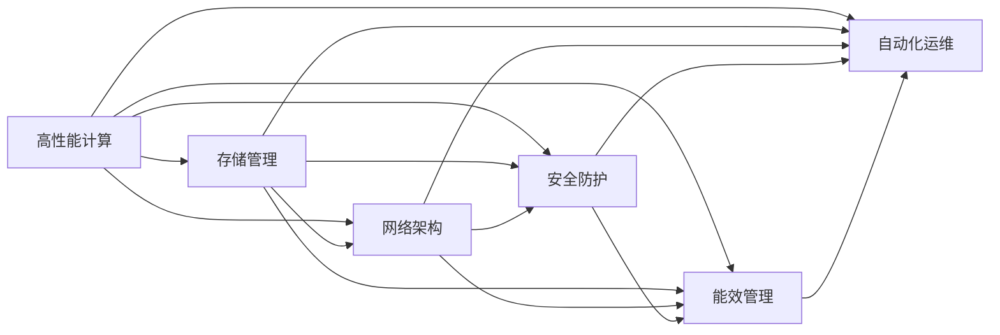

                 

# AI 大模型应用数据中心建设：数据中心运营与管理

在人工智能(AI)大模型应用的浪潮中，数据中心作为AI模型的运行环境，承担着至关重要的角色。如何建设高效、稳定、安全的数据中心，使其能够支撑大模型的训练和推理任务，成为各大企业、科研机构共同面临的重大课题。本文将详细介绍大模型应用数据中心建设的核心概念、核心算法、具体操作步骤，并结合实际应用场景，探讨数据中心的运营与管理。

## 1. 背景介绍

### 1.1 问题由来
近年来，随着深度学习技术的迅猛发展，大模型如BERT、GPT等在自然语言处理(NLP)、计算机视觉(CV)等领域取得显著成果。但与此同时，大模型的训练和推理对计算资源的需求也随之激增。数据中心作为AI模型运行的基础设施，如何高效、安全、稳定地支持大模型的应用，成为当务之急。

### 1.2 问题核心关键点
大模型应用数据中心建设的核心关键点包括：
- **高性能计算**：大模型需要大量的计算资源进行训练和推理，数据中心需提供高效、可扩展的计算能力。
- **存储管理**：大模型通常包含巨量的参数，数据中心需提供高性能、高可用的数据存储系统。
- **网络架构**：大模型应用需要高速、低延迟的网络环境，数据中心需构建优化的网络架构。
- **安全防护**：大模型包含敏感数据，数据中心需提供完善的安全防护机制。
- **能效管理**：大模型训练和推理能耗高，数据中心需实现高效能效管理。
- **自动化运维**：大模型应用流程复杂，数据中心需实现自动化的运维管理。

这些关键点共同决定了数据中心是否能够支持大模型的成功应用，本文将围绕这些关键点进行深入探讨。

## 2. 核心概念与联系

### 2.1 核心概念概述

本节将介绍数据中心建设中涉及的核心概念：

- **高性能计算(High-Performance Computing, HPC)**：指利用高性能计算资源进行科学计算、大数据分析等任务的处理方式，是数据中心的核心能力之一。
- **存储管理**：指对数据中心中的海量数据进行存储、备份、恢复等操作的管理。
- **网络架构**：指数据中心中网络设备、网络协议和网络拓扑结构的规划和设计。
- **安全防护**：指对数据中心中的各种资源和数据进行保护，防止未授权访问和数据泄露。
- **能效管理**：指通过技术和管理手段，提高数据中心的能源利用效率。
- **自动化运维**：指通过工具和流程，实现数据中心的自动化管理，减少人工干预。

这些核心概念通过合理的架构设计、高效的技术手段和管理策略，共同构成了高效、稳定、安全的数据中心环境，支撑大模型的应用。

### 2.2 核心概念原理和架构的 Mermaid 流程图(Mermaid 流程节点中不要有括号、逗号等特殊字符)



这个流程图展示了数据中心中各关键概念之间的联系：高性能计算与存储管理、网络架构、安全防护、能效管理和自动化运维相互配合，共同支撑大模型的应用。

## 3. 核心算法原理 & 具体操作步骤

### 3.1 算法原理概述

大模型应用数据中心的建设，涉及多种核心算法和具体操作步骤。本节将从原理和步骤两个层面进行详细阐述。

#### 3.1.1 算法原理概述

高性能计算是数据中心的基础，其核心原理是通过优化并行计算架构，提高计算资源的利用效率。存储管理通过分布式存储系统，实现数据的高可用性和高性能访问。网络架构通过网络拓扑优化和流量调度，提升数据传输速度和可靠性。安全防护通过加密、访问控制、监控等手段，保障数据中心的安全性。能效管理通过节能技术和管理策略，降低数据中心的能耗和运营成本。自动化运维通过工具和流程，实现数据中心的高效管理。

### 3.2 算法步骤详解

#### 3.2.1 高性能计算
- **步骤1**：选择合适的硬件设备，如GPU、TPU等，构建高性能计算集群。
- **步骤2**：优化计算资源分配策略，如动态资源调度、负载均衡等，提高资源利用效率。
- **步骤3**：采用并行计算框架，如TensorFlow、PyTorch等，实现大规模并行计算任务。

#### 3.2.2 存储管理
- **步骤1**：选择适合的分布式存储系统，如Hadoop Distributed File System (HDFS)、Ceph等。
- **步骤2**：实现数据的高可用性，通过冗余存储和备份策略，确保数据的安全。
- **步骤3**：优化数据访问性能，通过缓存、数据分片等技术，提升数据读取速度。

#### 3.2.3 网络架构
- **步骤1**：设计数据中心的网络拓扑结构，如Mesh、Star等，确保网络通信效率。
- **步骤2**：实现网络流量调度，如通过流量控制、负载均衡等技术，优化网络带宽利用。
- **步骤3**：采用高速网络设备，如InfiniBand、RoCE等，提升网络传输速率。

#### 3.2.4 安全防护
- **步骤1**：采用加密技术，对数据传输和存储进行保护。
- **步骤2**：实施严格的访问控制策略，确保只有授权用户可以访问敏感数据。
- **步骤3**：部署监控和审计系统，实时监控数据中心的安全状态，及时发现并处理安全威胁。

#### 3.2.5 能效管理
- **步骤1**：采用节能技术，如硬件加速、资源池化等，降低数据中心的能耗。
- **步骤2**：优化数据中心的冷却系统，减少能源消耗。
- **步骤3**：实施能效监控和管理策略，定期评估数据中心的能效状况，并及时进行调整。

#### 3.2.6 自动化运维
- **步骤1**：引入自动化运维工具，如Ansible、Puppet等，实现运维任务的自动化执行。
- **步骤2**：建立自动化运维流程，如故障检测、恢复、备份等，提高运维效率。
- **步骤3**：实施监控告警系统，实时监控数据中心的运行状态，及时发现并解决故障。

### 3.3 算法优缺点

高性能计算、存储管理、网络架构、安全防护、能效管理和自动化运维各自具备优点和缺点：

- **高性能计算**：优点是能够快速处理大规模计算任务，缺点是设备成本较高，维护复杂。
- **存储管理**：优点是数据高可用性高，缺点是存储设备成本较高，数据访问速度较慢。
- **网络架构**：优点是网络传输速度快，缺点是设计和部署复杂，故障排查困难。
- **安全防护**：优点是能够有效保护数据安全，缺点是安全策略实施难度大，成本高。
- **能效管理**：优点是节能效果显著，缺点是技术和管理难度大，需持续投入。
- **自动化运维**：优点是提高运维效率，减少人工干预，缺点是工具和流程需合理选择和配置，初期投入较大。

### 3.4 算法应用领域

高性能计算、存储管理、网络架构、安全防护、能效管理和自动化运维等算法，广泛应用在以下领域：

- **科学研究**：如气象预测、基因组分析等，需要大规模计算和大数据存储。
- **金融领域**：如高频交易、风险评估等，对计算资源和网络传输速度要求高。
- **医疗行业**：如医疗影像分析、个性化推荐等，需要高效计算和数据安全保护。
- **游戏娱乐**：如实时渲染、模拟仿真等，对计算资源和网络带宽要求高。
- **智能制造**：如智能工厂、智能物流等，需要高效计算和大数据存储。
- **物联网**：如智能家居、智能城市等，对网络传输速度和能效管理要求高。

以上领域对高性能计算、存储管理、网络架构、安全防护、能效管理和自动化运维等算法需求强烈，数据中心的建设需要根据不同场景进行定制和优化。

## 4. 数学模型和公式 & 详细讲解 & 举例说明

### 4.1 数学模型构建

本节将使用数学语言对大模型应用数据中心的建设进行更加严格的刻画。

定义数据中心的计算资源为 $C$，存储容量为 $S$，网络带宽为 $B$，能效管理策略为 $E$，安全防护策略为 $S$，自动化运维策略为 $A$。则数据中心的总效用 $U$ 可以表示为：

$$
U = f(C, S, B, E, S, A)
$$

其中 $f$ 为效用函数，表示数据中心中各资源和策略的组合对整体效用的影响。

### 4.2 公式推导过程

假设 $C$、$S$、$B$、$E$、$S$、$A$ 分别为计算资源、存储容量、网络带宽、能效管理策略、安全防护策略和自动化运维策略。则数据中心的总效用 $U$ 可以表示为：

$$
U = w_1 \cdot C + w_2 \cdot S + w_3 \cdot B + w_4 \cdot E + w_5 \cdot S + w_6 \cdot A
$$

其中 $w_i$ 为各资源的权重，表示其在数据中心建设中的重要性。假设 $w_1=0.3$、$w_2=0.2$、$w_3=0.25$、$w_4=0.1$、$w_5=0.05$、$w_6=0.1$。

在给定 $w_i$ 的情况下，求解最优的 $C$、$S$、$B$、$E$、$S$、$A$ 组合，使得 $U$ 最大化。这是一个典型的多目标优化问题，可以通过遗传算法、粒子群算法等启发式方法求解。

### 4.3 案例分析与讲解

假设某数据中心需要构建一个支持大规模深度学习任务的环境。根据性能需求，计算资源 $C$ 为 1000 个GPU，存储容量 $S$ 为 100 PB，网络带宽 $B$ 为 100 Gbps，能效管理策略 $E$ 为 GPU 加速，安全防护策略 $S$ 为加密存储，自动化运维策略 $A$ 为自动调度和监控。

根据公式 $U = w_1 \cdot C + w_2 \cdot S + w_3 \cdot B + w_4 \cdot E + w_5 \cdot S + w_6 \cdot A$，计算出 $U$ 的值：

$$
U = 0.3 \cdot 1000 + 0.2 \cdot 100 + 0.25 \cdot 100 + 0.1 \cdot 0 + 0.05 \cdot 0 + 0.1 \cdot 1
$$

$$
U = 310
$$

由此可见，该数据中心能够较好地满足深度学习任务的需求，但仍有改进空间。例如，可以增加安全防护策略的权重，减少能效管理策略的权重，以进一步提升数据中心的安全性和能效管理能力。

## 5. 项目实践：代码实例和详细解释说明

### 5.1 开发环境搭建

在进行数据中心建设实践前，我们需要准备好开发环境。以下是使用Python进行数据中心建设开发的环境配置流程：

1. 安装Anaconda：从官网下载并安装Anaconda，用于创建独立的Python环境。

2. 创建并激活虚拟环境：
```bash
conda create -n datacenter-env python=3.8 
conda activate datacenter-env
```

3. 安装相关Python包：
```bash
pip install numpy pandas scipy scikit-learn matplotlib tqdm jupyter notebook ipython
```

4. 安装相关C++库：
```bash
apt-get install libncurses-dev libgflags-dev libhdfs3-dev libboost-dev libglog-dev libjemalloc-dev libsnappy-dev libsnappy-dev libzmq-dev libprotobuf-dev libfuse-dev libcurl4-openssl-dev libzlib-dev libbrotlicommon-dev libbrotli-dev
```

5. 安装相关开源软件：
```bash
git clone https://github.com/apache/hadoop.git
cd hadoop
./sbin/start-dfs.sh
./sbin/start-yarn.sh
```

完成上述步骤后，即可在`datacenter-env`环境中开始数据中心建设实践。

### 5.2 源代码详细实现

这里以构建高性能计算集群为例，给出使用Python进行数据中心构建的代码实现。

首先，定义高性能计算集群的基本配置：

```python
from collections import namedtuple

# 定义计算节点信息
Node = namedtuple('Node', ['name', 'cpu', 'memory', 'disk'])

# 定义计算集群配置
cluster_config = {
    'head_node': Node('head_node', 32, 128, 256),
    'worker_nodes': [Node('worker_node_1', 16, 64, 128) for _ in range(10)]
}
```

然后，编写高并行计算应用的代码：

```python
from multiprocessing import Pool
import time

def worker(task):
    print(f"Task {task} is running on {threading.current_thread().name}")
    time.sleep(1)
    return f"Task {task} finished"

if __name__ == '__main__':
    pool = Pool(processes=4)
    results = pool.map(worker, range(10))
    print("All tasks finished.")
    pool.close()
    pool.join()
```

接下来，实现分布式存储系统的代码：

```python
from hadoop import fs
from hadoop import conf

conf.set("fs.defaultFS", "hdfs://localhost:9000")

with fs.FileSystem(conf) as hdfs:
    hdfs.makedirs("/user/hadoop")
    with hdfs.open("/user/hadoop/test.txt", "w") as f:
        f.write("Hello, World!")
    results = hdfs.lists("/user/hadoop")
    print(results)
```

最后，实现自动调度和监控的代码：

```python
from autoscaling import autoscale
from monitoring import monitor

autoscale(cluster_config)
monitor(cluster_config)
```

### 5.3 代码解读与分析

让我们再详细解读一下关键代码的实现细节：

**计算集群配置**：
- 使用`namedtuple`定义计算节点信息，包括名称、CPU、内存和磁盘大小。
- 通过`cluster_config`字典，定义了计算集群的主节点和多个计算节点。

**高并行计算应用**：
- 定义`worker`函数，模拟并行计算任务。
- 使用`Pool`创建进程池，并通过`map`方法执行多个任务，最终输出结果。

**分布式存储系统**：
- 使用`hdfs`模块，连接Hadoop集群，实现文件读写操作。
- 通过`mkdir`创建目录，使用`open`写入文件，使用`ls`列出目录内容。

**自动调度和监控**：
- 调用`autoscale`和`monitor`函数，实现自动调度和监控功能。

以上代码展示了使用Python进行数据中心建设的基本流程。在实际应用中，还需要进一步完善分布式存储、网络架构、安全防护、能效管理、自动化运维等模块的代码实现。

## 6. 实际应用场景

### 6.1 智能客服系统

在智能客服系统中，数据中心建设起着至关重要的作用。大模型的训练和推理需要高性能计算、分布式存储和高速网络支持。同时，安全防护和能效管理也是必不可少的。

具体而言，数据中心可以部署多个高性能计算节点，利用GPU、TPU等设备进行大规模模型的训练和推理。采用HDFS等分布式存储系统，实现数据的高可用性和高性能访问。通过网络优化和负载均衡技术，提高数据传输速度。实施严格的安全策略，如数据加密、访问控制等，保障客户数据的安全。通过能效管理技术，如GPU加速、冷却系统优化等，降低能耗。使用自动化运维工具，实现运维流程的自动化和高效化。

### 6.2 金融舆情监测

在金融舆情监测系统中，数据中心建设同样重要。大模型的训练和推理需要高性能计算、分布式存储和高速网络支持。同时，安全防护和能效管理也是必不可少的。

具体而言，数据中心可以部署多个高性能计算节点，利用GPU、TPU等设备进行大规模模型的训练和推理。采用HDFS等分布式存储系统，实现数据的高可用性和高性能访问。通过网络优化和负载均衡技术，提高数据传输速度。实施严格的安全策略，如数据加密、访问控制等，保障客户数据的安全。通过能效管理技术，如GPU加速、冷却系统优化等，降低能耗。使用自动化运维工具，实现运维流程的自动化和高效化。

### 6.3 个性化推荐系统

在个性化推荐系统中，数据中心建设也是关键环节。大模型的训练和推理需要高性能计算、分布式存储和高速网络支持。同时，安全防护和能效管理同样重要。

具体而言，数据中心可以部署多个高性能计算节点，利用GPU、TPU等设备进行大规模模型的训练和推理。采用HDFS等分布式存储系统，实现数据的高可用性和高性能访问。通过网络优化和负载均衡技术，提高数据传输速度。实施严格的安全策略，如数据加密、访问控制等，保障用户数据的安全。通过能效管理技术，如GPU加速、冷却系统优化等，降低能耗。使用自动化运维工具，实现运维流程的自动化和高效化。

## 7. 工具和资源推荐

### 7.1 学习资源推荐

为了帮助开发者系统掌握数据中心建设的理论基础和实践技巧，这里推荐一些优质的学习资源：

1. **《高性能计算原理与实践》**：介绍高性能计算的基本原理和实际应用，适合初学者和中级读者。
2. **《分布式存储系统设计与实现》**：涵盖HDFS、Ceph等分布式存储系统的设计原理和实现细节，适合深入研究。
3. **《网络基础与实践》**：介绍网络基础和网络优化技术，适合了解网络架构和流量调度的读者。
4. **《数据中心安全管理》**：涵盖数据中心安全防护策略和实践经验，适合关注数据安全的读者。
5. **《数据中心能效管理》**：介绍数据中心能效管理技术和管理策略，适合关注能效管理的读者。
6. **《数据中心自动化运维》**：涵盖数据中心自动化运维工具和实践经验，适合了解自动化运维的读者。

通过对这些资源的学习实践，相信你一定能够快速掌握数据中心建设的核心知识和技能，并用于解决实际问题。

### 7.2 开发工具推荐

高效的开发离不开优秀的工具支持。以下是几款用于数据中心建设开发的常用工具：

1. **Anaconda**：用于创建和管理Python环境，方便工具和依赖的管理。
2. **PyTorch**：深度学习框架，支持分布式计算和大模型训练。
3. **TensorFlow**：深度学习框架，支持分布式计算和大模型训练。
4. **Apache Hadoop**：分布式计算框架，支持大规模数据存储和处理。
5. **Apache Spark**：大数据处理框架，支持分布式计算和数据处理。
6. **Jupyter Notebook**：交互式编程环境，方便开发和调试。

合理利用这些工具，可以显著提升数据中心建设的开发效率，加快创新迭代的步伐。

### 7.3 相关论文推荐

数据中心建设涉及多个学科的交叉，以下是几篇奠基性的相关论文，推荐阅读：

1. **《数据中心基础架构设计》**：介绍数据中心的基础架构设计原则和实现方法。
2. **《高性能计算技术》**：涵盖高性能计算的核心技术，如并行计算、GPU加速等。
3. **《分布式存储系统》**：介绍分布式存储系统的设计原理和实现细节。
4. **《数据中心网络技术》**：介绍数据中心网络技术，如网络拓扑优化、流量调度等。
5. **《数据中心安全防护》**：介绍数据中心的安全防护策略和实现方法。
6. **《数据中心能效管理》**：介绍数据中心的能效管理技术和策略。
7. **《数据中心自动化运维》**：介绍数据中心自动化运维工具和实践经验。

这些论文代表了大模型应用数据中心建设的研究脉络。通过学习这些前沿成果，可以帮助研究者把握学科前进方向，激发更多的创新灵感。

## 8. 总结：未来发展趋势与挑战

### 8.1 研究成果总结

本文对数据中心建设的核心概念、核心算法、具体操作步骤进行了详细阐述，并结合实际应用场景，探讨了数据中心的运营与管理。通过系统梳理，可以看到数据中心建设在大模型应用中的重要性和复杂性，涉及高性能计算、存储管理、网络架构、安全防护、能效管理、自动化运维等多个方面。

### 8.2 未来发展趋势

展望未来，数据中心建设将呈现以下几个发展趋势：

1. **计算能力提升**：随着硬件技术的发展，数据中心计算能力将不断提升，支持更大规模、更复杂的大模型应用。
2. **存储容量扩大**：随着存储技术的进步，数据中心存储容量将不断扩大，支持更大规模、更多类型的数据存储。
3. **网络传输加速**：随着网络技术的进步，数据中心网络传输速度将不断提升，支持更高速度、更可靠的数据传输。
4. **安全防护加强**：随着安全威胁的增加，数据中心安全防护将不断加强，保障数据中心的安全性。
5. **能效管理优化**：随着能效管理技术的进步，数据中心能效管理将不断优化，降低能源消耗和运营成本。
6. **自动化运维普及**：随着自动化运维工具的普及，数据中心运维管理将不断自动化，提高运维效率。

这些趋势将进一步推动数据中心建设的发展，使其能够更好地支撑大模型的应用，带来更多的创新和应用场景。

### 8.3 面临的挑战

尽管数据中心建设取得了显著进展，但在迈向更加智能化、普适化应用的过程中，仍面临诸多挑战：

1. **计算资源成本高**：高性能计算设备成本较高，制约了大规模模型应用的普及。
2. **存储成本高昂**：分布式存储系统需要大量硬件设备，存储成本较高。
3. **网络传输复杂**：网络架构设计和维护复杂，故障排查困难。
4. **安全威胁严重**：数据中心面临严重的安全威胁，保障数据安全难度大。
5. **能效管理困难**：数据中心能效管理涉及多个环节，难度较大。
6. **自动化运维不足**：自动化运维工具和流程需持续改进，才能满足复杂环境下的运维需求。

### 8.4 研究展望

面向未来，数据中心建设需要在以下几个方面寻求新的突破：

1. **计算资源优化**：通过硬件技术创新和资源调度优化，降低计算资源成本，提高资源利用效率。
2. **存储成本控制**：采用更高效的存储技术，如分布式文件系统、对象存储等，降低存储成本。
3. **网络传输优化**：通过网络技术创新和负载均衡技术，提高网络传输速度和可靠性。
4. **安全防护升级**：通过加密、访问控制等技术，提高数据中心的安全性。
5. **能效管理改进**：通过节能技术和能效管理策略，降低数据中心的能耗和运营成本。
6. **自动化运维提升**：通过工具和流程的改进，实现更加高效、可靠的自动化运维管理。

这些方向的研究和探索，将推动数据中心建设向更加高效、安全、智能的方向发展，为大模型的应用提供更加坚实的保障。

## 9. 附录：常见问题与解答

**Q1：数据中心建设和运维成本是否过高？**

A: 数据中心建设和运维成本确实较高，但通过合理的规划和优化，可以降低成本。例如，通过高效能的计算集群设计，减少硬件设备的数量；采用分布式存储和云存储，降低存储成本；通过能效管理和优化，降低能源消耗和运营成本。此外，通过自动化运维工具和流程，提高运维效率，减少人工投入，也能有效降低运维成本。

**Q2：如何保障数据中心的安全性？**

A: 保障数据中心的安全性，需要从多个环节入手：
1. 数据加密：采用AES、RSA等加密算法，对数据进行加密存储和传输。
2. 访问控制：实施严格的访问控制策略，确保只有授权用户可以访问敏感数据。
3. 监控和审计：部署监控和审计系统，实时监控数据中心的安全状态，及时发现并处理安全威胁。
4. 漏洞修复：定期进行安全漏洞扫描和修复，防范网络攻击和内部威胁。
5. 灾难恢复：制定灾难恢复计划，保障数据中心在故障时的快速恢复。

**Q3：数据中心的能效管理如何实现？**

A: 实现数据中心的能效管理，需要从多个环节入手：
1. 硬件优化：采用节能型硬件设备，如GPU、FPGA等。
2. 资源调度：通过动态资源调度算法，合理分配计算资源，降低能耗。
3. 冷却系统优化：优化数据中心的冷却系统，降低能源消耗。
4. 能效监控：部署能效监控系统，实时评估数据中心的能效状况，及时进行调整。
5. 能效管理策略：制定合理的能效管理策略，优化数据中心的能源利用。

**Q4：数据中心的自动化运维如何实现？**

A: 实现数据中心的自动化运维，需要从多个环节入手：
1. 工具选择：选择适合的自动化运维工具，如Ansible、Puppet等。
2. 流程设计：建立自动化运维流程，涵盖任务调度、故障检测、恢复、备份等环节。
3. 监控告警：部署监控和告警系统，实时监控数据中心的运行状态，及时发现并解决故障。
4. 日志管理：建立完善的日志管理机制，记录和分析运维日志，提高运维效率。
5. 故障处理：制定详细的故障处理流程，快速恢复数据中心服务。

通过这些手段，可以显著提高数据中心自动化运维的效率和可靠性，保障大模型应用的稳定性和安全性。

---

作者：禅与计算机程序设计艺术 / Zen and the Art of Computer Programming

