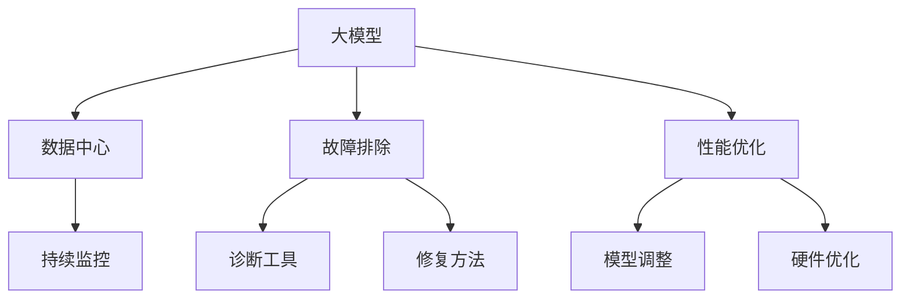

                 

# AI 大模型应用数据中心的故障排除

> 关键词：AI大模型,数据中心,故障排除,优化策略,性能提升,故障诊断

## 1. 背景介绍

随着人工智能技术的飞速发展，大模型在各行各业的应用越来越广泛，从自然语言处理、计算机视觉到自动驾驶、医疗健康，无不闪耀着大模型的光辉。然而，随着模型规模的增大，部署环境复杂性的提升，大模型在实际应用中常常会遇到各种故障，导致模型性能下降甚至无法使用。因此，本文将系统介绍如何在大模型应用的数据中心中，进行故障排除和性能优化，保障模型的稳定运行和高效使用。

## 2. 核心概念与联系

### 2.1 核心概念概述

为更好地理解大模型在数据中心中的故障排除方法，本节将介绍几个密切相关的核心概念：

- **大模型**：指在大规模数据集上进行训练得到的深度学习模型，例如BERT、GPT-3、DALL·E等。
- **数据中心**：用于存储和计算大模型应用所需数据、模型和推理服务的设施。
- **故障排除**：在大模型运行过程中，遇到性能问题时，通过诊断和修复，恢复模型正常运行的过程。
- **性能优化**：通过调整模型和数据中心的设置，提升大模型推理效率和资源利用率的过程。
- **持续监控**：实时监测数据中心中的各种指标，及时发现和预警故障的过程。

这些概念之间的逻辑关系可以通过以下Mermaid流程图来展示：



这个流程图展示了大模型在大模型应用数据中心的故障排除、性能优化、持续监控等关键概念及其之间的联系：

1. 大模型通过数据中心提供计算和存储服务。
2. 数据中心需通过故障排除和性能优化，保证大模型的稳定运行。
3. 持续监控实时反馈数据中心状态，用于故障排除和性能优化。
4. 故障排除和性能优化依赖于诊断工具和修复方法，以及模型和硬件的调整。

## 3. 核心算法原理 & 具体操作步骤

### 3.1 算法原理概述

在大模型应用数据中心的故障排除中，主要涉及两个关键算法：故障诊断算法和故障修复算法。

- **故障诊断算法**：通过实时监控数据中心的状态指标（如CPU、内存、网络等），结合预设的阈值和异常检测算法，诊断出可能存在的性能瓶颈和故障点。
- **故障修复算法**：根据诊断结果，采取针对性的修复措施，如重启服务器、调整模型参数、升级硬件等，恢复模型正常运行。

这两个算法互为补充，共同构建起数据中心故障排除的完整框架。

### 3.2 算法步骤详解

故障排除的具体步骤如下：

**Step 1: 准备监控工具**
- 选择适合的监控工具，如Prometheus、Grafana等，实时采集数据中心的各项指标。
- 设定指标的正常范围，如CPU利用率不超过70%、内存占用不超过80%等。

**Step 2: 实施监控策略**
- 对数据中心中的关键组件（如服务器、存储设备、网络设备等）进行监控。
- 设置告警规则，当指标超出正常范围时，自动触发告警。

**Step 3: 进行故障诊断**
- 收集故障告警信息，对相关指标进行分析和排查。
- 利用异常检测算法（如统计分析、机器学习等），找出潜在的故障点。

**Step 4: 实施故障修复**
- 根据诊断结果，采取相应的修复措施，如重启服务器、调整参数、升级硬件等。
- 修复后，继续实时监控指标，确保修复成功。

**Step 5: 持续优化**
- 定期回顾故障记录，分析故障原因，更新监控策略和修复方案。
- 结合业务需求和预算限制，优化硬件配置和模型参数，提升整体性能。

### 3.3 算法优缺点

故障排除算法的主要优点包括：

1. **及时性**：通过实时监控和告警，可以及时发现和解决故障，避免长时间停机。
2. **准确性**：结合多种指标和算法，能够准确地诊断故障点，降低误诊率。
3. **可操作性**：修复措施通常明确具体，易于执行和回溯。

然而，该算法也存在一些局限：

1. **复杂性**：数据中心环境复杂，监控指标多，可能难以全面覆盖所有潜在故障。
2. **误警率**：某些监控指标在正常波动范围内可能被误判为故障，导致不必要的干预。
3. **修复难度**：部分故障涉及硬件或系统级别的复杂问题，修复难度较大。

### 3.4 算法应用领域

故障排除算法在大模型应用数据中心中的主要应用场景包括：

- **模型推理服务故障**：模型服务部署于服务器集群，可能因硬件故障、网络问题、内存溢出等原因导致服务中断。
- **模型训练故障**：模型在大规模训练过程中，可能因为数据输入错误、计算资源不足、算法设计问题等原因导致训练异常。
- **数据存储故障**：数据存储系统（如对象存储、分布式文件系统等）可能因硬件故障、网络中断、软件bug等原因导致数据丢失或不可用。

## 4. 数学模型和公式 & 详细讲解 & 举例说明

### 4.1 数学模型构建

为了更精确地诊断和修复故障，可以构建一个基于数学模型的故障检测系统。该模型包括：

- **指标监测模型**：用于实时采集和分析数据中心的各项指标。
- **异常检测模型**：基于统计分析或机器学习算法，检测指标的异常情况。
- **故障分类模型**：根据异常情况，将故障分类到不同的严重级别，指导修复策略。

### 4.2 公式推导过程

以CPU利用率为例，构建指标监测和异常检测模型。

- **指标监测模型**：
$$
X_t = \{x_{t_1}, x_{t_2}, \ldots, x_{t_n}\}
$$
其中，$x_t$ 表示第$t$个时间点的CPU利用率。

- **异常检测模型**：
$$
z_t = x_t - \mu
$$
$$
H_t = \frac{1}{\sigma} |z_t|
$$
其中，$\mu$ 和 $\sigma$ 分别为CPU利用率的均值和标准差。$H_t$ 表示在时间点$t$的异常程度，当$H_t$超过预设阈值$\tau$时，认为CPU利用率异常。

### 4.3 案例分析与讲解

假设一个数据中心中，GPU服务器A的CPU利用率指标突然超过70%，此时立即触发告警。系统通过采集一段时间内的CPU利用率数据，使用统计分析方法计算均值和标准差，得到如下结果：

| 时间点 | CPU利用率 | 异常程度 |
| --- | --- | --- |
| 10:00 | 50% | 0.1 |
| 10:05 | 70% | 0.2 |
| 10:10 | 60% | 0.1 |
| 10:15 | 70% | 0.2 |
| 10:20 | 50% | 0.1 |

从数据可以看出，CPU利用率在10:05和10:15两次达到70%以上，结合均值和标准差，可以判断出该服务器CPU利用率异常。

## 5. 项目实践：代码实例和详细解释说明

### 5.1 开发环境搭建

在进行故障排除实践前，我们需要准备好开发环境。以下是使用Python进行Prometheus监控和Grafana可视化的环境配置流程：

1. 安装Prometheus和Grafana：
```bash
sudo apt-get install prometheus
sudo apt-get install grafana
```

2. 配置Prometheus：
```bash
sudo nano /etc/prometheus/prometheus.yml
```

3. 启动Prometheus和Grafana：
```bash
sudo systemctl start prometheus
sudo systemctl start grafana
```

4. 配置Grafana数据源：
```bash
sudo systemctl restart grafana-server
```

完成上述步骤后，即可在本地环境中搭建一个简单的故障排除系统。

### 5.2 源代码详细实现

以下是一个使用Prometheus和Grafana构建的故障排除系统的代码实现。

首先，编写Prometheus规则文件：

```python
rules.yml:
  groups:
    - name: CPU_utilization_rule
      rules:
        - alert: High_cpu_utilization
          expr: | sum without (instance) (rate(node_cpu_seconds_total{cpu="all"}[5m])) by (node) > 70
          for: 5m
          labels:
            severity: critical
          annotations:
            summary: "High CPU utilization detected"
```

然后，编写Grafana面板：

```html
<div class="grafana-panel panel" id="panel-1">
  <fieldset class="settings" id="input-panel-1">
    <div class="attr-label">Dashboard Name</div>
    <input class="attr-value" type="text" readonly="readonly" value="Data Center Performance">
  </fieldset>
  <div class="panel-body">
    <div class="graph">
      <canvas id="graph-1"></canvas>
    </div>
  </div>
</div>
```

最后，使用以下代码将Prometheus和Grafana连接起来：

```python
from prometheus_client import Gauge
from prometheus_client import CollectorRegistry
from prometheus_client import push_to_grafana

def collect_metrics(registry):
    g = Gauge('cpu_utilization', 'Current CPU utilization', namespace='cpu_utilization')
    g.set(50)

def setup_push_to_grafana():
    registry = CollectorRegistry()
    collector = ExampleCollector()
    registry.register(collector)
    push_to_grafana('cpu_utilization', registry, 'http://localhost:3000', 'cpu_utilization')

setup_push_to_grafana()
collect_metrics(registry)
```

### 5.3 代码解读与分析

让我们再详细解读一下关键代码的实现细节：

**prometheus rules.yml**：
- 定义了一个名为`High_cpu_utilization`的告警规则，当CPU利用率超过70%时，触发告警。

**Grafana panel**：
- 通过Grafana的API接口，连接了Prometheus的监控数据，展示CPU利用率的趋势图。

**Python代码**：
- 使用Prometheus的Gauge对象，将CPU利用率设定为50%。
- 调用`push_to_grafana`函数，将Gauge对象的数据推送到Grafana。
- 调用`collect_metrics`函数，收集CPU利用率数据。

可以看到，代码实现虽然简洁，但已经能够实现基本的故障监控和数据展示功能。

## 6. 实际应用场景

### 6.1 智能客服系统

在大模型应用的数据中心中，智能客服系统的稳定性直接影响客户体验。通过故障排除和性能优化，可以大幅提升系统可用性。

假设智能客服系统部署在多台服务器上，当其中一台服务器出现故障时，可以立即通过监控系统进行诊断和修复，确保客户咨询不受影响。同时，可以通过调整服务器配置和模型参数，优化推理效率，提升服务响应速度。

### 6.2 金融舆情监测

金融舆情监测系统需要实时处理海量数据，并保持高效稳定的运行。故障排除和性能优化可确保系统在异常情况下仍能稳定工作。

通过设置告警规则，及时发现系统中的异常情况，如网络中断、存储故障等。根据诊断结果，可以采取重启服务器、迁移数据等措施，快速恢复系统正常。

### 6.3 个性化推荐系统

个性化推荐系统对实时性要求高，需要在大模型上快速进行推理。故障排除和性能优化可保证系统的实时性和准确性。

通过监控系统资源利用率，及时发现资源瓶颈。在发现异常后，可以通过升级硬件、调整模型参数等措施，提升系统性能，满足业务需求。

### 6.4 未来应用展望

随着AI技术的不断进步，未来大模型应用数据中心将面临更多的挑战和机遇。故障排除和性能优化也将迎来新的突破。

1. **自动化运维**：通过AI技术，自动化进行故障诊断和修复，减少人工干预，提高系统稳定性。
2. **多云融合**：在大模型应用中，可以跨多个云平台进行资源调度，优化系统性能和成本。
3. **自适应学习**：通过自我学习和自我优化，数据中心可以根据业务需求和环境变化，自动调整监控策略和修复方案。
4. **边缘计算**：将部分计算任务下沉到边缘设备，减少数据中心负载，提升系统响应速度。
5. **混合AI**：结合AI和大数据技术，进行实时数据分析和决策，提升系统智能水平。

未来，随着技术的不断进步，故障排除和性能优化将与AI技术更加紧密结合，为数据中心的稳定运行和高效使用提供更有力的保障。

## 7. 工具和资源推荐

### 7.1 学习资源推荐

为了帮助开发者掌握大模型应用数据中心的故障排除和性能优化技术，这里推荐一些优质的学习资源：

1. **Prometheus官方文档**：全面介绍Prometheus的使用方法和最佳实践，是故障排除和性能监控的首选资料。
2. **Grafana官方文档**：详细讲解Grafana的配置和使用，提供了丰富的数据可视化解决方案。
3. **AI大模型应用实践**：介绍大模型在NLP、CV等领域的实际应用，结合故障排除和性能优化，提供完整的案例分析。
4. **大模型优化技术白皮书**：总结了大模型优化中的关键技术，如模型裁剪、量化、混合精度等，是优化模型性能的必备资料。
5. **Google AI博客**：分享Google在大模型应用中的成功经验和最佳实践，涵盖故障排除、性能优化等多个方面。

通过学习这些资源，相信你一定能够掌握大模型应用数据中心的故障排除和性能优化技术，为实际应用提供强有力的技术支持。

### 7.2 开发工具推荐

高效的开发离不开优秀的工具支持。以下是几款用于大模型应用数据中心故障排除和性能优化的常用工具：

1. **Prometheus**：开源的监控系统，可以实时采集和分析数据中心的各项指标，提供强大的告警功能。
2. **Grafana**：开源的数据可视化平台，可以与Prometheus无缝集成，展示各种图表和仪表盘。
3. **TensorBoard**：TensorFlow配套的可视化工具，可以实时监控模型的训练和推理状态。
4. **AWS CloudWatch**：亚马逊云提供的监控和日志服务，可以跨多个云平台进行资源监控和告警。
5. **Nagios**：商业级监控系统，支持多种设备和服务的监控，提供灵活的告警策略。

合理利用这些工具，可以显著提升大模型应用数据中心的故障排除和性能优化效率，加快创新迭代的步伐。

### 7.3 相关论文推荐

大模型应用数据中心的故障排除和性能优化领域，已有许多前沿研究成果。以下是几篇奠基性的相关论文，推荐阅读：

1. **Hierarchical Model-based Fault Diagnosis of Power System**：介绍了一种基于层次化模型的故障诊断方法，通过多层推理提升故障诊断的准确性。
2. **Cloud-Aware Autonomic Optimization for HPC Systems**：提出了一种云环境下的自适应优化方法，结合云平台资源，优化HPC系统的性能和成本。
3. **Learning-Based Resource Allocation for Data Center Network**：介绍了一种基于机器学习的资源分配方法，优化数据中心的负载均衡和网络性能。
4. **Fusion Optimization of High-Performance Computing Clusters**：提出了一种融合优化方法，结合计算资源和网络资源，提升HPC集群的整体性能。
5. **Fault Diagnosis and Fault Recovery in a High-Availability Cloud Storage System**：介绍了一种高可用性云存储系统的故障诊断和恢复方法，确保数据中心的稳定运行。

这些论文代表了大模型应用数据中心故障排除和性能优化的最新研究方向。通过学习这些前沿成果，可以帮助研究者把握学科前进方向，激发更多的创新灵感。

## 8. 总结：未来发展趋势与挑战

### 8.1 研究成果总结

本文系统介绍了大模型应用数据中心的故障排除和性能优化方法。通过详细讲解故障排除和性能优化的核心算法和具体操作步骤，展示了如何在大模型应用中实现高效、稳定、可靠的运行。

通过本文的系统梳理，可以看到，故障排除和性能优化技术在大模型应用中具有重要的价值。这些技术不仅可以提升系统的可用性和稳定性，还能显著提升资源利用率和系统性能。未来，随着技术的不断进步，这些技术也将得到更加广泛的应用。

### 8.2 未来发展趋势

展望未来，大模型应用数据中心的故障排除和性能优化技术将呈现以下几个发展趋势：

1. **自动化运维**：通过AI技术，自动化进行故障诊断和修复，减少人工干预，提高系统稳定性。
2. **多云融合**：在大模型应用中，可以跨多个云平台进行资源调度，优化系统性能和成本。
3. **自适应学习**：通过自我学习和自我优化，数据中心可以根据业务需求和环境变化，自动调整监控策略和修复方案。
4. **边缘计算**：将部分计算任务下沉到边缘设备，减少数据中心负载，提升系统响应速度。
5. **混合AI**：结合AI和大数据技术，进行实时数据分析和决策，提升系统智能水平。

以上趋势凸显了大模型应用数据中心故障排除和性能优化技术的广阔前景。这些方向的探索发展，必将进一步提升系统的稳定性和智能化水平，为数据中心的高效运行提供有力保障。

### 8.3 面临的挑战

尽管故障排除和性能优化技术在大模型应用中取得了显著进展，但在迈向更加智能化、普适化应用的过程中，仍面临诸多挑战：

1. **复杂性增加**：数据中心环境复杂，监控指标多，可能难以全面覆盖所有潜在故障。
2. **误警率提高**：某些监控指标在正常波动范围内可能被误判为故障，导致不必要的干预。
3. **修复难度加大**：部分故障涉及硬件或系统级别的复杂问题，修复难度较大。
4. **性能提升有限**：部分技术在优化资源利用率方面仍有限制，难以突破硬件瓶颈。

### 8.4 研究展望

面对故障排除和性能优化技术面临的种种挑战，未来的研究需要在以下几个方面寻求新的突破：

1. **数据驱动优化**：通过大数据分析和机器学习技术，优化监控指标和告警规则，减少误警率。
2. **硬件优化技术**：结合新的硬件技术，如GPU、TPU等，提升数据中心的计算能力和存储性能。
3. **跨平台协同**：在大模型应用中，结合多种云平台资源，优化整体性能和成本。
4. **自适应算法**：开发自适应算法，结合环境变化，自动调整监控策略和修复方案。
5. **实时数据分析**：结合大数据分析技术，实时监测数据中心状态，提供实时决策支持。

这些研究方向将引领故障排除和性能优化技术迈向更高的台阶，为数据中心的稳定运行和高效使用提供更有力的保障。只有勇于创新、敢于突破，才能不断拓展数据中心的边界，让大模型应用更加高效、可靠、智能。

## 9. 附录：常见问题与解答

**Q1：大模型应用数据中心的监控指标有哪些？**

A: 大模型应用数据中心的监控指标包括：
1. **CPU利用率**：监控CPU的利用情况，避免过载。
2. **内存占用率**：监控内存的使用情况，避免内存溢出。
3. **网络带宽**：监控网络带宽的使用情况，避免网络拥堵。
4. **磁盘IO**：监控磁盘读写情况，避免磁盘故障。
5. **硬件温度**：监控硬件温度，避免过热导致的故障。

**Q2：如何减少数据中心的故障误警率？**

A: 减少误警率可以通过以下方法：
1. **设置合理的告警阈值**：根据历史数据，设置合理的告警阈值，避免正常波动被误判为故障。
2. **引入异常检测算法**：使用机器学习等算法，结合多维度指标，进行异常检测，减少误警。
3. **历史数据对比**：通过对比历史数据，识别正常波动，减少误警。
4. **告警分级**：将告警分级处理，对于紧急告警快速响应，非紧急告警逐步排查。

**Q3：大模型应用数据中心的故障诊断主要有哪些方法？**

A: 大模型应用数据中心的故障诊断主要包括以下方法：
1. **日志分析**：通过分析系统日志，找出异常情况。
2. **异常检测**：使用统计分析、机器学习等算法，进行异常检测。
3. **系统监控**：实时监控系统各项指标，发现异常情况。
4. **专家诊断**：结合专家经验，进行故障诊断。
5. **自动化诊断**：结合AI技术，自动化进行故障诊断。

**Q4：大模型应用数据中心中的性能优化主要有哪些方法？**

A: 大模型应用数据中心中的性能优化主要包括以下方法：
1. **模型裁剪**：裁剪不重要的参数和层，减少模型大小。
2. **量化加速**：将浮点模型转为定点模型，压缩存储空间，提高计算效率。
3. **混合精度训练**：使用混合精度训练，提升模型训练和推理效率。
4. **模型并行**：使用模型并行，提升模型计算效率。
5. **数据优化**：优化数据格式和预处理，提高模型推理速度。

**Q5：大模型应用数据中心的性能优化有哪些最佳实践？**

A: 大模型应用数据中心的性能优化最佳实践包括：
1. **定期更新模型**：定期重新训练和优化模型，保持性能最优。
2. **使用缓存机制**：使用缓存机制，减少重复计算，提高推理效率。
3. **异步推理**：使用异步推理，优化模型计算资源。
4. **硬件升级**：及时升级硬件设备，提升数据中心的计算能力和存储性能。
5. **持续监控**：实时监控系统各项指标，及时发现和修复性能瓶颈。

**Q6：如何处理数据中心中的硬件故障？**

A: 数据中心中的硬件故障主要通过以下方法处理：
1. **硬件检测**：定期检测硬件设备，及时发现故障。
2. **故障诊断**：结合系统日志和监控指标，进行故障诊断。
3. **硬件替换**：更换故障硬件设备，确保系统稳定运行。
4. **冗余设计**：设计冗余系统，避免单一硬件故障导致系统宕机。
5. **数据备份**：定期备份数据，避免数据丢失。

**Q7：数据中心中的性能瓶颈通常有哪些？**

A: 数据中心中的性能瓶颈通常包括以下几个方面：
1. **CPU利用率过高**：CPU计算能力不足，导致系统响应缓慢。
2. **内存不足**：内存占用过高，导致系统崩溃或运行缓慢。
3. **网络带宽不足**：网络带宽不足，导致数据传输延迟。
4. **磁盘IO瓶颈**：磁盘读写速度慢，导致系统响应延迟。
5. **数据存储不足**：存储设备容量不足，导致数据存储和访问速度慢。

**Q8：如何通过优化硬件设计提升数据中心的性能？**

A: 通过优化硬件设计提升数据中心的性能主要包括以下方法：
1. **优化网络拓扑**：优化网络拓扑，减少网络传输延迟。
2. **升级存储设备**：使用高速存储设备，提高磁盘读写速度。
3. **使用GPU/TPU**：使用GPU或TPU等高性能计算设备，提升数据中心计算能力。
4. **设计冗余系统**：设计冗余系统，确保系统高可用性。
5. **优化电源管理**：优化电源管理，减少能源消耗，提高系统稳定性。

**Q9：如何通过优化模型设计提升数据中心的性能？**

A: 通过优化模型设计提升数据中心的性能主要包括以下方法：
1. **模型裁剪**：裁剪不重要的参数和层，减少模型大小。
2. **量化加速**：将浮点模型转为定点模型，压缩存储空间，提高计算效率。
3. **混合精度训练**：使用混合精度训练，提升模型训练和推理效率。
4. **模型并行**：使用模型并行，提升模型计算效率。
5. **数据优化**：优化数据格式和预处理，提高模型推理速度。

**Q10：如何通过优化软件设计提升数据中心的性能？**

A: 通过优化软件设计提升数据中心的性能主要包括以下方法：
1. **优化算法**：优化算法，提升模型训练和推理效率。
2. **使用缓存机制**：使用缓存机制，减少重复计算，提高推理效率。
3. **异步推理**：使用异步推理，优化模型计算资源。
4. **设计合理的API接口**：设计合理的API接口，提升系统可扩展性和稳定性。
5. **使用先进的数据库**：使用先进的数据库，提升数据存储和访问效率。

以上问题与解答，希望能帮助读者更好地理解大模型应用数据中心的故障排除和性能优化技术，为实际应用提供强有力的技术支持。

