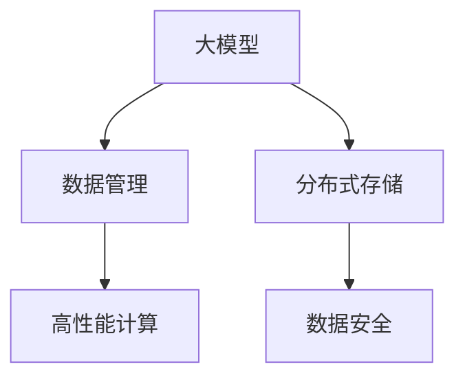

                 

## 1. 背景介绍

在大模型（AI Large Models）的应用场景中，数据中心的数据管理架构是至关重要的。它不仅决定了数据中心的稳定性和效率，还直接影响到模型的训练和应用效果。本文将深入探讨AI大模型应用数据中心的数据管理架构，包括其核心概念、原理、操作步骤、数学模型、应用案例、项目实践以及未来展望。

## 2. 核心概念与联系

### 2.1 核心概念概述

在大模型应用数据中心，涉及多个核心概念，包括大模型、数据管理、分布式存储、高性能计算、数据安全等。以下是这些核心概念的简要概述：

- **大模型**：指大规模的神经网络模型，如BERT、GPT等，具有很强的数据处理能力和深度学习表现。
- **数据管理**：指对模型训练和应用所需的数据进行存储、清洗、标注和组织的过程，包括数据获取、预处理、存储、检索等。
- **分布式存储**：指通过网络将数据分散存储在多个节点上，以提升数据访问的可靠性和效率。
- **高性能计算**：指通过分布式计算、GPU加速等技术，提升模型的训练和推理速度。
- **数据安全**：指保护数据隐私和安全，防止数据泄露和滥用。

这些概念相互联系，共同构成了AI大模型应用数据中心的完整架构。

### 2.2 核心概念原理和架构的 Mermaid 流程图



## 3. 核心算法原理 & 具体操作步骤

### 3.1 算法原理概述

AI大模型应用数据中心的数据管理架构主要基于分布式存储和分布式计算技术，通过高效的数据管理和计算资源调度，实现大模型的训练和应用。其核心算法包括分布式数据存储和分布式计算两个部分。

### 3.2 算法步骤详解

#### 3.2.1 分布式数据存储

1. **数据分区**：将大数据集按照一定的规则划分为多个小分区，每个分区存储在独立的节点上。
2. **数据复制**：为了提高数据访问的可靠性，通常将数据复制多份存储在不同的节点上。
3. **数据同步**：通过数据同步机制，确保各个节点上的数据一致性。

#### 3.2.2 分布式计算

1. **任务分解**：将大模型的训练任务分解为多个小任务，并行处理。
2. **资源调度**：根据计算资源的负载情况，动态调整任务的分配和调度。
3. **任务合并**：将并行计算结果合并，得到最终的模型参数。

### 3.3 算法优缺点

#### 3.3.1 优点

- **高效性**：通过分布式存储和计算，可以大幅提升数据访问和模型训练的效率。
- **可靠性**：通过数据复制和同步，可以保证数据的可靠性和一致性。
- **可扩展性**：通过增加节点和计算资源，可以轻松扩展数据中心的能力。

#### 3.3.2 缺点

- **复杂性**：分布式系统设计和管理复杂，需要较高的技术水平。
- **成本高**：分布式存储和计算需要较高的硬件和软件投资。
- **网络延迟**：分布式计算需要网络通信，可能存在一定的延迟。

### 3.4 算法应用领域

基于分布式存储和计算的数据管理架构，适用于需要处理大规模数据和复杂计算任务的领域，包括：

- 自然语言处理（NLP）：如语言模型训练、文本分类、机器翻译等。
- 计算机视觉（CV）：如图像识别、物体检测、视频分析等。
- 推荐系统：如协同过滤、内容推荐等。
- 金融分析：如风险评估、市场预测等。

## 4. 数学模型和公式 & 详细讲解 & 举例说明

### 4.1 数学模型构建

大模型应用数据中心的数据管理架构涉及多个数学模型，包括数据分布模型、计算资源调度模型、数据同步模型等。这里以数据分布模型为例，进行详细讲解。

假设数据集为 $D=\{d_1, d_2, ..., d_n\}$，其中 $d_i$ 表示数据集中的第 $i$ 个数据项。将其按照规则 $p$ 划分为 $m$ 个分区，记为 $P=\{P_1, P_2, ..., P_m\}$，其中 $P_j$ 表示第 $j$ 个分区。则数据分布模型的目标是最小化分区规则 $p$ 的影响，使得每个分区的数据量尽可能均衡。数学表达式为：

$$
\min_{P} \sum_{i=1}^n \sum_{j=1}^m \left(\frac{d_i \in P_j}{m}\right)^2
$$

其中 $\left(\frac{d_i \in P_j}{m}\right)$ 表示数据 $d_i$ 在分区 $P_j$ 中的占比。

### 4.2 公式推导过程

通过上述目标函数，可以采用贪心算法或启发式算法对数据进行分区。例如，基于哈希函数，可以将数据项 $d_i$ 映射到一个哈希桶中，然后对哈希桶进行排序和分组，得到均衡的分区结果。

### 4.3 案例分析与讲解

假设我们有一个包含1000个文本数据的集，需要将其划分为10个分区，每个分区大约包含100个数据。采用哈希函数，将数据项 $d_i$ 映射到哈希桶 $h(d_i)$ 中，然后对哈希桶进行排序和分组，得到10个大致均衡的分区。

## 5. 项目实践：代码实例和详细解释说明

### 5.1 开发环境搭建

在开始项目实践前，需要搭建相应的开发环境。以下是一些常用工具和软件：

- **Hadoop**：用于分布式存储和计算的基础平台。
- **Spark**：用于分布式计算和数据处理的大数据框架。
- **PyTorch**：用于深度学习和模型训练的Python库。
- **Anaconda**：用于Python环境管理和依赖安装的工具。

### 5.2 源代码详细实现

以下是一个使用Hadoop和Spark进行分布式数据管理的示例代码：

```python
from pyspark.sql import SparkSession

# 创建Spark会话
spark = SparkSession.builder.appName("DataDistribution").getOrCreate()

# 读取数据
df = spark.read.format("csv").option("header", "true").load("data.csv")

# 分区
df.repartition(10)

# 保存到HDFS
df.write.format("parquet").save("hdfs://path/to/data")
```

### 5.3 代码解读与分析

上述代码展示了如何使用Spark进行数据读取、分区和保存。首先，创建Spark会话，读取CSV格式的数据，然后将其分区为10个大致均衡的分区，最后将数据保存至HDFS。

## 6. 实际应用场景

### 6.1 智能客服系统

在大模型应用数据中心，智能客服系统是一个典型的应用场景。该系统需要处理大量的客户咨询数据，包括语音、文本、图片等多模态数据。通过分布式存储和计算，可以将这些数据高效地存储和处理，从而实现智能客服的实时响应和个性化推荐。

### 6.2 金融风险管理

金融领域需要实时监测市场风险，传统方式难以满足需求。通过分布式计算和大数据技术，可以实现对海量交易数据的实时分析和风险预警，提升金融机构的风险管理能力。

### 6.3 医疗影像诊断

医疗影像诊断需要处理大量的医学图像数据，通过分布式存储和计算，可以实现图像数据的快速存储和处理，提升诊断的准确性和效率。

## 7. 工具和资源推荐

### 7.1 学习资源推荐

- **Hadoop官方文档**：详细介绍了Hadoop分布式存储和计算的原理和应用。
- **Spark官方文档**：提供了Spark分布式计算和数据处理的教程和示例。
- **PyTorch官方文档**：提供了PyTorch深度学习库的使用指南和代码示例。
- **《分布式系统原理与实践》**：全面介绍了分布式系统设计和管理的理论和实践。

### 7.2 开发工具推荐

- **Hadoop**：用于分布式存储和计算的基础平台。
- **Spark**：用于分布式计算和数据处理的大数据框架。
- **PyTorch**：用于深度学习和模型训练的Python库。
- **Anaconda**：用于Python环境管理和依赖安装的工具。

### 7.3 相关论文推荐

- **《MapReduce: Simplified Data Processing on Large Clusters》**：介绍了MapReduce分布式计算模型的原理和应用。
- **《Spark: Cluster Computing with Working Sets》**：介绍了Spark分布式计算框架的设计和实现。
- **《Deep Learning with PyTorch》**：提供了使用PyTorch进行深度学习的教程和示例。

## 8. 总结：未来发展趋势与挑战

### 8.1 研究成果总结

基于分布式存储和计算的数据管理架构，已经在多个领域得到了广泛应用，并取得了显著的效果。未来，该架构将继续发展和完善，提升数据管理和计算的效率和可靠性。

### 8.2 未来发展趋势

- **自动化管理**：未来的数据管理将更加自动化，通过智能算法实现数据分区、资源调度和安全保护。
- **多模态融合**：实现不同模态数据的协同存储和处理，提升数据的全面性和可用性。
- **边缘计算**：将数据管理和计算任务分布到边缘设备上，提升数据处理的速度和效率。

### 8.3 面临的挑战

- **数据隐私和安全**：如何保护数据隐私和安全，防止数据泄露和滥用，仍然是一个重要问题。
- **计算资源管理**：如何在多租户环境下，合理分配和调度计算资源，提升资源利用率。
- **网络延迟**：如何降低网络延迟，提升分布式计算的效率。

### 8.4 研究展望

未来，需要在数据管理架构的自动化、多模态融合、边缘计算等方面进行深入研究，提升数据管理和计算的能力和效率。同时，需要在数据隐私和安全、计算资源管理、网络延迟等方面进行改进，以应对未来的挑战。

## 9. 附录：常见问题与解答

**Q1: 什么是分布式存储？**

A: 分布式存储是指将数据分散存储在多个节点上，通过网络实现数据的读写和访问。常见的分布式存储系统包括Hadoop Distributed File System (HDFS)和Apache Cassandra等。

**Q2: 如何提高分布式计算的效率？**

A: 提高分布式计算效率的方法包括：
- 合理分区：将数据合理分区，减少数据移动和通信开销。
- 智能调度：通过智能调度算法，合理分配计算资源。
- 优化算法：优化计算算法，减少计算复杂度。

**Q3: 分布式存储和传统存储的区别是什么？**

A: 分布式存储和传统存储的主要区别在于：
- 分布式存储可以处理海量数据，而传统存储往往受限于单台服务器的存储容量。
- 分布式存储可以提供高可靠性和高可用性，而传统存储往往需要依赖单一节点。
- 分布式存储可以通过网络实现数据的高效访问，而传统存储往往需要本地访问。

**Q4: 如何保证数据的一致性和可靠性？**

A: 保证数据一致性和可靠性的方法包括：
- 数据备份：将数据备份到多个节点上，防止单点故障。
- 数据同步：通过数据同步机制，确保各个节点上的数据一致。
- 数据校验：通过数据校验机制，检测和纠正数据错误。

**Q5: 什么是分布式计算？**

A: 分布式计算是指通过多台计算机协同工作，实现复杂计算任务的并行处理。常见的分布式计算框架包括Apache Spark和Apache Hadoop等。

---

作者：禅与计算机程序设计艺术 / Zen and the Art of Computer Programming

