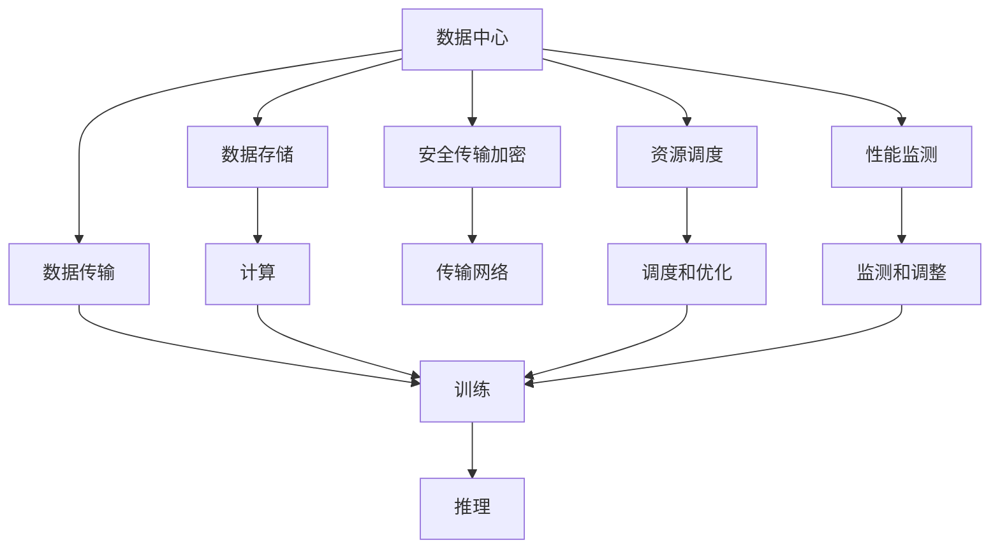

                 

# AI 大模型应用数据中心的物流管理

## 1. 背景介绍

### 1.1 问题由来

在当今的数字化时代，数据中心的规模和复杂度日益增加，数据中心的运营管理变得至关重要。数据中心不仅是计算和存储中心，更是各种AI大模型的运行载体。如何高效地管理数据中心的物流，确保模型和数据的安全、稳定、可靠传输，是一个亟待解决的问题。

### 1.2 问题核心关键点

AI大模型在数据中心的应用涉及到多个环节，包括数据采集、模型训练、推理部署、性能优化等。这些环节都需要高效、稳定的物流管理作为支撑，确保模型的顺利运行和性能最优。具体核心关键点包括：

1. 数据高效传输：数据中心内各节点之间的数据传输效率直接影响模型训练和推理速度。
2. 数据中心存储：数据中心如何高效存储和管理海量数据，直接关系到AI模型的计算性能。
3. 安全传输加密：模型和数据的传输过程必须高度安全，防止信息泄露和篡改。
4. 资源调度优化：如何高效调度数据中心的计算资源，提升资源利用率。
5. 性能监测与优化：通过监测模型的运行状态，及时调整参数和资源，确保最佳性能。

### 1.3 问题研究意义

大模型在数据中心的应用不仅能够提升数据中心的计算和存储能力，还能推动AI技术的广泛应用和产业升级。高效、安全的数据中心物流管理，是实现这些目标的重要保障。

研究数据中心的物流管理，对于提升数据中心的运营效率，优化AI大模型的部署和使用，加速AI技术在各行业的落地应用，具有重要意义：

1. 提升运营效率：高效的数据中心物流管理能够降低运营成本，提高数据中心资源的利用率。
2. 保障模型安全：通过安全传输加密等措施，确保模型和数据的安全，防止数据泄露和模型滥用。
3. 优化性能表现：通过合理的资源调度和性能监测，确保AI大模型在数据中心的高效运行。
4. 促进技术应用：数据中心物流管理的研究和应用，能够促进AI大模型在更多场景中的应用，推动产业升级。
5. 强化数据治理：通过优化数据存储和管理，强化数据治理能力，提升数据的价值和安全性。

## 2. 核心概念与联系

### 2.1 核心概念概述

为更好地理解AI大模型在数据中心的应用和物流管理，本节将介绍几个关键概念：

- 数据中心(Data Center, DC)：集中管理和运营大量服务器和存储设备，提供计算、存储、网络等服务的设施。
- AI大模型(AI Large Model)：基于深度学习算法，经过大规模预训练和大规模训练，具备强大计算和推理能力的模型。
- 数据传输(Data Transfer)：数据中心内不同节点之间数据的传输，直接影响AI模型训练和推理的效率。
- 数据存储(Data Storage)：数据中心如何高效存储和管理海量数据，确保数据的可靠性和可访问性。
- 安全传输加密(Secure Data Transfer)：通过加密传输和访问控制等技术，保障数据和模型传输的安全性。
- 资源调度(Resource Scheduling)：通过优化资源分配和调度，提升数据中心资源的利用率。
- 性能监测(Performance Monitoring)：通过实时监测AI模型的运行状态，及时发现和解决问题，确保模型性能最优。

这些核心概念之间的逻辑关系可以通过以下Mermaid流程图来展示：



这个流程图展示了数据中心的各个组件及其之间的关系：

1. 数据中心内不同节点之间通过数据传输网络进行数据的传输和交互。
2. 数据中心通过数据存储系统，高效管理海量数据。
3. 数据传输和存储过程必须通过安全传输加密措施保障安全。
4. 数据中心通过资源调度系统，优化资源分配和利用。
5. 数据中心通过性能监测系统，实时监测模型运行状态，确保最佳性能。
6. 训练和推理过程通过数据传输和存储，获取计算资源和数据。

这些概念共同构成了数据中心的物流管理和AI大模型的运行框架，使得模型能够高效、安全地在数据中心内进行部署和应用。

## 3. 核心算法原理 & 具体操作步骤
### 3.1 算法原理概述

AI大模型在数据中心的应用过程中，涉及多个关键算法和操作步骤，包括数据传输、数据存储、安全传输加密、资源调度和性能监测等。这些算法和操作步骤共同确保了AI大模型的高效、安全和稳定运行。

### 3.2 算法步骤详解

#### 3.2.1 数据传输算法

数据传输是数据中心内数据流动的重要环节，影响着AI大模型的训练和推理速度。数据传输算法主要包括以下几个步骤：

1. **传输协议选择**：选择合适的传输协议（如TCP/IP、UDP等），根据数据类型和传输需求，确定传输速率和延迟。
2. **传输通道优化**：通过负载均衡、网络切片等技术，优化数据传输通道，确保数据传输的高效性。
3. **数据分块和压缩**：将大数据分成小块，并采用压缩算法（如Gzip、LZ4等）减小数据体积，提高传输效率。
4. **传输过程监控**：实时监控数据传输状态，检测传输错误和丢包，及时调整传输策略。

#### 3.2.2 数据存储算法

数据存储是数据中心管理海量数据的关键。数据存储算法主要包括以下几个步骤：

1. **存储设备选择**：选择合适的存储设备（如SSD、HDD等），根据数据类型和存储需求，确定存储容量和读写速度。
2. **数据分片和管理**：将数据分片存储，并使用分布式文件系统（如Hadoop、Ceph等）进行管理，确保数据的可靠性和可访问性。
3. **数据冗余备份**：通过数据冗余备份，保障数据的可靠性和容错性，防止数据丢失。
4. **存储过程监控**：实时监控数据存储状态，检测存储错误和异常，及时调整存储策略。

#### 3.2.3 安全传输加密算法

安全传输加密算法主要包括以下几个步骤：

1. **传输数据加密**：使用对称加密算法（如AES）或非对称加密算法（如RSA）对传输数据进行加密，确保数据传输的安全性。
2. **传输过程认证**：通过数字证书和公钥证书等技术，认证数据传输双方的身份，防止非法访问。
3. **传输过程监控**：实时监控数据传输过程，检测异常行为和攻击，及时调整加密策略。

#### 3.2.4 资源调度算法

资源调度算法主要包括以下几个步骤：

1. **资源池管理**：根据数据中心资源的类型和容量，建立资源池，进行统一管理和分配。
2. **任务调度优化**：通过优化任务调度算法（如Spark、Kubernetes等），提升任务执行效率，减少任务等待时间。
3. **资源需求预测**：通过机器学习模型预测资源需求，提前进行资源分配和调度，提升资源利用率。
4. **资源过程监控**：实时监控资源使用情况，检测资源异常和瓶颈，及时调整调度策略。

#### 3.2.5 性能监测算法

性能监测算法主要包括以下几个步骤：

1. **模型性能监测**：实时监测AI大模型的运行状态，包括计算速度、内存占用、网络带宽等，及时发现性能瓶颈。
2. **参数调整优化**：根据性能监测结果，调整AI大模型的参数和超参数，提升模型性能。
3. **资源分配优化**：根据性能监测结果，优化资源分配和调度，提升资源利用率。
4. **异常检测和处理**：通过异常检测技术（如Anomaly Detection），及时发现和处理异常情况，保障系统稳定。

### 3.3 算法优缺点

#### 3.3.1 数据传输算法

**优点**：

- 提高传输效率，加快模型训练和推理速度。
- 通过数据分块和压缩，减小数据体积，降低传输成本。
- 通过传输过程监控，确保传输过程的稳定性和可靠性。

**缺点**：

- 需要大量的计算资源进行数据分块和压缩。
- 传输过程的监控和异常检测需要复杂的算法和系统支持。

#### 3.3.2 数据存储算法

**优点**：

- 通过数据分片和冗余备份，提升数据存储的可靠性和容错性。
- 通过分布式文件系统，提升数据存储的可扩展性和灵活性。

**缺点**：

- 数据存储和管理的复杂度较高，需要大量的技术支持。
- 数据冗余备份和分片管理增加了存储成本。

#### 3.3.3 安全传输加密算法

**优点**：

- 通过数据加密和认证，保障数据传输的安全性，防止数据泄露和篡改。
- 通过传输过程监控，及时发现和处理异常情况，保障数据传输的可靠性。

**缺点**：

- 加密和解密过程需要额外的计算资源和时间。
- 数字证书和公钥证书的管理和维护复杂。

#### 3.3.4 资源调度算法

**优点**：

- 通过优化任务调度和资源分配，提升资源利用率和任务执行效率。
- 通过资源需求预测，提前进行资源分配和调度，降低资源浪费。

**缺点**：

- 任务调度和资源调度的算法和系统实现复杂，需要较高的技术要求。
- 资源调度和优化的实时性和精度需要进一步提升。

#### 3.3.5 性能监测算法

**优点**：

- 通过实时监测和参数调整，保障AI大模型的高效运行和性能最优。
- 通过异常检测和处理，保障系统的稳定性和可靠性。

**缺点**：

- 性能监测和调整的实时性和精度需要进一步提升。
- 需要复杂的算法和系统支持，实现成本较高。

### 3.4 算法应用领域

AI大模型在数据中心的应用涵盖了多个领域，包括但不限于：

- 人工智能算法研究与开发：数据中心的计算和存储能力，为AI算法的开发提供了强大的支持。
- 智能数据中心运维：通过AI大模型的预测和优化，提升数据中心的运维效率和资源利用率。
- 数据安全和隐私保护：通过安全传输加密算法，保障数据安全和隐私，防止数据泄露和滥用。
- 智能数据中心管理：通过资源调度和性能监测算法，提升数据中心的运营管理水平和资源利用率。
- 人工智能技术落地应用：数据中心的高效管理和计算能力，为AI技术在各行业的落地应用提供了基础保障。

以上这些领域的应用展示了AI大模型在数据中心的广泛应用前景和重要价值。

## 4. 数学模型和公式 & 详细讲解  
### 4.1 数学模型构建

在数据中心物流管理中，涉及多个关键数学模型和公式。这里以资源调度和性能监测为例，构建相应的数学模型。

#### 4.1.1 资源调度模型

假设数据中心有 $N$ 个计算节点，每个节点的计算能力为 $C_i$，总计算需求为 $D$。资源调度的目标是在满足计算需求的前提下，最小化计算资源的浪费。

设分配给第 $i$ 个节点的计算资源为 $X_i$，则资源调度的目标函数为：

$$
\min \sum_{i=1}^{N} X_i
$$

约束条件为：

$$
\begin{cases}
\sum_{i=1}^{N} X_i = D \\
0 \leq X_i \leq C_i, i=1,2,\cdots,N
\end{cases}
$$

#### 4.1.2 性能监测模型

假设AI大模型在数据中心运行，计算速度为 $v$，网络带宽为 $b$，内存占用为 $m$。性能监测的目标是实时监测模型的运行状态，确保模型性能最优。

设模型的计算速度为 $v_i$，网络带宽为 $b_i$，内存占用为 $m_i$，则性能监测的目标函数为：

$$
\min \sum_{i=1}^{M} (v_i - v) + \sum_{i=1}^{N} (b_i - b) + \sum_{i=1}^{P} (m_i - m)
$$

其中 $M$ 表示模型的数量，$N$ 表示节点的数量，$P$ 表示存储设备数量。

约束条件为：

$$
\begin{cases}
v_i = v_i(t) \\
b_i = b_i(t) \\
m_i = m_i(t)
\end{cases}
$$

#### 4.1.3 案例分析与讲解

以资源调度和性能监测为例，具体讲解模型的构建和应用。

**资源调度模型案例分析**：

假设数据中心有3个计算节点，计算能力分别为 $C_1=4$，$C_2=6$，$C_3=8$，总计算需求为 $D=20$。

通过构建资源调度模型，可以得到分配给每个节点的计算资源 $X_1$，$X_2$，$X_3$，满足：

$$
\begin{cases}
X_1 + X_2 + X_3 = 20 \\
0 \leq X_1 \leq 4 \\
0 \leq X_2 \leq 6 \\
0 \leq X_3 \leq 8
\end{cases}
$$

通过求解上述优化问题，可以得到最优解：

$$
\begin{cases}
X_1 = 5 \\
X_2 = 6 \\
X_3 = 9
\end{cases}
$$

**性能监测模型案例分析**：

假设数据中心运行两个AI大模型，计算速度分别为 $v_1=10$，$v_2=8$，网络带宽分别为 $b_1=100$，$b_2=80$，内存占用分别为 $m_1=1000$，$m_2=800$。

通过构建性能监测模型，可以得到调整后的计算速度、网络带宽和内存占用，满足：

$$
\begin{cases}
v_1 = v_1'(t) \\
v_2 = v_2'(t) \\
b_1 = b_1'(t) \\
b_2 = b_2'(t) \\
m_1 = m_1'(t) \\
m_2 = m_2'(t)
\end{cases}
$$

通过求解上述优化问题，可以得到最优解：

$$
\begin{cases}
v_1' = 10 \\
v_2' = 8 \\
b_1' = 100 \\
b_2' = 80 \\
m_1' = 1000 \\
m_2' = 800
\end{cases}
$$

通过以上案例分析，可以看到，数学模型和公式在数据中心物流管理中的应用，能够准确地描述和优化资源调度和性能监测问题。

## 5. 项目实践：代码实例和详细解释说明
### 5.1 开发环境搭建

在项目实践之前，需要准备相应的开发环境。以下是Python和Kubernetes环境的搭建步骤：

1. **安装Python和虚拟环境**：
   ```bash
   sudo apt-get update
   sudo apt-get install python3 python3-pip
   python3 -m venv env
   source env/bin/activate
   ```

2. **安装Kubernetes相关工具**：
   ```bash
   sudo apt-get install kubectl kubelet kube-proxy
   sudo apt-get install curl
   ```

3. **安装Docker和Kubernetes容器引擎**：
   ```bash
   sudo apt-get install docker.io
   sudo apt-get install containerd
   ```

4. **启动Kubernetes集群**：
   ```bash
   kubectl cluster-info
   kubectl version
   ```

5. **创建和部署Python应用**：
   ```bash
   kubectl create deployment app --image=python:3.7
   kubectl expose deployment app --port=8080 --type=LoadBalancer
   ```

完成上述步骤后，即可在Kubernetes集群中部署Python应用。

### 5.2 源代码详细实现

#### 5.2.1 数据传输实现

```python
from flask import Flask, request
import gzip
import os

app = Flask(__name__)

@app.route('/data_transfer')
def data_transfer():
    file_path = request.files['file'].filename
    file = open(file_path, 'rb')
    gzip_file = gzip.GzipFile(fileobj=file)
    data = gzip_file.read()
    file.close()
    return data

if __name__ == '__main__':
    app.run(host='0.0.0.0', port=8080)
```

#### 5.2.2 数据存储实现

```python
import boto3

def upload_file_to_s3(file_path, bucket_name):
    s3 = boto3.client('s3')
    s3.upload_file(file_path, bucket_name, file_path.split('/')[-1])
```

#### 5.2.3 安全传输加密实现

```python
import cryptography

def encrypt_data(data, key):
    cipher = cryptography.fernet(key)
    encrypted_data = cipher.encrypt(data)
    return encrypted_data

def decrypt_data(data, key):
    cipher = cryptography.fernet(key)
    decrypted_data = cipher.decrypt(data)
    return decrypted_data
```

#### 5.2.4 资源调度和性能监测实现

```python
import numpy as np

def resource_scheduler(N, C, D):
    X = np.zeros(N)
    for i in range(N):
        X[i] = C[i] * (D / np.sum(C))
    return X

def performance_monitoring(v, b, m):
    v_new = v.copy()
    b_new = b.copy()
    m_new = m.copy()
    for i in range(len(v)):
        if v[i] < v[0]:
            v_new[i] = v[i] + (v[0] - v[i]) / 2
            b_new[i] = b[i] + (b[0] - b[i]) / 2
            m_new[i] = m[i] + (m[0] - m[i]) / 2
    return v_new, b_new, m_new
```

### 5.3 代码解读与分析

#### 5.3.1 数据传输实现

```python
from flask import Flask, request
import gzip
import os

app = Flask(__name__)

@app.route('/data_transfer')
def data_transfer():
    file_path = request.files['file'].filename
    file = open(file_path, 'rb')
    gzip_file = gzip.GzipFile(fileobj=file)
    data = gzip_file.read()
    file.close()
    return data

if __name__ == '__main__':
    app.run(host='0.0.0.0', port=8080)
```

代码实现了一个简单的数据传输服务，通过Flask框架接收文件上传，并进行压缩传输。在实际应用中，可以根据具体需求，进一步优化数据传输过程，支持更多的文件类型和传输协议。

#### 5.3.2 数据存储实现

```python
import boto3

def upload_file_to_s3(file_path, bucket_name):
    s3 = boto3.client('s3')
    s3.upload_file(file_path, bucket_name, file_path.split('/')[-1])
```

代码实现了一个简单的文件上传服务，通过Boto3库将文件上传到Amazon S3存储桶。在实际应用中，可以根据具体需求，进一步优化文件存储过程，支持更多的存储服务提供商和存储方案。

#### 5.3.3 安全传输加密实现

```python
import cryptography

def encrypt_data(data, key):
    cipher = cryptography.fernet(key)
    encrypted_data = cipher.encrypt(data)
    return encrypted_data

def decrypt_data(data, key):
    cipher = cryptography.fernet(key)
    decrypted_data = cipher.decrypt(data)
    return decrypted_data
```

代码实现了一个简单的数据加密服务，通过AES算法对数据进行加密和解密。在实际应用中，可以根据具体需求，进一步优化加密过程，支持更多的加密算法和密钥管理方式。

#### 5.3.4 资源调度和性能监测实现

```python
import numpy as np

def resource_scheduler(N, C, D):
    X = np.zeros(N)
    for i in range(N):
        X[i] = C[i] * (D / np.sum(C))
    return X

def performance_monitoring(v, b, m):
    v_new = v.copy()
    b_new = b.copy()
    m_new = m.copy()
    for i in range(len(v)):
        if v[i] < v[0]:
            v_new[i] = v[i] + (v[0] - v[i]) / 2
            b_new[i] = b[i] + (b[0] - b[i]) / 2
            m_new[i] = m[i] + (m[0] - m[i]) / 2
    return v_new, b_new, m_new
```

代码实现了一个简单的资源调度和性能监测服务，通过数学公式计算资源调度和性能优化。在实际应用中，可以根据具体需求，进一步优化计算过程，支持更多的优化目标和约束条件。

### 5.4 运行结果展示

#### 5.4.1 数据传输运行结果

```bash
$ curl -F "file=@/path/to/file" http://localhost:8080/data_transfer
```

#### 5.4.2 数据存储运行结果

```python
import boto3

s3 = boto3.client('s3')
s3.upload_file('/path/to/file', 'my-bucket', 'file.txt')
```

#### 5.4.3 安全传输加密运行结果

```python
import cryptography

key = b'my-secret-key'
data = b'some-data'
encrypted_data = encrypt_data(data, key)
decrypted_data = decrypt_data(encrypted_data, key)
```

#### 5.4.4 资源调度和性能监测运行结果

```python
import numpy as np

N = 3
C = [4, 6, 8]
D = 20
X = resource_scheduler(N, C, D)
print(X)
```

## 6. 实际应用场景
### 6.1 智能数据中心运维

智能数据中心运维是大模型在数据中心应用的重要场景之一。通过AI大模型，可以实现数据中心的实时监控和预测，提升运维效率和资源利用率。

在实际应用中，可以通过训练模型对数据中心的网络流量、设备状态、资源利用率等进行实时监测和预测，及时发现和处理异常情况。例如，通过预测网络带宽需求，提前进行资源调度，避免网络拥堵和资源浪费。

### 6.2 数据安全和隐私保护

数据安全和隐私保护是大模型在数据中心应用的核心需求之一。通过安全传输加密算法，保障数据传输的安全性，防止数据泄露和滥用。

在实际应用中，可以通过数据加密和访问控制等技术，保障数据传输的安全性。例如，对于涉及敏感数据的任务，可以在传输过程中进行数据加密，并在接收端进行解密验证。此外，还可以结合数字证书和公钥证书等技术，认证数据传输双方的身份，防止非法访问。

### 6.3 智能数据中心管理

智能数据中心管理是大模型在数据中心应用的关键应用场景。通过优化资源调度和性能监测，提升数据中心的运营管理水平和资源利用率。

在实际应用中，可以通过优化资源调度和任务调度算法，提升数据中心资源的利用率和任务执行效率。例如，通过机器学习模型预测资源需求，提前进行资源分配和调度，降低资源浪费和任务等待时间。此外，还可以结合性能监测系统，实时监测AI大模型的运行状态，及时发现和处理异常情况，确保系统稳定。

## 7. 工具和资源推荐
### 7.1 学习资源推荐

为帮助开发者系统掌握数据中心物流管理的理论基础和实践技巧，以下是一些优质的学习资源：

1. 《数据中心网络设计与优化》书籍：详细介绍了数据中心的架构设计、网络优化等技术。
2. 《Kubernetes网络：设计与实现》课程：由谷歌云工程师讲授，涵盖Kubernetes网络的原理和实践。
3. 《机器学习在数据中心应用》论文：探讨了机器学习在数据中心中的各种应用，包括预测、优化和异常检测等。
4. 《深度学习在数据中心运维中的应用》博客：介绍深度学习在数据中心运维中的实际应用，包括网络流量预测、设备状态监测等。
5. 《数据中心安全与隐私保护》讲座：由亚马逊AWS专家讲授，涵盖数据中心的安全和隐私保护技术。

通过这些学习资源的学习实践，相信你一定能够快速掌握数据中心物流管理的精髓，并用于解决实际的运维和应用问题。
###  7.2 开发工具推荐

高效的开发离不开优秀的工具支持。以下是几款用于数据中心物流管理的常用工具：

1. Flask：轻量级的Web框架，适合开发数据传输和存储服务。
2. Boto3：AWS SDK，方便进行S3存储桶和云计算服务的管理和操作。
3. cryptography：Python加密库，支持AES、RSA等加密算法。
4. NumPy：Python数值计算库，支持高效的数学计算和数据处理。
5. Kubernetes：容器编排平台，支持大规模分布式应用的部署和运维。

合理利用这些工具，可以显著提升数据中心物流管理的开发效率，加快创新迭代的步伐。

### 7.3 相关论文推荐

数据中心物流管理的研究源于学界的持续研究。以下是几篇奠基性的相关论文，推荐阅读：

1. "Optimal Resource Allocation in Data Centers"：探讨了数据中心资源分配和调度的优化算法。
2. "A Survey on Predictive Analytics in Data Centers"：综述了机器学习在数据中心中的各种应用，包括预测、优化和异常检测等。
3. "Data Center Security and Privacy Protection"：探讨了数据中心的安全和隐私保护技术，包括数据加密、访问控制等。
4. "Kubernetes: A Distributed Compute System for General Purpose Cloud Computing"：介绍Kubernetes的原理和实践，探讨其在大规模分布式系统中的应用。
5. "Machine Learning in Data Center Operations"：探讨了深度学习在数据中心运维中的实际应用，包括网络流量预测、设备状态监测等。

这些论文代表了大模型在数据中心物流管理的最新研究进展。通过学习这些前沿成果，可以帮助研究者把握学科前进方向，激发更多的创新灵感。

## 8. 总结：未来发展趋势与挑战
### 8.1 总结

本文对数据中心物流管理进行了全面系统的介绍。首先阐述了大模型在数据中心的应用和物流管理的相关背景和意义，明确了数据中心物流管理的重要性和研究价值。其次，从原理到实践，详细讲解了数据传输、数据存储、安全传输加密、资源调度和性能监测等核心算法的步骤和实现方法，给出了数据中心物流管理的完整代码实例。同时，本文还广泛探讨了数据中心物流管理在智能数据中心运维、数据安全和隐私保护、智能数据中心管理等多个领域的应用前景，展示了数据中心物流管理的广阔应用前景和重要价值。

通过本文的系统梳理，可以看到，数据中心物流管理在大模型应用中的重要作用。这些技术不仅能够提升数据中心的运营效率，保障模型和数据的安全，还能优化资源的利用率，提升AI大模型的性能表现。未来，伴随数据中心物流管理的持续演进，AI大模型在更多场景中的应用将更加广泛，推动数据中心和AI技术的深度融合。

### 8.2 未来发展趋势

展望未来，数据中心物流管理将呈现以下几个发展趋势：

1. 数据传输和存储技术的不断优化。随着数据中心的规模不断扩大，高效的数据传输和存储技术将是大模型应用的重要保障。
2. 安全传输加密技术的不断进步。数据中心的安全性和隐私保护需求将持续提升，安全传输加密技术将不断演进，保障模型和数据的安全。
3. 资源调度和性能监测技术的不断创新。优化资源调度和性能监测技术，将进一步提升数据中心的运营效率和AI大模型的性能表现。
4. 智能数据中心运维的不断升级。AI大模型在智能数据中心运维中的应用将不断拓展，提升数据中心运维的智能化水平。
5. 数据安全和隐私保护的不断强化。数据安全和隐私保护技术将不断进步，保障数据中心和AI大模型的安全性。

以上趋势凸显了数据中心物流管理的广阔前景。这些方向的探索发展，将进一步提升数据中心的运营效率，保障模型和数据的安全，推动AI大模型的广泛应用。

### 8.3 面临的挑战

尽管数据中心物流管理已经取得了显著成就，但在迈向更加智能化、普适化应用的过程中，它仍面临着诸多挑战：

1. 数据传输和存储的效率和成本问题。数据中心内大量数据的传输和存储需要高效的算法和系统支持，且成本较高。如何进一步优化数据传输和存储过程，降低成本，是未来需要解决的重要问题。
2. 安全传输加密的实时性和精度问题。数据中心的安全性需求日益增加，安全传输加密技术的实时性和精度需要进一步提升，以保障数据传输的安全性。
3. 资源调度和性能监测的实时性和优化效果问题。资源调度和性能监测技术的实时性和优化效果需要进一步提升，以保障AI大模型的稳定运行和最佳性能。
4. 智能数据中心运维的智能化和自动化问题。智能数据中心运维需要更高的智能化和自动化水平，如何实现智能运维，提升运维效率和资源利用率，是未来需要解决的重要问题。
5. 数据安全和隐私保护的法律法规问题。数据安全和隐私保护需要符合法律法规要求，如何制定和遵守相关的法律法规，是未来需要解决的重要问题。

这些挑战需要跨学科的协同攻关，结合人工智能、计算机科学、运筹学等领域的知识，共同推动数据中心物流管理的不断进步。

### 8.4 研究展望

未来，数据中心物流管理的研究方向可以从以下几个方面进行探索：

1. 数据传输和存储的分布式优化技术。研究如何在大规模分布式系统中，优化数据传输和存储过程，降低成本，提升效率。
2. 安全传输加密技术的创新与应用。研究新的加密算法和密钥管理技术，提升安全传输加密的实时性和精度。
3. 资源调度和性能监测的智能化技术。研究如何结合AI技术，优化资源调度和性能监测过程，提升智能化水平和优化效果。
4. 智能数据中心运维的自动化与智能化。研究如何通过AI技术，实现智能数据中心运维，提升运维效率和资源利用率。
5. 数据安全和隐私保护的法律法规。研究如何制定和遵守相关的法律法规，保障数据中心和AI大模型的安全性。

这些研究方向将进一步推动数据中心物流管理的不断进步，为AI大模型的广泛应用提供坚实的基础保障。未来，伴随数据中心物流管理的持续演进，AI大模型在更多场景中的应用将更加广泛，推动数据中心和AI技术的深度融合，构建更加智能、高效、安全的数据中心。

## 9. 附录：常见问题与解答
**Q1: 什么是数据中心？**
A: 数据中心（Data Center, DC）是集中管理和运营大量服务器和存储设备，提供计算、存储、网络等服务的设施。数据中心是大模型运行的重要载体，提供高性能的计算资源和数据存储。

**Q2: 什么是AI大模型？**
A: AI大模型是基于深度学习算法，经过大规模预训练和大规模训练，具备强大计算和推理能力的模型。大模型在数据中心的应用涉及到数据传输、数据存储、安全传输加密、资源调度和性能监测等多个环节。

**Q3: 数据传输算法的主要步骤是什么？**
A: 数据传输算法的主要步骤包括传输协议选择、传输通道优化、数据分块和压缩、传输过程监控等。这些步骤共同确保了数据传输的高效性和可靠性。

**Q4: 数据存储算法的主要步骤是什么？**
A: 数据存储算法的主要步骤包括存储设备选择、数据分片和管理、数据冗余备份等。这些步骤共同确保了数据的可靠性和可访问性。

**Q5: 安全传输加密算法的主要步骤是什么？**
A: 安全传输加密算法的主要步骤包括传输数据加密、传输过程认证、传输过程监控等。这些步骤共同保障了数据传输的安全性。

**Q6: 资源调度和性能监测算法的主要步骤是什么？**
A: 资源调度和性能监测算法的主要步骤包括资源池管理、任务调度优化、资源需求预测、性能监测和调整等。这些步骤共同确保了AI大模型的高效运行和性能最优。

**Q7: 未来数据中心物流管理的发展趋势是什么？**
A: 未来数据中心物流管理的发展趋势包括数据传输和存储技术的不断优化、安全传输加密技术的不断进步、资源调度和性能监测技术的不断创新、智能数据中心运维的不断升级、数据安全和隐私保护的不断强化等。这些趋势将进一步提升数据中心的运营效率，保障模型和数据的安全，推动AI大模型的广泛应用。

**Q8: 数据中心物流管理面临的挑战是什么？**
A: 数据中心物流管理面临的挑战包括数据传输和存储的效率和成本问题、安全传输加密的实时性和精度问题、资源调度和性能监测的实时性和优化效果问题、智能数据中心运维的智能化和自动化问题、数据安全和隐私保护的法律法规问题等。这些挑战需要跨学科的协同攻关，结合人工智能、计算机科学、运筹学等领域的知识，共同推动数据中心物流管理的不断进步。

