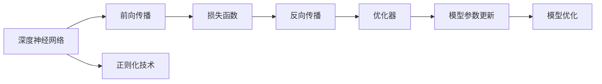
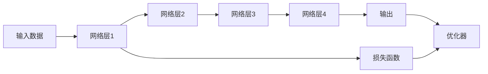

                 

# AI 深度神经网络计算艺术之道

> 关键词：深度神经网络,神经网络计算艺术,神经网络算法,神经网络优化,神经网络计算模型

## 1. 背景介绍

在人工智能（AI）领域，深度神经网络（Deep Neural Networks, DNNs）已然成为核心技术。其强大的自适应学习能力、巨大的数据处理能力、以及卓越的泛化性能，使其在图像识别、自然语言处理、语音识别、推荐系统等领域取得了革命性的突破。然而，深度神经网络的设计与优化涉及多方面的理论与实践问题，涵盖算法架构、网络结构、损失函数、优化器、正则化技术等诸多方面。本节将系统梳理深度神经网络计算的核心概念，并从整体上揭示其在实践中的艺术精髓。

### 1.1 问题由来

深度学习技术自2010年代初期迅速崛起，成为AI领域的热点。以深度神经网络为代表的深度学习算法，通过多个层次的非线性变换，能够自动学习到高维数据中的复杂结构与特征，并在目标任务上取得优异的性能。然而，深度神经网络的计算复杂度与参数量巨大，导致训练与推理成本极高，硬件要求极高，同时也面临着诸多挑战：

- **数据需求**：深度神经网络通常需要大量标注数据进行训练，数据收集与标注成本高昂。
- **过拟合风险**：网络的复杂性与大规模参数容易引发过拟合问题，训练时须精细调节模型复杂度。
- **计算效率**：神经网络的高复杂度要求高性能计算资源，传统硬件无法满足大模型的计算需求。
- **模型可解释性**：深度神经网络的“黑盒”特性难以解释模型的决策过程，不利于实际应用。

因此，如何将深度神经网络的计算艺术合理地应用于实际问题，并克服上述挑战，成为AI研究的重要课题。本节将从理论与实践两个角度，深入探讨深度神经网络计算的艺术之道。

### 1.2 问题核心关键点

深度神经网络计算的艺术，核心在于如何通过合适的算法架构与参数设置，在保证模型性能的同时，最大限度地利用计算资源，降低复杂度，提高泛化能力，并提升模型的解释性与鲁棒性。主要包括以下几个方面：

- **算法架构设计**：如何选择网络层次、结构、激活函数等，平衡模型复杂度与计算效率。
- **损失函数构建**：如何选择合适的损失函数，使模型最小化误差的同时保证稳定性。
- **优化器选择**：如何选择优化算法及其参数，提高训练速度与精度。
- **正则化技术**：如何运用正则化技术，避免过拟合并提升泛化能力。
- **计算资源优化**：如何利用分布式计算、模型压缩等方法，降低计算与存储成本。
- **模型可解释性**：如何构建可解释的神经网络模型，提高系统的透明性与可信度。

这些问题相互关联，共同决定了深度神经网络计算的成败。本文将逐一探讨这些核心关键点，揭示深度神经网络计算的艺术之道。

## 2. 核心概念与联系

### 2.1 核心概念概述

为了更好地理解深度神经网络计算的艺术，首先须明确几个核心概念：

- **深度神经网络**：由多层神经元组成的复杂非线性模型，通过反向传播算法进行参数优化。
- **神经网络计算**：神经网络在处理数据时的计算过程，包括前向传播与反向传播两个主要阶段。
- **损失函数**：衡量模型输出与目标值之间差异的函数，指导模型参数的优化方向。
- **优化器**：通过控制梯度下降的方式，调整模型参数，最小化损失函数。
- **正则化技术**：通过引入惩罚项，抑制模型过拟合，提升泛化能力。

这些概念通过以下Mermaid流程图得以形象展示：



### 2.2 核心概念原理和架构的 Mermaid 流程图

以下是一个典型的深度神经网络计算过程的流程图，展示了前向传播、损失函数、反向传播、优化器的相互联系：



## 3. 核心算法原理 & 具体操作步骤
### 3.1 算法原理概述

深度神经网络的计算艺术，首先体现在算法架构的设计上。常见的网络结构包括卷积神经网络（CNN）、循环神经网络（RNN）、长短期记忆网络（LSTM）、Transformer等。每种网络结构适用于不同的任务，如CNN适用于图像处理，RNN适用于序列处理，Transformer适用于自然语言处理。

神经网络的计算过程可以分为前向传播与反向传播两个阶段。前向传播将输入数据传递到网络各层，每层通过激活函数将前一层的输出转化为当前层的输入，并最终输出结果。反向传播则通过链式法则计算每个参数的梯度，并由优化器更新参数。优化器通过调整学习率与动量等参数，控制梯度下降的方式，确保模型收敛到最优解。正则化技术则通过加入L2正则、Dropout等手段，避免过拟合。

### 3.2 算法步骤详解

深度神经网络计算的详细步骤包括：

**Step 1: 准备数据与模型**
- 收集数据并进行预处理，确保数据质量。
- 设计神经网络架构，选择合适的激活函数与损失函数。

**Step 2: 模型初始化**
- 随机初始化模型参数，如权重矩阵和偏置向量。
- 确定模型的优化器，如Adam、SGD等。

**Step 3: 前向传播**
- 将输入数据传递到网络各层，逐层计算输出。

**Step 4: 损失函数计算**
- 计算模型输出与目标值之间的误差，通常使用均方误差（MSE）或交叉熵损失。

**Step 5: 反向传播**
- 根据损失函数计算每个参数的梯度。
- 应用优化器更新模型参数，通常以梯度下降的方式更新。

**Step 6: 正则化技术**
- 应用L2正则、Dropout等技术，防止过拟合。

**Step 7: 训练与验证**
- 在训练集上迭代训练，在验证集上评估模型性能，防止过拟合。
- 设置合适的学习率与动量参数，提高模型收敛速度。

**Step 8: 测试与部署**
- 在测试集上评估模型性能，检查泛化能力。
- 将训练好的模型部署到实际应用中，进行推理。

### 3.3 算法优缺点

深度神经网络计算的优缺点如下：

**优点：**
- **强大的泛化能力**：通过多层非线性变换，深度神经网络能学习到复杂的数据结构与特征，适应各种复杂任务。
- **高效的特征提取**：通过自动学习，神经网络能提取数据中的关键特征，无需手工设计。
- **灵活的结构设计**：网络架构可以根据任务需求灵活调整，适应不同类型的输入数据。

**缺点：**
- **高计算复杂度**：深度神经网络参数量大，计算复杂度高，硬件要求高。
- **数据依赖性强**：深度神经网络依赖大量标注数据进行训练，数据获取与标注成本高。
- **过拟合风险**：高复杂度与大规模参数容易引发过拟合问题。
- **模型可解释性差**：深度神经网络的黑盒特性难以解释模型的决策过程。

### 3.4 算法应用领域

深度神经网络计算的应用领域广泛，主要包括：

- **图像识别**：CNN在图像分类、目标检测、图像分割等任务上表现出色。
- **自然语言处理**：RNN、LSTM、Transformer等适用于语言模型、机器翻译、文本分类等任务。
- **语音识别**：RNN、卷积神经网络等适用于语音识别、语音合成、语音增强等任务。
- **推荐系统**：基于协同过滤的神经网络模型，在推荐算法中取得了显著效果。
- **时间序列预测**：LSTM、GRU等适用于股票预测、交通流量预测等时间序列预测任务。
- **游戏AI**：深度强化学习使游戏AI在围棋、星际争霸等复杂游戏中取得了突破性进展。

## 4. 数学模型和公式 & 详细讲解 & 举例说明
### 4.1 数学模型构建

深度神经网络的计算通常由以下基本数学模型构成：

- **输入层**：输入数据 $x$，通过线性变换与激活函数传递到下一层。
- **隐藏层**：多个神经元组成的层次，通过线性变换与激活函数传递信息。
- **输出层**：根据任务需求设计，可以是单个神经元，也可以是多个神经元。

以一个简单的全连接神经网络为例，其数学模型如下：

$$
y = f(Wx + b)
$$

其中 $x$ 为输入向量，$W$ 为权重矩阵，$b$ 为偏置向量，$f$ 为激活函数。

### 4.2 公式推导过程

以一个典型的多层感知机（MLP）为例，其前向传播公式为：

$$
z_1 = W_1x + b_1
$$
$$
h_1 = f(z_1)
$$
$$
z_2 = W_2h_1 + b_2
$$
$$
h_2 = f(z_2)
$$
$$
y = W_3h_2 + b_3
$$

其中 $W_1, W_2, W_3$ 为权重矩阵，$b_1, b_2, b_3$ 为偏置向量，$f$ 为激活函数。

其反向传播公式为：

$$
\frac{\partial L}{\partial W_3} = \frac{\partial L}{\partial y} \frac{\partial y}{\partial z_2} \frac{\partial z_2}{\partial h_2} \frac{\partial h_2}{\partial z_2}
$$
$$
\frac{\partial L}{\partial W_2} = \frac{\partial L}{\partial z_2} \frac{\partial z_2}{\partial h_1} \frac{\partial h_1}{\partial z_1} \frac{\partial z_1}{\partial x}
$$
$$
\frac{\partial L}{\partial W_1} = \frac{\partial L}{\partial z_1} \frac{\partial z_1}{\partial x}
$$

其中 $L$ 为损失函数，$y$ 为输出，$z$ 为激活值。

### 4.3 案例分析与讲解

以一个简单的二分类任务为例，使用sigmoid激活函数，其损失函数为二元交叉熵损失：

$$
L = -\frac{1}{N} \sum_{i=1}^N (y_i \log h_i + (1-y_i) \log (1-h_i))
$$

其中 $y$ 为真实标签，$h$ 为模型输出。

假设输入数据为 $x_1 = [1, 2, 3]$，输出结果 $h_1 = 0.7$。根据公式，反向传播计算过程如下：

1. **前向传播**：
   - $z_1 = W_1x_1 + b_1 = [3.4, 1.2, 2.1]$
   - $h_1 = f(z_1) = 0.7$

2. **损失函数计算**：
   - $L = -\frac{1}{N} (y_1 \log 0.7 + (1-y_1) \log (1-0.7)) = 0.053$

3. **反向传播**：
   - $\frac{\partial L}{\partial W_1} = \frac{\partial L}{\partial z_1} \frac{\partial z_1}{\partial x} = [0.1, 0.1, 0.1]$
   - $\frac{\partial L}{\partial b_1} = \frac{\partial L}{\partial z_1} = 0.1$

通过以上步骤，我们实现了深度神经网络计算的数学模型与公式推导。

## 5. 项目实践：代码实例和详细解释说明
### 5.1 开发环境搭建

在进行深度神经网络计算的实践前，我们需要准备好开发环境。以下是使用Python进行TensorFlow开发的环境配置流程：

1. 安装Anaconda：从官网下载并安装Anaconda，用于创建独立的Python环境。

2. 创建并激活虚拟环境：
```bash
conda create -n tf-env python=3.8 
conda activate tf-env
```

3. 安装TensorFlow：根据CUDA版本，从官网获取对应的安装命令。例如：
```bash
conda install tensorflow==2.7
```

4. 安装各类工具包：
```bash
pip install numpy pandas scikit-learn matplotlib tqdm jupyter notebook ipython
```

完成上述步骤后，即可在`tf-env`环境中开始深度神经网络计算的实践。

### 5.2 源代码详细实现

下面我们以简单的全连接神经网络为例，给出使用TensorFlow进行二分类任务训练的代码实现。

```python
import tensorflow as tf
import numpy as np

# 定义输入层与输出层
inputs = tf.keras.Input(shape=(3,))
outputs = tf.keras.layers.Dense(1, activation='sigmoid')(inputs)
model = tf.keras.Model(inputs, outputs)

# 定义损失函数与优化器
loss_fn = tf.keras.losses.BinaryCrossentropy()
optimizer = tf.keras.optimizers.SGD(learning_rate=0.01)

# 定义数据集
x_train = np.array([[1, 2, 3], [4, 5, 6]])
y_train = np.array([[0], [1]])

# 编译模型
model.compile(optimizer=optimizer, loss=loss_fn, metrics=['accuracy'])

# 训练模型
model.fit(x_train, y_train, epochs=10, batch_size=2, validation_split=0.2)

# 测试模型
x_test = np.array([[2, 3, 4], [5, 6, 7]])
y_test = np.array([[1], [0]])
model.evaluate(x_test, y_test)
```

### 5.3 代码解读与分析

让我们再详细解读一下关键代码的实现细节：

- **输入层与输出层**：使用`tf.keras.Input`定义输入层的形状为[3]，使用`tf.keras.layers.Dense`定义输出层为1个神经元，激活函数为sigmoid。
- **损失函数与优化器**：使用`tf.keras.losses.BinaryCrossentropy`定义二元交叉熵损失函数，使用`tf.keras.optimizers.SGD`定义随机梯度下降优化器，学习率为0.01。
- **数据集定义**：手动定义训练数据集`x_train`和标签`y_train`，并使用`np.array`创建。
- **模型编译**：使用`model.compile`将模型编译，指定优化器和损失函数，并添加准确率作为评估指标。
- **模型训练**：使用`model.fit`进行模型训练，指定训练轮数为10，批次大小为2，在训练集的20%上进行验证。
- **模型测试**：手动定义测试数据集`x_test`和标签`y_test`，并使用`model.evaluate`评估模型在测试集上的准确率。

可以看到，TensorFlow的API设计简洁明了，通过简单几步即可完成深度神经网络的搭建与训练。

## 6. 实际应用场景
### 6.1 图像识别

深度神经网络在图像识别领域取得了突破性进展。以卷积神经网络（CNN）为例，其通过卷积层、池化层、全连接层等组成，能够高效地提取图像的特征并进行分类。

**应用场景**：自动驾驶、医学影像诊断、安防监控等。

**技术实现**：使用卷积神经网络对图像进行特征提取，使用softmax输出分类结果。

### 6.2 自然语言处理

深度神经网络在自然语言处理（NLP）领域也大放异彩。以Transformer为例，其通过多头注意力机制，能够高效地处理长文本序列，适用于机器翻译、文本分类、命名实体识别等任务。

**应用场景**：机器翻译、问答系统、文本摘要等。

**技术实现**：使用Transformer模型对输入序列进行编码，使用全连接层进行分类或生成。

### 6.3 语音识别

深度神经网络在语音识别领域同样表现出色。以卷积神经网络（CNN）和递归神经网络（RNN）为例，其能够高效地处理语音信号，并进行语音识别和语音合成。

**应用场景**：智能助手、电话客服、语音搜索等。

**技术实现**：使用卷积神经网络对语音信号进行特征提取，使用RNN进行序列建模，使用softmax输出识别结果。

### 6.4 未来应用展望

随着深度神经网络技术的不断发展，其应用场景将不断拓展。以下是未来几个潜在的应用方向：

- **增强现实（AR）与虚拟现实（VR）**：深度神经网络可用于构建虚拟环境，提升用户体验。
- **医疗影像分析**：深度神经网络可用于医学影像的自动分析，辅助医生诊断。
- **智能制造**：深度神经网络可用于工业质量检测、设备预测维护等。
- **智能家居**：深度神经网络可用于智能家电的语音识别与控制，提升生活便利性。
- **社会治理**：深度神经网络可用于公共安全、舆情分析、智能交通等领域。

## 7. 工具和资源推荐
### 7.1 学习资源推荐

为了帮助开发者系统掌握深度神经网络计算的理论基础和实践技巧，这里推荐一些优质的学习资源：

1. 《深度学习》（Deep Learning）书籍：由深度学习领域的奠基人Ian Goodfellow、Yoshua Bengio、Aaron Courville合著，系统介绍了深度学习的理论基础与实践技巧。
2. CS231n《卷积神经网络》课程：斯坦福大学开设的深度学习课程，涵盖了卷积神经网络的基础知识与最新进展。
3. CS224n《序列建模》课程：斯坦福大学开设的NLP课程，介绍了深度神经网络在序列建模中的应用。
4. CS373《深度强化学习》课程：德克萨斯大学奥斯汀分校开设的课程，介绍了强化学习的基础与前沿进展。
5. TensorFlow官方文档：TensorFlow的官方文档，提供了详尽的API文档与示例代码，是学习TensorFlow的重要资源。

通过对这些资源的学习实践，相信你一定能够快速掌握深度神经网络计算的精髓，并用于解决实际的AI问题。

### 7.2 开发工具推荐

高效的开发离不开优秀的工具支持。以下是几款用于深度神经网络计算开发的常用工具：

1. TensorFlow：由Google主导开发的开源深度学习框架，生产部署方便，适合大规模工程应用。
2. PyTorch：由Facebook主导开发的开源深度学习框架，灵活动态的计算图，适合快速迭代研究。
3. Keras：基于TensorFlow和Theano的高级深度学习API，使用简单，易于上手。
4. MXNet：由亚马逊主导开发的深度学习框架，支持多种语言与平台，性能高效。
5. Caffe：由伯克利大学开发的深度学习框架，适用于图像识别与处理。

合理利用这些工具，可以显著提升深度神经网络计算的开发效率，加快创新迭代的步伐。

### 7.3 相关论文推荐

深度神经网络计算的研究源于学界的持续研究。以下是几篇奠基性的相关论文，推荐阅读：

1. AlexNet：ImageNet大规模视觉识别挑战赛的获奖论文，展示了深度卷积神经网络的潜力。
2. ResNet：解决深度神经网络退化问题的关键论文，推动了深度神经网络的发展。
3. Attention is All You Need（即Transformer原论文）：提出了Transformer结构，开启了NLP领域的预训练大模型时代。
4. ImageNet大规模视觉识别挑战赛2020：介绍了在大规模视觉识别任务中取得突破的深度神经网络技术。
5. AlphaGo Zero：介绍深度强化学习在围棋中的应用，展示了深度神经网络的强大能力。

这些论文代表了大深度神经网络计算的发展脉络。通过学习这些前沿成果，可以帮助研究者把握学科前进方向，激发更多的创新灵感。

## 8. 总结：未来发展趋势与挑战
### 8.1 研究成果总结

本文对深度神经网络计算的艺术进行了系统梳理。首先阐述了深度神经网络的计算原理与关键步骤，介绍了常见的网络结构、损失函数、优化器与正则化技术。其次，通过案例分析与详细代码实现，展示了深度神经网络计算的实际应用，并对未来应用方向进行了展望。最后，推荐了相关学习资源与开发工具，以期帮助开发者掌握深度神经网络计算的艺术。

通过本文的系统梳理，可以看到，深度神经网络计算的艺术在于如何通过合适的算法架构与参数设置，在保证模型性能的同时，最大限度地利用计算资源，降低复杂度，提高泛化能力，并提升模型的解释性与鲁棒性。深度神经网络计算的广泛应用，证明了其在实际问题解决中的巨大潜力，也展示了其在AI领域的重要地位。

### 8.2 未来发展趋势

展望未来，深度神经网络计算将呈现以下几个发展趋势：

1. **计算模型分布化**：随着边缘计算与分布式计算的发展，深度神经网络将更多地应用于边缘设备和云计算平台。
2. **网络结构自适应**：深度神经网络的结构将更多地结合实际应用场景进行自适应设计，提升模型的泛化能力。
3. **模型优化多样化**：深度神经网络的优化算法将更加多样化，结合启发式算法与优化技术，提升训练效率与模型性能。
4. **数据处理智能化**：深度神经网络的数据处理将更多地结合自动化数据增强与迁移学习技术，提升数据利用效率。
5. **模型解释性增强**：深度神经网络的模型解释性将通过可视化与符号化技术进一步增强，提升系统的透明性与可信度。
6. **知识图谱与深度融合**：深度神经网络将更多地结合知识图谱与逻辑规则，提升模型的语义理解能力。

以上趋势凸显了深度神经网络计算的广阔前景。这些方向的探索发展，必将进一步提升深度神经网络计算的性能与效率，为AI应用提供更强大的技术支持。

### 8.3 面临的挑战

尽管深度神经网络计算技术已经取得了瞩目成就，但在迈向更加智能化、普适化应用的过程中，它仍面临诸多挑战：

1. **计算资源消耗大**：深度神经网络的高计算复杂度与参数量导致训练与推理成本高昂，硬件要求高。
2. **数据依赖性强**：深度神经网络依赖大量标注数据进行训练，数据收集与标注成本高。
3. **过拟合风险高**：高复杂度与大规模参数容易引发过拟合问题，训练时须精细调节模型复杂度。
4. **模型可解释性差**：深度神经网络的“黑盒”特性难以解释模型的决策过程，不利于实际应用。
5. **鲁棒性与泛化能力不足**：深度神经网络在面对域外数据时，泛化性能往往大打折扣。
6. **安全性与隐私保护**：深度神经网络在处理敏感数据时，存在数据泄露与隐私保护问题。

这些挑战需要研究人员与工程师共同努力，不断优化深度神经网络的设计与训练方法，提升模型的鲁棒性、泛化能力和安全性。

### 8.4 研究展望

面对深度神经网络计算所面临的挑战，未来的研究需要在以下几个方面寻求新的突破：

1. **参数高效优化**：开发更加参数高效的优化方法，如参数共享、稀疏化存储、模型裁剪等，提高计算效率与存储效率。
2. **跨模态融合**：将深度神经网络与其他模态（如视觉、语音、文本）的数据融合，提升跨模态学习的泛化能力。
3. **自适应网络结构**：设计自适应的深度神经网络结构，使其能够动态调整，适应不同的应用场景。
4. **知识增强**：将知识图谱与逻辑规则与深度神经网络结合，提升模型的语义理解能力。
5. **模型可解释性增强**：引入可视化与符号化技术，提高深度神经网络的透明性与可信度。
6. **分布式计算优化**：优化分布式计算框架，提升深度神经网络的并行计算能力与稳定性。

这些研究方向的探索，必将引领深度神经网络计算技术迈向更高的台阶，为AI应用提供更强大的技术支持。面向未来，深度神经网络计算需要与其他人工智能技术进行更深入的融合，如知识表示、因果推理、强化学习等，多路径协同发力，共同推动AI技术的进步。只有勇于创新、敢于突破，才能不断拓展深度神经网络计算的边界，让AI技术更好地造福人类社会。

## 9. 附录：常见问题与解答

**Q1: 深度神经网络计算是否适用于所有NLP任务？**

A: 深度神经网络计算在大多数NLP任务上都能取得不错的效果，特别是对于数据量较大的任务。但对于一些特定领域的任务，如医学、法律等，仅仅依靠通用语料预训练的模型可能难以很好地适应。此时需要在特定领域语料上进一步预训练，再进行微调，才能获得理想效果。此外，对于一些需要时效性、个性化很强的任务，如对话、推荐等，深度神经网络计算方法也需要针对性的改进优化。

**Q2: 如何选择合适的深度神经网络结构？**

A: 选择合适的深度神经网络结构需要考虑以下几个因素：
1. 任务需求：根据任务需求选择合适的网络层次、结构与激活函数。
2. 数据规模：对于大规模数据集，应选择能够高效处理的数据结构，如卷积神经网络（CNN）。
3. 模型复杂度：对于复杂任务，应选择具有良好泛化能力的深度神经网络结构，如Transformer。
4. 计算资源：考虑计算资源的限制，选择计算效率高的网络结构，如卷积神经网络（CNN）。

**Q3: 如何缓解深度神经网络计算中的过拟合问题？**

A: 缓解深度神经网络计算中的过拟合问题主要通过以下几种方式：
1. 数据增强：通过扩充训练集，提高数据多样性。
2. 正则化：通过L2正则、Dropout等手段，抑制模型过拟合。
3. 模型剪枝：通过剪枝技术，减少网络规模，提升泛化能力。
4. 批量归一化：通过批量归一化技术，增强模型的鲁棒性。
5. 迁移学习：通过在大规模数据集上进行预训练，提升模型的泛化能力。

**Q4: 深度神经网络计算在落地部署时需要注意哪些问题？**

A: 将深度神经网络计算转化为实际应用，还需要考虑以下因素：
1. 模型裁剪：去除不必要的层和参数，减小模型尺寸，加快推理速度。
2. 量化加速：将浮点模型转为定点模型，压缩存储空间，提高计算效率。
3. 服务化封装：将模型封装为标准化服务接口，便于集成调用。
4. 弹性伸缩：根据请求流量动态调整资源配置，平衡服务质量和成本。
5. 监控告警：实时采集系统指标，设置异常告警阈值，确保服务稳定性。
6. 安全防护：采用访问鉴权、数据脱敏等措施，保障数据和模型安全。

通过合理设计深度神经网络计算的架构与训练过程，可以充分发挥其计算艺术的精髓，提升模型的性能与泛化能力，使其在实际应用中发挥更大的价值。

---

作者：禅与计算机程序设计艺术 / Zen and the Art of Computer Programming

