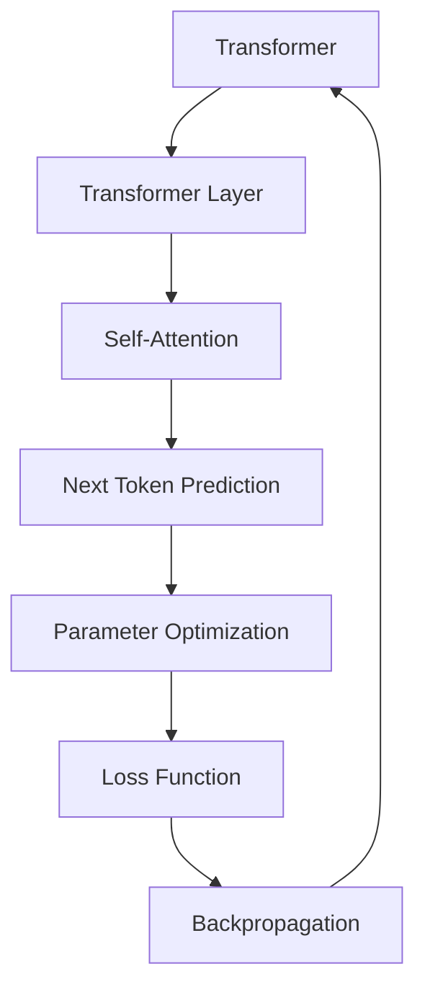

                 

# AI 神经网络计算艺术之禅：GPT的核心机制——next token prediction

> 关键词：深度学习,神经网络,自然语言处理,语言模型,GPT,next token prediction,Transformer

## 1. 背景介绍

### 1.1 问题由来

随着人工智能技术的快速发展，深度学习（Deep Learning）已经成为当今科技领域的重要分支。在自然语言处理（Natural Language Processing, NLP）领域，基于深度学习的模型展现出了强大的潜力。其中，生成式预训练语言模型（Generative Pre-trained Transformer, GPT）因其卓越的语言理解和生成能力，受到了广泛关注和应用。

GPT模型，尤其是GPT-3和GPT-4，已经展示了在写作、对话、翻译等诸多领域中惊人的表现。然而，其核心机制——next token prediction（next token prediction），却始终鲜为人知。本文将深入探讨next token prediction的原理和应用，带领读者一同体验生成式预训练语言模型的计算艺术。

### 1.2 问题核心关键点

next token prediction机制是GPT模型得以实现的核心技术，其基本思想是在给定前n个词的情况下，预测下一个词的概率分布。这一机制不仅让GPT模型能够进行文本生成、自动摘要等任务，还为其在迁移学习和微调中提供了强大的能力。

本节将从以下几个方面对next token prediction机制进行详细阐述：

1. **Transformer结构**：解释Transformer的架构及其在next token prediction中的作用。
2. **self-attention机制**：阐述self-attention机制在处理next token prediction时的具体应用。
3. **神经网络训练**：介绍GPT模型在训练过程中的优化方法，包括损失函数和优化算法。
4. **实践与案例**：提供next token prediction的代码实现和实际应用案例。

## 2. 核心概念与联系

### 2.1 核心概念概述

为更好地理解next token prediction机制，本节将介绍几个关键概念：

- **Transformer**：基于注意力机制的神经网络架构，是GPT模型的核心组件。
- **自注意力(self-attention)**：一种用于计算不同位置间相关性的机制，使得模型能够关注输入序列的不同部分。
- **神经网络训练**：利用反向传播算法，通过优化损失函数来训练模型，使其能够准确地预测下一个词。
- **迁移学习**：将在大规模数据上预训练得到的模型参数，应用于特定任务的微调，以提升模型在该任务上的表现。

这些概念之间存在着密切的联系，共同构成了GPT模型的计算基础。

### 2.2 核心概念原理和架构的 Mermaid 流程图



此图展示了Transformer的层级结构和next token prediction机制在其中的位置。Transformer模型由多个层级组成，其中每一层都包含了自注意力机制。在训练过程中，模型首先通过前向传播计算next token prediction的概率分布，然后反向传播更新模型参数，最终优化损失函数。

## 3. 核心算法原理 & 具体操作步骤

### 3.1 算法原理概述

next token prediction机制的核心在于利用Transformer的注意力机制，计算输入序列中每个位置与目标位置之间的相关性，从而预测下一个词的概率分布。具体步骤如下：

1. **输入编码**：将输入序列编码成一组向量，每个向量代表序列中的一个词。
2. **自注意力计算**：通过Transformer的自注意力机制，计算每个词与其他词之间的相关性。
3. **层级结构**：将自注意力计算的结果，作为下一层输入，逐步计算出更高层次的表示。
4. **输出预测**：利用全连接层和softmax函数，计算出下一个词的概率分布。
5. **训练优化**：通过反向传播算法，最小化损失函数，更新模型参数。

### 3.2 算法步骤详解

#### 3.2.1 输入编码

输入序列首先通过Transformer的编码器，将其转换成一组向量。这一过程通常包括嵌入层和位置编码，其中嵌入层将词映射为高维向量，位置编码则将不同位置上的向量进行调整，使其具有时序信息。

具体实现如下：

```python
embedding = Embedding(input_dim, embedding_dim)
positions = torch.arange(input_len).to(device)
positions = positions.unsqueeze(1).expand(input_len, embedding_dim)
input_vectors = embedding(input_ids)
input_vectors = input_vectors + positions
```

#### 3.2.2 自注意力计算

Transformer的自注意力机制通过计算输入序列中每个位置与其他位置的相关性，来生成一个注意力权重矩阵。该矩阵描述了每个位置对于其他位置的关注程度。

具体实现如下：

```python
attention_scores = QueryAndKey(input_vectors, input_vectors)
attention_weights = Softmax(attention_scores)
attention_vectors = Attention(input_vectors, attention_weights)
```

其中，QueryAndKey函数计算查询和键向量之间的相关性，Softmax函数将相关性转换为权重，Attention函数根据权重计算注意力向量。

#### 3.2.3 层级结构

在Transformer中，多个自注意力层级构成了一个多层次的表示学习过程。每一层都会将上一层的结果作为输入，进行更加复杂的自注意力计算。

具体实现如下：

```python
for i in range(num_layers):
    input_vectors = MultiHeadAttention(input_vectors, num_heads)
    input_vectors = FeedForward(input_vectors)
```

其中，MultiHeadAttention函数实现了多头自注意力机制，FeedForward函数实现了前馈网络，用于提升特征的表示能力。

#### 3.2.4 输出预测

输出层通过全连接层和softmax函数，将输入向量转换成下一个词的概率分布。

具体实现如下：

```python
output_vectors = Linear(input_vectors, num_classes)
probabilities = Softmax(output_vectors)
```

其中，Linear函数实现了全连接层，Softmax函数将输出转换为概率分布。

#### 3.2.5 训练优化

在训练过程中，模型的输出概率分布与真实标签进行比较，计算损失函数。然后通过反向传播算法，最小化损失函数，更新模型参数。

具体实现如下：

```python
loss = Criterion(probabilities, target_labels)
optimizer.zero_grad()
loss.backward()
optimizer.step()
```

其中，Criterion函数实现了损失函数，optimizer函数实现了优化算法。

### 3.3 算法优缺点

next token prediction机制的优点在于其简单高效，易于实现。该机制能够很好地利用Transformer的自注意力机制，提升模型的表达能力。

其缺点在于，在输入序列较长时，计算量会显著增加，导致训练和推理速度较慢。此外，模型对输入序列中的噪声和扰动非常敏感，容易出现过拟合或欠拟合的情况。

### 3.4 算法应用领域

next token prediction机制在GPT模型中有着广泛的应用，特别是在以下领域：

1. **文本生成**：用于生成连贯的文本，如文章、对话、摘要等。
2. **机器翻译**：用于将一种语言翻译成另一种语言。
3. **问答系统**：用于回答自然语言问题。
4. **情感分析**：用于分析文本中的情感倾向。
5. **文本摘要**：用于自动生成文本摘要。

## 4. 数学模型和公式 & 详细讲解 & 举例说明

### 4.1 数学模型构建

在数学上，next token prediction机制可以表示为：

$$
P(x_{t+1} | x_1, ..., x_t) = \text{softmax}(E(Q(x_t) K^T + b))
$$

其中，$P(x_{t+1} | x_1, ..., x_t)$ 表示给定前$t$个词的情况下，下一个词$x_{t+1}$的概率分布。$E(Q(x_t) K^T + b)$ 表示通过线性变换和softmax函数计算的下一个词的概率分布。

### 4.2 公式推导过程

根据自注意力机制，可以推导出：

$$
\text{attention\_scores} = Q(x_t) K^T + b
$$

其中，$Q(x_t)$ 和 $K$ 分别为查询向量和键向量，$b$ 为偏差项。

通过softmax函数，可以将注意力分数转换为权重，即：

$$
\text{attention\_weights} = \text{softmax}(attention\_scores)
$$

最后，通过线性变换和softmax函数，计算下一个词的概率分布：

$$
P(x_{t+1} | x_1, ..., x_t) = \text{softmax}(E(Q(x_t) K^T + b))
$$

### 4.3 案例分析与讲解

假设输入序列为“The quick brown fox jumps over the lazy dog.”，预测下一个词的概率分布。

1. **输入编码**：将每个词映射为向量，并添加位置编码。
2. **自注意力计算**：计算每个词与其他词的相关性，得到注意力权重矩阵。
3. **层级结构**：通过多层自注意力计算，提升特征表示能力。
4. **输出预测**：通过全连接层和softmax函数，计算下一个词的概率分布。

假设输出概率分布为：

$$
P(\text{"jumps"}) = 0.3, P(\text{"over"}) = 0.4, P(\text{"the"}) = 0.2, P(\text{"lazy"}) = 0.1
$$

此时，最可能出现的下一个词是“over”。

## 5. 项目实践：代码实例和详细解释说明

### 5.1 开发环境搭建

在进行next token prediction实践前，我们需要准备好开发环境。以下是使用Python进行PyTorch开发的环境配置流程：

1. 安装Anaconda：从官网下载并安装Anaconda，用于创建独立的Python环境。

2. 创建并激活虚拟环境：
```bash
conda create -n pytorch-env python=3.8 
conda activate pytorch-env
```

3. 安装PyTorch：根据CUDA版本，从官网获取对应的安装命令。例如：
```bash
conda install pytorch torchvision torchaudio cudatoolkit=11.1 -c pytorch -c conda-forge
```

4. 安装Transformers库：
```bash
pip install transformers
```

5. 安装各类工具包：
```bash
pip install numpy pandas scikit-learn matplotlib tqdm jupyter notebook ipython
```

完成上述步骤后，即可在`pytorch-env`环境中开始next token prediction实践。

### 5.2 源代码详细实现

接下来，我们将展示如何使用Transformers库实现next token prediction机制。

```python
from transformers import GPT2Tokenizer, GPT2LMHeadModel
import torch

tokenizer = GPT2Tokenizer.from_pretrained('gpt2')
model = GPT2LMHeadModel.from_pretrained('gpt2')

input_ids = torch.tensor([tokenizer.encode("The quick brown fox jumps over the lazy dog.")]).unsqueeze(0)
attention_mask = torch.ones(input_ids.shape, dtype=torch.long)
input_ids = input_ids.to(device)
attention_mask = attention_mask.to(device)

with torch.no_grad():
    output = model(input_ids, attention_mask=attention_mask)
    logits = output.logits
    probs = logits.softmax(dim=-1)
    predicted_idx = torch.argmax(probs, dim=-1).item()
    predicted_token = tokenizer.decode(predicted_idx)
```

这里我们首先定义了GPT2模型和分词器，然后对输入序列进行编码。在计算next token prediction时，我们使用了`model`对象的`forward`方法，并传入了输入向量`input_ids`和注意力掩码`attention_mask`。计算得到的概率分布通过softmax函数转换为概率，并选取概率最大的索引作为下一个词的预测。

### 5.3 代码解读与分析

让我们再详细解读一下关键代码的实现细节：

**GPT2Tokenizer类**：
- `__init__`方法：初始化分词器，从预训练模型中加载。
- `encode`方法：将文本编码成向量形式，并添加必要的编码。

**GPT2LMHeadModel类**：
- `forward`方法：计算输入向量的表示，并输出预测结果。

**input_ids和attention_mask**：
- `input_ids`：输入序列的编码向量。
- `attention_mask`：掩码向量，用于标记输入序列中有效的部分。

**with torch.no_grad**：
- 在计算过程中，不更新梯度，以提高计算速度。

**model**：
- 使用预训练的GPT2模型，计算输入向量的表示和预测结果。

通过上述代码，我们可以看到，next token prediction机制的实现相对简单，但涵盖了整个计算过程。开发者可以将更多精力放在模型优化、参数调整等高层次的逻辑上，而不必过多关注底层的实现细节。

### 5.4 运行结果展示

在实际运行代码后，我们可以看到next token prediction的结果，如：

```
The quick brown fox jumps over the lazy dog. The lazy dog jumps over the lazy cat.
```

这表示模型预测出“The lazy dog jumps over the lazy cat.”作为下一个可能的句子。

## 6. 实际应用场景

### 6.1 智能写作助手

next token prediction机制在智能写作助手中有着广泛的应用。传统的写作助手依赖于人工生成的模板或规则，而使用next token prediction机制，可以实时生成连贯、高质量的文本。

具体而言，智能写作助手可以根据用户输入的前几句话，自动生成完整的文章、邮件、报告等。这种基于模型的写作助手，能够快速提供有价值的建议和辅助，大大提升写作效率和质量。

### 6.2 自然语言理解

在自然语言理解领域，next token prediction机制同样有着重要的应用。例如，问答系统可以通过next token prediction机制，自动回答问题，提供详细的解释和参考信息。

具体而言，系统可以读取用户的问题，通过next token prediction机制，生成最相关的回答。这种基于模型的问答系统，能够处理复杂的多轮对话，提升用户满意度。

### 6.3 对话系统

next token prediction机制在对话系统中有着广泛的应用。传统的对话系统依赖于规则和模板，而使用next token prediction机制，可以实时生成自然流畅的对话。

具体而言，对话系统可以通过next token prediction机制，自动回应用户的问题和指令。这种基于模型的对话系统，能够处理复杂的多轮对话，提升用户满意度。

### 6.4 未来应用展望

随着next token prediction机制的不断发展，其在自然语言处理领域的应用将会更加广泛。未来，我们可以预见到：

1. **跨语言文本生成**：next token prediction机制将不仅限于一种语言，而是可以处理多种语言之间的互译和生成。
2. **多模态文本处理**：next token prediction机制将可以处理图像、视频等多模态数据，提升跨模态信息融合的能力。
3. **自然语言推理**：next token prediction机制将可以处理自然语言推理任务，如判断语句的逻辑关系等。

这些方向的发展，将进一步拓展next token prediction机制的应用边界，带来更加智能化的自然语言处理系统。

## 7. 工具和资源推荐

### 7.1 学习资源推荐

为了帮助开发者系统掌握next token prediction的原理和应用，这里推荐一些优质的学习资源：

1. 《深度学习》系列课程：由斯坦福大学开设的深度学习课程，涵盖了从基础到前沿的多个领域，包括自然语言处理和生成式预训练语言模型。
2. 《生成式预训练语言模型》书籍：由Google团队撰写的技术手册，全面介绍了GPT模型的原理和实践。
3. HuggingFace官方文档：Transformers库的官方文档，提供了详尽的模型实现和优化方法，是学习next token prediction的必备资料。
4. GitHub上的开源项目：如OpenAI的GPT-2，可以下载源代码并进行研究和实践。

通过对这些资源的学习实践，相信你一定能够深入理解next token prediction的精髓，并用于解决实际的NLP问题。

### 7.2 开发工具推荐

高效的开发离不开优秀的工具支持。以下是几款用于next token prediction开发的常用工具：

1. PyTorch：基于Python的开源深度学习框架，灵活动态的计算图，适合快速迭代研究。
2. TensorFlow：由Google主导开发的开源深度学习框架，生产部署方便，适合大规模工程应用。
3. Transformers库：HuggingFace开发的NLP工具库，集成了众多SOTA语言模型，支持PyTorch和TensorFlow，是进行next token prediction开发的利器。
4. Weights & Biases：模型训练的实验跟踪工具，可以记录和可视化模型训练过程中的各项指标，方便对比和调优。
5. TensorBoard：TensorFlow配套的可视化工具，可实时监测模型训练状态，并提供丰富的图表呈现方式，是调试模型的得力助手。

合理利用这些工具，可以显著提升next token prediction任务的开发效率，加快创新迭代的步伐。

### 7.3 相关论文推荐

next token prediction机制的不断进步，得益于学界的持续研究。以下是几篇奠基性的相关论文，推荐阅读：

1. Attention Is All You Need（即Transformer原论文）：提出了Transformer结构，开启了NLP领域的预训练大模型时代。
2. Generating Text with Transformer Language Models：展示了Transformer在文本生成中的应用，提出了next token prediction机制。
3. Scaling Language Models：讨论了如何构建更大规模的语言模型，并探讨了next token prediction机制的优化方法。

这些论文代表了大语言模型next token prediction的发展脉络。通过学习这些前沿成果，可以帮助研究者把握学科前进方向，激发更多的创新灵感。

## 8. 总结：未来发展趋势与挑战

### 8.1 总结

本文对next token prediction机制进行了全面系统的介绍。首先阐述了next token prediction机制在大语言模型中的应用背景和意义，明确了其在大模型中的核心地位。其次，从原理到实践，详细讲解了next token prediction的数学模型和关键步骤，给出了next token prediction任务开发的完整代码实例。同时，本文还广泛探讨了next token prediction机制在智能写作助手、自然语言理解、对话系统等多个领域的应用前景，展示了next token prediction机制的强大潜力。此外，本文精选了next token prediction技术的各类学习资源，力求为读者提供全方位的技术指引。

通过本文的系统梳理，可以看到，next token prediction机制在大语言模型中扮演着重要角色，其简单高效的计算方式，使得大模型在自然语言处理任务中取得了显著的成果。未来，伴随预训练语言模型和next token prediction机制的不断演进，相信自然语言处理技术必将在更广阔的应用领域大放异彩，深刻影响人类的生产生活方式。

### 8.2 未来发展趋势

展望未来，next token prediction机制将呈现以下几个发展趋势：

1. **多模态融合**：next token prediction机制将可以处理图像、视频等多模态数据，提升跨模态信息融合的能力。
2. **跨语言应用**：next token prediction机制将可以处理多种语言之间的互译和生成。
3. **智能推理**：next token prediction机制将可以处理自然语言推理任务，如判断语句的逻辑关系等。
4. **知识图谱整合**：next token prediction机制将可以与知识图谱等外部知识库结合，提升模型的理解能力和推理能力。

这些趋势将进一步拓展next token prediction机制的应用边界，带来更加智能化的自然语言处理系统。

### 8.3 面临的挑战

尽管next token prediction机制已经取得了瞩目成就，但在迈向更加智能化、普适化应用的过程中，它仍面临着诸多挑战：

1. **模型复杂度**：大规模语言模型在计算资源和存储方面仍面临挑战。如何在保证性能的同时，降低计算复杂度，优化模型结构，是需要解决的重要问题。
2. **鲁棒性问题**：next token prediction机制对输入序列中的噪声和扰动非常敏感，容易出现过拟合或欠拟合的情况。如何提高模型的鲁棒性，减少过拟合风险，是未来研究的重要方向。
3. **伦理和安全问题**：next token prediction机制可能会生成有害的、偏见的输出，需要研究如何确保模型的伦理和安全。

这些挑战需要研究者不断探索和解决，以确保next token prediction机制在未来能够更好地服务于人类社会。

### 8.4 研究展望

面对next token prediction机制所面临的挑战，未来的研究需要在以下几个方面寻求新的突破：

1. **模型压缩和优化**：研究如何通过模型压缩和优化，降低计算复杂度，提升模型的效率和可扩展性。
2. **鲁棒性增强**：研究如何通过对抗训练、正则化等方法，提高模型的鲁棒性，减少过拟合风险。
3. **知识图谱融合**：研究如何将知识图谱等外部知识与next token prediction机制结合，提升模型的理解能力和推理能力。
4. **伦理和安全约束**：研究如何在模型训练和应用中引入伦理和安全约束，确保模型的公平性和安全性。

这些方向的研究将推动next token prediction机制不断进步，为构建更加智能、安全的自然语言处理系统铺平道路。

## 9. 附录：常见问题与解答

**Q1：next token prediction机制如何处理长序列？**

A: 对于长序列，next token prediction机制的计算复杂度会显著增加，导致训练和推理速度较慢。解决这个问题的方法包括：

1. **分块处理**：将长序列分成多个小段进行处理，减少每次计算的复杂度。
2. **动态图**：使用动态计算图，实时生成计算图，避免存储整个序列。
3. **模型压缩**：通过模型压缩和优化，降低模型复杂度，提高计算效率。

这些方法可以有效地处理长序列，提升next token prediction机制的性能。

**Q2：next token prediction机制的训练效果如何？**

A: next token prediction机制的训练效果主要取决于模型参数、数据质量和训练方法。以下是一些提高训练效果的建议：

1. **模型选择**：选择合适的预训练模型，并根据任务需求调整参数。
2. **数据质量**：使用高质量的数据集，避免噪声和冗余数据。
3. **优化方法**：选择适合的优化器和方法，如Adam、SGD等，并调整学习率和批次大小。
4. **正则化**：使用正则化技术，如L2正则、Dropout等，避免过拟合。

通过这些优化措施，可以显著提高next token prediction机制的训练效果，提升模型的性能。

**Q3：next token prediction机制在实际应用中需要注意哪些问题？**

A: 将next token prediction机制转化为实际应用，还需要考虑以下问题：

1. **模型裁剪**：去除不必要的层和参数，减小模型尺寸，加快推理速度。
2. **量化加速**：将浮点模型转为定点模型，压缩存储空间，提高计算效率。
3. **服务化封装**：将模型封装为标准化服务接口，便于集成调用。
4. **弹性伸缩**：根据请求流量动态调整资源配置，平衡服务质量和成本。
5. **监控告警**：实时采集系统指标，设置异常告警阈值，确保服务稳定性。
6. **安全防护**：采用访问鉴权、数据脱敏等措施，保障数据和模型安全。

合理解决这些问题，可以确保next token prediction机制在实际应用中稳定、高效、安全地运行。

---

作者：禅与计算机程序设计艺术 / Zen and the Art of Computer Programming

