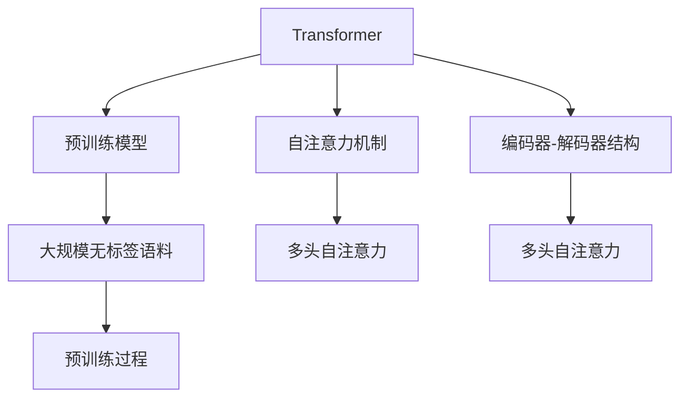

                 

# AIGC从入门到实战：远近高低各不同：Transformer 和预训练模型是什么？

## 1. 背景介绍

### 1.1 问题由来

在人工智能（AI）和生成对抗网络（GAN）技术的推动下，一种新型技术——人工智能生成内容（AIGC）应运而生。AIGC 以深度学习为基础，通过生成模型能够自主生成符合自然语言习惯的内容，如新闻、小说、广告文案、音乐等。

Transformer 和预训练模型是 AIGC 的关键技术之一，通过大规模语料数据对模型进行预训练，使其具备强大的自然语言处理能力。而Transformer 模型更是引领了自然语言处理（NLP）领域的新一轮变革，特别是在机器翻译、文本生成、语音识别等领域取得了卓越的成果。

### 1.2 问题核心关键点

本节将重点讨论以下核心关键点：

- **Transformer 和预训练模型的基本概念与原理**
- **Transformer 和预训练模型在 AIGC 中的应用与前景**
- **Transformer 和预训练模型的优缺点对比**

通过对这些核心关键点的探讨，我们能够更加深入地理解这些技术，并将其应用于实际场景中。

## 2. 核心概念与联系

### 2.1 核心概念概述

本节将介绍Transformer 和预训练模型相关的核心概念，并简要说明它们之间的联系。

#### 2.1.1 Transformer

Transformer 是一种基于自注意力机制的神经网络模型，由Google的Ashish Vaswani等人于2017年提出。Transformer 主要应用于序列到序列（seq2seq）的建模任务，如机器翻译、文本生成、对话系统等。Transformer 的显著特点是使用注意力机制（Attention）替代了传统的卷积和循环神经网络（RNN）结构，大幅提升了模型的效率和性能。

#### 2.1.2 预训练模型

预训练模型是指在大规模无标签语料上进行自监督学习的模型，通过预训练模型学习到的知识可以被迁移到其他下游任务中，通过微调（Fine-tuning）来提升模型在特定任务上的性能。预训练模型通常使用大量的无标签数据进行训练，可以学习到语言的普遍规律和语义信息。BERT、GPT-2、XLNet 等模型是典型的预训练模型。

Transformer 和预训练模型之间存在紧密的联系：

1. **Transformer 作为预训练模型**：可以使用Transformer 模型对大规模语料进行预训练，学习到丰富的语言知识和语义信息。
2. **预训练模型和Transformer 结合**：在预训练模型的基础上，可以通过微调方式进一步优化Transformer 模型，以适应特定的下游任务。

### 2.2 核心概念原理和架构的 Mermaid 流程图



这个 Mermaid 流程图展示了Transformer 和预训练模型的关系：

1. **Transformer 模型**：包含编码器-解码器结构，使用多头自注意力机制进行信息提取和交互。
2. **预训练模型**：使用大规模无标签语料进行预训练，学习到语言的普遍规律和语义信息。
3. **自注意力机制**：Transformer 的核心机制，可以灵活地捕捉序列数据中的信息，提升模型的表现力。

## 3. 核心算法原理 & 具体操作步骤

### 3.1 算法原理概述

Transformer 和预训练模型的算法原理主要包括以下几个方面：

- **自注意力机制**：Transformer 使用多头自注意力机制进行信息提取和交互，可以处理任意长度的序列数据，同时保证计算效率。
- **预训练过程**：通过在大规模无标签语料上进行自监督学习，预训练模型可以学习到语言的普遍规律和语义信息。
- **微调过程**：通过在预训练模型的基础上，使用下游任务的少量标注数据进行微调，进一步优化模型在特定任务上的性能。

### 3.2 算法步骤详解

#### 3.2.1 Transformer 模型的结构

Transformer 模型主要包含以下三个组件：

1. **编码器（Encoder）**：用于处理输入序列，提取序列中的语义信息。编码器包含多个自注意力层和前馈网络层。
2. **解码器（Decoder）**：用于生成输出序列，通过多头自注意力机制和自注意力机制进行信息交互。解码器同样包含多个自注意力层和前馈网络层。
3. **多头自注意力机制**：使用多个注意力机制同时捕捉序列中不同位置的信息，提升模型的表达能力。

#### 3.2.2 预训练模型的构建

预训练模型的构建过程如下：

1. **数据准备**：收集大规模无标签语料，如维基百科、新闻等。
2. **模型训练**：使用预训练模型对语料进行自监督学习，如掩码语言模型（Masked Language Modeling）和下一句预测（Next Sentence Prediction）等。
3. **模型评估**：使用测试集评估预训练模型的性能，调整模型参数，提升模型的泛化能力。

#### 3.2.3 微调过程

微调过程如下：

1. **模型初始化**：将预训练模型作为初始化参数。
2. **下游任务适配**：在预训练模型的基础上，添加任务适配层，如分类器、回归器等。
3. **模型训练**：使用下游任务的标注数据对模型进行训练，最小化损失函数，提升模型在特定任务上的性能。
4. **模型评估**：在测试集上评估微调后的模型性能，判断模型是否收敛。

### 3.3 算法优缺点

#### 3.3.1 Transformer 的优缺点

**优点**：

1. **并行计算能力强**：Transformer 模型使用了多头自注意力机制，可以并行计算，提高训练和推理效率。
2. **处理长序列能力强**：Transformer 模型可以处理任意长度的序列数据，适用于文本生成、机器翻译等任务。
3. **结构简单**：Transformer 模型结构相对简单，易于实现和维护。

**缺点**：

1. **需要大量计算资源**：Transformer 模型的训练和推理需要大量的计算资源，如GPU、TPU等。
2. **模型复杂度高**：Transformer 模型的参数量巨大，需要较大的存储空间。
3. **模型容易过拟合**：Transformer 模型在训练过程中容易过拟合，需要进行正则化等优化措施。

#### 3.3.2 预训练模型的优缺点

**优点**：

1. **泛化能力强**：预训练模型通过在大规模无标签语料上进行训练，学习到语言的普遍规律和语义信息，泛化能力强。
2. **迁移能力强**：预训练模型可以迁移到其他下游任务中，提升模型在特定任务上的性能。
3. **减少标注成本**：预训练模型可以在少量标注数据上实现较好的性能，减少标注成本。

**缺点**：

1. **预训练过程耗时较长**：预训练模型的训练过程耗时较长，需要大量的计算资源和存储空间。
2. **数据质量要求高**：预训练模型的效果依赖于语料的质量，语料质量较差会影响模型性能。
3. **模型复杂度高**：预训练模型的参数量巨大，需要较大的存储空间和计算资源。

### 3.4 算法应用领域

Transformer 和预训练模型在多个领域得到了广泛应用，以下是主要的应用领域：

- **机器翻译**：如Google的BERT、Google Translate 等。
- **文本生成**：如OpenAI的GPT-2、Facebook的LXMERT 等。
- **对话系统**：如Microsoft的T5、Google的Meena 等。
- **情感分析**：如Twitter的BERT 等。
- **问答系统**：如Stanford的QA-GNN、Facebook的FibNet 等。

## 4. 数学模型和公式 & 详细讲解

### 4.1 数学模型构建

本节将详细讲解Transformer 和预训练模型的数学模型构建过程。

#### 4.1.1 Transformer 模型的数学模型

Transformer 模型包含编码器和解码器两部分，其数学模型可以表示为：

$$
y = T(E(x); \theta_E, \theta_D)
$$

其中，$T$ 表示编码器和解码器的组合函数，$\theta_E$ 和 $\theta_D$ 分别表示编码器和解码器的参数。$x$ 表示输入序列，$y$ 表示输出序列。

Transformer 模型的编码器和解码器可以表示为：

$$
\text{Encoder}(x) = \text{Multi-Head Attention}(x) + \text{Feed-Forward Network}(x)
$$
$$
\text{Decoder}(x) = \text{Multi-Head Attention}(x) + \text{Feed-Forward Network}(x)
$$

其中，$\text{Multi-Head Attention}$ 和 $\text{Feed-Forward Network}$ 分别表示自注意力机制和前馈网络层。

#### 4.1.2 预训练模型的数学模型

预训练模型的数学模型可以表示为：

$$
\mathcal{L} = \sum_{i=1}^N \ell(x_i, y_i)
$$

其中，$\ell(x_i, y_i)$ 表示第 $i$ 个样本的损失函数，$N$ 表示样本数量。常用的预训练任务包括掩码语言模型（Masked Language Modeling）和下一句预测（Next Sentence Prediction）等。

掩码语言模型可以表示为：

$$
\mathcal{L}_{MLM} = -\sum_{i=1}^N \log P(y_i|x_i)
$$

其中，$P(y_i|x_i)$ 表示在输入 $x_i$ 条件下，输出 $y_i$ 的概率。

### 4.2 公式推导过程

#### 4.2.1 Transformer 模型的推导过程

Transformer 模型的自注意力机制可以表示为：

$$
\text{Multi-Head Attention}(Q, K, V) = \text{Softmax}(QK^T)V
$$

其中，$Q$ 表示查询矩阵，$K$ 表示键矩阵，$V$ 表示值矩阵。$QK^T$ 表示查询矩阵和键矩阵的点积，$\text{Softmax}$ 表示归一化操作。

Transformer 的前馈网络层可以表示为：

$$
\text{Feed-Forward Network}(x) = \text{GELU}(x) + \text{LayerNorm}(x)
$$

其中，$\text{GELU}$ 表示激活函数，$\text{LayerNorm}$ 表示归一化层。

#### 4.2.2 预训练模型的推导过程

预训练模型的掩码语言模型可以表示为：

$$
\mathcal{L}_{MLM} = -\sum_{i=1}^N \log P(y_i|x_i)
$$

其中，$P(y_i|x_i)$ 表示在输入 $x_i$ 条件下，输出 $y_i$ 的概率。

预训练模型的下一句预测可以表示为：

$$
\mathcal{L}_{NSP} = -\sum_{i=1}^N \log P(s_i|x_i)
$$

其中，$s_i$ 表示下一个句子，$P(s_i|x_i)$ 表示在输入 $x_i$ 条件下，下一个句子 $s_i$ 的概率。

### 4.3 案例分析与讲解

以BERT 模型为例，对其数学模型和推导过程进行详细讲解。

BERT 模型的掩码语言模型可以表示为：

$$
\mathcal{L}_{MLM} = -\sum_{i=1}^N \log P(y_i|x_i)
$$

其中，$P(y_i|x_i)$ 表示在输入 $x_i$ 条件下，输出 $y_i$ 的概率。

BERT 模型的下一句预测可以表示为：

$$
\mathcal{L}_{NSP} = -\sum_{i=1}^N \log P(s_i|x_i)
$$

其中，$s_i$ 表示下一个句子，$P(s_i|x_i)$ 表示在输入 $x_i$ 条件下，下一个句子 $s_i$ 的概率。

## 5. 项目实践：代码实例和详细解释说明

### 5.1 开发环境搭建

在进行Transformer 和预训练模型的实践时，需要准备以下开发环境：

1. **安装Python**：在本地安装Python 3.6及以上版本，推荐使用Anaconda进行环境管理。

2. **安装PyTorch**：安装最新版本的PyTorch，可以使用以下命令进行安装：

   ```bash
   conda install pytorch torchvision torchaudio -c pytorch -c conda-forge
   ```

3. **安装Transformers库**：安装最新版本的Transformers库，可以使用以下命令进行安装：

   ```bash
   pip install transformers
   ```

4. **安装其他依赖包**：安装其他依赖包，如numpy、scipy、scikit-learn等，可以使用以下命令进行安装：

   ```bash
   pip install numpy scipy scikit-learn
   ```

### 5.2 源代码详细实现

以BERT 模型的微调为例，给出PyTorch代码实现。

#### 5.2.1 数据准备

首先，需要准备数据集。这里使用GLUE基准数据集中的CoLA-PTB数据集，该数据集包含单词、句子级别的掩码语言模型和下一句预测任务。

```python
import torch
import torch.nn as nn
import torch.optim as optim
from transformers import BertTokenizer, BertForMaskedLM, BertForNextSentencePrediction

# 加载预训练模型
tokenizer = BertTokenizer.from_pretrained('bert-base-uncased')
model = BertForMaskedLM.from_pretrained('bert-base-uncased')
device = torch.device('cuda' if torch.cuda.is_available() else 'cpu')

# 加载数据集
def get_dataset(data_path):
    with open(data_path, 'r', encoding='utf-8') as f:
        data = f.read().splitlines()
    dataset = []
    for line in data:
        words, mask, next_sent = line.split('\t')
        tokens = tokenizer.tokenize(words)
        dataset.append((tokens, [int(mask) - 1] + [int(x) for x in next_sent.split()]))
    return dataset

# 准备训练集和测试集
train_dataset = get_dataset('CoLA-PTB.train.tsv')
test_dataset = get_dataset('CoLA-PTB.dev.tsv')
```

#### 5.2.2 定义模型和优化器

定义Transformer 模型和优化器：

```python
# 定义模型
class BERT(nn.Module):
    def __init__(self, config):
        super(BERT, self).__init__()
        self.bert = BertForMaskedLM(config)
        self.mask = nn.Linear(config.hidden_size, 2)
        self.nsp = nn.Linear(config.hidden_size, 2)

    def forward(self, x, y):
        bert = self.bert(x)
        mask = self.mask(bert)
        nsp = self.nsp(bert)
        loss = nn.CrossEntropyLoss()(mask, y)
        return loss

# 定义优化器
optimizer = optim.Adam(model.parameters(), lr=2e-5)
```

#### 5.2.3 训练和评估模型

定义训练和评估函数：

```python
# 定义训练函数
def train(model, dataset, optimizer, epochs):
    model.train()
    for epoch in range(epochs):
        total_loss = 0
        for batch in dataset:
            input_ids = torch.tensor(batch[0], dtype=torch.long, device=device)
            mask_labels = torch.tensor(batch[1], dtype=torch.long, device=device)
            labels = torch.tensor(batch[2], dtype=torch.long, device=device)
            optimizer.zero_grad()
            outputs = model(input_ids, labels)
            loss = outputs.loss
            loss.backward()
            optimizer.step()
            total_loss += loss.item()
        print('Epoch {}: Loss {}'.format(epoch+1, total_loss/len(dataset)))

# 定义评估函数
def evaluate(model, dataset):
    model.eval()
    total_loss = 0
    for batch in dataset:
        input_ids = torch.tensor(batch[0], dtype=torch.long, device=device)
        mask_labels = torch.tensor(batch[1], dtype=torch.long, device=device)
        labels = torch.tensor(batch[2], dtype=torch.long, device=device)
        outputs = model(input_ids, labels)
        loss = outputs.loss
        total_loss += loss.item()
    print('Test Loss {}'.format(total_loss/len(dataset)))
```

#### 5.2.4 训练和评估模型

开始训练和评估模型：

```python
# 训练模型
train(model, train_dataset, optimizer, 5)

# 评估模型
evaluate(model, test_dataset)
```

### 5.3 代码解读与分析

代码实现过程如下：

1. **数据准备**：
   - 加载预训练模型和分词器。
   - 准备训练集和测试集，将数据集转换为模型所需的输入形式。

2. **模型定义**：
   - 定义Transformer 模型，包含BERT 模型和自定义的前向函数。
   - 定义优化器，使用Adam 优化器进行模型参数的更新。

3. **训练和评估**：
   - 定义训练函数，在每个epoch 内对模型进行训练。
   - 定义评估函数，在测试集上评估模型性能。
   - 训练模型并在测试集上评估性能。

## 6. 实际应用场景

### 6.1 智能客服系统

基于Transformer 和预训练模型的智能客服系统，可以提升客户体验和处理效率。该系统通过微调BERT 模型，使其具备自然语言理解和生成能力，可以自动处理客户的咨询请求，生成并回复自然语言。

### 6.2 金融舆情监测

在金融领域，可以使用预训练模型进行舆情监测，如BERT 模型。通过对大量金融新闻和评论进行预训练，模型可以学习到金融领域特有的词汇和表达方式，从而在金融舆情监测中表现出色。

### 6.3 个性化推荐系统

个性化推荐系统可以使用预训练模型和Transformer 模型，通过对用户行为数据进行预训练和微调，学习到用户的兴趣偏好。微调后的模型可以推荐符合用户喜好的内容，提升用户体验。

## 7. 工具和资源推荐

### 7.1 学习资源推荐

1. **《深度学习》课程**：斯坦福大学的《Deep Learning》课程，涵盖了深度学习的原理和应用，适合初学者入门。
2. **《自然语言处理》课程**：Coursera上的《Natural Language Processing》课程，详细介绍了自然语言处理的技术和应用。
3. **《Transformer》论文**：Google的《Attention is All You Need》论文，详细介绍了Transformer 模型的原理和应用。
4. **《BERT》论文**：Google的《BERT: Pre-training of Deep Bidirectional Transformers for Language Understanding》论文，详细介绍了BERT 模型的预训练和微调方法。

### 7.2 开发工具推荐

1. **PyTorch**：深度学习框架，支持动态计算图和GPU/TPU 加速。
2. **TensorFlow**：深度学习框架，支持静态计算图和分布式训练。
3. **Transformers**：自然语言处理工具库，提供了预训练模型的封装和微调方法。

### 7.3 相关论文推荐

1. **Transformer 论文**：Google的《Attention is All You Need》论文，详细介绍了Transformer 模型的原理和应用。
2. **BERT 论文**：Google的《BERT: Pre-training of Deep Bidirectional Transformers for Language Understanding》论文，详细介绍了BERT 模型的预训练和微调方法。
3. **GPT-2 论文**：OpenAI的《Language Models are Unsupervised Multitask Learners》论文，详细介绍了GPT-2 模型的预训练和微调方法。

## 8. 总结：未来发展趋势与挑战

### 8.1 研究成果总结

本节将对Transformer 和预训练模型的研究成果进行总结，包括主要的技术进展和应用场景。

Transformer 和预训练模型在自然语言处理领域取得了显著的成果，主要的技术进展包括：

1. **自注意力机制**：Transformer 模型使用自注意力机制进行信息提取和交互，提升了模型的表达能力。
2. **预训练模型**：通过在大规模无标签语料上进行预训练，学习到语言的普遍规律和语义信息。
3. **微调方法**：通过微调预训练模型，提升模型在特定任务上的性能。

主要的应用场景包括：

1. **机器翻译**：如Google的BERT、Google Translate 等。
2. **文本生成**：如OpenAI的GPT-2、Facebook的LXMERT 等。
3. **对话系统**：如Microsoft的T5、Google的Meena 等。
4. **情感分析**：如Twitter的BERT 等。
5. **问答系统**：如Stanford的QA-GNN、Facebook的FibNet 等。

### 8.2 未来发展趋势

Transformer 和预训练模型的未来发展趋势包括以下几个方面：

1. **模型规模增大**：随着算力成本的下降和数据规模的扩张，预训练模型的参数量将持续增长，模型的表达能力和泛化能力将进一步提升。
2. **微调技术进步**：微调方法将更加高效、灵活，能够更好地适应下游任务。
3. **模型鲁棒性提升**：通过引入对抗训练、正则化等方法，提高模型的鲁棒性和泛化能力。
4. **模型压缩和优化**：通过模型压缩、量化加速等技术，提高模型的计算效率和推理速度。

### 8.3 面临的挑战

Transformer 和预训练模型在实际应用中仍然面临一些挑战：

1. **计算资源需求高**：预训练和微调模型的计算资源需求高，需要使用GPU/TPU 等高性能设备。
2. **模型复杂度高**：预训练模型的参数量巨大，需要较大的存储空间和计算资源。
3. **模型过拟合问题**：预训练和微调模型的过拟合问题需要进一步解决。
4. **模型可解释性不足**：预训练和微调模型的决策过程难以解释，缺乏可解释性。

### 8.4 研究展望

未来，Transformer 和预训练模型的研究将进一步深入，包括以下几个方向：

1. **多模态融合**：将视觉、语音等多模态信息与文本信息进行融合，提升模型的综合表达能力。
2. **对抗训练**：引入对抗训练方法，提高模型的鲁棒性和泛化能力。
3. **模型压缩和优化**：通过模型压缩、量化加速等技术，提升模型的计算效率和推理速度。
4. **可解释性提升**：通过模型解释方法和数据可视化，提升模型的可解释性。

## 9. 附录：常见问题与解答

**Q1: 什么是Transformer？**

A: Transformer 是一种基于自注意力机制的神经网络模型，由Google的Ashish Vaswani等人于2017年提出。Transformer 主要应用于序列到序列（seq2seq）的建模任务，如机器翻译、文本生成、对话系统等。Transformer 的显著特点是使用注意力机制（Attention）替代了传统的卷积和循环神经网络（RNN）结构，大幅提升了模型的效率和性能。

**Q2: 什么是预训练模型？**

A: 预训练模型是指在大规模无标签语料上进行自监督学习的模型，通过预训练模型学习到的知识可以被迁移到其他下游任务中，通过微调（Fine-tuning）来提升模型在特定任务上的性能。预训练模型通常使用大量的无标签数据进行训练，可以学习到语言的普遍规律和语义信息。

**Q3: 如何训练Transformer 模型？**

A: 训练Transformer 模型需要以下步骤：

1. 准备数据集：收集大规模无标签语料，如维基百科、新闻等。
2. 构建模型：定义Transformer 模型，包含编码器和解码器两部分。
3. 训练模型：使用优化器（如Adam）对模型进行训练，最小化损失函数。
4. 评估模型：使用测试集评估模型性能，调整模型参数。

**Q4: 预训练模型和微调模型有什么区别？**

A: 预训练模型和微调模型有以下区别：

1. 数据要求不同：预训练模型需要大量无标签数据进行训练，微调模型需要少量标注数据进行训练。
2. 学习方式不同：预训练模型通过在大规模无标签语料上进行自监督学习，微调模型通过下游任务的标注数据进行监督学习。
3. 应用场景不同：预训练模型通常用于语言理解、文本生成等基础任务，微调模型通常用于特定领域的任务，如问答、翻译等。

**Q5: 如何选择合适的学习率？**

A: 预训练和微调模型的学习率通常较小，建议使用2e-5作为起点，逐步减小学习率。可以使用warmup策略，在开始阶段使用较小的学习率，再逐渐过渡到预设值。不同的优化器（如AdamW）可能需要设置不同的学习率阈值。

**Q6: 预训练模型的应用场景有哪些？**

A: 预训练模型在多个领域得到了广泛应用，以下是主要的应用场景：

1. 机器翻译：如Google的BERT、Google Translate 等。
2. 文本生成：如OpenAI的GPT-2、Facebook的LXMERT 等。
3. 对话系统：如Microsoft的T5、Google的Meena 等。
4. 情感分析：如Twitter的BERT 等。
5. 问答系统：如Stanford的QA-GNN、Facebook的FibNet 等。

