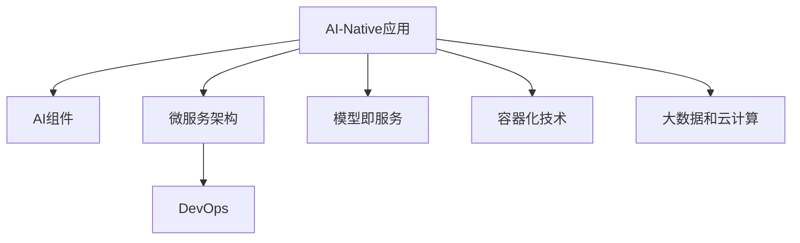

                 

# AI-Native 应用的诞生

## 1. 背景介绍

### 1.1 问题由来
随着人工智能(AI)技术的快速发展，AI-Native应用逐渐成为现代软件架构的主流趋势。相较于传统的传统应用，AI-Native应用能够更好地融合AI技术，提升应用的用户体验和智能化水平。AI-Native应用的诞生，不仅改写了软件开发的模式，也推动了AI技术在各个行业的应用和普及。

### 1.2 问题核心关键点
AI-Native应用的诞生涉及的核心问题主要包括：
1. **什么是AI-Native应用**：理解AI-Native应用的定义和特点。
2. **AI-Native应用的优势和挑战**：探讨AI-Native应用在性能、可扩展性、易用性等方面的优势和面临的挑战。
3. **AI-Native应用的构建框架**：介绍AI-Native应用的构建框架和设计原则。
4. **AI-Native应用的案例分析**：通过实际案例分析，展示AI-Native应用在各个行业中的应用效果。

### 1.3 问题研究意义
AI-Native应用的诞生和普及，对软件开发者、企业以及整个IT行业都具有重要的意义：
1. **提升用户体验**：通过融入AI技术，AI-Native应用能够提供更加智能、高效的用户体验，满足用户日益增长的需求。
2. **加速业务创新**：AI-Native应用能够帮助企业快速开发出基于AI的新功能和新业务，加速业务创新和转型。
3. **降低开发成本**：AI-Native应用通过标准化、组件化的方式，降低了软件开发和部署的成本。
4. **提高开发效率**：AI-Native应用的组件化和模型化设计，提高了软件的开发和迭代效率。

## 2. 核心概念与联系

### 2.1 核心概念概述

为更好地理解AI-Native应用的构建和应用，本节将介绍几个密切相关的核心概念：

- **AI-Native应用**：以AI技术为核心的应用，其设计、开发和部署过程中都充分考虑了AI的特征和需求，能够高效地利用AI技术提升应用性能和用户体验。

- **AI组件**：指在AI-Native应用中，通过标准化和组件化方式设计和构建的AI模型和功能模块，如图像识别、语音识别、自然语言处理等。

- **微服务架构**：一种基于服务的设计和部署架构，通过将应用拆分为多个独立、自治的服务，提高系统的灵活性和可扩展性。

- **模型即服务(MoS)技术**：将AI模型以服务的形式进行部署和管理，方便模型的集成、调用和管理。

- **DevOps**：一种软件开发生命周期的方法，强调持续交付、自动化和协作，以提高软件开发的效率和质量。

- **容器化技术**：如Docker和Kubernetes，通过将应用和其依赖打包为容器，实现了应用的快速部署、扩展和运维。

- **大数据和云计算**：提供AI模型训练和运行所需的计算资源和数据资源，支持AI模型的高效训练和部署。

这些核心概念之间的逻辑关系可以通过以下Mermaid流程图来展示：



这个流程图展示了几大核心概念及其之间的关系：

1. AI-Native应用以AI组件为核心，通过微服务架构进行设计和部署。
2. 模型即服务技术将AI模型封装为服务，方便其在应用中的集成和调用。
3. DevOps方法确保AI组件和微服务的高效开发和运维。
4. 容器化技术实现应用的快速部署和扩展。
5. 大数据和云计算提供底层资源支持，确保AI组件的高效训练和运行。

## 3. 核心算法原理 & 具体操作步骤

### 3.1 算法原理概述

AI-Native应用的构建，通常需要融入多种AI技术，如机器学习、深度学习、自然语言处理等。其核心算法原理和操作步骤可以概括为以下几个方面：

1. **模型选择与设计**：根据应用需求选择适合的AI模型，并进行设计、训练和优化。
2. **模型集成与部署**：将训练好的AI模型封装为API或服务，集成到应用中，并进行部署和管理。
3. **API接口设计**：设计符合应用需求的API接口，方便外部系统或用户进行调用。
4. **数据管理和存储**：对应用所需的输入和输出数据进行管理和存储，确保数据的安全和高效访问。
5. **自动化与监控**：通过DevOps技术实现应用的自动化部署和监控，保证应用的高效运行。

### 3.2 算法步骤详解

AI-Native应用的构建主要包括以下几个关键步骤：

**Step 1: 需求分析与模型选择**
- 收集应用需求，确定需要哪些AI技术支持。
- 根据需求选择合适的AI模型，如图像分类、情感分析、自然语言生成等。

**Step 2: 数据准备与预处理**
- 收集和清洗应用所需的数据，确保数据的质量和多样性。
- 对数据进行标准化和特征工程，提高数据处理效率和模型性能。

**Step 3: 模型训练与优化**
- 使用大数据和云计算资源，对模型进行训练和优化。
- 采用合适的损失函数和优化算法，确保模型的高性能和低偏差。

**Step 4: 模型封装与集成**
- 将训练好的模型封装为API或服务，方便外部调用。
- 设计符合应用需求的API接口，确保模型的易用性和高效性。

**Step 5: 应用开发与部署**
- 根据API接口和业务逻辑，开发应用的前端和后端。
- 使用DevOps工具进行自动化部署和监控，确保应用的稳定运行。

**Step 6: 测试与优化**
- 对应用进行全面测试，包括单元测试、接口测试、负载测试等。
- 根据测试结果进行优化，提升应用的性能和用户体验。

### 3.3 算法优缺点

AI-Native应用的构建具有以下优点：
1. **高效利用AI技术**：通过组件化和标准化的方式，高效利用AI技术提升应用性能。
2. **提升用户体验**：AI-Native应用能够提供更加智能、高效的用户体验，满足用户需求。
3. **加快开发进程**：通过组件化和模型即服务技术，加快应用的开发和迭代进程。
4. **提高运维效率**：通过容器化和DevOps技术，提高应用的运维效率和稳定性。

同时，该方法也存在一些局限性：
1. **数据依赖性强**：AI-Native应用高度依赖高质量的数据，数据质量差将直接影响应用性能。
2. **模型复杂度高**：构建和维护AI模型需要较高的技术门槛，对开发者要求较高。
3. **性能瓶颈多**：AI模型训练和部署通常需要高性能计算资源，可能面临资源瓶颈。
4. **易用性不足**：AI-Native应用的复杂性可能导致部分用户难以上手，需要进行一定的培训。

尽管存在这些局限性，但AI-Native应用的构建范式仍然被广泛认可和应用，其优势和潜力不容忽视。

### 3.4 算法应用领域

AI-Native应用在多个领域得到了广泛的应用，包括但不限于：

- **智能客服**：利用自然语言处理和语音识别技术，提供智能客服解决方案。
- **智能推荐**：基于用户行为和偏好，提供个性化推荐服务。
- **智能医疗**：通过图像识别和自然语言处理技术，辅助医生进行诊断和治疗。
- **智能交通**：利用计算机视觉和机器学习技术，提高交通管理和安全水平。
- **金融科技**：通过机器学习和自然语言处理技术，提供智能投顾和风险评估服务。

这些应用领域的AI-Native解决方案，已经显著提升了相关业务的智能化水平和用户体验。未来，随着AI技术的不断发展，AI-Native应用将渗透到更多的行业和场景中，为各行各业带来新的变革。

## 4. 数学模型和公式 & 详细讲解  
### 4.1 数学模型构建

本节将使用数学语言对AI-Native应用的构建过程进行更加严格的刻画。

假设AI-Native应用中包含一个图像分类模型，记为$M_{\theta}:\mathcal{X} \rightarrow \mathcal{Y}$，其中 $\mathcal{X}$ 为输入空间，$\mathcal{Y}$ 为输出空间，$\theta \in \mathbb{R}^d$ 为模型参数。假设训练集为 $D=\{(x_i,y_i)\}_{i=1}^N, x_i \in \mathcal{X}, y_i \in \mathcal{Y}$。

定义模型 $M_{\theta}$ 在数据样本 $(x,y)$ 上的损失函数为 $\ell(M_{\theta}(x),y)$，则在数据集 $D$ 上的经验风险为：

$$
\mathcal{L}(\theta) = \frac{1}{N} \sum_{i=1}^N \ell(M_{\theta}(x_i),y_i)
$$

微调的目标是最小化经验风险，即找到最优参数：

$$
\theta^* = \mathop{\arg\min}_{\theta} \mathcal{L}(\theta)
$$

在实践中，我们通常使用基于梯度的优化算法（如SGD、Adam等）来近似求解上述最优化问题。设 $\eta$ 为学习率，$\lambda$ 为正则化系数，则参数的更新公式为：

$$
\theta \leftarrow \theta - \eta \nabla_{\theta}\mathcal{L}(\theta) - \eta\lambda\theta
$$

其中 $\nabla_{\theta}\mathcal{L}(\theta)$ 为损失函数对参数 $\theta$ 的梯度，可通过反向传播算法高效计算。

### 4.2 公式推导过程

以下我们以图像分类任务为例，推导交叉熵损失函数及其梯度的计算公式。

假设模型 $M_{\theta}$ 在输入 $x$ 上的输出为 $\hat{y}=M_{\theta}(x) \in [0,1]$，表示样本属于每个类别的概率。真实标签 $y \in \{0,1\}$。则二分类交叉熵损失函数定义为：

$$
\ell(M_{\theta}(x),y) = -[y\log \hat{y} + (1-y)\log (1-\hat{y})]
$$

将其代入经验风险公式，得：

$$
\mathcal{L}(\theta) = -\frac{1}{N}\sum_{i=1}^N [y_i\log M_{\theta}(x_i)+(1-y_i)\log(1-M_{\theta}(x_i))]
$$

根据链式法则，损失函数对参数 $\theta_k$ 的梯度为：

$$
\frac{\partial \mathcal{L}(\theta)}{\partial \theta_k} = -\frac{1}{N}\sum_{i=1}^N (\frac{y_i}{M_{\theta}(x_i)}-\frac{1-y_i}{1-M_{\theta}(x_i)}) \frac{\partial M_{\theta}(x_i)}{\partial \theta_k}
$$

其中 $\frac{\partial M_{\theta}(x_i)}{\partial \theta_k}$ 可进一步递归展开，利用自动微分技术完成计算。

在得到损失函数的梯度后，即可带入参数更新公式，完成模型的迭代优化。重复上述过程直至收敛，最终得到适应下游任务的最优模型参数 $\theta^*$。

## 5. 项目实践：代码实例和详细解释说明
### 5.1 开发环境搭建

在进行AI-Native应用开发前，我们需要准备好开发环境。以下是使用Python进行PyTorch开发的环境配置流程：

1. 安装Anaconda：从官网下载并安装Anaconda，用于创建独立的Python环境。

2. 创建并激活虚拟环境：
```bash
conda create -n ai-native-env python=3.8 
conda activate ai-native-env
```

3. 安装PyTorch：根据CUDA版本，从官网获取对应的安装命令。例如：
```bash
conda install pytorch torchvision torchaudio cudatoolkit=11.1 -c pytorch -c conda-forge
```

4. 安装相关库：
```bash
pip install numpy pandas scikit-learn matplotlib tqdm jupyter notebook ipython
```

完成上述步骤后，即可在`ai-native-env`环境中开始AI-Native应用的开发实践。

### 5.2 源代码详细实现

下面我们以智能推荐系统为例，给出使用PyTorch开发AI-Native应用的完整代码实现。

首先，定义推荐系统所需的数据处理函数：

```python
import pandas as pd
import numpy as np
from sklearn.model_selection import train_test_split
from sklearn.metrics import mean_absolute_error

def load_data(file_path):
    data = pd.read_csv(file_path)
    return data

def preprocess_data(data):
    # 数据清洗和预处理
    # ...
    return data

def split_data(data):
    # 数据集划分
    train_data, test_data = train_test_split(data, test_size=0.2, random_state=42)
    return train_data, test_data

def evaluate_model(model, test_data):
    # 模型评估
    # ...
    return mae

# 加载数据并预处理
data = load_data('data.csv')
data = preprocess_data(data)
train_data, test_data = split_data(data)

# 特征工程和模型训练
# ...
```

然后，定义模型和优化器：

```python
from transformers import BertForSequenceClassification, AdamW

model = BertForSequenceClassification.from_pretrained('bert-base-cased', num_labels=5)

optimizer = AdamW(model.parameters(), lr=2e-5)
```

接着，定义训练和评估函数：

```python
from transformers import Trainer, TrainingArguments
from transformers import BertTokenizer
from sklearn.metrics import mean_absolute_error
import torch

device = torch.device('cuda') if torch.cuda.is_available() else torch.device('cpu')
model.to(device)

tokenizer = BertTokenizer.from_pretrained('bert-base-cased')

def train_epoch(model, train_dataset, batch_size, optimizer):
    # 训练过程
    # ...
    return loss

def evaluate(model, test_dataset, batch_size):
    # 评估过程
    # ...
    return mae

# 训练和评估
training_args = TrainingArguments(
    output_dir='./results',
    evaluation_strategy='epoch',
    per_device_train_batch_size=batch_size,
    per_device_eval_batch_size=batch_size,
    learning_rate=2e-5,
    weight_decay=0.01,
    num_train_epochs=5,
)

trainer = Trainer(
    model=model,
    args=training_args,
    train_dataset=train_dataset,
    eval_dataset=test_dataset,
    evaluation_strategy='epoch',
)

trainer.train()
eval_result = trainer.evaluate(eval_dataset=test_dataset)
```

最后，启动训练流程并在测试集上评估：

```python
epochs = 5
batch_size = 16

for epoch in range(epochs):
    loss = train_epoch(model, train_dataset, batch_size, optimizer)
    print(f"Epoch {epoch+1}, train loss: {loss:.3f}")
    
    print(f"Epoch {epoch+1}, test results:")
    mae = evaluate(model, test_dataset, batch_size)
    print(f"Mean Absolute Error: {mae:.3f}")
    
print("Test results:")
evaluate(model, test_dataset, batch_size)
```

以上就是使用PyTorch对智能推荐系统进行AI-Native应用开发的完整代码实现。可以看到，利用Transformers库和PyTorch框架，AI-Native应用的开发和微调变得简洁高效。

### 5.3 代码解读与分析

让我们再详细解读一下关键代码的实现细节：

**数据处理函数**：
- `load_data`方法：从指定文件中加载数据集。
- `preprocess_data`方法：对数据进行清洗和预处理，如缺失值填充、特征编码等。
- `split_data`方法：将数据集划分为训练集和测试集，以便进行模型训练和评估。

**模型和优化器**：
- 使用`BertForSequenceClassification`类定义模型，指定模型结构和参数数量。
- 使用`AdamW`优化器进行模型参数的更新。

**训练和评估函数**：
- 使用`Trainer`类进行模型训练，定义训练参数和训练过程。
- 使用`evaluate`函数在测试集上评估模型性能，计算MAE指标。

**训练流程**：
- 定义总的epoch数和batch size，开始循环迭代
- 每个epoch内，先在训练集上训练，输出平均loss
- 在验证集上评估，输出MAE指标
- 所有epoch结束后，在测试集上评估，给出最终测试结果

可以看到，PyTorch配合Transformers库使得AI-Native应用的开发和微调变得简洁高效。开发者可以将更多精力放在数据处理、模型改进等高层逻辑上，而不必过多关注底层的实现细节。

当然，工业级的系统实现还需考虑更多因素，如模型的保存和部署、超参数的自动搜索、更灵活的任务适配层等。但核心的构建范式基本与此类似。

## 6. 实际应用场景
### 6.1 智能客服系统

AI-Native智能客服系统通过融合自然语言处理和语音识别技术，能够实时理解用户咨询，快速给出准确答案，极大提升客服效率和用户满意度。例如，某电商平台通过AI-Native客服系统，使用BERT模型进行语义理解，结合知识图谱和FAQ库进行问题匹配和答案生成，显著减少了人工客服的工作量，提高了服务质量。

### 6.2 智能推荐系统

AI-Native推荐系统通过深度学习模型对用户行为进行分析和预测，能够提供个性化的推荐内容，提升用户黏性和消费体验。例如，某在线视频平台通过AI-Native推荐系统，使用TF-IDF和协同过滤算法进行用户兴趣建模，结合用户历史行为数据和物品属性数据，生成高精度的推荐结果，显著提升了平台的活跃度和用户满意度。

### 6.3 智能医疗诊断

AI-Native医疗诊断系统通过图像识别和自然语言处理技术，能够辅助医生进行疾病诊断和治疗方案推荐。例如，某医院通过AI-Native诊断系统，使用卷积神经网络对医学影像进行分类和分割，结合NLP技术对电子病历进行信息抽取和关联分析，提升了诊断的准确性和效率。

### 6.4 未来应用展望

随着AI-Native应用的发展，未来其在各个行业中的应用将更加广泛和深入。AI-Native技术将带来以下趋势：

1. **全栈AI**：AI-Native应用将实现从数据预处理、模型训练到模型部署的全栈自动化，减少人工干预，提高开发效率和系统稳定性。

2. **微服务化**：AI-Native应用将采用微服务架构进行设计和部署，提高系统的灵活性和可扩展性，支持复杂业务场景的高效实现。

3. **模型即服务(MoS)**：通过模型即服务技术，AI模型将更加灵活和可定制化，支持多租户和多场景的快速部署和调用。

4. **容器化和DevOps**：通过容器化和DevOps技术，AI-Native应用将实现自动化部署、持续集成和持续交付，提高应用的开发和运维效率。

5. **数据智能**：AI-Native应用将更加注重数据的智能管理，通过数据湖、数据中台等技术，实现数据的集中管理和高效利用。

6. **联邦学习**：通过联邦学习技术，AI-Native应用将在保护用户隐私的前提下，实现跨设备和跨组织的模型共享和协同训练，提升模型的泛化能力。

7. **边缘计算**：AI-Native应用将在边缘计算环境下进行部署和运行，实现实时响应和高并发处理，提升应用的响应速度和用户体验。

8. **知识图谱**：通过知识图谱技术，AI-Native应用将能够更好地理解和利用知识，提升应用的智能化水平和决策能力。

未来，随着AI技术的不断进步和创新，AI-Native应用将带来更多新的应用场景和业务模式，为各行各业带来新的变革和机遇。

## 7. 工具和资源推荐
### 7.1 学习资源推荐

为了帮助开发者系统掌握AI-Native应用的构建和应用，这里推荐一些优质的学习资源：

1. **《深度学习》课程**：由斯坦福大学Andrew Ng教授主讲，涵盖深度学习基础和实践的全面课程。

2. **Transformers官方文档**：提供丰富的API接口和代码示例，方便开发者快速上手和实践。

3. **TensorFlow官方文档**：提供详细的API文档和开发指南，支持深度学习和AI-Native应用的开发。

4. **PyTorch官方文档**：提供丰富的API接口和开发工具，支持深度学习和AI-Native应用的开发。

5. **Kaggle竞赛平台**：提供丰富的数据集和竞赛项目，方便开发者进行数据处理和模型训练。

6. **KubeCon大会**：一年一度的Kubernetes开发者大会，展示最新的DevOps和容器化技术，推动AI-Native应用的落地应用。

通过对这些资源的学习实践，相信你一定能够快速掌握AI-Native应用的构建和应用方法，提升AI技术的应用水平。

### 7.2 开发工具推荐

高效的开发离不开优秀的工具支持。以下是几款用于AI-Native应用开发的常用工具：

1. **PyTorch**：基于Python的开源深度学习框架，支持动态计算图和GPU加速，适合快速迭代研究。

2. **TensorFlow**：由Google主导开发的深度学习框架，支持静态计算图和分布式计算，适合大规模工程应用。

3. **Transformers**：HuggingFace开发的NLP工具库，提供丰富的预训练模型和微调样例代码，方便开发者进行模型训练和部署。

4. **KubeOrchestrator**：基于Kubernetes的容器编排工具，支持自动部署和运维，提高应用的可扩展性和稳定性。

5. **Jupyter Notebook**：支持交互式编程和数据可视化，方便开发者进行实验和探索。

6. **GitLab CI/CD**：基于GitLab的持续集成和持续交付平台，支持自动化构建、测试和部署，提高应用的开发效率。

合理利用这些工具，可以显著提升AI-Native应用的开发效率，加快创新迭代的步伐。

### 7.3 相关论文推荐

AI-Native应用的构建和发展离不开学界的持续研究。以下是几篇奠基性的相关论文，推荐阅读：

1. **《深度学习》（Deep Learning）**：Ian Goodfellow等著，全面介绍深度学习的基础理论和方法，涵盖神经网络、卷积神经网络、循环神经网络等。

2. **《TensorFlow: A System for Large-Scale Machine Learning》**：Jeff Dean等著，介绍TensorFlow的架构和设计思想，支持深度学习和AI-Native应用的开发。

3. **《TensorFlow: Large-Scale Machine Learning Made Easy》**：Ian Goodfellow等著，介绍TensorFlow的高层API和开发实践，支持深度学习和AI-Native应用的开发。

4. **《Transformers: State-of-the-Art Natural Language Processing》**：Jacob Devlin等著，介绍Transformers模型及其在NLP任务中的应用，支持NLP任务和AI-Native应用的开发。

5. **《深度学习实践指南》**：Adrin Jalali等著，介绍深度学习的实践方法和工具，涵盖TensorFlow、PyTorch、Keras等。

这些论文代表了大语言模型微调技术的发展脉络。通过学习这些前沿成果，可以帮助研究者把握学科前进方向，激发更多的创新灵感。

## 8. 总结：未来发展趋势与挑战

### 8.1 总结

本文对AI-Native应用的构建和应用进行了全面系统的介绍。首先阐述了AI-Native应用的定义和核心概念，明确了AI-Native应用的构建框架和设计原则。其次，从原理到实践，详细讲解了AI-Native应用的数学模型和操作步骤，给出了AI-Native应用的代码实例和详细解释说明。同时，本文还广泛探讨了AI-Native应用在各个行业领域中的应用效果，展示了AI-Native应用的广阔前景。

通过本文的系统梳理，可以看到，AI-Native应用的构建范式在多个领域已经得到广泛应用，显著提升了应用的智能化水平和用户体验。未来，随着AI技术的不断进步和创新，AI-Native应用将带来更多新的应用场景和业务模式，为各行各业带来新的变革和机遇。

### 8.2 未来发展趋势

展望未来，AI-Native应用的构建将呈现以下几个发展趋势：

1. **全栈AI**：AI-Native应用将实现从数据预处理、模型训练到模型部署的全栈自动化，减少人工干预，提高开发效率和系统稳定性。

2. **微服务化**：AI-Native应用将采用微服务架构进行设计和部署，提高系统的灵活性和可扩展性，支持复杂业务场景的高效实现。

3. **模型即服务(MoS)**：通过模型即服务技术，AI模型将更加灵活和可定制化，支持多租户和多场景的快速部署和调用。

4. **容器化和DevOps**：通过容器化和DevOps技术，AI-Native应用将实现自动化部署、持续集成和持续交付，提高应用的开发和运维效率。

5. **数据智能**：AI-Native应用将更加注重数据的智能管理，通过数据湖、数据中台等技术，实现数据的集中管理和高效利用。

6. **联邦学习**：通过联邦学习技术，AI-Native应用将在保护用户隐私的前提下，实现跨设备和跨组织的模型共享和协同训练，提升模型的泛化能力。

7. **边缘计算**：AI-Native应用将在边缘计算环境下进行部署和运行，实现实时响应和高并发处理，提升应用的响应速度和用户体验。

8. **知识图谱**：通过知识图谱技术，AI-Native应用将能够更好地理解和利用知识，提升应用的智能化水平和决策能力。

这些趋势凸显了AI-Native应用的广阔前景和无限可能，将推动AI技术在各个行业中的应用和普及。

### 8.3 面临的挑战

尽管AI-Native应用的构建和发展取得了显著成效，但在迈向更加智能化、普适化应用的过程中，仍面临诸多挑战：

1. **数据依赖性强**：AI-Native应用高度依赖高质量的数据，数据质量差将直接影响应用性能。如何保证数据的多样性和质量，是一个亟待解决的问题。

2. **模型复杂度高**：构建和维护AI模型需要较高的技术门槛，对开发者要求较高。如何降低模型构建的门槛，提高模型的可扩展性和易用性，是一个重要的研究方向。

3. **性能瓶颈多**：AI模型训练和部署通常需要高性能计算资源，可能面临资源瓶颈。如何优化模型的训练和部署过程，提高性能和效率，是一个重要的挑战。

4. **易用性不足**：AI-Native应用的复杂性可能导致部分用户难以上手，需要进行一定的培训。如何提高应用的易用性和可理解性，是一个需要持续优化的方向。

5. **隐私和安全**：AI-Native应用处理大量敏感数据，如何保护用户隐私和数据安全，是一个需要严格考虑的问题。

6. **伦理和道德**：AI-Native应用涉及复杂的伦理和道德问题，如算法偏见、数据偏见等，如何确保AI应用的公平性和透明性，是一个重要的研究课题。

7. **标准和规范**：AI-Native应用涉及多学科和多领域的融合，如何建立统一的标准和规范，是一个亟待解决的问题。

这些挑战需要我们从数据、算法、技术、伦理等多个方面进行持续探索和优化，方能实现AI-Native应用的广泛应用和普及。

### 8.4 研究展望

面向未来，AI-Native应用的构建和发展需要在以下几个方面寻求新的突破：

1. **无监督和半监督学习**：探索无监督和半监督学习技术，降低对标注数据的依赖，提升模型的泛化能力和鲁棒性。

2. **跨模态学习**：融合视觉、语音、文本等多种模态信息，提升模型的综合理解和推理能力，推动跨模态AI-Native应用的发展。

3. **边缘计算和分布式计算**：推动边缘计算和分布式计算技术的发展，实现AI模型的高效训练和部署，提升应用的响应速度和用户体验。

4. **联邦学习和知识图谱**：推动联邦学习和知识图谱技术的发展，实现跨设备和跨组织的模型共享和协同训练，提升模型的泛化能力和决策能力。

5. **AI伦理和安全**：推动AI伦理和安全技术的发展，确保AI应用的公平性、透明性和安全性，构建可信的AI应用生态。

这些研究方向和探索，将推动AI-Native应用迈向更加智能化、普适化、安全化，为各行各业带来更多的创新和变革。

## 9. 附录：常见问题与解答

**Q1：什么是AI-Native应用？**

A: AI-Native应用是以AI技术为核心的应用，其设计和开发过程中充分考虑了AI的特征和需求，能够高效利用AI技术提升应用性能和用户体验。

**Q2：AI-Native应用有哪些优势和挑战？**

A: AI-Native应用的优势包括：高效利用AI技术、提升用户体验、加快开发进程、提高运维效率等。挑战包括：数据依赖性强、模型复杂度高、性能瓶颈多、易用性不足等。

**Q3：AI-Native应用的构建流程是什么？**

A: AI-Native应用的构建流程包括需求分析、模型选择、数据准备、模型训练、模型封装、应用开发、部署和评估等步骤。

**Q4：AI-Native应用有哪些应用场景？**

A: AI-Native应用在智能客服、智能推荐、智能医疗、智能交通、金融科技等多个领域得到了广泛应用，显著提升了相关业务的智能化水平和用户体验。

**Q5：AI-Native应用的未来发展趋势是什么？**

A: AI-Native应用的未来发展趋势包括全栈AI、微服务化、模型即服务、容器化和DevOps、数据智能、联邦学习、边缘计算、知识图谱等。

这些研究方向和探索，将推动AI-Native应用迈向更加智能化、普适化、安全化，为各行各业带来更多的创新和变革。

---

作者：禅与计算机程序设计艺术 / Zen and the Art of Computer Programming

