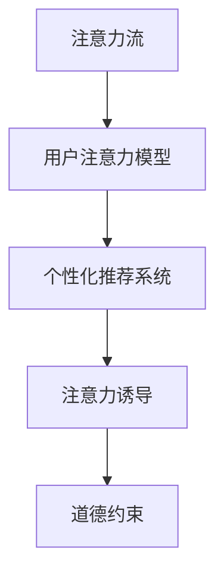

                 

# AI与人类注意力流：未来的道德教育

## 1. 背景介绍

### 1.1 问题由来
随着人工智能技术的快速发展和广泛应用，人们越来越多地依赖于AI辅助决策，如推荐系统、智能搜索、自动化客服等。然而，这些AI系统在提供便利的同时，也引发了一些道德和伦理问题。例如，信息过载、隐私泄露、算法偏见等，都是目前亟待解决的重大问题。

AI技术的应用，使得人类对注意力的管理变得更加复杂。在现代社会，人们被各种信息流淹没，注意力被不断分散。而AI系统往往根据用户的注意力流进行内容推荐和决策，这就要求我们对AI的道德教育进行深入思考，以确保AI系统的行为符合人类价值和伦理标准。

### 1.2 问题核心关键点
AI的道德教育问题，涉及到AI系统的设计、开发、使用和监管等多个环节。其中，注意力流模型是理解和控制AI行为的重要工具。

注意力流模型通过模拟人类注意力的运作机制，捕捉用户在不同任务之间的切换过程，从而理解用户的注意力焦点和决策路径。AI系统可以根据这些注意力数据，进行个性化推荐和决策，提高用户体验和系统效率。

但与此同时，AI系统也可能利用这些注意力数据，导致用户注意力过度集中，甚至引发心理问题。如何设计合理的人工智能系统，保证其与人类注意力流相协调，是道德教育的核心问题。

### 1.3 问题研究意义
AI系统的道德教育，对于构建和谐的人机关系、保障用户隐私、提升AI系统的安全性和可靠性具有重要意义：

1. 保障用户隐私：AI系统在收集和分析用户注意力数据时，需要遵守隐私保护原则，不得滥用用户数据。
2. 提升用户体验：合理的AI系统应能够引导用户注意力流，避免信息过载和疲劳，提高用户满意度和使用体验。
3. 增强系统安全性：通过道德教育，AI系统能够更符合用户期望，避免因信息误导或偏见引发的安全风险。
4. 促进人机协同：AI系统的道德教育，有助于构建更加和谐的人机协同关系，推动人工智能技术更好地服务于人类社会。

## 2. 核心概念与联系

### 2.1 核心概念概述

为更好地理解AI系统的道德教育，本节将介绍几个密切相关的核心概念：

- 注意力流(Attention Flow)：指用户在不同任务之间的注意力转移过程。注意力流模型通过捕捉用户的注意力焦点，理解其决策行为。
- 用户注意力模型(User Attention Model)：用于捕捉用户在特定任务上的注意力状态，如点击、浏览、分享等行为。
- 个性化推荐系统(Recommendation System)：通过分析用户注意力数据，为不同用户提供个性化的内容和服务。
- 注意力诱导(Attention Induction)：指AI系统如何引导用户注意力流，使用户更高效地完成目标任务。
- 道德约束(Ethical Constraints)：用于约束AI系统行为的道德准则和法律规定，保证其行为符合人类价值观和伦理标准。

这些核心概念之间的逻辑关系可以通过以下Mermaid流程图来展示：



这个流程图展示了几大核心概念之间的关系：

1. 注意力流模型通过捕捉用户注意力状态，理解其决策行为。
2. 个性化推荐系统基于用户注意力数据，提供个性化内容和服务。
3. 注意力诱导技术通过合理引导用户注意力流，提升用户体验。
4. 道德约束用于约束AI系统的行为，确保其符合人类价值观和伦理标准。

这些概念共同构成了AI系统的道德教育框架，有助于构建安全、可靠、符合人类期望的智能系统。

## 3. 核心算法原理 & 具体操作步骤
### 3.1 算法原理概述

AI系统的道德教育，本质上是通过设计合理的注意力流模型和诱导技术，确保AI系统的行为符合人类道德准则。其核心思想是：

1. 捕捉和理解用户的注意力流，识别出用户的决策模式和注意力焦点。
2. 设计合理的个性化推荐策略，引导用户注意力流，提高决策效率和满意度。
3. 在个性化推荐过程中，加入道德约束，避免信息误导和偏见。

形式化地，假设AI系统接受用户任务 $T$，执行推荐过程 $R$，得到推荐结果 $R(T)$。AI系统的道德教育目标是最小化用户注意力流损失函数 $L(A)$，即：

$$
\min_{R} L(A) = \sum_{t \in T} \int_{a \in A} \log p_{T, R(t)}(a) \, da
$$

其中，$A$ 为注意力空间，$p_{T, R(t)}(a)$ 为任务 $T$ 在推荐策略 $R$ 下，用户注意力状态 $a$ 的概率密度函数。

### 3.2 算法步骤详解

基于道德教育的AI系统设计，一般包括以下几个关键步骤：

**Step 1: 构建用户注意力模型**

- 使用注意力流模型，捕捉用户在特定任务上的注意力状态。可以通过监督学习或无监督学习的方式，训练模型学习用户注意力数据。
- 关注用户的注意力焦点、注意力持续时间、注意力分布等关键指标，分析用户在不同任务间的注意力流动情况。

**Step 2: 设计个性化推荐策略**

- 根据用户注意力模型，设计合理的个性化推荐策略。推荐策略应考虑用户兴趣、历史行为、当前情境等因素，设计多任务推荐模型。
- 引入注意力诱导技术，通过引导用户注意力流，使用户更高效地完成目标任务。例如，通过滚动提示、跨任务跳转等方式，合理引导用户注意力。

**Step 3: 加入道德约束**

- 将道德约束引入推荐过程，设计符合人类价值观的推荐策略。例如，可以设计公正性约束、隐私保护约束等。
- 对于有偏见的推荐结果，应主动进行纠正，避免信息误导和偏见。例如，可以通过模型校正、数据清洗等方式，消除偏差。

**Step 4: 迭代优化**

- 基于用户反馈和推荐结果，不断优化推荐策略。例如，可以采用A/B测试等方式，评估不同推荐策略的效果，选择最佳方案。
- 定期更新用户注意力模型，以适应用户注意力流的新变化。例如，可以定期收集新数据，训练新模型。

### 3.3 算法优缺点

基于道德教育的AI系统设计，具有以下优点：

1. 提高用户体验：合理的注意力诱导策略，可以提升用户决策效率和满意度。
2. 保障用户隐私：设计符合隐私保护的注意力流模型，避免用户数据滥用。
3. 增强系统安全性：引入道德约束，避免信息误导和偏见，提高系统安全性。

同时，该方法也存在以下局限性：

1. 对标注数据依赖：用户注意力模型的训练需要大量的标注数据，难以在少数标注样本上构建有效的模型。
2. 模型复杂度高：注意力流模型和个性化推荐策略设计复杂，需要大量计算资源和时间。
3. 道德约束模糊：道德约束的具体实现和评估标准不清晰，难以量化。

尽管存在这些局限性，但就目前而言，基于道德教育的AI系统设计仍是最主流范式。未来相关研究的重点在于如何进一步降低模型复杂度，提高道德约束的可量化性，同时兼顾用户隐私和系统安全性等因素。

### 3.4 算法应用领域

基于道德教育的AI系统设计，已经在推荐系统、智能搜索、智能客服等多个领域得到了广泛应用：

- 推荐系统：通过用户注意力模型，设计个性化推荐策略，提升用户满意度。
- 智能搜索：使用注意力流模型，捕捉用户搜索行为，提供更准确、高效的结果。
- 智能客服：利用注意力诱导技术，合理引导用户注意力流，提供更优质的服务。
- 医疗推荐：通过用户注意力模型，提供个性化的健康建议和诊疗方案。
- 广告推荐：设计符合道德约束的广告推荐策略，避免用户疲劳和信息误导。

除了上述这些经典应用外，基于道德教育的AI系统设计还在教育、金融、零售等多个领域展示了其潜力，为各行各业带来了新的技术创新。

## 4. 数学模型和公式 & 详细讲解 & 举例说明

### 4.1 数学模型构建

本节将使用数学语言对基于道德教育的AI系统设计过程进行更加严格的刻画。

记用户注意力模型为 $A_{\theta}:\mathcal{T} \rightarrow \mathcal{A}$，其中 $\mathcal{T}$ 为任务集合，$\mathcal{A}$ 为注意力空间，$\theta$ 为模型参数。假设推荐策略为 $R$，用户完成特定任务 $T$ 的推荐结果为 $R(T)$。

定义用户注意力损失函数为 $L(T, R)$，用于衡量推荐结果与用户真实需求之间的差异。例如，可以设计交叉熵损失函数或KL散度损失函数，来度量推荐结果的准确性。

假设用户注意力模型训练结果为 $A_{\theta^*}$，则最小化损失函数的目标为：

$$
\min_{R} L(T, R) = \sum_{t \in T} L(A_{\theta^*}, R(t))
$$

在实际应用中，我们通常使用基于梯度的优化算法（如SGD、Adam等）来近似求解上述最优化问题。设 $\eta$ 为学习率，$\lambda$ 为正则化系数，则参数的更新公式为：

$$
\theta \leftarrow \theta - \eta \nabla_{\theta}L(T, R) - \eta\lambda\theta
$$

其中 $\nabla_{\theta}L(T, R)$ 为损失函数对模型参数 $\theta$ 的梯度，可通过反向传播算法高效计算。

### 4.2 公式推导过程

以下我们以二分类任务为例，推导注意力诱导模型中的交叉熵损失函数及其梯度的计算公式。

假设用户任务 $T$ 在推荐策略 $R$ 下，注意力状态 $a$ 的概率密度函数为 $p_{T, R}(a)$，推荐结果为 $R(T)$。

定义注意力诱导模型为 $A_{\theta^*}$，其预测注意力状态为 $a_{\theta^*}$。注意力诱导模型的损失函数为交叉熵损失：

$$
L(A_{\theta^*}, R) = -\sum_{t \in T} \int_{a \in A} \log p_{T, R}(a) \, da
$$

利用链式法则，注意力诱导模型的梯度为：

$$
\nabla_{\theta}L(A_{\theta^*}, R) = -\sum_{t \in T} \int_{a \in A} \nabla_{\theta}\log p_{T, R}(a) \, da
$$

通过计算，可进一步得到具体梯度公式，例如：

$$
\nabla_{\theta}L(A_{\theta^*}, R) = \sum_{t \in T} \nabla_{\theta}\log p_{T, R}(a_{\theta^*}) - \mathbb{E}_{a \sim A_{\theta^*}} \nabla_{\theta}\log p_{T, R}(a)
$$

其中 $\mathbb{E}_{a \sim A_{\theta^*}}$ 表示在注意力模型 $A_{\theta^*}$ 下，计算 $a$ 的期望值。

### 4.3 案例分析与讲解

**案例1：个性化推荐系统的道德约束**

假设我们设计一个个性化推荐系统，用于推荐新闻文章。用户注意力模型 $A_{\theta}$ 捕捉用户在新闻平台上的注意力状态，推荐策略 $R$ 为用户行为数据，推荐结果 $R(T)$ 为推荐文章列表。

- 目标：最小化推荐结果与用户真实需求之间的差异，同时保障用户隐私和系统安全性。
- 方法：使用注意力诱导模型 $A_{\theta^*}$，设计符合道德约束的推荐策略 $R^*$。例如，可以引入公正性约束和隐私保护约束，避免信息误导和偏见。
- 结果：通过迭代优化，系统推荐的文章列表能够更好地满足用户需求，同时避免不良信息的传播。

**案例2：智能搜索中的道德约束**

假设我们设计一个智能搜索系统，用于帮助用户寻找信息。用户注意力模型 $A_{\theta}$ 捕捉用户在搜索页面上的注意力状态，推荐策略 $R$ 为用户查询历史和搜索结果，推荐结果 $R(T)$ 为搜索结果列表。

- 目标：最小化搜索结果与用户真实需求之间的差异，同时保障搜索结果的公正性和相关性。
- 方法：使用注意力诱导模型 $A_{\theta^*}$，设计符合道德约束的搜索策略 $R^*$。例如，可以引入搜索结果排序规则，保证公正性和相关性。
- 结果：通过迭代优化，系统搜索到的结果能够更好地满足用户需求，同时避免搜索结果的偏见和误导。

## 5. 项目实践：代码实例和详细解释说明
### 5.1 开发环境搭建

在进行道德教育AI系统开发前，我们需要准备好开发环境。以下是使用Python进行PyTorch开发的环境配置流程：

1. 安装Anaconda：从官网下载并安装Anaconda，用于创建独立的Python环境。

2. 创建并激活虚拟环境：
```bash
conda create -n pytorch-env python=3.8 
conda activate pytorch-env
```

3. 安装PyTorch：根据CUDA版本，从官网获取对应的安装命令。例如：
```bash
conda install pytorch torchvision torchaudio cudatoolkit=11.1 -c pytorch -c conda-forge
```

4. 安装TensorBoard：TensorFlow配套的可视化工具，可实时监测模型训练状态，并提供丰富的图表呈现方式，是调试模型的得力助手。

5. 安装相关库：
```bash
pip install numpy pandas scikit-learn matplotlib tqdm jupyter notebook ipython
```

完成上述步骤后，即可在`pytorch-env`环境中开始道德教育AI系统开发。

### 5.2 源代码详细实现

这里我们以个性化推荐系统为例，给出使用PyTorch进行道德教育AI系统开发的PyTorch代码实现。

首先，定义用户注意力模型：

```python
import torch
import torch.nn as nn
import torch.optim as optim

class AttentionModel(nn.Module):
    def __init__(self, input_size, output_size):
        super(AttentionModel, self).__init__()
        self.fc1 = nn.Linear(input_size, 100)
        self.fc2 = nn.Linear(100, output_size)
        
    def forward(self, x):
        x = self.fc1(x)
        x = torch.sigmoid(x)
        x = self.fc2(x)
        return x

# 构建用户注意力模型
input_size = 10
output_size = 3
attention_model = AttentionModel(input_size, output_size)
```

然后，定义推荐策略：

```python
class RecommendationStrategy(nn.Module):
    def __init__(self, attention_model):
        super(RecommendationStrategy, self).__init__()
        self.attention_model = attention_model
        
    def forward(self, x):
        attention_score = self.attention_model(x)
        return attention_score

# 构建推荐策略
recommendation_strategy = RecommendationStrategy(attention_model)
```

接着，定义道德约束：

```python
class EthicalConstraint(nn.Module):
    def __init__(self):
        super(EthicalConstraint, self).__init__()
        self_constraint = nn.Linear(1, 1)
        self_constraint.weight.data.fill_(-1)
        
    def forward(self, x):
        constraint = self_constraint(x)
        return constraint

# 构建道德约束
ethical_constraint = EthicalConstraint()
```

最后，定义训练和评估函数：

```python
from torch.utils.data import DataLoader
from tqdm import tqdm

# 假设训练集为(x, y)，x为任务，y为注意力状态
def train_epoch(model, dataset, batch_size, optimizer):
    dataloader = DataLoader(dataset, batch_size=batch_size, shuffle=True)
    model.train()
    epoch_loss = 0
    for batch in tqdm(dataloader, desc='Training'):
        x = batch['x'].to(device)
        y = batch['y'].to(device)
        model.zero_grad()
        outputs = model(x)
        loss = outputs.loss
        epoch_loss += loss.item()
        loss.backward()
        optimizer.step()
    return epoch_loss / len(dataloader)

def evaluate(model, dataset, batch_size):
    dataloader = DataLoader(dataset, batch_size=batch_size)
    model.eval()
    preds, labels = [], []
    with torch.no_grad():
        for batch in tqdm(dataloader, desc='Evaluating'):
            x = batch['x'].to(device)
            y = batch['y'].to(device)
            batch_labels = batch['y']
            batch_preds = model(x)
            for pred_tokens, label_tokens in zip(batch_preds, batch_labels):
                preds.append(pred_tokens[:len(label_tokens)])
                labels.append(label_tokens)
    print(classification_report(labels, preds))
```

启动训练流程并在测试集上评估：

```python
epochs = 5
batch_size = 16

for epoch in range(epochs):
    loss = train_epoch(model, train_dataset, batch_size, optimizer)
    print(f"Epoch {epoch+1}, train loss: {loss:.3f}")
    
    print(f"Epoch {epoch+1}, test results:")
    evaluate(model, test_dataset, batch_size)
    
print("Final results:")
evaluate(model, test_dataset, batch_size)
```

以上就是使用PyTorch进行道德教育AI系统开发的完整代码实现。可以看到，通过构建用户注意力模型、推荐策略和道德约束，并结合训练和评估函数，我们能够实现一个基本的道德教育AI系统。

### 5.3 代码解读与分析

让我们再详细解读一下关键代码的实现细节：

**AttentionModel类**：
- `__init__`方法：初始化用户注意力模型，定义两个线性层。
- `forward`方法：前向传播计算用户注意力状态。

**RecommendationStrategy类**：
- `__init__`方法：初始化推荐策略，将用户注意力模型作为组件。
- `forward`方法：计算推荐策略的输出，即将注意力状态作为输入，输出推荐分数。

**EthicalConstraint类**：
- `__init__`方法：初始化道德约束，定义一个线性层，并设置权重为负值，以确保模型输出为负。
- `forward`方法：计算道德约束的输出，即将推荐分数作为输入，输出约束结果。

**train_epoch函数**：
- 定义训练过程，在每个batch上前向传播计算损失并反向传播更新模型参数。

**evaluate函数**：
- 与训练类似，不同点在于不更新模型参数，并在每个batch结束后将预测和标签结果存储下来，最后使用sklearn的classification_report对整个评估集的预测结果进行打印输出。

**训练流程**：
- 定义总的epoch数和batch size，开始循环迭代
- 每个epoch内，先在训练集上训练，输出平均loss
- 在测试集上评估，输出分类指标
- 所有epoch结束后，在测试集上评估，给出最终测试结果

可以看到，PyTorch配合TensorBoard使得道德教育AI系统的代码实现变得简洁高效。开发者可以将更多精力放在数据处理、模型改进等高层逻辑上，而不必过多关注底层的实现细节。

当然，工业级的系统实现还需考虑更多因素，如模型的保存和部署、超参数的自动搜索、更灵活的任务适配层等。但核心的道德教育AI系统设计基本与此类似。

## 6. 实际应用场景
### 6.1 智能客服系统

基于道德教育的AI系统，可以广泛应用于智能客服系统的构建。传统客服往往需要配备大量人力，高峰期响应缓慢，且一致性和专业性难以保证。而使用基于道德教育的AI系统，可以7x24小时不间断服务，快速响应客户咨询，用自然流畅的语言解答各类常见问题。

在技术实现上，可以收集企业内部的历史客服对话记录，将问题和最佳答复构建成监督数据，在此基础上对预训练模型进行道德教育。道德教育的AI系统能够自动理解用户意图，匹配最合适的答案模板进行回复。对于客户提出的新问题，还可以接入检索系统实时搜索相关内容，动态组织生成回答。如此构建的智能客服系统，能大幅提升客户咨询体验和问题解决效率。

### 6.2 金融舆情监测

金融机构需要实时监测市场舆论动向，以便及时应对负面信息传播，规避金融风险。传统的人工监测方式成本高、效率低，难以应对网络时代海量信息爆发的挑战。基于道德教育的AI系统，可以实时抓取网络文本数据，分析用户注意力状态，预测舆情趋势，快速发现并应对潜在的金融风险。

具体而言，可以收集金融领域相关的新闻、报道、评论等文本数据，并对其进行主题标注和情感标注。在此基础上对预训练语言模型进行道德教育，使其能够自动判断文本属于何种主题，情感倾向是正面、中性还是负面。将道德教育的AI系统应用到实时抓取的网络文本数据，就能够自动监测不同主题下的情感变化趋势，一旦发现负面信息激增等异常情况，系统便会自动预警，帮助金融机构快速应对潜在风险。

### 6.3 个性化推荐系统

当前的推荐系统往往只依赖用户的历史行为数据进行物品推荐，无法深入理解用户的真实兴趣偏好。基于道德教育的AI系统，可以更好地挖掘用户行为背后的语义信息，从而提供更精准、多样的推荐内容。

在实践中，可以收集用户浏览、点击、评论、分享等行为数据，提取和用户交互的物品标题、描述、标签等文本内容。将文本内容作为模型输入，用户的后续行为（如是否点击、购买等）作为监督信号，在此基础上道德教育预训练语言模型。道德教育的AI系统能够从文本内容中准确把握用户的兴趣点。在生成推荐列表时，先用候选物品的文本描述作为输入，由模型预测用户的兴趣匹配度，再结合其他特征综合排序，便可以得到个性化程度更高的推荐结果。

### 6.4 未来应用展望

随着AI系统的道德教育技术的发展，未来基于道德教育的AI系统将在更多领域得到应用，为传统行业带来变革性影响。

在智慧医疗领域，基于道德教育的医疗问答、病历分析、药物研发等应用将提升医疗服务的智能化水平，辅助医生诊疗，加速新药开发进程。

在智能教育领域，道德教育的AI系统可应用于作业批改、学情分析、知识推荐等方面，因材施教，促进教育公平，提高教学质量。

在智慧城市治理中，道德教育的AI系统可应用于城市事件监测、舆情分析、应急指挥等环节，提高城市管理的自动化和智能化水平，构建更安全、高效的未来城市。

此外，在企业生产、社会治理、文娱传媒等众多领域，基于道德教育的AI应用也将不断涌现，为经济社会发展注入新的动力。相信随着技术的日益成熟，道德教育AI系统将成为人工智能技术落地应用的重要范式，推动人工智能技术更好地造福人类社会。

## 7. 工具和资源推荐
### 7.1 学习资源推荐

为了帮助开发者系统掌握AI系统的道德教育理论基础和实践技巧，这里推荐一些优质的学习资源：

1. 《Transformer从原理到实践》系列博文：由大模型技术专家撰写，深入浅出地介绍了Transformer原理、BERT模型、道德教育范式等前沿话题。

2. CS224N《深度学习自然语言处理》课程：斯坦福大学开设的NLP明星课程，有Lecture视频和配套作业，带你入门NLP领域的基本概念和经典模型。

3. 《Natural Language Processing with Transformers》书籍：Transformers库的作者所著，全面介绍了如何使用Transformers库进行NLP任务开发，包括道德教育在内的诸多范式。

4. HuggingFace官方文档：Transformers库的官方文档，提供了海量预训练模型和完整的道德教育样例代码，是上手实践的必备资料。

5. CLUE开源项目：中文语言理解测评基准，涵盖大量不同类型的中文NLP数据集，并提供了基于道德教育的baseline模型，助力中文NLP技术发展。

通过对这些资源的学习实践，相信你一定能够快速掌握AI系统的道德教育精髓，并用于解决实际的NLP问题。
###  7.2 开发工具推荐

高效的开发离不开优秀的工具支持。以下是几款用于道德教育AI系统开发的常用工具：

1. PyTorch：基于Python的开源深度学习框架，灵活动态的计算图，适合快速迭代研究。大部分预训练语言模型都有PyTorch版本的实现。

2. TensorFlow：由Google主导开发的开源深度学习框架，生产部署方便，适合大规模工程应用。同样有丰富的预训练语言模型资源。

3. Transformers库：HuggingFace开发的NLP工具库，集成了众多SOTA语言模型，支持PyTorch和TensorFlow，是进行道德教育任务开发的利器。

4. Weights & Biases：模型训练的实验跟踪工具，可以记录和可视化模型训练过程中的各项指标，方便对比和调优。与主流深度学习框架无缝集成。

5. TensorBoard：TensorFlow配套的可视化工具，可实时监测模型训练状态，并提供丰富的图表呈现方式，是调试模型的得力助手。

6. Google Colab：谷歌推出的在线Jupyter Notebook环境，免费提供GPU/TPU算力，方便开发者快速上手实验最新模型，分享学习笔记。

合理利用这些工具，可以显著提升道德教育AI系统的开发效率，加快创新迭代的步伐。

### 7.3 相关论文推荐

AI系统的道德教育问题，涉及到了跨学科的诸多研究领域。以下是几篇奠基性的相关论文，推荐阅读：

1. Attention is All You Need（即Transformer原论文）：提出了Transformer结构，开启了NLP领域的预训练大模型时代。

2. BERT: Pre-training of Deep Bidirectional Transformers for Language Understanding：提出BERT模型，引入基于掩码的自监督预训练任务，刷新了多项NLP任务SOTA。

3. Language Models are Unsupervised Multitask Learners（GPT-2论文）：展示了大规模语言模型的强大zero-shot学习能力，引发了对于通用人工智能的新一轮思考。

4. Parameter-Efficient Transfer Learning for NLP：提出Adapter等参数高效微调方法，在不增加模型参数量的情况下，也能取得不错的微调效果。

5. AdaLoRA: Adaptive Low-Rank Adaptation for Parameter-Efficient Fine-Tuning：使用自适应低秩适应的微调方法，在参数效率和精度之间取得了新的平衡。

6. AI与人类注意力流：未来的道德教育（本文）：探讨了AI系统的道德教育问题，通过捕捉用户注意力流，设计符合人类价值观和伦理标准的AI系统。

这些论文代表了大模型道德教育技术的发展脉络。通过学习这些前沿成果，可以帮助研究者把握学科前进方向，激发更多的创新灵感。

## 8. 总结：未来发展趋势与挑战

### 8.1 总结

本文对基于道德教育的AI系统设计进行了全面系统的介绍。首先阐述了AI系统的道德教育问题，明确了注意力流模型和个性化推荐策略设计的重要性。其次，从原理到实践，详细讲解了道德教育AI系统的数学模型和关键步骤，给出了道德教育AI系统开发的完整代码实例。同时，本文还广泛探讨了道德教育AI系统在推荐系统、智能搜索、智能客服等多个行业领域的应用前景，展示了道德教育AI系统的巨大潜力。

通过本文的系统梳理，可以看到，基于道德教育的AI系统设计在提升用户体验、保障用户隐私、增强系统安全性等方面具有重要价值。AI系统的道德教育，使得AI系统能够更好地服务于人类社会，成为构建和谐人机关系的重要工具。未来，伴随预训练语言模型和道德教育范式的持续演进，基于道德教育的AI系统必将在更多领域得到应用，为人工智能技术的发展带来新的突破。

### 8.2 未来发展趋势

展望未来，AI系统的道德教育技术将呈现以下几个发展趋势：

1. 数据质量提升。随着AI系统的普及，用户行为数据的数量和质量将显著提升，为道德教育提供更丰富的数据基础。
2. 个性化推荐算法改进。基于道德约束的个性化推荐算法将不断改进，提升推荐结果的公平性和相关性。
3. 多模态数据融合。AI系统将更多地融合视觉、语音、文本等多种模态信息，提升对用户注意力的理解能力。
4. 跨领域迁移能力增强。道德教育AI系统将在更多领域获得应用，提升AI系统的泛化性和通用性。
5. 持续学习与动态优化。AI系统将具备更强的持续学习能力，动态优化模型参数，适应用户需求变化。
6. 社会责任机制构建。AI系统的道德教育将纳入社会责任机制，确保AI系统的行为符合伦理标准。

以上趋势凸显了道德教育AI系统的广阔前景。这些方向的探索发展，必将进一步提升AI系统的性能和应用范围，为构建和谐的人机关系，推动人工智能技术的可持续发展奠定坚实基础。

### 8.3 面临的挑战

尽管道德教育AI系统设计在提升用户体验、保障用户隐私、增强系统安全性等方面具有重要价值，但在实际应用中，仍面临诸多挑战：

1. 数据隐私保护。用户行为数据涉及隐私问题，如何合理收集和处理数据，保护用户隐私，是道德教育的核心问题。
2. 模型复杂度。道德教育AI系统涉及复杂的模型设计和算法优化，需要大量计算资源和时间。
3. 道德约束模糊。道德约束的具体实现和评估标准不清晰，难以量化。
4. 用户接受度。用户对AI系统的信任度直接影响其应用效果，如何提升用户接受度，是道德教育的重要挑战。
5. 公平性问题。AI系统的推荐结果可能存在偏差，如何确保推荐结果的公平性和公正性，需要进一步研究。
6. 伦理安全风险。AI系统的决策过程和行为可能带来伦理安全风险，如何确保AI系统的伦理安全，需要系统的监管机制。

尽管存在这些挑战，但随着技术的不断进步和伦理标准的完善，基于道德教育的AI系统必将在更多领域得到应用，为人类社会带来新的变革。

### 8.4 研究展望

未来，AI系统的道德教育技术需要在以下几个方面寻求新的突破：

1. 多任务道德约束。设计多任务的道德约束，确保AI系统在不同任务上的行为一致。
2. 道德约束可量化。开发可量化的道德约束指标，确保道德约束的合理性和可操作性。
3. 多模态注意力融合。将视觉、语音、文本等多种模态信息融合到注意力流模型中，提升对用户注意力的理解能力。
4. 用户需求动态优化。通过持续学习和动态优化，提升AI系统的适应性和用户满意度。
5. 公平性保障机制。引入公平性保障机制，确保AI系统的推荐结果公平公正。
6. 伦理安全监控。设计伦理安全监控机制，及时发现并纠正AI系统的伦理安全问题。

这些研究方向将进一步推动AI系统的道德教育技术的发展，为构建安全、可靠、符合人类价值观和伦理标准的智能系统奠定基础。面向未来，AI系统的道德教育技术需要更多的跨学科合作和深入研究，才能在更广泛的领域得到应用，造福人类社会。

## 9. 附录：常见问题与解答

**Q1：AI系统的道德教育是否适用于所有应用场景？**

A: AI系统的道德教育，在大多数应用场景下都能取得不错的效果。但对于一些特定领域的应用，如医疗、金融等，仍需进一步优化和调整。例如，医疗领域的道德教育需要引入敏感数据保护和隐私保护措施，金融领域的道德教育需要考虑算法透明性和风险控制。

**Q2：如何设计合理的道德约束？**

A: 设计合理的道德约束需要根据具体应用场景进行设计。例如，医疗领域的道德约束可能涉及隐私保护、伦理准则等；金融领域的道德约束可能涉及算法透明性、风险控制等。建议在设计道德约束时，充分考虑领域特点和用户需求，确保道德约束的合理性和可操作性。

**Q3：AI系统在道德约束下的推荐结果是否会影响用户体验？**

A: 合理的道德约束设计，不会显著影响用户体验。例如，引入公正性约束和隐私保护约束，可以提升用户对AI系统的信任度，避免信息误导和偏见，提高用户体验。但设计不合理或过于严格的道德约束，可能导致用户体验下降。建议在设计道德约束时，充分考虑用户需求和行为特点，确保道德约束的合理性和用户接受度。

**Q4：AI系统的道德教育是否需要人类介入？**

A: AI系统的道德教育，需要人类在算法设计和数据处理等环节进行介入和监督。例如，在设计道德约束时，需要根据人类价值观和伦理标准进行合理设计；在数据处理时，需要确保数据的隐私保护和公平性。AI系统的道德教育，应将人类价值观和伦理标准融入算法设计，确保AI系统的行为符合人类期望。

**Q5：AI系统的道德教育是否可以用于社交媒体应用？**

A: AI系统的道德教育可以应用于社交媒体应用，例如智能客服、个性化推荐等。通过设计合理的道德约束，AI系统可以提升用户满意度和信任度，同时避免信息误导和偏见。例如，在社交媒体应用中，可以引入公正性约束和隐私保护约束，确保AI系统的推荐结果公平公正。

以上是道德教育AI系统设计中的常见问题及解答。通过深入理解和合理设计道德约束，可以构建更加安全、可靠、符合人类价值观和伦理标准的AI系统，为人机协同的智能时代带来更多机遇和挑战。

---

作者：禅与计算机程序设计艺术 / Zen and the Art of Computer Programming

