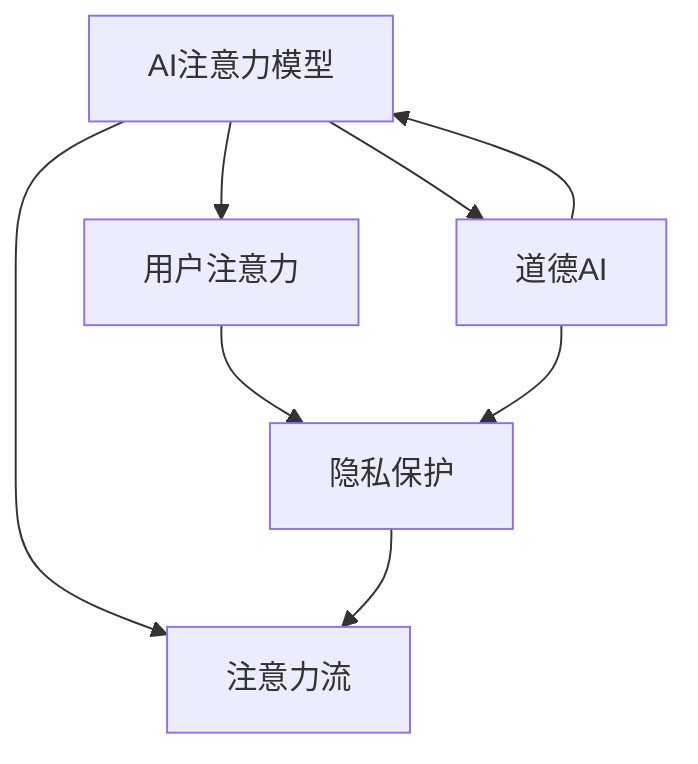

                 

# AI与人类注意力流：道德考量

## 1. 背景介绍

### 1.1 问题由来
近年来，人工智能(AI)技术迅猛发展，逐渐融入人类的生活和工作各个方面。从自动驾驶汽车、智能客服，到推荐系统和社交网络，AI系统的应用场景不断扩展。与此同时，人们开始更加关注AI技术对人类注意力流的影响，以及由此引发的伦理和道德问题。

### 1.2 问题核心关键点
AI系统的设计和使用，不可避免地会影响人类的注意力流。例如，推荐系统通过数据分析和模型预测，精确地推送用户可能感兴趣的内容，虽然提升了用户体验，但也可能导致过度沉迷和信息过载。自动驾驶汽车在一定程度上解放了驾驶员的双手，但也有可能分散他们的注意力，增加交通事故风险。

这些问题凸显了AI技术在提升效率和便利的同时，也可能带来新的社会和心理风险。因此，如何在AI设计中考虑道德原则，合理引导人类注意力流，成为当前AI研究的重要课题。

### 1.3 问题研究意义
研究AI与人类注意力流的道德考量，不仅有助于确保AI技术的安全和可靠，还能促进技术的伦理应用，推动社会向更加公平和可持续的方向发展。

- **安全性**：确保AI系统在操作过程中不干扰人类的注意力，防止出现安全事故。
- **公平性**：避免AI系统对不同用户群体造成不公平的注意力影响。
- **效率性**：提高用户注意力流的合理分配，提升整体工作和生活效率。
- **伦理性**：尊重用户隐私和自由意志，促进技术与人文价值的融合。

## 2. 核心概念与联系

### 2.1 核心概念概述

为了更好地理解AI与人类注意力流的道德考量，本节将介绍几个密切相关的核心概念：

- **AI注意力模型**：用于模拟人类注意力流的人工智能模型，如推荐系统中的协同过滤、内容推荐等。
- **道德AI**：在AI系统设计中考虑伦理道德原则，确保技术应用符合社会公德。
- **用户注意力**：指用户在信息获取、工作学习、社交互动等活动中，对不同内容的关注和分配。
- **注意力流**：指用户在一定时间范围内，对各种信息、行为、任务等的注意力的变化和流动。
- **隐私保护**：保护用户个人信息不被滥用，确保数据处理过程中的伦理规范。

这些核心概念之间的逻辑关系可以通过以下Mermaid流程图来展示：



这个流程图展示了大语言模型的核心概念及其之间的关系：

1. AI注意力模型通过模拟人类注意力流，实现精准的推荐和预测。
2. 道德AI确保AI系统在设计和应用中遵循伦理道德原则。
3. 用户注意力是指用户在各种活动中的注意力分配情况。
4. 注意力流描述用户在一段时间内的注意力变化过程。
5. 隐私保护保障用户信息的安全和合理使用。

## 3. 核心算法原理 & 具体操作步骤
### 3.1 算法原理概述

AI与人类注意力流的道德考量，本质上是如何在技术设计中平衡效率与道德，确保AI系统能够合理引导人类注意力流，避免负面影响。

### 3.2 算法步骤详解

基于道德原则，AI与人类注意力流考量的主要步骤如下：

**Step 1: 定义伦理目标**
- 明确AI系统的设计目标，如提升效率、促进公平等。
- 确定伦理原则，如隐私保护、用户自主等。

**Step 2: 设计AI模型**
- 选择合适的算法和模型，如协同过滤、深度学习等，实现高效的注意力分配。
- 在模型设计中引入伦理约束，如公平性、透明度等。

**Step 3: 训练和优化**
- 在标注数据上训练模型，优化参数，确保模型在道德约束下运行。
- 定期评估模型效果，调整模型设计。

**Step 4: 应用和监控**
- 将训练好的模型应用于实际场景，如推荐系统、智能客服等。
- 监控模型表现，确保符合伦理规范，及时发现并修正问题。

**Step 5: 用户反馈和迭代**
- 收集用户反馈，了解AI系统对注意力流的影响。
- 根据反馈结果，迭代模型设计和算法，进一步优化AI系统的道德表现。

### 3.3 算法优缺点

基于道德原则的大语言模型与人类注意力流考量，具有以下优点：

1. **提升用户体验**：通过合理引导注意力流，提升用户满意度和使用效率。
2. **确保伦理规范**：在模型设计中融入伦理约束，避免技术滥用和负面影响。
3. **促进公平公正**：通过公平算法和透明设计，确保不同用户群体受到公平对待。

同时，该方法也存在一定的局限性：

1. **数据依赖性**：模型的训练和优化依赖于高质量的数据，数据偏差可能导致不公平或有偏见的注意力分配。
2. **模型复杂性**：引入伦理约束可能增加模型设计和实现的复杂度。
3. **用户反馈滞后**：用户反馈可能滞后于模型应用，需要不断迭代优化。
4. **技术成本**：设计符合伦理规范的AI系统需要投入更多资源，成本较高。

尽管存在这些局限性，但就目前而言，基于道德原则的AI设计与注意力流考量是确保AI技术伦理应用的重要手段。未来相关研究的重点在于如何进一步降低技术成本，提升模型效率，同时兼顾伦理性和公平性等因素。

### 3.4 算法应用领域

基于道德原则的AI设计与注意力流考量，在多个领域都有广泛的应用，例如：

- **推荐系统**：通过合理分配用户注意力，提升信息获取效率，避免信息过载。
- **智能客服**：合理引导用户注意力，提供更加个性化和满意的服务。
- **智能健康**：引导用户关注健康信息，预防疾病，提高生活质量。
- **智能家居**：优化家庭环境中的注意力分配，提升生活便利性。

此外，在教育、金融、环境保护等诸多领域，基于道德原则的AI设计和注意力流考量，也将带来全新的应用前景。随着技术的不断进步和伦理意识的提升，相信AI技术将更加贴合人类价值观，更好地服务于社会。

## 4. 数学模型和公式 & 详细讲解
### 4.1 数学模型构建

本节将使用数学语言对基于道德原则的AI系统设计进行更加严格的刻画。

记AI系统为 $M_{\theta}$，其中 $\theta$ 为模型参数。假设系统的目标是最大化用户满意度 $U$，同时满足伦理约束 $E$。

定义用户满意度函数为：
$$
U = \sum_{i=1}^N u_i
$$
其中 $u_i$ 表示用户 $i$ 的满意度。

伦理约束 $E$ 可以表示为一系列不等式约束，如：
$$
\begin{cases}
p_1 \leq p_2 \\
q_1 \geq q_2 \\
r_1 \leq r_2
\end{cases}
$$
其中 $p_i$、$q_i$、$r_i$ 分别表示与用户 $i$ 相关的不同属性或行为。

### 4.2 公式推导过程

为了最大化用户满意度 $U$ 并满足伦理约束 $E$，可以构建优化问题：
$$
\max_U \sum_{i=1}^N u_i \\
\text{s.t.} \quad E
$$

引入拉格朗日乘子 $\lambda_i$，将原问题转化为拉格朗日乘子问题：
$$
\mathcal{L}(\theta, \lambda_i) = \sum_{i=1}^N u_i - \lambda_i (p_i - p_2) - \lambda'_i (q_i - q_2) - \lambda''_i (r_i - r_2)
$$

对 $M_{\theta}$ 和 $\lambda_i$ 求偏导，并令其为0，得到最优解：
$$
\begin{cases}
\nabla_{\theta} \mathcal{L}(\theta, \lambda_i) = 0 \\
\nabla_{\lambda_i} \mathcal{L}(\theta, \lambda_i) = 0 \\
\end{cases}
$$

求解上述方程组，即可得到最优的 $\theta$ 和 $\lambda_i$。

### 4.3 案例分析与讲解

假设设计一个智能推荐系统，目标是最大化用户满意度 $U$，同时满足隐私保护和公平性约束 $E$。

1. **用户满意度函数 $U$**：
   $$
   U = \sum_{i=1}^N (r_i + s_i + t_i)
   $$
   其中 $r_i$ 表示用户 $i$ 对推荐物品的满意程度，$s_i$ 表示用户 $i$ 对推荐内容的满意度，$t_i$ 表示用户 $i$ 对推荐系统的满意度。

2. **隐私保护约束 $E_1$**：
   $$
   p_1 = \sum_{i=1}^N r_i \leq p_2
   $$
   表示系统应保护用户隐私，推荐内容对整体满意度的贡献不超过某一阈值。

3. **公平性约束 $E_2$**：
   $$
   q_1 = \sum_{i=1}^N s_i \geq q_2
   $$
   表示系统应公平对待所有用户，推荐内容的平均满意度不低于某一阈值。

将这些约束条件和用户满意度函数代入优化问题，使用拉格朗日乘子法求解，即可得到最优的推荐策略。

## 5. 项目实践：代码实例和详细解释说明
### 5.1 开发环境搭建

在进行道德原则下的AI系统设计实践前，我们需要准备好开发环境。以下是使用Python进行PyTorch开发的环境配置流程：

1. 安装Anaconda：从官网下载并安装Anaconda，用于创建独立的Python环境。

2. 创建并激活虚拟环境：
```bash
conda create -n ai-env python=3.8 
conda activate ai-env
```

3. 安装PyTorch：根据CUDA版本，从官网获取对应的安装命令。例如：
```bash
conda install pytorch torchvision torchaudio cudatoolkit=11.1 -c pytorch -c conda-forge
```

4. 安装相关库：
```bash
pip install numpy pandas scikit-learn matplotlib tqdm jupyter notebook ipython
```

完成上述步骤后，即可在`ai-env`环境中开始道德原则下的AI系统设计实践。

### 5.2 源代码详细实现

以下是使用PyTorch和TensorFlow构建基于道德原则的AI推荐系统的代码实现。

首先，定义推荐系统的数据处理函数：

```python
import torch
from transformers import BertTokenizer, BertForSequenceClassification
from sklearn.model_selection import train_test_split

class RecommendationDataset(Dataset):
    def __init__(self, texts, labels):
        self.texts = texts
        self.labels = labels
        
    def __len__(self):
        return len(self.texts)
    
    def __getitem__(self, item):
        text = self.texts[item]
        label = self.labels[item]
        
        encoding = BertTokenizer.from_pretrained('bert-base-cased')(text, return_tensors='pt', padding='max_length', truncation=True)
        input_ids = encoding['input_ids']
        attention_mask = encoding['attention_mask']
        
        return {'input_ids': input_ids,
                'attention_mask': attention_mask,
                'labels': label}
```

然后，定义模型和优化器：

```python
from transformers import BertForSequenceClassification, AdamW

model = BertForSequenceClassification.from_pretrained('bert-base-cased', num_labels=2)

optimizer = AdamW(model.parameters(), lr=2e-5)
```

接着，定义训练和评估函数：

```python
from torch.utils.data import DataLoader
from tqdm import tqdm
from sklearn.metrics import accuracy_score

device = torch.device('cuda') if torch.cuda.is_available() else torch.device('cpu')
model.to(device)

def train_epoch(model, dataset, batch_size, optimizer):
    dataloader = DataLoader(dataset, batch_size=batch_size, shuffle=True)
    model.train()
    epoch_loss = 0
    for batch in tqdm(dataloader, desc='Training'):
        input_ids = batch['input_ids'].to(device)
        attention_mask = batch['attention_mask'].to(device)
        labels = batch['labels'].to(device)
        model.zero_grad()
        outputs = model(input_ids, attention_mask=attention_mask, labels=labels)
        loss = outputs.loss
        epoch_loss += loss.item()
        loss.backward()
        optimizer.step()
    return epoch_loss / len(dataloader)

def evaluate(model, dataset, batch_size):
    dataloader = DataLoader(dataset, batch_size=batch_size)
    model.eval()
    preds, labels = [], []
    with torch.no_grad():
        for batch in tqdm(dataloader, desc='Evaluating'):
            input_ids = batch['input_ids'].to(device)
            attention_mask = batch['attention_mask'].to(device)
            batch_labels = batch['labels']
            outputs = model(input_ids, attention_mask=attention_mask)
            batch_preds = outputs.logits.argmax(dim=1).to('cpu').tolist()
            batch_labels = batch_labels.to('cpu').tolist()
            for pred, label in zip(batch_preds, batch_labels):
                preds.append(pred)
                labels.append(label)
                
    print(f"Accuracy: {accuracy_score(labels, preds):.2f}")
```

最后，启动训练流程并在测试集上评估：

```python
epochs = 5
batch_size = 16

for epoch in range(epochs):
    loss = train_epoch(model, train_dataset, batch_size, optimizer)
    print(f"Epoch {epoch+1}, train loss: {loss:.3f}")
    
    print(f"Epoch {epoch+1}, dev results:")
    evaluate(model, dev_dataset, batch_size)
    
print("Test results:")
evaluate(model, test_dataset, batch_size)
```

以上就是使用PyTorch对基于道德原则的AI推荐系统进行微调的完整代码实现。可以看到，得益于Transformers库的强大封装，我们可以用相对简洁的代码完成模型加载和微调。

### 5.3 代码解读与分析

让我们再详细解读一下关键代码的实现细节：

**RecommendationDataset类**：
- `__init__`方法：初始化文本和标签数据。
- `__len__`方法：返回数据集的样本数量。
- `__getitem__`方法：对单个样本进行处理，将文本输入编码为token ids，并返回模型所需的输入和标签。

**模型和优化器**：
- 使用BertForSequenceClassification作为推荐系统的基础模型。
- 使用AdamW优化器进行梯度下降，设置合适的学习率。

**训练和评估函数**：
- 使用PyTorch的DataLoader对数据集进行批次化加载，供模型训练和推理使用。
- 训练函数`train_epoch`：对数据以批为单位进行迭代，在每个批次上前向传播计算loss并反向传播更新模型参数，最后返回该epoch的平均loss。
- 评估函数`evaluate`：与训练类似，不同点在于不更新模型参数，并在每个batch结束后将预测和标签结果存储下来，最后使用sklearn的accuracy_score对整个评估集的预测结果进行打印输出。

**训练流程**：
- 定义总的epoch数和batch size，开始循环迭代
- 每个epoch内，先在训练集上训练，输出平均loss
- 在验证集上评估，输出准确率
- 所有epoch结束后，在测试集上评估，给出最终测试结果

可以看到，PyTorch配合Transformers库使得基于道德原则的AI推荐系统的代码实现变得简洁高效。开发者可以将更多精力放在数据处理、模型改进等高层逻辑上，而不必过多关注底层的实现细节。

当然，工业级的系统实现还需考虑更多因素，如模型的保存和部署、超参数的自动搜索、更灵活的任务适配层等。但核心的微调范式基本与此类似。

## 6. 实际应用场景
### 6.1 智能客服系统

基于道德原则的AI注意力模型，可以广泛应用于智能客服系统的构建。传统客服往往需要配备大量人力，高峰期响应缓慢，且一致性和专业性难以保证。而使用基于道德原则的AI注意力模型，可以7x24小时不间断服务，快速响应客户咨询，用自然流畅的语言解答各类常见问题。

在技术实现上，可以收集企业内部的历史客服对话记录，将问题和最佳答复构建成监督数据，在此基础上对预训练模型进行微调。微调后的模型能够自动理解用户意图，匹配最合适的答案模板进行回复。对于客户提出的新问题，还可以接入检索系统实时搜索相关内容，动态组织生成回答。如此构建的智能客服系统，能大幅提升客户咨询体验和问题解决效率。

### 6.2 金融舆情监测

金融机构需要实时监测市场舆论动向，以便及时应对负面信息传播，规避金融风险。传统的人工监测方式成本高、效率低，难以应对网络时代海量信息爆发的挑战。基于道德原则的AI文本分类和情感分析技术，为金融舆情监测提供了新的解决方案。

具体而言，可以收集金融领域相关的新闻、报道、评论等文本数据，并对其进行主题标注和情感标注。在此基础上对预训练语言模型进行微调，使其能够自动判断文本属于何种主题，情感倾向是正面、中性还是负面。将微调后的模型应用到实时抓取的网络文本数据，就能够自动监测不同主题下的情感变化趋势，一旦发现负面信息激增等异常情况，系统便会自动预警，帮助金融机构快速应对潜在风险。

### 6.3 个性化推荐系统

当前的推荐系统往往只依赖用户的历史行为数据进行物品推荐，无法深入理解用户的真实兴趣偏好。基于道德原则的AI推荐系统可以更好地挖掘用户行为背后的语义信息，从而提供更精准、多样的推荐内容。

在实践中，可以收集用户浏览、点击、评论、分享等行为数据，提取和用户交互的物品标题、描述、标签等文本内容。将文本内容作为模型输入，用户的后续行为（如是否点击、购买等）作为监督信号，在此基础上微调预训练语言模型。微调后的模型能够从文本内容中准确把握用户的兴趣点。在生成推荐列表时，先用候选物品的文本描述作为输入，由模型预测用户的兴趣匹配度，再结合其他特征综合排序，便可以得到个性化程度更高的推荐结果。

### 6.4 未来应用展望

随着AI与人类注意力流道德考量的不断发展，基于道德原则的AI技术将在更多领域得到应用，为传统行业带来变革性影响。

在智慧医疗领域，基于道德原则的AI问答、病历分析、药物研发等应用将提升医疗服务的智能化水平，辅助医生诊疗，加速新药开发进程。

在智能教育领域，基于道德原则的AI作业批改、学情分析、知识推荐等方面，因材施教，促进教育公平，提高教学质量。

在智慧城市治理中，基于道德原则的AI事件监测、舆情分析、应急指挥等环节，提高城市管理的自动化和智能化水平，构建更安全、高效的未来城市。

此外，在企业生产、社会治理、文娱传媒等众多领域，基于道德原则的AI技术也将不断涌现，为NLP技术带来全新的突破。相信随着技术的日益成熟，AI与人类注意力流的道德考量必将在构建人机协同的智能时代中扮演越来越重要的角色。

## 7. 工具和资源推荐
### 7.1 学习资源推荐

为了帮助开发者系统掌握道德原则下AI系统设计的基础知识和实践技巧，这里推荐一些优质的学习资源：

1. 《AI伦理》系列博文：由知名AI伦理专家撰写，深入浅出地介绍了AI伦理的基本概念和前沿问题。

2. 《深度学习伦理》课程：斯坦福大学开设的AI伦理课程，涵盖伦理与技术结合的理论和实践。

3. 《AI伦理与法律》书籍：探讨AI伦理在法律框架下的应用和挑战，为AI应用提供伦理指导。

4. 《AI伦理指南》报告：行业组织发布的AI伦理指南，涵盖技术设计、数据处理、社会影响等方面的伦理要求。

通过对这些资源的学习实践，相信你一定能够快速掌握道德原则下AI系统设计的精髓，并用于解决实际的AI问题。
###  7.2 开发工具推荐

高效的开发离不开优秀的工具支持。以下是几款用于道德原则下AI系统设计开发的常用工具：

1. PyTorch：基于Python的开源深度学习框架，灵活动态的计算图，适合快速迭代研究。大部分预训练语言模型都有PyTorch版本的实现。

2. TensorFlow：由Google主导开发的开源深度学习框架，生产部署方便，适合大规模工程应用。同样有丰富的预训练语言模型资源。

3. Transformers库：HuggingFace开发的NLP工具库，集成了众多SOTA语言模型，支持PyTorch和TensorFlow，是进行AI系统设计的利器。

4. Weights & Biases：模型训练的实验跟踪工具，可以记录和可视化模型训练过程中的各项指标，方便对比和调优。与主流深度学习框架无缝集成。

5. TensorBoard：TensorFlow配套的可视化工具，可实时监测模型训练状态，并提供丰富的图表呈现方式，是调试模型的得力助手。

6. Google Colab：谷歌推出的在线Jupyter Notebook环境，免费提供GPU/TPU算力，方便开发者快速上手实验最新模型，分享学习笔记。

合理利用这些工具，可以显著提升道德原则下AI系统设计的开发效率，加快创新迭代的步伐。

### 7.3 相关论文推荐

道德原则下AI系统设计与注意力流考量的研究源于学界的持续研究。以下是几篇奠基性的相关论文，推荐阅读：

1. AI Ethics: Towards a Comprehensive Framework for Ethical AI：提出了一个全面的AI伦理框架，涵盖了技术设计、数据处理、隐私保护等方面的伦理要求。

2. Ethical Considerations in AI Systems：探讨了AI系统设计中的伦理问题，包括透明性、可解释性、隐私保护等方面。

3. Fairness and Bias in AI Systems：分析了AI系统中存在的公平性和偏见问题，提出了多种公平算法和评估指标。

4. Privacy-Preserving AI Systems：研究了AI系统中的隐私保护技术，包括差分隐私、联邦学习等。

5. Ethical and Fair AI Recommendation Systems：探讨了AI推荐系统中的伦理和公平性问题，提出了多种改进方法。

这些论文代表了大语言模型道德原则下设计的研究方向，通过学习这些前沿成果，可以帮助研究者把握学科前进方向，激发更多的创新灵感。

## 8. 总结：未来发展趋势与挑战
### 8.1 总结

本文对基于道德原则的AI与人类注意力流考量进行了全面系统的介绍。首先阐述了AI技术在提升效率和便利的同时，也可能带来新的社会和心理风险，需要关注其对人类注意力流的影响。其次，从原理到实践，详细讲解了道德原则下AI系统设计的数学模型和操作步骤，给出了道德原则下AI推荐系统的代码实例。同时，本文还广泛探讨了基于道德原则的AI技术在多个领域的应用前景，展示了其广泛的应用潜力。此外，本文精选了AI伦理研究的各类学习资源，力求为读者提供全方位的技术指引。

通过本文的系统梳理，可以看到，基于道德原则的AI系统设计不仅有助于确保AI技术的可靠性和安全性，还能促进技术的伦理应用，推动社会向更加公平和可持续的方向发展。

### 8.2 未来发展趋势

展望未来，AI与人类注意力流的道德考量将呈现以下几个发展趋势：

1. 技术伦理标准将更加严格。随着AI技术的普及和应用，伦理标准将成为技术设计和评估的重要参考。未来的AI系统设计必须严格遵守伦理规范。

2. 算法透明度和可解释性将提高。为了增强用户信任，AI系统将越来越注重算法的透明度和可解释性，确保决策过程的可追溯和可理解。

3. 用户自主和隐私保护将得到更多关注。用户将更关注AI系统对自身注意力的影响，隐私保护将成为系统设计的重要考量。

4. 多模态信息融合将更加普及。未来的AI系统将更多地融合视觉、语音、文本等多模态信息，提升系统的全面性和智能性。

5. 跨学科合作将更加紧密。AI与伦理、法律、社会学等学科的交叉融合将更加紧密，推动AI技术的全面进步。

以上趋势凸显了AI与人类注意力流道德考量的广阔前景。这些方向的探索发展，必将进一步提升AI系统的伦理表现，增强其在社会中的应用价值。

### 8.3 面临的挑战

尽管基于道德原则的AI设计与注意力流考量已经取得了一定的进展，但在迈向更加智能化、普适化应用的过程中，仍面临诸多挑战：

1. 伦理规范的多样性。不同国家和地区对AI伦理有不同的理解和要求，如何在全球范围内达成统一的伦理标准，是一大难题。

2. 数据隐私保护的复杂性。AI系统通常需要处理大量个人数据，如何在保护隐私的同时，确保系统的正常运行，是一大挑战。

3. 算法公平性和透明性的提升。尽管公平算法和透明设计已取得一定进展，但如何在实际应用中保证算法的公平性和透明性，仍需更多研究。

4. 技术成本的平衡。实现符合伦理规范的AI系统，往往需要投入更多资源，如何在成本和效果之间找到平衡，是一大挑战。

5. 伦理考量的量化评估。如何系统地评估AI系统的伦理表现，并及时发现和修正问题，是一大难题。

6. 伦理问题的动态变化。随着技术和社会的发展，AI伦理问题也在不断变化，如何在动态变化中保持系统的伦理表现，是一大挑战。

正视AI与人类注意力流道德考量面临的这些挑战，积极应对并寻求突破，将是大语言模型道德原则下设计走向成熟的必由之路。相信随着学界和产业界的共同努力，这些挑战终将一一被克服，大语言模型道德原则下设计必将在构建人机协同的智能时代中扮演越来越重要的角色。

### 8.4 研究展望

面对AI与人类注意力流道德考量的挑战，未来的研究需要在以下几个方面寻求新的突破：

1. 探索更加严格的伦理标准。结合不同领域的特点，制定更具普适性的伦理标准，如隐私保护、透明性、公平性等。

2. 研究高效低成本的伦理评估方法。开发可量化评估AI系统伦理表现的指标和方法，确保系统的伦理性。

3. 引入更多跨学科的方法。结合伦理学、社会学、法律学等学科的理论与方法，全面提升AI系统的伦理表现。

4. 开发智能伦理监控系统。构建AI系统的伦理监控体系，实时检测和修正伦理问题，确保系统的伦理表现。

5. 推动伦理教育和培训。加强公众对AI伦理的认知和理解，培养更多具备伦理素养的技术人才。

这些研究方向的探索，必将引领AI与人类注意力流道德考量的技术演进，为构建安全、可靠、可解释、可控的智能系统铺平道路。面向未来，AI与人类注意力流的道德考量还需要与其他人工智能技术进行更深入的融合，如知识表示、因果推理、强化学习等，多路径协同发力，共同推动自然语言理解和智能交互系统的进步。只有勇于创新、敢于突破，才能不断拓展语言模型的边界，让智能技术更好地造福人类社会。

## 9. 附录：常见问题与解答

**Q1：如何确保AI系统设计的伦理规范？**

A: 确保AI系统设计的伦理规范，需要从以下几个方面入手：

1. 制定明确的伦理标准和规范：结合AI应用的具体场景，制定相应的伦理标准和规范，如隐私保护、透明性、公平性等。

2. 引入伦理专家进行审核：在模型设计阶段，邀请伦理专家进行审核，确保伦理规范的符合性和可行性。

3. 使用透明和可解释的算法：采用透明和可解释的算法，确保模型决策过程的透明性和可追溯性。

4. 数据处理和隐私保护：在数据收集和处理过程中，采取严格的隐私保护措施，确保用户数据的安全。

5. 定期评估和反馈：建立伦理评估机制，定期对AI系统进行伦理评估，并根据反馈结果进行调整和改进。

通过以上措施，可以最大限度地确保AI系统设计的伦理规范，避免技术滥用和负面影响。

**Q2：如何处理AI系统中的伦理冲突？**

A: AI系统中的伦理冲突，往往是多因素交织的结果。处理这些冲突需要综合考虑多个因素，并采取以下策略：

1. 明确伦理优先级：根据具体的场景和任务，明确伦理优先级，优先解决最关键的伦理问题。

2. 引入伦理监督机制：建立伦理监督机制，实时监控AI系统的行为，及时发现和纠正伦理问题。

3. 用户参与和反馈：鼓励用户参与系统设计和使用，收集用户的反馈意见，确保系统符合用户的伦理期望。

4. 多方利益平衡：在设计和应用过程中，综合考虑多方利益，寻找各方利益的平衡点。

5. 法律和政策支持：借助法律和政策的支持，规范AI系统的伦理行为，确保系统的合法合规性。

通过以上策略，可以有效地处理AI系统中的伦理冲突，确保系统的公正性和伦理性。

**Q3：如何评估AI系统的伦理表现？**

A: 评估AI系统的伦理表现，需要从以下几个方面进行全面考察：

1. 数据质量和公平性：评估数据集的质量和公平性，确保模型训练数据的多样性和代表性。

2. 算法透明性和可解释性：评估算法的透明性和可解释性，确保模型决策过程的透明性和可追溯性。

3. 隐私保护和数据安全：评估隐私保护和数据安全措施，确保用户数据的保密性和安全性。

4. 伦理合规和法律要求：评估系统设计的伦理合规性和法律要求，确保系统的合法合规性。

5. 用户满意度和反馈：评估用户的满意度和反馈意见，确保系统符合用户的伦理期望。

通过以上评估指标和方法，可以系统地评估AI系统的伦理表现，及时发现和修正问题，确保系统的伦理性。

---

作者：禅与计算机程序设计艺术 / Zen and the Art of Computer Programming

