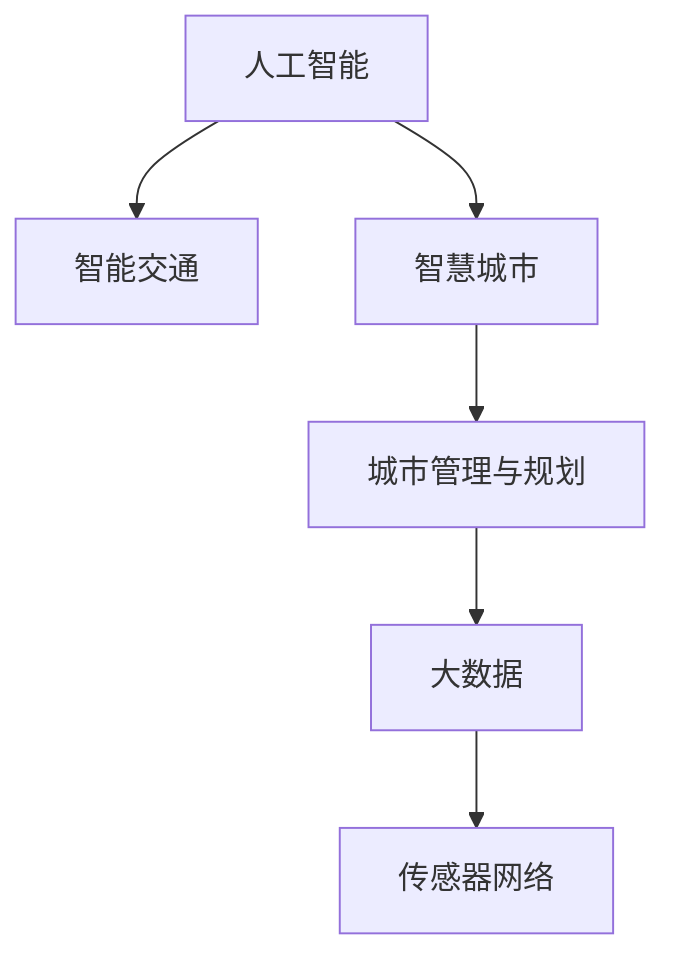

                 

# AI与人类计算：打造可持续发展的城市管理与规划

> 关键词：城市管理,人工智能,可持续发展,城市规划,智能交通,智慧城市,大数据,机器学习,传感器网络

## 1. 背景介绍

### 1.1 问题由来
随着城市化进程的加速，人口、交通、环境、资源等各类问题日益突出。传统城市规划和管理方式难以有效应对。人工智能(AI)与人类计算的融合，为城市管理的智能化、数字化转型提供了新的方向。

以智能交通系统为例，传统的交通信号灯和监控系统需要大量人力进行管理和维护，无法实现全局最优的交通调配。通过AI和传感器网络的结合，可以实现实时交通数据分析和决策，动态优化交通信号灯，缓解交通压力。类似地，智慧城市建设也需要AI在各个领域发挥作用，从能源管理、环境保护到公共安全，都能借助AI提升效率和效果。

### 1.2 问题核心关键点
本项目聚焦于AI与人类计算的融合，探索如何构建可持续发展的城市管理与规划系统。核心问题在于：
- 如何将AI技术嵌入城市管理与规划的各个环节，实现实时、动态、高效的数据处理和决策。
- 如何通过大数据、传感器网络和AI的结合，提升城市运行的可持续性和人类计算能力。
- 如何构建智能、安全、高效的城市管理系统，满足市民的多元需求，提升城市生活品质。

## 2. 核心概念与联系

### 2.1 核心概念概述

为更好地理解AI与人类计算在城市管理中的应用，本节将介绍几个密切相关的核心概念：

- 人工智能(Artificial Intelligence, AI)：一种模拟人类智能行为的技术，涵盖机器学习、自然语言处理、计算机视觉等多个方向，通过大量数据训练和算法优化，实现复杂问题的自动化解决。

- 人类计算(Human-in-the-Loop, HiLo)：将AI与人类专家的知识和经验相结合，充分发挥人机协同优势，提高问题解决效率和决策质量。

- 城市管理与规划(Urban Management & Planning, UMP)：涉及城市基础设施、公共服务、环境资源等多方面的管理和规划，目标是实现城市的可持续发展。

- 智能交通(Smart Traffic)：利用AI和大数据技术，优化交通信号、监控和管理，提高交通效率和安全性。

- 智慧城市(Smart City)：通过物联网、大数据和AI等技术，实现城市各领域的信息化、智能化管理。

- 大数据(Big Data)：指体量巨大、结构复杂、增长速度快的数据集合，通过数据挖掘、分析，可以获取有价值的决策支持信息。

- 传感器网络(Sensor Network)：由各种传感器构成的网络系统，能够实时采集环境、交通、能源等数据，为AI决策提供依据。

这些核心概念之间的逻辑关系可以通过以下Mermaid流程图来展示：



这个流程图展示了几大核心概念及其之间的关系：

1. 人工智能是实现智能交通、智慧城市和城市管理与规划的基础技术。
2. 智能交通和智慧城市是城市管理与规划的重要组成部分，通过AI和大数据技术提升城市运行效率和安全性。
3. 大数据和传感器网络是AI决策的基础，实时、准确的数据采集和分析是智能化的前提。

## 3. 核心算法原理 & 具体操作步骤
### 3.1 算法原理概述

AI与人类计算在城市管理与规划中的应用，本质上是一个多模态数据融合和智能决策的优化过程。其核心思想是：
- 通过传感器网络和实时采集系统，收集海量城市运行数据。
- 利用AI算法进行数据预处理和特征提取，挖掘数据中的潜在模式和趋势。
- 结合人类专家的知识和经验，通过人机协同决策，优化城市管理与规划方案。
- 动态调整AI模型和规则，持续学习和优化决策过程，提升城市运行的可持续性。

### 3.2 算法步骤详解

AI与人类计算在城市管理中的应用一般包括以下几个关键步骤：

**Step 1: 数据采集与预处理**
- 部署各类传感器和采集设备，收集城市交通、环境、资源等数据。
- 使用AI算法对数据进行清洗、归一化和特征提取，去除噪声和冗余信息。
- 将处理后的数据存储在云端数据库中，供后续分析使用。

**Step 2: 数据分析与建模**
- 利用机器学习、深度学习等AI算法，对城市运行数据进行建模和预测。
- 设计合理的损失函数和优化目标，训练模型以最小化预测误差。
- 应用数据增强、正则化等技术，提高模型的鲁棒性和泛化能力。

**Step 3: 人机协同决策**
- 将模型的预测结果与人类专家的经验相结合，通过协作交互，进行综合决策。
- 设计可视化界面，展示数据和模型输出，辅助人类决策。
- 引入人工干预机制，在模型输出不合理时，手动调整决策结果。

**Step 4: 实时优化与反馈**
- 实时监测城市运行数据，动态调整AI模型参数和规则。
- 引入反馈机制，收集人类专家的反馈，持续优化模型和决策策略。
- 在新的数据集上重新训练模型，保持其持续学习能力和适应性。

### 3.3 算法优缺点

AI与人类计算在城市管理中的应用，具有以下优点：
1. 实时动态优化：AI实时处理大量数据，快速响应城市运行变化，动态调整决策策略。
2. 数据驱动决策：通过大数据分析和模型预测，提供科学、客观的决策依据。
3. 人机协同互补：充分发挥AI的自动化和人类的智能化优势，提升决策质量。
4. 持续学习和优化：AI模型和规则根据反馈不断调整，保持性能和适应性。

同时，该方法也存在一些局限性：
1. 数据质量依赖：AI分析结果依赖于数据采集的准确性和完整性，存在数据缺失或噪声问题。
2. 模型解释性不足：AI模型的黑盒特性，难以解释其决策过程，影响可信度。
3. 人机交互复杂：人机协同决策过程需要高效的沟通和互动，存在协调难度。
4. 资源消耗大：AI模型的训练和优化需要大量计算资源，初期投入成本较高。

尽管存在这些局限性，但就目前而言，AI与人类计算在城市管理中的应用，已经展现出强大的潜力。未来相关研究需要进一步解决数据质量问题，提升模型解释性，优化人机交互机制，降低资源消耗，才能更好地推动城市智能化进程。

### 3.4 算法应用领域

AI与人类计算在城市管理与规划中的应用，覆盖了以下主要领域：

- 智能交通管理：通过AI实时分析交通流量、路况等信息，优化交通信号灯和道路布局，提升交通效率和安全性。
- 智慧城市安全：利用传感器网络和AI技术，实时监测和预警公共安全事件，提升城市应急响应能力。
- 智能能源管理：应用AI和大数据分析，优化城市能源消耗和供应，降低碳排放，促进可持续发展。
- 智慧环境保护：通过AI模型预测和分析环境数据，辅助制定环境保护政策，提升环境治理效果。
- 公共服务优化：利用AI和大数据技术，优化公共服务资源配置和运营管理，提升服务质量。
- 城市规划设计：通过AI算法对城市发展数据进行分析，辅助规划设计，优化城市布局。

这些领域的大规模应用，将推动城市管理向智能化、精准化、高效化方向发展，显著提升城市运行的可持续性和居民生活质量。

## 4. 数学模型和公式 & 详细讲解  
### 4.1 数学模型构建

本节将使用数学语言对AI与人类计算在城市管理中的应用进行更加严格的刻画。

记城市运行数据为 $D=\{(x_i,y_i)\}_{i=1}^N$，其中 $x_i$ 为输入特征， $y_i$ 为输出标签。假设使用深度学习模型 $M_{\theta}$ 对数据进行建模，其中 $\theta$ 为模型参数。

定义模型 $M_{\theta}$ 在输入 $x$ 上的损失函数为 $\ell(M_{\theta}(x),y)$，则在数据集 $D$ 上的经验风险为：

$$
\mathcal{L}(\theta) = \frac{1}{N} \sum_{i=1}^N \ell(M_{\theta}(x_i),y_i)
$$

微调的优化目标是最小化经验风险，即找到最优参数：

$$
\theta^* = \mathop{\arg\min}_{\theta} \mathcal{L}(\theta)
$$

在实践中，我们通常使用基于梯度的优化算法（如SGD、Adam等）来近似求解上述最优化问题。设 $\eta$ 为学习率，$\lambda$ 为正则化系数，则参数的更新公式为：

$$
\theta \leftarrow \theta - \eta \nabla_{\theta}\mathcal{L}(\theta) - \eta\lambda\theta
$$

其中 $\nabla_{\theta}\mathcal{L}(\theta)$ 为损失函数对参数 $\theta$ 的梯度，可通过反向传播算法高效计算。

### 4.2 公式推导过程

以下我们以交通流量预测为例，推导深度学习模型的损失函数及其梯度的计算公式。

假设模型 $M_{\theta}$ 在输入 $x$ 上的输出为 $\hat{y}=M_{\theta}(x)$，表示对未来交通流量的预测值。真实标签 $y \in \{1,2,\dots,K\}$ 表示不同交通流量状态。则分类交叉熵损失函数定义为：

$$
\ell(M_{\theta}(x),y) = -\sum_{k=1}^K y_k \log \hat{y}_k
$$

将其代入经验风险公式，得：

$$
\mathcal{L}(\theta) = -\frac{1}{N}\sum_{i=1}^N \sum_{k=1}^K y_{ik} \log \hat{y}_{ik}
$$

根据链式法则，损失函数对参数 $\theta_k$ 的梯度为：

$$
\frac{\partial \mathcal{L}(\theta)}{\partial \theta_k} = -\frac{1}{N}\sum_{i=1}^N \sum_{k=1}^K \frac{y_{ik}}{\hat{y}_{ik}} \frac{\partial \hat{y}_{ik}}{\partial \theta_k}
$$

其中 $\frac{\partial \hat{y}_{ik}}{\partial \theta_k}$ 可进一步递归展开，利用自动微分技术完成计算。

在得到损失函数的梯度后，即可带入参数更新公式，完成模型的迭代优化。重复上述过程直至收敛，最终得到适应城市管理与规划任务的最优模型参数 $\theta^*$。

## 5. 项目实践：代码实例和详细解释说明
### 5.1 开发环境搭建

在进行AI与人类计算的实践前，我们需要准备好开发环境。以下是使用Python进行TensorFlow开发的环境配置流程：

1. 安装Anaconda：从官网下载并安装Anaconda，用于创建独立的Python环境。

2. 创建并激活虚拟环境：
```bash
conda create -n ai-env python=3.8 
conda activate ai-env
```

3. 安装TensorFlow：根据CUDA版本，从官网获取对应的安装命令。例如：
```bash
conda install tensorflow -c pytorch -c conda-forge
```

4. 安装必要的Python包：
```bash
pip install numpy pandas scikit-learn tensorflow
```

5. 安装TensorBoard：
```bash
pip install tensorboard
```

完成上述步骤后，即可在`ai-env`环境中开始AI与人类计算的实践。

### 5.2 源代码详细实现

这里我们以智能交通流量预测为例，给出使用TensorFlow对深度学习模型进行训练的Python代码实现。

首先，定义模型结构：

```python
import tensorflow as tf
from tensorflow.keras.layers import Input, Dense, Dropout, Conv1D, MaxPooling1D

def model_builder(input_shape):
    inputs = Input(shape=input_shape)
    x = Conv1D(64, kernel_size=3, activation='relu')(inputs)
    x = MaxPooling1D(pool_size=2)(x)
    x = Dropout(0.2)(x)
    x = Dense(64, activation='relu')(x)
    outputs = Dense(K, activation='softmax')(x)
    model = tf.keras.Model(inputs=inputs, outputs=outputs)
    return model
```

然后，准备训练数据和标签：

```python
# 假设输入特征为交通流量数据，标签为不同状态
train_data = np.random.randn(N, input_shape)
train_labels = np.random.randint(K, size=(N, K))

model = model_builder(input_shape)
model.compile(optimizer='adam', loss='categorical_crossentropy', metrics=['accuracy'])
```

接着，训练模型并保存：

```python
history = model.fit(train_data, train_labels, batch_size=64, epochs=10, validation_split=0.2)
model.save('traffic_predictor.h5')
```

最后，加载模型进行预测：

```python
# 加载模型
model = tf.keras.models.load_model('traffic_predictor.h5')

# 假设输入新的交通流量数据
new_data = np.random.randn(1, input_shape)
predictions = model.predict(new_data)
```

以上就是使用TensorFlow进行交通流量预测的完整代码实现。可以看到，TensorFlow提供的高阶API使得模型构建和训练变得简便高效。

### 5.3 代码解读与分析

让我们再详细解读一下关键代码的实现细节：

**model_builder函数**：
- 定义了交通流量预测模型的结构，包括卷积层、池化层、全连接层等。
- 使用Keras的高级API，简化了模型的定义过程。

**训练过程**：
- 使用`model.compile`方法指定优化器、损失函数和评估指标。
- 通过`model.fit`方法进行模型训练，设置训练轮数、批次大小和验证集比例。
- 保存训练后的模型，以便后续使用。

**模型预测**：
- 使用`model.load_model`方法加载训练好的模型。
- 使用`model.predict`方法进行新的交通流量数据的预测。

可以看到，TensorFlow提供了一套完整的工具链，从模型构建到训练预测，涵盖了AI与人类计算实践的各个环节。开发者可以将更多精力放在算法设计和业务逻辑上，而不必过多关注底层细节。

当然，工业级的系统实现还需考虑更多因素，如模型的压缩和优化、超参数的自动搜索、人机交互界面设计等。但核心的AI与人类计算方法基本与此类似。

## 6. 实际应用场景
### 6.1 智能交通管理

智能交通系统是AI与人类计算在城市管理中应用最广泛的领域之一。通过部署各类传感器和智能设备，实时采集交通流量、车速、交通事故等信息，利用AI算法进行数据分析和预测，动态调整交通信号灯和道路布局，优化交通流量。

在实际应用中，可以构建城市交通中心，实时监测和分析全市交通数据。例如，在发生交通事故时，通过AI模型预测最优交通信号灯控制方案，快速恢复正常交通秩序。同时，利用摄像头和人脸识别技术，实时监控重点路段和人群密集区域，预防和处理突发事件。

### 6.2 智慧城市安全

智慧城市安全系统是利用AI和传感器网络，实时监测和预警公共安全事件，提升城市应急响应能力。

在公共安全领域，AI模型可以实时分析各类传感器数据，如视频监控、温度、烟雾等，识别异常行为和火灾、爆炸等紧急情况。一旦发现异常，系统可以自动发出警报，并通知相关部门进行处理。同时，AI模型还可以通过数据挖掘和模式识别，预测潜在的安全隐患，提前采取预防措施。

### 6.3 智能能源管理

智能能源管理通过AI和大数据分析，优化城市能源消耗和供应，降低碳排放，促进可持续发展。

在能源管理领域，AI模型可以实时监控和预测电力、燃气、水等能源需求，动态调整供应策略。例如，通过预测未来几天的气温变化，调整空调和供暖系统的运行参数，实现能源消耗的最小化。同时，AI模型还可以分析历史能源使用数据，优化能源分配和存储方案，提高能源利用效率。

### 6.4 未来应用展望

未来，AI与人类计算在城市管理中的应用将进一步深化和扩展，带来更多的创新和突破。

1. 高度融合的智能系统：通过AI和大数据技术的深度融合，构建更加智能、高效、安全的智能城市系统。例如，将智能交通、智慧安防、智能能源管理等多领域系统整合，形成统一的智能决策平台。

2. 可持续发展的数据平台：建立基于AI和大数据的城市运行数据平台，实时监测城市运行状况，动态调整城市规划和资源分配。例如，通过预测和分析环境数据，辅助制定环境保护政策，提升环境治理效果。

3. 面向市民的智能服务：利用AI和物联网技术，提供智能化的公共服务。例如，通过智能客服系统，提供24小时不间断的在线服务，解决市民的各类问题。

4. 智慧化的城市治理：构建基于AI的智能决策支持系统，辅助城市治理。例如，通过AI模型分析城市运行数据，预测和预防各类风险事件，提高城市治理能力。

5. 全球化的智慧城市网络：通过AI和通信技术，构建全球化的智慧城市网络，实现城市间的互联互通和协同治理。例如，通过智慧城市数据共享平台，不同城市的智能系统可以协同工作，提升城市管理的整体效率。

## 7. 工具和资源推荐
### 7.1 学习资源推荐

为了帮助开发者系统掌握AI与人类计算的理论基础和实践技巧，这里推荐一些优质的学习资源：

1. 《深度学习》书籍：Ian Goodfellow等著，全面介绍了深度学习的原理和应用，包括神经网络、优化算法、模型训练等。
2. 《TensorFlow实战》书籍：Manning出版社，详细介绍了TensorFlow的使用方法和最佳实践，涵盖模型构建、训练、部署等环节。
3. Coursera《机器学习》课程：由斯坦福大学Andrew Ng教授主讲，系统介绍了机器学习的基本概念和常用算法，适合初学者学习。
4. Udacity《深度学习专业》课程：提供深度学习的高级课程，涵盖深度神经网络、卷积神经网络、循环神经网络等主题，适合进阶学习。
5. Kaggle竞赛：利用实际数据集进行模型训练和优化，提升AI与人类计算的综合能力。

通过对这些资源的学习实践，相信你一定能够快速掌握AI与人类计算的精髓，并用于解决实际的NLP问题。

### 7.2 开发工具推荐

高效的开发离不开优秀的工具支持。以下是几款用于AI与人类计算开发的常用工具：

1. TensorFlow：由Google主导开发的开源深度学习框架，生产部署方便，适合大规模工程应用。
2. PyTorch：基于Python的开源深度学习框架，灵活动态的计算图，适合快速迭代研究。
3. Keras：TensorFlow的高层API，简化了模型构建和训练过程，适合初学者使用。
4. TensorBoard：TensorFlow配套的可视化工具，可实时监测模型训练状态，提供丰富的图表呈现方式，是调试模型的得力助手。
5. Jupyter Notebook：免费的交互式开发环境，支持Python、R、SQL等多种语言，适合科研和教学使用。

合理利用这些工具，可以显著提升AI与人类计算任务的开发效率，加快创新迭代的步伐。

### 7.3 相关论文推荐

AI与人类计算的发展源于学界的持续研究。以下是几篇奠基性的相关论文，推荐阅读：

1. A Survey of Data-Driven AI Operations for Smart Cities（《智能城市数据驱动AI操作综述》）：描述了AI在城市管理中的应用，涉及交通、环境、公共安全等多个领域。
2. Artificial Intelligence and the City: A Review of Smart Cities and Smart Governance（《人工智能与城市：智能城市和智能治理综述》）：探讨了AI在智能城市建设中的重要作用，强调了人机协同决策的重要性。
3. Optimizing Urban Transportation Networks using Multi-Objective Evolutionary Algorithms（《使用多目标进化算法优化城市交通网络》）：介绍了一种基于AI的交通网络优化方法，通过进化算法实现全局最优。
4. Reinforcement Learning in Smart Cities: A Survey（《智能城市中的强化学习综述》）：综述了AI在城市智能系统中的应用，特别是强化学习在交通管理和公共服务优化中的作用。
5. Internet of Things for Smart Cities: The Internet of Things and Smart Cities（《物联网在智能城市中的应用》）：讨论了物联网技术在智能城市中的应用，以及如何与AI技术结合，实现实时监测和智能化管理。

这些论文代表了大语言模型微调技术的发展脉络。通过学习这些前沿成果，可以帮助研究者把握学科前进方向，激发更多的创新灵感。

## 8. 总结：未来发展趋势与挑战

### 8.1 总结

本文对AI与人类计算在城市管理中的应用进行了全面系统的介绍。首先阐述了AI与人类计算的研究背景和意义，明确了其在城市管理中的独特价值。其次，从原理到实践，详细讲解了AI与人类计算的数学原理和关键步骤，给出了AI与人类计算任务开发的完整代码实例。同时，本文还广泛探讨了AI与人类计算在智能交通、智慧城市、智能能源管理等多个领域的应用前景，展示了其巨大的潜力。

通过本文的系统梳理，可以看到，AI与人类计算技术在城市管理中的应用前景广阔，为城市智能化、精准化、高效化发展提供了新的方向。AI与人类计算的深度融合，有望构建更加智能、安全、高效的智能城市系统，实现城市运行的可持续性。

### 8.2 未来发展趋势

展望未来，AI与人类计算在城市管理中的应用将呈现以下几个发展趋势：

1. 技术融合深化：未来AI与人类计算将更加紧密结合，构建高度集成、智能化的城市管理系统。例如，将交通、安防、能源管理等多个领域系统整合，形成统一的智能决策平台。
2. 数据驱动决策：通过AI和大数据技术的深度融合，构建更加智能、高效、安全的智能城市系统。例如，利用大数据分析城市运行数据，预测和优化城市管理方案。
3. 可持续发展目标：AI与人类计算将更多地关注可持续发展的目标，例如减少碳排放、提高能源利用效率、改善环境治理等。通过AI模型优化资源分配和规划，实现城市的绿色发展。
4. 实时动态优化：AI与人类计算将更多地实现实时动态优化，例如实时监测和预警公共安全事件，动态调整交通信号灯和能源供应。
5. 面向市民的智能服务：利用AI和物联网技术，提供智能化的公共服务。例如，通过智能客服系统，提供24小时不间断的在线服务，解决市民的各类问题。
6. 智慧化的城市治理：构建基于AI的智能决策支持系统，辅助城市治理。例如，通过AI模型分析城市运行数据，预测和预防各类风险事件，提高城市治理能力。

以上趋势凸显了AI与人类计算技术的广阔前景。这些方向的探索发展，必将进一步提升城市智能化进程，为人类认知智能的进化带来深远影响。

### 8.3 面临的挑战

尽管AI与人类计算技术已经取得了瞩目成就，但在迈向更加智能化、普适化应用的过程中，它仍面临着诸多挑战：

1. 数据质量瓶颈：AI分析结果依赖于数据采集的准确性和完整性，存在数据缺失或噪声问题。需要进一步优化数据采集和预处理技术，提升数据质量。
2. 模型解释性不足：AI模型的黑盒特性，难以解释其决策过程，影响可信度。需要开发更加透明、可解释的AI模型，增强决策的透明度和可信度。
3. 人机交互复杂：人机协同决策过程需要高效的沟通和互动，存在协调难度。需要设计更加直观、易用的用户界面，提高人机交互效率。
4. 资源消耗大：AI模型的训练和优化需要大量计算资源，初期投入成本较高。需要进一步优化模型结构，提高计算效率，降低资源消耗。
5. 技术融合难度：AI与人类计算需要深度融合，涉及技术多样、复杂。需要开发更加灵活、高效的融合平台，支持多技术协同工作。
6. 社会接受度低：智能系统的引入可能引发社会接受度问题，例如隐私保护、安全问题等。需要加强社会宣传和教育，提高社会对智能系统的接受度。

正视AI与人类计算面临的这些挑战，积极应对并寻求突破，将是大语言模型微调走向成熟的必由之路。相信随着学界和产业界的共同努力，这些挑战终将一一被克服，AI与人类计算必将在构建智能城市中发挥更大的作用。

### 8.4 研究展望

未来，AI与人类计算在城市管理中的应用需要在以下几个方面寻求新的突破：

1. 探索无监督和半监督学习范式。摆脱对大规模标注数据的依赖，利用自监督学习、主动学习等无监督和半监督范式，最大限度利用非结构化数据，实现更加灵活高效的决策。
2. 研究参数高效和计算高效的AI模型。开发更加参数高效的AI模型，在固定大部分预训练参数的同时，只更新极少量的任务相关参数。同时优化计算图，减少前向传播和反向传播的资源消耗，实现更加轻量级、实时性的部署。
3. 融合因果推断和博弈论思想。通过引入因果推断和博弈论思想，增强AI模型的稳定性和鲁棒性，学习更加普适、鲁棒的语言表征，从而提升模型泛化性和抗干扰能力。
4. 引入更多先验知识。将符号化的先验知识，如知识图谱、逻辑规则等，与AI模型进行巧妙融合，引导AI模型学习更准确、合理的语言表征。同时加强不同模态数据的整合，实现视觉、语音等多模态信息与文本信息的协同建模。
5. 纳入伦理道德约束。在AI模型训练目标中引入伦理导向的评估指标，过滤和惩罚有偏见、有害的输出倾向。同时加强人工干预和审核，建立模型行为的监管机制，确保输出符合人类价值观和伦理道德。

这些研究方向将引领AI与人类计算技术迈向更高的台阶，为构建安全、可靠、可解释、可控的智能系统铺平道路。面向未来，AI与人类计算需要与其他AI技术进行更深入的融合，如知识表示、因果推理、强化学习等，多路径协同发力，共同推动城市智能化进程。只有勇于创新、敢于突破，才能不断拓展AI与人类计算的边界，让智能技术更好地造福人类社会。

## 9. 附录：常见问题与解答

**Q1：AI与人类计算在城市管理中的应用存在哪些难点？**

A: AI与人类计算在城市管理中的应用存在以下难点：
1. 数据质量问题：AI分析结果依赖于数据采集的准确性和完整性，存在数据缺失或噪声问题。需要进一步优化数据采集和预处理技术，提升数据质量。
2. 模型解释性不足：AI模型的黑盒特性，难以解释其决策过程，影响可信度。需要开发更加透明、可解释的AI模型，增强决策的透明度和可信度。
3. 人机交互复杂：人机协同决策过程需要高效的沟通和互动，存在协调难度。需要设计更加直观、易用的用户界面，提高人机交互效率。
4. 资源消耗大：AI模型的训练和优化需要大量计算资源，初期投入成本较高。需要进一步优化模型结构，提高计算效率，降低资源消耗。
5. 技术融合难度：AI与人类计算需要深度融合，涉及技术多样、复杂。需要开发更加灵活、高效的融合平台，支持多技术协同工作。
6. 社会接受度低：智能系统的引入可能引发社会接受度问题，例如隐私保护、安全问题等。需要加强社会宣传和教育，提高社会对智能系统的接受度。

**Q2：如何提升AI与人类计算在城市管理中的应用效果？**

A: 提升AI与人类计算在城市管理中的应用效果，可以从以下几个方面入手：
1. 优化数据采集和预处理：采用先进的数据采集技术，提高数据采集的准确性和完整性。应用数据清洗和特征提取技术，提升数据质量。
2. 开发透明、可解释的AI模型：引入因果推断、博弈论等思想，增强AI模型的稳定性和鲁棒性。开发透明、可解释的模型，提高决策的透明度和可信度。
3. 设计高效的人机交互界面：设计直观、易用的用户界面，提高人机交互效率。引入可视化工具，展示数据和模型输出，辅助决策。
4. 优化模型结构和计算图：应用模型压缩、稀疏化存储等技术，减小模型尺寸，提高计算效率。引入梯度积累、混合精度训练等技术，降低计算资源消耗。
5. 加强社会宣传和教育：加强智能系统相关宣传和教育，提高社会对智能系统的接受度。建立模型行为监管机制，确保输出符合人类价值观和伦理道德。

**Q3：AI与人类计算在城市管理中的应用前景如何？**

A: AI与人类计算在城市管理中的应用前景广阔，具体表现在以下几个方面：
1. 智能交通管理：通过AI实时分析交通流量、路况等信息，优化交通信号灯和道路布局，提升交通效率和安全性。
2. 智慧城市安全：利用AI和传感器网络，实时监测和预警公共安全事件，提升城市应急响应能力。
3. 智能能源管理：应用AI和大数据分析，优化城市能源消耗和供应，降低碳排放，促进可持续发展。
4. 智慧环境保护：通过AI模型预测和分析环境数据，辅助制定环境保护政策，提升环境治理效果。
5. 公共服务优化：利用AI和物联网技术，提供智能化的公共服务。例如，通过智能客服系统，提供24小时不间断的在线服务，解决市民的各类问题。
6. 智慧化的城市治理：构建基于AI的智能决策支持系统，辅助城市治理。例如，通过AI模型分析城市运行数据，预测和预防各类风险事件，提高城市治理能力。

**Q4：如何构建高度集成的智能城市管理系统？**

A: 构建高度集成的智能城市管理系统，需要从以下几个方面入手：
1. 数据平台建设：建立基于AI和大数据的城市运行数据平台，实时监测城市运行状况，动态调整城市规划和资源分配。例如，通过预测和分析环境数据，辅助制定环境保护政策，提升环境治理效果。
2. 技术融合深化：将智能交通、智慧安防、智能能源管理等多个领域系统整合，形成统一的智能决策平台。例如，通过智慧城市数据共享平台，不同城市的智能系统可以协同工作，提升城市管理的整体效率。
3. 面向市民的智能服务：利用AI和物联网技术，提供智能化的公共服务。例如，通过智能客服系统，提供24小时不间断的在线服务，解决市民的各类问题。
4. 实时动态优化：AI与人类计算将更多地实现实时动态优化，例如实时监测和预警公共安全事件，动态调整交通信号灯和能源供应。
5. 智慧化的城市治理：构建基于AI的智能决策支持系统，辅助城市治理。例如，通过AI模型分析城市运行数据，预测和预防各类风险事件，提高城市治理能力。

**Q5：如何应对智能系统引入可能引发的社会接受度问题？**

A: 应对智能系统引入可能引发的社会接受度问题，可以从以下几个方面入手：
1. 加强社会宣传和教育：加强智能系统相关宣传和教育，提高社会对智能系统的接受度。例如，通过媒体报道、科普讲座等形式，增强公众对智能系统的理解和信任。
2. 引入隐私保护机制：设计隐私保护算法和机制，确保智能系统在采集和处理数据时，保护个人隐私。例如，应用数据匿名化、差分隐私等技术，防止数据泄露和滥用。
3. 建立伦理审查机制：建立智能系统的伦理审查机制，确保其输出符合人类价值观和伦理道德。例如，在模型训练和应用过程中，引入伦理导向的评估指标，过滤和惩罚有偏见、有害的输出倾向。
4. 加强人工干预和审核：引入人工干预和审核机制，确保智能系统的安全性和可靠性。例如，在模型输出不合理时，手动调整决策结果，确保系统的正确性。

作者：禅与计算机程序设计艺术 / Zen and the Art of Computer Programming

