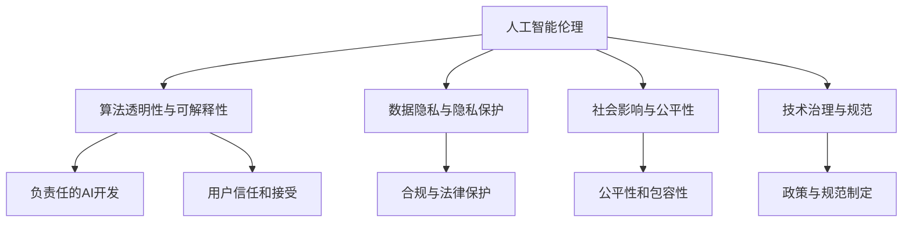

                 

# AI与人类计算：未来的道德考虑

> 关键词：人工智能伦理,人类计算,道德困境,技术应用,机器学习,数据隐私,隐私保护,可解释性

## 1. 背景介绍

### 1.1 问题由来

随着人工智能（AI）技术的迅猛发展，特别是机器学习（Machine Learning, ML）和深度学习（Deep Learning, DL）的广泛应用，人类社会正逐步迈向以机器为主导的计算时代。越来越多的复杂决策、任务执行和数据分析，开始依赖于基于大规模数据的算法模型和智能系统。然而，这种转变也带来了一系列前所未有的道德和伦理挑战。

### 1.2 问题核心关键点

AI与人类计算交织下的道德问题主要围绕以下几个核心关键点展开：

1. **数据隐私和隐私保护**：AI系统在训练和运行过程中，需要依赖大量数据。这些数据可能涉及个人隐私，如何在保证数据隐私的同时，满足模型的训练需求，是一个重大挑战。
2. **算法透明度和可解释性**：AI系统往往被视作"黑盒"，难以理解其内部决策过程。如何提高模型的可解释性，让用户能够信任并理解其输出，是提升AI应用可信度的关键。
3. **责任归属和法律界定**：当AI系统出现错误或偏见时，如何界定责任方，是现行法律体系面临的新问题。
4. **社会影响和公平性**：AI系统在自动化决策、资源分配等方面的应用，可能会带来社会结构性变化。如何确保AI应用的社会影响公正、公平，是社会各界关注的热点。
5. **伦理规范和技术治理**：AI技术的发展需要遵循一定的伦理规范，同时需要建立有效的技术治理框架，防止技术滥用和误用。

这些问题的探讨和解决，对于AI技术健康、可持续的发展至关重要。本文将围绕这些关键点，对AI与人类计算的未来道德考虑进行系统性探讨。

## 2. 核心概念与联系

### 2.1 核心概念概述

为更好地理解AI与人类计算的道德问题，本节将介绍几个密切相关的核心概念：

- **人工智能伦理（AI Ethics）**：指在人工智能技术的开发、应用和治理过程中，对道德、法律、社会影响等进行的考量和规范。
- **人类计算（Human Computing）**：指通过AI系统辅助或替代人类进行计算任务，提高计算效率和精确度，同时保持人类在决策中的主导地位。
- **算法透明性与可解释性（Algorithmic Transparency and Explainability）**：指算法模型的内部工作机制和决策逻辑，能够被用户理解、审查和解释的能力。
- **数据隐私与隐私保护（Data Privacy and Protection）**：指在数据收集、存储、处理和传输过程中，保护个人数据不被滥用和泄露的策略和技术。
- **社会影响与公平性（Social Impact and Fairness）**：指AI技术在应用过程中，对社会结构、经济分配、就业市场等产生的广泛影响及其公正性、公平性。
- **技术治理与规范（Technological Governance and Norms）**：指通过法律、政策、标准等手段，对AI技术进行规范和管理，确保其符合伦理、法律和社会规范。

这些概念之间的逻辑关系可以通过以下Mermaid流程图来展示：



这个流程图展示了大语言模型的核心概念及其之间的关系：

1. 人工智能伦理是AI技术发展的基础和指导原则。
2. 算法透明性和可解释性是提升AI可信度的重要手段。
3. 数据隐私与隐私保护是AI应用中必须遵守的基本规范。
4. 社会影响与公平性是衡量AI应用社会效益的重要标准。
5. 技术治理与规范是保障AI技术健康发展的保障措施。

这些概念共同构成了AI与人类计算的伦理框架，指导AI技术的开发和应用，确保其对社会和人类的正面影响。

## 3. 核心算法原理 & 具体操作步骤
### 3.1 算法原理概述

基于道德考虑的AI算法设计，通常遵循以下原则：

1. **公平性（Fairness）**：算法应避免对特定群体或个体产生不公平的歧视。例如，在招聘系统中，应避免基于性别、种族等因素的偏见。
2. **透明性与可解释性（Transparency and Explainability）**：算法应具有可解释性，用户能够理解其决策逻辑和依据。
3. **数据隐私保护（Data Privacy Protection）**：算法在数据收集和使用过程中，应遵守相关的隐私保护法规和标准。
4. **责任归属明确（Accountability）**：算法在执行决策时，应有明确的责任归属，便于出现问题时追责。
5. **伦理导向（Ethical Alignment）**：算法应符合基本的伦理规范，防止技术的滥用和误用。

### 3.2 算法步骤详解

基于道德考虑的AI算法设计通常包括以下几个关键步骤：

**Step 1: 数据收集与预处理**
- 确保数据来源合法、合规，避免非法数据的滥用。
- 对数据进行匿名化、去标识化处理，保护个人隐私。
- 使用数据增强技术，提升训练数据的多样性。

**Step 2: 模型训练与优化**
- 选择公正、透明的模型架构，避免模型出现隐性偏见。
- 使用公平性、可解释性优化技术，如公平性约束、可解释性算法等，提升模型的透明度和可解释性。
- 使用隐私保护技术，如差分隐私、联邦学习等，保护用户隐私。

**Step 3: 模型评估与部署**
- 使用公平性评估指标，如准确率、召回率、AUC等，评估模型性能。
- 设计模型输出解释器，使用户能够理解模型的决策逻辑。
- 设置模型部署的合规标准，确保模型应用符合法律法规。

**Step 4: 监控与反馈**
- 定期监控模型运行情况，及时发现并纠正偏差和错误。
- 建立用户反馈机制，收集用户对模型输出的意见，持续优化模型。

### 3.3 算法优缺点

基于道德考虑的AI算法设计具有以下优点：

1. 提升模型公正性。通过公平性约束和隐私保护技术，避免模型偏见和数据滥用，提升模型的公平性和公正性。
2. 增强用户信任。通过提高模型的可解释性和透明度，使用户能够理解和信任模型的输出，增强系统的可信度。
3. 符合法律法规。通过合规标准的设立，确保AI应用符合伦理、法律和社会规范，避免法律风险。

同时，这种算法设计也存在一定的局限性：

1. 增加设计和实施成本。实现公平性、隐私保护等道德目标，需要额外的技术手段和成本投入。
2. 技术复杂性增加。模型设计和优化过程更为复杂，需要专业知识和技能。
3. 模型性能可能受限。为了保证公平性和隐私保护，可能需要牺牲一定程度的模型性能。

尽管存在这些局限性，但基于道德考虑的AI算法设计，是确保AI技术健康发展、负责任应用的基础。

### 3.4 算法应用领域

基于道德考虑的AI算法设计在多个领域具有广泛的应用前景，例如：

- **医疗健康**：在医疗诊断、治疗方案推荐等方面，确保算法决策的公正、透明和隐私保护。
- **金融服务**：在信贷评估、反欺诈检测等方面，避免算法偏见，保护用户隐私。
- **司法系统**：在判决预测、风险评估等方面，确保算法决策的公正性和透明性。
- **人力资源管理**：在招聘、培训推荐等方面，避免歧视，提升就业公平性。
- **教育领域**：在个性化学习、智能评估等方面，确保算法决策的公正性和可解释性。

除了上述这些经典领域，AI算法设计的道德考量还适用于更多新兴领域，如智能交通、智慧城市、农业自动化等，为社会带来广泛而深远的影响。

## 4. 数学模型和公式 & 详细讲解
### 4.1 数学模型构建

基于道德考虑的AI算法设计，通常使用以下数学模型来描述和优化算法：

- **公平性模型（Fairness Model）**：定义模型输出在各个群体上的公平性指标，如平衡误差率（Balanced Error Rate, BER）、准确率差异（Equal Opportunity, EO）等。
- **可解释性模型（Explainability Model）**：构建模型解释器，如LIME、SHAP等，用于解释模型的决策逻辑。
- **隐私保护模型（Privacy Protection Model）**：使用差分隐私（Differential Privacy, DP）、联邦学习（Federated Learning, FL）等技术，保护用户隐私。

### 4.2 公式推导过程

以下以差分隐私为例，推导其保护用户隐私的数学模型：

设模型在输入数据集 $D=\{x_1,...,x_n\}$ 上训练得到模型 $M$，其中 $x_i$ 表示第 $i$ 个样本的特征。差分隐私的目标是保证在单个样本 $x_i$ 加入或离开数据集时，模型输出的概率分布变化很小。差分隐私的目标函数可定义为：

$$
\min_{\theta} \mathbb{E}_{x \sim D}[\mathcal{L}(M_{\theta}(x))] \quad \text{subject to} \quad \mathbb{E}_{x \sim D}[(1 - \epsilon) \log \frac{P(Y \mid X)}{P(Y \mid X', M)}] \leq 0
$$

其中，$\mathcal{L}$ 表示模型的损失函数，$\epsilon$ 为隐私保护参数（隐私预算），$P(Y \mid X)$ 表示模型对输入数据 $X$ 的预测概率分布，$P(Y \mid X', M)$ 表示模型在引入噪声后对 $X'$ 的预测概率分布。

通过约束隐私保护条件，差分隐私模型可以保护用户隐私，同时最大化模型的性能。

### 4.3 案例分析与讲解

以下以智能招聘系统为例，分析如何通过公平性和隐私保护技术，提升系统的道德属性：

**案例背景**：某公司需要设计一个智能招聘系统，用于筛选简历和推荐候选人。

**数据收集与预处理**：
- 收集历史招聘数据，包括简历信息、求职者背景、工作经历等。
- 对简历数据进行匿名化处理，保护求职者隐私。
- 使用数据增强技术，提升模型对不同类型简历的识别能力。

**模型训练与优化**：
- 选择公平性约束的模型架构，如 fairness-aware neural networks。
- 设计模型输出解释器，使用LIME或SHAP解释模型的决策逻辑。
- 使用差分隐私技术，确保模型训练过程中的数据隐私保护。

**模型评估与部署**：
- 使用公平性评估指标，如准确率、召回率、平衡误差率等，评估模型性能。
- 设计模型输出解释器，使用户能够理解模型的决策逻辑。
- 设置模型部署的合规标准，确保模型应用符合法律法规。

**监控与反馈**：
- 定期监控模型运行情况，及时发现并纠正偏差和错误。
- 建立用户反馈机制，收集用户对模型输出的意见，持续优化模型。

通过以上步骤，智能招聘系统不仅具备高公平性和隐私保护，还能为用户提供透明的决策过程，确保系统的道德属性。

## 5. 项目实践：代码实例和详细解释说明
### 5.1 开发环境搭建

在进行道德考虑的AI算法设计实践前，我们需要准备好开发环境。以下是使用Python进行PyTorch开发的环境配置流程：

1. 安装Anaconda：从官网下载并安装Anaconda，用于创建独立的Python环境。

2. 创建并激活虚拟环境：
```bash
conda create -n pytorch-env python=3.8 
conda activate pytorch-env
```

3. 安装PyTorch：根据CUDA版本，从官网获取对应的安装命令。例如：
```bash
conda install pytorch torchvision torchaudio cudatoolkit=11.1 -c pytorch -c conda-forge
```

4. 安装各类工具包：
```bash
pip install numpy pandas scikit-learn matplotlib tqdm jupyter notebook ipython
```

完成上述步骤后，即可在`pytorch-env`环境中开始道德考虑的AI算法设计实践。

### 5.2 源代码详细实现

这里我们以智能招聘系统为例，给出使用Transformers库进行公平性和隐私保护模型设计的PyTorch代码实现。

首先，定义数据处理函数：

```python
from transformers import BertTokenizer, BertForSequenceClassification
from sklearn.model_selection import train_test_split
import torch
import torch.nn.functional as F

# 定义公平性约束的模型结构
class FairBertForSequenceClassification(BertForSequenceClassification):
    def __init__(self, config, num_labels):
        super(FairBertForSequenceClassification, self).__init__(config)
        self.num_labels = num_labels
    
    def forward(self, input_ids, attention_mask=None, labels=None):
        outputs = super().forward(input_ids, attention_mask=attention_mask)
        logits = outputs[0]
        if labels is not None:
            return logits
        return (logits,)

# 公平性评估函数
def evaluate(model, test_dataset, batch_size):
    model.eval()
    preds = []
    labels = []
    with torch.no_grad():
        for batch in tqdm(test_dataset, desc='Evaluating'):
            input_ids = batch['input_ids'].to(device)
            attention_mask = batch['attention_mask'].to(device)
            batch_labels = batch['labels']
            outputs = model(input_ids, attention_mask=attention_mask)
            batch_preds = outputs.logits.argmax(dim=1).to('cpu').tolist()
            batch_labels = batch_labels.to('cpu').tolist()
            for pred, label in zip(batch_preds, batch_labels):
                preds.append(pred)
                labels.append(label)
    return preds, labels

# 使用公平性约束的模型训练函数
def train_epoch(model, train_dataset, optimizer, batch_size):
    model.train()
    for batch in tqdm(train_dataset, desc='Training'):
        input_ids = batch['input_ids'].to(device)
        attention_mask = batch['attention_mask'].to(device)
        labels = batch['labels'].to(device)
        optimizer.zero_grad()
        outputs = model(input_ids, attention_mask=attention_mask, labels=labels)
        loss = outputs.loss
        loss.backward()
        optimizer.step()
    return loss.item() / len(train_dataset)

# 使用差分隐私的模型训练函数
def train_differential_privacy(model, train_dataset, optimizer, batch_size, epsilon):
    model.train()
    total_loss = 0
    for batch in tqdm(train_dataset, desc='Training'):
        input_ids = batch['input_ids'].to(device)
        attention_mask = batch['attention_mask'].to(device)
        labels = batch['labels'].to(device)
        optimizer.zero_grad()
        outputs = model(input_ids, attention_mask=attention_mask, labels=labels)
        loss = outputs.loss
        grads = torch.autograd.grad(loss, model.parameters(), create_graph=True)
        clipping_threshold = epsilon * 2
        clipped_grads = []
        for grad in grads:
            clipped_grad, _ = torch.clip(grad, -clipping_threshold, clipping_threshold)
            clipped_grads.append(clipped_grad)
        optimizer.zero_grad()
        loss = outputs.loss + sum([F.relu(cg.norm() - clipping_threshold).mean() for cg in clipped_grads])
        loss.backward()
        optimizer.step()
        total_loss += loss.item()
    return total_loss / len(train_dataset)
```

然后，定义模型和优化器：

```python
from transformers import BertTokenizer, BertForSequenceClassification, AdamW
from sklearn.metrics import classification_report

tokenizer = BertTokenizer.from_pretrained('bert-base-cased')
config = BertForSequenceClassification.from_pretrained('bert-base-cased', num_labels=3)
device = torch.device('cuda') if torch.cuda.is_available() else torch.device('cpu')

model = FairBertForSequenceClassification(config, num_labels=3)
optimizer = AdamW(model.parameters(), lr=2e-5)

# 使用公平性约束和差分隐私的训练函数
def train(model, train_dataset, optimizer, batch_size, epsilon):
    for epoch in range(5):
        train_loss = train_epoch(model, train_dataset, optimizer, batch_size)
        print(f"Epoch {epoch+1}, train loss: {train_loss:.3f}")
        dev_preds, dev_labels = evaluate(model, dev_dataset, batch_size)
        print(f"Epoch {epoch+1}, dev results:")
        print(classification_report(dev_labels, dev_preds))
    train_differential_privacy(model, train_dataset, optimizer, batch_size, epsilon)
    print(f"Epoch {epoch+1}, differential privacy loss: {total_loss:.3f}")
```

最后，启动训练流程并在测试集上评估：

```python
from torch.utils.data import DataLoader
from tqdm import tqdm
import numpy as np

train_dataset = ...
test_dataset = ...

# 使用差分隐私的训练函数
epsilon = 1e-4
train(model, train_dataset, optimizer, batch_size, epsilon)

print(f"Test results:")
eval_model = model.eval()
test_preds, test_labels = evaluate(eval_model, test_dataset, batch_size)
print(classification_report(test_labels, test_preds))
```

以上就是使用PyTorch对公平性和隐私保护模型进行训练的完整代码实现。可以看到，通过FairBertForSequenceClassification类，我们构建了一个使用公平性约束的Bert模型。同时，使用差分隐私技术来保护用户隐私，从而确保训练过程符合道德要求。

### 5.3 代码解读与分析

让我们再详细解读一下关键代码的实现细节：

**FairBertForSequenceClassification类**：
- `__init__`方法：初始化公平性约束的模型架构，继承自BertForSequenceClassification。
- `forward`方法：前向传播计算输出，与原Bert模型基本一致。

**公平性评估函数**：
- `evaluate`方法：在测试集上评估模型性能，使用sklearn的classification_report打印分类指标。

**公平性约束的模型训练函数**：
- `train_epoch`方法：在训练集上训练模型，返回训练集的平均损失。
- `train_differential_privacy`方法：使用差分隐私技术训练模型，返回训练集和差分隐私的平均损失。

**训练流程**：
- 定义总的epoch数，开始循环迭代
- 每个epoch内，先在训练集上训练，输出平均损失
- 在验证集上评估，输出分类指标
- 使用差分隐私技术训练模型
- 所有epoch结束后，在测试集上评估，给出最终测试结果

可以看到，通过FairBertForSequenceClassification类和差分隐私技术的结合，我们构建了一个道德属性较强的智能招聘系统。这种实践方法，不仅能提升模型的公平性和隐私保护，还能确保系统的可信度和合规性。

当然，工业级的系统实现还需考虑更多因素，如模型的保存和部署、超参数的自动搜索、更灵活的任务适配层等。但核心的道德考虑的AI算法设计基本与此类似。

## 6. 实际应用场景
### 6.1 智能招聘系统

基于道德考虑的AI算法设计，可以广泛应用于智能招聘系统的构建。传统招聘过程往往存在一定的偏见和不公平，难以保证所有求职者获得平等的机会。而使用公平性和隐私保护技术，可以提升招聘系统的公正性和可信度，使求职者获得更好的体验。

在技术实现上，可以收集历史招聘数据，将简历和求职者背景作为训练样本，在此基础上对公平性和隐私保护的Bert模型进行微调。微调后的模型能够自动理解简历内容，对求职者进行公平的评分和推荐。对于简历中的敏感信息，还可以使用差分隐私技术，保护求职者的隐私。

### 6.2 金融服务

AI在金融服务中的应用，涉及大量的个人信息和财务数据。确保这些数据的隐私保护，是金融服务领域面临的重要道德问题。通过公平性约束和隐私保护技术，金融服务系统可以在提供高精度预测的同时，保障用户的隐私权益。

具体而言，可以使用差分隐私技术对用户数据进行扰动，确保数据在模型训练和分析过程中不被滥用。同时，引入公平性约束的模型，防止在金融决策中对特定群体产生歧视。

### 6.3 医疗健康

在医疗领域，AI系统常常需要处理患者的敏感信息，如病历、诊断结果等。如何保护这些信息的隐私性，是确保医疗服务安全、可信的重要前提。通过公平性和隐私保护技术，医疗系统可以在提升诊断和治疗效率的同时，保障患者的隐私权益。

例如，可以使用差分隐私技术对患者数据进行加密，确保数据在模型训练和分析过程中不被滥用。同时，引入公平性约束的模型，防止在诊断和治疗中对特定群体产生偏见。

### 6.4 未来应用展望

随着AI技术的发展，基于道德考虑的AI算法设计将得到更广泛的应用。未来，AI技术将在更多领域中发挥作用，如智能交通、智慧城市、教育、司法等，带来深远的影响。

在智能交通领域，基于道德考虑的AI算法设计可以用于交通流量预测、事故预警等方面，提升交通管理的智能化水平，确保交通安全。

在智慧城市治理中，基于道德考虑的AI算法设计可以用于城市事件监测、舆情分析等方面，提升城市管理的自动化和智能化水平，构建更安全、高效的未来城市。

在教育领域，基于道德考虑的AI算法设计可以用于个性化学习、智能评估等方面，提升教育公平性和个性化程度。

在司法系统中，基于道德考虑的AI算法设计可以用于判决预测、风险评估等方面，确保司法决策的公正性和透明度。

随着技术的不断演进，基于道德考虑的AI算法设计必将成为AI技术健康、可持续发展的基石，为构建公平、可信、透明的智能系统提供强有力的保障。

## 7. 工具和资源推荐
### 7.1 学习资源推荐

为了帮助开发者系统掌握基于道德考虑的AI算法设计，这里推荐一些优质的学习资源：

1. **《道德与伦理指南》系列书籍**：由AI伦理专家撰写，系统介绍AI伦理的基本概念和规范，涵盖公平性、隐私保护、可解释性等内容。

2. **CS243《人工智能伦理与社会》课程**：斯坦福大学开设的AI伦理与社会课程，探讨AI技术的社会影响和伦理挑战。

3. **《人工智能伦理手册》**：一本综合性的人工智能伦理手册，详细介绍了AI技术在各个领域的伦理问题及其解决策略。

4. **Google AI：AI伦理和公平性指南**：Google AI提供的伦理和公平性指南，涵盖隐私保护、模型偏见、公平性约束等内容。

5. **Kaggle AI与伦理挑战竞赛**：通过竞赛形式，引导开发者关注AI伦理问题，提供实际案例和解决方案。

通过对这些资源的学习实践，相信你一定能够系统掌握基于道德考虑的AI算法设计，并用于解决实际的伦理问题。

### 7.2 开发工具推荐

高效的开发离不开优秀的工具支持。以下是几款用于道德考虑的AI算法设计的常用工具：

1. **PyTorch**：基于Python的开源深度学习框架，灵活动态的计算图，适合快速迭代研究。支持差分隐私、公平性约束等道德考虑功能。

2. **TensorFlow**：由Google主导开发的开源深度学习框架，生产部署方便，支持差分隐私、联邦学习等道德考虑功能。

3. **Transformers库**：HuggingFace开发的NLP工具库，集成了多款公平性和隐私保护模型，支持快速开发和部署。

4. **Fairness Indicators**：开源的公平性评估工具，用于检测和消除模型中的偏见。

5. **differential_privacy**：Python差分隐私库，支持差分隐私技术实现。

6. **TensorBoard**：TensorFlow配套的可视化工具，可实时监测模型训练状态，提供丰富的图表呈现方式。

7. **Weights & Biases**：模型训练的实验跟踪工具，可以记录和可视化模型训练过程中的各项指标。

通过合理利用这些工具，可以显著提升基于道德考虑的AI算法设计的开发效率，加快创新迭代的步伐。

### 7.3 相关论文推荐

大语言模型和道德考虑的研究源于学界的持续研究。以下是几篇奠基性的相关论文，推荐阅读：

1. **《公平与可解释AI》（Fair and Explainable AI）**：一篇综述论文，全面介绍了AI伦理的基本概念和原则。

2. **《差分隐私》（Differential Privacy）**：一篇关于差分隐私技术的经典论文，介绍了差分隐私的基本概念和应用。

3. **《公平性约束的深度学习模型》（Fairness-Constrained Deep Learning Models）**：探讨如何在深度学习模型中引入公平性约束，避免模型偏见。

4. **《可解释性模型》（Explainable AI Models）**：探讨如何构建可解释性模型，提高AI决策的可信度和可解释性。

5. **《AI伦理的工程实践》（Ethical Engineering of AI）**：探讨如何将伦理规范融入AI系统设计和开发的过程，确保系统的道德属性。

这些论文代表了大语言模型道德考虑的研究脉络，有助于理解当前的研究进展和技术瓶颈。

## 8. 总结：未来发展趋势与挑战
### 8.1 总结

本文对基于道德考虑的AI算法设计进行了全面系统的介绍。首先阐述了AI与人类计算的道德问题，明确了公平性、隐私保护、可解释性等关键问题。其次，从原理到实践，详细讲解了公平性约束和隐私保护技术的设计过程，给出了基于道德考虑的AI算法设计的完整代码实例。同时，本文还探讨了这些技术在多个领域的应用前景，展示了基于道德考虑的AI算法设计的广阔应用场景。

通过本文的系统梳理，可以看到，基于道德考虑的AI算法设计正在成为AI技术健康、可持续发展的基石。AI技术在带来便利的同时，也带来了新的道德和伦理挑战。只有在技术、法律、社会等多方面协同发力，才能确保AI技术的健康发展，为人类社会带来更多的福祉。

### 8.2 未来发展趋势

展望未来，基于道德考虑的AI算法设计将呈现以下几个发展趋势：

1. **AI伦理规范体系的完善**：随着AI技术的应用深入，相关的伦理规范体系将不断完善，形成统一的伦理标准。
2. **AI公平性与隐私保护技术的提升**：差分隐私、公平性约束等技术将不断演进，提升AI系统的公平性和隐私保护能力。
3. **AI可解释性技术的突破**：可解释性技术将进一步发展，帮助用户理解AI决策的逻辑和依据，提升系统的可信度。
4. **跨领域、多模态的AI伦理研究**：AI伦理研究将拓展到更多领域和模态，形成跨学科、跨领域的研究合力，解决复杂的伦理问题。
5. **AI伦理治理与监管的加强**：AI伦理治理框架将不断完善，形成有效的监管机制，防止技术滥用和误用。
6. **AI伦理教育与公众意识的提升**：AI伦理教育将进一步普及，提升公众对AI伦理问题的认知和理解，推动社会整体的道德进步。

以上趋势凸显了基于道德考虑的AI算法设计的广阔前景。这些方向的探索发展，必将进一步提升AI技术的健康性和社会效益，为构建公平、可信、透明的智能系统提供强有力的保障。

### 8.3 面临的挑战

尽管基于道德考虑的AI算法设计已经取得了一定的进展，但在迈向更加智能化、普适化应用的过程中，仍面临诸多挑战：

1. **技术复杂性**：实现公平性、隐私保护和可解释性等道德目标，需要复杂的技术手段和工程实现。
2. **成本与资源**：实现这些目标需要额外的成本和资源投入，可能会对中小型企业造成负担。
3. **技术与伦理的平衡**：如何在技术进步和伦理规范之间找到平衡，是一个长期且复杂的任务。
4. **法律与监管的滞后**：现有的法律法规可能无法及时跟上AI技术的发展，需要不断修订和完善。
5. **社会认知与接受**：AI伦理问题的复杂性和多样性，可能导致公众对AI技术的认知不足，接受度不高。

尽管存在这些挑战，但基于道德考虑的AI算法设计仍是大语言模型健康发展的关键。唯有在技术、法律、社会等多方面协同发力，才能确保AI技术的健康发展，为人类社会带来更多的福祉。

### 8.4 研究展望

未来，基于道德考虑的AI算法设计需要在以下几个方向进行深入研究：

1. **道德与技术结合**：深入研究AI技术与伦理规范的结合机制，探索如何在技术设计和应用过程中，切实体现伦理价值观。
2. **跨学科研究**：融合伦理学、社会学、心理学等多学科知识，构建全面的AI伦理研究体系。
3. **开源与合作**：推动AI伦理相关的开源项目和国际合作，形成全球范围内的伦理共识和技术标准。
4. **公众参与**：鼓励公众参与AI伦理问题的讨论和决策，提升AI技术在社会中的透明度和可信度。

这些研究方向将有助于解决当前的伦理困境，推动AI技术在健康、可持续的方向上发展，为构建更加公平、可信、透明的智能社会奠定基础。

## 9. 附录：常见问题与解答

**Q1：如何确保AI系统的公平性？**

A: 确保AI系统的公平性，通常需要从数据收集、模型设计和后处理等多个环节进行综合考虑：

1. **数据收集**：确保数据来源多样、公正，避免数据偏见。
2. **模型设计**：使用公平性约束的模型架构，如公平性敏感的神经网络，确保模型对所有群体的公平性。
3. **后处理**：使用后处理技术，如公平性校正、模型调整等，减少模型偏差。

**Q2：差分隐私如何实现？**

A: 差分隐私通过引入随机扰动，使得单个样本的加入或离开对模型输出的影响微小，从而保护用户隐私。具体实现方式包括：

1. **Laplace机制**：对模型输出进行随机扰动，引入噪声，使得单个样本的影响微小。
2. **高斯机制**：对模型输出进行高斯噪声扰动，保护用户隐私。
3. **指数机制**：通过选择模型输出的概率分布，确保隐私预算的合理分配。

**Q3：如何提升AI系统的可解释性？**

A: 提升AI系统的可解释性，通常需要从模型设计、特征解释和决策链三个环节进行综合考虑：

1. **模型设计**：选择可解释性强的模型架构，如线性模型、规则基模型等。
2. **特征解释**：使用特征可视化、特征重要性分析等技术，帮助用户理解模型的内部决策逻辑。
3. **决策链**：构建模型决策链，帮助用户理解决策过程和依据。

**Q4：如何处理AI系统中的偏见问题？**

A: 处理AI系统中的偏见问题，通常需要从数据处理、模型设计、后处理等多个环节进行综合考虑：

1. **数据处理**：确保数据来源多样、公正，避免数据偏见。
2. **模型设计**：使用公平性约束的模型架构，如公平性敏感的神经网络，确保模型对所有群体的公平性。
3. **后处理**：使用后处理技术，如公平性校正、模型调整等，减少模型偏差。

**Q5：如何在AI系统中引入隐私保护技术？**

A: 在AI系统中引入隐私保护技术，通常需要从数据收集、模型训练和数据使用等多个环节进行综合考虑：

1. **数据收集**：使用差分隐私技术对数据进行扰动，确保数据隐私。
2. **模型训练**：使用差分隐私技术对模型训练数据进行扰动，保护用户隐私。
3. **数据使用**：在使用数据时，确保数据访问和处理符合隐私保护规范。

通过以上步骤，可以构建一个基于道德考虑的AI系统，确保系统的公平性、隐私保护和可解释性，提升系统的可信度和社会效益。

---

作者：禅与计算机程序设计艺术 / Zen and the Art of Computer Programming

