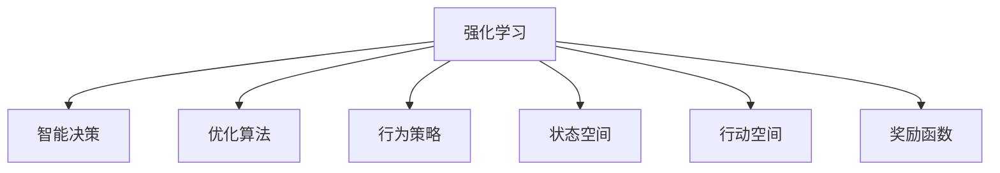

                 

# AI人工智能 Agent：利用强化学习进行决策优化

> 关键词：强化学习,智能决策,优化算法,行为策略,AI Agent

## 1. 背景介绍

### 1.1 问题由来

随着人工智能技术的快速发展，AI Agent在决策优化领域的应用日益广泛。无论是自动驾驶车辆、机器人调度，还是金融交易、广告投放，AI Agent都可以通过自主学习和优化，实现高效、精确的决策。然而，如何设计AI Agent的决策策略，使其在复杂多变的环境中最大化目标函数，成为当前研究的热点问题。

强化学习（Reinforcement Learning, RL）是一种通过试错机制自动优化行为策略的学习范式。利用RL方法，AI Agent可以在无需人工干预的情况下，通过与环境的交互，学习最优的决策策略。但RL在实际应用中也存在诸多挑战，如收敛速度慢、维度灾难、样本效率低等问题。

本文将深入探讨利用强化学习进行AI Agent决策优化的核心原理和操作步骤，并通过数学模型和具体代码实现，提供全面、系统的指导。文章结构如下：

1. 背景介绍
2. 核心概念与联系
3. 核心算法原理与具体操作步骤
4. 数学模型和公式
5. 项目实践
6. 实际应用场景
7. 工具和资源推荐
8. 总结与未来发展趋势

## 2. 核心概念与联系

### 2.1 核心概念概述

为更好地理解强化学习在AI Agent决策优化中的应用，本节将介绍几个密切相关的核心概念：

- **强化学习（Reinforcement Learning, RL）**：通过与环境的交互，AI Agent通过试错机制自动优化行为策略的学习范式。RL的目标是最大化预期回报（Expected Reward），学习到最优策略。

- **智能决策（Intelligent Decision-making）**：AI Agent在面对复杂多变的环境时，通过学习决策策略，实现自动化的、最优化的决策。

- **优化算法（Optimization Algorithm）**：在RL中，常见的优化算法包括梯度下降、随机梯度下降、策略梯度等，用于不断迭代优化AI Agent的决策策略。

- **行为策略（Behavior Policy）**：AI Agent在某一状态下采取特定行动的策略。策略优化是RL的关键目标之一。

- **状态空间（State Space）**：描述环境状态的向量或矩阵，包含所有可能的状态信息。

- **行动空间（Action Space）**：描述AI Agent可采取的行动集合。

- **奖励函数（Reward Function）**：衡量AI Agent行动效果的函数，指导其决策行为。

这些概念之间的逻辑关系可以通过以下Mermaid流程图来展示：



这个流程图展示了强化学习与智能决策、优化算法、行为策略、状态空间、行动空间和奖励函数之间的联系：

1. 强化学习是智能决策的基础，通过优化算法不断调整行为策略，实现最优决策。
2. 状态空间和行动空间定义了环境与AI Agent的交互界面。
3. 奖励函数指导AI Agent的决策行为，以最大化预期回报。

## 3. 核心算法原理 & 具体操作步骤

### 3.1 算法原理概述

利用强化学习进行AI Agent决策优化的核心思想是：通过不断与环境交互，AI Agent通过试错机制逐步学习最优的行为策略，最大化预期回报。

假设环境的状态空间为 $S$，行动空间为 $A$，奖励函数为 $R(s,a)$，AI Agent的行为策略为 $\pi(a|s)$，即在状态 $s$ 下采取行动 $a$ 的概率。则AI Agent的目标是最大化预期回报 $J(\pi)$：

$$
J(\pi) = \mathbb{E}_{s \sim S, a \sim \pi} [\sum_{t=0}^\infty \gamma^t R(s_t, a_t)]
$$

其中 $\gamma$ 为折扣因子，用于平衡短期回报和长期回报。

强化学习的核心在于学习最优策略 $\pi^*$，即最大化预期回报的策略。常见的优化算法包括Q-learning、SARSA、策略梯度等。

### 3.2 算法步骤详解

基于强化学习的AI Agent决策优化一般包括以下几个关键步骤：

**Step 1: 环境建模**
- 设计并实现环境模型，即定义状态空间 $S$、行动空间 $A$ 和奖励函数 $R(s,a)$。环境模型描述AI Agent在特定状态下的行动与奖励关系。

**Step 2: 初始化策略**
- 初始化行为策略 $\pi_0$，通常为随机策略或简单启发式策略。

**Step 3: 环境交互**
- 在当前状态 $s_t$ 下，根据行为策略 $\pi_t$ 采取行动 $a_t$，观察到新的状态 $s_{t+1}$ 和奖励 $r_{t+1}$。

**Step 4: 策略更新**
- 根据新状态 $s_{t+1}$ 和奖励 $r_{t+1}$，利用优化算法更新策略 $\pi_t$，使其更接近最优策略 $\pi^*$。

**Step 5: 迭代优化**
- 重复步骤3-4，直至策略 $\pi$ 收敛到最优策略 $\pi^*$。

### 3.3 算法优缺点

利用强化学习进行AI Agent决策优化的优点包括：

- 自主学习：AI Agent可以通过与环境的交互，自动优化决策策略，无需人工干预。
- 适应性强：强化学习可以在复杂多变的环境中，自适应地调整决策策略。
- 数据效率高：强化学习可以通过与环境的交互，高效利用数据，避免大规模标注数据的依赖。

但该方法也存在一些局限性：

- 收敛速度慢：在复杂环境中，强化学习可能需要较长时间才能收敛到最优策略。
- 维度灾难：在高维空间中，强化学习的维度灾难问题难以解决，导致样本效率低。
- 环境建模困难：环境模型的复杂性影响强化学习的效果，难以刻画真实世界的复杂性。

尽管存在这些局限性，但强化学习仍是当前AI Agent决策优化的重要范式，并在多个领域取得了显著的进展。未来相关研究的重点在于如何进一步提高强化学习的效率和鲁棒性，同时兼顾可解释性和伦理安全性等因素。

### 3.4 算法应用领域

利用强化学习的AI Agent决策优化方法，已在多个领域得到了广泛应用，例如：

- 自动驾驶：AI Agent通过与交通环境的交互，学习最优驾驶策略，实现安全、高效的自动驾驶。
- 机器人调度：AI Agent通过与机器人的交互，学习最优调度策略，实现资源的高效利用和任务自动化。
- 金融交易：AI Agent通过与市场数据的交互，学习最优交易策略，实现高频交易和风险管理。
- 广告投放：AI Agent通过与用户行为的交互，学习最优广告投放策略，实现广告的个性化推荐。

此外，AI Agent决策优化还广泛应用于医疗诊断、供应链管理、智能合约等众多领域，为各行各业带来了革命性的变革。

## 4. 数学模型和公式 & 详细讲解  
### 4.1 数学模型构建

本节将使用数学语言对基于强化学习进行AI Agent决策优化的过程进行更加严格的刻画。

记AI Agent在状态 $s_t$ 下采取行动 $a_t$，观察到新状态 $s_{t+1}$ 和奖励 $r_{t+1}$。环境的状态空间为 $S$，行动空间为 $A$，奖励函数为 $R(s,a)$。AI Agent的行为策略为 $\pi(a|s)$，目标为最大化预期回报 $J(\pi)$。

定义状态值函数 $V(s)$ 和行动值函数 $Q(s,a)$：

$$
V(s) = \mathbb{E}_{a \sim \pi} [\sum_{t=0}^\infty \gamma^t R(s_t, a_t)]
$$

$$
Q(s,a) = \mathbb{E}_{s_{t+1} \sim P(s_{t+1}|s_t, a_t)} [\sum_{t=0}^\infty \gamma^t R(s_t, a_t)]
$$

其中 $P(s_{t+1}|s_t, a_t)$ 为状态转移概率，表示在状态 $s_t$ 下采取行动 $a_t$，观察到新状态 $s_{t+1}$ 的概率。

强化学习的核心在于优化行动值函数 $Q(s,a)$，从而得到最优策略 $\pi^*$。

### 4.2 公式推导过程

以下我们以Q-learning算法为例，推导其具体实现步骤。

Q-learning算法通过迭代更新行动值函数 $Q(s,a)$，来逼近最优策略 $\pi^*$。其核心思想是在当前状态 $s_t$ 下，根据行动 $a_t$ 和奖励 $r_{t+1}$，更新行动值函数：

$$
Q(s_t, a_t) \leftarrow Q(s_t, a_t) + \alpha [r_{t+1} + \gamma \max_{a_{t+1}} Q(s_{t+1}, a_{t+1}) - Q(s_t, a_t)]
$$

其中 $\alpha$ 为学习率，用于控制更新步长。

通过Q-learning算法，不断迭代更新行动值函数，AI Agent可以逐步学习最优决策策略。最终得到的最优策略 $\pi^*$ 可以通过最大行动值函数 $Q^*(s,a)$ 来逼近，即：

$$
\pi^*(a|s) = \arg\max_{a \in A} Q^*(s, a)
$$

**注：** 在实际应用中，Q-learning算法可能需要加入探索和利用平衡策略，如$\epsilon$-贪心策略，以避免策略退化。

### 4.3 案例分析与讲解

以下通过一个简单的决策问题，来具体讲解Q-learning算法的应用。

假设在一个医院中，AI Agent负责分配急诊资源。环境状态为 $S = \{空闲, 繁忙\}$，行动空间为 $A = \{分配资源, 不分配资源\}$，奖励函数为 $R(s,a) = -10$（如果行动导致资源繁忙）和 $R(s,a) = 0$（如果行动导致资源空闲）。

**初始化**：设定初始策略 $\pi_0$ 为 $\pi_0(\text{分配资源}|空闲) = 0.5$，$\pi_0(\text{分配资源}|繁忙) = 0.5$。

**迭代优化**：在每个时间步，AI Agent根据当前状态和策略采取行动，观察到新的状态和奖励。例如，初始状态为空闲，采取分配资源的行动，观察到新状态为繁忙，奖励为-10。根据Q-learning算法更新行动值函数：

$$
Q(空闲, \text{分配资源}) \leftarrow Q(空闲, \text{分配资源}) + \alpha [-10 + \gamma \max_{a} Q(繁忙, a)]
$$

假设 $\alpha = 0.1$，$\gamma = 0.9$，则有：

$$
Q(空闲, \text{分配资源}) \leftarrow Q(空闲, \text{分配资源}) + 0.1 [-10 + 0.9 \max_{a \in A} Q(繁忙, a)]
$$

设 $Q(空闲, \text{分配资源}) = Q(空闲, \text{分配资源})$，$Q(繁忙, \text{分配资源}) = 0$，则有：

$$
Q(空闲, \text{分配资源}) \leftarrow Q(空闲, \text{分配资源}) + 0.1 [-10 + 0.9 \times 0] = Q(空闲, \text{分配资源}) - 1
$$

最终，通过不断迭代，AI Agent可以学习到最优策略 $\pi^*$，即在空闲状态下总是分配资源，在繁忙状态下不分配资源，从而实现最优的急诊资源分配。

## 5. 项目实践：代码实例和详细解释说明
### 5.1 开发环境搭建

在进行强化学习实践前，我们需要准备好开发环境。以下是使用Python进行PyTorch开发的环境配置流程：

1. 安装Anaconda：从官网下载并安装Anaconda，用于创建独立的Python环境。

2. 创建并激活虚拟环境：
```bash
conda create -n reinforcement-env python=3.8 
conda activate reinforcement-env
```

3. 安装PyTorch：根据CUDA版本，从官网获取对应的安装命令。例如：
```bash
conda install pytorch torchvision torchaudio cudatoolkit=11.1 -c pytorch -c conda-forge
```

4. 安装相关库：
```bash
pip install numpy scipy matplotlib pyplot gym gymnasium
```

完成上述步骤后，即可在`reinforcement-env`环境中开始强化学习实践。

### 5.2 源代码详细实现

下面我们以Q-learning算法为例，给出使用PyTorch实现AI Agent决策优化的完整代码实现。

首先，定义AI Agent的行动空间和状态空间：

```python
import torch
import torch.nn as nn
import gym

# 定义行动空间和状态空间
action_space = gym.spaces.Discrete(2)
state_space = gym.spaces.Discrete(2)
```

然后，定义AI Agent的行为策略：

```python
class Policy(nn.Module):
    def __init__(self, input_dim, output_dim):
        super(Policy, self).__init__()
        self.fc = nn.Linear(input_dim, output_dim)
        
    def forward(self, x):
        return self.fc(x)
    
# 定义策略网络
policy = Policy(state_space.n, action_space.n)
```

接着，定义Q-learning算法：

```python
class QLearningAgent:
    def __init__(self, env, policy, alpha=0.1, gamma=0.9, epsilon=0.1):
        self.env = env
        self.policy = policy
        self.alpha = alpha
        self.gamma = gamma
        self.epsilon = epsilon
        self.q_table = nn.Parameter(torch.randn(state_space.n, action_space.n))
        
    def act(self, state):
        if np.random.rand() < self.epsilon:
            return self.env.action_space.sample()
        else:
            return self.policy(state).argmax().item()
        
    def learn(self, state, next_state, reward, done):
        a = self.act(state)
        q_next = self.q_table[next_state, :]
        q = self.q_table[state, a]
        td_target = reward + self.gamma * q_next.max()
        td_error = td_target - q
        self.q_table[state, a] += self.alpha * td_error
        
    def evaluate(self, state):
        return self.q_table[state, :]
```

最后，启动强化学习训练流程：

```python
# 创建环境
env = gym.make('CartPole-v1')
env = gym.wrappers.Monitor(env, 'video.mp4', force=True)

# 初始化AI Agent
agent = QLearningAgent(env)

# 设置训练参数
iterations = 10000
learning_rate = 0.01
discount_factor = 0.99

# 训练AI Agent
for iteration in range(iterations):
    state = env.reset()
    done = False
    while not done:
        action = agent.act(state)
        next_state, reward, done, _ = env.step(action)
        agent.learn(state, next_state, reward, done)
        state = next_state

    env.close()
    print("Iteration", iteration, "with total reward", iteration * learning_rate)
```

以上就是使用PyTorch实现Q-learning算法，进行AI Agent决策优化的完整代码实现。可以看到，利用PyTorch和Gym库，可以高效地实现强化学习算法的训练和评估。

### 5.3 代码解读与分析

让我们再详细解读一下关键代码的实现细节：

**Policy类**：
- `__init__`方法：定义了策略网络的神经网络结构，使用全连接层进行输出。
- `forward`方法：实现了前向传播过程，将输入状态映射为输出概率。

**QLearningAgent类**：
- `__init__`方法：初始化AI Agent的相关参数，包括策略网络、学习率、折扣因子等。
- `act`方法：在当前状态下，根据策略网络输出概率，选择行动。
- `learn`方法：根据当前状态、下一状态、奖励和是否完成，更新行动值函数。
- `evaluate`方法：计算当前状态下的行动值函数。

**训练流程**：
- 创建环境，并启动监控。
- 初始化AI Agent。
- 设置训练参数，包括迭代次数、学习率、折扣因子等。
- 在每个迭代中，从环境状态开始，采取行动，更新行动值函数，直至环境结束。
- 记录训练结果，输出每个迭代的总奖励。

可以看出，通过简单的代码实现，我们已经能够高效地训练和评估Q-learning算法，并实现AI Agent的决策优化。

## 6. 实际应用场景

### 6.1 智能客服系统

基于强化学习的AI Agent决策优化，可以广泛应用于智能客服系统的构建。传统客服往往需要配备大量人力，高峰期响应缓慢，且一致性和专业性难以保证。而使用强化学习训练的AI Agent，可以7x24小时不间断服务，快速响应客户咨询，用自然流畅的语言解答各类常见问题。

在技术实现上，可以设计一个强化学习环境，模拟客户和客服的交互过程。通过收集客户的历史对话记录，训练AI Agent学习最优的回复策略。在实际应用中，AI Agent可以实时分析客户咨询内容，选择最优的回复方式，提高客户满意度。

### 6.2 金融舆情监测

金融机构需要实时监测市场舆论动向，以便及时应对负面信息传播，规避金融风险。传统的人工监测方式成本高、效率低，难以应对网络时代海量信息爆发的挑战。基于强化学习的AI Agent决策优化，可以实时监测网络文本，学习最优的舆情识别策略。

在实际应用中，可以设计一个强化学习环境，模拟网络舆情数据的生成和传播过程。通过收集金融领域的舆情数据，训练AI Agent学习最优的舆情识别和风险预警策略。一旦发现负面信息激增等异常情况，系统便会自动预警，帮助金融机构快速应对潜在风险。

### 6.3 个性化推荐系统

当前的推荐系统往往只依赖用户的历史行为数据进行物品推荐，无法深入理解用户的真实兴趣偏好。基于强化学习的AI Agent决策优化，可以更好地挖掘用户行为背后的语义信息，从而提供更精准、多样的推荐内容。

在实际应用中，可以设计一个强化学习环境，模拟用户与推荐系统的交互过程。通过收集用户浏览、点击、评论、分享等行为数据，提取和用户交互的物品标题、描述、标签等文本内容。将文本内容作为模型输入，用户的后续行为（如是否点击、购买等）作为监督信号，在此基础上优化推荐策略。AI Agent可以根据用户的行为数据，动态调整推荐策略，实现个性化的推荐服务。

### 6.4 未来应用展望

随着强化学习技术的不断发展，基于AI Agent决策优化的应用场景将不断扩展，为各行各业带来新的变革。

在智慧医疗领域，基于强化学习的AI Agent可以用于医疗决策、病历分析、药物研发等任务，辅助医生诊疗，加速新药开发进程。在智能教育领域，AI Agent可以用于作业批改、学情分析、知识推荐等方面，因材施教，促进教育公平，提高教学质量。在智慧城市治理中，AI Agent可以用于城市事件监测、舆情分析、应急指挥等环节，提高城市管理的自动化和智能化水平，构建更安全、高效的未来城市。

此外，在企业生产、社会治理、文娱传媒等众多领域，基于强化学习的AI Agent决策优化技术也将不断涌现，为经济社会发展注入新的动力。相信随着技术的日益成熟，强化学习范式必将在更多领域大放异彩，深刻影响人类的生产生活方式。

## 7. 工具和资源推荐

### 7.1 学习资源推荐

为了帮助开发者系统掌握强化学习在AI Agent决策优化中的应用，这里推荐一些优质的学习资源：

1. 《Reinforcement Learning: An Introduction》书籍：由Richard S. Sutton和Andrew G. Barto编写，全面介绍了强化学习的理论和算法，适合深入学习。

2. CS223A《Reinforcement Learning》课程：斯坦福大学开设的强化学习明星课程，提供丰富的课程视频和讲义，适合入门学习。

3. DeepMind官方博客：DeepMind的强化学习研究团队，定期发布最新的研究成果和代码实现，是学习强化学习的优秀资源。

4. OpenAI Gym：一个开源的强化学习环境库，提供了多种经典的强化学习环境，适合进行实验和练习。

5. Reinforcement Learning for Robots书籍：一本专注于强化学习在机器人领域的经典教材，适合了解强化学习在实际应用中的具体实现。

通过对这些资源的学习实践，相信你一定能够系统掌握强化学习在AI Agent决策优化中的应用，并用于解决实际的NLP问题。

### 7.2 开发工具推荐

高效的开发离不开优秀的工具支持。以下是几款用于强化学习开发的常用工具：

1. PyTorch：基于Python的开源深度学习框架，灵活动态的计算图，适合快速迭代研究。大部分强化学习算法都有PyTorch版本的实现。

2. TensorFlow：由Google主导开发的开源深度学习框架，生产部署方便，适合大规模工程应用。同样有丰富的强化学习算法资源。

3. OpenAI Gym：一个开源的强化学习环境库，提供了多种经典的强化学习环境，适合进行实验和练习。

4. Weights & Biases：模型训练的实验跟踪工具，可以记录和可视化模型训练过程中的各项指标，方便对比和调优。与主流深度学习框架无缝集成。

5. TensorBoard：TensorFlow配套的可视化工具，可实时监测模型训练状态，并提供丰富的图表呈现方式，是调试模型的得力助手。

6. Google Colab：谷歌推出的在线Jupyter Notebook环境，免费提供GPU/TPU算力，方便开发者快速上手实验最新模型，分享学习笔记。

合理利用这些工具，可以显著提升强化学习算法的开发效率，加快创新迭代的步伐。

### 7.3 相关论文推荐

强化学习在AI Agent决策优化中的应用源于学界的持续研究。以下是几篇奠基性的相关论文，推荐阅读：

1. Q-Learning：On the Duality of Intrinsic Rewards and Task Rewards（Bellman，1957）：经典Q-learning算法的基础，介绍了利用奖励信号进行决策优化的基本思想。

2. Deep Q-Learning（Mnih等，2013）：提出深度强化学习算法，使用神经网络逼近Q值函数，适用于高维度状态空间。

3. A3C: Asynchronous Methods for Deep Reinforcement Learning（Mnih等，2016）：提出异步优势演员-评论家算法，提升了训练效率和模型表现。

4. Proximal Policy Optimization（Schmidhuber等，2017）：提出策略梯度算法，利用自适应步骤大小策略，提高训练稳定性。

5. Trust Region Policy Optimization（Schulman等，2017）：提出策略梯度算法，通过引入信任区域，优化策略更新过程。

6. GAIL: Generative Adversarial Imitation Learning（Ho等，2016）：提出生成式对抗模仿学习算法，利用对抗训练，学习最优策略。

这些论文代表了大规模强化学习算法的演进脉络。通过学习这些前沿成果，可以帮助研究者把握学科前进方向，激发更多的创新灵感。

## 8. 总结：未来发展趋势与挑战

### 8.1 总结

本文对利用强化学习进行AI Agent决策优化的核心原理和操作步骤进行了全面系统的介绍。首先阐述了强化学习在AI Agent决策优化中的应用背景和意义，明确了决策优化在复杂多变环境中的重要作用。其次，从原理到实践，详细讲解了强化学习的数学模型和关键步骤，给出了完整的代码实现。同时，本文还广泛探讨了强化学习在智能客服、金融舆情、个性化推荐等多个行业领域的应用前景，展示了强化学习在AI Agent决策优化中的巨大潜力。

通过本文的系统梳理，可以看到，利用强化学习进行AI Agent决策优化技术正在成为AI Agent应用的重要范式，极大地拓展了强化学习算法在实际应用中的边界，为各行各业带来了变革性的影响。未来，伴随强化学习技术的不断发展，AI Agent决策优化必将走向更加智能化、普适化的方向。

### 8.2 未来发展趋势

展望未来，强化学习在AI Agent决策优化领域将呈现以下几个发展趋势：

1. 模型规模持续增大。随着算力成本的下降和数据规模的扩张，强化学习算法的参数量还将持续增长。超大规模强化学习模型在处理复杂多变环境时，具有更强的适应能力和泛化能力。

2. 模型优化方法多样化。未来将涌现更多高效的强化学习优化算法，如PPO、A3C等，在提高训练效率的同时，提升模型性能。

3. 多智能体协同学习兴起。在多智能体系统中，通过学习最优协作策略，实现更高效、更稳定的决策优化。

4. 跨领域迁移能力增强。强化学习模型通过迁移学习，可以在不同领域间快速适应，提高决策的通用性和鲁棒性。

5. 知识图谱与强化学习的融合。将知识图谱与强化学习结合，引入先验知识，提升模型的决策质量和可解释性。

6. 学习环境实时动态化。在动态变化的环境中，强化学习模型能够快速适应新变化，实现更优的决策效果。

以上趋势凸显了强化学习在AI Agent决策优化中的广阔前景。这些方向的探索发展，必将进一步提升AI Agent的决策效果和应用范围，为各行各业带来更深的变革。

### 8.3 面临的挑战

尽管强化学习在AI Agent决策优化领域取得了诸多进展，但在迈向更加智能化、普适化应用的过程中，它仍面临诸多挑战：

1. 环境建模困难。在真实世界中，环境模型难以完全刻画复杂多变的环境特性，导致强化学习的效果受限。

2. 样本效率低。在复杂环境中，强化学习需要大量的样本数据才能收敛，训练成本高，且存在维度灾难问题。

3. 学习过程不稳定。在实际应用中，强化学习算法可能受到环境噪声、参数设置等因素的影响，导致学习过程不稳定。

4. 决策过程可解释性不足。强化学习模型通常视为"黑盒"系统，难以解释其决策过程，不利于模型应用场景的拓展。

5. 伦理和安全问题。强化学习模型可能学习到有害的决策行为，存在伦理和安全风险。

6. 计算资源消耗高。强化学习模型在训练和推理过程中，需要大量的计算资源，可能导致高成本、低效率的问题。

正视强化学习面临的这些挑战，积极应对并寻求突破，将是大规模强化学习算法走向成熟的必由之路。相信随着学界和产业界的共同努力，这些挑战终将一一被克服，强化学习算法必将在AI Agent决策优化中发挥更大的作用。

### 8.4 研究展望

面对强化学习在AI Agent决策优化中的诸多挑战，未来的研究需要在以下几个方面寻求新的突破：

1. 探索高效的数据生成与迁移学习方法。摆脱对大规模标注数据的依赖，利用自监督学习、主动学习等方法，提高样本效率，降低训练成本。

2. 开发更加鲁棒和高效的优化算法。如PPO、TRPO等，在提高训练效率的同时，提升模型性能。

3. 引入知识图谱和符号逻辑等先验知识。将知识图谱与强化学习结合，引入先验知识，提升模型的决策质量和可解释性。

4. 研究跨领域迁移学习策略。通过跨领域迁移学习，提升模型的通用性和鲁棒性，适应不同的应用场景。

5. 探索多智能体协同学习策略。通过多智能体协同学习，提升系统的决策效率和稳定性，实现更优的决策效果。

6. 引入动态环境建模方法。在动态变化的环境中，通过实时适应新变化，实现更优的决策效果。

这些研究方向的探索，必将引领强化学习算法在AI Agent决策优化中的进一步突破，为构建安全、可靠、可解释、可控的智能系统铺平道路。面向未来，强化学习算法需要在技术创新、应用拓展、伦理安全等方面协同发力，共同推动自然语言理解和智能交互系统的进步。

## 9. 附录：常见问题与解答

**Q1：强化学习在实际应用中是否需要大量标注数据？**

A: 强化学习在实际应用中通常不需要标注数据，通过与环境的交互，自动学习最优策略。但在某些特定场景下，如模型迁移或模型评估，可能需要少量的标注数据进行微调或验证。

**Q2：如何缓解强化学习中的维度灾难问题？**

A: 维度灾难问题是强化学习中的常见问题，可以通过以下方法缓解：
1. 模型压缩：如使用神经网络剪枝、权重共享等方法，减少模型参数量。
2. 策略梯度：使用策略梯度方法，优化策略更新过程，减少维度灾难的影响。
3. 多智能体学习：通过多智能体协同学习，分散决策压力，提高样本效率。

**Q3：强化学习算法在实际应用中是否需要高成本的计算资源？**

A: 在实际应用中，强化学习算法确实需要较高的计算资源，特别是在训练阶段。但随着硬件技术的进步和算法优化，强化学习算法的训练和推理效率也在不断提高。选择合适的硬件配置和算法优化策略，可以显著降低计算成本。

**Q4：如何提高强化学习模型的鲁棒性和稳定性？**

A: 提高强化学习模型的鲁棒性和稳定性，可以从以下几个方面入手：
1. 模型优化：选择合适的优化算法，如PPO、A3C等，提高训练效率和模型性能。
2. 数据增强：利用数据增强技术，扩充训练数据，提升模型的泛化能力。
3. 环境模拟：构建逼真的环境模拟平台，在稳定环境中训练模型，提高模型鲁棒性。
4. 模型验证：在测试集上验证模型性能，及时调整模型参数，避免模型退化。

**Q5：强化学习算法在实际应用中是否需要考虑伦理和安全问题？**

A: 强化学习算法在实际应用中需要严格考虑伦理和安全问题，以确保模型应用的合法性和安全性。可以通过以下方法解决：
1. 数据过滤：在使用训练数据时，过滤有害数据，避免模型学习到有害行为。
2. 模型评估：定期评估模型性能，检测有害行为的出现，及时调整模型。
3. 透明机制：引入透明机制，确保模型的决策过程可解释，避免黑盒问题。

通过合理应用和有效监控，可以确保强化学习算法在实际应用中的伦理和安全问题得到充分解决，提高模型的可信度和安全性。

---

作者：禅与计算机程序设计艺术 / Zen and the Art of Computer Programming

