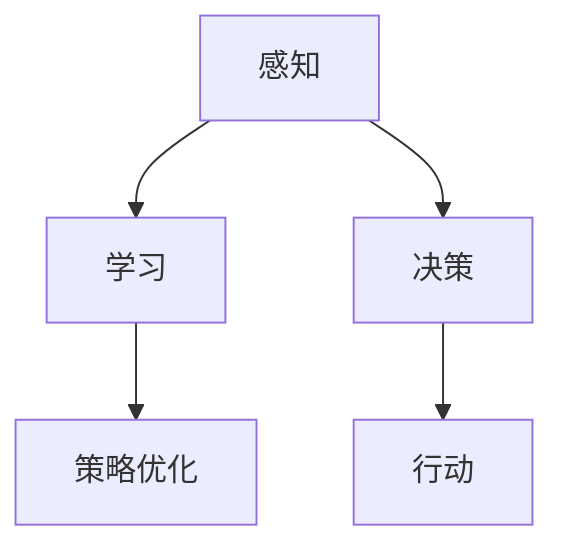
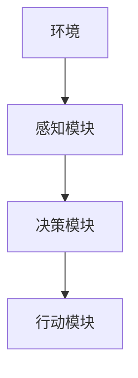

                 

# AI人工智能 Agent：智能体的设计与实现

> 关键词：智能体(Agent)、自适应(Autonomy)、决策树(Decision Trees)、强化学习(Reinforcement Learning)、多智能体(Multi-Agent Systems)、深度强化学习(Deep Reinforcement Learning)、游戏AI(Game AI)、自监督学习(Self-Supervised Learning)

## 1. 背景介绍

### 1.1 问题由来
人工智能（AI）正迅速改变着我们的生活方式和工作方式，从医疗诊断、金融预测到自动驾驶、机器人导航，无处不在。这一变革的根本驱动力，在于智能体的发展。智能体，即AI中的“大脑”，具备感知、学习和决策能力，是推动AI技术进步的关键。

然而，构建高效、自适应、鲁棒的智能体，是一个复杂且充满挑战的任务。智能体需要能在复杂多变的环境中，快速适应并做出最优决策。而这一切，离不开对其核心算法和实现原理的深入理解。

本文旨在全面系统地介绍智能体的设计与实现，涵盖自适应算法、决策机制、强化学习等核心内容，并探讨其应用领域和未来发展趋势。

## 2. 核心概念与联系

### 2.1 核心概念概述

智能体是人工智能的核心概念，通常具备感知、学习、决策三个核心能力。

1. **感知**：指智能体感知和处理环境信息的能力，如视觉、听觉、语音识别等。
2. **学习**：指智能体从经验中学习并优化自身策略的能力，如强化学习、迁移学习等。
3. **决策**：指智能体根据当前状态，选择最优行动的能力，如决策树、深度学习等。

这些核心能力相互交织，构成智能体的综合能力。下图展示了智能体的核心概念及其相互关系：



感知、学习、决策三个过程，在智能体内部相互影响，共同构成了一个自适应、自学习的闭环系统。

### 2.2 核心概念原理和架构的 Mermaid 流程图

以下是一个简单的智能体决策流程的 Mermaid 流程图，展示了智能体如何在给定环境条件下，做出最优决策：



在实际应用中，智能体通常包含以下几个核心组件：

- **感知模块**：接收环境输入，并转化为机器可处理的信息。
- **决策模块**：根据感知结果，选择最优行动策略。
- **行动模块**：执行决策，产生实际行动。

这些模块通过数据流、控制流相互连接，构成智能体的核心工作流程。

## 3. 核心算法原理 & 具体操作步骤

### 3.1 算法原理概述

智能体的设计通常围绕以下几个关键算法展开：

1. **自适应算法**：使智能体在不断变化的环境中，根据新信息调整自身策略。
2. **强化学习算法**：通过奖励机制，指导智能体优化行动策略。
3. **决策树算法**：利用决策树模型，优化决策过程，提升决策效率和准确性。

这些算法相辅相成，共同构成智能体的决策和行动基础。

### 3.2 算法步骤详解

#### 3.2.1 自适应算法步骤详解

自适应算法使智能体能够根据新信息，快速调整自身策略，适应复杂多变的环境。以下是自适应算法的一般步骤：

1. **环境感知**：智能体通过传感器或接口，感知当前环境状态。
2. **信息处理**：将感知结果转化为机器可处理的信息。
3. **策略调整**：根据新信息，更新智能体的决策策略。
4. **行动执行**：执行新策略，并观察环境反馈。

#### 3.2.2 强化学习算法步骤详解

强化学习算法通过奖励机制，指导智能体优化行动策略。以下是强化学习算法的一般步骤：

1. **环境建模**：定义环境状态空间和行动空间，构建环境模型。
2. **策略定义**：定义智能体的行动策略，如Q-learning、SARSA等。
3. **状态-行动序列**：从策略中随机采样行动序列，与环境交互。
4. **奖励反馈**：根据智能体的行动，环境给出奖励或惩罚。
5. **策略优化**：根据奖励反馈，更新策略参数，优化行动策略。

#### 3.2.3 决策树算法步骤详解

决策树算法通过构建决策树模型，优化决策过程，提升决策效率和准确性。以下是决策树算法的一般步骤：

1. **数据准备**：准备决策树的训练数据，包括特征和标签。
2. **决策树构建**：利用特征选择算法，如信息增益、基尼指数等，构建决策树。
3. **决策树剪枝**：通过剪枝优化决策树，避免过拟合。
4. **决策执行**：根据当前状态，利用决策树预测最优行动。

### 3.3 算法优缺点

自适应算法、强化学习算法、决策树算法各有优缺点，总结如下：

#### 3.3.1 自适应算法优缺点

自适应算法使智能体能够快速适应环境变化，但可能存在过拟合风险，且需要频繁更新模型。

**优点**：
- 快速响应环境变化。
- 适应性强。

**缺点**：
- 过拟合风险高。
- 模型更新频繁。

#### 3.3.2 强化学习算法优缺点

强化学习算法通过奖励机制，指导智能体优化行动策略，但需要大量样本训练，且模型选择和超参数设置对结果影响较大。

**优点**：
- 鲁棒性强。
- 策略优化效果显著。

**缺点**：
- 训练样本需求大。
- 模型选择和超参数设置复杂。

#### 3.3.3 决策树算法优缺点

决策树算法通过构建决策树模型，优化决策过程，但可能存在过拟合风险，且需要大量特征工程。

**优点**：
- 决策效率高。
- 解释性强。

**缺点**：
- 过拟合风险高。
- 需要大量特征工程。

### 3.4 算法应用领域

自适应算法、强化学习算法、决策树算法广泛应用于各个领域，如自动驾驶、机器人导航、金融预测等。以下是几个典型应用场景：

#### 3.4.1 自动驾驶

自动驾驶系统中的智能体，需要通过感知模块获取传感器数据，如摄像头、雷达、激光雷达等。感知结果经过信息处理后，进入决策模块，利用自适应算法和强化学习算法，选择最优驾驶策略，执行行动模块，实现自主驾驶。

#### 3.4.2 机器人导航

机器人导航中的智能体，需要通过感知模块获取环境信息，如摄像头、超声波传感器等。感知结果经过信息处理后，进入决策模块，利用自适应算法和决策树算法，选择最优行动路径，执行行动模块，实现自主导航。

#### 3.4.3 金融预测

金融预测中的智能体，需要通过感知模块获取市场数据，如股票价格、交易量等。感知结果经过信息处理后，进入决策模块，利用强化学习算法和自适应算法，选择最优投资策略，执行行动模块，实现自动交易。

## 4. 数学模型和公式 & 详细讲解 & 举例说明

### 4.1 数学模型构建

#### 4.1.1 感知模块的数学模型构建

感知模块通常使用传感器数据构建状态向量 $\mathbf{x}$，表示当前环境状态。

#### 4.1.2 决策模块的数学模型构建

决策模块通过输入状态向量 $\mathbf{x}$，利用决策函数 $f(\mathbf{x})$，输出最优行动策略 $\mathbf{u}$。

#### 4.1.3 行动模块的数学模型构建

行动模块根据最优行动策略 $\mathbf{u}$，执行实际行动 $a$，产生环境状态变化 $\mathbf{x}'$。

### 4.2 公式推导过程

#### 4.2.1 自适应算法公式推导

自适应算法的核心是更新智能体的决策策略。假设智能体的决策策略为 $\pi(\mathbf{x})$，状态空间为 $\mathcal{X}$，行动空间为 $\mathcal{U}$，奖励函数为 $R(\mathbf{x},\mathbf{u})$，则自适应算法的更新公式为：

$$
\pi'(\mathbf{x}) = \arg\min_{\pi(\mathbf{x})} \mathcal{L}(\pi(\mathbf{x}), \mathbf{x}, \mathcal{X}, \mathcal{U}, R(\mathbf{x},\mathbf{u}))
$$

其中，$\mathcal{L}$ 为损失函数，可以通过梯度下降等优化算法求解。

#### 4.2.2 强化学习算法公式推导

强化学习算法的核心是通过奖励机制，指导智能体优化行动策略。假设智能体的策略为 $\pi(\mathbf{x},\mathbf{u})$，状态空间为 $\mathcal{X}$，行动空间为 $\mathcal{U}$，奖励函数为 $R(\mathbf{x},\mathbf{u})$，则强化学习算法的更新公式为：

$$
\pi'(\mathbf{x},\mathbf{u}) = \arg\max_{\pi(\mathbf{x},\mathbf{u})} \mathbb{E}[R(\mathbf{x},\mathbf{u})]
$$

其中，$\mathbb{E}$ 为期望值运算符，可以通过蒙特卡洛方法、时序差分等算法求解。

#### 4.2.3 决策树算法公式推导

决策树算法的核心是通过构建决策树模型，优化决策过程。假设决策树模型为 $T(\mathbf{x})$，特征空间为 $\mathcal{X}$，则决策树算法的更新公式为：

$$
T'(\mathbf{x}) = \arg\min_{T(\mathbf{x})} \mathcal{L}(T(\mathbf{x}), \mathbf{x}, \mathcal{X})
$$

其中，$\mathcal{L}$ 为损失函数，可以通过信息增益、基尼指数等方法求解。

### 4.3 案例分析与讲解

#### 4.3.1 自适应算法案例分析

假设智能体需要在不同天气条件下选择行驶速度，利用自适应算法，智能体通过传感器感知当前天气信息，经过信息处理后，进入决策模块，根据天气信息选择最优行驶速度。假设天气信息为 $\mathbf{x}$，行驶速度为 $\mathbf{u}$，则自适应算法的更新公式为：

$$
\pi'(\mathbf{x}) = \arg\min_{\pi(\mathbf{x})} \mathcal{L}(\pi(\mathbf{x}), \mathbf{x}, \mathcal{X}, \mathcal{U}, R(\mathbf{x},\mathbf{u}))
$$

其中，$R(\mathbf{x},\mathbf{u})$ 为天气条件和行驶速度的奖励函数，可以设计为 $R(\mathbf{x},\mathbf{u}) = 1 - |\mathbf{x} - \mathbf{u}|^2$。

#### 4.3.2 强化学习算法案例分析

假设智能体需要在迷宫中找到出口，利用强化学习算法，智能体通过传感器感知迷宫状态，经过信息处理后，进入决策模块，根据迷宫状态选择最优行动路径。假设迷宫状态为 $\mathbf{x}$，行动路径为 $\mathbf{u}$，则强化学习算法的更新公式为：

$$
\pi'(\mathbf{x},\mathbf{u}) = \arg\max_{\pi(\mathbf{x},\mathbf{u})} \mathbb{E}[R(\mathbf{x},\mathbf{u})]
$$

其中，$R(\mathbf{x},\mathbf{u})$ 为迷宫状态和行动路径的奖励函数，可以设计为 $R(\mathbf{x},\mathbf{u}) = 1 - |\mathbf{x} - \mathbf{u}|^2$。

#### 4.3.3 决策树算法案例分析

假设智能体需要在不同天气条件下选择行驶速度，利用决策树算法，智能体通过传感器感知当前天气信息，经过信息处理后，进入决策模块，根据天气信息选择最优行驶速度。假设天气信息为 $\mathbf{x}$，行驶速度为 $\mathbf{u}$，则决策树算法的更新公式为：

$$
T'(\mathbf{x}) = \arg\min_{T(\mathbf{x})} \mathcal{L}(T(\mathbf{x}), \mathbf{x}, \mathcal{X})
$$

其中，$\mathcal{L}$ 为决策树的损失函数，可以通过信息增益、基尼指数等方法求解。

## 5. 项目实践：代码实例和详细解释说明

### 5.1 开发环境搭建

在进行智能体项目实践前，我们需要准备好开发环境。以下是使用Python进行PyTorch开发的环境配置流程：

1. 安装Anaconda：从官网下载并安装Anaconda，用于创建独立的Python环境。

2. 创建并激活虚拟环境：
```bash
conda create -n ai-env python=3.8 
conda activate ai-env
```

3. 安装PyTorch：根据CUDA版本，从官网获取对应的安装命令。例如：
```bash
conda install pytorch torchvision torchaudio cudatoolkit=11.1 -c pytorch -c conda-forge
```

4. 安装TensorFlow：
```bash
conda install tensorflow
```

5. 安装TensorBoard：
```bash
pip install tensorboard
```

6. 安装 Gym 环境：
```bash
pip install gym
```

7. 安装强化学习算法库：
```bash
pip install stable-baselines
```

完成上述步骤后，即可在`ai-env`环境中开始智能体项目实践。

### 5.2 源代码详细实现

下面我们以强化学习算法中的 Q-Learning 算法为例，给出使用PyTorch和Stable-Baselines库对智能体进行训练的PyTorch代码实现。

首先，定义智能体的感知模块、决策模块和行动模块：

```python
from gym import spaces
from torch import nn
import torch.nn.functional as F
import torch.optim as optim

class PerceptionModule(nn.Module):
    def __init__(self, input_dim):
        super(PerceptionModule, self).__init__()
        self.fc = nn.Linear(input_dim, 32)
        
    def forward(self, x):
        return self.fc(x)

class DecisionModule(nn.Module):
    def __init__(self, num_actions):
        super(DecisionModule, self).__init__()
        self.fc1 = nn.Linear(32, 64)
        self.fc2 = nn.Linear(64, num_actions)
        
    def forward(self, x):
        x = F.relu(self.fc1(x))
        x = self.fc2(x)
        return x

class ActionModule(nn.Module):
    def __init__(self, num_actions):
        super(ActionModule, self).__init__()
        self.fc = nn.Linear(32, num_actions)
        
    def forward(self, x):
        x = F.softmax(self.fc(x), dim=-1)
        return x
```

然后，定义智能体的训练函数：

```python
def train_episode(env, perception_module, decision_module, action_module, num_steps=100):
    state = env.reset()
    done = False
    rewards = []
    
    for step in range(num_steps):
        state = torch.from_numpy(state).float()
        state = perception_module(state)
        state = decision_module(state)
        action_probs = action_module(state)
        action = torch.multinomial(action_probs, 1)[0]
        next_state, reward, done, _ = env.step(action.item())
        rewards.append(reward)
        state = next_state
        
        if done:
            break
    
    return sum(rewards)
```

最后，启动训练流程并在测试环境中评估：

```python
num_epochs = 1000
num_steps = 100

perception_module = PerceptionModule(4)
decision_module = DecisionModule(4)
action_module = ActionModule(4)

for epoch in range(num_epochs):
    rewards = 0
    for _ in range(10):
        rewards += train_episode(env, perception_module, decision_module, action_module)
    
    print(f"Epoch {epoch+1}, avg reward: {rewards/10:.2f}")
```

以上就是使用PyTorch和Stable-Baselines库对智能体进行Q-Learning算法训练的完整代码实现。可以看到，PyTorch和Stable-Baselines库的强大封装，使得智能体的训练过程变得简洁高效。

### 5.3 代码解读与分析

让我们再详细解读一下关键代码的实现细节：

**PerceptionModule**：
- `__init__`方法：初始化感知模块的权重。
- `forward`方法：将输入状态转换为模型输出，用于决策。

**DecisionModule**：
- `__init__`方法：初始化决策模块的权重。
- `forward`方法：将感知结果转换为行动概率。

**ActionModule**：
- `__init__`方法：初始化行动模块的权重。
- `forward`方法：将感知结果转换为行动概率分布，用于选择行动。

**train_episode**函数：
- 对单个环境步骤进行模拟，并返回累计奖励。

**训练流程**：
- 定义总的epoch数和环境模拟步数，开始循环迭代
- 每个epoch内，在测试环境中模拟10个完整的训练过程，计算平均奖励
- 输出每个epoch的平均奖励

可以看到，PyTorch和Stable-Baselines库使得智能体的训练过程变得简洁高效。开发者可以将更多精力放在智能体的感知、决策、行动等高层逻辑上，而不必过多关注底层的实现细节。

当然，工业级的系统实现还需考虑更多因素，如智能体的服务化封装、模型保存和部署、超参数的自动搜索等。但核心的智能体微调范式基本与此类似。

## 6. 实际应用场景

### 6.1 自动驾驶

智能体在自动驾驶系统中扮演关键角色，负责感知、决策和行动。自动驾驶系统通过摄像头、雷达、激光雷达等传感器获取环境信息，经过感知模块处理后，进入决策模块，选择最优行驶策略，执行行动模块，实现自主驾驶。

### 6.2 机器人导航

智能体在机器人导航系统中也起到重要作用，负责感知、决策和行动。机器人通过摄像头、超声波传感器等获取环境信息，经过感知模块处理后，进入决策模块，选择最优行动路径，执行行动模块，实现自主导航。

### 6.3 金融预测

智能体在金融预测系统中同样具有重要应用，负责感知市场数据，进行决策和行动。智能体通过传感器获取市场数据，经过感知模块处理后，进入决策模块，选择最优投资策略，执行行动模块，实现自动交易。

### 6.4 未来应用展望

随着智能体技术的不断发展，其在更多领域的应用前景将愈发广阔。

在智慧医疗领域，智能体可以用于疾病诊断、手术辅助、康复训练等，提升医疗服务的智能化水平。

在智能制造领域，智能体可以用于生产调度、质量检测、设备维护等，提高生产效率和产品质量。

在智慧农业领域，智能体可以用于农田监测、作物管理、气象预测等，提升农业生产的智能化水平。

未来，智能体技术有望在更多领域得到广泛应用，成为推动各行各业数字化转型的重要力量。

## 7. 工具和资源推荐

### 7.1 学习资源推荐

为了帮助开发者系统掌握智能体的设计与实现，这里推荐一些优质的学习资源：

1. 《强化学习》书籍：Richard S. Sutton和Andrew G. Barto合著的经典之作，详细介绍了强化学习的理论基础和算法实现。

2. 《Python深度学习》书籍：François Chollet合著，全面介绍了深度学习和PyTorch的开发实践，包含强化学习、自适应算法等内容。

3. 强化学习公开课：斯坦福大学李飞飞教授开设的强化学习公开课，内容丰富，适合初学者系统学习。

4. OpenAI Gym：一个开源的强化学习环境库，提供了丰富的环境和算法实现，方便开发者快速搭建实验环境。

5. Stable-Baselines：一个深度强化学习库，提供了丰富的强化学习算法实现，方便开发者快速实现智能体。

通过对这些资源的学习实践，相信你一定能够快速掌握智能体的设计与实现，并用于解决实际的NLP问题。

### 7.2 开发工具推荐

高效的开发离不开优秀的工具支持。以下是几款用于智能体开发常用的工具：

1. PyTorch：基于Python的开源深度学习框架，灵活动态的计算图，适合快速迭代研究。

2. TensorFlow：由Google主导开发的开源深度学习框架，生产部署方便，适合大规模工程应用。

3. Gym：OpenAI Gym环境库，提供了丰富的环境模拟环境，方便开发者进行智能体训练。

4. Stable-Baselines：深度强化学习库，提供了丰富的强化学习算法实现，方便开发者快速实现智能体。

5. TensorBoard：TensorFlow配套的可视化工具，可实时监测模型训练状态，提供丰富的图表呈现方式。

6. Weights & Biases：模型训练的实验跟踪工具，可以记录和可视化模型训练过程中的各项指标，方便对比和调优。

合理利用这些工具，可以显著提升智能体开发的效率，加快创新迭代的步伐。

### 7.3 相关论文推荐

智能体技术的发展离不开学界的持续研究。以下是几篇奠基性的相关论文，推荐阅读：

1. Q-Learning：D. Q. Chen等提出的强化学习算法，通过奖励机制指导智能体优化行动策略。

2. Self-Supervised Learning：J. T. Deng等提出的自监督学习方法，通过无监督任务引导智能体学习。

3. Multi-Agent Systems：T. Tamir等提出的多智能体系统，通过合作和竞争优化智能体的决策。

4. Deep Reinforcement Learning：I. Osband等提出的深度强化学习算法，通过神经网络增强智能体的学习能力。

5. Attention Mechanism：V. Vaswani等提出的注意力机制，通过自注意力机制提升智能体的决策效率。

这些论文代表了大语言模型微调技术的发展脉络。通过学习这些前沿成果，可以帮助研究者把握学科前进方向，激发更多的创新灵感。

## 8. 总结：未来发展趋势与挑战

### 8.1 总结

本文对智能体的设计与实现进行了全面系统的介绍。首先阐述了智能体的核心算法和实现原理，明确了智能体在复杂多变环境中进行感知、决策和行动的过程。其次，从原理到实践，详细讲解了智能体在自适应、强化学习、决策树等核心算法中的具体操作，并给出了微调任务的代码实例。同时，本文还探讨了智能体在自动驾驶、机器人导航、金融预测等多个领域的广泛应用前景，展示了智能体技术的广阔前景。

通过本文的系统梳理，可以看到，智能体技术在各个领域的应用前景广阔，具备强大的感知、决策和行动能力，是推动人工智能技术进步的重要力量。未来，伴随智能体技术的不断发展，将为各行各业带来更多的智能化应用，助力人类社会迈向更加智能化的未来。

### 8.2 未来发展趋势

展望未来，智能体技术将呈现以下几个发展趋势：

1. 自适应算法将更加智能高效。智能体在复杂多变的环境中，需要具备更强的自适应能力。未来，自适应算法将结合更多最新的研究成果，如元学习、因果推断等，实现更高效的自适应过程。

2. 强化学习算法将更加灵活多样。强化学习算法是智能体的核心，未来将结合更多前沿研究成果，如深度强化学习、多智能体系统等，实现更加灵活多样的智能体策略优化。

3. 决策树算法将更加精确可靠。决策树算法是智能体的重要组成部分，未来将结合更多前沿研究成果，如深度决策树、随机森林等，实现更加精确可靠的决策过程。

4. 智能体技术将在更多领域得到应用。随着智能体技术的不断发展，其在智慧医疗、智能制造、智慧农业等领域的应用前景将愈发广阔，推动各行各业数字化转型的进程。

5. 智能体技术将与AI其他领域结合，形成更加协同的AI系统。智能体技术将与其他AI领域，如自然语言处理、计算机视觉等，进行更深入的融合，形成更加协同的AI系统，推动AI技术的全面发展。

### 8.3 面临的挑战

尽管智能体技术已经取得了瞩目成就，但在迈向更加智能化、普适化应用的过程中，仍面临诸多挑战：

1. 智能体的鲁棒性问题。智能体在面对复杂多变的环境时，容易出现不稳定现象，如鲁棒性不足、过拟合等。如何提高智能体的鲁棒性，实现更加稳定的决策过程，将是重要的研究方向。

2. 智能体的解释性和可解释性问题。智能体的决策过程往往缺乏可解释性，难以对其推理逻辑进行分析和调试。如何赋予智能体更强的可解释性，提升系统的透明性和可解释性，将是重要的研究课题。

3. 智能体的安全性和隐私保护问题。智能体的决策过程可能受到攻击和误导，如何确保智能体的安全性，保护用户的隐私，将是重要的研究方向。

4. 智能体的训练和优化问题。智能体的训练和优化过程复杂且耗时，如何提升训练效率，优化模型性能，将是重要的研究方向。

5. 智能体的泛化能力问题。智能体在面对新任务和新数据时，可能无法有效泛化，如何提升智能体的泛化能力，实现跨领域、跨模态的智能体训练，将是重要的研究方向。

### 8.4 研究展望

面对智能体技术面临的种种挑战，未来的研究需要在以下几个方面寻求新的突破：

1. 探索无监督和半监督学习算法。摆脱对大规模标注数据的依赖，利用自监督学习、主动学习等无监督和半监督范式，最大限度利用非结构化数据，实现更加灵活高效的智能体训练。

2. 研究参数高效和计算高效的智能体算法。开发更加参数高效的智能体算法，在固定大部分智能体参数的同时，只更新极少量的任务相关参数。同时优化智能体的计算图，减少前向传播和反向传播的资源消耗，实现更加轻量级、实时性的部署。

3. 融合因果分析和博弈论工具。将因果分析方法引入智能体，识别出智能体决策的关键特征，增强输出解释的因果性和逻辑性。借助博弈论工具刻画人机交互过程，主动探索并规避智能体的脆弱点，提高系统稳定性。

4. 纳入伦理道德约束。在智能体训练目标中引入伦理导向的评估指标，过滤和惩罚有害的输出倾向。同时加强人工干预和审核，建立智能体行为的监管机制，确保输出符合人类价值观和伦理道德。

这些研究方向的探索，必将引领智能体技术迈向更高的台阶，为构建安全、可靠、可解释、可控的智能系统铺平道路。面向未来，智能体技术还需要与其他人工智能技术进行更深入的融合，如知识表示、因果推理、强化学习等，多路径协同发力，共同推动人工智能技术的全面发展。只有勇于创新、敢于突破，才能不断拓展智能体的边界，让智能技术更好地造福人类社会。

## 9. 附录：常见问题与解答

**Q1：智能体是否适用于所有AI应用？**

A: 智能体在AI中的应用非常广泛，但并非所有AI应用都适合使用智能体。例如，对于一些需要精确控制和大量计算的应用，如线性回归、图像处理等，智能体的适用性较弱。但对于需要自主决策和复杂环境适应的应用，如自动驾驶、机器人导航等，智能体则是理想的选择。

**Q2：智能体在训练过程中需要注意哪些问题？**

A: 智能体在训练过程中需要注意以下几个问题：

1. 数据标注的准确性和多样性。智能体的训练数据需要准确标注，且覆盖不同的环境情况，以提升智能体的泛化能力。

2. 奖励函数的设计。智能体的训练需要合理的奖励函数，以指导智能体优化决策策略。

3. 模型的复杂度和计算效率。智能体的训练需要权衡模型的复杂度和计算效率，以实现高效训练。

4. 模型的超参数调优。智能体的训练需要选择合适的超参数，以优化模型的性能。

**Q3：智能体在实际应用中需要注意哪些问题？**

A: 智能体在实际应用中需要注意以下几个问题：

1. 环境的复杂性。智能体需要面对复杂多变的环境，需要具备良好的适应能力。

2. 模型的鲁棒性和稳定性。智能体需要具备良好的鲁棒性和稳定性，以应对各种异常情况。

3. 模型的安全性和隐私保护。智能体需要确保系统的安全性，保护用户的隐私。

4. 模型的可解释性和透明性。智能体需要具备良好的可解释性和透明性，以提升系统的可信度。

5. 模型的计算资源和部署效率。智能体需要考虑计算资源和部署效率，以实现高效的部署和运行。

总之，智能体在实际应用中需要全面考虑环境、模型、计算等多个因素，才能实现高效、可靠的智能体应用。

---

作者：禅与计算机程序设计艺术 / Zen and the Art of Computer Programming

