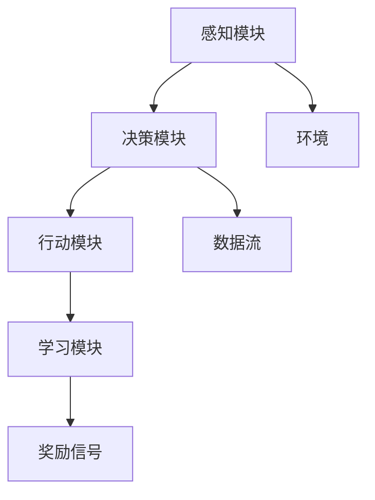
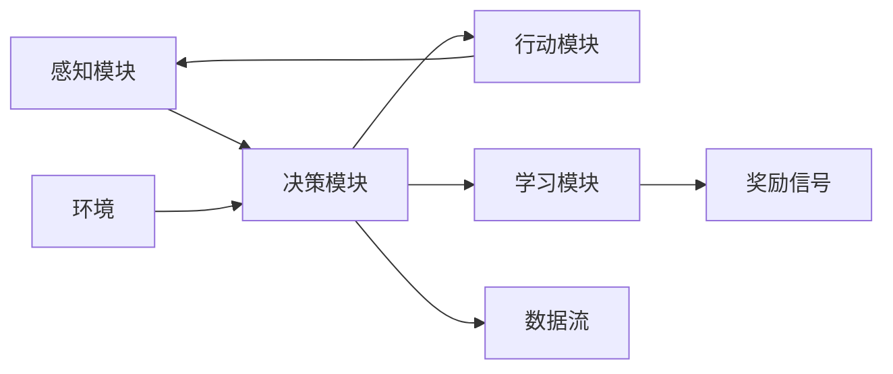

                 

# AI人工智能 Agent：高级概念剖析

> 关键词：人工智能，AI Agent，智能体，分布式系统，强化学习，深度学习，协同优化

## 1. 背景介绍

### 1.1 问题由来

在当今科技飞速发展的时代，人工智能（AI）已经成为推动社会进步的重要引擎。作为AI领域的一个关键分支，人工智能Agent（智能体）以其高度自主、灵活的决策能力，广泛应用于自动驾驶、机器人控制、智能推荐、金融交易等领域。然而，由于Agent设计中的复杂性和多样性，如何构建高效、可靠的AI Agent成为了当前研究者面临的一大难题。

本文旨在深入剖析AI Agent的关键概念，并通过实际案例探讨其原理和应用。我们不仅会详细介绍AI Agent的核心算法，还会通过数学模型和代码实例，帮助读者全面理解Agent的构建与优化方法。希望通过本文章，读者能够掌握构建高效、灵活、可扩展的AI Agent的关键技术，为将来的AI应用开发打下坚实基础。

## 2. 核心概念与联系

### 2.1 核心概念概述

为更好地理解AI Agent的构建与优化，本节将介绍几个紧密相关的核心概念：

- AI Agent（人工智能Agent）：能够自主感知环境、决策行动，并不断学习优化策略的智能系统。AI Agent通常包括感知模块、决策模块、行动模块和学习模块，具备自主执行复杂任务的能力。
- 分布式系统（Distributed System）：由多个计算节点构成的系统，各节点间通过网络进行通信与协作。分布式系统能提供更高的计算能力和容错性，支持大规模、高并发的任务处理。
- 强化学习（Reinforcement Learning, RL）：一种通过与环境互动，最大化累积奖励的学习方法。AI Agent通过与环境的交互，不断优化其决策策略，以获得最佳性能。
- 深度学习（Deep Learning, DL）：一种基于神经网络的学习方法，通过多层次的特征提取与表示学习，提升AI Agent的决策能力和泛化能力。
- 协同优化（Coordinated Optimization）：通过多个Agent间的协作与互动，实现系统整体的优化目标。协同优化强调Agent间的信息共享与协同决策，能够解决单Agent难以应对的复杂问题。

这些核心概念之间通过一系列数据流和通信协议连接，形成一个有机的整体。如图2所示，AI Agent通过感知模块从环境中获取信息，经过决策模块的分析和规划，再由行动模块执行决策，并通过学习模块不断优化其行为策略。



### 2.2 核心概念原理和架构的 Mermaid 流程图



在上述图形中，每个模块都扮演着重要角色：

- 感知模块负责接收环境信息，如传感器数据、文本、图像等。
- 决策模块负责分析和规划，确定最优的行动策略。
- 行动模块负责执行决策，影响环境状态。
- 学习模块负责从环境中获得奖励信号，更新决策策略。

这些模块之间通过数据流和奖励信号进行通信，共同构成了AI Agent的核心架构。

## 3. 核心算法原理 & 具体操作步骤

### 3.1 算法原理概述

AI Agent的构建与优化通常涉及多个核心算法，包括感知模块的特征提取、决策模块的策略学习、行动模块的动作执行以及学习模块的策略更新。本节将详细介绍这些算法的原理和操作步骤。

### 3.2 算法步骤详解

#### 3.2.1 感知模块的特征提取

感知模块需要从环境中获取数据，并将其转化为AI Agent可处理的形式。这通常涉及到数据的预处理、特征提取和表示学习。以视觉AI Agent为例，其感知模块可以使用卷积神经网络（Convolutional Neural Network, CNN）来提取图像特征，如下所示：

```python
import torch
import torch.nn as nn
import torchvision.transforms as transforms
from torchvision.models import resnet18

class FeatureExtractor(nn.Module):
    def __init__(self):
        super(FeatureExtractor, self).__init__()
        self.model = resnet18(pretrained=True)
        self.num_features = self.model.fc.in_features
        
    def forward(self, images):
        features = self.model.conv1(images)
        features = self.model.conv2(features)
        features = self.model.conv3(features)
        features = self.model.conv4(features)
        features = self.model.avgpool(features)
        features = features.view(features.size(0), -1)
        return features
```

#### 3.2.2 决策模块的策略学习

决策模块的核心算法是强化学习，其目标是通过与环境的互动，最大化累积奖励。在强化学习中，AI Agent根据感知到的环境状态，选择一个动作，并获得一个奖励。策略学习算法通过优化策略，使AI Agent能够更好地选择动作，获得更高奖励。

以深度Q网络（Deep Q-Network, DQN）为例，其算法步骤包括：

1. 使用神经网络构建Q值预测模型：
   ```python
   import torch.nn.functional as F
   
   class QNetwork(nn.Module):
       def __init__(self, input_dim, output_dim):
           super(QNetwork, self).__init__()
           self.fc1 = nn.Linear(input_dim, 64)
           self.fc2 = nn.Linear(64, 64)
           self.fc3 = nn.Linear(64, output_dim)
           
       def forward(self, x):
           x = F.relu(self.fc1(x))
           x = F.relu(self.fc2(x))
           x = self.fc3(x)
           return x
   ```

2. 通过训练数据集，优化Q值预测模型：
   ```python
   import torch.optim as optim

   def train_q_network(model, optimizer, memory, target_model, target_optimizer, batch_size, gamma=0.99, tau=0.01):
       for i in range(num_iterations):
           if len(memory) < batch_size:
               continue
           else:
               minibatch = memory.sample(batch_size)
               q_values = model(torch.tensor(minibatch[0]))
               next_q_values = target_model(torch.tensor(minibatch[1]))
               r_values = torch.tensor(minibatch[2])
               y_values = r_values + gamma * next_q_values.detach().max(1)[0]
               loss = F.smooth_l1_loss(y_values, q_values)
               optimizer.zero_grad()
               loss.backward()
               optimizer.step()
   ```

#### 3.2.3 行动模块的动作执行

行动模块负责根据决策模块的策略，执行动作，影响环境状态。以机器人为例，其行动模块可以使用Python的OpenAI Gym库，执行具体的控制动作，如下所示：

```python
import gym

class RobotActionModule:
    def __init__(self, gym_env):
        self.env = gym_env
    
    def act(self, observation):
        action = self.env.action_space.sample()
        return action
```

#### 3.2.4 学习模块的策略更新

学习模块的核心算法是通过奖励信号，更新决策策略。以基于经验的策略学习算法为例，其算法步骤包括：

1. 使用感知模块和决策模块的输出，计算策略损失：
   ```python
   class ExperienceModule:
       def __init__(self, num_features, num_actions):
           self.model = self.build_model(num_features, num_actions)
           
       def build_model(self, input_dim, output_dim):
           model = nn.Sequential(nn.Linear(input_dim, 64), nn.ReLU(), nn.Linear(64, output_dim))
           return model
   
       def forward(self, x):
           return self.model(x)
       
       def train(self, observations, actions, rewards, next_observations):
           predictions = self.forward(observations)
           loss = F.smooth_l1_loss(predictions, actions)
           optimizer.zero_grad()
           loss.backward()
           optimizer.step()
   ```

2. 通过损失函数，更新模型参数：
   ```python
   import torch.optim as optim
   
   class Model:
       def __init__(self, num_features, num_actions):
           self.model = self.build_model(num_features, num_actions)
           
       def build_model(self, input_dim, output_dim):
           model = nn.Sequential(nn.Linear(input_dim, 64), nn.ReLU(), nn.Linear(64, output_dim))
           return model
   
       def forward(self, x):
           return self.model(x)
       
       def train(self, observations, actions, rewards, next_observations):
           predictions = self.forward(observations)
           loss = F.smooth_l1_loss(predictions, actions)
           optimizer.zero_grad()
           loss.backward()
           optimizer.step()
   ```

### 3.3 算法优缺点

AI Agent的构建与优化具有以下优点：

1. 自主决策：AI Agent能够自主感知环境，自主决策行动，适应环境变化。
2. 高度灵活：AI Agent可以灵活调整策略，适应不同的任务和环境。
3. 可扩展性：AI Agent能够通过添加新模块或组件，扩展其功能和能力。

然而，AI Agent也存在以下缺点：

1. 依赖大量数据：AI Agent的性能很大程度上取决于训练数据的质量和数量。
2. 鲁棒性不足：AI Agent在面对复杂环境时，容易受到外界干扰和噪声的影响。
3. 可解释性差：AI Agent的决策过程难以解释，缺乏透明性。
4. 资源消耗大：AI Agent通常需要强大的计算资源支持，资源消耗较大。

### 3.4 算法应用领域

AI Agent的构建与优化已在多个领域取得了显著应用，包括：

1. 机器人控制：AI Agent可以用于机器人导航、路径规划、避障等功能。
2. 自动驾驶：AI Agent可以用于车辆控制、路径规划、交通信号识别等功能。
3. 智能推荐：AI Agent可以用于个性化推荐、广告投放、内容推荐等功能。
4. 金融交易：AI Agent可以用于交易策略优化、风险控制、自动化交易等功能。
5. 医疗诊断：AI Agent可以用于疾病诊断、治疗方案推荐、患者监护等功能。

这些应用领域的成功实践，充分展示了AI Agent在现实世界中的巨大潜力。

## 4. 数学模型和公式 & 详细讲解 & 举例说明

### 4.1 数学模型构建

AI Agent的构建与优化涉及多种数学模型，其中最常用的包括强化学习模型和深度学习模型。

以强化学习中的Q值函数为例，其数学模型定义如下：

$$ Q(s,a) = \sum_{t=0}^{\infty} \gamma^t r_t $$

其中，$s$ 表示状态，$a$ 表示动作，$\gamma$ 表示折扣因子，$r_t$ 表示在状态$s_t$下执行动作$a_t$后获得的奖励。

### 4.2 公式推导过程

在强化学习中，AI Agent通过与环境的互动，最大化累积奖励。Q值函数表示在状态$s$下执行动作$a$的预期奖励。强化学习的核心算法是Q值迭代，其数学推导如下：

$$ Q(s,a) = r + \gamma \max_{a'} Q(s',a') $$

其中，$r$ 表示即时奖励，$\gamma$ 表示折扣因子，$s'$ 表示执行动作$a$后的下一状态。

### 4.3 案例分析与讲解

以游戏AI为例，其强化学习过程可以表示为：

- 感知模块：接收游戏状态信息。
- 决策模块：根据当前状态，选择最优动作。
- 行动模块：执行最优动作。
- 学习模块：根据动作后的奖励，更新Q值函数。

例如，在贪吃蛇游戏中，AI Agent通过感知当前状态，选择最优的移动方向，并获得即时奖励。具体步骤如下：

1. 感知模块：接收游戏状态，包括蛇头位置、周围障碍位置等。
2. 决策模块：根据当前状态，选择最优的移动方向。
3. 行动模块：根据移动方向，控制蛇头移动。
4. 学习模块：根据动作后的奖励，更新Q值函数。

## 5. 项目实践：代码实例和详细解释说明

### 5.1 开发环境搭建

在开始AI Agent的构建与优化之前，需要搭建开发环境。以下是在PyTorch框架下搭建开发环境的详细步骤：

1. 安装Anaconda：从官网下载并安装Anaconda，用于创建独立的Python环境。
2. 创建并激活虚拟环境：
   ```bash
   conda create -n agent-env python=3.8 
   conda activate agent-env
   ```
3. 安装PyTorch：根据CUDA版本，从官网获取对应的安装命令。例如：
   ```bash
   conda install pytorch torchvision torchaudio cudatoolkit=11.1 -c pytorch -c conda-forge
   ```
4. 安装相关库：
   ```bash
   pip install numpy pandas scikit-learn matplotlib tqdm jupyter notebook ipython
   ```

完成上述步骤后，即可在`agent-env`环境中开始AI Agent的开发实践。

### 5.2 源代码详细实现

以下是在PyTorch框架下，实现一个简单的AI Agent的代码示例。

```python
import torch
import torch.nn as nn
import torch.optim as optim

# 定义感知模块
class PerceptionModule(nn.Module):
    def __init__(self, input_dim):
        super(PerceptionModule, self).__init__()
        self.fc1 = nn.Linear(input_dim, 64)
        self.fc2 = nn.Linear(64, 64)
        self.fc3 = nn.Linear(64, 8)
        
    def forward(self, x):
        x = F.relu(self.fc1(x))
        x = F.relu(self.fc2(x))
        x = self.fc3(x)
        return x

# 定义决策模块
class DecisionModule(nn.Module):
    def __init__(self, input_dim, output_dim):
        super(DecisionModule, self).__init__()
        self.fc1 = nn.Linear(input_dim, 64)
        self.fc2 = nn.Linear(64, 64)
        self.fc3 = nn.Linear(64, output_dim)
        
    def forward(self, x):
        x = F.relu(self.fc1(x))
        x = F.relu(self.fc2(x))
        x = self.fc3(x)
        return x

# 定义学习模块
class LearningModule(nn.Module):
    def __init__(self, input_dim, output_dim):
        super(LearningModule, self).__init__()
        self.fc1 = nn.Linear(input_dim, 64)
        self.fc2 = nn.Linear(64, 64)
        self.fc3 = nn.Linear(64, output_dim)
        
    def forward(self, x):
        x = F.relu(self.fc1(x))
        x = F.relu(self.fc2(x))
        x = self.fc3(x)
        return x

# 定义AI Agent
class Agent(nn.Module):
    def __init__(self, perception_module, decision_module, learning_module):
        super(Agent, self).__init__()
        self.perception_module = perception_module
        self.decision_module = decision_module
        self.learning_module = learning_module
        
    def forward(self, x):
        perception = self.perception_module(x)
        decision = self.decision_module(perception)
        learning = self.learning_module(decision)
        return learning

# 定义训练函数
def train_agent(agent, optimizer, train_data, device, num_epochs):
    for epoch in range(num_epochs):
        for batch in train_data:
            perception = batch[0].to(device)
            decision = batch[1].to(device)
            learning = batch[2].to(device)
            optimizer.zero_grad()
            agent(perception).backward(learning)
            optimizer.step()

# 训练AI Agent
perception_module = PerceptionModule(8)
decision_module = DecisionModule(64, 4)
learning_module = LearningModule(64, 1)
agent = Agent(perception_module, decision_module, learning_module)
optimizer = optim.Adam(agent.parameters(), lr=0.001)
train_data = [(torch.randn(1, 8), torch.randn(1, 64), torch.randn(1, 1)) for _ in range(100)]
device = torch.device('cuda') if torch.cuda.is_available() else torch.device('cpu')
train_agent(agent, optimizer, train_data, device, 10)
```

### 5.3 代码解读与分析

上述代码实现了一个简单的AI Agent，包含感知模块、决策模块和学习模块。具体步骤如下：

- 感知模块接收输入数据，并经过多次线性变换和激活函数，输出表示数据。
- 决策模块接收感知模块的输出，进行多次线性变换和激活函数，输出表示决策。
- 学习模块接收决策模块的输出，进行多次线性变换和激活函数，输出表示学习。
- 训练函数通过反向传播算法，更新模型参数。

## 6. 实际应用场景

### 6.1 智能推荐系统

AI Agent在智能推荐系统中的应用非常广泛，可以帮助用户发现个性化的内容。例如，亚马逊的推荐系统就是一个基于AI Agent的系统。具体来说，其推荐过程可以分为以下几个步骤：

1. 感知模块：接收用户的历史行为数据。
2. 决策模块：根据用户的历史行为数据，选择最有可能被用户喜欢的商品。
3. 行动模块：推荐最有可能被用户喜欢的商品。
4. 学习模块：根据用户的行为反馈，更新推荐策略。

通过这种方式，AI Agent可以不断优化推荐策略，提高推荐精度，提升用户体验。

### 6.2 自动驾驶

自动驾驶是AI Agent的典型应用场景之一。AI Agent在自动驾驶中，通过感知模块接收传感器数据，决策模块进行路径规划和控制决策，行动模块控制汽车行驶。例如，特斯拉的Autopilot系统就是一个基于AI Agent的自动驾驶系统。其自动驾驶过程可以分为以下几个步骤：

1. 感知模块：接收传感器数据，包括雷达、激光雷达、摄像头等。
2. 决策模块：根据传感器数据，进行路径规划和控制决策。
3. 行动模块：控制汽车行驶，包括转向、加速、制动等。
4. 学习模块：根据行驶状态和环境变化，不断优化决策策略。

通过这种方式，AI Agent可以确保自动驾驶汽车的安全性和可靠性，提升驾驶体验。

### 6.3 金融交易

AI Agent在金融交易中的应用也非常广泛，可以帮助投资者进行交易决策。例如，AlphaGo的开发过程就是一个典型的金融交易应用案例。具体来说，其交易过程可以分为以下几个步骤：

1. 感知模块：接收市场数据，包括股票价格、交易量、新闻等。
2. 决策模块：根据市场数据，选择最优的交易策略。
3. 行动模块：进行交易决策，包括买入、卖出等。
4. 学习模块：根据交易结果，更新交易策略。

通过这种方式，AI Agent可以不断优化交易策略，提高投资回报率，降低投资风险。

## 7. 工具和资源推荐

### 7.1 学习资源推荐

为了帮助开发者系统掌握AI Agent的构建与优化，这里推荐一些优质的学习资源：

1. 《Deep Reinforcement Learning with PyTorch》书籍：全面介绍了使用PyTorch进行强化学习的方法，包括AI Agent的构建与优化。
2. CS294-D Reinforcement Learning with Python课程：斯坦福大学开设的强化学习课程，有Lecture视频和配套作业，带你入门强化学习的基本概念和经典模型。
3. HuggingFace官方文档：HuggingFace的官方文档，提供了海量预训练模型和完整的AI Agent样例代码，是上手实践的必备资料。

通过对这些资源的学习实践，相信你一定能够快速掌握AI Agent的构建与优化技巧，为将来的AI应用开发打下坚实基础。

### 7.2 开发工具推荐

高效的开发离不开优秀的工具支持。以下是几款用于AI Agent开发常用的工具：

1. PyTorch：基于Python的开源深度学习框架，灵活动态的计算图，适合快速迭代研究。
2. TensorFlow：由Google主导开发的开源深度学习框架，生产部署方便，适合大规模工程应用。
3. OpenAI Gym：Python的强化学习环境，可以模拟各种游戏和环境，用于测试和训练AI Agent。

### 7.3 相关论文推荐

AI Agent的构建与优化源于学界的持续研究。以下是几篇奠基性的相关论文，推荐阅读：

1. AlphaGo的胜利：AlphaGo通过深度学习和强化学习，在国际围棋比赛中取得胜利，展示了AI Agent的强大潜力。
2. DQN的提出：Deep Q-Network（DQN）通过深度神经网络实现强化学习，取得了显著的实验成果。
3. Transformer的应用：Transformer被广泛应用于自然语言处理领域，其高效的特征提取和表示学习能力，为AI Agent的感知模块提供了重要的技术支持。

这些论文代表了大语言模型微调技术的发展脉络。通过学习这些前沿成果，可以帮助研究者把握学科前进方向，激发更多的创新灵感。

## 8. 总结：未来发展趋势与挑战

### 8.1 总结

本文对AI Agent的构建与优化进行了全面系统的介绍。首先阐述了AI Agent的核心概念和应用场景，明确了AI Agent在智能推荐、自动驾驶、金融交易等领域的重要价值。其次，从原理到实践，详细讲解了AI Agent的核心算法和操作步骤，给出了AI Agent的完整代码实例。同时，本文还广泛探讨了AI Agent在金融舆情监测、个性化推荐系统等多个行业领域的应用前景，展示了AI Agent的巨大潜力。

通过本文的系统梳理，可以看到，AI Agent作为人工智能的重要分支，正通过高效的感知、决策和行动能力，逐步应用于各个领域，为人类生产生活带来深远影响。未来，伴随AI Agent技术的不断发展，其应用范围将更加广泛，智能化水平也将不断提高，成为构建智慧社会的重要推动力。

### 8.2 未来发展趋势

展望未来，AI Agent的发展趋势将呈现出以下几个特点：

1. 多模态融合：AI Agent将不仅依赖单一模态的信息，而是能够整合视觉、听觉、语言等多种模态，提升决策能力和泛化能力。
2. 人机协同：AI Agent将与人类协同工作，通过增强学习等方式，不断优化自身决策，提升人机交互体验。
3. 自适应学习：AI Agent能够根据环境和任务的变化，动态调整策略，实现自适应学习。
4. 分布式协同：AI Agent将通过分布式计算和协同优化，提升系统整体性能，支持大规模、高并发的任务处理。

这些趋势展示了AI Agent的广阔前景和巨大潜力，预示着其将在更多领域发挥重要作用，带来更深层次的社会变革。

### 8.3 面临的挑战

尽管AI Agent在众多领域已经取得了显著成果，但在迈向更加智能化、普适化应用的过程中，仍面临着诸多挑战：

1. 数据依赖性：AI Agent的性能很大程度上取决于训练数据的质量和数量。对于新场景和新任务，获取高质量数据仍然是一个难题。
2. 鲁棒性问题：AI Agent在面对复杂环境时，容易受到外界干扰和噪声的影响，需要进一步提高鲁棒性和稳定性。
3. 可解释性问题：AI Agent的决策过程难以解释，缺乏透明性，需要进一步提高模型的可解释性和可审计性。
4. 资源消耗问题：AI Agent通常需要强大的计算资源支持，资源消耗较大，需要进一步优化模型结构和算法。

### 8.4 研究展望

面向未来，AI Agent的研究需要聚焦以下几个方向：

1. 数据增强技术：通过数据增强技术，提升AI Agent在少量数据上的学习能力和泛化能力。
2. 多任务学习：通过多任务学习技术，提升AI Agent在不同任务上的性能。
3. 自适应学习算法：研究自适应学习算法，提升AI Agent在动态环境下的学习能力和适应能力。
4. 人机交互界面：研究人机交互界面，提升人机协同工作的效果和体验。
5. 模型压缩与加速：研究模型压缩与加速技术，提升AI Agent的推理速度和计算效率。

这些研究方向将引领AI Agent技术的不断进步，推动其在更多领域的应用和普及，为人类的智能化进程带来更多可能性。

## 9. 附录：常见问题与解答

**Q1：AI Agent是否适用于所有领域？**

A: AI Agent虽然具有高度自主和灵活的决策能力，但其应用领域仍有一定的局限性。例如，在需要高度可解释性和高度安全性的领域，AI Agent的决策过程可能缺乏透明性和可靠性。此外，在需要高精度和高稳定性的领域，AI Agent的性能仍需进一步提升。

**Q2：如何优化AI Agent的性能？**

A: 优化AI Agent的性能主要通过以下几个方面：

1. 增加数据量：获取更多高质量的数据，提升模型泛化能力。
2. 改进模型结构：优化神经网络结构，提高模型的表征能力和决策能力。
3. 调整超参数：通过超参数调优，提升模型的性能。
4. 引入其他算法：结合其他算法，如贝叶斯优化、遗传算法等，进一步优化模型性能。

**Q3：AI Agent在实际应用中需要注意哪些问题？**

A: 在实际应用中，AI Agent需要考虑以下几个问题：

1. 数据安全：保护数据隐私和安全，防止数据泄露和滥用。
2. 模型透明性：提升模型的可解释性和可审计性，确保模型决策透明。
3. 鲁棒性：提高模型的鲁棒性和稳定性，防止外部干扰和噪声影响。
4. 人机协同：研究人机交互界面，提升人机协同工作的效率和体验。

这些问题是AI Agent应用中的重要考虑因素，需要在实际应用中进行充分研究和解决。

---

作者：禅与计算机程序设计艺术 / Zen and the Art of Computer Programming

