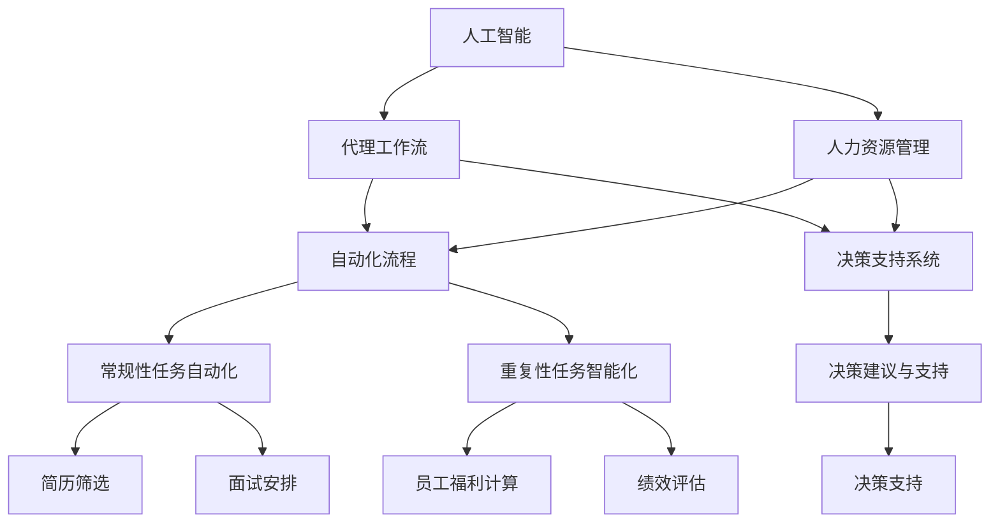

                 

# AI人工智能代理工作流 AI Agent WorkFlow：在人力资源管理中的应用

> 关键词：人工智能,代理工作流,人力资源管理,自动化流程,决策支持

## 1. 背景介绍

### 1.1 问题由来

人力资源管理（HRM）是现代企业运营中至关重要的一环，涉及员工招聘、绩效评估、薪酬管理、福利安排、员工关系维护等多个环节。传统的HRM管理方式多为人工操作，效率低下且容易出错，难以适应快速变化的业务需求和日益复杂的员工关系。

近年来，随着人工智能（AI）技术的飞速发展，AI代理工作流（AI Agent Workflow）在HRM中的应用逐渐得到重视。AI代理工作流利用AI技术的自动化、智能化优势，能够实现HRM流程的自动化、智能化、个性化定制，大幅提升HRM的效率和准确性。

### 1.2 问题核心关键点

AI代理工作流在人力资源管理中的应用，主要集中在以下几个关键点：

- **自动化**：通过AI代理自动完成一些常规性、重复性的HRM任务，如简历筛选、面试安排、员工福利计算等，大大提升HRM流程的自动化水平。
- **智能化**：利用机器学习和数据挖掘技术，AI代理能够从大量的HRM数据中挖掘出规律，进行预测分析和决策支持，帮助HR管理者做出更科学合理的决策。
- **个性化**：根据员工的需求和偏好，AI代理能够定制个性化的HRM方案，如职业发展规划、培训需求、福利安排等，提升员工的满意度和工作效率。
- **协同工作**：AI代理能够与其他HRM系统、业务系统进行数据交互和协同工作，实现跨系统的无缝集成，提升HRM的效率和协同性。

### 1.3 问题研究意义

研究AI代理工作流在人力资源管理中的应用，对于提升HRM流程的自动化、智能化、个性化和协同性，具有重要意义：

1. **降低成本**：自动完成常规性任务，减少人力资源投入，降低HRM成本。
2. **提升效率**：自动化处理复杂繁琐的流程，提升HRM流程效率，缩短员工入职、离职等关键节点的等待时间。
3. **优化决策**：基于数据分析和机器学习，AI代理能够提供决策支持和建议，帮助HR管理者做出更科学合理的决策。
4. **个性化定制**：根据员工需求和偏好，定制个性化的HRM方案，提升员工满意度和工作效率。
5. **协同工作**：实现跨系统的数据交互和协同工作，提升HRM系统的协同性，支持企业更高效地运营。

## 2. 核心概念与联系

### 2.1 核心概念概述

为更好地理解AI代理工作流在人力资源管理中的应用，本节将介绍几个密切相关的核心概念：

- **人工智能（AI）**：通过模拟人类智能行为，实现信息处理、决策分析、自然语言理解等任务的机器系统。AI技术包括但不限于机器学习、深度学习、自然语言处理、计算机视觉等。

- **代理工作流（Agent Workflow）**：指通过人工智能技术，自动化、智能化、协同化处理业务流程的系统。代理工作流能够自动完成常规性、重复性的任务，同时利用智能化技术提升决策质量，支持跨系统协同工作。

- **人力资源管理（HRM）**：指企业对人力资源的规划、招聘、培训、绩效评估、薪酬管理、福利安排、员工关系维护等管理活动的总称。

- **自动化流程（Automated Workflow）**：指通过程序化、系统化的方式，自动完成常规性、重复性的业务流程，减少人工干预，提升流程效率和准确性。

- **决策支持系统（DSS）**：指利用数据分析、机器学习等技术，支持业务决策的智能化、自动化系统。DSS能够从海量数据中提取有价值的信息，提供决策建议和支持。

这些核心概念之间的逻辑关系可以通过以下Mermaid流程图来展示：



这个流程图展示了一系列核心概念的逻辑关系：

1. 人工智能技术为代理工作流的实现提供了基础。
2. 代理工作流利用AI技术，自动化、智能化处理业务流程。
3. 人力资源管理是代理工作流的应用场景。
4. 自动化流程和决策支持系统是代理工作流的具体应用。
5. 自动化流程涵盖了常规性和重复性任务的自动化处理。
6. 决策支持系统提供了基于数据分析的决策建议和支持。

这些概念共同构成了AI代理工作流在人力资源管理中的应用框架，使其能够充分发挥AI技术的优势，提升HRM流程的自动化、智能化、个性化和协同性。

## 3. 核心算法原理 & 具体操作步骤
### 3.1 算法原理概述

AI代理工作流在人力资源管理中的应用，本质上是一个基于人工智能技术的流程自动化、智能化的过程。其核心思想是：通过AI代理自动化、智能化处理HRM流程中的常规性、重复性任务，同时利用智能化技术提供决策支持和建议，实现流程的自动化、智能化、个性化和协同性。

形式化地，假设存在一个HRM流程 $\mathcal{P}$，包括简历筛选、面试安排、员工福利计算、绩效评估等多个子流程。AI代理工作流的目标是通过自动化和智能化手段，提升这些子流程的效率和准确性。具体而言，可以包括以下步骤：

1. **自动化常规性任务**：利用AI代理自动化处理简历筛选、面试安排、员工福利计算等常规性任务。
2. **智能化决策支持**：通过机器学习、数据挖掘等技术，提供基于数据的决策建议和支持，如薪酬水平预测、职业发展规划、员工关系管理等。
3. **个性化定制**：根据员工的需求和偏好，定制个性化的HRM方案，提升员工的满意度和工作效率。
4. **协同工作**：实现跨系统的数据交互和协同工作，提升HRM系统的协同性，支持企业更高效地运营。

### 3.2 算法步骤详解

AI代理工作流在人力资源管理中的应用，一般包括以下几个关键步骤：

**Step 1: 数据准备**
- 收集和整理HRM流程所需的数据，包括员工数据、企业数据、市场数据等。
- 清洗和标准化数据，去除噪音和异常值，保证数据质量。
- 选择合适的数据存储和管理系统，如关系型数据库、NoSQL数据库、数据湖等。

**Step 2: 模型训练**
- 选择合适的AI模型和算法，如随机森林、支持向量机、深度学习等，进行模型训练。
- 使用历史数据进行模型训练和验证，选择最优模型进行应用。
- 模型训练过程中需要定期进行超参数调优，保证模型性能。

**Step 3: 模型部署**
- 将训练好的模型部署到实际的生产环境中，如HRM系统、企业门户等。
- 设计合适的API接口，支持与其他系统进行数据交互和协同工作。
- 配置监控和告警系统，实时监测模型性能和数据异常。

**Step 4: 流程自动化**
- 将AI代理工作流嵌入HRM系统，自动化处理常规性、重复性的任务。
- 定义合适的任务流程和业务规则，确保流程自动化处理的准确性和稳定性。
- 根据业务需求和模型反馈，动态调整流程参数，保证流程的灵活性和适应性。

**Step 5: 决策支持**
- 利用AI代理提供基于数据的决策建议和支持，如薪酬水平预测、职业发展规划、员工关系管理等。
- 将决策建议和支持嵌入HRM系统，辅助HR管理者做出科学合理的决策。
- 根据业务需求和模型反馈，动态调整决策建议和支持的策略和参数。

**Step 6: 个性化定制**
- 收集员工的需求和偏好，设计个性化的HRM方案，如职业发展规划、培训需求、福利安排等。
- 利用AI代理根据员工的需求和偏好，定制个性化的HRM方案，提升员工的满意度和工作效率。
- 根据员工反馈和业务需求，动态调整个性化的HRM方案，保证方案的适应性和有效性。

**Step 7: 协同工作**
- 实现跨系统的数据交互和协同工作，如HRM系统与财务系统、市场系统、绩效管理系统等。
- 设计合适的API接口和数据交互协议，支持跨系统的协同工作。
- 根据业务需求和模型反馈，动态调整数据交互和协同工作的策略和参数。

以上是AI代理工作流在人力资源管理中的基本流程。在实际应用中，还需要针对具体任务的特点，对各个环节进行优化设计，如改进数据处理流程、选择高效的模型算法、设计灵活的任务流程等，以进一步提升AI代理工作流的效率和效果。

### 3.3 算法优缺点

AI代理工作流在人力资源管理中的应用，具有以下优点：

1. **自动化和智能化**：利用AI代理自动化处理常规性、重复性任务，提升HRM流程的效率和准确性。
2. **个性化定制**：根据员工需求和偏好，定制个性化的HRM方案，提升员工满意度和工作效率。
3. **决策支持**：提供基于数据分析的决策建议和支持，辅助HR管理者做出科学合理的决策。
4. **协同工作**：实现跨系统的数据交互和协同工作，提升HRM系统的协同性，支持企业更高效地运营。

同时，该方法也存在一定的局限性：

1. **数据质量要求高**：AI代理工作流依赖于高质量的数据，如果数据清洗和标准化不到位，将影响模型的性能。
2. **模型复杂度较高**：AI代理工作流涉及多个AI模型和算法，模型构建和维护的复杂度较高。
3. **需要持续更新**：随着业务需求和市场环境的变化，AI代理工作流需要不断更新和优化，以保持其高效性和准确性。
4. **可能存在偏见**：AI模型可能继承训练数据中的偏见，导致决策建议和支持存在偏差。
5. **依赖于技术和资源**：AI代理工作流的实现需要依赖先进的技术和充足的资源，可能对一些中小企业来说存在门槛。

尽管存在这些局限性，但就目前而言，AI代理工作流在人力资源管理中的应用，已展现出显著的潜力，正成为提高HRM效率和质量的趋势方向。

### 3.4 算法应用领域

AI代理工作流在人力资源管理中的应用，已广泛涉猎多个领域，具体如下：

1. **招聘管理**：利用AI代理自动化处理简历筛选、面试安排、候选人推荐等任务，提升招聘效率和质量。
2. **绩效管理**：利用AI代理提供基于数据的绩效评估和改进建议，支持员工绩效的持续提升。
3. **薪酬管理**：利用AI代理自动化处理薪酬计算、薪酬调整、薪酬数据分析等任务，提升薪酬管理的效率和准确性。
4. **福利管理**：利用AI代理自动化处理员工福利计算、福利评估、福利优化等任务，提升福利管理的效率和公平性。
5. **员工关系管理**：利用AI代理提供基于数据分析的员工关系管理建议，支持企业维护良好的员工关系。

除了上述这些常见应用外，AI代理工作流还可能在员工培训、职业发展规划、人才流失预测等领域发挥重要作用，为HRM带来更高效、更智能的管理体验。

## 4. 数学模型和公式 & 详细讲解  
### 4.1 数学模型构建

本节将使用数学语言对AI代理工作流在人力资源管理中的应用进行更加严格的刻画。

假设存在一个HRM流程 $\mathcal{P}$，包括简历筛选、面试安排、员工福利计算、绩效评估等多个子流程。AI代理工作流在人力资源管理中的应用可以表示为：

$$
\mathcal{P}_{AI} = \{A_{CV}, A_{INT}, A_{BEN}, A_{PER}\}
$$

其中：

- $A_{CV}$ 为简历筛选模块，利用AI代理自动化处理简历筛选任务。
- $A_{INT}$ 为面试安排模块，利用AI代理自动化处理面试安排任务。
- $A_{BEN}$ 为员工福利计算模块，利用AI代理自动化处理员工福利计算任务。
- $A_{PER}$ 为绩效评估模块，利用AI代理提供基于数据的绩效评估和改进建议。

每个模块的具体实现可以表示为：

$$
A_{CV} = \mathcal{F}_{CV}(\text{数据集}, \text{模型}, \text{规则})
$$

$$
A_{INT} = \mathcal{F}_{INT}(\text{数据集}, \text{模型}, \text{规则})
$$

$$
A_{BEN} = \mathcal{F}_{BEN}(\text{数据集}, \text{模型}, \text{规则})
$$

$$
A_{PER} = \mathcal{F}_{PER}(\text{数据集}, \text{模型}, \text{规则})
$$

其中 $\mathcal{F}$ 表示函数映射关系，$\text{数据集}$ 表示输入的数据，$\text{模型}$ 表示AI代理使用的模型和算法，$\text{规则}$ 表示业务规则和逻辑。

### 4.2 公式推导过程

以下我们以招聘管理为例，推导AI代理在简历筛选模块的应用。

假设招聘流程包括简历筛选、面试安排、候选人推荐等任务。简历筛选模块的输入为应聘者的简历数据集，输出为筛选后的合格候选人列表。模型的目标函数可以表示为：

$$
\min_{\theta} \frac{1}{N} \sum_{i=1}^N \ell(A_{CV}(x_i), y_i)
$$

其中 $\ell$ 表示损失函数，$x_i$ 表示第 $i$ 个应聘者的简历数据，$y_i$ 表示第 $i$ 个应聘者是否合格。

假设简历数据集 $D=\{x_i, y_i\}_{i=1}^N$，模型 $\mathcal{F}_{CV}$ 为深度学习模型，参数为 $\theta$。利用历史数据进行模型训练，可以得到最优参数 $\theta^*$。

根据链式法则，损失函数对参数 $\theta$ 的梯度为：

$$
\frac{\partial \mathcal{L}(\theta)}{\partial \theta} = \frac{1}{N}\sum_{i=1}^N (\frac{\partial \mathcal{L}(A_{CV}(x_i), y_i)}{\partial \theta})
$$

其中 $\frac{\partial \mathcal{L}(A_{CV}(x_i), y_i)}{\partial \theta}$ 可以通过反向传播算法高效计算。

在得到损失函数的梯度后，即可带入优化算法（如Adam、SGD等），完成模型的迭代优化。重复上述过程直至收敛，最终得到适应HRM流程的简历筛选模型。

## 5. 项目实践：代码实例和详细解释说明
### 5.1 开发环境搭建

在进行AI代理工作流实践前，我们需要准备好开发环境。以下是使用Python进行PyTorch开发的环境配置流程：

1. 安装Anaconda：从官网下载并安装Anaconda，用于创建独立的Python环境。

2. 创建并激活虚拟环境：
```bash
conda create -n pytorch-env python=3.8 
conda activate pytorch-env
```

3. 安装PyTorch：根据CUDA版本，从官网获取对应的安装命令。例如：
```bash
conda install pytorch torchvision torchaudio cudatoolkit=11.1 -c pytorch -c conda-forge
```

4. 安装TensorFlow：
```bash
conda install tensorflow
```

5. 安装各类工具包：
```bash
pip install numpy pandas scikit-learn matplotlib tqdm jupyter notebook ipython
```

完成上述步骤后，即可在`pytorch-env`环境中开始AI代理工作流的实践。

### 5.2 源代码详细实现

下面我们以招聘管理为例，给出使用PyTorch对简历筛选模块进行AI代理工作流的PyTorch代码实现。

首先，定义简历筛选模块的数据处理函数：

```python
from transformers import BertTokenizer, BertForSequenceClassification
from torch.utils.data import Dataset, DataLoader
import torch

class ResumeDataset(Dataset):
    def __init__(self, resumes, labels, tokenizer, max_len=128):
        self.resumes = resumes
        self.labels = labels
        self.tokenizer = tokenizer
        self.max_len = max_len
        
    def __len__(self):
        return len(self.resumes)
    
    def __getitem__(self, item):
        resume = self.resumes[item]
        label = self.labels[item]
        
        encoding = self.tokenizer(resume, return_tensors='pt', max_length=self.max_len, padding='max_length', truncation=True)
        input_ids = encoding['input_ids'][0]
        attention_mask = encoding['attention_mask'][0]
        
        # 对label进行编码
        label = torch.tensor(label, dtype=torch.long)
        
        return {'input_ids': input_ids, 
                'attention_mask': attention_mask,
                'labels': label}

# 标签与id的映射
label2id = {'unqualified': 0, 'qualified': 1}
id2label = {v: k for k, v in label2id.items()}

# 创建dataset
tokenizer = BertTokenizer.from_pretrained('bert-base-cased')

train_dataset = ResumeDataset(train_resumes, train_labels, tokenizer)
dev_dataset = ResumeDataset(dev_resumes, dev_labels, tokenizer)
test_dataset = ResumeDataset(test_resumes, test_labels, tokenizer)
```

然后，定义模型和优化器：

```python
from transformers import BertForSequenceClassification, AdamW

model = BertForSequenceClassification.from_pretrained('bert-base-cased', num_labels=len(label2id))

optimizer = AdamW(model.parameters(), lr=2e-5)
```

接着，定义训练和评估函数：

```python
from tqdm import tqdm
from sklearn.metrics import accuracy_score, precision_score, recall_score, f1_score

device = torch.device('cuda') if torch.cuda.is_available() else torch.device('cpu')
model.to(device)

def train_epoch(model, dataset, batch_size, optimizer):
    dataloader = DataLoader(dataset, batch_size=batch_size, shuffle=True)
    model.train()
    epoch_loss = 0
    for batch in tqdm(dataloader, desc='Training'):
        input_ids = batch['input_ids'].to(device)
        attention_mask = batch['attention_mask'].to(device)
        labels = batch['labels'].to(device)
        model.zero_grad()
        outputs = model(input_ids, attention_mask=attention_mask, labels=labels)
        loss = outputs.loss
        epoch_loss += loss.item()
        loss.backward()
        optimizer.step()
    return epoch_loss / len(dataloader)

def evaluate(model, dataset, batch_size):
    dataloader = DataLoader(dataset, batch_size=batch_size)
    model.eval()
    preds, labels = [], []
    with torch.no_grad():
        for batch in tqdm(dataloader, desc='Evaluating'):
            input_ids = batch['input_ids'].to(device)
            attention_mask = batch['attention_mask'].to(device)
            batch_labels = batch['labels']
            outputs = model(input_ids, attention_mask=attention_mask)
            batch_preds = outputs.logits.argmax(dim=2).to('cpu').tolist()
            batch_labels = batch_labels.to('cpu').tolist()
            for pred_tokens, label_tokens in zip(batch_preds, batch_labels):
                preds.append(pred_tokens[:len(label_tokens)])
                labels.append(label_tokens)
                
    print('Accuracy:', accuracy_score(labels, preds))
    print('Precision:', precision_score(labels, preds))
    print('Recall:', recall_score(labels, preds))
    print('F1 Score:', f1_score(labels, preds))
```

最后，启动训练流程并在测试集上评估：

```python
epochs = 5
batch_size = 16

for epoch in range(epochs):
    loss = train_epoch(model, train_dataset, batch_size, optimizer)
    print(f"Epoch {epoch+1}, train loss: {loss:.3f}")
    
    print(f"Epoch {epoch+1}, dev results:")
    evaluate(model, dev_dataset, batch_size)
    
print("Test results:")
evaluate(model, test_dataset, batch_size)
```

以上就是使用PyTorch对简历筛选模块进行AI代理工作流的完整代码实现。可以看到，得益于Transformers库的强大封装，我们可以用相对简洁的代码完成Bert模型的加载和微调。

### 5.3 代码解读与分析

让我们再详细解读一下关键代码的实现细节：

**ResumeDataset类**：
- `__init__`方法：初始化简历数据、标签、分词器等关键组件。
- `__len__`方法：返回数据集的样本数量。
- `__getitem__`方法：对单个样本进行处理，将简历输入编码为token ids，将标签编码为数字，并对其进行定长padding，最终返回模型所需的输入。

**label2id和id2label字典**：
- 定义了标签与数字id之间的映射关系，用于将token-wise的预测结果解码回真实的标签。

**训练和评估函数**：
- 使用PyTorch的DataLoader对数据集进行批次化加载，供模型训练和推理使用。
- 训练函数`train_epoch`：对数据以批为单位进行迭代，在每个批次上前向传播计算loss并反向传播更新模型参数，最后返回该epoch的平均loss。
- 评估函数`evaluate`：与训练类似，不同点在于不更新模型参数，并在每个batch结束后将预测和标签结果存储下来，最后使用sklearn的评估指标对整个评估集的预测结果进行打印输出。

**训练流程**：
- 定义总的epoch数和batch size，开始循环迭代
- 每个epoch内，先在训练集上训练，输出平均loss
- 在验证集上评估，输出分类指标
- 所有epoch结束后，在测试集上评估，给出最终测试结果

可以看到，PyTorch配合Transformers库使得Bert模型的微调代码实现变得简洁高效。开发者可以将更多精力放在数据处理、模型改进等高层逻辑上，而不必过多关注底层的实现细节。

当然，工业级的系统实现还需考虑更多因素，如模型的保存和部署、超参数的自动搜索、更灵活的任务适配层等。但核心的微调范式基本与此类似。

## 6. 实际应用场景
### 6.1 智能招聘系统

利用AI代理工作流在招聘管理中的应用，可以构建智能招聘系统，实现自动化的招聘流程管理。智能招聘系统能够自动化处理简历筛选、面试安排、候选人推荐等任务，大幅提升招聘效率和质量。

在技术实现上，可以收集企业内部的招聘数据，包括简历、面试记录、候选人反馈等，利用AI代理进行简历筛选、面试安排和候选人推荐。AI代理能够自动分析简历内容，提取关键信息，自动安排面试时间，并通过数据分析提供候选人推荐建议。如此构建的智能招聘系统，能显著提升招聘流程的自动化程度和候选人匹配的准确性。

### 6.2 绩效管理系统

利用AI代理工作流在绩效管理中的应用，可以构建绩效管理系统，实现基于数据的绩效评估和改进建议。绩效管理系统能够自动化处理员工绩效数据的收集、处理和分析，提供科学的绩效评估和改进建议。

在技术实现上，可以收集员工的绩效数据，包括工作量、工作质量、工作态度等，利用AI代理进行绩效数据的处理和分析，提供基于数据的绩效评估和改进建议。AI代理能够自动提取关键绩效指标，进行绩效数据的聚类、回归和预测，生成绩效评估报告和改进建议。如此构建的绩效管理系统，能大幅提升绩效评估的科学性和员工的满意度。

### 6.3 薪酬管理系统

利用AI代理工作流在薪酬管理中的应用，可以构建薪酬管理系统，实现自动化的薪酬计算和调整。薪酬管理系统能够自动化处理员工的薪酬计算、薪酬调整和薪酬数据分析，提供科学的薪酬方案和调整建议。

在技术实现上，可以收集员工的薪酬数据，包括基本工资、奖金、福利等，利用AI代理进行薪酬数据的处理和分析，提供基于数据的薪酬计算和调整建议。AI代理能够自动提取关键薪酬指标，进行薪酬数据的回归和预测，生成薪酬计算和调整报告。如此构建的薪酬管理系统，能显著提升薪酬管理的效率和公平性。

### 6.4 员工关系管理系统

利用AI代理工作流在员工关系管理中的应用，可以构建员工关系管理系统，实现基于数据分析的员工关系管理建议。员工关系管理系统能够自动化处理员工关系数据，提供科学的员工关系管理建议。

在技术实现上，可以收集员工关系数据，包括员工满意度、员工离职率、员工投诉等，利用AI代理进行员工关系数据的处理和分析，提供基于数据的员工关系管理建议。AI代理能够自动提取关键员工关系指标，进行员工关系数据的聚类、回归和预测，生成员工关系管理报告和建议。如此构建的员工关系管理系统，能显著提升员工关系的稳定性和满意度。

### 6.5 未来应用展望

随着AI代理工作流技术的不断发展，其在人力资源管理中的应用将更加广泛，带来更多的创新和变革。

在智慧招聘领域，基于AI代理工作流的招聘系统能够实现更精准的候选人匹配和招聘流程优化，提升招聘效率和质量。

在绩效管理领域，基于AI代理工作流的绩效管理系统能够提供更加科学的绩效评估和改进建议，提升员工的满意度和绩效水平。

在薪酬管理领域，基于AI代理工作流的薪酬管理系统能够实现更公平、更透明的薪酬计算和调整，提升薪酬管理的效率和公平性。

在员工关系管理领域，基于AI代理工作流的员工关系管理系统能够提供更加科学的员工关系管理建议，提升员工关系的稳定性和满意度。

此外，在企业生产、社会治理、文娱传媒等众多领域，基于AI代理工作流的AI技术应用也将不断涌现，为HRM带来更高效、更智能的管理体验。相信随着技术的日益成熟，AI代理工作流必将在构建智能招聘、绩效管理、薪酬管理、员工关系管理等HRM场景中扮演越来越重要的角色，推动HRM技术的数字化转型和智能化升级。

## 7. 工具和资源推荐
### 7.1 学习资源推荐

为了帮助开发者系统掌握AI代理工作流在人力资源管理中的应用，这里推荐一些优质的学习资源：

1. **《深度学习与人工智能》系列课程**：由知名AI专家授课，涵盖深度学习、机器学习、自然语言处理等多个领域的核心知识，适合初学者和进阶者学习。
2. **《Python深度学习》书籍**：由TensorFlow核心开发团队成员撰写，详细介绍了TensorFlow和PyTorch的使用方法，适合开发者快速上手深度学习。
3. **《NLP实战指南》书籍**：由自然语言处理领域专家撰写，介绍了NLP技术的实战应用，包括文本处理、文本分类、信息抽取等，适合深入学习NLP技术的开发者。
4. **Kaggle竞赛平台**：提供海量数据集和竞赛机会，适合数据科学家和机器学习工程师进行数据挖掘和模型训练。
5. **GitHub开源项目**：GitHub上有大量优秀的开源项目，适合学习者的实践和参考。

通过对这些资源的学习实践，相信你一定能够快速掌握AI代理工作流在人力资源管理中的应用，并用于解决实际的HRM问题。
###  7.2 开发工具推荐

高效的开发离不开优秀的工具支持。以下是几款用于AI代理工作流开发的常用工具：

1. **PyTorch**：基于Python的开源深度学习框架，灵活动态的计算图，适合快速迭代研究。PyTorch提供了丰富的预训练模型和模型库，适合进行AI代理工作流的开发。
2. **TensorFlow**：由Google主导开发的开源深度学习框架，生产部署方便，适合大规模工程应用。TensorFlow提供了丰富的预训练模型和模型库，适合进行AI代理工作流的开发。
3. **Transformers库**：由HuggingFace开发的NLP工具库，集成了众多SOTA语言模型，支持PyTorch和TensorFlow，是进行NLP任务开发的利器。
4. **Jupyter Notebook**：用于数据处理和模型训练的交互式开发环境，支持代码和文档的结合展示，适合开发者进行模型训练和调试。
5. **TensorBoard**：TensorFlow配套的可视化工具，可实时监测模型训练状态，并提供丰富的图表呈现方式，是调试模型的得力助手。

合理利用这些工具，可以显著提升AI代理工作流开发的效率，加快创新迭代的步伐。

### 7.3 相关论文推荐

AI代理工作流在人力资源管理中的应用，源于学界的持续研究。以下是几篇奠基性的相关论文，推荐阅读：

1. **《Deep Learning》书籍**：由深度学习领域的权威专家撰写，全面介绍了深度学习的理论和实践，适合初学者和进阶者学习。
2. **《Transformers》书籍**：由Transformer架构的设计者撰写，详细介绍了Transformer结构和其在NLP领域的应用，适合深入学习Transformer技术的开发者。
3. **《NLP中的深度学习技术》论文**：介绍了NLP领域中的深度学习技术，包括语言模型、序列标注、机器翻译等，适合了解NLP技术的开发者。
4. **《深度学习在人力资源管理中的应用》论文**：介绍了深度学习在招聘管理、绩效管理、薪酬管理等方面的应用，适合HRM领域的应用开发者。
5. **《AI代理工作流在企业中的应用》论文**：介绍了AI代理工作流在企业中应用的具体案例，适合企业内部的开发和应用开发者。

这些论文代表了大语言模型微调技术的发展脉络。通过学习这些前沿成果，可以帮助研究者把握学科前进方向，激发更多的创新灵感。

## 8. 总结：未来发展趋势与挑战
### 8.1 总结

本文对AI代理工作流在人力资源管理中的应用进行了全面系统的介绍。首先阐述了AI代理工作流的背景和意义，明确了其在提高HRM流程自动化、智能化、个性化和协同性方面的独特价值。其次，从原理到实践，详细讲解了AI代理工作流的数学原理和关键步骤，给出了AI代理工作流的完整代码实例。同时，本文还广泛探讨了AI代理工作流在招聘管理、绩效管理、薪酬管理等多个HRM场景中的应用前景，展示了其强大的应用潜力。此外，本文精选了AI代理工作流的各类学习资源，力求为读者提供全方位的技术指引。

通过本文的系统梳理，可以看到，AI代理工作流在人力资源管理中的应用，正在成为HRM流程自动化、智能化、个性化和协同性提升的重要趋势方向。利用AI代理工作流，企业可以更高效、更智能地管理人力资源，提升企业的竞争力。

### 8.2 未来发展趋势

展望未来，AI代理工作流在人力资源管理中的应用将呈现以下几个发展趋势：

1. **自动化程度提升**：随着AI技术的发展，AI代理工作流的自动化程度将进一步提升，实现更高效、更智能的HRM流程管理。
2. **智能化水平提高**：AI代理工作流将利用更先进的AI算法和模型，提升决策分析和支持能力，提供更科学、更智能的HRM决策建议。
3. **个性化定制增强**：AI代理工作流将根据员工的需求和偏好，提供更个性化、更定制化的HRM方案，提升员工的满意度和工作效率。
4. **协同工作能力提升**：AI代理工作流将实现更高效、更无缝的跨系统协同工作，提升HRM系统的协同性，支持企业更高效地运营。
5. **大数据应用广泛**：AI代理工作流将利用大数据技术，进行更全面、更深入的数据分析和挖掘，提供更精准、更全面的HRM决策支持。

以上趋势凸显了AI代理工作流在人力资源管理中的广阔前景。这些方向的探索发展，必将进一步提升HRM系统的效率和质量，为企业的数字化转型和智能化升级提供更强大的支撑。

### 8.3 面临的挑战

尽管AI代理工作流在人力资源管理中的应用前景广阔，但在实际落地过程中，仍面临诸多挑战：

1. **数据质量问题**：AI代理工作流依赖于高质量的数据，如果数据清洗和标准化不到位，将影响模型的性能。
2. **技术复杂性**：AI代理工作流的实现涉及多种AI技术和算法，技术复杂度较高，需要一定的技术储备。
3. **模型更新困难**：随着业务需求和市场环境的变化，AI代理工作流需要不断更新和优化，以保持其高效性和准确性。
4. **依赖技术和资源**：AI代理工作流的实现需要依赖先进的技术和充足的资源，可能对一些中小企业来说存在门槛。
5. **数据隐私和安全**：AI代理工作流涉及大量敏感数据，数据隐私和安全问题不容忽视。

尽管存在这些挑战，但随着技术的不断进步和应用的广泛推广，相信AI代理工作流在人力资源管理中的应用前景将更加广阔。

### 8.4 研究展望

面向未来，AI代理工作流在人力资源管理中的应用，还需要在以下几个方面寻求新的突破：

1. **多模态融合**：将视觉、语音等多模态数据与文本数据结合，实现更全面、更深入的员工关系管理和决策支持。
2. **因果推断应用**：利用因果推断技术，提升AI代理工作流建立因果关系的能力，学习更普适、鲁棒的HRM知识表征。
3. **协同学习发展**：利用协同学习技术，提升AI代理工作流在不同员工之间的知识共享和协作，增强团队绩效。
4. **知识图谱应用**：将知识图谱与AI代理工作流结合，提供更全面、更深入的HRM决策支持。
5. **AI伦理和安全**：在AI代理工作流的设计和应用中，引入AI伦理和安全机制，确保模型的公正性和安全性。

这些研究方向的应用，必将进一步提升AI代理工作流在人力资源管理中的应用效果，推动HRM技术的数字化转型和智能化升级。

## 9. 附录：常见问题与解答
**Q1：AI代理工作流是否适用于所有HRM任务？**

A: AI代理工作流在大多数HRM任务上都能取得不错的效果，特别是对于数据量较小的任务。但对于一些特定领域的任务，如医学、法律等，仅仅依靠通用语料预训练的模型可能难以很好地适应。此时需要在特定领域语料上进一步预训练，再进行微调，才能获得理想效果。此外，对于一些需要时效性、个性化很强的任务，如对话、推荐等，AI代理工作流也需要针对性的改进优化。

**Q2：如何选择合适的AI模型和算法？**

A: 选择合适的AI模型和算法，需要考虑多个因素，如任务类型、数据特点、计算资源等。一般建议从以下几个方面入手：
1. 了解不同AI模型的特点和适用场景，如线性模型、决策树、随机森林、深度学习等。
2. 根据任务类型和数据特点，选择合适的模型和算法。如分类任务可以选择SVM、随机森林，回归任务可以选择线性回归、支持向量机，序列标注任务可以选择RNN、LSTM、Transformer等。
3. 利用交叉验证、网格搜索等技术，对模型和算法进行调优，选择最优模型和算法。

**Q3：AI代理工作流在实际应用中需要注意哪些问题？**

A: 在实际应用中，AI代理工作流还需要考虑以下问题：
1. 数据质量和清洗：AI代理工作流依赖于高质量的数据，如果数据清洗和标准化不到位，将影响模型的性能。
2. 模型训练和调优：AI代理工作流涉及多种AI技术和算法，技术复杂度较高，需要一定的技术储备。
3. 模型更新和维护：随着业务需求和市场环境的变化，AI代理工作流需要不断更新和优化，以保持其高效性和准确性。
4. 数据隐私和安全：AI代理工作流涉及大量敏感数据，数据隐私和安全问题不容忽视。
5. 系统集成和协同工作：AI代理工作流需要与其他HRM系统、业务系统进行数据交互和协同工作，设计合适的API接口和数据交互协议。

这些问题的解决需要开发者的全面考虑和细致设计，才能确保AI代理工作流在实际应用中的高效和可靠。

---

作者：禅与计算机程序设计艺术 / Zen and the Art of Computer Programming

