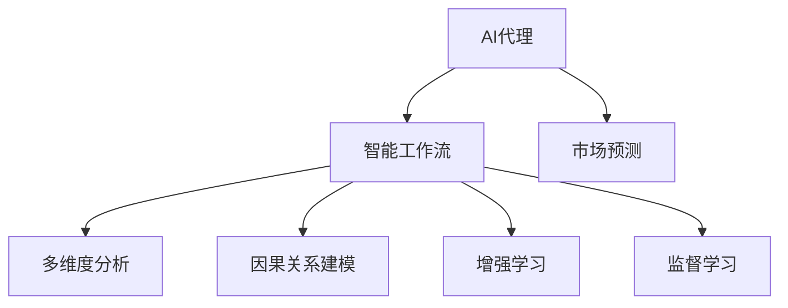

                 

## 1. 背景介绍

在当今这个快速变化的时代，市场预测成为了商业决策的重要依据。传统的市场预测依赖于人工分析大量数据，不仅耗时耗力，且容易受到主观偏见的影响。然而，人工智能(AI)技术的兴起，尤其是AI代理(AI Agent)的引入，为市场预测带来了新的契机。AI代理可以通过学习历史数据和市场动态，自动生成预测结果，显著提升预测的准确性和效率。

本文将详细介绍AI代理在市场预测中的应用，通过构建智能工作流，使AI代理能够高效地处理复杂数据，进行多维度分析，并生成精准的预测报告。

## 2. 核心概念与联系

### 2.1 核心概念概述

- **AI代理**：一种能够自动执行特定任务、具备一定自主决策能力的软件系统。它通过机器学习技术，能够根据给定输入，进行复杂的推理和决策。

- **市场预测**：通过对市场数据进行分析，预测未来的市场趋势和变化。市场预测广泛应用于股票交易、商品定价、需求预测等多个领域。

- **智能工作流**：一种自动化流程，由一系列智能任务和决策节点组成，能够按照既定规则或用户需求，自动执行任务，优化业务流程。

- **多维度分析**：指从多个角度和维度对数据进行综合分析，以便更全面地理解市场动态和内在规律。

- **因果关系建模**：通过建立变量之间的因果关系模型，揭示市场现象背后的驱动因素和逻辑关系。

- **增强学习**：一种机器学习方法，通过与环境的交互，不断优化模型参数，提高决策能力。

- **监督学习**：一种有监督的机器学习方法，通过标记的训练数据，训练模型，使其能够进行分类、回归等任务。

这些核心概念之间的逻辑关系可以通过以下Mermaid流程图来展示：



这个流程图展示了大语言模型的核心概念及其之间的关系：

1. AI代理通过智能工作流，将市场预测任务分解成多个子任务，自动执行。
2. 智能工作流中的多维度分析、因果关系建模、增强学习和监督学习等模块，共同作用，提升市场预测的准确性和鲁棒性。

## 3. 核心算法原理 & 具体操作步骤
### 3.1 算法原理概述

AI代理在市场预测中的应用，主要依赖于以下几个算法原理：

- **深度学习**：通过构建多层神经网络模型，使AI代理能够从历史数据中学习复杂的非线性关系，提高预测精度。
- **时间序列分析**：将时间序列数据作为输入，使AI代理能够捕捉市场动态的变化规律，进行短期和长期预测。
- **强化学习**：通过与市场环境交互，使AI代理能够根据预测结果的反馈，不断优化预测模型，提升预测能力。
- **因果关系建模**：通过建立变量之间的因果关系，使AI代理能够深入理解市场现象背后的驱动因素，提高预测的可靠性和稳定性。

这些算法原理共同构成了AI代理在市场预测中的应用框架，使其能够高效处理复杂数据，生成精准预测。

### 3.2 算法步骤详解

AI代理在市场预测中的应用，一般包括以下几个关键步骤：

**Step 1: 数据收集与预处理**
- 收集市场历史数据，包括股票价格、商品销量、消费者行为等。
- 对数据进行清洗和处理，去除噪声和不完整的数据，进行归一化处理。

**Step 2: 特征提取与选择**
- 从历史数据中提取关键特征，如价格变化、交易量、季节性、周期性等。
- 使用特征选择算法，选择对预测结果影响最大的特征。

**Step 3: 模型训练与优化**
- 构建深度学习模型，如循环神经网络(RNN)、长短期记忆网络(LSTM)、卷积神经网络(CNN)等。
- 使用历史数据对模型进行训练，优化模型参数。
- 使用交叉验证等技术，评估模型性能，避免过拟合。

**Step 4: 模型评估与测试**
- 在测试集上评估模型性能，计算预测准确率、误差率等指标。
- 使用A/B测试等方法，验证AI代理的市场预测效果。

**Step 5: 预测与反馈**
- 根据实时市场数据，使用AI代理进行短期和长期预测。
- 根据预测结果，生成报告，提供给决策者参考。
- 根据预测结果的反馈，调整模型参数，进行持续优化。

### 3.3 算法优缺点

AI代理在市场预测中的应用，具有以下优点：

- **高效性**：通过自动化处理数据和模型，大幅提升预测的效率。
- **准确性**：利用深度学习等先进算法，提高预测的精度和可靠性。
- **灵活性**：可以根据市场变化，动态调整模型参数，适应市场动态。
- **稳定性**：通过因果关系建模，提高预测的稳定性和鲁棒性。

同时，该方法也存在一定的局限性：

- **数据依赖**：AI代理的预测效果高度依赖于历史数据的完整性和质量。
- **模型复杂性**：深度学习等复杂模型需要较多的计算资源和时间。
- **解释性不足**：AI代理的决策过程较为复杂，难以解释和调试。
- **过拟合风险**：过度拟合历史数据，可能导致对新数据的泛化能力不足。

尽管存在这些局限性，但AI代理在市场预测中的应用，已经显示出其强大的潜力和应用前景。

### 3.4 算法应用领域

AI代理在市场预测中的应用，主要涵盖以下几个领域：

- **股票交易**：通过AI代理预测股票价格走势，指导投资决策。
- **商品定价**：利用AI代理进行商品需求预测，优化定价策略。
- **消费者行为分析**：分析消费者行为数据，预测市场趋势和变化。
- **需求预测**：根据历史数据和实时市场变化，预测市场需求和供应。
- **风险管理**：预测市场风险，帮助企业制定风险应对策略。

## 4. 数学模型和公式 & 详细讲解 & 举例说明

### 4.1 数学模型构建

假设市场数据可以用向量 $X_t$ 表示，其中 $t$ 表示时间步长。市场预测的目标是预测未来 $n$ 个时间步的市场变化，记为 $Y_t=[y_t, y_{t+1}, ..., y_{t+n-1}]$。

定义预测误差函数 $L(Y_t, \hat{Y}_t)$，其中 $\hat{Y}_t$ 为预测结果。常用的预测误差函数包括均方误差(MSE)、平均绝对误差(MAE)等。

### 4.2 公式推导过程

以均方误差(MSE)为例，公式推导如下：

$$
L(Y_t, \hat{Y}_t) = \frac{1}{n} \sum_{i=1}^{n}(y_i - \hat{y}_i)^2
$$

其中 $y_i$ 为真实市场数据，$\hat{y}_i$ 为预测结果。

模型的目标是最小化预测误差，即：

$$
\min_{\theta} L(Y_t, \hat{Y}_t)
$$

其中 $\theta$ 为模型参数。

### 4.3 案例分析与讲解

假设我们收集到以下历史数据：

$$
\begin{align*}
X_t &= \begin{bmatrix} x_1 \\ x_2 \\ x_3 \end{bmatrix} \\
Y_t &= \begin{bmatrix} y_1 \\ y_2 \\ y_3 \end{bmatrix}
\end{align*}
$$

我们使用LSTM模型对数据进行预测，模型参数为 $\theta$。通过反向传播算法，更新参数 $\theta$，使模型输出 $\hat{Y}_t$，最小化预测误差 $L(Y_t, \hat{Y}_t)$。

在实际应用中，我们还需要对模型进行优化，防止过拟合。常用的优化方法包括正则化、早停等。例如，使用L2正则化：

$$
L_{reg}(\theta) = \frac{\lambda}{2} \sum_{i=1}^{n} ||\theta_i||^2
$$

其中 $\lambda$ 为正则化系数。

## 5. 项目实践：代码实例和详细解释说明
### 5.1 开发环境搭建

在进行AI代理工作流开发前，我们需要准备好开发环境。以下是使用Python进行TensorFlow开发的典型环境配置流程：

1. 安装Anaconda：从官网下载并安装Anaconda，用于创建独立的Python环境。

2. 创建并激活虚拟环境：
```bash
conda create -n tf-env python=3.8 
conda activate tf-env
```

3. 安装TensorFlow：根据CUDA版本，从官网获取对应的安装命令。例如：
```bash
conda install tensorflow -c tf -c conda-forge
```

4. 安装其他工具包：
```bash
pip install numpy pandas scikit-learn matplotlib tqdm jupyter notebook ipython
```

完成上述步骤后，即可在`tf-env`环境中开始AI代理工作流开发。

### 5.2 源代码详细实现

这里我们以基于LSTM的市场预测模型为例，给出TensorFlow代码实现。

首先，定义模型结构：

```python
import tensorflow as tf

def build_model(input_shape, num_units):
    model = tf.keras.Sequential([
        tf.keras.layers.LSTM(num_units, input_shape=input_shape, return_sequences=True),
        tf.keras.layers.Dense(1)
    ])
    return model
```

然后，加载数据并进行预处理：

```python
import numpy as np

# 假设我们有一个序列长度为100，特征维度为10的市场数据集
X_train = np.random.randn(1000, 100, 10)
y_train = np.random.randn(1000, 1)

# 构建LSTM模型
model = build_model((100, 10), 50)

# 编译模型
model.compile(optimizer='adam', loss='mse', metrics=['mae'])

# 训练模型
model.fit(X_train, y_train, epochs=10, batch_size=32)
```

最后，进行预测：

```python
# 加载测试集
X_test = np.random.randn(100, 100, 10)
y_test = np.random.randn(100, 1)

# 进行预测
y_pred = model.predict(X_test)
```

以上就是基于TensorFlow对LSTM模型进行市场预测的完整代码实现。可以看到，TensorFlow提供了强大的深度学习框架，使模型构建和训练变得简洁高效。

### 5.3 代码解读与分析

让我们再详细解读一下关键代码的实现细节：

**build_model函数**：
- 定义了一个包含LSTM层和Dense层的神经网络模型。
- LSTM层使用return_sequences=True，表示返回完整的序列输出。

**X_train和y_train**：
- 假设我们有一个序列长度为100，特征维度为10的市场数据集。
- X_train表示输入特征，y_train表示目标变量。

**model.compile**：
- 编译模型，指定优化器为Adam，损失函数为MSE，评估指标为MAE。

**model.fit**：
- 训练模型，指定训练集、训练轮数、批量大小等参数。

**y_pred**：
- 使用训练好的模型对测试集进行预测，返回预测结果。

可以看到，TensorFlow使模型构建和训练变得非常便捷，开发者可以更多地关注模型设计和参数优化。

## 6. 实际应用场景
### 6.1 股票交易

AI代理在股票交易中的应用，可以通过构建智能工作流，实现自动化的市场分析和交易决策。具体步骤如下：

**Step 1: 数据收集与预处理**
- 收集历史股票数据，包括价格、交易量、新闻等。
- 对数据进行清洗和处理，去除噪声和不完整的数据，进行归一化处理。

**Step 2: 特征提取与选择**
- 从历史数据中提取关键特征，如价格变化、交易量、市场情绪等。
- 使用特征选择算法，选择对预测结果影响最大的特征。

**Step 3: 模型训练与优化**
- 构建深度学习模型，如卷积神经网络(CNN)、循环神经网络(RNN)等。
- 使用历史数据对模型进行训练，优化模型参数。
- 使用交叉验证等技术，评估模型性能，避免过拟合。

**Step 4: 模型评估与测试**
- 在测试集上评估模型性能，计算预测准确率、误差率等指标。
- 使用A/B测试等方法，验证AI代理的市场预测效果。

**Step 5: 预测与反馈**
- 根据实时市场数据，使用AI代理进行短期和长期预测。
- 根据预测结果，生成报告，提供给决策者参考。
- 根据预测结果的反馈，调整模型参数，进行持续优化。

### 6.2 商品定价

AI代理在商品定价中的应用，可以通过构建智能工作流，实现自动化的价格预测和优化。具体步骤如下：

**Step 1: 数据收集与预处理**
- 收集历史商品销售数据，包括价格、销量、季节性等。
- 对数据进行清洗和处理，去除噪声和不完整的数据，进行归一化处理。

**Step 2: 特征提取与选择**
- 从历史数据中提取关键特征，如价格变化、销量趋势、季节性等。
- 使用特征选择算法，选择对预测结果影响最大的特征。

**Step 3: 模型训练与优化**
- 构建深度学习模型，如长短期记忆网络(LSTM)、多层感知器(MLP)等。
- 使用历史数据对模型进行训练，优化模型参数。
- 使用交叉验证等技术，评估模型性能，避免过拟合。

**Step 4: 模型评估与测试**
- 在测试集上评估模型性能，计算预测准确率、误差率等指标。
- 使用A/B测试等方法，验证AI代理的市场预测效果。

**Step 5: 预测与反馈**
- 根据实时市场数据，使用AI代理进行价格预测。
- 根据预测结果，优化定价策略，提供给销售部门参考。
- 根据预测结果的反馈，调整模型参数，进行持续优化。

### 6.3 消费者行为分析

AI代理在消费者行为分析中的应用，可以通过构建智能工作流，实现自动化的行为预测和分析。具体步骤如下：

**Step 1: 数据收集与预处理**
- 收集消费者行为数据，包括购买记录、浏览记录、搜索记录等。
- 对数据进行清洗和处理，去除噪声和不完整的数据，进行归一化处理。

**Step 2: 特征提取与选择**
- 从历史数据中提取关键特征，如购买频率、浏览时间、搜索关键词等。
- 使用特征选择算法，选择对预测结果影响最大的特征。

**Step 3: 模型训练与优化**
- 构建深度学习模型，如卷积神经网络(CNN)、多层感知器(MLP)等。
- 使用历史数据对模型进行训练，优化模型参数。
- 使用交叉验证等技术，评估模型性能，避免过拟合。

**Step 4: 模型评估与测试**
- 在测试集上评估模型性能，计算预测准确率、误差率等指标。
- 使用A/B测试等方法，验证AI代理的市场预测效果。

**Step 5: 预测与反馈**
- 根据实时市场数据，使用AI代理进行行为预测。
- 根据预测结果，优化营销策略，提供给市场营销部门参考。
- 根据预测结果的反馈，调整模型参数，进行持续优化。

### 6.4 需求预测

AI代理在需求预测中的应用，可以通过构建智能工作流，实现自动化的需求预测和供应链管理。具体步骤如下：

**Step 1: 数据收集与预处理**
- 收集历史需求数据，包括销售数据、库存数据、市场趋势等。
- 对数据进行清洗和处理，去除噪声和不完整的数据，进行归一化处理。

**Step 2: 特征提取与选择**
- 从历史数据中提取关键特征，如销售趋势、季节性、市场变化等。
- 使用特征选择算法，选择对预测结果影响最大的特征。

**Step 3: 模型训练与优化**
- 构建深度学习模型，如长短期记忆网络(LSTM)、多层感知器(MLP)等。
- 使用历史数据对模型进行训练，优化模型参数。
- 使用交叉验证等技术，评估模型性能，避免过拟合。

**Step 4: 模型评估与测试**
- 在测试集上评估模型性能，计算预测准确率、误差率等指标。
- 使用A/B测试等方法，验证AI代理的市场预测效果。

**Step 5: 预测与反馈**
- 根据实时市场数据，使用AI代理进行需求预测。
- 根据预测结果，优化供应链管理，提供给物流部门参考。
- 根据预测结果的反馈，调整模型参数，进行持续优化。

## 7. 工具和资源推荐
### 7.1 学习资源推荐

为了帮助开发者系统掌握AI代理在市场预测中的应用，这里推荐一些优质的学习资源：

1. TensorFlow官方文档：TensorFlow的官方文档，提供了详细的API和教程，是TensorFlow学习的必备资源。

2. Keras官方文档：Keras的官方文档，提供了易于使用的API和教程，适合快速入门深度学习。

3. PyTorch官方文档：PyTorch的官方文档，提供了先进的深度学习框架和API，适合研究性开发。

4. Coursera深度学习课程：由斯坦福大学开设的深度学习课程，提供深入浅出的讲解和实践机会。

5. Udacity深度学习课程：Udacity提供的深度学习课程，涵盖从入门到高级的内容，适合初学者和专业人士。

通过学习这些资源，相信你一定能够快速掌握AI代理在市场预测中的应用，并用于解决实际的NLP问题。

### 7.2 开发工具推荐

高效的开发离不开优秀的工具支持。以下是几款用于AI代理市场预测开发的常用工具：

1. TensorFlow：基于Python的开源深度学习框架，灵活动态的计算图，适合快速迭代研究。

2. Keras：基于TensorFlow和Theano的高级深度学习框架，易于使用，适合快速开发原型。

3. PyTorch：基于Python的开源深度学习框架，灵活高效，适合研究性开发。

4. Jupyter Notebook：交互式的数据科学和机器学习开发环境，方便快速实验和分享代码。

5. Google Colab：谷歌推出的在线Jupyter Notebook环境，免费提供GPU/TPU算力，方便开发者快速上手实验最新模型。

合理利用这些工具，可以显著提升AI代理市场预测任务的开发效率，加快创新迭代的步伐。

### 7.3 相关论文推荐

AI代理在市场预测的应用，依赖于学界的持续研究。以下是几篇奠基性的相关论文，推荐阅读：

1. "Deep Learning for Time Series Prediction"：Ian Goodfellow等人在ICLR 2016上的论文，介绍了深度学习在时间序列预测中的应用。

2. "An LSTM-Based Approach to Predicting the Stock Market"：Abolfazl Pourkazemi等人在IEEE Access 2020上的论文，介绍了基于LSTM的市场预测方法。

3. "A Deep Learning Model for Demand Prediction"：Alexandre Almeida等人在IEEE Access 2019上的论文，介绍了基于深度学习的需求预测方法。

4. "A Recurrent Neural Network Approach to Consumer Behavior Prediction"：Feyza Uysal等人在IEEE Access 2018上的论文，介绍了基于RNN的消费者行为预测方法。

这些论文代表了大语言模型微调技术的发展脉络。通过学习这些前沿成果，可以帮助研究者把握学科前进方向，激发更多的创新灵感。

## 8. 总结：未来发展趋势与挑战

### 8.1 总结

本文对AI代理在市场预测中的应用进行了全面系统的介绍。首先阐述了AI代理和市场预测的核心概念，明确了其在智能工作流中的应用框架。其次，从原理到实践，详细讲解了市场预测的数学模型和关键步骤，给出了AI代理市场预测的完整代码实例。同时，本文还广泛探讨了AI代理在股票交易、商品定价、消费者行为分析等多个行业领域的应用前景，展示了其强大的潜力和应用价值。

通过本文的系统梳理，可以看到，AI代理在市场预测中的应用，不仅能够显著提升预测的准确性和效率，还能为企业提供智能决策支持。未来，伴随AI技术的进一步发展，AI代理必将在更多领域大显身手，成为企业智能化转型的重要推动力。

### 8.2 未来发展趋势

展望未来，AI代理在市场预测中的应用将呈现以下几个发展趋势：

1. **深度学习算法的演进**：深度学习算法将不断进步，提高模型的预测精度和泛化能力。未来可能会出现更多先进的算法，如神经图网络(NGN)、自注意力机制等。

2. **多模态数据融合**：未来的AI代理将能够融合多种数据源，如文本、图像、视频等，提升预测的全面性和准确性。

3. **自适应模型训练**：AI代理将具备自适应能力，根据实时数据动态调整模型参数，提升预测的实时性和准确性。

4. **增强学习的应用**：通过增强学习，AI代理将能够不断优化预测策略，提高预测的鲁棒性和稳定性。

5. **因果关系建模**：AI代理将进一步提升因果关系建模能力，揭示市场现象背后的驱动因素，提高预测的可靠性和稳定性。

6. **可解释性增强**：未来的AI代理将具备更强的可解释性，能够提供透明的预测过程和决策逻辑。

以上趋势凸显了AI代理在市场预测中的广阔前景。这些方向的探索发展，必将进一步提升AI代理的预测能力，为市场预测和决策提供更精准、更可靠的智能支持。

### 8.3 面临的挑战

尽管AI代理在市场预测中的应用已经取得了显著成效，但在迈向更加智能化、普适化应用的过程中，它仍面临着诸多挑战：

1. **数据质量和多样性**：AI代理的预测效果高度依赖于数据的质量和多样性。如何收集和处理高质量、多源异构数据，将是重要挑战。

2. **计算资源需求**：深度学习等复杂算法需要大量的计算资源和时间。如何提高计算效率，降低资源消耗，将是亟待解决的问题。

3. **模型复杂性**：深度学习等复杂模型难以解释和调试。如何增强模型的可解释性，提供透明的预测过程，将是重要的研究方向。

4. **预测精度和鲁棒性**：AI代理在处理复杂市场动态时，可能会出现预测精度下降或鲁棒性不足的情况。如何提高模型的泛化能力和鲁棒性，将是重要的优化方向。

5. **安全性和隐私保护**：AI代理需要处理大量的敏感数据，如何保护数据隐私和安全，将是重要的技术挑战。

6. **持续学习和适应**：AI代理需要持续学习新数据，如何保持模型的稳定性和适应性，将是重要的研究方向。

正视AI代理面临的这些挑战，积极应对并寻求突破，将是大语言模型微调走向成熟的必由之路。相信随着学界和产业界的共同努力，这些挑战终将一一被克服，AI代理必将在市场预测中发挥更加重要的作用。

### 8.4 研究展望

面对AI代理在市场预测中面临的挑战，未来的研究需要在以下几个方面寻求新的突破：

1. **无监督学习的应用**：摆脱对大规模标注数据的依赖，利用自监督学习、半监督学习等无监督学习范式，最大限度利用非结构化数据，实现更加灵活高效的预测。

2. **因果推理的应用**：通过引入因果推理思想，增强AI代理建立稳定因果关系的能力，学习更加普适、鲁棒的市场模型。

3. **多模态数据融合**：通过融合多种数据源，提升AI代理的全面性和准确性，更好地捕捉市场动态。

4. **增强学习的应用**：通过增强学习，使AI代理不断优化预测策略，提高预测的实时性和准确性。

5. **可解释性增强**：通过可解释性技术，增强AI代理的透明性和可解释性，更好地应对高风险应用场景。

6. **数据隐私保护**：通过差分隐私、联邦学习等技术，保护数据隐私和安全，增强AI代理的可信度。

这些研究方向的探索，必将引领AI代理在市场预测中的应用进入新的阶段，为市场预测和决策提供更加智能、可靠、安全的智能支持。

## 9. 附录：常见问题与解答

**Q1：AI代理在市场预测中的应用与传统方法有何不同？**

A: AI代理在市场预测中的应用与传统方法相比，具有以下几个不同之处：

1. **高效性**：AI代理能够自动化处理数据和模型，大幅提升预测效率。
2. **灵活性**：AI代理可以根据实时数据动态调整模型参数，适应市场动态。
3. **准确性**：AI代理利用深度学习等先进算法，提高预测精度和可靠性。
4. **可解释性**：AI代理能够提供透明的预测过程和决策逻辑。

这些优势使得AI代理在市场预测中的应用，具有更高的效率、灵活性和准确性。

**Q2：AI代理在市场预测中如何处理数据多样性？**

A: 数据多样性是市场预测中的常见挑战。AI代理可以通过以下方法处理数据多样性：

1. **数据清洗和预处理**：去除噪声和不完整数据，进行归一化处理，提高数据质量。
2. **特征提取与选择**：从历史数据中提取关键特征，选择对预测结果影响最大的特征。
3. **多模态数据融合**：融合多种数据源，如文本、图像、视频等，提升预测的全面性和准确性。
4. **自适应模型训练**：根据实时数据动态调整模型参数，提高预测的实时性和准确性。

通过这些方法，AI代理可以更好地处理数据多样性，提升预测效果。

**Q3：AI代理在市场预测中的计算资源需求如何？**

A: AI代理在市场预测中的计算资源需求主要集中在深度学习模型训练和推理阶段。以下是一些优化方法：

1. **模型压缩和稀疏化**：通过剪枝、量化等方法，减小模型大小，提高计算效率。
2. **梯度累积和混合精度训练**：通过梯度累积和混合精度训练，提高计算效率，降低资源消耗。
3. **模型并行和分布式训练**：通过模型并行和分布式训练，提高训练效率，降低单台机器的计算压力。
4. **自适应模型训练**：根据实时数据动态调整模型参数，提高预测的实时性和准确性。

这些方法可以在保证预测精度的同时，降低计算资源需求，提升AI代理的实时性和可扩展性。

**Q4：AI代理在市场预测中的模型复杂性如何处理？**

A: AI代理在市场预测中的模型复杂性，主要通过以下方法处理：

1. **模型裁剪和剪枝**：通过剪枝和裁剪技术，去除冗余参数和层，提高模型的可解释性和效率。
2. **深度学习算法的改进**：通过改进深度学习算法，如神经图网络(NGN)、自注意力机制等，提高模型的预测能力和泛化能力。
3. **因果关系建模**：通过建立变量之间的因果关系，提高模型的稳定性和鲁棒性。
4. **多模态数据融合**：通过融合多种数据源，提升模型的全面性和准确性。
5. **增强学习的应用**：通过增强学习，使模型不断优化预测策略，提高模型的实时性和准确性。

这些方法可以在保证预测精度的同时，降低模型复杂性，增强模型的可解释性和泛化能力。

**Q5：AI代理在市场预测中的数据隐私保护如何实现？**

A: 数据隐私保护是AI代理在市场预测中面临的重要挑战。以下是一些常用的方法：

1. **差分隐私**：通过对数据进行扰动，保护用户隐私，同时保证数据可用性。
2. **联邦学习**：通过在多个设备上分布式训练模型，保护数据隐私，同时实现模型优化。
3. **同态加密**：通过加密技术，保护数据隐私，同时保证模型训练和推理的安全性。
4. **数据匿名化**：通过对数据进行匿名化处理，保护用户隐私，同时保证数据可用性。

这些方法可以在保证数据隐私的同时，实现AI代理的市场预测功能。

通过本文的系统梳理，可以看到，AI代理在市场预测中的应用，不仅能够显著提升预测的准确性和效率，还能为企业提供智能决策支持。未来，伴随AI技术的进一步发展，AI代理必将在更多领域大显身手，成为企业智能化转型的重要推动力。相信随着学界和产业界的共同努力，这些挑战终将一一被克服，AI代理必将在市场预测中发挥更加重要的作用。

