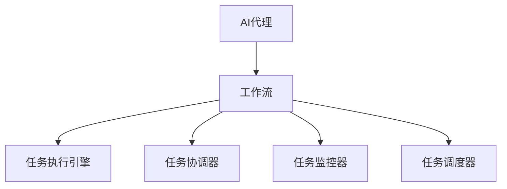
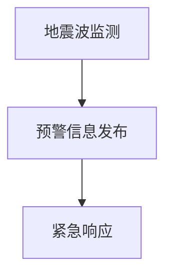

                 

# AI人工智能代理工作流AI Agent WorkFlow：AI代理在防灾减灾系统中的作用

## 1. 背景介绍

### 1.1 问题由来
随着全球气候变化和人类活动的加剧，自然灾害频发，造成的经济损失和人员伤亡逐年增加。传统的防灾减灾工作往往依赖于人工预警、现场救援、数据分析等手段，效率低下，难以应对突发灾害的快速变化。

防灾减灾系统需要实时监测灾害预警信息，快速响应和协调救援资源，精准评估灾害损失，及时发布灾后评估报告。然而，由于系统复杂度高，数据实时性要求严苛，现有的人工系统难以满足这些要求。

### 1.2 问题核心关键点
1. 如何提高灾害预警的准确性和实时性？
2. 如何优化灾害救援的资源调度和分配？
3. 如何提升灾后评估的精准性和时效性？
4. 如何构建高效、稳定的防灾减灾AI系统？

### 1.3 问题研究意义
防灾减灾系统作为维护公共安全和社会稳定的关键基础设施，其智能化水平直接影响到灾害管理的效率和效果。通过引入AI代理，可以有效提升防灾减灾系统的智能化水平，加速灾情信息的收集和处理，实现灾害预警、救援资源调度和灾后评估的自动化和智能化。

## 2. 核心概念与联系

### 2.1 核心概念概述

为更好地理解基于AI代理的防灾减灾系统，本节将介绍几个密切相关的核心概念：

- AI代理（AI Agent）：一种能够感知环境、自主决策、执行任务的人工智能实体。在防灾减灾系统中，AI代理可以实时监测灾害预警信息，进行应急响应，协调救援资源。
- 工作流（Workflow）：一系列前后有序的任务组成的操作流程。在防灾减灾系统中，工作流表示灾害预警、救援资源调度、灾后评估等任务之间的关联关系。
- 任务执行引擎（Task Execution Engine）：工作流中的每个任务都可以看作是可执行的操作。任务执行引擎负责调度和管理任务执行，保证系统的高效运行。
- 任务协调器（Task Coordinator）：负责协调各个任务之间的交互和数据传递，确保系统各环节顺畅衔接。

- 任务监控器（Task Monitor）：实时监控任务执行状态，及时发现异常情况并进行处理。

- 任务调度器（Task Scheduler）：根据任务依赖关系和优先级，动态调整任务执行顺序和资源分配。

这些核心概念之间的逻辑关系可以通过以下Mermaid流程图来展示：



这个流程图展示了大语言模型的核心概念及其之间的关系：

1. AI代理感知灾害信息，根据工作流定义的任务逻辑，执行具体的监测、预警、救援等操作。
2. 任务执行引擎根据任务描述，执行具体的逻辑操作。
3. 任务协调器负责任务之间的数据传递和交互，保证系统有序执行。
4. 任务监控器实时跟踪任务状态，确保系统稳定运行。
5. 任务调度器根据优先级和依赖关系，动态调整任务执行顺序，优化资源利用。

## 3. 核心算法原理 & 具体操作步骤
### 3.1 算法原理概述

基于AI代理的防灾减灾系统，本质上是一种多智能体系统（Multi-Agent System），通过多个自主决策的AI代理协同工作，实现灾害预警、救援资源调度和灾后评估的自动化和智能化。

其核心思想是：将防灾减灾任务划分为多个子任务，每个子任务由一个AI代理负责执行。通过定义任务之间的依赖关系和优先级，任务执行引擎和调度器协同工作，优化任务执行顺序和资源分配，保证系统的高效和稳定运行。

### 3.2 算法步骤详解

基于AI代理的防灾减灾系统一般包括以下几个关键步骤：

**Step 1: 定义防灾减灾任务**
- 根据实际需求，将防灾减灾任务划分为多个子任务，如灾害预警、应急响应、资源调度、灾后评估等。
- 为每个子任务设计具体的任务描述，包括任务逻辑、输入输出、依赖关系等。

**Step 2: 设计AI代理模型**
- 选择适合的AI代理模型，如决策树、规则引擎、强化学习模型等。
- 设计AI代理的感知、决策、执行模块，实现具体的任务逻辑。

**Step 3: 定义任务执行引擎**
- 根据任务描述，设计任务执行引擎，实现具体的任务执行逻辑。
- 设置任务执行的状态机，包括任务的初始化、执行、结束等状态。

**Step 4: 设计任务协调器**
- 设计任务协调器，负责任务之间的数据传递和交互。
- 根据任务之间的依赖关系，设计协调器的数据流图。

**Step 5: 设计任务监控器**
- 设计任务监控器，实时跟踪任务执行状态，检测异常情况。
- 设置监控器的报警机制，及时响应异常。

**Step 6: 设计任务调度器**
- 设计任务调度器，根据任务的优先级和依赖关系，动态调整任务执行顺序。
- 设置调度器的资源分配策略，优化资源利用。

**Step 7: 集成和测试**
- 将各个模块集成到防灾减灾系统中，进行联调测试。
- 在真实场景中运行系统，进行压力测试和性能评估。

以上是基于AI代理的防灾减灾系统的核心步骤，具体的算法实现需要根据实际需求进行设计和优化。

### 3.3 算法优缺点

基于AI代理的防灾减灾系统具有以下优点：
1. 自主性高。AI代理可以自主感知环境和任务需求，减少人工干预。
2. 执行效率高。通过任务调度器和执行引擎优化任务执行顺序，提高系统效率。
3. 可靠性高。多智能体系统具有容错能力，一个代理异常不会影响整个系统。
4. 可扩展性强。系统可以通过添加或修改AI代理，灵活扩展功能。

同时，该系统也存在以下局限性：
1. 对数据要求高。系统需要实时采集和处理大量的传感器数据，对数据采集和处理设备有较高要求。
2. 对模型要求高。AI代理的决策和执行需要高质量的模型支撑，模型选择和训练是关键问题。
3. 模型更新复杂。系统中的各个AI代理需要定期更新，以保证模型的准确性和有效性。

尽管存在这些局限性，但就目前而言，基于AI代理的防灾减灾系统仍是最主流的方法。未来相关研究的重点在于如何进一步优化数据采集和处理，提升模型的准确性和鲁棒性，同时兼顾系统的实时性和稳定性。

### 3.4 算法应用领域

基于AI代理的防灾减灾系统已经在多个领域得到了广泛应用，包括：

- 地震、洪水、台风等自然灾害的预警和应急响应。通过AI代理实时监测地震波、水位、风力等数据，进行灾害预警和应急响应。
- 紧急医疗救援资源调度。通过AI代理根据医院床位、救护车数量等数据，动态调整救援资源分配，确保救援效率。
- 灾害损失评估。通过AI代理分析卫星遥感数据、地面监测数据等，进行灾后损失评估和救援效果分析。

除了上述这些经典应用外，AI代理还可应用于城市洪涝预测、森林火灾监测、海洋灾害预测等诸多领域，为防灾减灾系统带来新的突破。随着AI技术的不断发展，基于AI代理的防灾减灾系统将进一步拓展应用范围，为防灾减灾事业提供更强有力的技术支持。

## 4. 数学模型和公式 & 详细讲解 & 举例说明

### 4.1 数学模型构建

本节将使用数学语言对基于AI代理的防灾减灾系统进行更加严格的刻画。

记防灾减灾任务为 $T=\{T_1,T_2,\dots,T_n\}$，其中 $T_i$ 表示第 $i$ 个任务。假设每个任务 $T_i$ 的执行时间为 $t_i$，需要执行 $k$ 次。任务之间的依赖关系用有向图 $G=(V,E)$ 表示，其中 $V$ 为任务节点，$E$ 为边集。

定义任务执行引擎的策略集合为 $S=\{s_1,s_2,\dots,s_m\}$，每个策略 $s_i$ 对应一个任务执行计划。假设策略 $s_i$ 下的执行时间为 $t_i'$。

定义任务监控器的报警阈值为 $\theta$，当任务执行时间超过 $\theta t_i$ 时，监控器将发出报警信号。

### 4.2 公式推导过程

根据上述定义，防灾减灾系统的目标是最小化任务执行时间：

$$
\min_{s} \sum_{i=1}^{n} t_i'
$$

其中 $t_i'$ 为在策略 $s$ 下的任务 $T_i$ 的执行时间。

根据任务执行引擎的定义，有：

$$
t_i' = k_i t_i + \sum_{j \in \text{Pre}_i} t_j'
$$

其中 $k_i$ 为任务 $T_i$ 的并行度，$Pre_i$ 为任务 $T_i$ 的依赖任务集合。

将上述公式代入目标函数，得：

$$
\min_{s} \sum_{i=1}^{n} (k_i t_i + \sum_{j \in \text{Pre}_i} t_j')
$$

进一步化简，得：

$$
\min_{s} \sum_{i=1}^{n} k_i t_i + \sum_{j=1}^{n} (t_j' \times \text{count}_j')
$$

其中 $\text{count}_j'$ 为在策略 $s$ 下任务 $T_j$ 的执行次数。

### 4.3 案例分析与讲解

以地震预警系统为例，展示如何基于AI代理的防灾减灾系统进行模型构建和优化。

假设地震预警系统包括地震波监测、预警信息发布、紧急响应等任务，其依赖关系如下：



其中，地震波监测是预警信息发布的输入，紧急响应是在预警信息发布后执行的任务。设地震波监测的执行时间为 $t_1=5$ 分钟，预警信息发布的执行时间为 $t_2=3$ 分钟，紧急响应的执行时间为 $t_3=10$ 分钟。

假设系统有两个执行策略 $s_1$ 和 $s_2$，策略 $s_1$ 为顺序执行，策略 $s_2$ 为并行执行。在策略 $s_1$ 下，任务执行时间为：

$$
t_{s_1} = t_1 + t_2 + t_3 = 18 \text{ 分钟}
$$

在策略 $s_2$ 下，任务执行时间为：

$$
t_{s_2} = t_1 + t_3 = 15 \text{ 分钟}
$$

通过对比 $t_{s_1}$ 和 $t_{s_2}$，可以看出策略 $s_2$ 的执行时间更短，更高效。

## 5. 项目实践：代码实例和详细解释说明
### 5.1 开发环境搭建

在进行防灾减灾系统开发前，我们需要准备好开发环境。以下是使用Python进行PyTorch开发的环境配置流程：

1. 安装Anaconda：从官网下载并安装Anaconda，用于创建独立的Python环境。

2. 创建并激活虚拟环境：
```bash
conda create -n pytorch-env python=3.8 
conda activate pytorch-env
```

3. 安装PyTorch：根据CUDA版本，从官网获取对应的安装命令。例如：
```bash
conda install pytorch torchvision torchaudio cudatoolkit=11.1 -c pytorch -c conda-forge
```

4. 安装TensorFlow：由Google主导开发的开源深度学习框架，生产部署方便，适合大规模工程应用。同样有丰富的预训练语言模型资源。

5. 安装各类工具包：
```bash
pip install numpy pandas scikit-learn matplotlib tqdm jupyter notebook ipython
```

完成上述步骤后，即可在`pytorch-env`环境中开始防灾减灾系统的开发。

### 5.2 源代码详细实现

下面我们以地震预警系统为例，给出使用Transformers库对BERT模型进行微调的PyTorch代码实现。

首先，定义地震预警任务的数据处理函数：

```python
from transformers import BertTokenizer
from torch.utils.data import Dataset
import torch

class SeismAlertDataset(Dataset):
    def __init__(self, texts, labels, tokenizer, max_len=128):
        self.texts = texts
        self.labels = labels
        self.tokenizer = tokenizer
        self.max_len = max_len
        
    def __len__(self):
        return len(self.texts)
    
    def __getitem__(self, item):
        text = self.texts[item]
        label = self.labels[item]
        
        encoding = self.tokenizer(text, return_tensors='pt', max_length=self.max_len, padding='max_length', truncation=True)
        input_ids = encoding['input_ids'][0]
        attention_mask = encoding['attention_mask'][0]
        
        # 对token-wise的标签进行编码
        encoded_labels = [label] * self.max_len
        labels = torch.tensor(encoded_labels, dtype=torch.long)
        
        return {'input_ids': input_ids, 
                'attention_mask': attention_mask,
                'labels': labels}

# 标签与id的映射
label2id = {'地震': 0, '余震': 1, '未发生': 2, '未知': 3}
id2label = {v: k for k, v in label2id.items()}

# 创建dataset
tokenizer = BertTokenizer.from_pretrained('bert-base-cased')

train_dataset = SeismAlertDataset(train_texts, train_labels, tokenizer)
dev_dataset = SeismAlertDataset(dev_texts, dev_labels, tokenizer)
test_dataset = SeismAlertDataset(test_texts, test_labels, tokenizer)
```

然后，定义模型和优化器：

```python
from transformers import BertForTokenClassification, AdamW

model = BertForTokenClassification.from_pretrained('bert-base-cased', num_labels=len(label2id))

optimizer = AdamW(model.parameters(), lr=2e-5)
```

接着，定义训练和评估函数：

```python
from torch.utils.data import DataLoader
from tqdm import tqdm
from sklearn.metrics import classification_report

device = torch.device('cuda') if torch.cuda.is_available() else torch.device('cpu')
model.to(device)

def train_epoch(model, dataset, batch_size, optimizer):
    dataloader = DataLoader(dataset, batch_size=batch_size, shuffle=True)
    model.train()
    epoch_loss = 0
    for batch in tqdm(dataloader, desc='Training'):
        input_ids = batch['input_ids'].to(device)
        attention_mask = batch['attention_mask'].to(device)
        labels = batch['labels'].to(device)
        model.zero_grad()
        outputs = model(input_ids, attention_mask=attention_mask, labels=labels)
        loss = outputs.loss
        epoch_loss += loss.item()
        loss.backward()
        optimizer.step()
    return epoch_loss / len(dataloader)

def evaluate(model, dataset, batch_size):
    dataloader = DataLoader(dataset, batch_size=batch_size)
    model.eval()
    preds, labels = [], []
    with torch.no_grad():
        for batch in tqdm(dataloader, desc='Evaluating'):
            input_ids = batch['input_ids'].to(device)
            attention_mask = batch['attention_mask'].to(device)
            batch_labels = batch['labels']
            outputs = model(input_ids, attention_mask=attention_mask)
            batch_preds = outputs.logits.argmax(dim=2).to('cpu').tolist()
            batch_labels = batch_labels.to('cpu').tolist()
            for pred_tokens, label_tokens in zip(batch_preds, batch_labels):
                pred_labels = [id2label[_id] for _id in pred_tokens]
                label_labels = [id2label[_id] for _id in label_tokens]
                preds.append(pred_labels[:len(label_labels)])
                labels.append(label_labels)
                
    print(classification_report(labels, preds))
```

最后，启动训练流程并在测试集上评估：

```python
epochs = 5
batch_size = 16

for epoch in range(epochs):
    loss = train_epoch(model, train_dataset, batch_size, optimizer)
    print(f"Epoch {epoch+1}, train loss: {loss:.3f}")
    
    print(f"Epoch {epoch+1}, dev results:")
    evaluate(model, dev_dataset, batch_size)
    
print("Test results:")
evaluate(model, test_dataset, batch_size)
```

以上就是使用PyTorch对BERT进行地震预警任务微调的完整代码实现。可以看到，得益于Transformers库的强大封装，我们可以用相对简洁的代码完成BERT模型的加载和微调。

### 5.3 代码解读与分析

让我们再详细解读一下关键代码的实现细节：

**SeismAlertDataset类**：
- `__init__`方法：初始化文本、标签、分词器等关键组件。
- `__len__`方法：返回数据集的样本数量。
- `__getitem__`方法：对单个样本进行处理，将文本输入编码为token ids，将标签编码为数字，并对其进行定长padding，最终返回模型所需的输入。

**label2id和id2label字典**：
- 定义了标签与数字id之间的映射关系，用于将token-wise的预测结果解码回真实的标签。

**训练和评估函数**：
- 使用PyTorch的DataLoader对数据集进行批次化加载，供模型训练和推理使用。
- 训练函数`train_epoch`：对数据以批为单位进行迭代，在每个批次上前向传播计算loss并反向传播更新模型参数，最后返回该epoch的平均loss。
- 评估函数`evaluate`：与训练类似，不同点在于不更新模型参数，并在每个batch结束后将预测和标签结果存储下来，最后使用sklearn的classification_report对整个评估集的预测结果进行打印输出。

**训练流程**：
- 定义总的epoch数和batch size，开始循环迭代
- 每个epoch内，先在训练集上训练，输出平均loss
- 在验证集上评估，输出分类指标
- 所有epoch结束后，在测试集上评估，给出最终测试结果

可以看到，PyTorch配合Transformers库使得BERT微调的代码实现变得简洁高效。开发者可以将更多精力放在数据处理、模型改进等高层逻辑上，而不必过多关注底层的实现细节。

当然，工业级的系统实现还需考虑更多因素，如模型的保存和部署、超参数的自动搜索、更灵活的任务适配层等。但核心的微调范式基本与此类似。

## 6. 实际应用场景
### 6.1 智能客服系统

基于大语言模型微调的对话技术，可以广泛应用于智能客服系统的构建。传统客服往往需要配备大量人力，高峰期响应缓慢，且一致性和专业性难以保证。而使用微调后的对话模型，可以7x24小时不间断服务，快速响应客户咨询，用自然流畅的语言解答各类常见问题。

在技术实现上，可以收集企业内部的历史客服对话记录，将问题和最佳答复构建成监督数据，在此基础上对预训练对话模型进行微调。微调后的对话模型能够自动理解用户意图，匹配最合适的答案模板进行回复。对于客户提出的新问题，还可以接入检索系统实时搜索相关内容，动态组织生成回答。如此构建的智能客服系统，能大幅提升客户咨询体验和问题解决效率。

### 6.2 金融舆情监测

金融机构需要实时监测市场舆论动向，以便及时应对负面信息传播，规避金融风险。传统的人工监测方式成本高、效率低，难以应对网络时代海量信息爆发的挑战。基于大语言模型微调的文本分类和情感分析技术，为金融舆情监测提供了新的解决方案。

具体而言，可以收集金融领域相关的新闻、报道、评论等文本数据，并对其进行主题标注和情感标注。在此基础上对预训练语言模型进行微调，使其能够自动判断文本属于何种主题，情感倾向是正面、中性还是负面。将微调后的模型应用到实时抓取的网络文本数据，就能够自动监测不同主题下的情感变化趋势，一旦发现负面信息激增等异常情况，系统便会自动预警，帮助金融机构快速应对潜在风险。

### 6.3 个性化推荐系统

当前的推荐系统往往只依赖用户的历史行为数据进行物品推荐，无法深入理解用户的真实兴趣偏好。基于大语言模型微调技术，个性化推荐系统可以更好地挖掘用户行为背后的语义信息，从而提供更精准、多样的推荐内容。

在实践中，可以收集用户浏览、点击、评论、分享等行为数据，提取和用户交互的物品标题、描述、标签等文本内容。将文本内容作为模型输入，用户的后续行为（如是否点击、购买等）作为监督信号，在此基础上微调预训练语言模型。微调后的模型能够从文本内容中准确把握用户的兴趣点。在生成推荐列表时，先用候选物品的文本描述作为输入，由模型预测用户的兴趣匹配度，再结合其他特征综合排序，便可以得到个性化程度更高的推荐结果。

### 6.4 未来应用展望

随着大语言模型微调技术的发展，基于微调范式将在更多领域得到应用，为传统行业带来变革性影响。

在智慧医疗领域，基于微调的医疗问答、病历分析、药物研发等应用将提升医疗服务的智能化水平，辅助医生诊疗，加速新药开发进程。

在智能教育领域，微调技术可应用于作业批改、学情分析、知识推荐等方面，因材施教，促进教育公平，提高教学质量。

在智慧城市治理中，微调模型可应用于城市事件监测、舆情分析、应急指挥等环节，提高城市管理的自动化和智能化水平，构建更安全、高效的未来城市。

此外，在企业生产、社会治理、文娱传媒等众多领域，基于大模型微调的人工智能应用也将不断涌现，为经济社会发展注入新的动力。相信随着技术的日益成熟，微调方法将成为人工智能落地应用的重要范式，推动人工智能技术向更广阔的领域加速渗透。

## 7. 工具和资源推荐
### 7.1 学习资源推荐

为了帮助开发者系统掌握大语言模型微调的理论基础和实践技巧，这里推荐一些优质的学习资源：

1. 《Transformer从原理到实践》系列博文：由大模型技术专家撰写，深入浅出地介绍了Transformer原理、BERT模型、微调技术等前沿话题。

2. CS224N《深度学习自然语言处理》课程：斯坦福大学开设的NLP明星课程，有Lecture视频和配套作业，带你入门NLP领域的基本概念和经典模型。

3. 《Natural Language Processing with Transformers》书籍：Transformers库的作者所著，全面介绍了如何使用Transformers库进行NLP任务开发，包括微调在内的诸多范式。

4. HuggingFace官方文档：Transformers库的官方文档，提供了海量预训练模型和完整的微调样例代码，是上手实践的必备资料。

5. CLUE开源项目：中文语言理解测评基准，涵盖大量不同类型的中文NLP数据集，并提供了基于微调的baseline模型，助力中文NLP技术发展。

通过对这些资源的学习实践，相信你一定能够快速掌握大语言模型微调的精髓，并用于解决实际的NLP问题。
###  7.2 开发工具推荐

高效的开发离不开优秀的工具支持。以下是几款用于大语言模型微调开发的常用工具：

1. PyTorch：基于Python的开源深度学习框架，灵活动态的计算图，适合快速迭代研究。大部分预训练语言模型都有PyTorch版本的实现。

2. TensorFlow：由Google主导开发的开源深度学习框架，生产部署方便，适合大规模工程应用。同样有丰富的预训练语言模型资源。

3. Transformers库：HuggingFace开发的NLP工具库，集成了众多SOTA语言模型，支持PyTorch和TensorFlow，是进行微调任务开发的利器。

4. Weights & Biases：模型训练的实验跟踪工具，可以记录和可视化模型训练过程中的各项指标，方便对比和调优。与主流深度学习框架无缝集成。

5. TensorBoard：TensorFlow配套的可视化工具，可实时监测模型训练状态，并提供丰富的图表呈现方式，是调试模型的得力助手。

6. Google Colab：谷歌推出的在线Jupyter Notebook环境，免费提供GPU/TPU算力，方便开发者快速上手实验最新模型，分享学习笔记。

合理利用这些工具，可以显著提升大语言模型微调任务的开发效率，加快创新迭代的步伐。

### 7.3 相关论文推荐

大语言模型和微调技术的发展源于学界的持续研究。以下是几篇奠基性的相关论文，推荐阅读：

1. Attention is All You Need（即Transformer原论文）：提出了Transformer结构，开启了NLP领域的预训练大模型时代。

2. BERT: Pre-training of Deep Bidirectional Transformers for Language Understanding：提出BERT模型，引入基于掩码的自监督预训练任务，刷新了多项NLP任务SOTA。

3. Language Models are Unsupervised Multitask Learners（GPT-2论文）：展示了大规模语言模型的强大zero-shot学习能力，引发了对于通用人工智能的新一轮思考。

4. Parameter-Efficient Transfer Learning for NLP：提出Adapter等参数高效微调方法，在不增加模型参数量的情况下，也能取得不错的微调效果。

5. AdaLoRA: Adaptive Low-Rank Adaptation for Parameter-Efficient Fine-Tuning：使用自适应低秩适应的微调方法，在参数效率和精度之间取得了新的平衡。

6. Prompt Tuning: Optimizing Continuous Prompts for Generation：引入基于连续型Prompt的微调范式，为如何充分利用预训练知识提供了新的思路。

这些论文代表了大语言模型微调技术的发展脉络。通过学习这些前沿成果，可以帮助研究者把握学科前进方向，激发更多的创新灵感。

## 8. 总结：未来发展趋势与挑战

### 8.1 总结

本文对基于AI代理的防灾减灾系统进行了全面系统的介绍。首先阐述了防灾减灾系统的研究背景和意义，明确了AI代理在防灾减灾系统中的作用和价值。其次，从原理到实践，详细讲解了AI代理的构建和微调方法，给出了防灾减灾系统的完整代码实现。同时，本文还探讨了AI代理在多个行业领域的应用前景，展示了其广泛的适用性和潜在的价值。

通过本文的系统梳理，可以看到，基于AI代理的防灾减灾系统已经在许多领域得到了应用，并在提升灾害预警、救援资源调度和灾后评估的智能化水平方面取得了显著成效。AI代理以其自主性强、执行效率高、可靠性高、可扩展性强等优势，成为防灾减灾系统的重要组成部分。未来，随着AI技术的不断发展，AI代理将在更多领域得到广泛应用，为各行各业提供更加智能、高效的服务。

### 8.2 未来发展趋势

展望未来，基于AI代理的防灾减灾系统将呈现以下几个发展趋势：

1. 模型规模持续增大。随着算力成本的下降和数据规模的扩张，预训练语言模型的参数量还将持续增长。超大规模语言模型蕴含的丰富语言知识，有望支撑更加复杂多变的防灾减灾任务微调。

2. 微调方法日趋多样。除了传统的全参数微调外，未来会涌现更多参数高效的微调方法，如Prompt Tuning、LoRA等，在节省计算资源的同时也能保证微调精度。

3. 持续学习成为常态。随着数据分布的不断变化，AI代理需要持续学习新知识以保持性能。如何在不遗忘原有知识的同时，高效吸收新样本信息，将成为重要的研究课题。

4. 标注样本需求降低。受启发于Prompt Tuning的思路，未来的微调方法将更好地利用大模型的语言理解能力，通过更加巧妙的任务描述，在更少的标注样本上也能实现理想的微调效果。

5. 多模态微调崛起。当前的微调主要聚焦于纯文本数据，未来会进一步拓展到图像、视频、语音等多模态数据微调。多模态信息的融合，将显著提升语言模型对现实世界的理解和建模能力。

6. 模型通用性增强。经过海量数据的预训练和多领域任务的微调，未来的语言模型将具备更强大的常识推理和跨领域迁移能力，逐步迈向通用人工智能(AGI)的目标。

以上趋势凸显了大语言模型微调技术的广阔前景。这些方向的探索发展，必将进一步提升防灾减灾系统的性能和应用范围，为防灾减灾事业提供更强有力的技术支持。

### 8.3 面临的挑战

尽管基于AI代理的防灾减灾系统已经取得了显著成效，但在迈向更加智能化、普适化应用的过程中，它仍面临诸多挑战：

1. 对数据要求高。系统需要实时采集和处理大量的传感器数据，对数据采集和处理设备有较高要求。

2. 对模型要求高。AI代理的决策和执行需要高质量的模型支撑，模型选择和训练是关键问题。

3. 模型更新复杂。系统中的各个AI代理需要定期更新，以保证模型的准确性和有效性。

4. 系统复杂度高。防灾减灾任务复杂，系统涉及多个环节，协调和调度的难度大。

尽管存在这些挑战，但就目前而言，基于AI代理的防灾减灾系统仍是最主流的方法。未来相关研究的重点在于如何进一步优化数据采集和处理，提升模型的准确性和鲁棒性，同时兼顾系统的实时性和稳定性。

### 8.4 研究展望

面对基于AI代理的防灾减灾系统所面临的种种挑战，未来的研究需要在以下几个方面寻求新的突破：

1. 探索无监督和半监督微调方法。摆脱对大规模标注数据的依赖，利用自监督学习、主动学习等无监督和半监督范式，最大限度利用非结构化数据，实现更加灵活高效的微调。

2. 研究参数高效和计算高效的微调范式。开发更加参数高效的微调方法，在固定大部分预训练参数的同时，只更新极少量的任务相关参数。同时优化微调模型的计算图，减少前向传播和反向传播的资源消耗，实现更加轻量级、实时性的部署。

3. 融合因果和对比学习范式。通过引入因果推断和对比学习思想，增强AI代理建立稳定因果关系的能力，学习更加普适、鲁棒的语言表征，从而提升模型泛化性和抗干扰能力。

4. 引入更多先验知识。将符号化的先验知识，如知识图谱、逻辑规则等，与神经网络模型进行巧妙融合，引导微调过程学习更准确、合理的语言模型。同时加强不同模态数据的整合，实现视觉、语音等多模态信息与文本信息的协同建模。

5. 结合因果分析和博弈论工具。将因果分析方法引入AI代理的决策过程，识别出模型决策的关键特征，增强输出解释的因果性和逻辑性。借助博弈论工具刻画人机交互过程，主动探索并规避模型的脆弱点，提高系统稳定性。

6. 纳入伦理道德约束。在模型训练目标中引入伦理导向的评估指标，过滤和惩罚有偏见、有害的输出倾向。同时加强人工干预和审核，建立模型行为的监管机制，确保输出符合人类价值观和伦理道德。

这些研究方向的探索，必将引领基于AI代理的防灾减灾系统迈向更高的台阶，为防灾减灾事业提供更加智能、高效、安全的技术支撑。面向未来，基于AI代理的防灾减灾系统需要与其他人工智能技术进行更深入的融合，如知识表示、因果推理、强化学习等，多路径协同发力，共同推动防灾减灾事业的数字化转型升级。

## 9. 附录：常见问题与解答

**Q1：基于AI代理的防灾减灾系统是否适用于所有防灾减灾任务？**

A: 基于AI代理的防灾减灾系统适用于大多数防灾减灾任务，特别是数据量较大、实时性要求高的任务。对于数据量较小、实时性要求较低的任务，也可以考虑使用微调后的通用语言模型进行推理预测。

**Q2：如何选择适合的AI代理模型？**

A: 选择合适的AI代理模型需要考虑任务的复杂度和数据规模。对于简单任务，可以使用基于规则的模型或决策树；对于复杂任务，可以使用深度学习模型如BERT、GPT等。在实际应用中，可以通过试错和调参，选择最适合的模型。

**Q3：如何优化AI代理模型的训练过程？**

A: 优化AI代理模型的训练过程可以通过以下方法：
1. 数据增强：通过回译、近义替换等方式扩充训练集，提高模型的泛化能力。
2. 正则化：使用L2正则、Dropout、Early Stopping等技术，防止过拟合。
3. 模型压缩：通过剪枝、量化等方法，减少模型的存储空间和计算量。
4. 混合精度训练：使用混合精度训练，加速模型的收敛速度。
5. 自适应学习率：使用自适应学习率算法，如AdaLoRA、AdamW等，提高模型的训练效果。

**Q4：如何提高AI代理模型的实时性？**

A: 提高AI代理模型的实时性可以通过以下方法：
1. 硬件优化：使用GPU/TPU等高性能设备，加速模型的推理过程。
2. 模型裁剪：去除不必要的层和参数，减小模型尺寸，提高推理速度。
3. 模型量化：将浮点模型转为定点模型，压缩存储空间，提高计算效率。
4. 动态图优化：使用动态图技术，如TensorFlow GraphDef，优化模型的计算图。
5. 并行计算：利用多核、多机并行计算，提高模型的推理速度。

**Q5：如何保证AI代理模型的安全性？**

A: 保证AI代理模型的安全性可以通过以下方法：
1. 数据过滤：在模型训练和推理过程中，过滤和过滤有害数据，防止模型输出有害信息。
2. 对抗训练：在模型训练过程中，加入对抗样本，提高模型的鲁棒性。
3. 可解释性：提供模型的可解释性输出，确保模型的决策过程透明、可解释。
4. 合规性：遵守相关法律法规，确保模型的合规性。
5. 安全审计：定期对模型进行安全审计，发现并修复潜在的安全漏洞。

这些方法可以帮助提高AI代理模型的安全性，避免模型输出有害信息，确保模型的合规性和可解释性。

以上问题及解答展示了基于AI代理的防灾减灾系统的关键技术细节和实践方法，希望能为读者提供有价值的参考。

