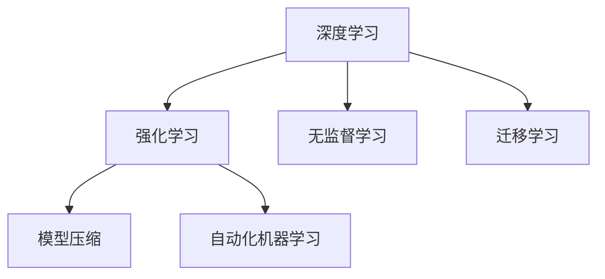

                 

# AI人工智能核心算法原理与代码实例讲解：人工智能应用发展趋势

> 关键词：人工智能,机器学习,深度学习,算法原理,代码实例,发展趋势

## 1. 背景介绍

### 1.1 问题由来
人工智能（Artificial Intelligence, AI）自上世纪五十年代兴起以来，已经发展成为一个跨学科、多方向的综合性领域。从最初的逻辑推理、专家系统，到后来的机器学习、深度学习，再到如今的强化学习、无监督学习等，AI技术在理论研究和应用实践上都取得了巨大进步。

当前，AI技术正快速渗透到各行各业，成为推动产业数字化、智能化转型的关键驱动力。无论是自动驾驶、医疗诊断、金融风控、教育辅导、智能客服等领域，AI都发挥着重要作用。但与此同时，AI技术的复杂性和多样性也带来了诸多挑战，包括数据隐私、模型解释性、算法公平性等问题，亟需更多的理论突破和实践优化。

### 1.2 问题核心关键点
1. **算法原理：**深度学习、强化学习、无监督学习等AI核心算法的工作原理和核心技术。
2. **代码实例：**提供基于TensorFlow、PyTorch等主流框架的AI算法实现案例。
3. **发展趋势：**分析AI技术的最新研究进展和未来发展方向。
4. **应用领域：**讨论AI技术在多个行业的应用案例和落地效果。
5. **挑战与展望：**探讨AI技术在应用过程中面临的挑战和未来突破点。

### 1.3 问题研究意义
研究AI核心算法原理与代码实例，对于提升AI技术的应用水平、推动产业智能化转型具有重要意义：

1. **技术突破：**深入理解AI算法原理，有助于发现和解决现有算法的局限性，推动技术创新。
2. **应用落地：**通过代码实例和案例分析，帮助开发者更快地上手AI技术，实现技术应用。
3. **趋势洞察：**把握AI技术的最新发展趋势，避免技术落后，保持行业竞争力。
4. **领域拓展：**将AI技术应用于不同行业，推动产业数字化和智能化发展。

## 2. 核心概念与联系

### 2.1 核心概念概述

为更好地理解AI核心算法原理与代码实例，本节将介绍几个密切相关的核心概念：

- **深度学习（Deep Learning, DL）**：通过构建多层神经网络，学习数据的高级特征表示，实现端到端的任务解决。
- **强化学习（Reinforcement Learning, RL）**：通过智能体在环境中的交互，学习最优策略，以达到特定目标。
- **无监督学习（Unsupervised Learning）**：仅使用未标注数据，学习数据的分布和结构，挖掘数据的潜在信息。
- **迁移学习（Transfer Learning）**：将一个领域学到的知识，迁移应用到另一个相关领域，提高学习效率。
- **模型压缩（Model Compression）**：通过剪枝、量化、蒸馏等技术，减少模型参数和计算量，提升推理速度。
- **自动化机器学习（AutoML）**：自动化地完成数据预处理、模型选择、超参数优化等任务，降低技术门槛。

这些核心概念之间的逻辑关系可以通过以下Mermaid流程图来展示：



这个流程图展示了大规模人工智能技术的核心概念及其之间的关系：

1. 深度学习通过构建多层神经网络，学习数据的高级特征表示。
2. 强化学习通过智能体与环境交互，学习最优策略。
3. 无监督学习通过未标注数据，学习数据的分布和结构。
4. 迁移学习将一个领域学到的知识迁移到另一个领域，提高学习效率。
5. 模型压缩减少模型参数和计算量，提升推理速度。
6. 自动化机器学习自动化完成多个任务，降低技术门槛。

这些概念共同构成了大规模人工智能技术的核心框架，使其能够在各个应用场景中发挥作用。

## 3. 核心算法原理 & 具体操作步骤
### 3.1 算法原理概述

AI核心算法的原理可以分为三个主要分支：深度学习、强化学习、无监督学习。

#### 3.1.1 深度学习
深度学习通过构建多层神经网络，逐层学习数据的特征表示。其主要原理包括：

1. **前向传播（Forward Propagation）**：将输入数据通过网络层，逐层计算得到输出。
2. **反向传播（Backward Propagation）**：根据输出误差，反向计算各层梯度，更新网络参数。
3. **激活函数（Activation Function）**：通过非线性激活函数，引入非线性特征，提升模型表达能力。
4. **损失函数（Loss Function）**：用于衡量模型预测与真实标签之间的差异，常用的有均方误差、交叉熵等。
5. **优化算法（Optimization Algorithm）**：如SGD、Adam等，通过迭代更新模型参数，最小化损失函数。

#### 3.1.2 强化学习
强化学习通过智能体与环境交互，学习最优策略。其主要原理包括：

1. **策略（Policy）**：智能体的行为策略，通常表示为概率分布。
2. **状态（State）**：环境当前的状态，表示系统的全部信息。
3. **动作（Action）**：智能体采取的行为，通过策略函数从状态映射到动作。
4. **奖励（Reward）**：智能体采取动作后的即时反馈，用于评估策略的好坏。
5. **环境（Environment）**：智能体所处的动态系统，根据智能体动作更新状态和奖励。
6. **价值函数（Value Function）**：用于评估策略的长期收益，常见的有状态值函数和动作值函数。
7. **Q-learning**: 一种基于价值的强化学习方法，通过不断更新Q值来优化策略。

#### 3.1.3 无监督学习
无监督学习通过未标注数据，学习数据的分布和结构。其主要原理包括：

1. **密度估计（Density Estimation）**：估计数据的概率密度函数，常用高斯分布和核密度估计等方法。
2. **聚类（Clustering）**：将数据划分为不同的组别，常见的有K-means和层次聚类等算法。
3. **降维（Dimensionality Reduction）**：通过线性或非线性方法，将高维数据映射到低维空间，保留主要信息。
4. **异常检测（Anomaly Detection）**：识别数据中的异常点，常用的有孤立森林和局部异常因子等算法。

### 3.2 算法步骤详解

#### 3.2.1 深度学习步骤详解

1. **数据预处理**：对输入数据进行标准化、归一化、截断等处理，准备输入到网络中。
2. **模型定义**：定义神经网络的结构，包括输入层、隐藏层、输出层等，设置激活函数、损失函数等。
3. **模型训练**：将处理好的数据输入网络，前向传播计算输出，反向传播计算梯度，更新模型参数。
4. **模型评估**：在验证集上评估模型性能，根据评估结果调整超参数，继续训练或停止训练。
5. **模型应用**：将训练好的模型应用到测试集或实际任务中，进行预测或决策。

#### 3.2.2 强化学习步骤详解

1. **环境建模**：定义环境的状态空间、动作空间、奖励函数等，创建模拟环境或真实环境。
2. **策略初始化**：初始化智能体的策略函数，如随机策略或基于规则的策略。
3. **策略迭代**：通过与环境交互，不断更新智能体的策略函数，学习最优策略。
4. **策略评估**：评估策略在环境中的长期收益，优化策略函数。
5. **应用策略**：将学到的策略应用于实际任务中，进行决策或控制。

#### 3.2.3 无监督学习步骤详解

1. **数据准备**：收集未标注数据，进行预处理和归一化。
2. **模型训练**：选择无监督学习模型，如自编码器、聚类算法等，训练模型参数，学习数据分布或结构。
3. **特征提取**：通过无监督学习模型，提取数据的高级特征表示，用于下游任务。
4. **模型评估**：在测试集上评估模型性能，根据评估结果调整模型参数或选择其他模型。
5. **应用模型**：将训练好的模型应用到实际任务中，进行特征提取、异常检测等操作。

### 3.3 算法优缺点

AI核心算法各有优缺点，具体如下：

- **深度学习**：
  - **优点**：强大的表示能力，适用于复杂多变的数据任务。
  - **缺点**：需要大量标注数据，训练时间长，模型复杂度高。

- **强化学习**：
  - **优点**：适用于序列决策问题，能够适应环境变化。
  - **缺点**：需要环境模型，难以处理连续动作空间和不确定性。

- **无监督学习**：
  - **优点**：不需要标注数据，适用范围广，可挖掘数据潜在信息。
  - **缺点**：模型选择困难，难以解释学习过程。

### 3.4 算法应用领域

AI核心算法已经在多个领域得到了广泛应用，包括但不限于：

- **计算机视觉（CV）**：图像分类、目标检测、图像生成等任务。
- **自然语言处理（NLP）**：机器翻译、文本分类、对话系统等任务。
- **语音识别（ASR）**：语音转文本、语音合成等任务。
- **机器人控制**：机器人导航、协作、决策等任务。
- **金融风控**：信用评分、欺诈检测、投资策略等任务。
- **医疗诊断**：影像识别、病历分析、药物研发等任务。

这些应用领域展示了AI核心算法在现实世界中的巨大潜力，推动了相关行业的数字化、智能化转型。

## 4. 数学模型和公式 & 详细讲解 & 举例说明

### 4.1 数学模型构建

为便于数学推导和理解，本节将使用数学语言对AI核心算法进行严格刻画。

假设深度学习模型的输入为 $x$，输出为 $y$，模型参数为 $\theta$。其前向传播过程可以表示为：

$$
y = f_\theta(x)
$$

其中 $f_\theta(x)$ 为模型参数化的非线性变换函数。

深度学习模型的损失函数通常为均方误差（MSE）或交叉熵（Cross-Entropy）：

$$
L(y, \hat{y}) = \frac{1}{n} \sum_{i=1}^n (y_i - \hat{y}_i)^2
$$

或

$$
L(y, \hat{y}) = -\frac{1}{n} \sum_{i=1}^n y_i \log \hat{y}_i
$$

其中 $\hat{y}$ 为模型预测值。

深度学习模型的优化目标是：

$$
\min_{\theta} L(y, f_\theta(x))
$$

通过梯度下降等优化算法，最小化损失函数，更新模型参数。常用的优化算法包括：

$$
\theta \leftarrow \theta - \eta \nabla_\theta L(y, f_\theta(x))
$$

其中 $\eta$ 为学习率，$\nabla_\theta L(y, f_\theta(x))$ 为损失函数对模型参数的梯度。

### 4.2 公式推导过程

以深度学习模型的前向传播和反向传播为例，进行详细推导：

1. **前向传播**：
   - 假设输入 $x$ 为 $n$ 维向量，网络有 $l$ 层，每层 $m$ 个神经元。
   - 第 $i$ 层的输出 $z_i = \theta_i x + b_i$，激活函数为 $a_i = f(z_i)$。
   - 最终输出 $y = a_l$。

   具体推导过程如下：

   $$
   z_1 = \theta_1 x + b_1
   $$
   $$
   a_1 = f(z_1)
   $$
   $$
   z_2 = \theta_2 a_1 + b_2
   $$
   $$
   a_2 = f(z_2)
   $$
   $$
   \cdots
   $$
   $$
   z_l = \theta_l a_{l-1} + b_l
   $$
   $$
   a_l = f(z_l)
   $$
   $$
   y = a_l
   $$

2. **反向传播**：
   - 假设第 $i$ 层的损失函数为 $l_i$，梯度为 $\frac{\partial L}{\partial z_i}$。
   - 根据链式法则，第 $i$ 层的梯度为 $\frac{\partial l_i}{\partial a_{i-1}} \frac{\partial a_{i-1}}{\partial z_i}$。

   具体推导过程如下：

   $$
   \frac{\partial L}{\partial z_l} = \frac{\partial L}{\partial a_l} \frac{\partial a_l}{\partial z_l}
   $$
   $$
   \frac{\partial L}{\partial z_l} = \frac{\partial L}{\partial a_l} f'(z_l)
   $$
   $$
   \frac{\partial L}{\partial z_{l-1}} = \frac{\partial L}{\partial a_{l-1}} \frac{\partial a_{l-1}}{\partial z_{l-1}}
   $$
   $$
   \frac{\partial L}{\partial z_{l-1}} = \frac{\partial L}{\partial a_l} f'(z_l) f'(z_{l-1}) \theta_{l-1}^T
   $$
   $$
   \cdots
   $$
   $$
   \frac{\partial L}{\partial z_1} = \frac{\partial L}{\partial a_1} \frac{\partial a_1}{\partial z_1}
   $$
   $$
   \frac{\partial L}{\partial z_1} = \frac{\partial L}{\partial a_1} f'(z_1) \theta_1^T
   $$

### 4.3 案例分析与讲解

以图像分类为例，展示深度学习模型的构建和训练过程：

1. **数据准备**：收集图像数据集，如MNIST手写数字识别，进行预处理和归一化。
2. **模型定义**：定义卷积神经网络（CNN）结构，包括卷积层、池化层、全连接层等。
3. **模型训练**：使用随机梯度下降（SGD）优化算法，迭代更新模型参数，最小化损失函数。
4. **模型评估**：在验证集上评估模型性能，根据评估结果调整超参数，继续训练或停止训练。
5. **模型应用**：将训练好的模型应用到测试集或实际任务中，进行预测或决策。

使用PyTorch实现一个简单的卷积神经网络模型，代码如下：

```python
import torch
import torch.nn as nn
import torch.optim as optim
import torchvision.datasets as datasets
import torchvision.transforms as transforms

# 定义模型
class CNN(nn.Module):
    def __init__(self):
        super(CNN, self).__init__()
        self.conv1 = nn.Conv2d(1, 10, kernel_size=5)
        self.conv2 = nn.Conv2d(10, 20, kernel_size=5)
        self.fc1 = nn.Linear(320, 50)
        self.fc2 = nn.Linear(50, 10)

    def forward(self, x):
        x = torch.relu(self.conv1(x))
        x = torch.max_pool2d(x, 2)
        x = torch.relu(self.conv2(x))
        x = torch.max_pool2d(x, 2)
        x = x.view(-1, 320)
        x = torch.relu(self.fc1(x))
        x = self.fc2(x)
        return x

# 加载数据集
train_dataset = datasets.MNIST(root='./data', train=True, transform=transforms.ToTensor(), download=True)
test_dataset = datasets.MNIST(root='./data', train=False, transform=transforms.ToTensor(), download=True)

# 定义数据加载器
train_loader = torch.utils.data.DataLoader(train_dataset, batch_size=64, shuffle=True)
test_loader = torch.utils.data.DataLoader(test_dataset, batch_size=64, shuffle=False)

# 定义模型、优化器和损失函数
model = CNN()
optimizer = optim.SGD(model.parameters(), lr=0.001, momentum=0.9)
criterion = nn.CrossEntropyLoss()

# 训练模型
for epoch in range(10):
    running_loss = 0.0
    for i, data in enumerate(train_loader, 0):
        inputs, labels = data
        optimizer.zero_grad()
        outputs = model(inputs)
        loss = criterion(outputs, labels)
        loss.backward()
        optimizer.step()

        running_loss += loss.item()
        if i % 100 == 99:
            print(f'Epoch {epoch+1}, Loss: {running_loss/100:.3f}')
            running_loss = 0.0

# 评估模型
correct = 0
total = 0
with torch.no_grad():
    for data in test_loader:
        inputs, labels = data
        outputs = model(inputs)
        _, predicted = torch.max(outputs.data, 1)
        total += labels.size(0)
        correct += (predicted == labels).sum().item()

print(f'Test Accuracy of the model on the 10000 test images: {100 * correct / total:.2f}%')
```

这段代码展示了卷积神经网络的构建、训练和评估过程。通过学习这些代码实现，可以帮助读者理解深度学习模型的基本原理和关键技术。

## 5. 项目实践：代码实例和详细解释说明

### 5.1 开发环境搭建

进行AI项目实践前，需要准备好开发环境。以下是使用Python进行PyTorch开发的环境配置流程：

1. 安装Anaconda：从官网下载并安装Anaconda，用于创建独立的Python环境。

2. 创建并激活虚拟环境：
```bash
conda create -n pytorch-env python=3.8 
conda activate pytorch-env
```

3. 安装PyTorch：根据CUDA版本，从官网获取对应的安装命令。例如：
```bash
conda install pytorch torchvision torchaudio cudatoolkit=11.1 -c pytorch -c conda-forge
```

4. 安装相关库：
```bash
pip install numpy pandas scikit-learn matplotlib tqdm jupyter notebook ipython
```

完成上述步骤后，即可在`pytorch-env`环境中开始AI项目实践。

### 5.2 源代码详细实现

下面我们以图像分类任务为例，给出使用PyTorch进行卷积神经网络（CNN）模型训练的PyTorch代码实现。

首先，定义CNN模型的类：

```python
import torch.nn as nn

class CNN(nn.Module):
    def __init__(self):
        super(CNN, self).__init__()
        self.conv1 = nn.Conv2d(3, 32, 3)
        self.conv2 = nn.Conv2d(32, 64, 3)
        self.pool = nn.MaxPool2d(2, 2)
        self.fc1 = nn.Linear(64 * 28 * 28, 1024)
        self.fc2 = nn.Linear(1024, 10)

    def forward(self, x):
        x = self.pool(nn.functional.relu(self.conv1(x)))
        x = self.pool(nn.functional.relu(self.conv2(x)))
        x = x.view(-1, 64 * 28 * 28)
        x = nn.functional.relu(self.fc1(x))
        x = self.fc2(x)
        return x
```

然后，定义模型训练函数：

```python
from torch.utils.data import DataLoader
from torchvision.datasets import CIFAR10
from torchvision.transforms import ToTensor, RandomCrop, RandomHorizontalFlip

def train(model, train_loader, optimizer, criterion, num_epochs):
    for epoch in range(num_epochs):
        model.train()
        running_loss = 0.0
        correct = 0
        total = 0

        for batch_idx, (inputs, targets) in enumerate(train_loader):
            inputs, targets = inputs.to(device), targets.to(device)

            optimizer.zero_grad()
            outputs = model(inputs)
            loss = criterion(outputs, targets)
            loss.backward()
            optimizer.step()

            running_loss += loss.item()
            if batch_idx % 100 == 99:
                print(f'Epoch {epoch+1}, Batch {batch_idx+1}, Loss: {running_loss/100:.3f}, Accuracy: {correct/total:.3f}')
                running_loss = 0
                correct = 0
                total = 0

        print(f'Epoch {epoch+1}, Loss: {running_loss/100:.3f}, Accuracy: {correct/total:.3f}')
```

接着，定义模型评估函数：

```python
def evaluate(model, test_loader):
    model.eval()
    correct = 0
    total = 0
    with torch.no_grad():
        for inputs, targets in test_loader:
            inputs, targets = inputs.to(device), targets.to(device)

            outputs = model(inputs)
            _, predicted = torch.max(outputs.data, 1)
            total += targets.size(0)
            correct += (predicted == targets).sum().item()

    print(f'Test Accuracy of the model on the {len(test_loader.dataset)} test images: {100 * correct / total:.2f}%')
```

最后，启动训练流程并在测试集上评估：

```python
from torch.optim import SGD
from torch.utils.data import DataLoader

# 加载数据集
train_dataset = CIFAR10(root='./data', train=True, transform=ToTensor(), download=True)
test_dataset = CIFAR10(root='./data', train=False, transform=ToTensor(), download=True)

# 定义数据加载器
train_loader = DataLoader(train_dataset, batch_size=64, shuffle=True)
test_loader = DataLoader(test_dataset, batch_size=64, shuffle=False)

# 定义模型、优化器和损失函数
model = CNN().to(device)
optimizer = SGD(model.parameters(), lr=0.001, momentum=0.9)
criterion = nn.CrossEntropyLoss()

# 训练模型
train(model, train_loader, optimizer, criterion, num_epochs=10)

# 评估模型
evaluate(model, test_loader)
```

以上就是使用PyTorch进行CNN模型训练的完整代码实现。可以看到，使用PyTorch的动态计算图，代码实现相对简洁高效，且便于调试和优化。

### 5.3 代码解读与分析

让我们再详细解读一下关键代码的实现细节：

**CNN类**：
- `__init__`方法：初始化卷积层、池化层、全连接层等关键组件。
- `forward`方法：定义前向传播过程，包括卷积、池化、全连接等操作。

**train函数**：
- 定义训练过程中的模型状态，设置训练循环。
- 在每个批次上前向传播计算损失函数，反向传播更新模型参数。
- 记录训练过程中的损失和准确率，并定期打印输出。

**evaluate函数**：
- 定义模型评估过程中的模型状态，设置评估循环。
- 在测试集上对模型进行前向传播，计算准确率。
- 记录评估结果，并打印输出。

**训练流程**：
- 加载数据集，定义数据加载器。
- 定义模型、优化器和损失函数。
- 调用train函数进行模型训练。
- 调用evaluate函数在测试集上评估模型性能。

可以看到，PyTorch的动态计算图使得模型训练和评估过程变得简洁高效，可以大大简化代码实现。但工业级的系统实现还需考虑更多因素，如模型的保存和部署、超参数的自动搜索、更灵活的任务适配层等。但核心的模型训练和评估逻辑基本与此类似。

## 6. 实际应用场景

### 6.1 智能客服系统

基于深度学习的智能客服系统，可以通过语音识别、自然语言理解、对话生成等技术，自动回答客户咨询，提升客户体验和服务效率。在训练过程中，可以收集企业内部的历史客服对话记录，构建监督数据集，微调预训练模型，使其能够理解客户意图，生成应答内容。

### 6.2 金融风控

在金融领域，深度学习模型可以用于信用评分、欺诈检测等任务，通过分析客户的交易行为和信用记录，预测其信用风险和欺诈行为。通过收集客户的交易数据和行为数据，构建标注数据集，训练深度学习模型，可以提高金融机构的风险管理和客户服务水平。

### 6.3 医疗影像诊断

深度学习模型可以用于医学影像诊断，如X光、CT、MRI等影像的自动分析。通过收集大量的医学影像数据和标注信息，训练深度学习模型，可以实现疾病的早期诊断和精准治疗。

### 6.4 游戏AI

在电子竞技、智能游戏等游戏中，深度学习模型可以用于角色的自动控制、游戏策略的制定等任务。通过收集游戏的历史数据和用户行为数据，训练深度学习模型，可以提升游戏AI的决策能力和智能水平。

## 7. 工具和资源推荐

### 7.1 学习资源推荐

为了帮助开发者系统掌握AI核心算法的理论基础和实践技巧，这里推荐一些优质的学习资源：

1. 《Deep Learning》系列书籍：Ian Goodfellow等著，全面介绍了深度学习的基本原理和实践方法。
2. CS231n《Convolutional Neural Networks for Visual Recognition》课程：斯坦福大学开设的视觉识别课程，涵盖卷积神经网络的基本原理和实践应用。
3. 《Hands-On Machine Learning with Scikit-Learn, Keras, and TensorFlow》书籍：Aurélien Géron著，介绍使用Scikit-Learn、Keras和TensorFlow进行机器学习的实践方法。
4. 《Reinforcement Learning: An Introduction》书籍：Richard S. Sutton和Andrew G. Barto著，介绍了强化学习的基本原理和应用方法。
5. 《Pattern Recognition and Machine Learning》书籍：Christopher M. Bishop著，介绍了无监督学习的基本原理和应用方法。
6. HuggingFace官方文档：HuggingFace深度学习库的官方文档，提供了海量预训练模型和完整的训练样例代码，是上手实践的必备资料。

通过对这些资源的学习实践，相信你一定能够快速掌握AI核心算法的精髓，并用于解决实际的AI问题。

### 7.2 开发工具推荐

高效的开发离不开优秀的工具支持。以下是几款用于AI核心算法开发的常用工具：

1. TensorFlow：由Google主导开发的深度学习框架，生产部署方便，适合大规模工程应用。
2. PyTorch：由Facebook主导开发的深度学习框架，灵活高效，适合快速迭代研究。
3. Keras：高层次的深度学习库，易于使用，适合快速上手。
4. OpenAI Gym：用于强化学习研究的开源平台，提供丰富的环境库和实验模板。
5. Scikit-Learn：Python机器学习库，涵盖常见的机器学习算法和工具，适合数据预处理和模型评估。

合理利用这些工具，可以显著提升AI核心算法的开发效率，加快创新迭代的步伐。

### 7.3 相关论文推荐

AI核心算法的研究源于学界的持续研究。以下是几篇奠基性的相关论文，推荐阅读：

1. 《ImageNet Classification with Deep Convolutional Neural Networks》（AlexNet）：Hinton等著，首次展示了深度卷积神经网络在图像分类上的强大性能。
2. 《Deep Residual Learning for Image Recognition》（ResNet）：He等著，提出了残差网络结构，缓解了深度神经网络的梯度消失问题。
3. 《Playing Atari with Deep Reinforcement Learning》：Mnih等著，展示了深度强化学习在电子游戏上的应用效果。
4. 《Unsupervised Feature Learning via Non-negative Matrix Factorization》：Hinton等著，介绍了非负矩阵分解方法，用于无监督特征学习。
5. 《Adversarial Examples for Deep Neural Networks》：Szegedy等著，揭示了深度神经网络对抗样本的脆弱性。

这些论文代表了大规模AI核心算法的最新研究进展，通过学习这些前沿成果，可以帮助研究者把握学科前进方向，激发更多的创新灵感。

## 8. 总结：未来发展趋势与挑战

### 8.1 总结

本文对AI核心算法原理与代码实例进行了全面系统的介绍。首先阐述了AI核心算法的研究背景和意义，明确了深度学习、强化学习、无监督学习等算法的工作原理和核心技术。其次，通过代码实例展示了深度学习模型的构建和训练过程，帮助读者理解算法的实际应用。同时，本文还广泛探讨了AI核心算法在多个行业的应用案例和落地效果，展示了算法的广泛潜力。最后，本文对AI核心算法的未来发展趋势和面临的挑战进行了讨论，提出了未来突破的方向。

通过本文的系统梳理，可以看到，AI核心算法在理论研究和实际应用中发挥了重要作用，推动了各行各业的数字化、智能化转型。未来，随着AI技术的不断进步和算法优化，AI核心算法将在更广阔的应用领域发挥更大的作用，推动人类认知智能的进步。

### 8.2 未来发展趋势

展望未来，AI核心算法的发展将呈现以下几个趋势：

1. **模型规模和复杂度持续增长**：随着算力成本的下降和数据规模的扩张，深度学习模型的参数量将持续增长，模型复杂度将不断提升。超大规模模型和更复杂的神经网络结构将带来新的突破。
2. **模型压缩和高效计算**：为了适应实际部署，模型压缩、量化、蒸馏等技术将成为热门研究方向，旨在减小模型体积和计算量，提升推理速度。
3. **模型可解释性增强**：随着模型应用的增多，对模型的解释性和透明性需求也日益增加。模型解释技术将成为重要研究方向，提升用户对AI决策的理解和信任。
4. **自动化机器学习（AutoML）的普及**：AutoML技术将进一步普及，降低机器学习的研究门槛，加速AI技术的落地应用。
5. **跨领域应用拓展**：AI核心算法将在更多领域得到应用，如自动驾驶、智能制造、智能家居等，推动相关行业的数字化和智能化转型。

### 8.3 面临的挑战

尽管AI核心算法已经取得了瞩目成就，但在迈向更加智能化、普适化应用的过程中，仍面临诸多挑战：

1. **数据隐私和安全**：大规模数据的应用带来了数据隐私和安全问题，如何保护用户数据隐私，防止数据滥用，将是重要的研究方向。
2. **模型鲁棒性和公平性**：模型面对不同分布的数据和复杂多变的场景时，鲁棒性和公平性问题凸显。如何提升模型泛化性和鲁棒性，避免偏见和歧视，将是未来的重要课题。
3. **计算资源和成本**：AI模型的训练和推理需要大量的计算资源，如何降低计算成本，提升模型训练和推理效率，将是重要的研究方向。
4. **可解释性和透明性**：模型黑盒特性导致其决策难以解释和信任，如何提升模型的可解释性和透明性，增强用户对AI决策的理解，将是重要的研究方向。

### 8.4 研究展望

面对AI核心算法所面临的种种挑战，未来的研究需要在以下几个方面寻求新的突破：

1. **无监督学习和迁移学习**：探索无监督学习和迁移学习的深度融合，利用未标注数据和跨领域知识提升模型性能。
2. **模型压缩和计算优化**：开发更高效的模型压缩和计算优化技术，提升模型训练和推理效率，降低计算成本。
3. **模型解释和透明性**：提升模型的解释性和透明性，增强用户对AI决策的理解和信任，推动AI技术的普及应用。
4. **自动化机器学习和优化**：进一步优化自动化机器学习技术，降低机器学习的研究门槛，加速AI技术的落地应用。
5. **多模态融合和跨领域应用**：推动跨领域应用拓展，将视觉、语音、文本等多种模态数据进行融合，提升AI技术的综合应用能力。

这些研究方向将推动AI核心算法的不断进步，为构建更加智能化、普适化的AI系统奠定坚实基础。

## 9. 附录：常见问题与解答

**Q1：什么是深度学习？**

A: 深度学习是一种基于多层神经网络的机器学习方法，通过逐层学习数据的特征表示，实现端到端的任务解决。

**Q2：深度学习的常见应用有哪些？**

A: 深度学习的应用范围非常广泛，包括图像识别、语音识别、自然语言处理、智能推荐、自动驾驶等。

**Q3：深度学习模型的常见结构有哪些？**

A: 深度学习模型的常见结构包括卷积神经网络（CNN）、循环神经网络（RNN）、长短期记忆网络（LSTM）、变换器（Transformer）等。

**Q4：深度学习的优化算法有哪些？**

A: 深度学习的优化算法包括随机梯度下降（SGD）、Adam、Adagrad等。

**Q5：深度学习面临的主要挑战有哪些？**

A: 深度学习面临的主要挑战包括过拟合、计算资源消耗大、模型复杂度高、解释性和透明性不足等。

**Q6：AI的核心算法有哪些？**

A: AI的核心算法包括深度学习、强化学习、无监督学习等，它们各自在机器学习和智能系统中扮演着不同的角色。

**Q7：AI的核心算法在实际应用中有哪些难点？**

A: AI核心算法在实际应用中面临的难点包括数据隐私和安全、模型鲁棒性和公平性、计算资源和成本、可解释性和透明性等。

**Q8：AI的核心算法未来发展趋势有哪些？**

A: AI核心算法的发展趋势包括模型规模和复杂度持续增长、模型压缩和高效计算、模型可解释性和透明性增强、自动化机器学习普及、跨领域应用拓展等。

通过以上问题的解答，相信读者能够更加深入地理解AI核心算法的原理和应用，为未来的研究和技术实践提供参考。

---

作者：禅与计算机程序设计艺术 / Zen and the Art of Computer Programming

