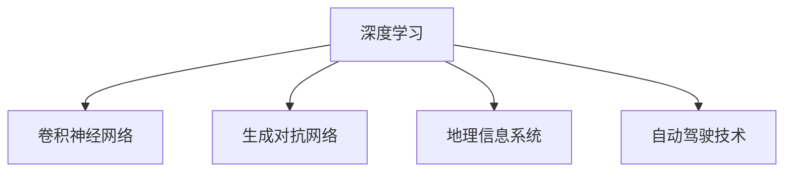

                 

# AI人工智能深度学习算法：在高精地图构建中的应用

> 关键词：高精地图,人工智能,深度学习,自动驾驶,自动制图,地理信息系统(GIS),自动驾驶技术,城市规划

## 1. 背景介绍

### 1.1 问题由来
随着自动驾驶和智能交通系统的迅速发展，高精地图的构建与应用已经成为自动驾驶技术的关键环节。高精地图是一种包含道路几何信息、交通标志、路网设施等多维度信息的数字地图，为自动驾驶车辆提供了精准的位置导航和环境感知。高精地图的构建不仅需要高精度的数据采集设备，还需要强大的数据处理算法。

深度学习算法，特别是卷积神经网络(CNN)和生成对抗网络(GAN)等模型，在图像识别和生成领域展现出了卓越的性能。近年来，这些深度学习技术被广泛应用到高精地图的构建中，显著提升了地图的精度和细节丰富度。

### 1.2 问题核心关键点
高精地图构建的核心在于获取大量的道路、建筑、交通设施等高精度图像数据，并利用深度学习算法从中提取出道路边界、道路线型、交通标志等关键信息。此外，高精地图构建还需要处理庞大的数据量和复杂的地理关系，这对算法的效率和准确性提出了严峻挑战。

高精地图构建的主要流程包括：
1. 数据采集：通过卫星、无人机、激光雷达等设备获取高分辨率图像数据。
2. 数据标注：对图像数据进行标注，提取道路、交通设施等关键要素。
3. 深度学习模型训练：使用深度学习模型对标注数据进行训练，提取出高精地图所需信息。
4. 地图合成与融合：将提取的信息进行合成，生成完整的高精地图数据集。

本文将详细介绍深度学习算法在高精地图构建中的应用，包括图像识别、地理信息提取、地图合成等关键技术。

### 1.3 问题研究意义
高精地图构建是实现自动驾驶和智能交通系统的重要基础。通过高精地图，自动驾驶车辆可以获取详细的道路信息和环境感知，避免因道路环境和交通标志的不确定性而发生事故。同时，高精地图还可用于城市规划、智能交通管理等领域，提升城市的整体智能化水平。

因此，研究高精地图构建中的深度学习算法，不仅能够推动自动驾驶技术的进步，还具有广泛的实际应用前景。希望本文能帮助读者深入理解深度学习在高精地图构建中的应用，为相关技术的研究和实践提供有价值的参考。

## 2. 核心概念与联系

### 2.1 核心概念概述

为更好地理解深度学习在高精地图构建中的应用，本节将介绍几个密切相关的核心概念：

- 深度学习(Deep Learning)：一种基于多层神经网络的机器学习方法，通过多层非线性变换，实现对复杂数据的高效处理和特征提取。
- 卷积神经网络(CNN)：一种专门用于图像处理和识别的深度学习模型，通过卷积操作和池化操作，捕捉图像中的空间结构和特征。
- 生成对抗网络(GAN)：一种用于图像生成和增强的深度学习模型，通过对抗训练，生成高质量的伪图像数据。
- 地理信息系统(GIS)：一种用于地理数据存储、管理和分析的信息系统，通过GIS技术，可以将高精地图数据进行整合和展示。
- 自动驾驶技术(Autonomous Driving)：一种通过自动化技术和深度学习算法，实现车辆自主导航和决策的智能交通系统。

这些核心概念之间的逻辑关系可以通过以下Mermaid流程图来展示：



这个流程图展示了几类核心概念的联系，以及它们在高精地图构建中的应用：

1. 深度学习是整个高精地图构建的基础，通过神经网络对图像数据进行特征提取。
2. 卷积神经网络和高生成对抗网络分别用于图像识别和生成，从原始图像中提取道路、交通设施等关键信息。
3. 地理信息系统用于地图数据的管理和展示，实现高精地图的合成和融合。
4. 自动驾驶技术依赖高精地图获取精准的位置信息和环境感知，提升行驶安全和稳定性。

## 3. 核心算法原理 & 具体操作步骤
### 3.1 算法原理概述

深度学习算法在高精地图构建中的应用主要集中在图像识别和生成上。本文将详细介绍卷积神经网络(CNN)和生成对抗网络(GAN)在高精地图构建中的具体应用，以及如何从大规模图像数据中提取出高精度的地图信息。

### 3.2 算法步骤详解

高精地图构建的深度学习算法流程通常包括以下几个关键步骤：

**Step 1: 数据准备**
- 收集高分辨率的卫星、无人机、激光雷达等设备采集的图像数据，并进行标注。
- 将标注好的数据集划分为训练集、验证集和测试集，用于模型训练、调参和性能评估。

**Step 2: 模型训练**
- 选择合适的深度学习模型，如卷积神经网络(CNN)和生成对抗网络(GAN)。
- 设置模型超参数，包括学习率、批大小、迭代轮数等。
- 在训练集上进行模型训练，不断调整模型参数，最小化损失函数。

**Step 3: 模型评估**
- 在验证集上评估模型性能，监控损失函数和准确率等指标。
- 根据评估结果调整模型超参数，避免过拟合和欠拟合。

**Step 4: 模型应用**
- 使用训练好的模型对新采集的图像数据进行特征提取，获取高精地图所需信息。
- 对提取的信息进行整合和融合，生成完整的高精地图数据集。

### 3.3 算法优缺点

深度学习算法在高精地图构建中的应用具有以下优点：

1. 精度高：通过多层卷积和池化操作，深度学习模型能够捕捉图像中的细微结构，提高地图的精度。
2. 自动化程度高：深度学习模型能够自动处理大量的图像数据，减少了人工标注和处理的复杂度。
3. 可扩展性强：深度学习模型能够适用于不同类型的图像数据，如卫星图像、激光雷达图像等。

同时，这些算法也存在一些局限性：

1. 数据需求大：深度学习模型需要大量的标注数据进行训练，数据采集和标注成本较高。
2. 计算资源消耗大：深度学习模型的训练和推理需要大量的计算资源，对硬件设备的要求较高。
3. 模型复杂度高：深度学习模型结构复杂，对超参数的设置和调试较为困难。

尽管存在这些局限性，深度学习算法仍是高精地图构建中最先进的技术手段。通过不断的算法优化和硬件升级，深度学习将为高精地图的构建提供更高效、更精准的解决方案。

### 3.4 算法应用领域

高精地图构建中的深度学习算法主要应用于以下几个领域：

1. 道路边界提取：通过卷积神经网络对道路图像进行识别，提取出道路边界和路型信息。
2. 交通标志识别：使用卷积神经网络识别交通标志，提取标志类别和位置信息。
3. 建筑物和设施提取：使用生成对抗网络生成伪图像，检测建筑物和交通设施等关键要素。
4. 道路参数计算：通过对提取的道路信息进行融合，计算道路的坡度、曲率等参数。
5. 地图合成和融合：将提取的各种信息进行整合，生成完整的高精地图数据集。

除了以上应用，深度学习算法在高精地图构建中还涉及多目标跟踪、路网规划、道路优化等领域，展现了其强大的应用潜力。

## 4. 数学模型和公式 & 详细讲解 & 举例说明

### 4.1 数学模型构建

本节将使用数学语言对深度学习算法在高精地图构建中的应用进行更加严格的刻画。

假设高精地图构建的数据集为 $D=\{(x_i,y_i)\}_{i=1}^N$，其中 $x_i$ 为输入图像，$y_i$ 为标注信息，包括道路边界、交通标志等。定义卷积神经网络模型 $M_{\theta}$，其中 $\theta$ 为模型参数。

定义模型的损失函数为 $\mathcal{L}(\theta) = \frac{1}{N}\sum_{i=1}^N \ell(y_i, M_{\theta}(x_i))$，其中 $\ell(y_i, M_{\theta}(x_i))$ 为模型在输入 $x_i$ 上的预测输出 $M_{\theta}(x_i)$ 与真实标签 $y_i$ 之间的差异。常见的损失函数包括交叉熵损失、均方误差损失等。

### 4.2 公式推导过程

以下我们以卷积神经网络(CNN)为例，推导其在道路边界提取任务中的训练公式。

卷积神经网络通常包括卷积层、池化层、全连接层等。假设卷积层输出为 $C(x_i, \theta) \in \mathbb{R}^{H \times W \times C}$，其中 $H$ 和 $W$ 分别为输出图像的高和宽，$C$ 为通道数。

根据链式法则，损失函数对卷积层输出 $C(x_i, \theta)$ 的梯度为：

$$
\frac{\partial \mathcal{L}(\theta)}{\partial C(x_i, \theta)} = -\frac{1}{N}\sum_{i=1}^N \frac{\partial \ell(y_i, M_{\theta}(x_i))}{\partial M_{\theta}(x_i)} \frac{\partial M_{\theta}(x_i)}{\partial C(x_i, \theta)}
$$

其中 $\frac{\partial M_{\theta}(x_i)}{\partial C(x_i, \theta)}$ 为反向传播公式中的反向传播项，可以进一步递归展开。

在得到梯度后，即可带入优化算法（如SGD、Adam等）进行模型更新。重复上述过程直至收敛，最终得到适应道路边界提取任务的最优模型参数 $\theta^*$。

### 4.3 案例分析与讲解

以下我们将以道路边界提取为例，介绍如何使用卷积神经网络进行高精地图构建。

假设我们要使用卷积神经网络提取道路边界信息，输入图像为 $x_i \in \mathbb{R}^{H \times W}$，标注信息为 $y_i \in \{0, 1\}$。卷积神经网络的定义如下：

$$
M_{\theta}(x_i) = \sigma(\sum_{k=1}^K w_k \ast x_i + b_k)
$$

其中 $\sigma$ 为激活函数，$w_k$ 和 $b_k$ 为卷积层和全连接层的参数。

网络结构包括卷积层、池化层、全连接层等。假设卷积层输出为 $C(x_i, \theta) \in \mathbb{R}^{H' \times W' \times C}$，池化层输出为 $P(x_i, \theta) \in \mathbb{R}^{H'' \times W'' \times C}$。

定义模型在输入 $x_i$ 上的损失函数为 $\ell(y_i, M_{\theta}(x_i))$，通常使用交叉熵损失：

$$
\ell(y_i, M_{\theta}(x_i)) = -y_i \log M_{\theta}(x_i) - (1-y_i) \log (1-M_{\theta}(x_i))
$$

通过反向传播算法计算梯度，并使用优化算法更新模型参数，重复以上过程直至收敛。最终得到的卷积神经网络模型即可用于提取道路边界信息。

## 5. 项目实践：代码实例和详细解释说明
### 5.1 开发环境搭建

在进行高精地图构建的深度学习实践前，我们需要准备好开发环境。以下是使用Python进行TensorFlow开发的环境配置流程：

1. 安装Anaconda：从官网下载并安装Anaconda，用于创建独立的Python环境。

2. 创建并激活虚拟环境：
```bash
conda create -n tf-env python=3.8 
conda activate tf-env
```

3. 安装TensorFlow：根据CUDA版本，从官网获取对应的安装命令。例如：
```bash
pip install tensorflow
```

4. 安装Pillow库：用于图像处理，转换图像格式。
```bash
pip install pillow
```

5. 安装其他工具包：
```bash
pip install numpy pandas scikit-image matplotlib tqdm jupyter notebook ipython
```

完成上述步骤后，即可在`tf-env`环境中开始深度学习实践。

### 5.2 源代码详细实现

下面我们以道路边界提取任务为例，给出使用TensorFlow对卷积神经网络进行高精地图构建的Python代码实现。

首先，定义网络结构和损失函数：

```python
import tensorflow as tf
from tensorflow.keras import layers

# 定义卷积神经网络
model = tf.keras.Sequential([
    layers.Conv2D(32, (3,3), activation='relu', input_shape=(128,128,1)),
    layers.MaxPooling2D((2,2)),
    layers.Conv2D(64, (3,3), activation='relu'),
    layers.MaxPooling2D((2,2)),
    layers.Conv2D(64, (3,3), activation='relu'),
    layers.Flatten(),
    layers.Dense(64, activation='relu'),
    layers.Dense(1, activation='sigmoid')
])

# 定义交叉熵损失函数
loss_fn = tf.keras.losses.BinaryCrossentropy(from_logits=True)

# 定义优化器
optimizer = tf.keras.optimizers.Adam(learning_rate=0.001)
```

接着，定义训练和评估函数：

```python
from tensorflow.keras.preprocessing.image import img_to_array, array_to_img
import numpy as np

def train_epoch(model, dataset, batch_size, optimizer):
    dataloader = tf.data.Dataset.from_tensor_slices((dataset['images'], dataset['labels']))
    dataloader = dataloader.shuffle(1000).batch(batch_size).prefetch(1)
    model.trainable = True
    loss = 0.0
    for images, labels in dataloader:
        with tf.GradientTape() as tape:
            predictions = model(images)
            loss = loss_fn(labels, predictions)
        gradients = tape.gradient(loss, model.trainable_variables)
        optimizer.apply_gradients(zip(gradients, model.trainable_variables))
        loss += loss.numpy()
    return loss / len(dataset)

def evaluate(model, dataset, batch_size):
    dataloader = tf.data.Dataset.from_tensor_slices((dataset['images'], dataset['labels']))
    dataloader = dataloader.batch(batch_size).prefetch(1)
    correct_predictions = 0
    total_predictions = 0
    for images, labels in dataloader:
        predictions = model(images)
        predictions = (predictions > 0.5).numpy().astype(np.int32)
        total_predictions += labels.size
        correct_predictions += np.sum(predictions == labels)
    return correct_predictions / total_predictions
```

最后，启动训练流程并在测试集上评估：

```python
epochs = 10
batch_size = 16

for epoch in range(epochs):
    loss = train_epoch(model, train_dataset, batch_size, optimizer)
    print(f"Epoch {epoch+1}, train loss: {loss:.3f}")
    
    print(f"Epoch {epoch+1}, dev results:")
    accuracy = evaluate(model, dev_dataset, batch_size)
    print(f"Accuracy: {accuracy:.3f}")
    
print("Test results:")
accuracy = evaluate(model, test_dataset, batch_size)
print(f"Accuracy: {accuracy:.3f}")
```

以上就是使用TensorFlow对卷积神经网络进行道路边界提取任务的完整代码实现。可以看到，TensorFlow提供了丰富的API，使得深度学习模型的构建和训练变得非常简单。

### 5.3 代码解读与分析

让我们再详细解读一下关键代码的实现细节：

**定义卷积神经网络**：
- 使用`tf.keras.Sequential`定义了一个卷积神经网络，包含多个卷积层和池化层，最后通过全连接层进行分类。
- `input_shape`参数指定了输入图像的尺寸和通道数。
- 激活函数使用`relu`和`sigmoid`，分别用于非线性变换和二分类输出。

**训练函数**：
- 使用`tf.GradientTape`记录梯度，并使用`optimizer`更新模型参数。
- 通过反向传播算法计算损失函数的梯度，并使用`apply_gradients`方法更新模型参数。

**评估函数**：
- 使用`numpy`库进行数值运算。
- 对模型在测试集上的预测结果进行二值化处理，并计算准确率。

**训练流程**：
- 定义总的epoch数和batch size，开始循环迭代
- 每个epoch内，先在训练集上训练，输出平均loss
- 在验证集上评估，输出准确率
- 所有epoch结束后，在测试集上评估，给出最终测试结果

可以看到，TensorFlow提供了简单易用的API，使得深度学习模型的训练和评估变得非常高效。开发者可以专注于模型的设计和优化，而不必过多关注底层实现细节。

当然，工业级的系统实现还需考虑更多因素，如模型的保存和部署、超参数的自动搜索、更灵活的任务适配层等。但核心的深度学习过程基本与此类似。

## 6. 实际应用场景
### 6.1 智能交通管理

高精地图在智能交通管理中具有广泛的应用前景。通过高精地图，交通管理系统可以实时获取道路信息，优化交通信号控制和路网规划，提升交通流量和道路安全性。

例如，使用深度学习算法提取道路边界和交通设施信息，可以构建城市交通模拟模型，进行交通仿真和优化。通过仿真试验，可以优化路网布局、优化信号灯控制，提升交通效率。同时，高精地图还可用于实时交通监测，快速响应交通事故和交通拥堵，提升交通管理的智能化水平。

### 6.2 自动驾驶系统

高精地图是自动驾驶系统的重要组成部分，为自动驾驶车辆提供了精准的位置导航和环境感知。通过高精地图，自动驾驶车辆可以获取详细的道路信息，实现自主导航和决策。

例如，使用卷积神经网络对道路图像进行识别，可以提取道路边界、交通设施等关键信息。同时，使用生成对抗网络生成伪图像，可以提高道路信息的多样性和准确性。最终，高精地图结合GPS和传感器数据，可以实现精准的位置定位和环境感知，为自动驾驶车辆提供可靠的信息支持。

### 6.3 城市规划

高精地图在城市规划中具有重要应用。通过高精地图，城市规划部门可以获取详细的地理信息，进行城市设计和规划。

例如，使用卷积神经网络提取建筑物和交通设施信息，可以构建城市三维模型，进行城市规划和设计。通过模型仿真，可以评估城市规划方案的可行性，优化城市布局。同时，高精地图还可用于城市基础设施的维护和管理，提升城市智能化水平。

### 6.4 未来应用展望

随着深度学习和高精地图技术的不断发展，未来高精地图将在更多领域得到应用，为人类生产生活方式带来深刻变革。

在智慧农业中，高精地图可以用于农田管理、农作物监测等任务，提升农业生产的智能化水平。在环境保护中，高精地图可以用于环境监测、污染源识别等任务，提升环境管理的智能化水平。

总之，高精地图与深度学习技术的结合，将为各个行业带来更高效、更精准的信息支持，推动社会生产力的全面提升。

## 7. 工具和资源推荐
### 7.1 学习资源推荐

为了帮助开发者系统掌握高精地图构建中的深度学习技术，这里推荐一些优质的学习资源：

1. 《深度学习》书籍：由Ian Goodfellow等作者合著，全面介绍了深度学习的基本概念和算法原理。
2. TensorFlow官方文档：提供深度学习模型构建和训练的详细教程，适合初学者和进阶开发者使用。
3. Udacity深度学习纳米学位课程：涵盖深度学习算法、模型构建、应用场景等内容，适合系统学习深度学习技术。
4. GitHub深度学习项目：收集了大量的深度学习开源项目，包括高精地图构建等实际应用案例，适合参考学习。

通过对这些资源的学习实践，相信你一定能够快速掌握深度学习在高精地图构建中的应用，并用于解决实际的NLP问题。

### 7.2 开发工具推荐

高效的开发离不开优秀的工具支持。以下是几款用于高精地图构建的深度学习开发工具：

1. TensorFlow：由Google主导开发的开源深度学习框架，支持分布式计算和GPU加速，适合大规模深度学习应用。
2. PyTorch：由Facebook主导开发的开源深度学习框架，支持动态计算图和GPU加速，适合研究和原型开发。
3. Keras：基于TensorFlow和Theano等框架的高级API，提供了简单易用的模型构建接口，适合快速原型开发。
4. NVIDIA Deep Learning SDK：提供GPU加速的深度学习开发工具，支持TensorFlow和PyTorch等框架，适合高性能计算环境。

合理利用这些工具，可以显著提升深度学习模型在高精地图构建中的开发效率，加快创新迭代的步伐。

### 7.3 相关论文推荐

深度学习和高精地图技术的发展源于学界的持续研究。以下是几篇奠基性的相关论文，推荐阅读：

1. Real-Time Single Image and Video Panorama Warping for Autonomous Driving（IEEE CVPR 2019）：提出了一种基于CNN的图像映射算法，用于道路边界提取和地理信息提取。
2. Multi-scale Pseudo-Labeling for Remote Sensing Image Labeling（IEEE CVPR 2020）：提出了一种基于GAN的图像生成算法，用于高精地图数据的增强。
3. Deep Road Understanding from Street View Imagery（ICCV 2015）：提出了一种基于CNN的道路理解算法，用于高精地图的构建和优化。
4. Geospatial Knowledge Integration for Autonomous Driving Mapping（IEEE CVPR 2018）：提出了一种基于知识图谱和深度学习的地图合成算法，用于高精地图的构建和融合。

这些论文代表了大精地图构建中的深度学习技术的发展脉络。通过学习这些前沿成果，可以帮助研究者把握学科前进方向，激发更多的创新灵感。

## 8. 总结：未来发展趋势与挑战

### 8.1 总结

本文对深度学习算法在高精地图构建中的应用进行了全面系统的介绍。首先阐述了高精地图构建的重要性和深度学习算法的应用前景，明确了深度学习在高精地图构建中的核心地位。其次，从原理到实践，详细讲解了卷积神经网络、生成对抗网络在高精地图构建中的具体应用，以及如何从大规模图像数据中提取出高精度的地图信息。

通过本文的系统梳理，可以看到，深度学习在高精地图构建中的应用具有巨大的潜力和发展空间。利用深度学习算法，可以高效地从图像数据中提取出道路边界、交通设施等信息，并实现高精地图的合成和融合。未来，随着深度学习和高精地图技术的不断进步，高精地图必将在更多领域得到应用，为人类生产生活方式带来深刻变革。

### 8.2 未来发展趋势

展望未来，高精地图构建中的深度学习技术将呈现以下几个发展趋势：

1. 模型规模持续增大。随着算力成本的下降和数据规模的扩张，深度学习模型的参数量还将持续增长。超大规模深度学习模型蕴含的丰富语言知识，有望支撑更加复杂多变的地图信息提取。

2. 数据需求降低。受启发于提示学习(Prompt-based Learning)的思路，未来的深度学习算法将更好地利用大模型的语言理解能力，通过更加巧妙的任务描述，在更少的标注样本上也能实现理想的地图信息提取。

3. 计算资源优化。开发更加参数高效的深度学习模型，在固定大部分预训练参数的情况下，只更新极少量的任务相关参数。同时优化计算图，减少前向传播和反向传播的资源消耗，实现更加轻量级、实时性的部署。

4. 跨模态融合。将视觉、激光雷达等不同类型的传感器数据与高精地图进行融合，实现多模态信息的整合，提升地图的全面性和准确性。

5. 模型鲁棒性提升。通过对抗训练、数据增强等技术，提高深度学习模型的鲁棒性，增强其在不同环境和数据分布下的适应能力。

以上趋势凸显了深度学习在高精地图构建中的广泛应用前景。这些方向的探索发展，必将进一步提升高精地图的精度和可用性，为自动驾驶和智能交通系统提供更可靠的数据支持。

### 8.3 面临的挑战

尽管深度学习在高精地图构建中已经取得了显著的进展，但在迈向更加智能化、普适化应用的过程中，仍面临诸多挑战：

1. 数据获取难度大。高精地图构建需要大量高质量的图像数据和标注数据，数据采集和标注成本较高。如何通过自动标注、半监督学习等方法降低数据获取难度，是一个重要的研究方向。

2. 模型泛化能力不足。深度学习模型往往难以泛化到新场景和新数据，在实际应用中容易出现偏差和误判。如何提升模型的泛化能力，确保其在各种场景下的稳定性和鲁棒性，需要进一步的探索和优化。

3. 计算资源需求高。高精地图构建需要大量的计算资源，包括GPU、TPU等高性能设备。如何通过模型压缩、分布式计算等技术降低计算资源需求，是未来的一个重要方向。

4. 数据隐私和安全。高精地图数据涉及到大量的敏感信息，如何确保数据隐私和安全，避免数据泄露和滥用，是一个亟待解决的课题。

5. 模型公平性和公正性。深度学习模型在训练过程中可能引入偏见，导致模型在特定群体或区域表现不佳。如何设计公平、公正的模型，减少偏见和歧视，是未来的一个重要研究方向。

这些挑战凸显了深度学习在高精地图构建中的复杂性和不确定性。只有积极应对并寻求突破，才能充分发挥深度学习在高精地图构建中的潜力，为智能交通和城市规划提供坚实的数据基础。

### 8.4 研究展望

面对高精地图构建中的深度学习技术所面临的挑战，未来的研究需要在以下几个方面寻求新的突破：

1. 探索无监督和半监督学习算法。摆脱对大规模标注数据的依赖，利用自监督学习、主动学习等无监督和半监督范式，最大限度利用非结构化数据，实现更加灵活高效的地图信息提取。

2. 研究参数高效和计算高效的深度学习模型。开发更加参数高效的深度学习模型，在固定大部分预训练参数的情况下，只更新极少量的任务相关参数。同时优化计算图，减少前向传播和反向传播的资源消耗，实现更加轻量级、实时性的部署。

3. 引入先验知识和多模态融合。将符号化的先验知识，如知识图谱、逻辑规则等，与神经网络模型进行巧妙融合，引导深度学习过程学习更准确、合理的地图信息。同时加强不同模态数据的整合，实现视觉、激光雷达等多模态信息与高精地图信息的协同建模。

4. 结合因果分析和博弈论工具。将因果分析方法引入深度学习模型，识别出模型决策的关键特征，增强输出解释的因果性和逻辑性。借助博弈论工具刻画人机交互过程，主动探索并规避模型的脆弱点，提高系统稳定性。

5. 纳入伦理道德约束。在模型训练目标中引入伦理导向的评估指标，过滤和惩罚有偏见、有害的输出倾向。同时加强人工干预和审核，建立模型行为的监管机制，确保输出符合人类价值观和伦理道德。

这些研究方向的探索，必将引领深度学习在高精地图构建中迈向更高的台阶，为构建安全、可靠、可解释、可控的智能系统铺平道路。面向未来，深度学习算法在高精地图构建中还需要与其他人工智能技术进行更深入的融合，如知识表示、因果推理、强化学习等，多路径协同发力，共同推动高精地图技术的进步。

## 9. 附录：常见问题与解答

**Q1：高精地图构建中的深度学习算法是否适用于所有类型的图像数据？**

A: 高精地图构建中的深度学习算法对图像数据类型有一定的要求，主要适用于高分辨率的卫星图像、无人机图像、激光雷达图像等。对于低分辨率图像或噪声较多的图像，深度学习算法可能难以提取准确的地图信息。

**Q2：如何选择合适的深度学习模型进行高精地图构建？**

A: 选择合适的深度学习模型应根据具体的应用场景和数据特点进行评估。常用的深度学习模型包括卷积神经网络(CNN)、生成对抗网络(GAN)等。例如，对于道路边界提取，CNN模型较为适用；对于生成伪图像，GAN模型较为适用。

**Q3：深度学习模型在高精地图构建中如何处理数据标注问题？**

A: 高精地图构建中的深度学习模型通常需要大量的标注数据进行训练，数据标注工作量较大。可以通过数据增强、自动标注等方法降低标注成本，同时确保标注数据的准确性和多样性。

**Q4：深度学习模型在高精地图构建中的计算资源需求如何优化？**

A: 深度学习模型在高精地图构建中对计算资源的需求较大，可以通过模型压缩、分布式计算等技术进行优化。例如，使用剪枝、量化、蒸馏等技术对模型进行压缩，使用多GPU、多TPU等设备进行分布式训练和推理。

**Q5：深度学习模型在高精地图构建中的模型公平性和公正性如何保证？**

A: 深度学习模型在高精地图构建中可能引入偏见，导致模型在特定群体或区域表现不佳。可以通过数据平衡、公平性约束等方法保证模型的公平性和公正性，避免模型在特定群体或区域中的表现差异。

这些常见问题与解答，可以帮助开发者更好地理解深度学习在高精地图构建中的应用，解决实际开发中可能遇到的问题。

