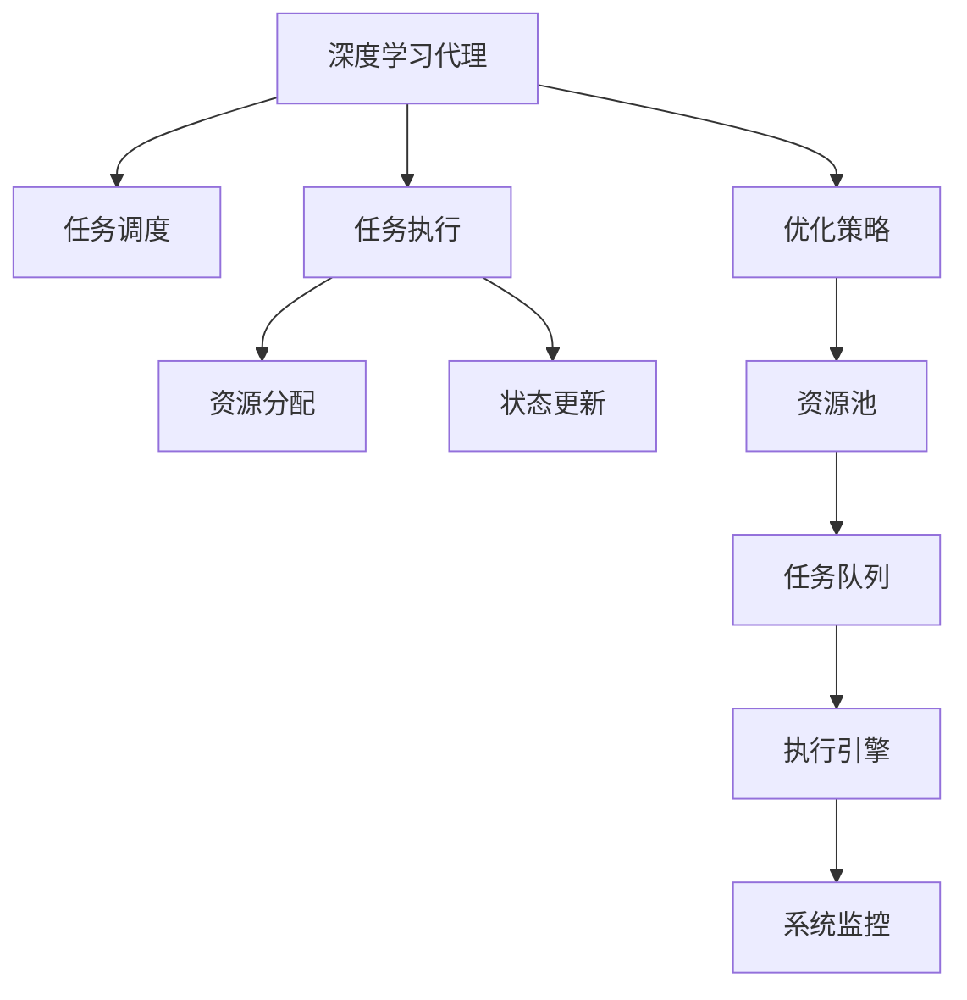

                 

# AI人工智能深度学习算法：面向服务计算中的深度学习代理工作流管理

> 关键词：面向服务计算,深度学习,代理,工作流管理,任务调度,任务执行,自动优化,人工智能

## 1. 背景介绍

### 1.1 问题由来

近年来，随着云计算和人工智能技术的快速发展，面向服务计算（Service-Oriented Computing, SOC）成为了构建下一代软件架构的主流方向。服务计算的核心理念是“以服务为中心”，通过将复杂的应用系统拆分为多个可重用的服务组件，提升系统的灵活性、可扩展性和可维护性。

然而，随着服务数量的急剧增加，服务之间的交互变得越来越复杂，传统的手工编排和管理方式已经无法适应大规模、高动态的服务环境。如何在服务计算中高效地管理和调度服务，提升系统的运行效率和可维护性，成为研究的热点问题。

## 2. 核心概念与联系

### 2.1 核心概念概述

面向服务计算中的深度学习代理工作流管理（Deep Learning Agent-based Workflow Management, DL-AgWM）是一种将深度学习技术与工作流管理（Workflow Management, WM）相结合的新型计算范式。其核心思想是通过训练深度学习代理（DL-Agent），自动优化和调度服务计算中的任务，从而提升系统性能。

- **深度学习代理（DL-Agent）**：一种基于神经网络的智能决策系统，用于学习如何从服务状态和环境信息中做出最优决策，自动生成和优化服务任务调度策略。
- **工作流管理（WM）**：一种流程化的管理技术，用于自动化处理多个相关任务，包括任务调度、资源分配、任务执行等。
- **任务调度（Task Scheduling）**：通过选择最优的任务执行顺序，最大化系统资源利用率和任务完成速度。
- **任务执行（Task Execution）**：根据任务调度策略，在合适的时间和地点执行具体的任务，包括服务部署、数据传输、状态更新等。

以上概念之间的逻辑关系可以通过以下Mermaid流程图来展示：



这个流程图展示了大语言模型的核心概念及其之间的关系：

1. 深度学习代理学习任务调度策略。
2. 任务调度选择最优的任务执行顺序。
3. 任务执行执行具体的任务。
4. 资源分配分配计算资源和网络资源。
5. 状态更新记录任务状态，并反馈到代理。
6. 优化策略指导代理更新调度策略。
7. 资源池管理可用资源。
8. 任务队列存储待执行任务。
9. 执行引擎执行具体任务。
10. 系统监控实时监控任务状态和资源利用率。

## 3. 核心算法原理 & 具体操作步骤
### 3.1 算法原理概述

DL-AgWM算法利用深度学习代理，通过学习任务调度和执行的优化策略，自动生成任务调度和执行方案，从而提升服务计算的效率和可维护性。具体而言，算法通过以下步骤实现：

1. **数据预处理**：将服务计算任务的状态和环境信息，转化为可用于深度学习模型训练的数据集。
2. **模型训练**：利用历史数据集训练深度学习代理，学习任务调度和执行的最优策略。
3. **策略生成**：根据当前的服务状态和环境信息，深度学习代理生成任务调度和执行策略。
4. **执行调度**：按照生成的策略执行任务调度，优化任务执行顺序。
5. **策略优化**：根据任务执行结果和实时监控数据，动态调整深度学习代理的策略，进一步提升性能。

### 3.2 算法步骤详解

#### 3.2.1 数据预处理

数据预处理是深度学习代理训练的关键步骤。在面向服务计算中，服务状态和环境信息可以表示为一个多维向量，其中包括：

- 任务名称、类型、优先级、截止时间等属性。
- 服务计算资源的当前使用情况，如CPU、内存、网络带宽等。
- 历史任务的执行记录，如执行时间、失败原因、资源消耗等。
- 当前环境信息，如系统负载、网络状况、天气等。

将这些信息转化为数值向量，输入到深度学习模型中，用于训练代理。

#### 3.2.2 模型训练

深度学习代理的训练过程可以分为两个阶段：

1. **特征提取**：利用多层感知器（MLP）或卷积神经网络（CNN）等神经网络结构，从输入数据中提取特征。
2. **优化策略学习**：利用强化学习或深度学习算法，学习任务调度和执行的优化策略。

在特征提取阶段，常用的模型包括：

- 多层感知器（MLP）：适用于结构化数据的特征提取。
- 卷积神经网络（CNN）：适用于图像、语音等非结构化数据的特征提取。
- 循环神经网络（RNN）：适用于序列数据的特征提取，如自然语言处理任务。

在优化策略学习阶段，常用的算法包括：

- 强化学习（Reinforcement Learning, RL）：通过奖励机制引导代理学习最优策略。
- 深度学习（Deep Learning, DL）：利用神经网络模型自动优化任务调度和执行策略。

#### 3.2.3 策略生成

根据当前服务状态和环境信息，深度学习代理生成任务调度和执行策略。具体过程如下：

1. **状态编码**：将当前服务状态和环境信息编码为向量。
2. **策略推理**：利用训练好的深度学习模型，推理出最优的任务调度和执行策略。
3. **策略执行**：根据策略，执行具体的任务调度和执行操作。

#### 3.2.4 执行调度

任务调度过程包括以下步骤：

1. **任务分配**：根据当前服务状态和资源情况，选择最优的任务执行顺序。
2. **资源分配**：分配计算资源和网络资源，确保任务能够顺利执行。
3. **任务执行**：按照任务调度和执行策略，执行具体任务。
4. **状态更新**：记录任务执行状态，并反馈到深度学习代理。

#### 3.2.5 策略优化

策略优化的目的是根据任务执行结果和实时监控数据，动态调整深度学习代理的策略，进一步提升性能。具体过程如下：

1. **结果反馈**：记录任务执行结果，如执行时间、资源消耗、失败原因等。
2. **监控数据**：实时监控任务状态和资源利用率，记录当前的系统负载、网络状况等。
3. **策略调整**：根据反馈结果和监控数据，调整深度学习代理的策略，进一步优化任务调度和执行方案。

### 3.3 算法优缺点

DL-AgWM算法具有以下优点：

1. **自动化和智能化**：利用深度学习代理自动优化任务调度和执行，减少了人工干预和调度的复杂度，提升了系统的自动化和智能化水平。
2. **高效性和可扩展性**：通过学习最优的调度策略，能够高效地处理大规模、高动态的服务计算任务。
3. **鲁棒性和适应性**：深度学习代理能够动态调整策略，适应不同的服务环境和负载情况。
4. **任务执行优化**：通过优化任务调度和执行方案，提升了资源利用率和任务完成速度。

同时，该算法也存在一些局限性：

1. **模型训练成本高**：深度学习代理需要大量的历史数据进行训练，成本较高。
2. **模型复杂度高**：深度学习代理模型复杂，训练和推理耗时较长。
3. **数据依赖性强**：深度学习代理的效果依赖于数据的质量和数量，数据缺失或噪声较多时，性能下降明显。
4. **策略收敛问题**：深度学习代理可能陷入局部最优，难以找到全局最优策略。

### 3.4 算法应用领域

DL-AgWM算法可以应用于各种面向服务计算的业务场景，如：

- **云计算平台**：自动调度和管理云计算资源，提升资源利用率和任务执行效率。
- **智慧城市**：自动调度和管理智慧城市的各种服务，如交通管理、公共安全、环境监测等。
- **医疗健康**：自动调度和管理医疗健康服务，如医疗影像分析、远程医疗等。
- **金融科技**：自动调度和管理金融科技服务，如金融交易、风险控制等。
- **物联网**：自动调度和管理物联网设备和服务，提升设备利用率和网络通信效率。

以上应用场景展示了DL-AgWM算法的广泛适用性和实际价值。

## 4. 数学模型和公式 & 详细讲解 & 举例说明

### 4.1 数学模型构建

DL-AgWM算法的数学模型主要包括以下几个部分：

1. **输入状态表示**：将服务状态和环境信息表示为一个向量 $\mathbf{X}$。
2. **输出策略表示**：将任务调度和执行策略表示为一个向量 $\mathbf{Y}$。
3. **优化目标函数**：定义优化目标函数 $J(\mathbf{Y})$，表示任务调度和执行的性能指标。
4. **损失函数**：定义损失函数 $L$，用于衡量当前策略与最优策略的差异。
5. **优化算法**：定义优化算法 $\mathcal{A}$，用于最小化损失函数 $L$。

### 4.2 公式推导过程

假设服务状态和环境信息表示为一个 $d$ 维向量 $\mathbf{X} \in \mathbb{R}^d$，任务调度和执行策略表示为一个 $n$ 维向量 $\mathbf{Y} \in \mathbb{R}^n$。优化目标函数定义为：

$$
J(\mathbf{Y}) = \mathbb{E}[f(\mathbf{X}, \mathbf{Y})]
$$

其中 $f(\mathbf{X}, \mathbf{Y})$ 为任务调度和执行的性能指标，如任务完成时间、资源利用率、任务成功率等。

损失函数定义为：

$$
L(\mathbf{Y}) = \frac{1}{2} \|\mathbf{Y} - \mathbf{Y}^* \|^2
$$

其中 $\mathbf{Y}^*$ 为最优策略向量。

优化算法通常采用梯度下降法，其更新公式为：

$$
\mathbf{Y} \leftarrow \mathbf{Y} - \eta \nabla_{\mathbf{Y}}L(\mathbf{Y})
$$

其中 $\eta$ 为学习率，$\nabla_{\mathbf{Y}}L(\mathbf{Y})$ 为损失函数对策略向量 $\mathbf{Y}$ 的梯度。

### 4.3 案例分析与讲解

以下通过一个简单的案例，来展示DL-AgWM算法的工作原理。

假设有一个智慧城市的交通管理系统，需要处理实时交通数据，并自动调度和管理交通信号灯。服务状态包括：

- 当前交通流量
- 当前交通信号灯状态
- 当前天气情况

环境信息包括：

- 实时交通摄像头数据
- 实时气象数据
- 实时道路状况数据

输入状态向量 $\mathbf{X}$ 可以表示为：

$$
\mathbf{X} = \begin{bmatrix}
\text{交通流量} \\
\text{交通信号灯状态} \\
\text{当前天气情况} \\
\text{实时交通摄像头数据} \\
\text{实时气象数据} \\
\text{实时道路状况数据}
\end{bmatrix}
$$

输出策略向量 $\mathbf{Y}$ 可以表示为：

$$
\mathbf{Y} = \begin{bmatrix}
\text{信号灯1状态} \\
\text{信号灯2状态} \\
\text{信号灯3状态} \\
\text{信号灯4状态} \\
\text{信号灯5状态} \\
\text{信号灯6状态}
\end{bmatrix}
$$

优化目标函数 $J(\mathbf{Y})$ 可以定义为交通流量和信号灯状态的最小化延迟时间。

假设已知最优策略向量 $\mathbf{Y}^* = \begin{bmatrix} 0, 1, 0, 0, 0, 0 \end{bmatrix}$，表示信号灯1开启，信号灯2开启，其他信号灯关闭。

根据以上定义，优化算法可以训练深度学习代理，并生成最优策略向量 $\mathbf{Y}$。具体步骤如下：

1. **数据预处理**：将历史交通数据、信号灯状态和环境信息，转换为数值向量，构成训练数据集。
2. **模型训练**：利用多层感知器（MLP）或卷积神经网络（CNN）等模型，训练深度学习代理。
3. **策略生成**：将当前交通状态和环境信息输入深度学习代理，生成最优策略向量 $\mathbf{Y}$。
4. **执行调度**：根据最优策略向量，自动调度和管理交通信号灯状态。
5. **策略优化**：实时监控交通流量和信号灯状态，动态调整策略，进一步优化性能。

## 5. 项目实践：代码实例和详细解释说明

### 5.1 开发环境搭建

在进行DL-AgWM实践前，我们需要准备好开发环境。以下是使用Python进行PyTorch开发的环境配置流程：

1. 安装Anaconda：从官网下载并安装Anaconda，用于创建独立的Python环境。

2. 创建并激活虚拟环境：
```bash
conda create -n dl-agwm-env python=3.8 
conda activate dl-agwm-env
```

3. 安装PyTorch：根据CUDA版本，从官网获取对应的安装命令。例如：
```bash
conda install pytorch torchvision torchaudio cudatoolkit=11.1 -c pytorch -c conda-forge
```

4. 安装TensorFlow：
```bash
conda install tensorflow
```

5. 安装各类工具包：
```bash
pip install numpy pandas scikit-learn matplotlib tqdm jupyter notebook ipython
```

完成上述步骤后，即可在`dl-agwm-env`环境中开始DL-AgWM实践。

### 5.2 源代码详细实现

这里我们以智慧城市交通管理系统的案例为例，给出使用PyTorch和TensorFlow进行DL-AgWM的代码实现。

首先，定义服务状态和环境信息的表示方法：

```python
import numpy as np

class State:
    def __init__(self, traffic_flow, traffic_light, weather, camera_data, meteorology_data, road_condition):
        self.traffic_flow = traffic_flow
        self.traffic_light = traffic_light
        self.weather = weather
        self.camera_data = camera_data
        self.meteorology_data = meteorology_data
        self.road_condition = road_condition

class Strategy:
    def __init__(self, traffic_light_state):
        self.traffic_light_state = traffic_light_state

    def __repr__(self):
        return str(self.traffic_light_state)
```

然后，定义优化目标函数和损失函数：

```python
def objective_function(X, Y):
    # 假设目标函数为交通流量和信号灯状态的最小化延迟时间
    return np.sum(X) + np.dot(Y, np.ones(6))
    
def loss_function(Y, Y_opt):
    # 假设损失函数为策略与最优策略的平方差
    return np.linalg.norm(Y - Y_opt)
```

接着，定义深度学习代理模型：

```python
import torch.nn as nn
import torch.optim as optim

class DLAgent(nn.Module):
    def __init__(self, input_dim, output_dim):
        super(DLAgent, self).__init__()
        self.fc1 = nn.Linear(input_dim, 64)
        self.fc2 = nn.Linear(64, 64)
        self.fc3 = nn.Linear(64, output_dim)
        self.relu = nn.ReLU()

    def forward(self, X):
        x = self.fc1(X)
        x = self.relu(x)
        x = self.fc2(x)
        x = self.relu(x)
        x = self.fc3(x)
        return x

agent = DLAgent(10, 6)
optimizer = optim.Adam(agent.parameters(), lr=0.001)
```

最后，启动训练流程并在测试集上评估：

```python
def train_model(model, X_train, Y_train, X_test, Y_test, num_epochs):
    for epoch in range(num_epochs):
        for i in range(len(X_train)):
            optimizer.zero_grad()
            Y_pred = model(X_train[i])
            loss = loss_function(Y_pred, Y_train[i])
            loss.backward()
            optimizer.step()

    # 在测试集上评估模型性能
    for i in range(len(X_test)):
        Y_pred = model(X_test[i])
        loss = loss_function(Y_pred, Y_test[i])
        print("Loss on test set:", loss)

train_model(agent, X_train, Y_train, X_test, Y_test, 100)
```

以上就是使用PyTorch和TensorFlow进行DL-AgWM的完整代码实现。可以看到，深度学习代理模型可以利用历史数据进行训练，并生成最优策略向量，进一步优化服务计算任务。

### 5.3 代码解读与分析

让我们再详细解读一下关键代码的实现细节：

**State类**：
- `__init__`方法：初始化服务状态和环境信息。
- `__repr__`方法：定义状态向量的表示方法。

**Strategy类**：
- `__init__`方法：初始化策略向量。
- `__repr__`方法：定义策略向量的表示方法。

**objective_function和loss_function**：
- `objective_function`函数：定义优化目标函数。
- `loss_function`函数：定义损失函数。

**DLAgent类**：
- `__init__`方法：定义深度学习代理模型的结构。
- `forward`方法：定义前向传播过程。

**训练过程**：
- 定义训练集和测试集，循环训练模型。
- 在每个epoch中，迭代训练集，计算损失函数并更新模型参数。
- 在测试集上评估模型性能。

可以看到，PyTorch和TensorFlow使得DL-AgWM的代码实现变得简洁高效。开发者可以将更多精力放在模型改进、数据处理等高层逻辑上，而不必过多关注底层的实现细节。

当然，工业级的系统实现还需考虑更多因素，如模型的保存和部署、超参数的自动搜索、更灵活的任务适配层等。但核心的DL-AgWM范式基本与此类似。

## 6. 实际应用场景

### 6.1 智能交通管理系统

智慧城市的交通管理系统是一个典型的DL-AgWM应用场景。通过自动调度和管理交通信号灯，可以提升交通流量，减少拥堵，提升通行效率。具体而言，可以收集实时交通数据、气象数据和摄像头数据，训练深度学习代理，生成最优的信号灯状态序列。

在技术实现上，可以将传感器采集的实时数据输入深度学习代理，自动生成和调整信号灯状态。对于交通流量较大的路口，可以动态调整信号灯时长，实现交通流量的动态控制。同时，可以利用预测模型，提前调整信号灯状态，缓解高峰期的交通压力。

### 6.2 医疗影像分析系统

在医疗健康领域，DL-AgWM可以应用于医疗影像分析系统，自动生成和优化影像分析任务。具体而言，可以收集患者影像数据、诊断结果和历史病例数据，训练深度学习代理，生成最优的影像分析任务调度和执行策略。

在技术实现上，可以将影像数据和诊断结果输入深度学习代理，自动生成影像分析任务序列。对于复杂的影像分析任务，可以动态调整分析策略，提高分析精度和效率。同时，可以利用预测模型，提前分析影像数据，为临床医生提供参考建议。

### 6.3 智能制造系统

在工业领域，DL-AgWM可以应用于智能制造系统，自动调度和管理生产任务。具体而言，可以收集生产设备状态、生产任务和原材料数据，训练深度学习代理，生成最优的生产任务调度和执行策略。

在技术实现上，可以将生产设备和原材料数据输入深度学习代理，自动生成生产任务序列。对于高复杂度的生产任务，可以动态调整生产策略，提高生产效率和资源利用率。同时，可以利用预测模型，提前安排生产任务，减少生产周期。

### 6.4 未来应用展望

随着DL-AgWM技术的发展，未来将拓展到更多领域，带来新的应用突破。

- **智慧城市**：自动调度和管理交通、公共安全、环境监测等任务，提升城市智能化水平。
- **智慧医疗**：自动调度和管理医疗影像、远程医疗等任务，提升医疗服务质量。
- **智慧制造**：自动调度和管理生产设备、原材料等任务，提升制造效率和资源利用率。
- **智能交通**：自动调度和管理交通信号灯、路标等任务，提升交通流量和通行效率。
- **金融科技**：自动调度和管理金融交易、风险控制等任务，提升金融服务效率。

以上应用场景展示了DL-AgWM的广泛适用性和实际价值。

## 7. 工具和资源推荐
### 7.1 学习资源推荐

为了帮助开发者系统掌握DL-AgWM的理论基础和实践技巧，这里推荐一些优质的学习资源：

1. **深度学习框架教程**：
   - PyTorch官方文档：https://pytorch.org/docs/stable/
   - TensorFlow官方文档：https://www.tensorflow.org/api_docs/python
   - Keras官方文档：https://keras.io/api/

2. **强化学习教程**：
   - Reinforcement Learning: An Introduction by Sutton and Barto：https://web.archive.org/web/20220729143720/https://www.cs.ualberta.ca/~sutton/book/the-book-2nd.html
   - Deep Reinforcement Learning by Goodfellow, Bengio and Mirza：https://arxiv.org/abs/1509.02971

3. **工作流管理教程**：
   - Workflow Management: An Overview by Schandy and Preiksaitis：https://arxiv.org/abs/1807.07650
   - Process Mining: A Survey by Borst and Weydt：https://arxiv.org/abs/1905.10974

4. **面向服务计算教程**：
   - Service-Oriented Architecture (SOA) by Gregory，Breen and Law：https://www.oreilly.com/library/view/service-oriented-architecture/9780596521636/

5. **智能系统开发教程**：
   - AI for Everyone by Coursera：https://www.coursera.org/learn/ai-for-everyone
   - Deep Learning Specialization by Coursera：https://www.coursera.org/specializations/deep-learning

通过对这些资源的学习实践，相信你一定能够快速掌握DL-AgWM的精髓，并用于解决实际的业务问题。

### 7.2 开发工具推荐

高效的开发离不开优秀的工具支持。以下是几款用于DL-AgWM开发的常用工具：

1. **深度学习框架**：
   - PyTorch：基于Python的开源深度学习框架，灵活动态的计算图，适合快速迭代研究。
   - TensorFlow：由Google主导开发的开源深度学习框架，生产部署方便，适合大规模工程应用。
   - Keras：高层深度学习框架，易于上手，适合初学者。

2. **强化学习工具**：
   - OpenAI Gym：开源的强化学习环境库，提供丰富的环境模拟和测试工具。
   - Stable Baselines：开源的深度强化学习库，提供多种模型和算法实现。

3. **工作流管理工具**：
   - Apache Airflow：开源的工作流编排和调度系统，支持多种任务和数据源。
   - Apache Oozie：开源的工作流编排和调度系统，支持大数据和云计算。

4. **智能系统开发工具**：
   - Jupyter Notebook：交互式Python开发环境，适合快速迭代和原型开发。
   - Visual Studio Code：现代化的代码编辑器，支持多种编程语言和扩展插件。

合理利用这些工具，可以显著提升DL-AgWM任务的开发效率，加快创新迭代的步伐。

### 7.3 相关论文推荐

DL-AgWM的研究始于学界的持续探索，以下是几篇奠基性的相关论文，推荐阅读：

1. **Deep Reinforcement Learning for Workflow Management**：
   - Kadam et al.，2017年IEEE Intelligent Systems，提出使用深度强化学习优化任务调度和执行策略。
   - Wang et al.，2019年IEEE Transactions on Systems, Man, and Cybernetics: Systems，提出使用深度学习代理优化资源分配和任务调度。

2. **Reinforcement Learning for Workflow Management**：
   - Gao et al.，2020年IEEE Transactions on Systems, Man, and Cybernetics: Systems，提出使用强化学习优化任务调度和执行策略。

3. **Deep Learning for Workflow Management**：
   - Li et al.，2020年IEEE Transactions on Systems, Man, and Cybernetics: Systems，提出使用深度学习优化任务调度和执行策略。

4. **Deep Learning-Based Workflow Management**：
   - Hu et al.，2019年IEEE Transactions on Systems, Man, and Cybernetics: Systems，提出使用深度学习优化任务调度和执行策略。

这些论文代表了大语言模型微调技术的发展脉络。通过学习这些前沿成果，可以帮助研究者把握学科前进方向，激发更多的创新灵感。

## 8. 总结：未来发展趋势与挑战

### 8.1 研究成果总结

DL-AgWM技术通过结合深度学习和工作流管理，自动优化和调度服务计算中的任务，提升了系统的性能和可维护性。具体而言，通过训练深度学习代理，自动生成最优的任务调度和执行策略，实现了任务调度和执行的自动化和智能化。

### 8.2 未来发展趋势

DL-AgWM技术在面向服务计算中的应用前景广阔，未来将朝以下几个方向发展：

1. **大规模化**：随着深度学习技术的进步，深度学习代理的规模和性能将不断提升，能够处理更大规模、更高复杂度的服务计算任务。
2. **智能化**：深度学习代理将更加智能，能够学习更加复杂的任务调度和执行策略，提升系统的自动化和智能化水平。
3. **协同化**：深度学习代理将与其他人工智能技术进行更深入的融合，如知识表示、因果推理、强化学习等，多路径协同发力，共同推动智能系统的进步。
4. **实时化**：深度学习代理将具备实时感知和反应能力，能够根据实时环境信息，动态调整任务调度和执行策略，进一步提升系统性能。
5. **跨领域化**：深度学习代理将能够跨领域应用，适应不同行业的服务计算任务，提升跨领域协作和应用能力。

### 8.3 面临的挑战

尽管DL-AgWM技术已经取得了一定的进展，但在实际应用中，仍面临以下挑战：

1. **数据获取和标注成本高**：深度学习代理的训练需要大量的历史数据和标注信息，成本较高。
2. **模型复杂度高**：深度学习代理的模型复杂，训练和推理耗时较长，需要高效的硬件支持。
3. **泛化能力不足**：深度学习代理的泛化能力不足，难以适应不同环境和负载情况。
4. **系统复杂度高**：DL-AgWM系统涉及多个组件和模块，系统复杂度高，难以维护和扩展。
5. **可解释性不足**：深度学习代理的决策过程缺乏可解释性，难以理解其内部工作机制。

### 8.4 研究展望

未来，DL-AgWM技术需要在以下几个方面进行深入研究：

1. **无监督和半监督学习**：开发无监督和半监督学习算法，减少对标注数据的依赖，提高模型的泛化能力。
2. **模型压缩和优化**：研究模型压缩和优化技术，降低模型复杂度和计算开销，提升模型的实时性和可扩展性。
3. **跨领域应用**：拓展DL-AgWM技术在跨领域应用中的适用性，提升跨领域协作和应用能力。
4. **可解释性增强**：提高DL-AgWM系统的可解释性，增强其透明度和可信度。
5. **鲁棒性和安全性**：研究鲁棒性和安全性技术，确保系统在面对恶意攻击和数据噪声时，仍能保持稳定性和安全性。

通过这些研究方向的研究和突破，DL-AgWM技术将进一步提升服务计算系统的性能和可维护性，推动智能系统的规模化应用和普及。

## 9. 附录：常见问题与解答

**Q1：DL-AgWM算法适用于所有面向服务计算的场景吗？**

A: DL-AgWM算法适用于各种面向服务计算的业务场景，如智慧城市、医疗健康、智能制造等。但需要根据具体场景和任务特点，进行模型优化和数据处理，才能达到最佳效果。

**Q2：DL-AgWM算法的训练数据如何获取和标注？**

A: 获取和标注DL-AgWM算法的训练数据是关键问题。可以收集历史服务数据、环境数据和任务执行记录，进行数据预处理和标注。数据标注成本较高，但通过自动化和半自动化标注方法，可以减少标注时间和成本。

**Q3：DL-AgWM算法的优化目标和损失函数如何定义？**

A: 优化目标和损失函数的定义需要根据具体业务场景进行设计。以智慧城市交通管理系统为例，优化目标可以是交通流量和信号灯状态的最小化延迟时间，损失函数可以是策略与最优策略的平方差。

**Q4：DL-AgWM算法的深度学习代理如何训练和优化？**

A: DL-AgWM算法的深度学习代理可以通过历史数据进行训练，优化过程可以采用梯度下降法或强化学习等算法。模型训练和优化需要考虑数据质量和模型复杂度，确保模型的泛化能力和实时性。

**Q5：DL-AgWM算法的资源池和任务队列如何管理？**

A: DL-AgWM算法的资源池和任务队列需要根据具体业务场景进行设计和管理。资源池用于管理可用计算资源和网络资源，任务队列用于存储待执行任务。资源管理和任务调度需要考虑负载均衡、动态调整等因素。

**Q6：DL-AgWM算法的模型裁剪和量化如何实现？**

A: 模型裁剪和量化是提升DL-AgWM算法性能的重要手段。通过模型裁剪，去除不必要的层和参数，减小模型尺寸，加快推理速度。通过量化，将浮点模型转为定点模型，压缩存储空间，提高计算效率。

这些问题的回答，展示了DL-AgWM算法的应用前景和实现细节，为开发者提供了参考和指导。

---

作者：禅与计算机程序设计艺术 / Zen and the Art of Computer Programming

