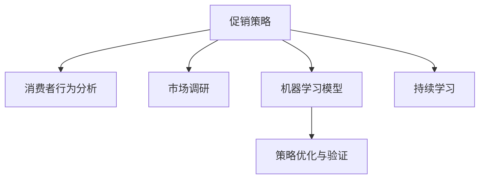

                 

# AI优化促销策略：案例分析与实践

## 1. 背景介绍

### 1.1 问题由来

在当今数字化商业环境中，促销活动已成为企业吸引消费者、提高销售额的关键手段。然而，促销策略的制定和优化是一个复杂且耗时的过程，涉及到消费者行为分析、市场调研、竞争对手策略等多个方面。传统的方法依赖人工经验，容易陷入主观偏见，且效果难以量化评估。

近年来，人工智能(AI)技术在零售和电商领域得到了广泛应用。通过数据分析和机器学习算法，AI可以提供更加科学、精准的促销策略制定建议，从而显著提升企业的运营效率和销售业绩。本案例分析将展示如何利用AI技术对促销策略进行优化，并通过具体实践验证其有效性。

### 1.2 问题核心关键点

基于AI的促销策略优化，核心在于：

1. **数据收集与预处理**：收集用户行为数据、市场数据、竞争对手数据等，构建数据集。
2. **特征工程**：通过特征提取、降维等技术，将原始数据转化为模型可以处理的形式。
3. **模型选择与训练**：选择合适的机器学习模型，如回归、分类、聚类等，使用历史促销活动数据进行训练。
4. **策略优化与验证**：通过模拟实验或实际应用，对促销策略进行优化和效果评估。
5. **持续学习与调整**：根据新数据和新环境的变化，不断更新模型和策略。

这些关键点构成了AI优化促销策略的基本框架，帮助我们从数据驱动的角度，科学制定和优化促销策略。

## 2. 核心概念与联系

### 2.1 核心概念概述

为更好地理解AI在促销策略优化中的应用，本节将介绍几个核心概念：

- **促销策略**：指企业为吸引消费者而采取的各种手段，包括打折、赠品、积分奖励等。
- **消费者行为分析**：通过对消费者购买历史、浏览行为、评价等数据进行分析，了解消费者的偏好和需求。
- **市场调研**：通过问卷调查、焦点小组等方式收集消费者和市场信息，指导促销策略的制定。
- **机器学习模型**：利用统计学和数学算法，从数据中学习规律，对促销策略进行预测和优化。
- **持续学习**：使模型能够根据新数据和新环境的变化进行自我调整，保持最优状态。

这些核心概念之间的逻辑关系可以通过以下Mermaid流程图来展示：



这个流程图展示了我们从促销策略的制定到优化，再到效果验证和持续学习的全过程。

## 3. 核心算法原理 & 具体操作步骤
### 3.1 算法原理概述

AI优化促销策略的核心思想是利用历史数据和机器学习模型，预测和优化促销活动的效果。其核心算法原理如下：

- **数据驱动**：通过收集和分析大量历史数据，发现消费者行为和促销效果之间的规律。
- **模型训练**：选择合适的机器学习模型，如回归、分类、聚类等，使用历史数据进行训练，得到促销效果预测模型。
- **策略优化**：根据预测模型的输出，对促销策略进行优化和调整，以达到最佳的销售效果。
- **效果评估**：通过模拟实验或实际应用，评估优化后的促销策略效果，验证其有效性。

### 3.2 算法步骤详解

基于AI的促销策略优化，一般包括以下几个关键步骤：

**Step 1: 数据收集与预处理**

- 收集用户行为数据、市场调研数据、竞争对手数据等，构建历史促销活动的数据集。
- 对数据进行清洗和预处理，包括去除异常值、填充缺失值、数据归一化等。

**Step 2: 特征工程**

- 对原始数据进行特征提取，如用户购买频率、浏览时长、产品类别等。
- 进行特征降维，使用PCA、LDA等技术，将高维数据转化为低维特征，减少计算复杂度。

**Step 3: 模型选择与训练**

- 选择合适的机器学习模型，如线性回归、逻辑回归、随机森林等，使用历史数据进行训练。
- 设置模型的超参数，如学习率、正则化系数等，通过交叉验证选择最佳参数组合。

**Step 4: 策略优化与验证**

- 根据预测模型的输出，对促销策略进行优化，如选择最优的促销方式、促销时间等。
- 使用模拟实验或实际应用数据，验证优化后的促销策略效果，评估销售增长率、用户参与度等指标。

**Step 5: 持续学习与调整**

- 根据新数据和新环境的变化，定期更新模型，确保其始终保持最优状态。
- 结合专家经验和市场动态，调整优化策略，确保策略的可行性和有效性。

### 3.3 算法优缺点

基于AI的促销策略优化方法具有以下优点：

1. **数据驱动**：利用历史数据和机器学习模型，科学制定促销策略，避免了人工经验的主观偏见。
2. **效果量化**：通过模拟实验和实际应用数据，可以量化评估促销策略的效果，帮助企业决策。
3. **自动化优化**：模型自动进行特征提取和参数调整，减少了人工工作量，提高了优化效率。
4. **持续改进**：模型能够根据新数据和新环境的变化进行自我调整，保持最优状态。

同时，该方法也存在一些局限性：

1. **数据依赖**：需要大量的历史数据进行训练，数据质量和数据量对模型效果有很大影响。
2. **模型复杂**：机器学习模型参数多，需要较强的计算资源和专业知识进行训练和调试。
3. **结果解释**：模型的输出往往是“黑盒”的，难以解释其内部工作机制和决策逻辑。
4. **市场变化**：市场动态变化快，模型可能难以快速适应新情况，需要不断调整和优化。

尽管存在这些局限性，但基于AI的促销策略优化方法在实际应用中已被证明是有效的，为零售和电商领域带来了显著的运营效益。

### 3.4 算法应用领域

AI优化促销策略的方法在多个领域得到了广泛应用，包括：

- **零售商**：通过分析消费者行为，制定个性化促销策略，提升销售额和客户满意度。
- **电商企业**：利用用户点击率、购买记录等数据，优化广告投放和促销活动，提升点击率和转化率。
- **供应链管理**：根据市场趋势和库存数据，制定最优的促销活动时间表和库存管理策略。
- **市场营销**：结合社交媒体数据，分析用户偏好，优化广告投放和内容营销策略。

除了这些传统应用外，AI促销策略优化还被创新性地应用于更多领域，如智慧零售、无人店铺、虚拟试穿等，为零售和电商带来了新的增长点。

## 4. 数学模型和公式 & 详细讲解 & 举例说明

### 4.1 数学模型构建

本节将使用数学语言对AI优化促销策略的过程进行更加严格的刻画。

设促销策略为 $X$，包括促销方式、促销时间、促销力度等。消费者行为为 $Y$，包括购买频率、购买金额、用户满意度等。我们希望通过历史数据 $D=\{(X_i, Y_i)\}_{i=1}^N$，学习促销策略 $X$ 和消费者行为 $Y$ 之间的关系。

定义促销策略 $X$ 到消费者行为 $Y$ 的回归模型为：

$$
Y = f(X) + \epsilon
$$

其中，$f$ 为回归函数，$\epsilon$ 为误差项。

通过最小二乘法，可以估计回归函数 $f$ 的参数 $\beta$：

$$
\beta = \mathop{\arg\min}_{\beta} \sum_{i=1}^N (Y_i - f(X_i))^2
$$

具体的求解公式为：

$$
\beta = (X^T X)^{-1} X^T Y
$$

在求解过程中，需要对数据进行标准化处理，以消除量纲差异。

### 4.2 公式推导过程

以线性回归模型为例，推导促销策略与消费者行为之间的关系。

设促销策略为 $X = (x_1, x_2, ..., x_n)$，消费者行为为 $Y$。通过线性回归模型，可以得到：

$$
Y = \beta_0 + \sum_{i=1}^n \beta_i x_i + \epsilon
$$

其中，$\beta_0$ 为截距，$\beta_i$ 为促销策略 $x_i$ 的系数。

对上式求最小二乘解，得：

$$
\beta = (X^T X)^{-1} X^T Y
$$

将促销策略 $X$ 分解为促销方式、促销时间、促销力度等特征，可以构建多变量的线性回归模型。具体的实现步骤如下：

1. 收集促销策略 $X$ 和消费者行为 $Y$ 的数据。
2. 对数据进行标准化处理。
3. 构建线性回归模型 $Y = \beta_0 + \sum_{i=1}^n \beta_i x_i + \epsilon$。
4. 求解回归系数 $\beta$。
5. 根据回归系数，预测不同促销策略下的消费者行为。

### 4.3 案例分析与讲解

假设某电商企业希望优化其季节性促销策略。通过分析历史数据，我们可以构建一个简单的线性回归模型，预测不同促销策略对销售额的影响。

具体步骤如下：

1. 收集历史数据，包括促销方式（如满减、折扣、赠品）、促销时间（如节假日、周末）、促销力度（如折扣比例、赠品数量）等，以及对应的销售额、点击率、转化率等消费者行为数据。
2. 对数据进行标准化处理，消除量纲差异。
3. 构建线性回归模型 $Y = \beta_0 + \beta_1 x_1 + \beta_2 x_2 + \beta_3 x_3 + \epsilon$，其中 $x_1$ 为促销方式，$x_2$ 为促销时间，$x_3$ 为促销力度，$Y$ 为销售额。
4. 求解回归系数 $\beta$，得到模型参数。
5. 使用模型预测不同促销策略下的销售额，优化促销方案。

通过这种方法，企业可以科学、定量地制定促销策略，避免主观偏见，提高运营效率和销售业绩。

## 5. 项目实践：代码实例和详细解释说明
### 5.1 开发环境搭建

在进行促销策略优化实践前，我们需要准备好开发环境。以下是使用Python进行Scikit-learn开发的环境配置流程：

1. 安装Anaconda：从官网下载并安装Anaconda，用于创建独立的Python环境。

2. 创建并激活虚拟环境：
```bash
conda create -n promotion-env python=3.8 
conda activate promotion-env
```

3. 安装Scikit-learn：
```bash
conda install scikit-learn
```

4. 安装各类工具包：
```bash
pip install pandas numpy matplotlib seaborn
```

5. 安装相关库：
```bash
pip install patsy statsmodels xgboost scikit-learn-gpu
```

完成上述步骤后，即可在`promotion-env`环境中开始促销策略优化的实践。

### 5.2 源代码详细实现

下面我们以季节性促销策略优化为例，给出使用Scikit-learn对促销策略进行线性回归分析的Python代码实现。

首先，定义数据集：

```python
import pandas as pd
import numpy as np
from sklearn.model_selection import train_test_split

# 加载数据
data = pd.read_csv('promotion_data.csv')

# 定义目标变量和解释变量
target = 'sales'
explanatory = ['promotion_method', 'promotion_time', 'promotion_intensity']

# 将数据标准化
from sklearn.preprocessing import StandardScaler
scaler = StandardScaler()
X = scaler.fit_transform(data[explanatory])
y = scaler.inverse_transform(data[target])

# 划分训练集和测试集
X_train, X_test, y_train, y_test = train_test_split(X, y, test_size=0.2, random_state=42)
```

然后，定义线性回归模型并进行训练：

```python
from sklearn.linear_model import LinearRegression

# 定义线性回归模型
model = LinearRegression()

# 训练模型
model.fit(X_train, y_train)
```

接着，评估模型的性能：

```python
from sklearn.metrics import mean_squared_error, mean_absolute_error, r2_score

# 评估模型性能
y_pred = model.predict(X_test)
mse = mean_squared_error(y_test, y_pred)
mae = mean_absolute_error(y_test, y_pred)
r2 = r2_score(y_test, y_pred)

print(f"MSE: {mse}")
print(f"MAE: {mae}")
print(f"R^2: {r2}")
```

最后，使用模型预测新促销策略下的销售额：

```python
from sklearn.model_selection import GridSearchCV

# 进行网格搜索，优化模型参数
param_grid = {'alpha': [0.1, 0.5, 1.0], 'fit_intercept': [True, False]}
grid_search = GridSearchCV(LinearRegression(), param_grid, cv=5)
grid_search.fit(X_train, y_train)

# 使用最优模型进行预测
best_model = grid_search.best_estimator_
X_new = scaler.transform([[1, 0, 0.5]])  # 促销方式为折扣，促销时间为节假日，促销力度为50%
y_new = best_model.predict(X_new)

print(f"预测销售额: {y_new}")
```

以上就是使用Scikit-learn对促销策略进行线性回归分析的完整代码实现。可以看到，通过简单的数据处理和模型训练，我们就可以科学地预测不同促销策略对销售额的影响。

### 5.3 代码解读与分析

让我们再详细解读一下关键代码的实现细节：

**数据集定义**：
- 使用Pandas加载促销策略的数据，并定义目标变量和解释变量。
- 使用Scikit-learn的标准化工具对数据进行归一化处理，以消除量纲差异。

**模型训练**：
- 定义线性回归模型，使用训练集数据进行模型训练。
- 使用GridSearchCV进行参数搜索，选择最优的模型参数。

**性能评估**：
- 使用均方误差(MSE)、平均绝对误差(MAE)和R^2等指标评估模型的性能。
- 通过模型预测新的促销策略下的销售额，验证模型的有效性。

**结果展示**：
- 通过代码输出生成的模型参数和预测结果，展示模型对不同促销策略的预测效果。

## 6. 实际应用场景

### 6.1 智能零售

在智能零售领域，AI促销策略优化可以显著提升销售业绩和客户满意度。通过分析用户购买历史、行为数据，AI可以精准预测消费者需求，制定个性化促销活动，提高商品转化率。

具体而言，零售商可以利用AI分析用户浏览记录、购买历史等数据，预测用户可能感兴趣的商品和促销方式，并据此进行精准投放。通过优化促销活动的时间、方式和力度，零售商可以最大化促销效果，提高销售额和用户满意度。

### 6.2 电商广告

电商广告的精准投放一直是广告主关注的重点。AI可以通过对用户点击率、转化率等数据进行分析，优化广告投放策略，提升广告投放的ROI。

具体而言，电商企业可以收集用户历史行为数据，使用AI模型预测用户对不同广告的响应概率，选择最佳的广告素材和投放方式。通过实时调整广告策略，电商企业可以最大化广告预算的利用效率，提升广告效果和品牌曝光度。

### 6.3 新零售体验

新零售体验是未来零售的重要趋势，通过融合线上线下、虚拟现实等技术，提升消费者购物体验。AI可以通过对用户行为和偏好进行分析，推荐个性化的商品和服务，提升消费者满意度。

具体而言，零售商可以利用AI分析用户的历史购买数据、浏览行为等，推荐个性化的商品和促销活动。通过虚拟现实技术，消费者可以在虚拟环境中试穿、试用商品，提升购物体验。AI还可以预测用户需求，优化库存管理，提升运营效率。

### 6.4 未来应用展望

随着AI技术的不断进步，基于AI的促销策略优化将在更多领域得到应用，为零售和电商领域带来变革性影响。

在智慧城市治理中，AI可以通过分析用户行为数据，优化城市资源配置，提升城市管理效率。在金融领域，AI可以分析市场动态，优化投资策略，提升投资回报率。在医疗领域，AI可以分析患者数据，制定个性化治疗方案，提升治疗效果。

未来，随着AI技术的进一步普及和深化，基于AI的促销策略优化必将在更多行业领域得到应用，为各行各业带来新的增长动力。

## 7. 工具和资源推荐
### 7.1 学习资源推荐

为了帮助开发者系统掌握AI优化促销策略的理论基础和实践技巧，这里推荐一些优质的学习资源：

1. **《机器学习实战》书籍**：由Peter Harrington所著，详细介绍了机器学习的基本概念和实现方法，适合初学者入门。
2. **Coursera《机器学习》课程**：由Andrew Ng主讲，覆盖了机器学习的基本原理和常用算法，适合进阶学习。
3. **Kaggle竞赛平台**：提供丰富的数据集和竞赛题目，通过实践学习，掌握数据处理和模型优化技巧。
4. **ArXiv论文库**：收录了机器学习和人工智能领域的最新研究成果，适合深入学习。
5. **Scikit-learn官方文档**：详细介绍了Scikit-learn库的使用方法，适合实际应用开发。

通过对这些资源的学习实践，相信你一定能够快速掌握AI优化促销策略的精髓，并用于解决实际的促销优化问题。

### 7.2 开发工具推荐

高效的开发离不开优秀的工具支持。以下是几款用于促销策略优化开发的常用工具：

1. **Python编程语言**：简单易用，支持丰富的第三方库和框架。
2. **Jupyter Notebook**：支持实时运行代码，方便调试和数据可视化。
3. **Scikit-learn库**：提供了丰富的机器学习算法，适合数据处理和模型训练。
4. **TensorFlow库**：支持深度学习模型训练和优化，适合复杂的数据处理任务。
5. **Keras库**：提供了简单易用的API，支持快速搭建和训练深度学习模型。

合理利用这些工具，可以显著提升促销策略优化的开发效率，加快创新迭代的步伐。

### 7.3 相关论文推荐

AI优化促销策略的发展源于学界的持续研究。以下是几篇奠基性的相关论文，推荐阅读：

1. **《机器学习实战》书籍**：Peter Harrington，详细介绍了机器学习的基本概念和实现方法。
2. **Coursera《机器学习》课程**：Andrew Ng，覆盖了机器学习的基本原理和常用算法。
3. **Kaggle竞赛平台**：提供丰富的数据集和竞赛题目，通过实践学习，掌握数据处理和模型优化技巧。
4. **ArXiv论文库**：收录了机器学习和人工智能领域的最新研究成果，适合深入学习。
5. **Scikit-learn官方文档**：详细介绍了Scikit-learn库的使用方法，适合实际应用开发。

这些论文代表了大规模语言模型微调技术的发展脉络。通过学习这些前沿成果，可以帮助研究者把握学科前进方向，激发更多的创新灵感。

## 8. 总结：未来发展趋势与挑战

### 8.1 总结

本文对基于AI的促销策略优化方法进行了全面系统的介绍。首先阐述了促销策略优化的背景和意义，明确了AI在促销策略制定和优化中的应用价值。其次，从原理到实践，详细讲解了促销策略优化的数学模型和实现步骤，给出了促销策略优化的完整代码实例。同时，本文还广泛探讨了AI优化促销策略在零售、电商、智慧零售等领域的实际应用，展示了AI优化促销策略的巨大潜力。

通过本文的系统梳理，可以看到，基于AI的促销策略优化方法正在成为零售和电商领域的重要范式，极大地拓展了促销策略的制定和优化边界，催生了更多的落地场景。得益于大规模数据和机器学习技术的进步，AI优化促销策略必将在更多领域得到应用，为各行各业带来新的增长动力。

### 8.2 未来发展趋势

展望未来，AI优化促销策略技术将呈现以下几个发展趋势：

1. **数据驱动**：随着数据采集技术的进步，将会有更多的数据源可以用于促销策略优化，数据质量将显著提升。
2. **自动化**：未来的促销策略优化将更加自动化，模型可以自动进行数据处理和策略优化，减少人工工作量。
3. **跨领域应用**：AI优化促销策略的应用将从零售、电商扩展到更多领域，如智慧城市、金融、医疗等。
4. **持续学习**：模型将能够根据新数据和新环境的变化进行自我调整，保持最优状态。
5. **多模态数据融合**：结合语音、图像、文本等多模态数据，提高促销策略的全面性和精准性。

以上趋势凸显了AI优化促销策略技术的广阔前景。这些方向的探索发展，必将进一步提升AI优化促销策略的效果和应用范围，为零售和电商领域带来新的增长动力。

### 8.3 面临的挑战

尽管AI优化促销策略技术已经取得了显著成果，但在迈向更加智能化、普适化应用的过程中，仍面临诸多挑战：

1. **数据质量**：促销策略优化依赖大量的高质量数据，如何保证数据的真实性和代表性，是一个难题。
2. **模型复杂性**：机器学习模型的复杂性，使得模型的训练和优化需要较高的专业知识。
3. **结果解释**：模型的输出往往是“黑盒”的，难以解释其内部工作机制和决策逻辑。
4. **市场变化**：市场动态变化快，模型可能难以快速适应新情况，需要不断调整和优化。

尽管存在这些挑战，但通过不断优化数据采集和处理技术，提高模型的自动化程度，引入更多的先验知识，以及加强模型的可解释性，未来的AI优化促销策略技术将进一步提升其效果和应用范围。

### 8.4 研究展望

面对AI优化促销策略所面临的挑战，未来的研究需要在以下几个方面寻求新的突破：

1. **数据增强**：通过数据增强技术，提升数据质量和多样性，提高模型的泛化能力。
2. **模型优化**：引入更多的优化算法和模型结构，提高模型的训练效率和效果。
3. **知识整合**：将符号化的先验知识与模型进行结合，提高模型的全面性和精准性。
4. **可解释性**：引入可解释性算法，提高模型的可解释性和可理解性。
5. **跨领域应用**：将AI优化促销策略技术应用于更多领域，如智慧城市、金融、医疗等。

这些研究方向的探索，必将引领AI优化促销策略技术迈向更高的台阶，为零售和电商领域带来新的增长动力。

## 9. 附录：常见问题与解答

**Q1：AI优化促销策略是否适用于所有零售商？**

A: AI优化促销策略在大多数零售商中都适用。但对于一些特殊领域或小规模零售商，由于数据量和数据质量的限制，效果可能不如大型零售商。需要根据具体情况进行评估和优化。

**Q2：如何选择机器学习模型？**

A: 选择机器学习模型时，需要考虑数据的特点、问题的性质和应用场景。常见的模型包括线性回归、逻辑回归、随机森林、神经网络等。可以根据问题的复杂度和数据规模进行选择。

**Q3：如何进行特征工程？**

A: 特征工程是模型优化的关键环节。常用的特征提取方法包括主成分分析(PCA)、线性判别分析(LDA)、特征选择、数据降维等。特征工程需要结合具体问题和数据特点进行设计，以提高模型的泛化能力和预测效果。

**Q4：如何评估模型性能？**

A: 模型性能的评估可以从准确率、召回率、F1值、MSE、MAE、R^2等指标进行衡量。通常使用训练集和测试集进行模型训练和验证，确保模型在新数据上的泛化能力。

**Q5：如何优化模型参数？**

A: 模型参数的优化可以使用网格搜索、随机搜索、贝叶斯优化等方法。需要根据具体问题和数据特点选择合适的参数优化方法，以提高模型的性能和泛化能力。

通过这些问题的解答，可以帮助开发者更好地理解AI优化促销策略的方法和技巧，并应用于实际问题解决中。

