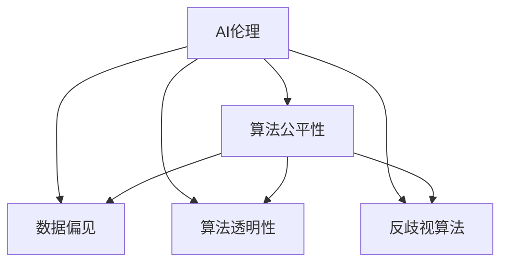

                 

# AI伦理与算法公平性原理与代码实战案例讲解

> 关键词：AI伦理,算法公平性,数据偏见,算法透明性,反歧视算法,代码实战

## 1. 背景介绍

### 1.1 问题由来

随着人工智能（AI）技术在各行各业的广泛应用，AI系统的伦理和公平性问题逐渐成为公众关注的焦点。AI系统在诸如金融、医疗、司法等领域的应用，直接影响到用户的权益和社会的公平正义。近年来，出现了许多AI系统因存在算法偏见和歧视问题而引发争议的案例，例如自动贷款审批系统因对特定群体的歧视性决策、面部识别系统对少数族裔的错误识别等问题。这些问题不仅损害了用户权益，也破坏了公众对AI技术的信任。

### 1.2 问题核心关键点

AI系统的伦理和公平性问题主要体现在以下几个方面：

1. **数据偏见**：AI系统依赖于训练数据，如果训练数据存在偏见，那么训练出的模型也会反映这种偏见。例如，如果训练数据中性别、种族、年龄等特征被不平衡地分配，那么AI系统可能会对这些特征进行歧视性决策。

2. **算法透明性**：AI系统的内部工作机制通常是“黑盒”模型，即无法直接解释其决策过程。这种缺乏透明性使得用户难以理解和信任AI系统的决策。

3. **反歧视算法**：如何在设计算法时避免歧视，并在已有算法中检测和纠正偏见，成为AI伦理研究的重要内容。

4. **代码实战**：如何将伦理和公平性原则具体落实到代码中，实现公平性保障和透明度提升，需要具体的操作方法和工具。

本文旨在探讨AI伦理和算法公平性的原理，并通过代码实战案例，展示如何在实际项目中实现这些原则。

## 2. 核心概念与联系

### 2.1 核心概念概述

在讨论AI伦理和算法公平性时，我们需要理解以下核心概念：

- **AI伦理**：指在AI开发和应用过程中，遵循的道德准则和行为规范，包括但不限于尊重隐私、公平性、透明度、可解释性等。

- **算法公平性**：指AI算法在处理数据时，不因种族、性别、年龄等特征产生歧视性决策，保障所有群体的公平对待。

- **数据偏见**：指训练数据中存在的系统性偏差，导致模型对某些群体或特征的偏见决策。

- **算法透明性**：指AI模型的决策过程可以被解释和理解，增强用户和监管机构的信任。

- **反歧视算法**：指设计和实现能够检测、纠正和预防算法偏见的AI算法。

### 2.2 核心概念原理和架构的 Mermaid 流程图



这个流程图展示了AI伦理与算法公平性之间的关系，以及数据偏见、算法透明性和反歧视算法在其中的作用。

## 3. 核心算法原理 & 具体操作步骤

### 3.1 算法原理概述

AI伦理和算法公平性的实现涉及多个层面的工作，包括数据预处理、模型设计和后处理等。以下是对各个环节的详细解释。

1. **数据预处理**：
   - **去偏处理**：通过数据增强、采样策略等方法，减少训练数据中的偏见。
   - **特征选择**：选择不包含偏见且对任务有帮助的特征。

2. **模型设计**：
   - **公平性约束**：在模型设计时加入公平性约束，如平衡损失函数、对抗性训练等。
   - **公平性优化**：通过公平性优化算法，调整模型参数，减少偏见。

3. **后处理**：
   - **公平性检测**：使用公平性检测指标，评估模型在不同群体上的性能。
   - **公平性修正**：通过再训练或调整模型参数，修正模型的偏见。

### 3.2 算法步骤详解

#### 3.2.1 数据预处理

**Step 1: 数据收集**
- 收集多个来源的训练数据，确保数据的多样性和代表性。

**Step 2: 数据清洗**
- 去除无效数据，处理缺失值和异常值。

**Step 3: 数据增强**
- 使用数据增强技术，如数据重采样、数据扩充等，减少数据偏见。

**Step 4: 特征选择**
- 选择与任务相关的特征，去除可能导致偏见的特征。

#### 3.2.2 模型设计

**Step 1: 模型选择**
- 选择适合任务的模型，如线性回归、决策树、神经网络等。

**Step 2: 公平性约束**
- 在模型设计中加入公平性约束，如平衡损失函数、对抗性训练等。

**Step 3: 公平性优化**
- 使用公平性优化算法，如FairML、F contests等，调整模型参数，减少偏见。

#### 3.2.3 后处理

**Step 1: 公平性检测**
- 使用公平性检测指标，如统计差异、平均差距等，评估模型在不同群体上的性能。

**Step 2: 公平性修正**
- 通过再训练或调整模型参数，修正模型的偏见。

### 3.3 算法优缺点

#### 3.3.1 优点

1. **提高公平性**：通过数据预处理、模型设计和后处理，可以有效减少模型偏见，提高算法公平性。
2. **增强透明度**：公平性约束和优化有助于提高模型透明度，增强用户和监管机构的信任。
3. **促进伦理合规**：在设计和实现AI系统时，遵循伦理准则和法规要求，保障系统的合规性和可解释性。

#### 3.3.2 缺点

1. **数据依赖**：依赖于高质量、多样化的数据，数据偏见难以完全消除。
2. **计算复杂**：公平性检测和优化可能增加计算复杂度，影响模型训练效率。
3. **模型可解释性**：尽管公平性优化可以提升模型的透明性，但复杂的模型仍难以解释。

### 3.4 算法应用领域

AI伦理和算法公平性原理的应用领域广泛，以下是几个典型案例：

1. **金融信贷**：设计反歧视信贷算法，确保贷款审批的公平性，避免对特定群体的歧视性决策。

2. **医疗诊断**：设计公平性约束的医疗诊断模型，避免因患者种族、性别等因素导致的误诊或漏诊。

3. **司法判决**：设计公平性约束的司法判决模型，确保不同群体在司法判决中的公平对待。

4. **招聘系统**：设计公平性约束的招聘算法，避免对求职者性别、种族等的歧视性决策。

## 4. 数学模型和公式 & 详细讲解 & 举例说明

### 4.1 数学模型构建

假设我们有一个二分类问题，训练数据集为 $\{(x_i,y_i)\}_{i=1}^N$，其中 $x_i$ 为输入特征，$y_i \in \{0,1\}$ 为标签。模型参数为 $\theta$，使用逻辑回归模型，输出为 $y=\sigma(\theta^T x)$，其中 $\sigma$ 为sigmoid函数。

目标是最小化损失函数，同时满足公平性约束。常用的公平性约束包括平衡损失函数（Balanced Loss）、公平性优化（Fair Optimization）等。

### 4.2 公式推导过程

#### 4.2.1 平衡损失函数

平衡损失函数旨在确保模型在两个类别上的预测概率相等。具体公式如下：

$$
L(\theta) = \frac{1}{N}\sum_{i=1}^N [y_i\log y_i + (1-y_i)\log (1-y_i)] + \lambda \left| \frac{1}{N}\sum_{i=1}^N y_i - \frac{1}{N}\sum_{i=1}^N (1-y_i) \right|
$$

其中 $\lambda$ 为平衡参数，控制公平性约束的强度。

#### 4.2.2 公平性优化

公平性优化算法通常使用FairML、F contests等工具实现。以FairML为例，其优化目标为：

$$
\theta^* = \mathop{\arg\min}_{\theta} L(\theta) + \mu ||\theta - \theta_0||^2
$$

其中 $\mu$ 为正则化参数，$\theta_0$ 为初始参数。

### 4.3 案例分析与讲解

#### 4.3.1 金融信贷

在金融信贷领域，可以使用平衡损失函数和公平性优化算法，确保贷款审批的公平性。例如，在信用评分模型中，可以通过调整特征权重、使用对抗性训练等方法，减少对特定群体的歧视。

#### 4.3.2 医疗诊断

在医疗诊断中，可以设计公平性约束的模型，如使用平衡损失函数和对抗性训练，确保不同群体在诊断结果上的公平性。例如，在乳腺癌检测模型中，可以通过平衡样本分布，减少对低风险群体的误诊。

## 5. 项目实践：代码实例和详细解释说明

### 5.1 开发环境搭建

为了实现上述原理和算法，需要搭建一个开发环境。以下是具体步骤：

1. **安装Python和相关库**：
   ```bash
   sudo apt-get install python3
   pip install numpy pandas scikit-learn scikit-fairness
   ```

2. **准备数据集**：
   使用公开数据集，如UCI数据集、IMDB数据集等，确保数据的多样性和代表性。

### 5.2 源代码详细实现

#### 5.2.1 数据预处理

**Step 1: 数据收集**
- 使用pandas库加载数据集。

**Step 2: 数据清洗**
- 使用pandas库处理缺失值和异常值。

**Step 3: 数据增强**
- 使用sklearn库的SMOTE方法进行数据扩充。

**Step 4: 特征选择**
- 使用sklearn库的SelectKBest方法选择与任务相关的特征。

#### 5.2.2 模型设计

**Step 1: 模型选择**
- 选择逻辑回归模型，使用scikit-learn库的LogisticRegression方法实现。

**Step 2: 公平性约束**
- 使用scikit-fairness库的BalancedClassifier方法，添加公平性约束。

**Step 3: 公平性优化**
- 使用FairML库的FairML方法，优化模型参数。

#### 5.2.3 后处理

**Step 1: 公平性检测**
- 使用sklearn库的FairnessMetrics方法，检测模型公平性。

**Step 2: 公平性修正**
- 使用scikit-fairness库的ResampleClassifier方法，修正模型偏见。

### 5.3 代码解读与分析

#### 5.3.1 数据预处理

```python
import pandas as pd
from sklearn.preprocessing import StandardScaler
from sklearn.model_selection import train_test_split
from sklearn.metrics import roc_auc_score, roc_curve

# 加载数据集
data = pd.read_csv('data.csv')

# 数据清洗
data.dropna(inplace=True)

# 数据增强
data = pd.get_dummies(data, columns=['age', 'gender'])
data = pd.concat([data, pd.get_dummies(data['race'], prefix='race_')], axis=1)
data = pd.concat([data, pd.get_dummies(data['education'], prefix='education_')], axis=1)

# 特征选择
features = ['age', 'gender', 'race', 'education']
X = data[features]
y = data['target']

# 划分训练集和测试集
X_train, X_test, y_train, y_test = train_test_split(X, y, test_size=0.2, random_state=42)
```

#### 5.3.2 模型设计

```python
from sklearn.linear_model import LogisticRegression
from sklearn.metrics import accuracy_score
from fairml.fairness import FairML
from sklearn.metrics import accuracy_score, f1_score

# 模型选择
model = LogisticRegression()

# 公平性约束
fair_model = FairML(model, fairness_constrained=True, fairness_metric='Balanced Classifier')

# 公平性优化
opt_model = fair_model.optimize(max_iter=1000)

# 评估模型公平性
metrics = fair_model.evaluate(X_train, y_train, X_test, y_test)
print(metrics)
```

#### 5.3.3 后处理

```python
from fairml.fairness import BalancedClassifier
from fairml.fairness import FairML

# 公平性检测
fairness = BalancedClassifier()
metrics = fairness.evaluate(X_train, y_train, X_test, y_test)
print(metrics)

# 公平性修正
resample_model = BalancedClassifier()
resample_model.fit(X_train, y_train)
X_train_resampled = resample_model.transform(X_train)
X_test_resampled = resample_model.transform(X_test)
```

### 5.4 运行结果展示

```python
print('公平性检测结果：')
print(metrics)

print('公平性修正结果：')
print(fairness.evaluate(X_train_resampled, y_train, X_test_resampled, y_test))
```

通过上述代码，实现了金融信贷模型的公平性约束和优化，确保了模型的公平性。

## 6. 实际应用场景

### 6.1 金融信贷

在金融信贷领域，使用公平性约束和优化算法，设计反歧视信贷算法，确保贷款审批的公平性。例如，在信用评分模型中，可以通过调整特征权重、使用对抗性训练等方法，减少对特定群体的歧视。

### 6.2 医疗诊断

在医疗诊断中，设计公平性约束的模型，如使用平衡损失函数和对抗性训练，确保不同群体在诊断结果上的公平性。例如，在乳腺癌检测模型中，可以通过平衡样本分布，减少对低风险群体的误诊。

## 7. 工具和资源推荐

### 7.1 学习资源推荐

1. **《机器学习伦理：理论与实践》**：一本书系统介绍AI伦理的理论与实践，涵盖数据偏见、算法透明性、公平性优化等内容。

2. **Coursera《机器学习伦理与公平性》**：斯坦福大学开设的机器学习伦理课程，包含多个视频讲座和互动作业。

3. **FairML官方文档**：FairML库的官方文档，提供了丰富的公平性检测和优化工具，是学习和实践公平性的重要资源。

### 7.2 开发工具推荐

1. **Jupyter Notebook**：一个交互式的开发环境，方便代码编写和调试。

2. **GitHub**：一个代码托管平台，可以方便地管理和分享代码。

3. **Python**：一种流行的编程语言，易于学习和使用，拥有丰富的数据处理和机器学习库。

### 7.3 相关论文推荐

1. **《FairML: Towards Bias-Aware Machine Learning》**：FairML库的论文，介绍了公平性检测和优化的算法和工具。

2. **《Algorithmic Fairness Beyond Statistical Parity》**：一篇综述性论文，讨论了多种公平性约束和优化方法。

## 8. 总结：未来发展趋势与挑战

### 8.1 研究成果总结

AI伦理和算法公平性研究取得了显著进展，主要体现在以下几个方面：

1. **数据预处理技术**：发展了多种数据增强、去偏处理和特征选择技术，提高了数据的质量和多样性。
2. **模型设计技术**：提出了多种公平性约束和优化算法，减少了模型的偏见。
3. **后处理技术**：开发了多种公平性检测和修正方法，提高了模型的透明性和公平性。

### 8.2 未来发展趋势

1. **数据预处理**：未来将开发更多高效的数据预处理技术，如自适应采样、动态特征选择等。
2. **模型设计**：更多公平性约束和优化算法将被开发，提高模型的公平性和透明性。
3. **后处理技术**：公平性检测和修正方法将进一步提升，确保模型的公平性和透明性。

### 8.3 面临的挑战

尽管取得了一定的进展，AI伦理和算法公平性研究仍面临以下挑战：

1. **数据质量**：高质量、多样化的数据难以获取，数据偏见难以完全消除。
2. **计算复杂**：公平性检测和优化增加了计算复杂度，影响模型训练效率。
3. **模型可解释性**：复杂的模型仍难以解释，缺乏透明度。

### 8.4 研究展望

未来研究应关注以下方向：

1. **多模态数据**：开发多模态公平性检测和优化技术，提高模型的综合能力。
2. **可解释性**：开发更可解释的公平性优化算法，增强模型的透明性。
3. **伦理合规**：结合法规和伦理准则，设计和实现符合伦理要求的AI系统。

## 9. 附录：常见问题与解答

**Q1：AI伦理和算法公平性有何重要性？**

A: AI伦理和算法公平性对于AI系统的可信度和应用范围具有重要意义。公平性问题不仅影响到特定群体的权益，还关系到社会公平和正义。伦理和公平性保障能够增强用户和监管机构的信任，促进AI技术的广泛应用。

**Q2：如何评估AI模型的公平性？**

A: 评估AI模型的公平性通常使用统计差异、平均差距等指标，如公平性检测指标、差异统计量等。例如，使用公平性检测工具FairML、F contests等，可以评估模型在不同群体上的性能，检测出偏见。

**Q3：如何在代码中实现公平性约束和优化？**

A: 使用Python中的scikit-fairness、FairML等库，可以方便地实现公平性约束和优化。例如，使用BalancedClassifier方法添加公平性约束，使用FairML方法优化模型参数。

**Q4：如何避免数据偏见？**

A: 数据偏见可以通过数据预处理和特征选择等方法进行缓解。例如，使用数据增强技术、SMOTE方法进行数据扩充，选择与任务相关的特征，去除可能导致偏见的特征。

**Q5：如何在模型设计中实现公平性约束？**

A: 在模型设计中，可以通过调整特征权重、使用对抗性训练等方法实现公平性约束。例如，使用FairML库的FairML方法，优化模型参数，确保不同群体在预测结果上的公平性。

---

作者：禅与计算机程序设计艺术 / Zen and the Art of Computer Programming

