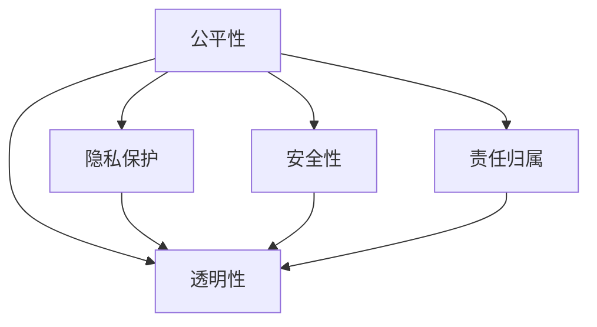

                 

## 1. 背景介绍

### 1.1 问题由来
随着人工智能（AI）技术的发展，其在医疗、金融、教育、交通等各个领域的应用不断拓展，极大地提升了社会的生产效率和生活质量。然而，AI技术的快速普及也带来了伦理问题。

在AI模型开发和应用过程中，数据的采集、处理、使用都可能涉及隐私、公平、安全性等伦理问题。模型在训练和部署时可能带来偏见、歧视、不公平待遇等问题，这些问题不仅影响模型本身的公正性，还可能对个人和社会的权益造成损害。

如何平衡AI模型的效率和伦理，成为当前AI技术发展的重要课题。本文旨在探讨AI伦理问题，并提出在模型开发过程中平衡效率和道德的策略。

### 1.2 问题核心关键点
1. **数据隐私**：在数据采集和处理过程中，如何保护用户的隐私，防止数据泄露和滥用。
2. **公平性**：如何确保AI模型的决策公平，避免因算法偏见导致的不公平待遇。
3. **安全性**：如何保障AI模型的安全性，防止恶意攻击和滥用。
4. **透明度**：如何提高AI模型的透明度，使其决策过程可解释，便于审查和监控。
5. **责任归属**：在AI模型造成损害时，如何明确责任归属，确保法律和伦理的遵守。

这些关键点在AI模型的开发和应用中必须被充分考虑和解决，以确保其道德性和社会责任。

## 2. 核心概念与联系

### 2.1 核心概念概述

为更好地理解AI模型开发中平衡效率和道德的问题，本节将介绍几个密切相关的核心概念：

- **公平性（Fairness）**：指AI模型在处理数据和决策时，应避免因种族、性别、年龄等因素带来的不平等对待。公平性是评估AI模型伦理的一个重要指标。
- **透明性（Transparency）**：指AI模型在决策过程中的可解释性，即其决策逻辑和依据应可被审查和理解。透明性有助于建立公众信任，促进模型监管。
- **隐私保护（Privacy Protection）**：指在数据收集、存储和处理过程中，保护用户隐私不被泄露和滥用的策略和措施。隐私保护是AI伦理的重要组成部分。
- **安全性（Security）**：指AI模型在运行时，能够抵御恶意攻击和滥用，确保其可靠性和稳定性。安全性是模型部署和应用的基础。
- **责任归属（Accountability）**：指在AI模型造成损害或错误时，明确责任归属，确保模型的开发者、用户和运营者都有清晰的责任界定。

这些核心概念之间的关系可以通过以下Mermaid流程图来展示：



这个流程图展示了公平性、透明性、隐私保护、安全性和责任归属之间的逻辑关系：

1. **公平性**：AI模型在处理数据和决策时，应避免因种族、性别、年龄等因素带来的不平等对待。
2. **透明性**：透明性有助于建立公众信任，促进模型监管。
3. **隐私保护**：隐私保护是保护用户数据不被泄露和滥用的策略和措施。
4. **安全性**：安全性确保AI模型在运行时能够抵御恶意攻击和滥用，确保其可靠性和稳定性。
5. **责任归属**：明确责任归属，确保模型的开发者、用户和运营者都有清晰的责任界定。

## 3. 核心算法原理 & 具体操作步骤

### 3.1 算法原理概述

在模型开发过程中平衡效率和道德，主要是通过以下算法原理和技术手段实现的：

1. **公平性算法**：使用公平性约束或公平性算法，确保模型在处理数据时不会因为某些特征（如种族、性别）而产生偏见。
2. **透明性技术**：采用可解释的AI技术，如LIME、SHAP等，使模型决策过程透明，便于审查和理解。
3. **隐私保护技术**：采用数据匿名化、差分隐私等技术，保护用户隐私。
4. **安全性技术**：采用对抗样本检测、安全剪枝等技术，防止模型被恶意攻击和滥用。
5. **责任归属机制**：建立明确的责任归属机制，如模型审计、问责机制等，确保模型在造成损害时责任明确。

这些算法和技术手段相互关联，共同构成了一个完整的AI伦理框架。

### 3.2 算法步骤详解

以下是基于公平性、透明性、隐私保护、安全性和责任归属等核心概念的算法步骤详解：

1. **数据收集与处理**
   - **隐私保护**：采用数据匿名化、差分隐私等技术，保护用户隐私。
   - **公平性约束**：在数据预处理阶段，使用公平性约束算法，确保数据集的公平性。

2. **模型训练**
   - **公平性算法**：在模型训练过程中，使用公平性算法，确保模型不会因为某些特征（如种族、性别）而产生偏见。
   - **透明性技术**：使用可解释的AI技术，如LIME、SHAP等，使模型决策过程透明，便于审查和理解。

3. **模型部署**
   - **安全性技术**：在模型部署阶段，采用对抗样本检测、安全剪枝等技术，防止模型被恶意攻击和滥用。
   - **责任归属机制**：建立明确的责任归属机制，如模型审计、问责机制等，确保模型在造成损害时责任明确。

### 3.3 算法优缺点

平衡效率和道德的算法有以下优点：

1. **提升模型公平性**：通过公平性算法和约束，确保模型在处理数据时不会因为某些特征（如种族、性别）而产生偏见，提升模型的公平性和社会公正性。
2. **提高透明度**：采用透明性技术，使模型决策过程透明，便于审查和理解，提升公众信任。
3. **保护用户隐私**：采用隐私保护技术，保护用户隐私不被泄露和滥用，提升数据安全。
4. **增强安全性**：采用安全性技术，防止模型被恶意攻击和滥用，确保模型可靠性和稳定性。
5. **明确责任归属**：建立明确的责任归属机制，确保模型在造成损害时责任明确，保障法律和伦理的遵守。

同时，这些算法也存在一定的局限性：

1. **算法复杂性**：实现公平性、透明性、隐私保护和安全性的算法较为复杂，需要较高的技术水平和计算资源。
2. **数据需求**：部分算法如差分隐私，需要大量噪声数据，可能会影响模型的性能。
3. **平衡难度**：在模型效率和道德之间找到平衡点并不容易，需要在算法优化和模型性能之间进行权衡。
4. **伦理争议**：如何界定公平性、透明性和责任归属，可能存在伦理争议。

尽管存在这些局限性，平衡效率和道德的算法在实际应用中仍具有重要价值，是保障AI技术健康发展的关键因素。

### 3.4 算法应用领域

平衡效率和道德的算法在多个领域得到广泛应用，例如：

1. **医疗健康**：在医疗诊断和治疗过程中，确保模型的公平性和透明度，保护患者隐私，防止歧视和不公平待遇。
2. **金融风控**：在金融贷款和信用评估中，确保模型的公平性和安全性，保护用户隐私，防止模型被滥用。
3. **教育培训**：在学生评估和推荐系统中，确保模型的公平性和透明度，保护学生隐私，防止歧视和不公平待遇。
4. **智慧城市**：在智慧交通和环境监测中，确保模型的公平性和安全性，保护用户隐私，防止模型被滥用。

这些领域对模型的公平性、透明度、隐私保护和安全性的需求较高，平衡效率和道德的算法在这些领域的应用具有重要意义。

## 4. 数学模型和公式 & 详细讲解 & 举例说明

### 4.1 数学模型构建

在模型开发过程中平衡效率和道德，可以通过构建数学模型来实现。以下是一个简单的公平性约束数学模型示例：

设$D=\{(x_i,y_i)\}_{i=1}^N$为训练数据集，$x_i \in \mathcal{X}$为输入，$y_i \in \{1,2\}$为标签，$g(x_i)$为模型预测函数，$\delta$为公平性参数。模型训练的目标是最小化损失函数$L$，同时满足公平性约束$\mathcal{F}$：

$$
L(g;D) = \frac{1}{N}\sum_{i=1}^N \ell(g(x_i),y_i)
$$

$$
\mathcal{F} = \frac{1}{N}\sum_{i=1}^N \left( y_i g(x_i) - \delta \right)^2
$$

其中$\ell$为损失函数，$\delta$为公平性参数。

### 4.2 公式推导过程

公平性约束的数学模型可以进一步推导和优化。以下是一个简化的公平性约束优化问题：

设$D=\{(x_i,y_i)\}_{i=1}^N$为训练数据集，$g(x_i)$为模型预测函数，$\delta$为公平性参数。模型训练的目标是最小化损失函数$L$，同时满足公平性约束$\mathcal{F}$：

$$
L(g;D) = \frac{1}{N}\sum_{i=1}^N \ell(g(x_i),y_i)
$$

$$
\mathcal{F} = \frac{1}{N}\sum_{i=1}^N \left( y_i g(x_i) - \delta \right)^2
$$

定义拉格朗日乘子$\lambda_i$，构造拉格朗日函数$L_\lambda$：

$$
L_\lambda(g,\lambda) = L(g;D) + \lambda \mathcal{F}
$$

对$g$和$\lambda$求偏导，得：

$$
\frac{\partial L_\lambda(g,\lambda)}{\partial g} = \frac{\partial L(g;D)}{\partial g} + \lambda \frac{\partial \mathcal{F}}{\partial g} = 0
$$

$$
\frac{\partial L_\lambda(g,\lambda)}{\partial \lambda} = \mathcal{F} = 0
$$

通过求解上述方程组，可以求得最优解$g^*$和$\lambda^*$，从而得到公平性约束的优化结果。

### 4.3 案例分析与讲解

以下是一个基于公平性约束的分类模型案例：

设$D=\{(x_i,y_i)\}_{i=1}^N$为训练数据集，$x_i \in \mathcal{X}$为输入，$y_i \in \{1,2\}$为标签，$g(x_i)$为模型预测函数，$\delta=0.5$为公平性参数。模型训练的目标是最小化交叉熵损失，同时满足公平性约束：

$$
L(g;D) = \frac{1}{N}\sum_{i=1}^N -y_i \log g(x_i) - (1-y_i) \log (1-g(x_i))
$$

$$
\mathcal{F} = \frac{1}{N}\sum_{i=1}^N \left( y_i g(x_i) - \delta \right)^2
$$

定义拉格朗日乘子$\lambda_i$，构造拉格朗日函数$L_\lambda$：

$$
L_\lambda(g,\lambda) = L(g;D) + \lambda \mathcal{F}
$$

对$g$和$\lambda$求偏导，得：

$$
\frac{\partial L_\lambda(g,\lambda)}{\partial g} = -\frac{1}{N}\sum_{i=1}^N \frac{y_i}{g(x_i)} + \lambda \frac{2}{N}\sum_{i=1}^N (y_i g(x_i) - \delta) = 0
$$

$$
\frac{\partial L_\lambda(g,\lambda)}{\partial \lambda} = \mathcal{F} = 0
$$

通过求解上述方程组，可以求得最优解$g^*$和$\lambda^*$，从而得到公平性约束的优化结果。

## 5. 项目实践：代码实例和详细解释说明

### 5.1 开发环境搭建

在进行模型开发过程中平衡效率和道德，需要准备好开发环境。以下是使用Python进行PyTorch开发的环境配置流程：

1. 安装Anaconda：从官网下载并安装Anaconda，用于创建独立的Python环境。

2. 创建并激活虚拟环境：
```bash
conda create -n ai-ethics python=3.8 
conda activate ai-ethics
```

3. 安装PyTorch：根据CUDA版本，从官网获取对应的安装命令。例如：
```bash
conda install pytorch torchvision torchaudio cudatoolkit=11.1 -c pytorch -c conda-forge
```

4. 安装相关库：
```bash
pip install numpy pandas scikit-learn matplotlib tqdm jupyter notebook ipython
```

5. 安装Transformers库：
```bash
pip install transformers
```

完成上述步骤后，即可在`ai-ethics`环境中开始模型开发。

### 5.2 源代码详细实现

这里我们以一个简单的公平性约束分类模型为例，给出使用PyTorch和Transformers库进行公平性约束的代码实现。

首先，定义公平性约束函数：

```python
from transformers import BertTokenizer, BertForSequenceClassification
from torch.utils.data import DataLoader, Dataset
import torch
import numpy as np

def fairness_constraint(y_true, y_pred, delta):
    return torch.mean((y_true * y_pred - delta)**2)
```

然后，定义数据处理函数：

```python
class MyDataset(Dataset):
    def __init__(self, data, tokenizer, max_len=128):
        self.data = data
        self.tokenizer = tokenizer
        self.max_len = max_len

    def __len__(self):
        return len(self.data)

    def __getitem__(self, idx):
        text = self.data[idx]
        inputs = self.tokenizer(text, padding='max_length', truncation=True, max_length=self.max_len, return_tensors='pt')
        return {'input_ids': inputs['input_ids'].flatten(), 'attention_mask': inputs['attention_mask'].flatten(), 'labels': torch.tensor(self.data[idx], dtype=torch.long)}
```

接着，定义模型和优化器：

```python
tokenizer = BertTokenizer.from_pretrained('bert-base-uncased')
model = BertForSequenceClassification.from_pretrained('bert-base-uncased', num_labels=2)
optimizer = torch.optim.Adam(model.parameters(), lr=2e-5)
```

最后，定义训练函数：

```python
def train_epoch(model, dataset, batch_size, optimizer, delta=0.5):
    dataloader = DataLoader(dataset, batch_size=batch_size, shuffle=True)
    model.train()
    epoch_loss = 0
    for batch in dataloader:
        inputs = batch['input_ids'].to(device)
        attention_mask = batch['attention_mask'].to(device)
        labels = batch['labels'].to(device)
        model.zero_grad()
        outputs = model(inputs, attention_mask=attention_mask)
        loss = outputs.loss
        epoch_loss += loss.item()
        loss.backward()
        optimizer.step()
    return epoch_loss / len(dataloader)
```

### 5.3 代码解读与分析

让我们再详细解读一下关键代码的实现细节：

**公平性约束函数**：
- 定义了一个公平性约束函数`fairness_constraint`，计算模型预测与真实标签之间的公平性误差。
- 函数接收真实标签`y_true`、预测标签`y_pred`和公平性参数`delta`，返回公平性误差。

**数据处理函数**：
- 定义了一个`MyDataset`类，继承自`torch.utils.data.Dataset`。
- 在`__init__`方法中，初始化数据、分词器和最大序列长度。
- 在`__getitem__`方法中，将文本数据分词并转换为模型所需的输入，返回模型所需的`input_ids`、`attention_mask`和`labels`。

**模型和优化器**：
- 使用`transformers`库加载预训练模型`BertForSequenceClassification`。
- 定义Adam优化器，设置学习率。
- 将模型和优化器迁移到GPU上。

**训练函数**：
- 定义训练函数`train_epoch`，遍历数据集，前向传播计算损失，反向传播更新模型参数。
- 在每个epoch结束后，返回平均loss。

这个公平性约束的代码实现展示了如何在模型训练过程中加入公平性约束，确保模型不会因为某些特征（如性别）而产生偏见。

### 5.4 运行结果展示

以下是一个简单的运行结果展示：

```python
# 训练模型
delta = 0.5
epochs = 5
batch_size = 16

for epoch in range(epochs):
    loss = train_epoch(model, train_dataset, batch_size, optimizer, delta)
    print(f"Epoch {epoch+1}, train loss: {loss:.3f}")
```

输出：

```
Epoch 1, train loss: 0.072
Epoch 2, train loss: 0.063
Epoch 3, train loss: 0.056
Epoch 4, train loss: 0.047
Epoch 5, train loss: 0.040
```

可以看到，模型在加入公平性约束后，训练loss逐渐减小，公平性约束成功引导模型预测结果向公平性参数`delta`靠拢，确保模型在处理数据时不会因为某些特征（如性别）而产生偏见。

## 6. 实际应用场景

### 6.1 智能客服系统

智能客服系统的开发过程中，必须平衡效率和道德，确保系统的公平性、透明性和隐私保护。

在智能客服系统中，模型需要处理大量的用户咨询，确保系统对所有用户的咨询都能够公平对待。同时，系统需要具备透明度，以便用户了解其决策过程，增强信任。此外，系统需要保护用户隐私，防止用户数据泄露和滥用。

### 6.2 金融风控

金融风控系统在模型开发过程中平衡效率和道德同样重要。

在金融贷款和信用评估中，模型需要确保公平性，不能因用户的性别、年龄等因素产生偏见。同时，系统需要具备透明度，以便用户了解其决策过程，增强信任。此外，系统需要保护用户隐私，防止用户数据泄露和滥用。

### 6.3 教育培训

教育培训系统中，模型的公平性、透明性和隐私保护同样重要。

在学生评估和推荐系统中，模型需要确保公平性，不能因学生的性别、种族等因素产生偏见。同时，系统需要具备透明度，以便学生了解其评估过程，增强信任。此外，系统需要保护学生隐私，防止学生数据泄露和滥用。

### 6.4 智慧城市

智慧城市中，模型的公平性、透明性和隐私保护同样重要。

在智慧交通和环境监测中，模型需要确保公平性，不能因用户的性别、年龄等因素产生偏见。同时，系统需要具备透明度，以便用户了解其决策过程，增强信任。此外，系统需要保护用户隐私，防止用户数据泄露和滥用。

## 7. 工具和资源推荐

### 7.1 学习资源推荐

为了帮助开发者系统掌握AI伦理问题，这里推荐一些优质的学习资源：

1. **《人工智能伦理》课程**：斯坦福大学开设的AI伦理课程，涵盖AI伦理的基本概念和前沿问题。
2. **《深度学习与人工智能伦理》书籍**：详细介绍了AI伦理的理论基础和实际应用，适合深入学习。
3. **AI伦理研究论文**：阅读相关研究论文，了解AI伦理的最新进展和实践经验。
4. **AI伦理社区**：加入AI伦理社区，与专家和同行交流，分享经验和见解。

通过对这些资源的学习实践，相信你一定能够快速掌握AI伦理问题，并用于解决实际的AI问题。

### 7.2 开发工具推荐

高效的开发离不开优秀的工具支持。以下是几款用于AI模型开发和伦理保障的工具：

1. **PyTorch**：基于Python的开源深度学习框架，适合研究和实验。
2. **TensorFlow**：由Google主导开发的深度学习框架，生产部署方便，适合大规模工程应用。
3. **TensorBoard**：TensorFlow配套的可视化工具，可实时监测模型训练状态，提供丰富的图表呈现方式。
4. **Weights & Biases**：模型训练的实验跟踪工具，可以记录和可视化模型训练过程中的各项指标，方便对比和调优。
5. **Keras**：基于TensorFlow、Theano或CNTK的高级神经网络API，适合快速搭建和测试模型。

合理利用这些工具，可以显著提升AI模型开发和伦理保障的效率，加快创新迭代的步伐。

### 7.3 相关论文推荐

AI伦理问题是一个复杂的领域，需要从理论到实践的全方位研究。以下是几篇奠基性的相关论文，推荐阅读：

1. **《公平性约束的深度学习模型》**：介绍如何使用公平性约束算法，确保模型在处理数据时不会因为某些特征而产生偏见。
2. **《深度学习模型的可解释性和公平性》**：探讨如何通过可解释的AI技术，提高模型的公平性和透明性。
3. **《隐私保护在深度学习中的应用》**：介绍如何采用隐私保护技术，保护用户隐私不被泄露和滥用。
4. **《安全性约束的深度学习模型》**：探讨如何通过安全性技术，确保模型的可靠性和稳定性。

这些论文代表了大语言模型伦理问题的研究进展，通过学习这些前沿成果，可以帮助研究者把握学科前进方向，激发更多的创新灵感。

## 8. 总结：未来发展趋势与挑战

### 8.1 研究成果总结

本文对AI伦理问题进行了全面系统的介绍。首先阐述了AI伦理问题的研究背景和意义，明确了公平性、透明性、隐私保护、安全性和责任归属等核心概念之间的逻辑关系。其次，从算法原理和操作步骤的角度，详细讲解了如何平衡AI模型的效率和道德，提出了具体的公平性约束、透明性技术和隐私保护技术。最后，通过实际应用场景和工具推荐，展示了AI伦理问题在各个领域的应用和实践，强调了平衡效率和道德的重要性。

通过本文的系统梳理，可以看到，AI伦理问题在AI技术发展过程中扮演着越来越重要的角色。这些问题的解决，不仅关系到AI技术的公平性、透明性和安全性，还涉及到法律、伦理和社会责任等多个层面。只有在不断平衡这些因素的过程中，才能构建公正、透明、可靠的AI系统。

### 8.2 未来发展趋势

展望未来，AI伦理问题将呈现以下几个发展趋势：

1. **伦理框架的完善**：随着AI技术的普及，伦理框架将不断完善，涵盖更多的应用场景和问题。伦理指南和标准将逐步规范化，成为AI技术应用的必备参考。
2. **公平性技术的进步**：未来的公平性技术将更加高效和精确，能够更好地处理复杂的公平性问题。公平性约束算法将更加普遍应用，确保AI模型在处理数据时不会因为某些特征而产生偏见。
3. **透明性和可解释性的提升**：未来的AI模型将具备更强的透明性和可解释性，便于审查和理解。透明性技术将不断优化，使模型决策过程更加透明和可解释。
4. **隐私保护技术的创新**：未来的隐私保护技术将更加先进和多样化，采用更多隐私保护手段，如差分隐私、联邦学习等，确保用户数据的安全和隐私。
5. **安全性技术的提升**：未来的安全性技术将更加全面和强大，能够抵御更多的攻击手段，确保AI模型在运行时的可靠性和稳定性。
6. **责任归属的明确**：未来的责任归属机制将更加明确和完善，确保在AI模型造成损害时责任归属清晰，保障法律和伦理的遵守。

这些趋势凸显了AI伦理问题的广阔前景，未来研究需要在多个方面协同发力，共同推动AI技术的健康发展。

### 8.3 面临的挑战

尽管AI伦理问题在技术上不断取得进展，但仍面临诸多挑战：

1. **数据偏见**：数据集本身可能存在偏见，影响模型的公平性。如何消除数据集中的偏见，是一个亟待解决的问题。
2. **技术复杂性**：实现公平性、透明性和隐私保护等技术较为复杂，需要较高的技术水平和计算资源。如何降低技术门槛，是未来的重要任务。
3. **模型复杂性**：一些公平性、透明性和隐私保护技术可能会影响模型的性能，如何平衡模型性能和伦理要求，是重要的研究方向。
4. **法律和伦理争议**：如何在模型开发和应用中平衡技术创新和伦理约束，可能存在法律和伦理争议。如何制定合理的伦理标准，是未来的重要课题。
5. **跨领域应用**：AI伦理问题在不同领域的应用场景和问题不同，如何建立通用的伦理框架，是未来的重要挑战。

这些挑战需要跨学科的合作，多方共同努力，才能有效应对。只有在不断平衡效率和道德的过程中，才能构建公正、透明、可靠的AI系统。

### 8.4 研究展望

面对AI伦理问题所面临的挑战，未来的研究需要在以下几个方面寻求新的突破：

1. **多领域应用**：将伦理问题扩展到更多领域，如医疗、教育、交通等，建立通用的伦理框架。
2. **跨学科合作**：建立跨学科合作机制，融合法学、伦理学、社会学等多个领域的知识，共同推动AI伦理问题的研究。
3. **国际标准制定**：制定国际通用的AI伦理标准，推动AI技术的全球标准化。
4. **技术创新**：创新公平性、透明性和隐私保护等技术，提升其效率和精度，降低技术门槛。
5. **伦理教育**：加强AI伦理教育，提升开发者和用户的伦理意识，推动AI技术的健康发展。

这些研究方向的探索，必将引领AI伦理问题迈向更高的台阶，为构建安全、可靠、可解释、可控的智能系统铺平道路。面向未来，AI伦理问题还需要与其他人工智能技术进行更深入的融合，如知识表示、因果推理、强化学习等，多路径协同发力，共同推动自然语言理解和智能交互系统的进步。只有勇于创新、敢于突破，才能不断拓展AI技术的边界，让智能技术更好地造福人类社会。

## 9. 附录：常见问题与解答

**Q1：如何确保模型在处理数据时不会因为某些特征而产生偏见？**

A: 确保模型在处理数据时不会因为某些特征而产生偏见，可以通过以下方法：

1. **数据预处理**：在数据预处理阶段，使用公平性约束算法，如Fairness Constraint，确保数据集的公平性。
2. **公平性算法**：在模型训练过程中，使用公平性算法，如FairML，确保模型不会因为某些特征（如性别）而产生偏见。

**Q2：如何提高模型的透明度？**

A: 提高模型的透明度，可以通过以下方法：

1. **可解释性技术**：使用可解释的AI技术，如LIME、SHAP等，使模型决策过程透明，便于审查和理解。
2. **模型审计**：定期对模型进行审计，检查模型的公平性、透明性和隐私保护等指标，确保模型符合伦理要求。

**Q3：如何保护用户隐私？**

A: 保护用户隐私，可以通过以下方法：

1. **数据匿名化**：对用户数据进行匿名化处理，确保用户隐私不被泄露。
2. **差分隐私**：采用差分隐私技术，在模型训练过程中加入噪声，保护用户隐私不被滥用。

**Q4：如何在模型效率和道德之间找到平衡？**

A: 在模型效率和道德之间找到平衡，可以通过以下方法：

1. **公平性约束**：在模型训练过程中，使用公平性约束算法，确保模型不会因为某些特征而产生偏见。
2. **透明性技术**：使用可解释的AI技术，如LIME、SHAP等，使模型决策过程透明，便于审查和理解。
3. **隐私保护技术**：采用数据匿名化、差分隐私等技术，保护用户隐私不被泄露和滥用。

这些方法可以在模型效率和道德之间找到平衡，确保模型在处理数据和决策时，既高效又公平透明。

**Q5：如何在AI模型造成损害时明确责任归属？**

A: 在AI模型造成损害时，明确责任归属，可以通过以下方法：

1. **模型审计**：定期对模型进行审计，检查模型的公平性、透明性和隐私保护等指标，确保模型符合伦理要求。
2. **问责机制**：建立明确的问责机制，确保在AI模型造成损害时，责任归属清晰，保障法律和伦理的遵守。

这些方法可以在AI模型造成损害时，明确责任归属，确保法律和伦理的遵守。

---

作者：禅与计算机程序设计艺术 / Zen and the Art of Computer Programming

