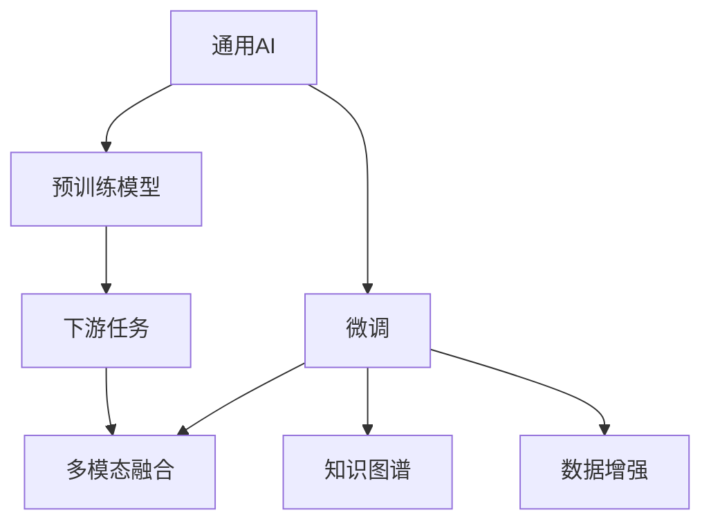

                 

## 1. 背景介绍

### 1.1 问题由来

随着人工智能技术在出版业的广泛应用，出版业面临着新的机遇与挑战。一方面，人工智能可以大幅提升出版效率，降低人力成本，提高内容质量；另一方面，出版业的垂直领域（如文学、学术、新闻等）对人工智能技术有独特的需求和挑战，需要针对性地开发和应用人工智能技术。

当前，出版业中的人工智能应用主要集中在通用AI技术上，如文本分析、自动排版、智能推荐等。然而，这些通用AI技术往往无法完全满足出版业的特殊需求，需要在垂直领域进行进一步的定制和优化。

### 1.2 问题核心关键点

出版业中的人工智能应用主要涉及以下几个关键点：

- **内容生成与编辑**：如何利用AI生成高质量的内容，包括但不限于自动化写作、风格转换、内容编辑等。
- **数据分析与处理**：如何通过AI进行数据挖掘与处理，以提供个性化的出版建议和推荐。
- **版权保护与管理**：如何利用AI技术保护版权，包括版权自动标注、抄袭检测、版权监控等。
- **智能推荐与分发**：如何利用AI进行智能推荐，优化内容分发渠道，提高读者满意度。
- **情感分析与用户反馈**：如何利用AI进行情感分析，获取用户反馈，优化内容质量和用户体验。
- **自动化流程管理**：如何利用AI进行出版流程自动化，提高生产效率，降低人力成本。

这些关键点构成了出版业中人工智能技术的主要应用领域，每个领域都具有其独特的挑战和需求。

## 2. 核心概念与联系

### 2.1 核心概念概述

为更好地理解AI在出版业的应用，本节将介绍几个密切相关的核心概念：

- **通用AI（General AI）**：指不针对特定领域，能够处理广泛任务的AI技术，如自然语言处理（NLP）、计算机视觉（CV）、语音识别等。
- **垂直领域AI（Niche AI）**：指针对特定领域的AI技术，如出版业的AI技术，能够更好地满足特定需求，具有更高的精准性和可解释性。
- **预训练模型（Pre-trained Model）**：指在大规模无标签数据上预训练的模型，如BERT、GPT等，通过迁移学习进行下游任务的微调，提升模型性能。
- **微调（Fine-tuning）**：指在预训练模型的基础上，通过有监督学习进行任务特定的优化，提升模型在特定任务上的性能。
- **多模态融合（Multimodal Fusion）**：指将文本、图像、声音等多模态数据进行融合，提升模型的感知能力和表现力。
- **知识图谱（Knowledge Graph）**：指通过图结构存储和表示实体之间的关系，用于提供丰富的语义信息。
- **数据增强（Data Augmentation）**：指通过各种技术手段扩充数据集，提升模型的泛化能力和鲁棒性。

这些核心概念之间的逻辑关系可以通过以下Mermaid流程图来展示：



这个流程图展示了大语言模型在出版业中的应用流程：

1. 通用AI技术通过预训练模型获取基础知识。
2. 在特定领域进行微调，获取任务特定的知识。
3. 多模态融合提升感知能力，知识图谱提供语义信息。
4. 数据增强增强泛化能力，提升模型鲁棒性。

## 3. 核心算法原理 & 具体操作步骤

### 3.1 算法原理概述

在出版业中，AI应用的核心算法原理主要包括以下几个方面：

- **预训练模型**：通过大规模无标签数据进行预训练，学习通用的语言或图像表示。预训练模型通常具有较强的泛化能力和广泛的适用性，适用于多种下游任务。
- **微调**：将预训练模型作为初始化参数，通过特定领域的标注数据进行微调，获取特定领域的知识和能力。微调可以大幅提升模型在特定任务上的性能，同时保持预训练模型的知识。
- **多模态融合**：将文本、图像、声音等多模态数据进行融合，提升模型的感知能力和表现力。多模态融合可以更好地理解现实世界的复杂性，提供更加准确的信息。
- **知识图谱**：通过图结构存储和表示实体之间的关系，提供丰富的语义信息。知识图谱可以帮助模型更好地理解文本和语境，提升模型的决策能力和解释性。
- **数据增强**：通过各种技术手段扩充数据集，提升模型的泛化能力和鲁棒性。数据增强可以提高模型对噪声和变化的适应能力，减少过拟合的风险。

### 3.2 算法步骤详解

基于上述算法原理，AI在出版业中的应用通常包括以下几个关键步骤：

1. **数据收集与处理**：收集出版业所需的各种数据，包括文本、图像、声音等，并进行预处理和标注。

2. **预训练模型选择**：选择合适的预训练模型，如BERT、GPT等，作为基础模型。

3. **微调**：将预训练模型作为初始化参数，通过特定领域的标注数据进行微调，获取特定领域的知识和能力。

4. **多模态融合**：将不同模态的数据进行融合，提升模型的感知能力和表现力。

5. **知识图谱构建**：通过构建知识图谱，提供丰富的语义信息，提升模型的决策能力和解释性。

6. **数据增强**：通过各种技术手段扩充数据集，提升模型的泛化能力和鲁棒性。

7. **模型评估与部署**：在特定任务上进行模型评估，将模型部署到生产环境中，进行实际应用。

### 3.3 算法优缺点

AI在出版业中的主要优点包括：

- **提高生产效率**：通过自动化流程和智能化决策，大幅提高出版效率，减少人力成本。
- **提高内容质量**：通过AI生成高质量的内容，提升出版物的吸引力和传播力。
- **提供个性化推荐**：通过智能推荐系统，提升用户满意度和粘性。
- **优化版权保护**：通过版权自动标注、抄袭检测等技术，保护版权，减少侵权风险。

同时，AI在出版业中也存在一些缺点：

- **高成本**：高质量的预训练模型和数据集通常需要高昂的成本，对中小企业构成挑战。
- **数据隐私和安全**：出版业涉及大量敏感数据，数据隐私和安全问题需要特别关注。
- **模型的可解释性**：AI模型的决策过程通常缺乏可解释性，难以满足出版业对透明性和可理解性的需求。
- **模型的泛化能力**：在特定领域应用时，AI模型可能会受到数据分布和任务类型的限制，泛化能力不足。
- **模型的鲁棒性**：AI模型在面对噪声和变化时，可能会表现出较弱的鲁棒性，影响出版物质量。

### 3.4 算法应用领域

AI在出版业中的应用领域非常广泛，主要包括：

- **内容生成**：通过AI生成高质量的文本、图像、音频等内容，提升出版物质量。
- **编辑校对**：通过AI进行自动化编辑和校对，减少人力成本，提高编辑效率。
- **版权保护**：通过AI进行版权自动标注、抄袭检测、版权监控等，保护版权，减少侵权风险。
- **智能推荐**：通过AI进行智能推荐，优化内容分发渠道，提高读者满意度。
- **情感分析**：通过AI进行情感分析，获取用户反馈，优化内容质量和用户体验。
- **自动化流程管理**：通过AI进行出版流程自动化，提高生产效率，降低人力成本。
- **广告投放**：通过AI进行广告投放优化，提升广告效果，增加出版物曝光率。
- **市场预测**：通过AI进行市场预测，提供出版物的市场趋势和用户需求分析。

## 4. 数学模型和公式 & 详细讲解 & 举例说明

### 4.1 数学模型构建

在出版业中，AI应用的核心数学模型主要包括以下几个方面：

- **文本生成模型**：基于RNN、LSTM、Transformer等模型，通过自监督学习任务进行预训练，学习语言的表示和生成能力。
- **情感分析模型**：基于CNN、RNN等模型，通过标注数据进行微调，学习情感的分类和分析能力。
- **推荐系统模型**：基于协同过滤、矩阵分解等算法，通过用户行为数据进行建模，学习用户兴趣和偏好。
- **版权检测模型**：基于深度学习算法，通过文本相似度计算等技术，进行版权自动标注和抄袭检测。

### 4.2 公式推导过程

以下我们以情感分析模型为例，推导其中的核心数学公式。

假设文本序列为 $X=\{x_1, x_2, ..., x_n\}$，情感标签为 $Y=\{y_1, y_2, ..., y_n\}$，其中 $y_i \in \{0,1\}$，$y_i=1$ 表示情感为正面，$y_i=0$ 表示情感为负面。

设情感分析模型为 $M_{\theta}$，其中 $\theta$ 为模型参数。情感分析的目标是最大化模型在标注数据上的性能，因此定义损失函数为：

$$
\mathcal{L}(\theta) = -\frac{1}{N} \sum_{i=1}^N \log M_{\theta}(x_i) \cdot y_i + \log (1-M_{\theta}(x_i)) \cdot (1-y_i)
$$

其中，$M_{\theta}(x_i)$ 表示模型在文本 $x_i$ 上的预测概率，$y_i$ 为真实标签。

根据梯度下降优化算法，模型的参数更新公式为：

$$
\theta \leftarrow \theta - \eta \nabla_{\theta}\mathcal{L}(\theta)
$$

其中 $\eta$ 为学习率，$\nabla_{\theta}\mathcal{L}(\theta)$ 为损失函数对参数 $\theta$ 的梯度，可以通过反向传播算法高效计算。

### 4.3 案例分析与讲解

以情感分析模型为例，分析其在出版业中的应用：

假设出版商需要分析用户对某本书的情感反馈，可以将用户评论作为标注数据，通过微调情感分析模型获取情感预测结果。具体步骤如下：

1. **数据准备**：收集用户评论，标注情感标签。
2. **模型选择**：选择适当的情感分析模型，如LSTM、BERT等。
3. **微调训练**：将预训练模型作为初始化参数，使用标注数据进行微调，学习情感预测能力。
4. **模型评估**：在测试集上评估模型性能，如准确率、召回率等指标。
5. **应用部署**：将训练好的模型部署到出版平台，实时获取用户评论，进行情感分析。

## 5. 项目实践：代码实例和详细解释说明

### 5.1 开发环境搭建

在进行出版业AI应用开发前，我们需要准备好开发环境。以下是使用Python进行PyTorch开发的环境配置流程：

1. 安装Anaconda：从官网下载并安装Anaconda，用于创建独立的Python环境。

2. 创建并激活虚拟环境：
```bash
conda create -n pytorch-env python=3.8 
conda activate pytorch-env
```

3. 安装PyTorch：根据CUDA版本，从官网获取对应的安装命令。例如：
```bash
conda install pytorch torchvision torchaudio cudatoolkit=11.1 -c pytorch -c conda-forge
```

4. 安装各类工具包：
```bash
pip install numpy pandas scikit-learn matplotlib tqdm jupyter notebook ipython
```

完成上述步骤后，即可在`pytorch-env`环境中开始出版业AI应用开发。

### 5.2 源代码详细实现

这里我们以情感分析模型为例，给出使用Transformers库进行情感分析的PyTorch代码实现。

首先，定义情感分析任务的数据处理函数：

```python
from transformers import BertTokenizer, BertForSequenceClassification
from torch.utils.data import Dataset
import torch

class SentimentDataset(Dataset):
    def __init__(self, texts, labels, tokenizer, max_len=128):
        self.texts = texts
        self.labels = labels
        self.tokenizer = tokenizer
        self.max_len = max_len
        
    def __len__(self):
        return len(self.texts)
    
    def __getitem__(self, item):
        text = self.texts[item]
        label = self.labels[item]
        
        encoding = self.tokenizer(text, return_tensors='pt', max_length=self.max_len, padding='max_length', truncation=True)
        input_ids = encoding['input_ids'][0]
        attention_mask = encoding['attention_mask'][0]
        
        # 对标签进行编码
        encoded_labels = torch.tensor([label], dtype=torch.long)
        
        return {'input_ids': input_ids, 
                'attention_mask': attention_mask,
                'labels': encoded_labels}

# 标签与id的映射
label2id = {0: 0, 1: 1}
id2label = {v: k for k, v in label2id.items()}

# 创建dataset
tokenizer = BertTokenizer.from_pretrained('bert-base-cased')

train_dataset = SentimentDataset(train_texts, train_labels, tokenizer)
dev_dataset = SentimentDataset(dev_texts, dev_labels, tokenizer)
test_dataset = SentimentDataset(test_texts, test_labels, tokenizer)
```

然后，定义模型和优化器：

```python
from transformers import AdamW

model = BertForSequenceClassification.from_pretrained('bert-base-cased', num_labels=2)

optimizer = AdamW(model.parameters(), lr=2e-5)
```

接着，定义训练和评估函数：

```python
from torch.utils.data import DataLoader
from tqdm import tqdm
from sklearn.metrics import classification_report

device = torch.device('cuda') if torch.cuda.is_available() else torch.device('cpu')
model.to(device)

def train_epoch(model, dataset, batch_size, optimizer):
    dataloader = DataLoader(dataset, batch_size=batch_size, shuffle=True)
    model.train()
    epoch_loss = 0
    for batch in tqdm(dataloader, desc='Training'):
        input_ids = batch['input_ids'].to(device)
        attention_mask = batch['attention_mask'].to(device)
        labels = batch['labels'].to(device)
        model.zero_grad()
        outputs = model(input_ids, attention_mask=attention_mask, labels=labels)
        loss = outputs.loss
        epoch_loss += loss.item()
        loss.backward()
        optimizer.step()
    return epoch_loss / len(dataloader)

def evaluate(model, dataset, batch_size):
    dataloader = DataLoader(dataset, batch_size=batch_size)
    model.eval()
    preds, labels = [], []
    with torch.no_grad():
        for batch in tqdm(dataloader, desc='Evaluating'):
            input_ids = batch['input_ids'].to(device)
            attention_mask = batch['attention_mask'].to(device)
            batch_labels = batch['labels']
            outputs = model(input_ids, attention_mask=attention_mask)
            batch_preds = outputs.logits.argmax(dim=1).to('cpu').tolist()
            batch_labels = batch_labels.to('cpu').tolist()
            for pred, label in zip(batch_preds, batch_labels):
                preds.append(pred)
                labels.append(label)
                
    print(classification_report(labels, preds))
```

最后，启动训练流程并在测试集上评估：

```python
epochs = 5
batch_size = 16

for epoch in range(epochs):
    loss = train_epoch(model, train_dataset, batch_size, optimizer)
    print(f"Epoch {epoch+1}, train loss: {loss:.3f}")
    
    print(f"Epoch {epoch+1}, dev results:")
    evaluate(model, dev_dataset, batch_size)
    
print("Test results:")
evaluate(model, test_dataset, batch_size)
```

以上就是使用PyTorch对BERT进行情感分析任务微调的完整代码实现。可以看到，得益于Transformers库的强大封装，我们可以用相对简洁的代码完成BERT模型的加载和微调。

### 5.3 代码解读与分析

让我们再详细解读一下关键代码的实现细节：

**SentimentDataset类**：
- `__init__`方法：初始化文本、标签、分词器等关键组件。
- `__len__`方法：返回数据集的样本数量。
- `__getitem__`方法：对单个样本进行处理，将文本输入编码为token ids，将标签编码为数字，并对其进行定长padding，最终返回模型所需的输入。

**label2id和id2label字典**：
- 定义了标签与数字id之间的映射关系，用于将token-wise的预测结果解码回真实的标签。

**训练和评估函数**：
- 使用PyTorch的DataLoader对数据集进行批次化加载，供模型训练和推理使用。
- 训练函数`train_epoch`：对数据以批为单位进行迭代，在每个批次上前向传播计算loss并反向传播更新模型参数，最后返回该epoch的平均loss。
- 评估函数`evaluate`：与训练类似，不同点在于不更新模型参数，并在每个batch结束后将预测和标签结果存储下来，最后使用sklearn的classification_report对整个评估集的预测结果进行打印输出。

**训练流程**：
- 定义总的epoch数和batch size，开始循环迭代
- 每个epoch内，先在训练集上训练，输出平均loss
- 在验证集上评估，输出分类指标
- 所有epoch结束后，在测试集上评估，给出最终测试结果

可以看到，PyTorch配合Transformers库使得BERT微调的代码实现变得简洁高效。开发者可以将更多精力放在数据处理、模型改进等高层逻辑上，而不必过多关注底层的实现细节。

当然，工业级的系统实现还需考虑更多因素，如模型的保存和部署、超参数的自动搜索、更灵活的任务适配层等。但核心的微调范式基本与此类似。

## 6. 实际应用场景

### 6.1 智能出版平台

基于AI出版业的应用场景之一是智能出版平台，可以应用于图书、期刊、杂志等出版物的编辑、校对、排版、推荐等多个环节。

例如，在图书编辑阶段，可以通过AI进行内容生成和排版优化。具体流程如下：

1. **内容生成**：利用AI生成高质量的文本、图像、音频等内容，提升出版物质量。
2. **排版优化**：通过AI进行自动排版，减少人力成本，提高排版效率。
3. **质量校对**：通过AI进行自动校对，减少编辑错误，提升出版物质量。
4. **智能推荐**：通过AI进行智能推荐，推荐读者感兴趣的图书，提升读者满意度。
5. **版权保护**：通过AI进行版权自动标注、抄袭检测等，保护版权，减少侵权风险。

智能出版平台可以帮助出版商大幅提升出版效率，降低人力成本，同时提升出版物质量，满足用户需求。

### 6.2 学术出版系统

学术出版系统是AI出版业的另一个重要应用场景，可以应用于学术论文、学位论文、会议论文等的处理、审核、推荐等环节。

例如，在学术论文审核阶段，可以通过AI进行论文质量评估和学术建议。具体流程如下：

1. **论文质量评估**：利用AI进行论文质量评估，筛选高质量的论文。
2. **学术建议**：通过AI提出学术建议，提升论文质量。
3. **论文推荐**：通过AI进行论文推荐，推荐相关的学术文献，提升读者满意度。
4. **版权保护**：通过AI进行版权自动标注、抄袭检测等，保护版权，减少侵权风险。

学术出版系统可以帮助学术机构提高论文质量，提升学术影响力，同时保护版权，减少侵权风险。

### 6.3 新闻出版系统

新闻出版系统是AI出版业的另一个重要应用场景，可以应用于新闻编辑、排版、推荐等环节。

例如，在新闻编辑阶段，可以通过AI进行新闻内容生成和排版优化。具体流程如下：

1. **内容生成**：利用AI生成高质量的新闻内容，提升新闻质量。
2. **排版优化**：通过AI进行自动排版，减少人力成本，提高排版效率。
3. **质量校对**：通过AI进行自动校对，减少编辑错误，提升新闻质量。
4. **智能推荐**：通过AI进行智能推荐，推荐读者感兴趣的新闻，提升读者满意度。
5. **版权保护**：通过AI进行版权自动标注、抄袭检测等，保护版权，减少侵权风险。

新闻出版系统可以帮助新闻媒体提升新闻质量，提高编辑效率，同时提升用户满意度，保护版权。

### 6.4 未来应用展望

随着AI技术的发展，出版业中的AI应用将不断拓展，带来更多创新的可能性。

未来，AI出版业将实现以下突破：

1. **内容生成自动化**：通过AI进行内容生成，大幅提升内容创作效率，降低人力成本。
2. **多模态出版**：将文本、图像、声音等多模态数据进行融合，提供更加丰富的出版物内容。
3. **智能推荐系统**：通过AI进行智能推荐，提升用户满意度和粘性，优化内容分发渠道。
4. **版权保护智能化**：通过AI进行版权自动标注、抄袭检测、版权监控等，保护版权，减少侵权风险。
5. **情感分析与用户反馈**：通过AI进行情感分析，获取用户反馈，优化内容质量和用户体验。
6. **自动化流程管理**：通过AI进行出版流程自动化，提高生产效率，降低人力成本。
7. **广告投放优化**：通过AI进行广告投放优化，提升广告效果，增加出版物曝光率。
8. **市场预测智能化**：通过AI进行市场预测，提供出版物的市场趋势和用户需求分析。

以上突破将为出版业带来更多的创新和价值，提升出版物的质量和效率，满足用户需求，同时保护版权，减少侵权风险。

## 7. 工具和资源推荐

### 7.1 学习资源推荐

为了帮助开发者系统掌握AI在出版业的应用理论基础和实践技巧，这里推荐一些优质的学习资源：

1. **《自然语言处理综论》**：斯坦福大学开设的NLP课程，涵盖NLP的各个方面，包括文本生成、情感分析、机器翻译等，是NLP领域的经典教材。
2. **Transformers官方文档**：HuggingFace的官方文档，提供了大量预训练模型和微调样例代码，是NLP任务开发的必备资料。
3. **《深度学习》**：Ian Goodfellow等人所著，全面介绍了深度学习的基础理论和算法，适合初学者学习。
4. **《Python深度学习》**：Francois Chollet所著，介绍了深度学习在Python中的实现，适合Python开发者学习。
5. **Kaggle竞赛平台**：提供大量NLP任务数据集和竞赛，可以通过参与竞赛学习和实践NLP技术。

通过对这些资源的学习实践，相信你一定能够快速掌握AI在出版业的应用技巧，并用于解决实际的出版业问题。

### 7.2 开发工具推荐

高效的开发离不开优秀的工具支持。以下是几款用于AI出版业开发的常用工具：

1. **Jupyter Notebook**：Python编程环境，支持代码编辑、执行和可视化，适合学术研究和数据探索。
2. **TensorFlow**：Google开发的深度学习框架，生产部署方便，适合大规模工程应用。
3. **PyTorch**：Facebook开发的深度学习框架，灵活动态的计算图，适合快速迭代研究。
4. **Scikit-learn**：Python机器学习库，提供了丰富的算法和工具，适合数据处理和模型训练。
5. **Keras**：高层次的神经网络API，易于使用，适合快速构建和调试模型。
6. **NLTK**：自然语言处理工具包，提供了大量文本处理工具和语料库，适合NLP任务开发。

合理利用这些工具，可以显著提升AI出版业应用的开发效率，加快创新迭代的步伐。

### 7.3 相关论文推荐

AI出版业的发展离不开学界的持续研究。以下是几篇奠基性的相关论文，推荐阅读：

1. **《使用深度学习进行自然语言处理》**：Yoshua Bengio等人所著，介绍了深度学习在NLP中的应用，包括文本分类、情感分析、机器翻译等。
2. **《Attention is All You Need》**：Google Brain团队提出的Transformer模型，奠定了自注意力机制在NLP中的应用基础。
3. **《BERT: Pre-training of Deep Bidirectional Transformers for Language Understanding》**：Google团队提出的BERT模型，展示了预训练技术在NLP中的应用效果。
4. **《深度学习在出版业中的应用》**：相关领域的多篇学术论文，介绍了AI在出版业中的应用案例和技术方法。

这些论文代表了大语言模型在出版业中的发展和应用方向，通过学习这些前沿成果，可以帮助研究者把握学科前进方向，激发更多的创新灵感。

## 8. 总结：未来发展趋势与挑战

### 8.1 研究成果总结

本文对AI在出版业中的应用进行了全面系统的介绍，涵盖了内容生成、编辑校对、版权保护、智能推荐、情感分析、自动化流程管理等多个方面。通过介绍AI出版业的核心概念和算法原理，展示了AI在出版业中的广泛应用和巨大潜力。

### 8.2 未来发展趋势

展望未来，AI出版业将呈现以下几个发展趋势：

1. **内容生成自动化**：通过AI进行内容生成，大幅提升内容创作效率，降低人力成本。
2. **多模态出版**：将文本、图像、声音等多模态数据进行融合，提供更加丰富的出版物内容。
3. **智能推荐系统**：通过AI进行智能推荐，提升用户满意度和粘性，优化内容分发渠道。
4. **版权保护智能化**：通过AI进行版权自动标注、抄袭检测、版权监控等，保护版权，减少侵权风险。
5. **情感分析与用户反馈**：通过AI进行情感分析，获取用户反馈，优化内容质量和用户体验。
6. **自动化流程管理**：通过AI进行出版流程自动化，提高生产效率，降低人力成本。
7. **广告投放优化**：通过AI进行广告投放优化，提升广告效果，增加出版物曝光率。
8. **市场预测智能化**：通过AI进行市场预测，提供出版物的市场趋势和用户需求分析。

### 8.3 面临的挑战

尽管AI在出版业中取得了显著成果，但在迈向更加智能化、普适化应用的过程中，它仍面临诸多挑战：

1. **标注成本瓶颈**：高质量的标注数据通常需要高昂的成本，对中小企业构成挑战。
2. **数据隐私和安全**：出版业涉及大量敏感数据，数据隐私和安全问题需要特别关注。
3. **模型的可解释性**：AI模型的决策过程通常缺乏可解释性，难以满足出版业对透明性和可理解性的需求。
4. **模型的泛化能力**：在特定领域应用时，AI模型可能会受到数据分布和任务类型的限制，泛化能力不足。
5. **模型的鲁棒性**：AI模型在面对噪声和变化时，可能会表现出较弱的鲁棒性，影响出版物质量。
6. **版权保护复杂性**：版权保护的复杂性和动态性，对AI技术提出了更高的要求。

### 8.4 研究展望

面对AI出版业所面临的种种挑战，未来的研究需要在以下几个方面寻求新的突破：

1. **探索无监督和半监督学习**：摆脱对大规模标注数据的依赖，利用自监督学习、主动学习等无监督和半监督范式，最大限度利用非结构化数据，实现更加灵活高效的出版业应用。
2. **研究参数高效和多模态融合**：开发更加参数高效的出版业应用方法，在固定大部分预训练参数的情况下，只更新极少量的任务相关参数。同时优化出版业应用的多模态融合技术，提升感知能力和表现力。
3. **融合因果推断和对比学习**：引入因果推断和对比学习思想，增强出版业应用的决策能力，学习更加普适、鲁棒的语言表征。
4. **引入知识图谱和专家知识**：通过构建知识图谱，提供丰富的语义信息，提升出版业应用的决策能力和解释性。同时加强不同模态数据的整合，实现视觉、语音等多模态信息与文本信息的协同建模。
5. **结合因果分析和博弈论工具**：将因果分析方法引入出版业应用，识别出应用决策的关键特征，增强输出解释的因果性和逻辑性。借助博弈论工具刻画人机交互过程，主动探索并规避应用的脆弱点，提高系统稳定性。
6. **纳入伦理道德约束**：在出版业应用的训练目标中引入伦理导向的评估指标，过滤和惩罚有偏见、有害的输出倾向。同时加强人工干预和审核，建立应用的监管机制，确保输出符合人类价值观和伦理道德。

## 9. 附录：常见问题与解答

**Q1：AI在出版业中的应用有哪些？**

A: AI在出版业中的应用主要包括内容生成、编辑校对、版权保护、智能推荐、情感分析、自动化流程管理等多个方面。

**Q2：如何选择适合的预训练模型？**

A: 选择合适的预训练模型应考虑以下几个因素：模型的规模和精度、模型的任务适应性、模型的数据分布等。常用的预训练模型包括BERT、GPT等，应根据具体应用场景进行选择。

**Q3：如何提高AI在出版业中的泛化能力？**

A: 提高AI在出版业中的泛化能力可以采取以下措施：
1. 收集多样化的训练数据，避免过拟合。
2. 引入数据增强技术，提升模型的鲁棒性。
3. 使用因果推断和对比学习思想，增强模型的泛化能力。
4. 引入知识图谱和专家知识，提供丰富的语义信息，提升模型的决策能力和解释性。

**Q4：如何保护出版业的版权？**

A: 保护出版业的版权可以采取以下措施：
1. 使用AI进行版权自动标注，标识出版物来源。
2. 利用AI进行抄袭检测，检测出版物的侵权行为。
3. 引入区块链技术，记录出版物的版权信息，确保版权的追溯和保护。
4. 构建版权保护平台，提供版权监控和维权服务。

**Q5：如何提高AI出版业的解释性？**

A: 提高AI出版业的解释性可以采取以下措施：
1. 引入可解释性技术，如LIME、SHAP等，解释AI模型的决策过程。
2. 使用知识图谱和专家知识，提供丰富的语义信息，增强模型的解释性。
3. 引入因果推断方法，解释AI模型输出与输入之间的因果关系。

通过本文的系统梳理，可以看到，AI出版业的应用前景广阔，但也面临着标注成本高、数据隐私和安全问题、模型可解释性不足等挑战。通过未来的研究突破，相信AI出版业将在内容生成、版权保护、智能推荐等多个方面实现新的突破，为出版业带来更多的创新和价值。

---

作者：禅与计算机程序设计艺术 / Zen and the Art of Computer Programming

