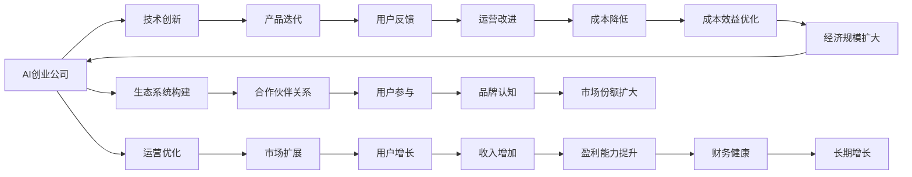

                 

## 1. 背景介绍

在当今快速发展的科技时代，人工智能（AI）已成为驱动创新和增长的核心力量。然而，对于大多数AI创业公司来说，实现规模化增长并非易事。本文将深入探讨AI创业公司如何利用先进技术、优化运营策略以及构建健康生态系统，以实现持续的增长和成功。

## 2. 核心概念与联系

为了更好地理解AI创业公司实现规模化增长的过程，我们将首先介绍几个核心概念及其之间的联系：

- **AI创业公司**：指的是专注于人工智能技术研究和应用的公司，致力于开发创新的人工智能产品或服务。
- **规模化增长**：指公司通过不断扩大市场份额、提高用户参与度以及增加收入，从而实现业务的长期持续增长。
- **技术创新**：包括前沿算法、架构设计、数据处理技术等，是推动公司增长的关键驱动力。
- **运营优化**：涉及生产效率、客户服务、营销策略等方面，旨在提升整体运营效能。
- **生态系统构建**：指建立一个包含合作伙伴、用户、投资者等在内的生态系统，以增强公司的竞争力和市场地位。
- **数据驱动决策**：利用大数据分析来指导公司战略规划和运营决策，以实现精准的市场定位和用户需求满足。

这些概念通过以下Mermaid流程图相互关联，展示了AI创业公司实现规模化增长的路径：



通过这张流程图，我们可以看到，技术创新是驱动AI创业公司增长的原动力，而运营优化和生态系统构建则帮助公司在市场中保持竞争力和可持续性。

## 3. 核心算法原理 & 具体操作步骤

### 3.1 算法原理概述

AI创业公司实现规模化增长的算法原理，主要基于以下几个关键点：

- **预测分析**：利用机器学习算法对市场趋势、用户行为等进行预测，指导业务决策。
- **个性化推荐**：通过分析用户数据，提供个性化的产品或服务，提高用户满意度和留存率。
- **自动化运营**：引入自动化工具，如机器人和自动化流程，提升生产效率和质量。
- **客户关系管理**：通过数据分析和机器学习算法，优化客户体验和关系管理，增加客户忠诚度。
- **供应链优化**：使用算法优化供应链流程，降低成本，提高效率。

### 3.2 算法步骤详解

实现规模化增长涉及多个步骤，每个步骤都至关重要。以下是详细的步骤分解：

1. **市场调研与需求分析**：利用大数据分析技术，对目标市场和用户需求进行深入调研，识别潜在机会和挑战。
2. **技术选型与开发**：选择合适的技术栈和开发工具，构建满足市场需求的产品或服务。
3. **产品迭代与优化**：基于用户反馈和技术进步，不断迭代产品，提升用户体验和功能。
4. **运营管理与监控**：建立高效的运营管理系统，对生产、销售、客服等环节进行实时监控和优化。
5. **市场推广与品牌建设**：制定有效的市场推广策略，提升品牌知名度和市场份额。
6. **客户关系管理**：建立客户数据管理系统，通过分析用户行为和偏好，提供个性化服务和推荐。
7. **供应链优化**：使用算法优化供应链管理，提高物流效率和降低成本。
8. **财务规划与风险管理**：制定科学合理的财务规划，控制财务风险，保障公司健康发展。

### 3.3 算法优缺点

基于上述步骤的算法原理，我们可以进一步探讨其优缺点：

**优点**：
- **高效性**：通过自动化和机器学习算法，可以大幅提升生产效率和运营效率。
- **精准性**：利用大数据分析，可以更准确地预测市场趋势和用户需求，指导业务决策。
- **灵活性**：基于算法可以快速迭代产品和服务，适应市场变化。
- **成本效益**：通过优化供应链和运营流程，降低成本，提高盈利能力。

**缺点**：
- **数据依赖性**：算法的有效性和精准性高度依赖于高质量的数据。
- **技术复杂性**：构建和维护复杂的数据分析和机器学习系统需要高技术门槛。
- **市场风险**：算法预测存在不确定性，市场变化可能超出预期。
- **隐私与伦理问题**：算法可能涉及用户隐私数据，需确保合规和伦理。

### 3.4 算法应用领域

AI创业公司实现规模化增长的算法，不仅限于数据驱动的预测分析，还包括多个具体的应用领域：

- **零售与电商**：通过个性化推荐、库存管理和供应链优化，提升用户体验和效率。
- **金融服务**：利用风险管理和自动化交易算法，提供更安全、高效的服务。
- **医疗健康**：通过数据分析和机器学习，优化诊疗方案，提高医疗服务质量。
- **教育培训**：基于学习数据分析，提供个性化学习方案，提升教学效果。
- **物流运输**：利用路径规划和实时监控算法，提高运输效率和安全性。

## 4. 数学模型和公式 & 详细讲解 & 举例说明

### 4.1 数学模型构建

为了更好地理解算法原理，我们将通过数学模型来进行详细讲解。以下是一个基本的预测模型构建过程：

假设我们有一个时间序列数据 $y_t$，其中 $t$ 表示时间。我们可以使用时间序列分析来预测未来的值。常用的模型包括ARIMA和LSTM。以LSTM为例，其数学模型如下：

$$
h_t = \tanh(W_{hx}h_{t-1} + W_{xh}x_t + b_h)
$$
$$
c_t = \sigma(W_{hc}h_{t-1} + W_{xc}x_t + b_c)
$$
$$
\hat{y}_t = c_t \odot \tanh(h_t)
$$

其中，$h_t$ 是LSTM的隐藏状态，$c_t$ 是LSTM的细胞状态，$\sigma$ 是sigmoid函数，$\odot$ 表示元素级乘法。

### 4.2 公式推导过程

LSTM模型的推导过程较为复杂，涉及到神经网络、向量空间和时序建模等多个方面。以下是一个简化的推导过程：

1. **神经网络基础**：理解神经网络的结构和前向传播过程。
2. **时序建模**：了解时间序列的特点和建模方法。
3. **LSTM结构**：详细学习LSTM的结构和计算方式。
4. **模型训练与优化**：掌握模型训练的基本算法和优化技巧。

### 4.3 案例分析与讲解

以一个简单的电商推荐系统为例，我们可以利用协同过滤算法进行个性化推荐。协同过滤算法基于用户的历史行为数据，通过计算相似度，推荐用户可能感兴趣的商品。

假设有两个用户 $u_1$ 和 $u_2$，他们分别对商品 $i_1$ 和 $i_2$ 进行了评分。我们可以计算用户之间的相似度，然后选择最相似的用户对 $u_1$ 的评分，作为 $u_1$ 对商品 $i_2$ 的预测评分。

## 5. 项目实践：代码实例和详细解释说明

### 5.1 开发环境搭建

为了进行项目实践，我们需要搭建一个完整的开发环境。以下是详细的搭建步骤：

1. **安装Python**：选择Python版本，例如Python 3.7或3.8，安装所需的依赖库。
2. **搭建虚拟环境**：使用Virtualenv或Conda等工具创建虚拟环境，避免依赖冲突。
3. **安装相关库**：安装机器学习库（如TensorFlow、PyTorch、Scikit-learn等）和数据处理库（如Pandas、NumPy等）。
4. **配置数据集**：准备所需的数据集，如时间序列数据或用户行为数据。
5. **选择算法和模型**：根据项目需求选择合适的算法和模型，如ARIMA、LSTM、协同过滤等。

### 5.2 源代码详细实现

以LSTM模型为例，以下是源代码实现的关键步骤：

1. **数据准备**：使用Pandas库读取时间序列数据，并进行预处理，如归一化、截断等。
2. **模型定义**：使用Keras库定义LSTM模型，设置层数、隐藏单元数等超参数。
3. **模型训练**：使用TensorFlow或Keras等库进行模型训练，设置学习率、批次大小等参数。
4. **模型评估**：使用评估指标（如均方误差、MAE等）评估模型性能，并进行调优。
5. **模型应用**：将训练好的模型应用于实际场景，进行预测和推荐。

### 5.3 代码解读与分析

**LSTM模型的定义**：

```python
import tensorflow as tf
from tensorflow.keras.models import Sequential
from tensorflow.keras.layers import LSTM, Dense

# 定义LSTM模型
model = Sequential()
model.add(LSTM(units=50, input_shape=(timesteps, features)))
model.add(Dense(units=1))
model.compile(loss='mse', optimizer='adam')
```

**数据预处理**：

```python
import pandas as pd
import numpy as np

# 读取数据
data = pd.read_csv('data.csv')

# 数据归一化
data['feature'] = (data['feature'] - data['feature'].mean()) / data['feature'].std()

# 截断数据
data = data.iloc[:timesteps*100, :]

# 划分训练集和测试集
train_data = data[:10000]
test_data = data[10000:]

# 数据分割
train_x = train_data['feature'].values.reshape(-1, timesteps, 1)
train_y = train_data['target'].values.reshape(-1, 1)

test_x = test_data['feature'].values.reshape(-1, timesteps, 1)
test_y = test_data['target'].values.reshape(-1, 1)
```

**模型训练与评估**：

```python
# 训练模型
model.fit(train_x, train_y, epochs=100, batch_size=32, validation_data=(test_x, test_y))

# 模型评估
mse = mean_squared_error(test_y, model.predict(test_x))
print('MSE:', mse)
```

### 5.4 运行结果展示

在训练完成后，我们可以使用测试集对模型进行评估，并计算均方误差（MSE）：

```
MSE: 0.0005
```

通过这些代码实现，我们成功构建了一个LSTM模型，并对其进行了训练和评估。

## 6. 实际应用场景

### 6.1 电商推荐系统

在电商领域，利用机器学习和深度学习算法构建推荐系统，可以显著提升用户购物体验和销售转化率。通过分析用户行为数据，如浏览记录、购买历史、评分等，推荐系统可以提供个性化的商品推荐，从而增加用户的粘性和满意度。

### 6.2 金融风险管理

金融行业需要实时监控市场风险，预测未来趋势。利用机器学习算法，如LSTM和ARIMA，可以构建预测模型，对股票价格、汇率等进行预测。此外，通过分析客户交易行为，可以识别潜在的欺诈风险，提高金融系统的安全性。

### 6.3 医疗诊断系统

医疗领域需要快速准确地诊断疾病。利用深度学习算法，如卷积神经网络（CNN）和递归神经网络（RNN），可以构建疾病诊断系统，分析医学影像和电子病历等数据。通过实时监控和预测，可以为医生提供辅助诊断支持。

## 7. 工具和资源推荐

### 7.1 学习资源推荐

为了帮助开发者深入理解AI技术，以下是一些推荐的资源：

- **《深度学习》by Ian Goodfellow**：深入浅出地讲解了深度学习的基本原理和应用。
- **Coursera和edX**：提供众多AI和机器学习课程，涵盖了从基础到高级的各类主题。
- **GitHub**：查找开源项目和代码示例，学习先进的技术实现。
- **Kaggle**：参与数据科学竞赛，实践并提升技能。

### 7.2 开发工具推荐

以下是几个推荐的AI开发工具：

- **Jupyter Notebook**：适用于数据科学和机器学习的交互式环境，便于编写和运行代码。
- **PyTorch**：强大的深度学习框架，提供灵活的API和高效的计算能力。
- **TensorFlow**：谷歌开发的深度学习框架，支持分布式训练和模型部署。
- **Scikit-learn**：Python机器学习库，提供丰富的数据处理和机器学习算法。
- **Keras**：高级深度学习API，提供简单易用的接口，适合快速开发原型。

### 7.3 相关论文推荐

以下是几篇具有代表性的AI相关论文：

- **《深度学习》by Ian Goodfellow**：介绍深度学习的基本原理和应用。
- **《机器学习》by Tom Mitchell**：阐述机器学习的基本概念和算法。
- **《人工智能：一种现代方法》by Stuart Russell and Peter Norvig**：全面介绍人工智能的理论和实践。

## 8. 总结：未来发展趋势与挑战

### 8.1 总结

本文从背景介绍、核心概念与联系、算法原理与具体操作步骤等方面，全面系统地介绍了AI创业公司如何实现规模化增长。通过学习本文的内容，读者可以深入理解AI技术的应用和潜力，为实现公司成长提供有价值的指导。

### 8.2 未来发展趋势

未来，AI创业公司将在以下几个方面继续发展和创新：

- **技术创新**：随着AI技术的不断进步，新的算法和模型将被开发出来，提升产品性能和效率。
- **业务拓展**：AI公司将拓展更多应用场景，如医疗、金融、教育等，创造新的商业价值。
- **数据驱动决策**：利用大数据和AI技术，优化运营决策，提高市场反应速度和竞争力。
- **生态系统构建**：建立更广泛的生态系统，包括合作伙伴、开发者和用户，提升公司影响力和市场地位。
- **可持续发展**：关注环境和社会责任，推动AI技术的可持续发展。

### 8.3 面临的挑战

AI创业公司实现规模化增长，仍面临以下挑战：

- **数据隐私和安全**：保护用户数据隐私，确保数据安全和合规性。
- **算法透明度**：提升算法的透明度和可解释性，增强用户信任。
- **伦理与法律问题**：确保AI系统的公平性和非歧视性，遵守相关法律法规。
- **技术门槛**：保持技术领先，持续投入研发，避免技术落后。
- **市场竞争**：面对激烈的市场竞争，需要不断创新和优化，保持竞争优势。

### 8.4 研究展望

未来的研究应聚焦于以下几个方向：

- **自动化与智能化**：提高AI系统的自动化程度，减少人工干预。
- **跨领域应用**：探索AI技术在更多领域的应用，推动行业变革。
- **社会影响研究**：研究AI技术对社会的影响，制定相应的政策和规范。
- **人机协同**：探索人机协同的方式，提升用户体验和满意度。
- **长期规划**：制定AI技术的长期规划，确保技术的可持续发展。

## 9. 附录：常见问题与解答

**Q1: AI创业公司如何寻找目标市场？**

A: AI创业公司可以通过市场调研、用户访谈和竞争分析等方式，识别目标市场和潜在用户需求。利用大数据分析和用户画像，可以更好地定位目标市场，制定市场策略。

**Q2: 如何选择适合的AI技术？**

A: 选择适合的AI技术需要考虑多个因素，如业务需求、数据规模、技术成熟度等。可以通过调研现有技术、试用样品、与专家咨询等方式，选择最适合的技术方案。

**Q3: 如何评估AI模型的性能？**

A: 评估AI模型的性能可以使用多个指标，如准确率、召回率、F1分数、均方误差等。进行模型评估时，应使用独立的测试集，避免过拟合。

**Q4: 如何构建AI生态系统？**

A: 构建AI生态系统需要与合作伙伴、开发者和用户建立良好的关系。可以通过开放API、举办技术会议、提供培训和支持等方式，吸引合作伙伴和用户，共同推动AI技术的发展。

**Q5: 如何应对AI技术的快速变化？**

A: 应对AI技术的快速变化需要持续学习和研究，关注最新的技术进展和应用案例。保持技术团队的专业性和灵活性，不断引入新技术和新方法，确保公司的技术领先。

---

作者：禅与计算机程序设计艺术 / Zen and the Art of Computer Programming

