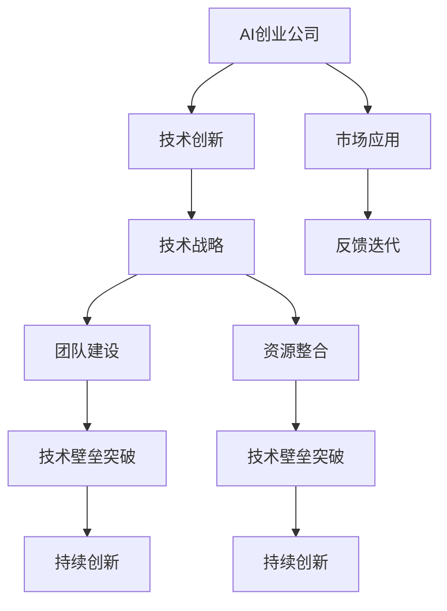

                 

# AI创业公司如何突破技术壁垒?

> 关键词：AI创业公司,技术壁垒,创新突破,技术战略,人工智能,创业指南

## 1. 背景介绍

在当今数字化时代，人工智能(AI)技术正迅速渗透到各行各业，推动着产业变革与创新。越来越多的初创公司抓住这一机遇，投身于AI领域的创业，以期在激烈的市场竞争中脱颖而出。然而，AI创业公司的成长之路并非一帆风顺，如何突破技术壁垒，构建持久的竞争优势，成为每个AI创业者面临的重大挑战。

技术壁垒是制约AI创业公司发展的关键因素之一。它不仅包括基础技术的不足，如算法、模型、基础设施等，还包括行业应用的技术实现难度、市场环境的不确定性等因素。本文将从理论到实践，深入探讨AI创业公司如何通过技术创新、战略规划、团队建设、资源整合等多维度策略，突破技术壁垒，实现可持续的创新与成长。

## 2. 核心概念与联系

### 2.1 核心概念概述

为更好地理解AI创业公司突破技术壁垒的策略，本节将介绍几个关键概念及其相互关系：

- **AI创业公司(AI Startup)**：专注于AI技术开发、应用和商业化的初创企业。它致力于将AI技术与现实应用相结合，解决行业痛点，创造社会价值。

- **技术壁垒**：指在技术实现过程中存在的各种挑战和难题，如算法优化、模型训练、数据获取等。突破技术壁垒是AI创业公司实现商业成功的关键。

- **技术创新**：指通过不断改进和研发新的技术，实现产品的性能提升、成本降低和用户体验优化。技术创新是AI创业公司持续发展的动力源泉。

- **技术战略**：指公司对技术研发、应用推广和市场布局的长期规划与策略选择。技术战略的制定和执行直接影响公司的技术突破和发展路径。

- **团队建设**：指构建具有创新能力、技术实力和市场洞察力的团队，是公司突破技术壁垒的基础保障。

- **资源整合**：指利用外部资源如合作伙伴、开源社区、资金支持等，提升公司技术实力和市场竞争力。

这些核心概念之间的逻辑关系可以通过以下Mermaid流程图来展示：



这个流程图展示了AI创业公司突破技术壁垒的核心路径：通过技术创新、战略规划、团队建设和资源整合，逐步实现技术壁垒的突破，并不断推动产品迭代和市场应用，形成良性循环。

## 3. 核心算法原理 & 具体操作步骤
### 3.1 算法原理概述

AI创业公司突破技术壁垒的核心在于不断优化和创新算法和技术架构。以下是常见的算法和具体操作步骤：

1. **算法优化**：采用先进的机器学习、深度学习等技术，优化模型结构和参数设置，提升算法性能。例如，使用Transformer结构进行自然语言处理，或利用卷积神经网络(CNN)进行图像识别。

2. **数据增强**：通过数据扩增、合成数据等方法，提升训练数据的丰富性和多样性，缓解数据不足的瓶颈。例如，使用翻转、旋转、裁剪等技术对图像数据进行增强。

3. **模型微调**：针对特定应用场景，对预训练模型进行微调，提升模型针对特定任务的表现。例如，使用迁移学习技术，将通用模型在特定数据集上进行微调。

4. **分布式训练**：利用分布式计算技术，加速模型训练过程，提升训练效率和处理能力。例如，使用Spark、Distributed TensorFlow等分布式计算框架。

5. **自动化调参**：使用自动化调参技术，优化超参数设置，提升模型效果。例如，使用Hyperopt、Optuna等工具进行超参数优化。

### 3.2 算法步骤详解

基于上述核心算法，AI创业公司在突破技术壁垒的过程中，通常会经历以下步骤：

1. **需求分析**：明确产品需求，确定核心功能和应用场景。

2. **算法选择**：根据需求选择合适的算法和技术架构，如CNN、RNN、BERT等。

3. **数据准备**：收集和清洗数据，确保数据质量和多样性。

4. **模型设计**：设计模型结构，确定超参数设置，构建损失函数和优化算法。

5. **模型训练**：使用分布式训练等技术，高效训练模型，优化超参数，提升模型性能。

6. **模型评估**：在验证集上评估模型性能，调整模型结构或参数设置。

7. **模型微调**：在特定应用场景下对模型进行微调，提升模型针对特定任务的表现。

8. **部署应用**：将模型集成到实际应用中，进行效果测试和优化。

### 3.3 算法优缺点

AI创业公司在采用上述算法和步骤进行技术突破时，需权衡其优缺点：

**优点**：
- 算法优化和模型微调可显著提升模型性能，满足特定应用需求。
- 分布式训练可大幅提高模型训练效率，缩短开发周期。
- 自动化调参可减少人工调参工作量，提升调参效率。

**缺点**：
- 算法优化和模型微调需要大量计算资源，初期投入较高。
- 数据增强和合成数据可能存在质量问题，影响模型效果。
- 自动化调参可能过于依赖模型训练结果，缺乏人工干预。

### 3.4 算法应用领域

上述算法和操作步骤在多个领域具有广泛的应用前景：

1. **自然语言处理(NLP)**：使用Transformer结构进行文本分类、情感分析、机器翻译等任务。

2. **计算机视觉(CV)**：使用CNN结构进行图像识别、目标检测、图像分割等任务。

3. **语音识别(SR)**：使用RNN或Transformer结构进行语音转文字、语音识别等任务。

4. **推荐系统**：使用协同过滤、深度学习等技术进行用户兴趣建模和个性化推荐。

5. **医疗健康**：使用深度学习进行疾病诊断、医学影像分析等任务。

6. **金融风控**：使用机器学习进行信用评估、风险预测等任务。

7. **智能制造**：使用AI技术进行智能排程、质量检测、故障预测等任务。

这些领域的应用展示了AI创业公司在突破技术壁垒方面的广阔空间和巨大潜力。

## 4. 数学模型和公式 & 详细讲解 & 举例说明

### 4.1 数学模型构建

在AI创业公司的技术突破过程中，数学模型和公式扮演着重要角色。以下以图像分类任务为例，展示基本的数学模型构建过程：

1. **输入数据**：将输入图像进行预处理，转化为模型可接受的格式。

2. **卷积层**：通过卷积操作提取图像的特征。

3. **池化层**：对特征进行下采样，减少特征维度。

4. **全连接层**：将池化层的输出进行展开，连接全连接层，进行分类。

5. **softmax层**：对全连接层的输出进行softmax处理，得到类别概率分布。

6. **损失函数**：使用交叉熵损失函数衡量模型预测结果与真实标签的差异。

7. **优化器**：使用随机梯度下降等优化器更新模型参数，最小化损失函数。

### 4.2 公式推导过程

以下是卷积神经网络(CNN)的数学公式推导过程，以帮助理解模型构建和训练过程：

1. **卷积操作**：设输入为$I_{m \times n \times c}$，卷积核为$F_{k \times k \times c}$，输出特征图为$O_{(m-k+1) \times (n-k+1) \times f}$，则卷积操作可表示为：

$$
O_{i,j} = \sum_{p=0}^{k-1} \sum_{q=0}^{k-1} I_{i+p,j+q} \ast F_{p,q}
$$

其中，$*$表示卷积运算，$\ast$表示核与输入在指定位置进行卷积运算，输出$O_{i,j}$为卷积结果。

2. **池化操作**：设特征图为$O_{m \times n \times f}$，池化核为$H_{k \times k}$，输出特征图为$O'_{(m-k+1) \times (n-k+1) \times f'}$，则池化操作可表示为：

$$
O'_{i,j} = \max_{p=0}^{k-1} \max_{q=0}^{k-1} O_{i+p,j+q}
$$

其中，$\max$表示取最大值。

3. **全连接层**：设特征图为$O_{m \times n \times f}$，全连接层权重为$W_{m \times f \times d}$，偏置为$b_{d}$，输出为$Z_{1 \times n \times d}$，则全连接层可表示为：

$$
Z_{1 \times n \times d} = O_{m \times n \times f} \times W_{m \times f \times d} + b_{d}
$$

4. **softmax层**：设全连接层输出为$Z_{1 \times n \times d}$，类别数$k$，输出为$Y_{1 \times n \times k}$，则softmax层可表示为：

$$
Y_{i,j} = \frac{e^{Z_{i,j}}}{\sum_{t=1}^{k} e^{Z_{i,j}}}
$$

其中，$e$表示自然指数函数。

5. **交叉熵损失函数**：设模型预测类别概率分布为$Y_{1 \times n \times k}$，真实标签为$T_{1 \times n \times k}$，交叉熵损失函数为$\mathcal{L}_{ce}$，则：

$$
\mathcal{L}_{ce} = -\frac{1}{n} \sum_{i=1}^{n} \sum_{j=1}^{k} T_{i,j} \log Y_{i,j}
$$

### 4.3 案例分析与讲解

**案例**：使用CNN进行手写数字识别任务。

1. **模型架构**：
   - 输入层：输入图像为$28 \times 28$的灰度图像。
   - 卷积层：使用$5 \times 5$的卷积核进行卷积操作，激活函数为ReLU。
   - 池化层：使用$2 \times 2$的最大池化操作，池化后特征图尺寸为$14 \times 14$。
   - 全连接层：将池化层输出展开为$14 \times 14 \times 64$，连接全连接层，激活函数为ReLU。
   - softmax层：输出类别概率分布，使用交叉熵损失函数进行训练。

2. **训练过程**：
   - 使用随机梯度下降优化器，学习率为$0.01$，迭代次数为$10$次。
   - 使用$60$个训练样本和$10$个测试样本进行训练和测试。
   - 最终模型在测试集上达到$99.5\%$的准确率。

## 5. 项目实践：代码实例和详细解释说明

### 5.1 开发环境搭建

在进行AI创业公司的技术突破过程中，需要构建高效的开发环境。以下是使用Python进行TensorFlow开发的环境配置流程：

1. 安装Anaconda：从官网下载并安装Anaconda，用于创建独立的Python环境。

2. 创建并激活虚拟环境：
```bash
conda create -n tf-env python=3.8 
conda activate tf-env
```

3. 安装TensorFlow：根据CUDA版本，从官网获取对应的安装命令。例如：
```bash
conda install tensorflow -c tf -c conda-forge
```

4. 安装各类工具包：
```bash
pip install numpy pandas scikit-learn matplotlib tqdm jupyter notebook ipython
```

完成上述步骤后，即可在`tf-env`环境中开始项目实践。

### 5.2 源代码详细实现

这里我们以图像分类任务为例，给出使用TensorFlow实现卷积神经网络的代码实现。

```python
import tensorflow as tf
from tensorflow import keras
import numpy as np

# 加载数据集
mnist = keras.datasets.mnist
(x_train, y_train), (x_test, y_test) = mnist.load_data()
x_train, x_test = x_train / 255.0, x_test / 255.0

# 定义模型
model = keras.Sequential([
    keras.layers.Flatten(input_shape=(28, 28)),
    keras.layers.Dense(128, activation='relu'),
    keras.layers.Dense(10)
])

# 编译模型
model.compile(optimizer='adam',
              loss=tf.keras.losses.SparseCategoricalCrossentropy(from_logits=True),
              metrics=['accuracy'])

# 训练模型
model.fit(x_train, y_train, epochs=5, validation_data=(x_test, y_test))

# 评估模型
model.evaluate(x_test,  y_test, verbose=2)
```

### 5.3 代码解读与分析

让我们再详细解读一下关键代码的实现细节：

**数据准备**：
- `mnist.load_data()`：从TensorFlow官方数据集中加载MNIST手写数字数据集。
- `x_train, x_test = x_train / 255.0, x_test / 255.0`：将图像像素值归一化到$[0,1]$范围内。

**模型定义**：
- `keras.Sequential()`：定义一个顺序模型，依次添加卷积层、全连接层。
- `keras.layers.Flatten()`：将输入数据展开为一维向量。
- `keras.layers.Dense()`：定义全连接层，激活函数为ReLU。

**模型编译**：
- `model.compile()`：编译模型，设置优化器、损失函数和评估指标。
- `optimizer='adam'`：使用Adam优化器。
- `loss=tf.keras.losses.SparseCategoricalCrossentropy(from_logits=True)`：使用交叉熵损失函数，参数`from_logits=True`表示模型输出为未经过softmax处理的 logits。

**模型训练**：
- `model.fit()`：训练模型，设置训练轮数和验证集。
- `epochs=5`：设置训练轮数为5。
- `validation_data=(x_test, y_test)`：设置验证集。

**模型评估**：
- `model.evaluate()`：评估模型，计算测试集上的准确率。
- `verbose=2`：输出较详细的评估信息。

## 6. 实际应用场景

### 6.1 智能医疗诊断

AI创业公司在智能医疗诊断领域有着广泛的应用前景。通过深度学习和大数据技术，AI系统能够对病人的病历数据、影像数据进行分析和诊断，辅助医生进行决策。

**具体应用**：
- 影像分析：使用卷积神经网络对医学影像进行分割、分类、诊断，识别病变区域。
- 病理分析：使用自然语言处理技术对病理报告进行文本分析，提取关键信息。
- 智能问诊：使用NLP技术对病人的症状进行自然语言理解，提供初步诊断建议。

**案例**：谷歌的DeepMind公司开发的AlphaGo，通过深度学习技术对围棋进行智能决策，达到了人类顶级水平。类似的，AI创业公司可以利用深度学习技术对医疗诊断进行智能辅助，提高诊疗效率和准确性。

### 6.2 智能客服

智能客服是AI创业公司在消费和服务领域的重要应用场景。通过自然语言处理和机器学习技术，AI系统能够处理大量的客户咨询，提供快速、准确的答复。

**具体应用**：
- 自动问答：使用NLP技术对客户咨询进行理解和回答，生成自然流畅的回复。
- 语音识别：使用语音识别技术将客户语音转换为文本，进行智能应答。
- 情感分析：使用情感分析技术识别客户情绪，提供个性化服务。

**案例**：阿里巴巴的阿里云智能客服系统，使用自然语言处理技术对客户咨询进行自动问答，显著提高了客户满意度。类似的，AI创业公司可以利用NLP技术开发智能客服系统，提升客户服务质量。

### 6.3 金融风险管理

AI创业公司在金融风险管理领域也有着广泛的应用。通过机器学习和大数据技术，AI系统能够对金融数据进行分析和预测，识别风险因素。

**具体应用**：
- 信用评估：使用机器学习技术对客户信用进行评估，预测违约风险。
- 交易监控：使用深度学习技术对交易数据进行异常检测，识别欺诈行为。
- 量化交易：使用深度学习技术对市场数据进行分析和预测，优化交易策略。

**案例**：高盛公司使用机器学习技术对客户信用进行评估，大幅提高了信用评估的准确性和效率。类似的，AI创业公司可以利用深度学习技术进行金融风险管理，提升金融机构的抗风险能力。

### 6.4 未来应用展望

随着AI技术的不断进步，AI创业公司在未来将有更多的应用场景和创新突破。以下是一些未来可能的应用方向：

1. **自动驾驶**：利用深度学习和计算机视觉技术，开发自动驾驶系统，实现自主驾驶。
2. **智能制造**：使用AI技术进行智能排程、质量检测、故障预测，提升制造业的智能化水平。
3. **智能城市**：利用AI技术进行智能交通、环境监测、公共安全管理，构建智慧城市。
4. **个性化推荐**：利用机器学习和深度学习技术，进行个性化推荐，提升用户体验。
5. **智能营销**：使用AI技术进行用户行为分析、广告投放优化，提升营销效果。

未来，AI创业公司将持续探索新的应用场景，推动AI技术的广泛应用和产业化发展。

## 7. 工具和资源推荐

### 7.1 学习资源推荐

为了帮助AI创业者系统掌握技术突破的策略和工具，这里推荐一些优质的学习资源：

1. **《深度学习》课程**：斯坦福大学开设的深度学习课程，系统讲解深度学习的基本概念和前沿技术。
2. **《TensorFlow实战Google深度学习框架》书籍**：详细介绍了TensorFlow的使用方法和案例，适合初学者入门。
3. **《Python机器学习》书籍**：全面介绍了机器学习的基本方法和实践技巧，涵盖多种算法和工具。
4. **Kaggle竞赛平台**：提供大量数据集和竞赛机会，帮助创业者实践和应用机器学习算法。
5. **GitHub代码库**：存储大量开源AI项目和代码，便于参考和借鉴。

通过对这些学习资源的系统学习，相信你能够掌握AI创业公司技术突破的精髓，并用于解决实际的NLP问题。

### 7.2 开发工具推荐

高效的开发离不开优秀的工具支持。以下是几款用于AI创业公司技术突破的常用工具：

1. **PyTorch**：基于Python的开源深度学习框架，灵活性高，支持多种算法和模型。
2. **TensorFlow**：由Google主导开发的深度学习框架，生产部署方便，支持大规模工程应用。
3. **Jupyter Notebook**：交互式开发环境，支持多语言和多种工具库，便于研究和实验。
4. **Anaconda**：Python开发环境的集中管理工具，支持虚拟环境和多平台部署。
5. **Git**：版本控制系统，便于代码协作和管理。

合理利用这些工具，可以显著提升AI创业公司技术突破的开发效率，加快创新迭代的步伐。

### 7.3 相关论文推荐

AI创业公司在技术突破的过程中，离不开前沿论文的指导和借鉴。以下是几篇经典的相关论文：

1. **《ImageNet Classification with Deep Convolutional Neural Networks》**：AlexNet论文，展示了深度卷积神经网络在图像分类任务上的出色表现。
2. **《Convolutional Neural Networks for Sentence Classification》**：使用卷积神经网络进行文本分类任务，展示了其在NLP领域的应用潜力。
3. **《Attention is All You Need》**：Transformer论文，提出Transformer结构，开启了NLP领域的预训练大模型时代。
4. **《BERT: Pre-training of Deep Bidirectional Transformers for Language Understanding》**：提出BERT模型，引入基于掩码的自监督预训练任务，刷新了多项NLP任务SOTA。
5. **《Adversarial Examples in Deep Learning》**：介绍对抗样本的生成和攻击方法，增强模型鲁棒性。

这些论文代表了AI创业公司在技术突破过程中的重要理论基础和实践指南，值得深入学习和借鉴。

## 8. 总结：未来发展趋势与挑战

### 8.1 研究成果总结

本文系统总结了AI创业公司突破技术壁垒的策略和方法。通过技术创新、战略规划、团队建设、资源整合等多维度策略，AI创业公司可以在多个领域实现技术突破，提升市场竞争力。

### 8.2 未来发展趋势

展望未来，AI创业公司在技术突破方面将呈现以下几个趋势：

1. **模型规模持续增大**：随着算力成本的下降和数据规模的扩张，预训练模型和深度学习模型的参数量还将持续增长，带来更强的表达能力和推理能力。

2. **算法和架构不断创新**：在深度学习、自然语言处理、计算机视觉等领域，新的算法和架构不断涌现，推动技术突破和性能提升。

3. **数据驱动的决策支持**：利用大数据和机器学习技术，实现数据驱动的决策支持，提升业务决策的科学性和准确性。

4. **多模态融合技术**：结合视觉、语音、文本等多种数据模态，实现更全面、多维度的智能系统。

5. **自动化和智能化**：通过自动化调参、自动化部署等技术，提升研发效率和系统可靠性，推动AI技术自动化和智能化发展。

### 8.3 面临的挑战

尽管AI创业公司在技术突破方面取得了显著进展，但仍面临诸多挑战：

1. **数据隐私和伦理问题**：在数据采集和使用过程中，需充分考虑用户隐私和数据伦理，避免数据滥用。

2. **技术复杂性和资源消耗**：AI技术的高复杂性和资源消耗，对硬件设备、计算资源等提出了较高要求，初期投入较高。

3. **模型稳定性和可解释性**：模型在复杂环境下的稳定性和可解释性仍需进一步提升，确保算法的可靠性和透明度。

4. **行业应用落地难度**：AI技术在垂直行业的落地应用，仍需克服诸多现实障碍，如应用场景、业务流程、用户接受度等。

### 8.4 研究展望

面对AI创业公司在技术突破面临的挑战，未来的研究方向主要包括以下几个方面：

1. **数据隐私保护**：开发数据隐私保护技术，如差分隐私、联邦学习等，确保用户隐私安全。

2. **模型自动化调参**：开发自动化调参技术，提升模型性能优化效率。

3. **模型可解释性**：通过可解释AI技术，增强模型的透明度和可理解性，提高用户信任度。

4. **行业应用深化**：深入探索AI技术在垂直行业的落地应用，提升AI技术的实用性和可行性。

通过这些研究方向的研究和突破，AI创业公司将能够更好地克服技术壁垒，实现持续的创新与成长。

## 9. 附录：常见问题与解答

**Q1：AI创业公司如何选择合适的技术架构？**

A: 选择合适的技术架构需考虑以下因素：
1. 应用场景：根据任务需求，选择适合的算法和架构，如CNN用于图像处理，RNN用于序列数据。
2. 数据特征：考虑数据的特征和分布，选择适当的模型结构，如卷积神经网络处理图像数据，循环神经网络处理序列数据。
3. 资源限制：考虑硬件设备的计算能力和存储资源，选择适当的模型规模，如小型模型适合移动设备，大型模型适合高性能服务器。

**Q2：AI创业公司如何进行模型评估和优化？**

A: 模型评估和优化是AI创业公司技术突破的重要环节。具体步骤如下：
1. 数据准备：收集和清洗数据，确保数据质量和多样性。
2. 模型训练：使用训练集训练模型，调整超参数，优化模型性能。
3. 模型评估：在验证集上评估模型性能，调整模型结构或参数设置。
4. 模型调优：通过正则化、Dropout等技术，缓解过拟合问题，提升模型泛化能力。
5. 模型微调：在特定应用场景下对模型进行微调，提升模型针对特定任务的表现。

**Q3：AI创业公司如何实现高效的模型部署？**

A: 实现高效的模型部署需要考虑以下因素：
1. 模型裁剪：去除不必要的层和参数，减小模型尺寸，加快推理速度。
2. 量化加速：将浮点模型转为定点模型，压缩存储空间，提高计算效率。
3. 服务化封装：将模型封装为标准化服务接口，便于集成调用。
4. 弹性伸缩：根据请求流量动态调整资源配置，平衡服务质量和成本。
5. 监控告警：实时采集系统指标，设置异常告警阈值，确保服务稳定性。

**Q4：AI创业公司如何进行团队建设和管理？**

A: 构建高效的团队是AI创业公司技术突破的基础保障。具体措施包括：
1. 招聘优秀人才：吸引有创新能力和技术实力的人才，组建多学科交叉的团队。
2. 建立激励机制：通过股权激励、绩效考核等方式，激发团队成员的积极性和创造力。
3. 提升技术水平：定期组织培训和交流活动，提升团队成员的技术水平和项目管理能力。
4. 推动文化建设：营造开放、包容、创新的企业文化，促进团队协作和知识共享。

**Q5：AI创业公司如何进行资源整合和利用？**

A: 合理利用外部资源，可以提升AI创业公司技术突破的效率和效果。具体措施包括：
1. 合作伙伴：与高校、科研机构、企业等建立合作关系，获取技术支持和资源共享。
2. 开源社区：利用开源项目和代码库，获取技术指导和开发资源。
3. 资金支持：积极争取投资和融资，获取更多的研发资金和资源。
4. 人才引进：吸引海外优秀人才和团队，提升技术实力和创新能力。

通过这些策略的实施，AI创业公司能够更好地突破技术壁垒，实现持续的创新与成长。

---

作者：禅与计算机程序设计艺术 / Zen and the Art of Computer Programming

