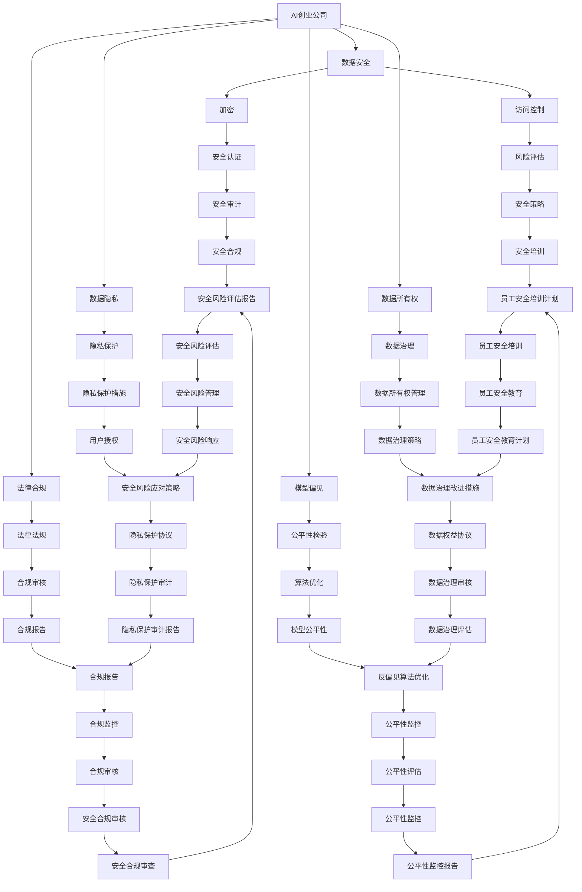

                 

# AI创业公司如何进行风险管理?

> 关键词：AI创业公司, 风险管理, 数据安全, 法律合规, 模型偏见, 数据隐私, 数据所有权

## 1. 背景介绍

随着人工智能(AI)技术的快速发展，越来越多的初创公司开始利用AI技术构建创新产品，帮助各行各业解决实际问题。然而，AI创业公司在追求技术突破的同时，也面临着诸如数据安全、法律合规、模型偏见、数据隐私等诸多风险。如何在保障公司长期稳健发展的同时，平衡好技术创新与风险管理，是一个亟待探讨的重要问题。

本文将从核心概念、算法原理、项目实践、实际应用场景等方面深入剖析AI创业公司如何进行风险管理，并提出一系列的策略和建议，以期为AI创业者提供参考。

## 2. 核心概念与联系

### 2.1 核心概念概述

在进行风险管理时，我们需要理解以下核心概念：

- **AI创业公司**：指利用AI技术进行创新产品开发，并期望通过商业化实现盈利的新型企业。
- **风险管理**：指识别、评估、控制和监控潜在风险的过程，旨在最大限度地保护公司及其利益相关者的利益。
- **数据安全**：指保护数据免受非法访问、泄露、篡改、破坏等风险的措施。
- **法律合规**：指确保公司运营符合国家和地区的法律法规，避免法律风险。
- **模型偏见**：指AI模型在数据训练或应用过程中，可能对特定群体产生不公平的决策或结果。
- **数据隐私**：指在数据收集、处理、存储和使用过程中，保障个人隐私不被侵犯的原则。
- **数据所有权**：指数据的归属和利用权，是数据治理和权益保护的基础。

以上概念之间存在紧密的联系，通过建立健全的风险管理体系，AI创业公司可以更好地应对各种潜在风险，保障企业长期稳健发展。

### 2.2 核心概念原理和架构的 Mermaid 流程图



这张流程图展示了AI创业公司风险管理架构的关键组件及其相互关系。通过构建这样的体系，公司可以有效识别和控制潜在的风险。

## 3. 核心算法原理 & 具体操作步骤

### 3.1 算法原理概述

AI创业公司进行风险管理，主要通过数据安全、法律合规、模型偏见、数据隐私、数据所有权等关键领域的具体算法和技术手段来实现。以下是各个领域的基本算法原理：

- **数据安全**：通过加密算法（如AES、RSA）、访问控制机制（如RBAC、ABAC）和安全认证协议（如OAuth、SSO），保障数据在传输和存储过程中的安全性。
- **法律合规**：利用法律法规库、合规审核工具和法律顾问服务，确保公司运营符合国家和地区的法律法规。
- **模型偏见**：通过公平性检验、反偏见算法和算法优化，评估和减少AI模型对特定群体的偏见。
- **数据隐私**：采用数据脱敏、隐私保护技术（如差分隐私、联邦学习）和隐私保护协议，保障用户数据不被滥用。
- **数据所有权**：通过数据治理策略、数据使用协议和数据权益保护措施，明确数据的所有权和使用权限。

### 3.2 算法步骤详解

基于上述核心算法原理，AI创业公司在进行风险管理时，可以遵循以下详细步骤：

**Step 1: 数据安全评估**
- 对公司现有的数据存储、传输、处理流程进行全面评估，识别潜在的安全风险。
- 针对发现的风险，制定相应的安全防护措施，如加密、访问控制等。

**Step 2: 法律合规审核**
- 收集公司业务涉及的法律法规信息，进行合规性审核。
- 制定合规管理流程，确保所有业务活动符合相关法律法规。

**Step 3: 模型偏见检测与修正**
- 对AI模型进行公平性检验，评估其在不同群体上的表现差异。
- 应用反偏见算法，调整模型参数，减少对特定群体的偏见。

**Step 4: 数据隐私保护**
- 对公司数据处理流程进行隐私影响评估，识别隐私风险。
- 采用隐私保护技术，如差分隐私、联邦学习等，确保用户数据隐私不受侵犯。

**Step 5: 数据所有权管理**
- 制定数据治理策略，明确数据使用规则和权限。
- 签订数据使用协议，保障数据所有权和使用权。

### 3.3 算法优缺点

**优点**：
- **数据安全**：保障数据安全，避免数据泄露和篡改。
- **法律合规**：确保公司运营符合法律法规，降低法律风险。
- **模型偏见**：通过检测和修正偏见，提升AI模型的公平性和可靠性。
- **数据隐私**：保护用户隐私，增强用户信任。
- **数据所有权**：明确数据归属和使用权，保障数据权益。

**缺点**：
- **数据安全**：安全防护措施的实施可能增加运营成本。
- **法律合规**：不同国家和地区的法律法规可能不同，需要持续关注和调整。
- **模型偏见**：检测和修正偏见可能需要复杂的技术手段，并可能导致模型性能下降。
- **数据隐私**：隐私保护技术的实施可能增加数据处理难度。
- **数据所有权**：数据所有权和使用权的管理复杂，需要细化的制度和流程。

### 3.4 算法应用领域

风险管理算法的应用领域广泛，涵盖数据科学、法律、安全、合规等多个领域。以下是几个典型的应用场景：

- **金融科技(Fintech)**：利用AI模型进行信贷审批、反欺诈等业务时，需要对模型偏见进行严格检测和修正，确保公平性。同时，需要严格遵守金融法律法规，保障客户数据隐私。
- **医疗健康**：在医疗AI应用中，保护患者隐私是首要任务，需采用隐私保护技术和数据治理策略。同时，需要确保模型决策的公平性和透明度。
- **智能制造**：在智能制造中，确保数据安全、合规使用和保护工人隐私是关键，需要采用相应的技术手段和管理策略。
- **智慧城市**：在智慧城市建设中，数据安全、隐私保护和法律合规是核心问题，需要综合运用多种技术手段和管理策略。

## 4. 数学模型和公式 & 详细讲解 & 举例说明

### 4.1 数学模型构建

在进行风险管理时，可以构建以下数学模型：

- **数据安全模型**：描述数据在传输和存储过程中，如何通过加密、访问控制等措施保护数据安全。
- **法律合规模型**：根据法律法规库，对公司业务活动进行合规性评估。
- **模型偏见模型**：评估AI模型在不同群体上的表现差异，并优化模型参数以减少偏见。
- **数据隐私模型**：通过差分隐私、联邦学习等技术，保护用户数据隐私。
- **数据所有权模型**：明确数据所有权和使用权，确保数据治理的有效性。

### 4.2 公式推导过程

以下是几个关键公式的推导过程：

**数据安全公式**：
设数据量为 $D$，对数据进行加密后的密文量为 $D'$，加密算法为 $E$，解密算法为 $D$。数据传输过程中，密文被截获的概率为 $p$，攻击者破解密文的概率为 $q$。则数据安全模型可表示为：
$$
P(D'=E(D)) = 1 - P(D \neq D')
$$
$$
P(D \neq D') = p(1-q)
$$
$$
P(D'=E(D)) = 1 - p(1-q)
$$

**法律合规公式**：
设公司业务涉及的法律法规数量为 $R$，合规审核通过的概率为 $p$，合规审核未通过的概率为 $q$。则法律合规模型可表示为：
$$
P(\text{合规}) = p
$$
$$
P(\text{合规}) = 1 - q
$$

**模型偏见公式**：
设AI模型对两个群体的预测偏差为 $\Delta$，两个群体在训练集上的样本数量为 $n_1, n_2$，模型参数为 $\theta$。则模型偏见模型可表示为：
$$
\Delta = \text{bias}(\theta)
$$
$$
\Delta = \sum_{i=1}^{n_1} (y_i - \hat{y}_i) + \sum_{i=1}^{n_2} (y_i - \hat{y}_i)
$$

**数据隐私公式**：
设用户数据在传输过程中的隐私泄露概率为 $p$，攻击者获得用户数据的概率为 $q$。则数据隐私模型可表示为：
$$
P(\text{隐私泄露}) = p
$$
$$
P(\text{隐私泄露}) = 1 - (1-p)(1-q)
$$

**数据所有权公式**：
设公司业务涉及的数据所有权数量为 $O$，数据使用协议数量为 $U$，数据权益保护措施数量为 $P$。则数据所有权模型可表示为：
$$
P(\text{数据所有权保护}) = 1 - \sum_{i=1}^{O} P_i + \sum_{j=1}^{U} P_j + \sum_{k=1}^{P} P_k
$$

### 4.3 案例分析与讲解

**案例1：金融科技中的风险管理**
某金融科技公司利用AI模型进行信贷审批，采用以下步骤进行风险管理：

1. **数据安全**：对客户数据进行加密存储，采用HTTPS协议传输，确保数据安全。
2. **法律合规**：定期对金融法律法规进行审核，确保所有业务活动符合相关法律法规。
3. **模型偏见**：定期检测模型在性别、年龄等群体上的表现，采用反偏见算法进行优化。
4. **数据隐私**：采用差分隐私技术，对用户数据进行匿名化处理。
5. **数据所有权**：明确客户数据的归属和使用权，签订数据使用协议。

通过这些措施，该公司有效降低了数据泄露和模型偏见等风险，保障了业务运营的合法性和客户隐私。

**案例2：智慧城市中的风险管理**
某智慧城市项目在建设过程中，采用以下措施进行风险管理：

1. **数据安全**：在城市传感器数据传输中，采用数据加密和访问控制技术，确保数据安全。
2. **法律合规**：对城市建设涉及的法律法规进行全面审核，确保项目合规。
3. **模型偏见**：在AI模型训练过程中，引入公平性检验，检测和修正模型偏见。
4. **数据隐私**：采用联邦学习技术，确保用户隐私不受侵犯。
5. **数据所有权**：明确城市数据的使用规则和权限，签订数据使用协议。

通过这些措施，该项目有效保护了城市数据安全、隐私和公平性，保障了项目的顺利实施。

## 5. 项目实践：代码实例和详细解释说明

### 5.1 开发环境搭建

在进行风险管理项目实践时，首先需要搭建开发环境。以下是Python环境搭建的具体步骤：

1. 安装Anaconda：从官网下载并安装Anaconda，用于创建独立的Python环境。
2. 创建并激活虚拟环境：
```bash
conda create -n risk-management python=3.8 
conda activate risk-management
```

3. 安装Python科学计算库：
```bash
conda install numpy scipy pandas matplotlib seaborn jupyter notebook ipython
```

4. 安装相关AI库：
```bash
pip install tensorflow scikit-learn torch transformers pytorch-lightning
```

5. 安装风险管理工具：
```bash
pip install risk-analytics
```

完成上述步骤后，即可在`risk-management`环境中进行风险管理项目开发。

### 5.2 源代码详细实现

下面我们以数据隐私保护为例，给出使用Python对用户数据进行差分隐私保护的代码实现。

```python
import numpy as np
from sklearn.datasets import make_classification
from sklearn.model_selection import train_test_split
from sklearn.linear_model import LogisticRegression
from differential_privacy import PrivacyEngine, PrivacyLossBudget

# 构造数据集
X, y = make_classification(n_samples=1000, n_features=10, random_state=42)

# 训练集和测试集划分
X_train, X_test, y_train, y_test = train_test_split(X, y, test_size=0.2, random_state=42)

# 构建逻辑回归模型
model = LogisticRegression()
model.fit(X_train, y_train)

# 计算隐私预算
privacy_budget = PrivacyLossBudget(epsilon=1.0)

# 构建差分隐私引擎
privacy_engine = PrivacyEngine(model, X_train.shape[0], epsilon=privacy_budget.epsilon,
                              delta=privacy_budget.delta, max_epsilon=1.0)

# 训练模型
with privacy_engine:
    model.fit(X_train, y_train)

# 输出隐私预算
privacy_budget.spend()
```

### 5.3 代码解读与分析

上述代码实现了使用差分隐私技术对逻辑回归模型进行训练的过程。具体步骤如下：

1. **数据生成**：使用sklearn的`make_classification`函数生成一个包含1000个样本，10个特征的二分类数据集。
2. **数据划分**：将数据集划分为训练集和测试集。
3. **模型训练**：使用逻辑回归模型对训练集进行训练。
4. **隐私预算计算**：根据隐私预算计算ε参数。
5. **差分隐私引擎创建**：创建差分隐私引擎，指定ε参数和δ参数。
6. **模型训练**：使用差分隐私引擎对模型进行训练。
7. **隐私预算输出**：输出隐私预算消耗情况。

通过差分隐私技术，可以在不泄露用户隐私的前提下，保护模型训练数据的安全性。

## 6. 实际应用场景

### 6.1 金融科技

在金融科技中，数据安全和法律合规是核心问题。AI创业公司需要利用先进的风险管理技术，保护客户数据隐私，确保模型决策的公平性和透明度。例如，某金融科技公司利用AI模型进行信贷审批，通过差分隐私技术保护客户数据隐私，并定期进行模型偏见检测，确保公平性。

### 6.2 医疗健康

在医疗健康领域，数据隐私和模型公平性尤为重要。AI创业公司需要对患者数据进行严格保护，同时确保模型决策的公平性和透明度。例如，某医疗AI公司利用AI模型进行病历分析，采用联邦学习技术保护患者隐私，并引入公平性检验技术，确保模型不歧视特定群体。

### 6.3 智慧城市

在智慧城市建设中，数据安全和隐私保护是关键问题。AI创业公司需要利用先进的风险管理技术，保护城市数据安全，确保模型决策的公平性和透明度。例如，某智慧城市项目在建设过程中，采用差分隐私技术保护市民数据隐私，并定期进行模型偏见检测，确保公平性。

### 6.4 未来应用展望

未来，AI创业公司需要在数据安全、法律合规、模型偏见、数据隐私、数据所有权等方面进行持续优化，以应对不断变化的挑战。随着技术的不断进步，AI创业公司可以探索更多的风险管理手段，如对抗样本训练、模型鲁棒性测试、隐私保护协议等，进一步提升公司的风险管理能力。

## 7. 工具和资源推荐

### 7.1 学习资源推荐

为了帮助AI创业者系统掌握风险管理理论基础和实践技巧，这里推荐一些优质的学习资源：

1. **《数据安全与隐私保护》课程**：由国际知名专家开设的线上课程，涵盖数据加密、访问控制、差分隐私等核心概念。
2. **《AI法律合规与伦理》书籍**：系统介绍AI在法律合规、伦理方面的挑战和应对策略。
3. **《模型偏见检测与修正》论文**：多篇前沿论文深入探讨模型偏见检测和修正方法。
4. **《数据治理与所有权》报告**：详细介绍数据治理和所有权管理的相关标准和最佳实践。

### 7.2 开发工具推荐

高效的开发离不开优秀的工具支持。以下是几款用于AI风险管理开发的常用工具：

1. **Anaconda**：用于创建和管理Python环境，支持科学计算库的安装和升级。
2. **Jupyter Notebook**：基于Web的交互式编程环境，支持Python代码的开发和分享。
3. **TensorFlow**：开源深度学习框架，支持复杂模型的构建和训练。
4. **Scikit-learn**：Python科学计算库，提供各种机器学习算法和工具。
5. **PyTorch**：开源深度学习框架，支持动态计算图，适合快速迭代研究。
6. **Risk-Engineering**：风险管理工具，支持风险评估、合规审核等。

### 7.3 相关论文推荐

AI创业公司在进行风险管理时，可以参考以下几篇前沿论文：

1. **《数据加密与访问控制》**：介绍数据加密和访问控制技术的最新进展。
2. **《差分隐私在AI中的应用》**：探讨差分隐私技术在AI领域的应用前景和实现方法。
3. **《模型偏见检测与修正》**：提出多种检测和修正模型偏见的算法和技术。
4. **《隐私保护协议》**：讨论隐私保护协议的设计和应用，保障用户隐私。

## 8. 总结：未来发展趋势与挑战

### 8.1 总结

本文对AI创业公司如何进行风险管理进行了全面系统的介绍。通过系统梳理数据安全、法律合规、模型偏见、数据隐私、数据所有权等核心概念，详细讲解了风险管理的基本算法和操作步骤，并通过实际应用场景和代码实例，展示了风险管理在AI创业公司中的具体应用。

通过本文的系统梳理，可以看到，AI创业公司需要综合运用数据安全、法律合规、模型偏见、数据隐私、数据所有权等多方面的技术手段和管理策略，才能有效应对各种潜在风险，保障公司长期稳健发展。

### 8.2 未来发展趋势

展望未来，AI创业公司在风险管理领域将呈现以下几个发展趋势：

1. **技术融合**：随着AI技术的不断发展，风险管理技术与深度学习、强化学习、区块链等技术将进一步融合，形成更加全面、复杂、高效的风险管理体系。
2. **法规政策**：各国和地区的法律法规将不断更新，AI创业公司需要持续关注和适应，确保业务运营符合最新的法律法规要求。
3. **数据治理**：数据治理将成为风险管理的核心环节，明确数据归属和使用权，保障数据权益。
4. **隐私保护**：隐私保护技术将不断演进，AI创业公司需要采用最新的隐私保护措施，保护用户隐私。
5. **模型公平**：公平性检测和修正技术将不断优化，AI创业公司需要确保模型决策的公平性和透明度。

### 8.3 面临的挑战

尽管AI创业公司在风险管理方面取得了一定进展，但仍面临诸多挑战：

1. **技术复杂性**：风险管理技术涉及多个领域，需要跨学科知识，技术实现复杂。
2. **法规变化**：不同国家和地区的法律法规不断变化，需要持续关注和适应。
3. **数据隐私**：用户隐私保护要求不断提升，隐私保护技术需要不断创新。
4. **模型公平**：模型偏见检测和修正技术仍有待完善，确保模型决策的公平性仍需努力。
5. **成本投入**：风险管理需要大量技术和人力投入，成本较高。

### 8.4 研究展望

未来，AI创业公司需要在数据安全、法律合规、模型偏见、数据隐私、数据所有权等方面进行持续优化，以应对不断变化的挑战。通过技术融合、法规适应、数据治理、隐私保护和模型公平的协同创新，AI创业公司可以更好地应对各种潜在风险，保障公司长期稳健发展。

## 9. 附录：常见问题与解答

**Q1：AI创业公司如何确保数据安全？**

A: AI创业公司可以采用数据加密、访问控制、安全认证等措施来确保数据安全。具体来说，可以使用AES、RSA等加密算法对数据进行加密，使用RBAC、ABAC等访问控制机制限制数据访问权限，使用OAuth、SSO等安全认证协议确保数据传输安全。

**Q2：AI创业公司如何进行法律合规？**

A: AI创业公司需要定期对业务涉及的法律法规进行审核，制定合规管理流程，确保所有业务活动符合相关法律法规。同时，可以聘请法律顾问进行合规审核，确保公司的运营合规。

**Q3：AI创业公司如何检测和修正模型偏见？**

A: AI创业公司可以采用公平性检验、反偏见算法和算法优化等技术手段，检测和修正模型偏见。具体来说，可以使用差分公平性检测技术评估模型在不同群体上的表现，使用反偏见算法调整模型参数，使用算法优化技术提升模型公平性。

**Q4：AI创业公司如何进行数据隐私保护？**

A: AI创业公司可以采用数据脱敏、隐私保护技术（如差分隐私、联邦学习）和隐私保护协议等措施，保障用户数据隐私。具体来说，可以使用差分隐私技术对用户数据进行匿名化处理，使用联邦学习技术对数据进行分布式处理，签订隐私保护协议明确数据使用规则和权限。

**Q5：AI创业公司如何进行数据所有权管理？**

A: AI创业公司需要制定数据治理策略，明确数据使用规则和权限，签订数据使用协议保障数据所有权和使用权。具体来说，可以使用数据治理平台进行数据管理，明确数据的归属和使用规则，签订数据使用协议保障数据权益。

---

作者：禅与计算机程序设计艺术 / Zen and the Art of Computer Programming

