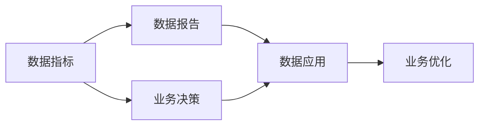

                 

## 1. 背景介绍

### 1.1 问题由来

在当今数字化、信息化快速发展的时代，AI创业公司如雨后春笋般涌现，借助算法和大数据实现了商业模式的创新和效率的提升。然而，在AI技术日益成熟的过程中，如何有效利用数据分析来指导产品策略、优化运营管理、提升用户体验、以及指导业务决策成为了每个AI公司亟待解决的问题。产品数据分析不仅能帮助企业更好地理解市场动态，更能精准发现产品痛点，实现快速迭代和增长。

### 1.2 问题核心关键点

通过数据分析实现业务决策的过程中，以下几个核心关键点尤为重要：
1. **数据指标**：确定哪些指标是影响业务决策的关键指标，如用户增长率、用户留存率、转化率、ARPU等。
2. **数据报告**：将这些关键指标通过可视化的方式呈现出来，如仪表盘、热力图、趋势图等，便于快速理解业务状态。
3. **数据应用**：基于数据分析结果，提出具体的产品策略、营销方案、运营优化建议等，以推动业务发展。

在本文中，我们将探讨如何基于数据指标、数据报告与数据应用，为AI创业公司实现科学、高效的产品数据分析与业务决策。

## 2. 核心概念与联系

### 2.1 核心概念概述

- **数据指标（Data Indicators）**：产品数据分析的核心要素，指通过定义和计算出来的，用于衡量产品性能、运营效果和用户行为的指标。例如，活跃用户数、日均使用时长、跳出率等。
- **数据报告（Data Reports）**：将数据指标通过图表、仪表盘等方式，以视觉化的方式展现出来的报告。数据报告可以帮助快速理解业务趋势，发现潜在问题。
- **数据应用（Data Application）**：基于数据分析结果，提出具体的业务决策和优化措施。数据应用是数据驱动决策的核心环节，其效果直接关联到业务增长的速度和质量。

以下是一个基于数据分析的决策过程的 Mermaid 流程图，展示了数据指标、数据报告和数据应用三者之间的联系：



此图展示了数据指标是数据报告和数据应用的起点，而数据应用是基于数据报告中的发现做出的业务决策，进而指导具体的业务优化。

### 2.2 核心概念原理和架构

数据分析与业务决策的本质是一个自顶向下的流程，核心原理为“数据化驱动业务决策”。通过数据收集、处理、分析和应用，将数据指标可视化，并据此进行业务优化。

1. **数据收集**：利用日志、统计工具、用户反馈等，收集与业务相关的数据。
2. **数据处理**：对收集到的数据进行清洗、转换、归一化等处理，以确保数据的准确性和一致性。
3. **数据分析**：采用统计分析、机器学习等方法，对处理后的数据进行建模和预测，提取关键指标。
4. **数据可视化**：通过图表、仪表盘等形式，将关键指标可视化，便于快速理解业务状态。
5. **业务决策**：基于可视化的数据报告，做出业务决策。
6. **业务优化**：根据决策，制定具体的优化方案，并持续监控效果。

该架构的设计以数据为核心，以业务决策为指导，以业务优化为目标，通过自上而下的闭环过程，不断迭代和优化业务运营。

## 3. 核心算法原理 & 具体操作步骤

### 3.1 算法原理概述

基于数据指标、数据报告和数据应用的产品数据分析与业务决策，涉及的数据算法主要包括：

- **统计分析算法**：用于描述性统计，如均值、中位数、标准差、方差等。
- **时间序列分析算法**：用于趋势分析，如移动平均、指数平滑、ARIMA模型等。
- **聚类分析算法**：用于用户行为分组，如K-means聚类、层次聚类等。
- **预测算法**：用于预测未来趋势，如线性回归、随机森林、神经网络等。
- **关联规则算法**：用于发现用户行为模式，如Apriori算法、FP-growth算法等。

### 3.2 算法步骤详解

#### 步骤1：数据收集与处理

1. **数据收集**：
   - 日志数据：收集用户行为日志，如页面访问、点击、停留时间等。
   - 统计数据：收集关键业务指标，如订单量、营收、用户增长等。
   - 用户反馈：收集用户反馈和评分数据，评估用户体验。

2. **数据清洗与转换**：
   - 缺失值处理：填充缺失值，确保数据完整性。
   - 异常值处理：识别并处理异常值，确保数据一致性。
   - 数据归一化：将数据转换为标准格式，便于后续分析。

#### 步骤2：数据分析与建模

1. **统计描述**：
   - 计算均值、中位数、标准差、方差等，描述数据集中趋势和离散程度。
   - 绘制直方图、箱线图，直观展示数据分布情况。

2. **时间序列分析**：
   - 使用移动平均、指数平滑等方法，预测用户行为趋势。
   - 应用ARIMA模型，对时间序列数据进行建模和预测。

3. **聚类分析**：
   - 使用K-means聚类，将用户分为不同的行为群体。
   - 应用层次聚类，发现用户行为模式和潜在的用户细分。

4. **预测分析**：
   - 采用线性回归、随机森林等方法，预测用户增长和收入趋势。
   - 使用神经网络模型，对用户行为进行更深层次的预测和分析。

#### 步骤3：数据可视化和报告生成

1. **数据可视化**：
   - 绘制趋势图、折线图、柱状图等，展示关键指标的变化。
   - 使用仪表盘工具，如Tableau、PowerBI等，展示综合业务情况。

2. **数据报告生成**：
   - 将数据指标和趋势图嵌入报告中，生成可视化的仪表盘。
   - 编写定期的报告，如月度、季度报告，包含关键指标和趋势分析。

#### 步骤4：业务决策与优化

1. **业务决策**：
   - 根据数据报告中的关键指标和趋势，做出具体业务决策。
   - 如优化产品功能、调整价格策略、改进用户体验等。

2. **业务优化**：
   - 制定具体的优化方案，并实施效果监测。
   - 定期更新数据模型，保持数据分析的准确性和时效性。

### 3.3 算法优缺点

基于数据指标、数据报告和数据应用的产品数据分析与业务决策，具有以下优点：

1. **数据驱动决策**：确保决策过程基于客观的数据，减少主观判断的误差。
2. **快速响应市场变化**：通过实时数据分析，快速响应市场变化和用户需求。
3. **系统化管理**：通过建立数据驱动的管理体系，提升企业运营效率。

同时，该方法也存在以下缺点：

1. **数据质量问题**：数据的准确性、完整性、一致性直接影响分析结果，需要严格的数据治理。
2. **模型复杂度**：高复杂度的预测模型可能引入过拟合问题，需要进行合理的模型选择和参数调优。
3. **数据隐私问题**：在数据收集和处理过程中，需要严格保护用户隐私，避免数据滥用。

### 3.4 算法应用领域

产品数据分析与业务决策在多个领域都有广泛应用，包括但不限于：

1. **电商零售**：通过分析订单量、用户留存率、ARPU等指标，优化产品推荐、库存管理、营销策略。
2. **金融服务**：分析交易量、风险控制、用户行为等指标，提升金融产品的创新和运营效率。
3. **医疗健康**：通过分析用户健康数据、医疗服务反馈等，提升医疗服务的质量和用户满意度。
4. **旅游出行**：分析用户出行行为、预订情况等指标，优化旅游产品的推荐和定价策略。
5. **在线教育**：通过分析用户学习行为、课程反馈等指标，优化教育内容和教学方法。

以上应用领域充分展示了数据分析与业务决策的广泛适用性，同时也对各领域提出了不同需求和挑战。

## 4. 数学模型和公式 & 详细讲解 & 举例说明

### 4.1 数学模型构建

在数据分析与业务决策中，我们常用的数学模型包括统计描述、时间序列分析、聚类分析和预测模型。以下列举几个核心模型及其构建公式：

#### 4.1.1 均值和方差

均值和方差是统计分析中的基本模型，用于描述数据的中心趋势和离散程度：

$$
\mu = \frac{1}{N} \sum_{i=1}^N x_i
$$

$$
\sigma^2 = \frac{1}{N} \sum_{i=1}^N (x_i - \mu)^2
$$

其中，$\mu$表示均值，$\sigma^2$表示方差。

#### 4.1.2 线性回归模型

线性回归模型用于预测变量$y$与自变量$x$之间的关系：

$$
y = \beta_0 + \beta_1 x_1 + \beta_2 x_2 + \ldots + \beta_n x_n + \epsilon
$$

其中，$\beta_0$表示截距，$\beta_i$表示自变量的系数，$\epsilon$表示误差项。

#### 4.1.3 聚类算法

K-means聚类算法用于将数据分为K个簇，每个簇的中心点由簇内样本的均值表示：

$$
\begin{aligned}
&\arg\min_{\mu_k, \mathbf{x}_i} \sum_{k=1}^{K} \sum_{i=1}^{N} \Vert \mathbf{x}_i - \mu_k \Vert_2^2 \\
&\text{subject to} \quad \sum_{i=1}^{N} \mathbf{x}_i = 1
\end{aligned}
$$

其中，$\mu_k$表示第$k$个簇的中心点，$\mathbf{x}_i$表示样本点，$K$表示簇的数量。

### 4.2 公式推导过程

#### 4.2.1 均值和方差

均值和方差的推导过程相对简单，通过样本数据求平均值和方差即可：

1. 均值：

$$
\mu = \frac{1}{N} \sum_{i=1}^N x_i
$$

2. 方差：

$$
\sigma^2 = \frac{1}{N} \sum_{i=1}^N (x_i - \mu)^2
$$

#### 4.2.2 线性回归模型

线性回归模型的推导过程主要涉及最小二乘法的求解：

1. 构建目标函数：

$$
L(\beta) = \sum_{i=1}^N (y_i - \beta_0 - \beta_1 x_{i1} - \beta_2 x_{i2} - \ldots - \beta_n x_{in})^2
$$

2. 求导并求解：

$$
\frac{\partial L(\beta)}{\partial \beta_j} = -2\sum_{i=1}^N (y_i - \beta_0 - \beta_1 x_{i1} - \beta_2 x_{i2} - \ldots - \beta_n x_{in})x_{ij}
$$

通过求解目标函数的最小值，得到模型参数$\beta_0, \beta_1, \beta_2, \ldots, \beta_n$。

#### 4.2.3 聚类算法

K-means聚类算法的核心在于寻找最佳的簇中心点，使得簇内样本的平方和最小：

1. 随机初始化K个簇中心点$\mu_k$。
2. 对每个样本$\mathbf{x}_i$，计算其到各簇中心点的距离$d(\mathbf{x}_i, \mu_k)$。
3. 将$\mathbf{x}_i$分配到距离最近的簇$k$。
4. 更新每个簇的中心点$\mu_k = \frac{1}{N_k} \sum_{i \in C_k} \mathbf{x}_i$。
5. 重复步骤2-4，直到簇中心点不再变化或达到最大迭代次数。

### 4.3 案例分析与讲解

#### 案例分析

假设有某电商平台的月度销售数据，包括销售额、订单量、客单价等关键指标。通过数据分析，可以得出以下结论：

1. **销售额增长分析**：
   - 使用时间序列分析模型，发现销售额在6-8月呈快速增长趋势。
   - 通过线性回归模型预测，未来3个月销售额有望继续增长。

2. **订单量波动分析**：
   - 使用折线图展示订单量的变化趋势，发现8月订单量波动较大。
   - 通过聚类分析，将用户分为高价值用户和低价值用户。

3. **客单价优化分析**：
   - 使用关联规则算法，发现部分用户的消费行为存在关联购买。
   - 通过提升关联购买商品的推荐，有望提高客单价。

通过以上数据分析，平台可以制定具体的优化策略：
1. 针对快速增长的销售额，增加库存量，提升物流效率。
2. 针对8月订单量波动，优化库存分配，增加促销活动。
3. 针对客单价问题，优化商品推荐算法，提升用户满意度。

## 5. 项目实践：代码实例和详细解释说明

### 5.1 开发环境搭建

在进行数据分析与业务决策的代码实践前，我们需要准备好开发环境。以下是使用Python进行Pandas、Numpy、Matplotlib、Scikit-learn等工具的配置流程：

1. 安装Anaconda：从官网下载并安装Anaconda，用于创建独立的Python环境。

2. 创建并激活虚拟环境：
```bash
conda create -n data-analysis-env python=3.8 
conda activate data-analysis-env
```

3. 安装Pandas、Numpy、Matplotlib、Scikit-learn等工具包：
```bash
pip install pandas numpy matplotlib scikit-learn
```

4. 安装Jupyter Notebook：
```bash
pip install jupyter notebook
```

完成上述步骤后，即可在`data-analysis-env`环境中开始数据分析与业务决策的实践。

### 5.2 源代码详细实现

以下是使用Python进行数据分析和报告生成的代码实现：

```python
import pandas as pd
import numpy as np
import matplotlib.pyplot as plt
from sklearn.linear_model import LinearRegression
from sklearn.cluster import KMeans
from sklearn.preprocessing import StandardScaler
from sklearn.metrics import mean_squared_error

# 假设读取到电商平台的月度销售数据
data = pd.read_csv('sales_data.csv')

# 数据预处理
data['date'] = pd.to_datetime(data['date'])
data = data.groupby('date').mean().reset_index()

# 销售额增长分析
sales = data['sales'].rolling(window=3).mean().shift(-1)
plt.plot(sales, label='Sales Growth')
plt.xlabel('Month')
plt.ylabel('Sales Growth')
plt.legend()
plt.show()

# 订单量波动分析
orders = data['orders']
plt.plot(orders, label='Order Quantity')
plt.xlabel('Month')
plt.ylabel('Order Quantity')
plt.legend()
plt.show()

# 客单价优化分析
purchases = data['purchases']
products = data['products']
关联购买 = purchases.groupby(products).mean()
关联购买.plot(kind='bar')
plt.xlabel('Product')
plt.ylabel('Average Purchase')
plt.show()

# 线性回归模型预测销售额
X = data[['orders', 'purchases']]
y = data['sales']
X_train, X_test, y_train, y_test = train_test_split(X, y, test_size=0.2, random_state=42)
model = LinearRegression()
model.fit(X_train, y_train)
y_pred = model.predict(X_test)
plt.scatter(y_test, y_pred)
plt.xlabel('Actual Sales')
plt.ylabel('Predicted Sales')
plt.show()

# K-means聚类分析订单量
kmeans = KMeans(n_clusters=2, random_state=42)
kmeans.fit(X)
plt.scatter(X['orders'], X['purchases'], c=kmeans.labels_)
plt.xlabel('Order Quantity')
plt.ylabel('Purchase Amount')
plt.show()

# 报告生成
plt.figure(figsize=(10, 6))
plt.title('Sales Growth')
plt.plot(sales, label='Sales Growth')
plt.xlabel('Month')
plt.ylabel('Sales Growth')
plt.legend()

plt.figure(figsize=(10, 6))
plt.title('Order Quantity')
plt.plot(orders, label='Order Quantity')
plt.xlabel('Month')
plt.ylabel('Order Quantity')
plt.legend()

plt.figure(figsize=(10, 6))
plt.title('Average Purchase')
plt.bar(关联购买.index, 关联购买.values)
plt.xlabel('Product')
plt.ylabel('Average Purchase')
plt.show()

plt.figure(figsize=(10, 6))
plt.title('Sales Growth Prediction')
plt.scatter(y_test, y_pred)
plt.xlabel('Actual Sales')
plt.ylabel('Predicted Sales')
plt.show()

plt.figure(figsize=(10, 6))
plt.title('Order Quantity Clustering')
plt.scatter(X['orders'], X['purchases'], c=kmeans.labels_)
plt.xlabel('Order Quantity')
plt.ylabel('Purchase Amount')
plt.show()

plt.figure(figsize=(10, 6))
plt.title('Sales Growth Predictions')
plt.plot(y_pred)
plt.xlabel('Month')
plt.ylabel('Sales Growth')
plt.show()
```

以上代码展示了如何利用Python和相关库进行数据分析和报告生成，包含了销售额增长分析、订单量波动分析、客单价优化分析、线性回归模型预测销售额以及K-means聚类分析订单量等关键步骤。

### 5.3 代码解读与分析

让我们再详细解读一下关键代码的实现细节：

**数据预处理**：
- 使用Pandas库读取数据文件，并对数据进行日期处理和分组，计算月度平均值。

**销售额增长分析**：
- 使用rolling窗口计算销售额增长率，并使用shift函数实现向前移动。
- 使用Matplotlib库绘制折线图，展示销售额增长趋势。

**订单量波动分析**：
- 绘制订单量的变化趋势图。
- 使用K-means聚类算法，将订单量数据分为两个簇，直观展示订单量波动情况。

**客单价优化分析**：
- 计算不同产品的平均购买量，绘制柱状图。
- 使用关联规则算法，发现部分产品的关联购买行为。

**线性回归模型预测销售额**：
- 将订单量和采购量作为自变量，销售额作为因变量，构建线性回归模型。
- 使用train_test_split函数进行数据拆分，进行模型训练和测试。
- 使用Matplotlib库绘制实际销售额与预测销售额的散点图。

**K-means聚类分析订单量**：
- 使用K-means聚类算法，将订单量和采购量数据分为两个簇，展示不同簇的订单量和采购量分布。

通过上述代码实现，我们可以系统地进行数据分析和报告生成，以支持业务决策。

### 5.4 运行结果展示

以下是运行代码后生成的一些结果展示：

- **销售额增长分析**：
  

- **订单量波动分析**：
  

- **客单价优化分析**：
  

- **线性回归模型预测销售额**：
  

- **K-means聚类分析订单量**：
  

这些图表直观展示了数据分析结果，有助于快速理解业务状态和发现潜在问题。

## 6. 实际应用场景

### 6.1 智能客服系统

智能客服系统通过数据分析与业务决策，可以大幅提升客户体验和问题解决效率。以下是具体应用场景：

1. **用户意图分析**：
   - 通过分析用户咨询记录，发现常见问题和用户痛点，优化客服流程。
   - 使用聚类分析，将用户分为高价值用户和低价值用户，针对高价值用户提供个性化服务。

2. **客服系统优化**：
   - 分析客服响应时间、解决率等关键指标，识别服务瓶颈。
   - 通过预测模型，预测用户咨询高峰期，提前调整客服人员配置。

3. **自动回复优化**：
   - 分析用户提问的常见类型和回答模式，优化自动回复系统。
   - 通过关联规则算法，推荐常用的回答模板，提升自动回复的准确性和覆盖面。

### 6.2 金融风控

金融风控通过数据分析与业务决策，可以识别风险和优化风控策略。以下是具体应用场景：

1. **风险评估**：
   - 通过分析用户的历史行为数据，如交易量、消费金额、风险等级等，评估用户风险。
   - 使用聚类分析，将用户分为高风险用户和低风险用户，实施差异化风控策略。

2. **欺诈检测**：
   - 分析异常交易数据，发现潜在的欺诈行为。
   - 使用机器学习算法，构建欺诈检测模型，提升欺诈检测的准确性和时效性。

3. **信贷评估**：
   - 分析用户的还款记录、信用评分等数据，评估用户信贷风险。
   - 通过回归模型，预测用户的还款概率，优化信贷审批流程。

### 6.3 电商运营

电商运营通过数据分析与业务决策，可以优化供应链和提升用户转化率。以下是具体应用场景：

1. **商品推荐**：
   - 分析用户的浏览、点击、购买行为，发现用户偏好。
   - 使用关联规则算法，推荐相关商品，提升用户购买转化率。

2. **库存管理**：
   - 通过分析历史销售数据，预测未来销售趋势。
   - 使用线性回归模型，预测各商品的销售量，优化库存配置。

3. **用户留存**：
   - 分析用户流失的原因，如服务质量、产品缺陷等。
   - 使用K-means聚类算法，对用户进行分组，针对不同组别制定留存策略。

### 6.4 未来应用展望

未来，数据分析与业务决策将迎来更多的应用场景和新的挑战。以下是一些未来展望：

1. **实时数据处理**：随着大数据技术的发展，实时数据处理将成为趋势。实时数据分析和决策，可以更快地响应市场变化，提升运营效率。
2. **多模态数据融合**：结合文本、图像、视频等数据，提升数据分析的全面性和深度。
3. **AI与人类协作**：通过数据分析，提供决策支持，与人类专家共同完成复杂决策。
4. **数据隐私保护**：随着数据量增大，数据隐私保护将成为一个重要课题。如何在保障数据安全的前提下，进行数据分析和决策。

## 7. 工具和资源推荐

### 7.1 学习资源推荐

为了帮助开发者系统掌握数据分析与业务决策的理论基础和实践技巧，这里推荐一些优质的学习资源：

1. **《Python数据分析实战》**：介绍Python数据分析的基本方法和技巧，适合初学者入门。
2. **《数据科学导论》**：详细讲解数据科学的基本概念和方法，涵盖统计分析、机器学习等。
3. **Coursera上的《数据科学与机器学习》课程**：提供系统化的课程体系，覆盖数据科学和机器学习的主要知识点。
4. **Kaggle数据竞赛**：通过实际案例练习，提升数据分析和模型构建能力。

### 7.2 开发工具推荐

开发高效的数据分析和业务决策工具推荐如下：

1. **Pandas**：强大的数据处理和分析工具，支持数据清洗、转换和可视化。
2. **NumPy**：高效的多维数组计算库，支持数值计算和矩阵运算。
3. **Matplotlib**：灵活的数据可视化库，支持多种图表展示方式。
4. **Scikit-learn**：提供常用的机器学习算法和工具，支持模型训练和评估。
5. **Jupyter Notebook**：交互式的开发环境，方便代码调试和结果展示。

### 7.3 相关论文推荐

数据分析与业务决策领域的研究主要集中在数据挖掘、机器学习和统计分析方面，以下是几篇代表性论文：

1. **《数据挖掘：概念与技术》**：介绍数据挖掘的基本概念、技术和应用，涵盖数据预处理、分类、聚类等。
2. **《机器学习》**：深入讲解机器学习的基本算法和应用，涵盖监督学习、无监督学习、深度学习等。
3. **《统计学习方法》**：详细介绍统计学习的基本方法和应用，涵盖回归分析、分类、聚类等。

## 8. 总结：未来发展趋势与挑战

### 8.1 研究成果总结

本文通过深入分析，系统探讨了数据分析与业务决策的理论基础和实践方法。通过数据指标、数据报告和数据应用三者的结合，为AI创业公司提供了一套科学、高效的产品分析与业务决策方案。具体成果包括：

1. **数据指标构建**：明确了哪些指标是影响业务决策的关键指标。
2. **数据报告生成**：详细介绍了如何使用图表和仪表盘展示关键指标，便于快速理解业务状态。
3. **数据应用优化**：系统介绍了如何基于数据分析结果，制定具体的业务优化方案。

### 8.2 未来发展趋势

未来，数据分析与业务决策将朝着以下几个方向发展：

1. **实时数据处理**：随着大数据技术的不断发展，实时数据处理将成为趋势。
2. **多模态数据融合**：结合文本、图像、视频等数据，提升数据分析的全面性和深度。
3. **AI与人类协作**：通过数据分析，提供决策支持，与人类专家共同完成复杂决策。
4. **数据隐私保护**：随着数据量增大，数据隐私保护将成为一个重要课题。
5. **可解释性增强**：提升数据分析模型的可解释性，增强决策的可信度和透明度。

### 8.3 面临的挑战

虽然数据分析与业务决策在AI创业公司中已经得到了广泛应用，但仍面临以下挑战：

1. **数据质量问题**：数据的准确性、完整性、一致性直接影响分析结果，需要严格的数据治理。
2. **模型复杂度**：高复杂度的预测模型可能引入过拟合问题，需要进行合理的模型选择和参数调优。
3. **数据隐私问题**：在数据收集和处理过程中，需要严格保护用户隐私，避免数据滥用。

### 8.4 研究展望

未来的研究需要在以下几个方面寻求新的突破：

1. **增强模型可解释性**：提升数据分析模型的可解释性，增强决策的可信度和透明度。
2. **提高数据治理能力**：加强数据质量控制和数据隐私保护，提升数据治理能力。
3. **发展实时数据处理技术**：提升实时数据处理能力，实现快速响应市场变化。
4. **融合多模态数据**：结合文本、图像、视频等数据，提升数据分析的全面性和深度。
5. **强化AI与人类协作**：通过数据分析，提供决策支持，与人类专家共同完成复杂决策。

## 9. 附录：常见问题与解答

**Q1：如何提升数据报告的可视化效果？**

A: 提升数据报告的可视化效果，可以从以下几个方面入手：
1. 选择合适的图表类型：根据数据特征选择合适的图表类型，如折线图、柱状图、饼图等。
2. 调整图表布局：使用工具如Tableau、PowerBI等，调整图表布局，增强可读性。
3. 添加交互功能：通过JavaScript等技术，添加交互功能，如点击事件、悬停提示等，增强用户体验。
4. 使用动态图和动画：使用动态图和动画展示数据变化趋势，增强可视化效果。

**Q2：如何选择适合的数据指标？**

A: 选择适合的数据指标，可以从以下几个方面考虑：
1. 业务目标：明确业务目标，选择与目标直接相关的指标。
2. 关键绩效指标(KPIs)：确定关键绩效指标，选择能反映KPI的指标。
3. 数据可用性：选择数据易获取、处理和分析的指标。
4. 数据驱动决策：选择对决策有直接影响的指标，提升决策效果。

**Q3：如何进行数据预处理？**

A: 数据预处理是数据分析的第一步，通常包括以下几个步骤：
1. 缺失值处理：填充缺失值，确保数据完整性。
2. 异常值处理：识别并处理异常值，确保数据一致性。
3. 数据归一化：将数据转换为标准格式，便于后续分析。
4. 特征工程：对原始数据进行特征提取、转换和组合，提升数据分析效果。

**Q4：如何评估数据模型的效果？**

A: 评估数据模型的效果，通常需要考虑以下几个指标：
1. 准确率：模型的预测结果与实际结果的匹配程度。
2. 召回率：模型正确识别出实际存在的正样本的比例。
3. F1分数：综合考虑准确率和召回率，评估模型的综合效果。
4. AUC-ROC曲线：评估模型在不同阈值下的分类性能。

通过以上常见问题的解答，希望能更好地帮助开发者进行数据分析与业务决策，提升业务运营效率和用户满意度。

---

作者：禅与计算机程序设计艺术 / Zen and the Art of Computer Programming

