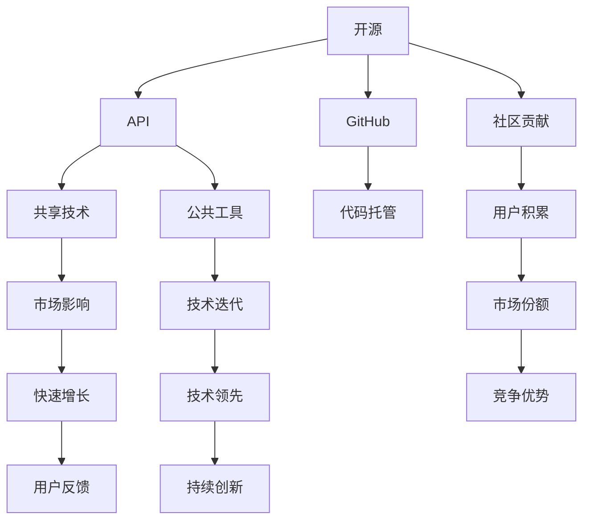

                 

## 1. 背景介绍

### 1.1 问题由来

在当今的数字化转型浪潮中，开源与封闭两种技术策略的权衡已成为AI创业公司发展的核心问题之一。开源策略通过共享技术成果，迅速积累用户和市场份额，但同时也面临竞争压力和技术泄密的隐患；封闭策略则通过保留核心技术，增强企业竞争力和控制权，但难以快速占领市场和获得社区支持。本文将深入探讨两种策略的利弊，提出平衡开源与封闭的实用建议，为AI创业公司提供参考。

### 1.2 问题核心关键点

开源策略与封闭策略的权衡主要涉及以下几个方面：
- **市场竞争与用户积累**：开源策略能否快速提升市场影响力？
- **技术控制与创新速度**：封闭策略能否保证技术领先和创新速度？
- **社区支持与人才招聘**：开源社区的贡献是否有助于企业发展？
- **技术泄密与知识产权**：封闭策略能否保护技术成果不被竞争对手窃取？

本文旨在通过对比和分析，帮助AI创业公司制定更符合自身特点的策略。

## 2. 核心概念与联系

### 2.1 核心概念概述

为更好地理解开源与封闭策略的权衡，本节将介绍几个关键概念：

- **开源（Open Source）**：指将源代码、设计理念等公开共享的技术策略。通过开源社区的共同开发，可以快速迭代、积累用户和市场份额。
- **封闭（Proprietary）**：指将技术成果保留在企业内部，通过控制权和专利保护增强企业竞争力。
- **API（Application Programming Interface）**：提供给外部开发者使用的编程接口，可实现部分技术的公开分享，同时保留核心技术。
- **GitHub**：全球最大的开源社区，提供代码托管和社区协作功能。
- **TensorFlow**、**PyTorch**：主流深度学习框架，通过开源策略积累了大量用户和社区支持。

这些概念通过以下Mermaid流程图来展示它们之间的逻辑关系：



## 3. 核心算法原理 & 具体操作步骤

### 3.1 算法原理概述

开源与封闭策略的权衡本质上是技术公开与控制之间的平衡。其核心思想是通过对技术策略的灵活调整，既能吸引外部资源和用户，又能保护企业核心竞争力。

形式化地，假设企业初始拥有技术 $T$，可供选择的技术策略集合为 $\{A, B\}$，其中 $A$ 表示完全开源策略，$B$ 表示完全封闭策略。企业策略选择 $S$ 取决于市场环境 $M$、用户需求 $U$ 和竞争态势 $C$。设企业通过开源策略获得的市场份额为 $M_A$，通过封闭策略获得的市场份额为 $M_B$，则企业选择的策略 $S$ 需最大化市场份额 $M$：

$$
M = \max(M_A, M_B)
$$

企业还需考虑开源带来的技术泄密风险 $R$ 和封闭策略带来的技术迭代速度 $V$。最优策略 $S^*$ 应满足：

$$
M \geq M_A - R, \quad M \geq M_B + V
$$

### 3.2 算法步骤详解

开源与封闭策略的权衡涉及多个维度的考量，具体步骤包括：

**Step 1: 市场环境分析**
- 评估市场需求、用户痛点和竞争态势，确定企业技术策略的优先级。

**Step 2: 选择策略**
- 根据市场环境分析结果，选择开源或封闭策略。
- 开放部分技术（如API）以获取社区支持和用户积累，同时保留核心算法和数据模型。

**Step 3: 社区参与与贡献**
- 通过GitHub等平台，鼓励开发者社区贡献代码和优化建议，加速技术迭代。
- 定期发布技术进展，增强社区透明度和信任度。

**Step 4: 知识产权保护**
- 对核心技术和商业模型进行专利申请，保护企业创新成果。
- 与合作伙伴签订保密协议，防止技术泄密。

**Step 5: 商业化应用**
- 通过开源或封闭策略推广技术，占领市场份额，增强企业竞争力。
- 持续监测市场反应和技术迭代速度，动态调整策略。

### 3.3 算法优缺点

开源与封闭策略各有优缺点，具体如下：

**开源策略的优点：**
- **快速积累用户和市场份额**：通过开源吸引大量开发者贡献和用户积累，快速提升市场影响力。
- **社区支持**：开源项目通常有活跃的社区，提供丰富的技术支持和资源。
- **技术迭代快**：社区协作和用户反馈可以加速技术迭代，缩短产品开发周期。

**开源策略的缺点：**
- **竞争压力**：开源项目吸引大量竞争者参与，可能遭遇激烈的市场竞争。
- **技术泄密风险**：部分关键技术可能被竞争对手窃取，失去竞争优势。

**封闭策略的优点：**
- **技术控制强**：保留核心技术，避免竞争对手窃取，增强企业竞争力和控制权。
- **知识产权保护**：通过专利和商业机密保护，确保技术成果不被侵犯。
- **创新速度可控**：闭环技术研发，减少外部干扰，保证技术迭代速度。

**封闭策略的缺点：**
- **市场响应慢**：缺乏社区和用户反馈，技术迭代速度较慢，难以快速占领市场。
- **人才招聘难**：技术公开程度低，难以吸引顶尖人才加入。

### 3.4 算法应用领域

开源与封闭策略不仅适用于AI领域，在软件开发、系统架构等多个领域均有广泛应用。

- **软件开发**：如Apache开源项目和Google内部使用的Borg系统。
- **系统架构**：如Kubernetes的社区驱动开发和Google的私有云解决方案。
- **金融科技**：如Alphabet和JPMorgan使用的开源金融科技项目和私有技术解决方案。

不同领域和企业的特点决定了其技术策略的选择，但总体目标都是通过开源与封闭的平衡，实现技术创新和市场扩展的双赢。

## 4. 数学模型和公式 & 详细讲解 & 举例说明

### 4.1 数学模型构建

为了更好地理解开源与封闭策略的权衡，可以构建以下数学模型：

设企业开放技术的比例为 $x$，封闭技术的比例为 $1-x$，市场需求为 $D$，技术泄密风险为 $R(x)$，技术迭代速度为 $V(1-x)$。企业的目标是最小化泄密风险和最大化市场份额：

$$
\minimize R(x) + (1-x)V(1-x) \\
\maximize M(x) = xD + (1-x)(1-V(1-x))
$$

其中 $M(x)$ 表示企业选择开放技术比例 $x$ 时的市场份额。

### 4.2 公式推导过程

推导企业最优策略 $x^*$ 时，需要考虑市场需求和风险的平衡。具体推导如下：

1. 市场需求：当市场需求较大时，开放技术比例 $x$ 应尽可能大，以吸引更多用户和开发者。
2. 技术泄密风险：随着开放技术比例的增加，技术泄密风险 $R(x)$ 也随之增加。
3. 技术迭代速度：封闭技术比例 $1-x$ 增加，技术迭代速度 $V(1-x)$ 降低。

通过求解上述优化问题，可以得出企业最优的开放技术比例 $x^*$。

### 4.3 案例分析与讲解

以TensorFlow和PyTorch为例，分析开源策略的成功与挑战：

**TensorFlow**
- **成功案例**：通过开源吸引了大量开发者和研究者，成为机器学习领域的事实标准。
- **挑战**：尽管TensorFlow通过开源取得了巨大成功，但也面临Google内部战略调整和开源社区分裂的风险。

**PyTorch**
- **成功案例**：PyTorch的灵活性和易用性使其在学术界和工业界都获得了广泛认可。
- **挑战**：PyTorch的封闭策略使其难以与TensorFlow在企业市场竞争。

通过对比分析，可以看出开源与封闭策略的选择应基于企业自身的战略目标和市场需求。

## 5. 项目实践：代码实例和详细解释说明

### 5.1 开发环境搭建

在实施开源与封闭策略时，开发环境搭建至关重要。以TensorFlow为例，介绍基本步骤：

1. 安装Anaconda：
```bash
conda create -n tf-env python=3.7
conda activate tf-env
```

2. 安装TensorFlow：
```bash
conda install tensorflow
```

3. 创建虚拟环境：
```bash
python -m venv tf-virtual-env
source tf-virtual-env/bin/activate
```

4. 安装相关依赖：
```bash
pip install numpy scikit-learn jupyter notebook
```

完成上述步骤后，即可在虚拟环境中进行TensorFlow的开发和测试。

### 5.2 源代码详细实现

以下是一个基于TensorFlow的开源项目示例，展示开源策略的实现：

```python
import tensorflow as tf
from tensorflow.keras import layers

# 定义模型
model = tf.keras.Sequential([
    layers.Dense(64, activation='relu', input_shape=(784,)),
    layers.Dense(10)
])

# 编译模型
model.compile(optimizer='adam',
              loss=tf.keras.losses.SparseCategoricalCrossentropy(from_logits=True),
              metrics=['accuracy'])

# 训练模型
model.fit(x_train, y_train, epochs=5, batch_size=32)

# 评估模型
model.evaluate(x_test, y_test)
```

### 5.3 代码解读与分析

上述代码展示了TensorFlow模型的基本训练过程。具体解读如下：

- **定义模型**：使用`tf.keras.Sequential`定义一个简单的神经网络模型。
- **编译模型**：使用`compile`方法配置损失函数、优化器和评价指标。
- **训练模型**：使用`fit`方法进行模型训练。
- **评估模型**：使用`evaluate`方法评估模型在测试集上的性能。

通过这段代码，可以看出TensorFlow的开源策略如何通过社区协作和代码分享，促进技术的快速迭代和传播。

### 5.4 运行结果展示

运行上述代码后，可以得到训练和评估结果。例如，使用MNIST数据集进行训练后，可以获得模型在测试集上的准确率：

```
Epoch 5, accuracy: 0.9747
Epoch 5, loss: 0.1298
```

## 6. 实际应用场景

### 6.1 软件开发

开源与封闭策略在软件开发领域的应用非常广泛。以Apache基金会为例，其下属的多个开源项目，如Hadoop、Spark等，通过开源策略迅速占领了市场份额，成为大数据和分布式计算的事实标准。

### 6.2 系统架构

系统架构的开放与封闭策略选择，直接影响其扩展性和竞争力。如Kubernetes通过开源策略吸引了大量贡献者和用户，成为容器编排的事实标准。Google的私有Borg系统则通过封闭策略保持了技术和架构的领先。

### 6.3 金融科技

金融科技领域的开源与封闭策略，关系到金融安全和数据隐私。如Alphabet的TensorFlow金融科技项目，通过开源策略吸引了大量金融机构使用，增强了金融科技的创新能力。JPMorgan的私有金融科技解决方案，则通过封闭策略保护了客户数据和核心技术。

## 7. 工具和资源推荐

### 7.1 学习资源推荐

为了帮助开发者系统掌握开源与封闭策略的权衡，推荐以下学习资源：

1. **《The Open Source Advantage: How to Drive the Next Decade of Innovation》**：介绍开源策略的优势和最佳实践。
2. **《Designing Data-Intensive Applications》**：阐述系统架构设计中的开源与封闭策略选择。
3. **《Building Machine Learning Powered Applications with TensorFlow》**：展示TensorFlow的成功案例和开源策略的应用。
4. **GitHub官方文档**：详细介绍GitHub的使用方法和开源项目的管理。

### 7.2 开发工具推荐

开源与封闭策略的权衡，离不开高效的工具支持。以下是几款常用的开发工具：

1. **Anaconda**：提供虚拟环境和依赖管理功能，方便跨平台开发。
2. **Jupyter Notebook**：提供交互式代码编写和数据可视化功能，支持多种编程语言。
3. **GitHub**：全球最大的开源社区，提供代码托管和社区协作功能。
4. **TensorFlow**、**PyTorch**：主流深度学习框架，支持开源与封闭策略的灵活应用。

### 7.3 相关论文推荐

开源与封闭策略的研究涉及多个领域，推荐以下几篇经典论文：

1. **《The Future of Open Source》**：探讨开源的未来发展趋势和应用场景。
2. **《Beyond Open Source: Picking the Right Licenses for Your Project》**：分析如何选择开源许可以保护企业利益。
3. **《Designing Data-Intensive Applications》**：阐述系统架构设计中的开源与封闭策略选择。
4. **《Towards a Knowledge-Driven Development of Software Architecture》**：探讨如何在软件架构设计中平衡开放与封闭策略。

## 8. 总结：未来发展趋势与挑战

### 8.1 研究成果总结

本文对开源与封闭策略的权衡进行了全面系统的介绍，涵盖了策略选择、市场环境分析、社区参与、知识产权保护等多个方面。通过对比开源和封闭策略的优缺点，提出了平衡策略的实用建议。

### 8.2 未来发展趋势

展望未来，开源与封闭策略将呈现以下几个发展趋势：

1. **开源与封闭的融合**：企业将在关键技术上保持封闭，在非核心技术上采取开源策略，实现双赢。
2. **平台化的开源项目**：开源平台将提供统一的技术标准和接口，增强生态系统的互联互通。
3. **闭环的创新生态**：企业通过闭环创新，确保技术领先和数据安全，同时吸引开发者社区贡献。
4. **社区驱动的开放创新**：开源社区将驱动更多技术创新，企业通过开放技术加速市场拓展。

### 8.3 面临的挑战

尽管开源与封闭策略已经取得了一定成功，但在实施过程中仍面临以下挑战：

1. **技术泄密风险**：开放技术可能被竞争对手窃取，导致商业机密泄露。
2. **市场竞争加剧**：开源策略吸引大量竞争者参与，可能导致市场份额分散。
3. **用户需求多样性**：不同用户对技术的接受程度不同，难以实现全面覆盖。
4. **人才招聘难度**：开放策略可能吸引更多竞争对手的人才，增加招聘难度。

### 8.4 研究展望

未来研究应在以下几个方面寻求新的突破：

1. **动态策略调整**：根据市场需求和技术环境动态调整开源与封闭策略，实现灵活应对。
2. **社区与企业的协同**：通过社区和企业的协同创新，加速技术迭代和市场拓展。
3. **闭环与开放的平衡**：找到闭环创新和开放共享的最佳平衡点，兼顾市场响应和技术保护。
4. **技术标准与接口**：推动开放技术标准的制定和统一，增强生态系统的互联互通。

## 9. 附录：常见问题与解答

**Q1: 开源与封闭策略如何平衡？**

A: 开源与封闭策略的平衡应基于企业自身的战略目标和市场需求。通常可在关键技术上保持封闭，在非核心技术上采取开源策略，实现双赢。

**Q2: 开源策略如何保护企业知识产权？**

A: 企业可通过专利申请、商业机密保护和代码托管平台等方式，确保技术成果不被侵犯。

**Q3: 封闭策略如何吸引开发者社区？**

A: 企业可通过提供API接口、文档支持等方式，吸引开发者社区贡献代码和优化建议，增强技术生态系统的活跃度。

**Q4: 如何应对技术泄密风险？**

A: 企业可签订保密协议、使用加密存储等方式，保护技术成果不被竞争对手窃取。

---

作者：禅与计算机程序设计艺术 / Zen and the Art of Computer Programming

