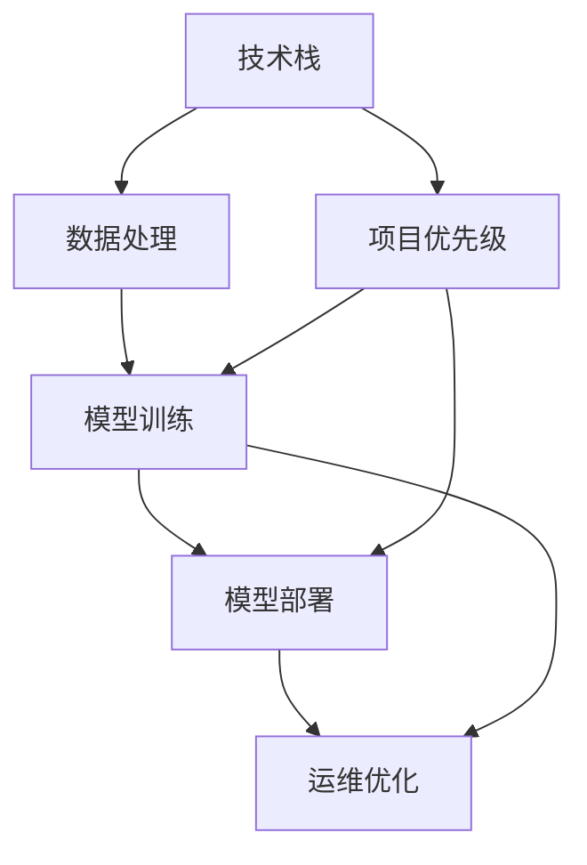

                 

## 1. 背景介绍

### 1.1 问题由来
在当前AI热潮的推动下，越来越多的初创企业开始涉足人工智能领域。然而，构建一个成功的AI公司并不是一件简单的事情。创业公司面临着众多的技术难题、市场挑战、资源限制等。如何在有限的时间和资源下，制定出清晰合理的技术路线图，成为决定公司成败的关键。

### 1.2 问题核心关键点
创业公司的技术路线图应包括：技术栈选择、项目优先级排序、团队建设、数据获取与处理、模型训练与优化、模型部署与运维等关键环节。关键在于：
1. 确保技术栈的稳定性与可扩展性。
2. 合理分配项目优先级，兼顾短期与长期目标。
3. 构建高效的团队协作机制。
4. 获取高质量数据，进行有效处理与清洗。
5. 设计高效的模型训练流程，优化模型性能。
6. 部署模型，确保系统可靠性和可扩展性。
7. 持续监控与优化模型与系统，保障稳定运行。

本文将通过详细介绍以上核心点，帮助创业公司制定出合理有效的技术路线图。

## 2. 核心概念与联系

### 2.1 核心概念概述

为更好地理解如何制定AI创业公司的技术路线图，我们需明确以下几个核心概念：

- **技术栈**：企业所用到的所有技术工具和框架，如编程语言、数据库、云计算平台、数据处理工具等。
- **项目优先级**：根据业务需求、技术难度、市场价值等综合评估的项目排序。
- **数据处理**：包括数据收集、清洗、标注、存储等环节，保证数据质量。
- **模型训练**：选择合适的算法和模型结构，使用大规模数据进行训练，优化模型性能。
- **模型部署**：将训练好的模型集成到实际应用中，进行系统部署。
- **运维优化**：持续监控模型性能，处理故障，优化系统，确保稳定运行。

这些概念之间的逻辑关系可以通过以下Mermaid流程图来展示：



这个流程图展示了大语言模型微调的核心概念及其之间的关系：

1. 技术栈是数据处理、模型训练、模型部署、运维优化的基础。
2. 项目优先级决定了资源分配和任务排期。
3. 数据处理确保了数据质量，是模型训练的前提。
4. 模型训练输出可用于部署，并在运维中持续优化。

## 3. 核心算法原理 & 具体操作步骤

### 3.1 算法原理概述
制定AI创业公司的技术路线图，需要遵循以下基本原理：

- **最小可行产品(MVP)**：快速构建最小化功能的产品原型，进行市场验证。
- **迭代优化**：根据用户反馈，不断迭代产品，优化功能与性能。
- **数据驱动决策**：在数据驱动的基础上，进行技术选型和优先级排序。
- **风险管理**：识别潜在的风险点，制定应急预案。

### 3.2 算法步骤详解

**Step 1: 技术栈选型**
- 确定主要的编程语言（如Python、Java、C++等）。
- 选择合适的数据库（如MySQL、PostgreSQL、MongoDB等）。
- 选择合适的云计算平台（如AWS、GCP、Azure等）。
- 选择数据处理工具（如Apache Spark、Pandas、Scikit-learn等）。
- 选择机器学习框架（如TensorFlow、PyTorch、Scikit-learn等）。
- 选择模型评估工具（如TensorBoard、Weights & Biases等）。

**Step 2: 数据收集与处理**
- 确定数据来源（如公开数据集、内部数据、第三方数据等）。
- 获取数据并进行预处理，包括清洗、标注、归一化等步骤。
- 构建数据管道，实现数据实时采集、存储、处理和更新。

**Step 3: 项目优先级排序**
- 确定短期与长期目标，明确核心业务与非核心业务。
- 根据业务需求、技术难度、市场价值等指标，进行项目优先级排序。
- 设定每个项目的里程碑和时间节点，确保按时交付。

**Step 4: 模型训练与优化**
- 选择合适的模型结构和算法，进行模型设计。
- 使用大规模数据进行模型训练，进行参数调整和优化。
- 评估模型性能，确保满足业务需求。

**Step 5: 模型部署与运维**
- 将训练好的模型集成到实际应用中，进行系统部署。
- 监控模型性能，及时处理故障和异常情况。
- 持续优化模型和系统，确保稳定运行。

### 3.3 算法优缺点

制定AI创业公司的技术路线图，有以下几个优点：

- **明确性**：明确的技术栈选择和项目优先级排序，使得团队有明确的目标和方向。
- **效率提升**：高效的数据处理流程，有助于快速获取高质量数据，加速模型训练。
- **风险控制**：及时识别和处理风险点，确保项目顺利推进。

然而，该方法也存在以下局限：

- **复杂性**：技术栈选型和项目优先级排序可能涉及多方面的考虑，过程较为复杂。
- **资源消耗**：模型训练和系统部署需要大量计算资源和时间，初期成本较高。
- **灵活性**：技术路线图一旦制定，难以快速适应市场变化和技术进展。

尽管有这些局限，制定技术路线图仍是创业公司成功的重要步骤，通过合理规划，可以在竞争激烈的AI市场中找到自己的位置。

### 3.4 算法应用领域

基于以上原理，技术路线图在多个领域都有广泛应用，例如：

- **医疗AI**：使用数据驱动决策，构建医疗影像分析、疾病预测等应用。
- **金融科技**：通过迭代优化，开发智能投顾、风险控制等金融产品。
- **智能制造**：优化模型训练和运维，实现生产流程智能化管理。
- **智能客服**：构建基于自然语言处理的智能客服系统，提升客户体验。
- **智慧零售**：通过数据驱动决策，优化库存管理、用户推荐等业务流程。

## 4. 数学模型和公式 & 详细讲解 & 举例说明

### 4.1 数学模型构建

假设我们正在开发一款智能推荐系统，其核心模型为协同过滤算法。基于协同过滤算法的推荐系统，其数学模型可以表示为：

$$
\hat{r}_{ui} = \theta^T \phi(u) \phi(i)
$$

其中，$r_{ui}$ 为用户 $u$ 对商品 $i$ 的评分预测，$\theta$ 为评分预测模型的参数，$\phi$ 为特征映射函数。

### 4.2 公式推导过程

基于上述数学模型，我们可以进一步推导出推荐算法的基本公式。假设已知用户 $u$ 的评分向量为 $r_u = (r_{ui_1}, r_{ui_2}, ..., r_{ui_m})$，商品 $i$ 的评分向量为 $r_i = (r_{i_1}, r_{i_2}, ..., r_{im})$，那么基于协同过滤算法的推荐公式为：

$$
\hat{r}_{ui} = \sum_{j=1}^m r_{uj} \frac{r_{ij}}{\sqrt{\sum_{k=1}^m r_{ik}^2}} \frac{1}{\sqrt{\sum_{k=1}^m r_{kj}^2}}
$$

即用户对商品的评分预测等于用户对所有商品的评分向量和商品对所有用户的评分向量的内积，除以用户评分向量和商品评分向量的模长之积的平方根。

### 4.3 案例分析与讲解

以电商平台为例，我们可以使用协同过滤算法构建个性化推荐系统。首先，收集用户的浏览记录和购买记录，构建用户和商品的评分矩阵。然后，使用协同过滤算法对评分矩阵进行预测，生成个性化推荐列表。在推荐系统中，还需要考虑如何处理冷启动问题，即新用户和未评分商品的处理。

## 5. 项目实践：代码实例和详细解释说明

### 5.1 开发环境搭建

要构建智能推荐系统，我们需要以下开发环境：

1. **编程语言**：Python。
2. **数据处理工具**：Pandas、Scikit-learn。
3. **机器学习框架**：TensorFlow、Keras。
4. **云计算平台**：AWS或GCP。

确保所有依赖包安装，并搭建好虚拟环境。

### 5.2 源代码详细实现

以下是基于协同过滤算法的推荐系统的代码实现：

```python
import numpy as np
from sklearn.metrics.pairwise import cosine_similarity

# 构建用户和商品的评分矩阵
user_ratings = np.array([[5, 3, 0, 0], [4, 0, 5, 0], [0, 0, 4, 3]])
item_ratings = np.array([[3, 5, 0, 0], [4, 0, 2, 0], [0, 0, 0, 5]])

# 计算用户和商品的评分向量
user_ratings_vector = np.mean(user_ratings, axis=1)
item_ratings_vector = np.mean(item_ratings, axis=0)

# 计算用户和商品的评分矩阵
user_item_matrix = user_ratings - user_ratings_vector[:, np.newaxis]
item_item_matrix = item_ratings - item_ratings_vector

# 计算用户对商品的评分预测
prediction = np.dot(user_ratings_vector, item_ratings_vector) / np.dot(np.sqrt(np.sum(item_ratings_vector**2)), np.sqrt(np.sum(user_ratings_vector**2)))

# 打印推荐结果
print(prediction)
```

### 5.3 代码解读与分析

在上述代码中，我们首先定义了用户和商品的评分矩阵，并计算了用户和商品的评分向量。然后，通过计算用户和商品的评分矩阵，得到了用户对商品的评分预测。

此算法的基本思想是通过用户对商品的评分，计算用户和商品的评分向量，然后计算用户和商品的评分矩阵。最后，通过计算评分矩阵的内积和模长之积的平方根，得到用户对商品的评分预测。

## 6. 实际应用场景

### 6.1 智能客服系统

智能客服系统是一个典型的AI应用场景，通过机器学习和自然语言处理技术，可以实现自动响应客户咨询。在技术实现上，可以使用基于深度学习的序列模型（如RNN、Transformer等）进行客户查询的理解和回复生成。系统通过不断学习客户的查询记录，优化回复模型，提高客户满意度。

### 6.2 金融科技

金融科技是另一个重要的AI应用场景，通过机器学习和数据分析技术，可以实现智能投顾、风险控制等功能。在技术实现上，可以使用基于深度学习的分类模型（如CNN、RNN等）进行数据分析和预测。系统通过不断学习市场数据，优化分类模型，提高投资建议的准确性和风险控制的能力。

### 6.3 医疗AI

医疗AI是近年来发展迅速的AI应用领域，通过机器学习和数据分析技术，可以实现疾病预测、影像分析等功能。在技术实现上，可以使用基于深度学习的分类和回归模型（如CNN、RNN等）进行数据处理和预测。系统通过不断学习医疗数据，优化模型，提高疾病预测和影像分析的准确性。

### 6.4 智能制造

智能制造是智能工厂的关键技术之一，通过机器学习和数据分析技术，可以实现生产流程优化、设备维护等功能。在技术实现上，可以使用基于深度学习的分类和回归模型（如CNN、RNN等）进行数据分析和预测。系统通过不断学习生产数据，优化模型，提高生产流程的效率和设备的维护能力。

## 7. 工具和资源推荐

### 7.1 学习资源推荐

为了帮助创业公司技术团队快速掌握AI技术，推荐以下学习资源：

1. **机器学习与深度学习**：《机器学习实战》、《深度学习》。
2. **自然语言处理**：《自然语言处理综论》、《深度学习与自然语言处理》。
3. **大数据与云计算**：《大数据技术与应用》、《云计算》。
4. **人工智能与智能系统**：《人工智能：一种现代方法》、《AI创业公司实战》。

### 7.2 开发工具推荐

为了提高开发效率和系统性能，推荐以下开发工具：

1. **编程语言**：Python。
2. **数据处理工具**：Pandas、Scikit-learn。
3. **机器学习框架**：TensorFlow、PyTorch、Keras。
4. **云计算平台**：AWS、GCP、Azure。
5. **版本控制**：Git。
6. **持续集成/持续部署**：Jenkins、GitLab CI/CD。

### 7.3 相关论文推荐

为了跟踪AI技术的前沿进展，推荐以下相关论文：

1. **机器学习**：《梯度下降算法》、《深度学习》。
2. **自然语言处理**：《Transformer模型》、《BERT模型》。
3. **大数据与云计算**：《Hadoop技术与应用》、《Spark技术与应用》。
4. **人工智能与智能系统**：《深度学习与智能系统》、《AI创业公司实践》。

## 8. 总结：未来发展趋势与挑战

### 8.1 总结

本文对如何制定AI创业公司的技术路线图进行了全面系统的介绍。首先阐述了技术栈选型、项目优先级排序、数据处理、模型训练与优化、模型部署与运维等关键环节，明确了创业公司成功的技术基础。其次，从原理到实践，详细讲解了技术路线图的制定方法，给出了智能推荐系统的代码实现和案例分析。同时，本文还广泛探讨了智能客服、金融科技、医疗AI、智能制造等多个行业领域的应用前景，展示了AI技术的广泛应用和巨大潜力。

通过本文的系统梳理，可以看到，制定AI创业公司的技术路线图是实现技术创新和业务突破的重要步骤。创业公司需要在有限的资源和时间条件下，合理规划技术路线图，确保项目顺利推进。

### 8.2 未来发展趋势

展望未来，AI创业公司的技术路线图制定将呈现以下几个发展趋势：

1. **技术栈的多样化**：随着AI技术的不断进步，新的技术栈将不断涌现。创业公司需要及时跟进，选择合适的技术工具和框架。
2. **项目优先级的多维化**：创业公司需要综合考虑业务需求、技术难度、市场价值等多个维度，进行项目优先级排序。
3. **数据处理的自动化**：自动化数据处理工具将进一步提升数据质量，加速模型训练。
4. **模型训练的分布式化**：分布式计算和模型并行技术将进一步优化模型训练流程，提高效率。
5. **模型部署的云化**：云平台将提供更强大的计算资源和便捷的管理工具，降低系统部署和运维成本。
6. **运维优化的智能化**：智能运维工具将自动监控和优化系统，提升稳定性。

这些趋势将进一步推动AI技术的发展，帮助创业公司实现技术创新和业务突破。

### 8.3 面临的挑战

尽管技术路线图的制定为创业公司提供了明确的技术方向，但仍面临以下挑战：

1. **技术栈的选择**：选择合适的技术栈需要综合考虑业务需求、团队能力、技术成熟度等多个因素。
2. **项目优先级的排序**：合理分配项目优先级需要考虑短期和长期目标的平衡。
3. **数据处理的效率**：高效的数据处理是技术路线图实现的关键。
4. **模型训练的资源**：大规模模型训练需要大量的计算资源和时间。
5. **模型部署和运维**：系统部署和运维需要精细化的管理和监控。

这些挑战需要在制定技术路线图时进行充分考虑，通过合理的规划和优化，确保技术路线图的顺利推进。

### 8.4 研究展望

未来的研究需要在以下几个方面寻求新的突破：

1. **技术栈的自动化**：开发自动化技术栈选型工具，帮助创业公司快速构建技术栈。
2. **项目优先级的自适应**：开发智能项目优先级排序算法，动态调整项目优先级。
3. **数据处理的自动化和智能化**：开发自动化数据处理和清洗工具，提升数据处理效率。
4. **模型训练的分布式化**：优化模型训练算法，支持分布式计算。
5. **模型部署的云化**：研究云平台与技术栈的深度整合，提升系统部署和运维效率。
6. **运维优化的智能化**：开发智能运维工具，自动监控和优化系统。

通过这些研究，将进一步提升AI创业公司的技术水平，推动技术路线图的实现。

## 9. 附录：常见问题与解答

**Q1: 如何选择技术栈？**

A: 选择技术栈需要综合考虑业务需求、团队能力、技术成熟度等多个因素。一般来说，可以选择主流的编程语言、数据处理工具、机器学习框架、云计算平台等。

**Q2: 如何确定项目优先级？**

A: 确定项目优先级需要考虑业务需求、技术难度、市场价值等多个维度。一般来说，可以将项目分为核心业务、非核心业务、短期目标和长期目标等类别，然后根据实际需求进行排序。

**Q3: 如何处理冷启动问题？**

A: 处理冷启动问题需要考虑新用户和未评分商品的处理。一般来说，可以使用协同过滤算法中的矩阵分解、嵌入式方法等进行处理，也可以引入用户画像、商品推荐等手段提升推荐效果。

**Q4: 如何保证数据质量？**

A: 保证数据质量需要从数据收集、清洗、标注等多个环节进行考虑。一般来说，可以使用自动化数据处理工具、数据清洗规则、数据标注工具等进行保证。

**Q5: 如何优化模型训练？**

A: 优化模型训练需要考虑数据量、模型结构、算法选择等多个因素。一般来说，可以使用数据增强、正则化、学习率调度等手段进行优化。

通过回答这些问题，可以帮助创业公司更好地理解和实现技术路线图的制定，推动AI技术的落地应用。

---

作者：禅与计算机程序设计艺术 / Zen and the Art of Computer Programming

