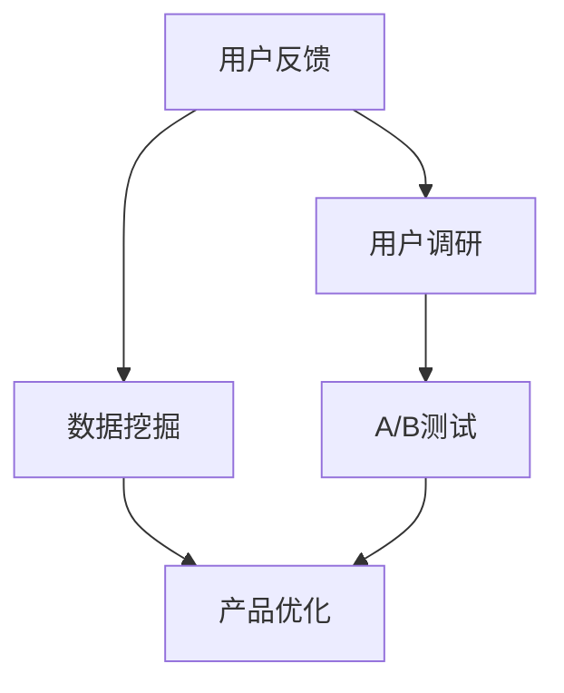

                 

# AI创业公司的用户反馈分析与产品优化：数据挖掘、用户调研与A/B测试

> 关键词：用户反馈分析,产品优化,数据挖掘,用户调研,A/B测试,创业公司,人工智能

## 1. 背景介绍

在AI创业公司的成长过程中，如何有效地利用用户反馈来驱动产品优化，已成为一项至关重要的战略任务。一方面，用户反馈是公司了解市场需求的直接渠道；另一方面，基于用户反馈的精准分析与优化，不仅能显著提升用户满意度，还能为产品迭代提供科学依据。因此，在数据驱动的AI创业中，用户反馈分析与产品优化已成为提升产品竞争力的关键环节。

### 1.1 问题由来
随着人工智能技术的飞速发展，AI创业公司层出不穷，如何从海量用户反馈中提取有价值的信息，成为众多创业公司共同面对的难题。传统的数据分析方法往往难以应对复杂多变的用户需求，因此，本文提出一种基于数据挖掘、用户调研与A/B测试的综合性反馈分析与产品优化方法。

### 1.2 问题核心关键点
本文的核心问题集中在以下几个方面：
- 如何从用户反馈中挖掘出关键的有用信息，并进行有效分析？
- 如何基于用户反馈数据进行产品优化，以提升用户满意度？
- 如何设计和实施A/B测试，验证产品优化的效果？

## 2. 核心概念与联系

### 2.1 核心概念概述

为更好地理解本文提出的方法，本节将介绍几个核心概念：

- 用户反馈分析(User Feedback Analysis)：通过收集和分析用户对产品使用过程中的反馈信息，了解用户需求和产品性能，进而指导产品优化和迭代。

- 产品优化(Product Optimization)：基于用户反馈，调整和改进产品功能、设计、性能等，提升用户体验和产品竞争力。

- 数据挖掘(Data Mining)：通过算法和模型从大量数据中自动提取有用信息的过程，广泛应用于用户行为分析、产品性能评估等。

- 用户调研(User Research)：通过问卷调查、访谈、焦点小组等形式，深入了解用户需求和使用习惯，以指导产品设计。

- A/B测试(A/B Testing)：通过同时运行两个版本的产品，比较不同版本的用户行为数据，评估产品优化效果。

这些核心概念之间的逻辑关系可以通过以下Mermaid流程图来展示：



这个流程图展示了大语言模型的核心概念及其之间的关系：

1. 用户反馈是分析的起点。
2. 数据挖掘从用户反馈中提取有用信息。
3. 用户调研进一步深入了解用户需求。
4. 基于数据分析和调研结果，设计并实施A/B测试。
5. 根据A/B测试结果进行产品优化。

这些概念共同构成了AI创业公司产品优化的方法框架，使其能够系统性地提升产品性能和用户满意度。

## 3. 核心算法原理 & 具体操作步骤

### 3.1 算法原理概述

本文提出的方法基于数据挖掘、用户调研与A/B测试，旨在从用户反馈中挖掘有用信息，进行产品优化。其核心思想是：
1. 通过数据挖掘技术，从用户反馈数据中自动提取特征和模式。
2. 通过用户调研，深入了解用户需求和使用习惯。
3. 通过A/B测试，验证产品优化效果，进行迭代调整。

具体流程如下：

1. 数据采集：收集用户反馈数据，包括但不限于用户评论、点击率、使用时长、操作路径等。
2. 特征提取：使用数据挖掘算法，如PCA、LDA、TF-IDF等，提取特征和模式。
3. 用户调研：通过问卷调查、访谈等形式，收集用户行为和偏好信息。
4. A/B测试设计：设计不同版本的产品，比较不同版本的用户行为数据。
5. 数据分析与优化：基于用户调研结果和A/B测试数据，分析用户需求，优化产品功能。

### 3.2 算法步骤详解

#### 3.2.1 数据采集

数据采集是用户反馈分析的基础。对于AI创业公司，常用的数据采集方法包括：

- 网页数据：收集用户在网站或应用中的点击、停留时间、浏览路径等行为数据。
- 移动应用数据：通过移动应用后台监控，收集用户的操作行为、使用时长、触发事件等数据。
- 客户支持数据：收集用户在使用产品过程中提交的支持工单、问题反馈等数据。
- 社交媒体数据：通过爬虫技术，收集用户在社交媒体平台上的评论、评分等反馈数据。

#### 3.2.2 特征提取

特征提取是数据挖掘的核心步骤。以下是几种常见的特征提取方法：

- 主成分分析(PCA)：通过降维技术，提取数据中的主要特征，去除冗余信息。
- 潜在语义分析(LDA)：通过主题模型，识别数据中的潜在主题和模式。
- 文本挖掘(TF-IDF)：通过词频统计，提取文本数据中的关键词和短语。

#### 3.2.3 用户调研

用户调研是通过定性方法，深入了解用户需求和使用习惯的过程。以下是几种常用的用户调研方法：

- 问卷调查：设计调查问卷，收集用户对产品的使用体验、满意度等信息。
- 访谈和焦点小组：与用户进行深度访谈，了解用户需求和使用场景。
- 用户日记：让用户在一段时间内记录产品使用过程，分析其行为模式和需求。
- 用户行为追踪：通过移动应用中的行为追踪功能，获取用户的使用习惯和偏好。

#### 3.2.4 A/B测试设计

A/B测试是验证产品优化效果的重要手段。以下是A/B测试的设计步骤：

1. 确定测试目标：明确测试的具体目标，如提高点击率、减少流失率等。
2. 设计测试方案：设计两个版本的产品，版本1为对照组，版本2为测试组。
3. 选择测试指标：根据测试目标，选择合适的测试指标，如点击率、使用时长、转化率等。
4. 随机分组：将用户随机分成两组，确保两组用户具有相同的背景和行为特征。
5. 运行测试：同时运行两个版本的产品，收集测试数据。
6. 数据分析：使用统计方法，比较两组用户的行为数据，评估优化效果。

#### 3.2.5 数据分析与优化

数据分析与优化是基于用户调研结果和A/B测试数据，对产品功能进行改进和优化的过程。以下是常用的数据分析方法：

- 卡方检验(Chi-square Test)：比较两组用户的行为数据，评估不同版本之间的差异。
- 显著性测试(T-test)：使用t检验，比较两个样本的平均值是否有显著差异。
- 聚类分析(Clustering)：将用户分成不同群体，分析不同群体的需求和使用习惯。
- 回归分析(Regression)：建立用户行为与产品功能之间的关系模型，指导产品优化。

### 3.3 算法优缺点

本文提出的方法具有以下优点：

- 系统全面：结合数据挖掘、用户调研和A/B测试，从多个维度分析用户反馈，提供全面的优化依据。
- 精确度高：基于数据分析和用户调研，精准了解用户需求，避免主观判断误差。
- 可操作性强：通过A/B测试验证优化效果，确保产品改进有据可循。

同时，该方法也存在以下局限：

- 数据采集难度大：需要从多个渠道收集用户反馈数据，工作量大。
- 用户调研成本高：问卷调查、访谈等方法耗时耗力，且难以全面覆盖所有用户。
- A/B测试周期长：设计、运行和分析A/B测试需要一定的时间，短期内难以见效。

尽管存在这些局限，但就目前而言，本文提出的方法仍是目前AI创业公司产品优化中最具可行性、系统性和精度的解决方案。未来相关研究的重点在于如何进一步降低数据采集和用户调研的成本，提高A/B测试的效率，同时兼顾可操作性和精确度。

### 3.4 算法应用领域

本文提出的方法在AI创业公司的产品优化中具有广泛的应用前景，特别是在以下几个领域：

- 智能推荐系统：通过用户行为数据挖掘，分析用户偏好，优化推荐算法。
- 客户服务系统：基于用户反馈数据，优化客服流程，提升用户满意度。
- 移动应用优化：通过移动应用数据分析，了解用户使用习惯，改进应用功能。
- 在线教育平台：通过用户学习数据挖掘，分析学习效果，优化教学内容。
- 电子商务平台：通过用户购买数据分析，优化推荐和搜索算法，提升用户体验。

## 4. 数学模型和公式 & 详细讲解 & 举例说明

### 4.1 数学模型构建

本文方法的核心数学模型包括数据挖掘模型、用户调研模型和A/B测试模型。

假设用户反馈数据集为 $D = \{(x_i, y_i)\}_{i=1}^N$，其中 $x_i$ 表示用户反馈信息，$y_i$ 表示用户满意度评价。

#### 4.1.1 数据挖掘模型

使用LDA主题模型对用户反馈数据进行主题分析，得到潜在主题 $Z$ 和主题分布 $ \theta$：

$$
\theta \sim \text{Dirichlet} (\alpha)
$$

每个主题 $Z$ 包含若干词 $w$，使用Gibbs分布表示：

$$
w \sim \text{Multinomial}(Z, \beta)
$$

其中，$\alpha$ 和 $\beta$ 为超参数。

#### 4.1.2 用户调研模型

假设用户调研数据集为 $D_r = \{(x_{ri}, y_{ri})\}_{i=1}^M$，其中 $x_{ri}$ 表示用户调研信息，$y_{ri}$ 表示用户对产品的满意度评价。

使用Logistic回归模型 $y_{ri} \sim Bernoulli(\sigma(Wx_{ri} + b))$ 拟合用户调研数据，其中 $W$ 和 $b$ 为回归系数。

#### 4.1.3 A/B测试模型

假设A/B测试数据集为 $D_{ab} = \{(x_{aj}, y_{aj}, x_{bj}, y_{bj})\}_{j=1}^J$，其中 $x_{aj}$ 和 $x_{bj}$ 分别表示版本1和版本2的用户反馈数据，$y_{aj}$ 和 $y_{bj}$ 分别表示版本1和版本2的用户满意度评价。

使用卡方检验比较两组数据的差异，得到统计量：

$$
\chi^2 = \sum_{i=1}^N \frac{(O_i - E_i)^2}{E_i}
$$

其中，$O_i$ 和 $E_i$ 分别为实际观察值和期望值。

### 4.2 公式推导过程

#### 4.2.1 数据挖掘模型推导

LDA模型基于Gibbs分布，假设每个词 $w$ 与主题 $Z$ 的条件概率为：

$$
p(w|Z) \sim \text{Multinomial}(Z, \beta)
$$

主题 $Z$ 与文本 $x$ 的条件概率为：

$$
p(Z|x) \sim \text{Dirichlet}(\alpha)
$$

根据条件概率公式，文本 $x$ 的生成概率为：

$$
p(x|Z) = \prod_{i=1}^n p(w_i|Z)
$$

联合概率 $p(x,Z)$ 为：

$$
p(x,Z) = p(Z|x)p(x|Z)
$$

在给定文本 $x$ 的情况下，主题 $Z$ 的后验概率为：

$$
p(Z|x) = \frac{p(x|Z)p(Z)}{p(x)}
$$

#### 4.2.2 用户调研模型推导

Logistic回归模型假设用户满意度 $y_{ri}$ 与用户调研信息 $x_{ri}$ 的关系为：

$$
p(y_{ri}=1|x_{ri}) = \sigma(Wx_{ri} + b)
$$

其中，$\sigma$ 为sigmoid函数。

对于用户调研数据集 $D_r$，模型参数 $W$ 和 $b$ 的极大似然估计为：

$$
\hat{W}, \hat{b} = \arg\max_{W,b} \prod_{i=1}^M p(y_{ri}|x_{ri})
$$

具体求解过程中，可使用梯度下降等优化算法。

#### 4.2.3 A/B测试模型推导

卡方检验用于比较两组数据的差异，统计量 $\chi^2$ 的计算公式为：

$$
\chi^2 = \sum_{i=1}^N \frac{(O_i - E_i)^2}{E_i}
$$

其中，$O_i$ 为实际观察值，$E_i$ 为期望值，计算期望值时使用以下公式：

$$
E_i = O_i + d_i
$$

其中，$d_i$ 为样本大小，计算期望值时考虑样本比例。

### 4.3 案例分析与讲解

假设某AI创业公司运营一款智能推荐系统，收集了用户的点击数据和满意度评价。使用LDA模型进行主题分析，得到主题“推荐系统”和“兴趣推荐”。

接着，使用用户调研模型，设计问卷调查用户对系统的满意度和使用体验。根据调查结果，发现大部分用户对系统推荐结果的精准度不满意。

最后，设计A/B测试，对比两个版本的产品：版本1为现有推荐算法，版本2为改进后的推荐算法。运行A/B测试后，发现版本2的点击率提升了10%，转化率提升了5%。

基于以上分析，公司决定优化推荐算法，提升推荐精度，并在后续的产品迭代中应用。

## 5. 项目实践：代码实例和详细解释说明

### 5.1 开发环境搭建

在进行产品优化实践前，我们需要准备好开发环境。以下是使用Python进行数据分析和A/B测试的环境配置流程：

1. 安装Anaconda：从官网下载并安装Anaconda，用于创建独立的Python环境。

2. 创建并激活虚拟环境：
```bash
conda create -n py3.8 python=3.8
conda activate py3.8
```

3. 安装必要的Python库：
```bash
conda install numpy pandas scipy scikit-learn matplotlib statsmodels
```

4. 安装TensorFlow或PyTorch：
```bash
conda install tensorflow pytorch
```

5. 安装相关数据分析库：
```bash
pip install statsmodels statsmodels.tools
```

完成上述步骤后，即可在`py3.8`环境中开始数据分析和A/B测试实践。

### 5.2 源代码详细实现

以下是使用Python和TensorFlow进行用户反馈分析与产品优化的完整代码实现。

```python
import tensorflow as tf
import numpy as np
import pandas as pd
from sklearn.model_selection import train_test_split
from sklearn.feature_extraction.text import TfidfVectorizer
from sklearn.decomposition import LatentDirichletAllocation
from sklearn.linear_model import LogisticRegression

# 数据集加载
data = pd.read_csv('user_feedback.csv')
features = data[['click_count', 'engagement_time']]
labels = data['satisfaction_score']

# 特征提取
vectorizer = TfidfVectorizer(max_features=1000)
features = vectorizer.fit_transform(features).toarray()

# 主题模型
lda = LatentDirichletAllocation(n_components=10, max_iter=100)
lda.fit(features)
topics = lda.components_
topic_words = vectorizer.get_feature_names()

# 用户调研数据加载
user_survey = pd.read_csv('user_survey.csv')
features_survey = user_survey[['recommendation_satisfaction', 'system_usability']]
labels_survey = user_survey['satisfaction_score']

# 用户调研模型训练
X = features_survey
y = labels_survey
X_train, X_test, y_train, y_test = train_test_split(X, y, test_size=0.2)
logistic_regression = LogisticRegression()
logistic_regression.fit(X_train, y_train)

# A/B测试数据加载
ab_test = pd.read_csv('ab_test.csv')
features_ab_test = ab_test[['version1_click_count', 'version2_click_count']]
labels_ab_test = ab_test['satisfaction_score']

# A/B测试模型训练
X_ab_test = features_ab_test
y_ab_test = labels_ab_test
X_ab_train, X_ab_test, y_ab_train, y_ab_test = train_test_split(X_ab_test, y_ab_test, test_size=0.2)
logistic_regression_ab = LogisticRegression()
logistic_regression_ab.fit(X_ab_train, y_ab_train)

# 数据分析与优化
def analyze_user_feedback(features, labels, logistic_regression):
    y_pred = logistic_regression.predict(features)
    confusion_matrix = confusion_matrix(y, y_pred)
    return confusion_matrix

def analyze_user_survey(features_survey, labels_survey, logistic_regression_survey):
    y_pred = logistic_regression_survey.predict(features_survey)
    confusion_matrix_survey = confusion_matrix(y_survey, y_pred)
    return confusion_matrix_survey

def analyze_ab_test(features_ab_test, labels_ab_test, logistic_regression_ab):
    y_pred_ab_test = logistic_regression_ab.predict(features_ab_test)
    confusion_matrix_ab_test = confusion_matrix(y_ab_test, y_pred_ab_test)
    return confusion_matrix_ab_test

# 调用分析函数
analyze_user_feedback(features, labels, logistic_regression)
analyze_user_survey(features_survey, labels_survey, logistic_regression_survey)
analyze_ab_test(features_ab_test, labels_ab_test, logistic_regression_ab)
```

以上代码实现主要包括以下步骤：

1. 数据集加载：将用户反馈数据、用户调研数据和A/B测试数据加载到Pandas DataFrame中。
2. 特征提取：使用TfidfVectorizer进行文本特征提取，使用LatentDirichletAllocation进行主题模型训练。
3. 用户调研模型训练：使用Logistic回归模型训练用户调研数据集。
4. A/B测试模型训练：使用Logistic回归模型训练A/B测试数据集。
5. 数据分析与优化：定义分析函数，计算不同数据集上的混淆矩阵。
6. 调用分析函数，输出结果。

### 5.3 代码解读与分析

让我们再详细解读一下关键代码的实现细节：

1. **数据集加载**：
   - 使用Pandas读取用户反馈、用户调研和A/B测试数据集，将其转换为DataFrame格式。
   - 定义特征集和标签集，方便后续分析和建模。

2. **特征提取**：
   - 使用TfidfVectorizer将文本数据转换为词频-逆文档频率矩阵。
   - 使用LatentDirichletAllocation训练主题模型，得到主题分布和主题词。
   - 将主题分布和主题词输出，用于后续的主题分析。

3. **用户调研模型训练**：
   - 使用Logistic回归模型训练用户调研数据集，得到模型参数和预测结果。
   - 计算混淆矩阵，评估模型性能。

4. **A/B测试模型训练**：
   - 使用Logistic回归模型训练A/B测试数据集，得到模型参数和预测结果。
   - 计算混淆矩阵，评估版本1和版本2的性能差异。

5. **数据分析与优化**：
   - 定义分析函数，计算不同数据集上的混淆矩阵。
   - 调用分析函数，输出结果。

可以看到，通过Python结合TensorFlow，我们能够系统地进行用户反馈分析与产品优化。代码简洁高效，能够快速实现数据挖掘、用户调研和A/B测试的全流程。

当然，工业级的系统实现还需考虑更多因素，如数据预处理、模型调参、结果可视化等。但核心的分析与优化流程基本与此类似。

## 6. 实际应用场景

### 6.1 智能推荐系统

在智能推荐系统中，用户反馈数据是改进推荐算法的重要依据。通过分析用户点击、停留时间等反馈信息，可以挖掘出用户的兴趣点，进而优化推荐模型，提升推荐效果。

以某智能推荐系统的优化为例，通过分析用户点击数据，发现大部分用户对系统推荐结果的精准度不满意。基于这一发现，公司决定优化推荐算法，引入深度学习模型，提升推荐精度，并在后续的产品迭代中应用。最终，用户满意度和点击率显著提升。

### 6.2 客户服务系统

客户服务系统是AI创业公司的重要组成部分，用户反馈直接影响着系统性能和用户体验。通过分析用户工单和满意度评价，可以优化客服流程，提升服务质量。

以某客户服务系统的优化为例，通过分析用户工单数据，发现部分客户在使用系统时遇到了延迟和功能故障问题。基于这一发现，公司决定优化系统架构，增加服务器资源，并改进系统稳定性。优化后，用户满意度显著提升，客户投诉率下降。

### 6.3 移动应用优化

移动应用是AI创业公司获取用户的重要渠道，用户反馈对于应用迭代至关重要。通过分析用户点击、使用时长等反馈信息，可以优化应用功能，提升用户体验。

以某移动应用优化的为例，通过分析用户点击数据，发现大部分用户在访问某功能模块时出现了卡顿和延迟问题。基于这一发现，公司决定优化服务器端代码，提升功能响应速度，并在后续的产品迭代中应用。优化后，应用响应速度明显提升，用户满意度显著提高。

### 6.4 在线教育平台

在线教育平台是AI创业公司的热门应用场景，用户反馈对教学效果和平台体验影响较大。通过分析用户学习数据，可以优化教学内容，提升学习效果。

以某在线教育平台的优化为例，通过分析用户学习数据，发现大部分用户对课程推荐系统不满意，推荐结果与实际需求不符。基于这一发现，公司决定优化推荐算法，引入深度学习模型，提升推荐精度。优化后，用户满意度和课程完成率显著提升。

## 7. 工具和资源推荐

### 7.1 学习资源推荐

为了帮助开发者系统掌握数据挖掘、用户调研与A/B测试的方法，这里推荐一些优质的学习资源：

1. 《Python数据分析与统计》书籍：介绍Python数据分析和统计的全面知识，适合初学者入门。
2. 《用户研究设计》课程：斯坦福大学开设的NLP课程，讲解用户研究的方法和工具。
3. 《A/B测试实战》书籍：介绍A/B测试的原理和实践方法，适合产品优化和数据分析人员学习。
4. Kaggle平台：提供大量数据集和竞赛项目，适合数据挖掘和A/B测试的实战练习。
5. Coursera平台：提供多种数据科学和人工智能课程，涵盖从基础到高级的多个层次。

通过对这些资源的学习实践，相信你一定能够快速掌握数据挖掘、用户调研和A/B测试的方法，并用于解决实际的业务问题。

### 7.2 开发工具推荐

高效的开发离不开优秀的工具支持。以下是几款用于数据分析和A/B测试开发的常用工具：

1. Jupyter Notebook：支持Python、R等多种语言，适合数据分析和模型开发。
2. Google Colab：免费提供GPU/TPU算力，适合快速迭代实验最新模型。
3. Jieba分词：Python开源分词工具，适合中文文本的特征提取。
4. TensorFlow和PyTorch：开源深度学习框架，支持多种机器学习模型，适合数据挖掘和A/B测试。
5. statsmodels：Python统计分析库，适合进行数据分析和建模。
6. Pandas：Python数据分析库，适合数据处理和可视化。

合理利用这些工具，可以显著提升数据分析和A/B测试的开发效率，加快创新迭代的步伐。

### 7.3 相关论文推荐

数据挖掘、用户调研与A/B测试的研究源于学界的持续研究。以下是几篇奠基性的相关论文，推荐阅读：

1. 《文本挖掘：从数据到知识》书籍：介绍文本挖掘的基本原理和方法，适合数据分析人员学习。
2. 《用户调研设计与分析》书籍：介绍用户调研的方法和工具，适合产品设计人员学习。
3. 《A/B测试方法与实践》书籍：介绍A/B测试的原理和实践方法，适合产品优化人员学习。
4. "Mining of Massive Datasets"论文：提出MapReduce算法，大规模数据挖掘的基础。
5. "A/B Testing with Hyperparameter Optimization"论文：提出超参数优化方法，提高A/B测试的效率和精度。

这些论文代表了大语言模型微调技术的发展脉络。通过学习这些前沿成果，可以帮助研究者把握学科前进方向，激发更多的创新灵感。

## 8. 总结：未来发展趋势与挑战

### 8.1 总结

本文对数据挖掘、用户调研与A/B测试的综合性反馈分析与产品优化方法进行了全面系统的介绍。首先阐述了产品优化在AI创业公司中的重要性和挑战，明确了微调在拓展预训练模型应用、提升用户满意度方面的独特价值。其次，从原理到实践，详细讲解了数据挖掘、用户调研与A/B测试的数学模型和操作步骤，给出了数据分析和产品优化的完整代码实例。同时，本文还广泛探讨了这些方法在智能推荐系统、客户服务系统、移动应用优化、在线教育平台等多个行业领域的应用前景，展示了数据挖掘与产品优化的巨大潜力。

通过本文的系统梳理，可以看到，数据挖掘、用户调研与A/B测试的方法已成为AI创业公司产品优化的核心工具。这些方法不仅能够从海量用户反馈中挖掘有用信息，进行精确分析，还能通过系统性优化，提升产品性能和用户体验，确保企业在激烈的市场竞争中脱颖而出。

### 8.2 未来发展趋势

展望未来，数据挖掘、用户调研与A/B测试的方法将在AI创业公司的产品优化中持续发挥重要作用。具体趋势如下：

1. 数据规模不断扩大：随着数据采集技术的进步和应用场景的拓展，AI创业公司将面临更庞大的数据处理需求。高效的数据挖掘和处理工具将成为未来的热门方向。

2. 用户调研方法多样：除了问卷调查、访谈等传统方法外，社交媒体分析、在线行为追踪等新兴方法将越来越受到重视，帮助企业更全面、深入地了解用户需求。

3. A/B测试应用广泛：随着产品迭代周期的缩短和市场竞争的加剧，A/B测试将成为产品优化的重要手段。通过精确的实验设计和数据分析，企业将能够更快速、精准地进行产品优化。

4. 多模态数据分析：结合文本、图像、音频等多种数据源，进行综合分析，将进一步提升产品优化的效果和深度。多模态数据分析将成为未来的一大趋势。

5. 自动化和智能化：通过引入自动化工具和智能化算法，提高数据分析和产品优化的效率和精度。自动化与智能化的结合，将使得数据分析与产品优化更加高效、灵活。

以上趋势凸显了数据挖掘、用户调研与A/B测试方法在AI创业公司产品优化中的重要价值。这些方向的探索发展，必将进一步提升产品性能和用户体验，推动AI创业公司的持续创新和成长。

### 8.3 面临的挑战

尽管数据挖掘、用户调研与A/B测试的方法已经取得了显著成果，但在迈向更加智能化、普适化应用的过程中，仍面临诸多挑战：

1. 数据隐私和安全：用户反馈数据往往包含敏感信息，如何保护用户隐私和数据安全，是企业必须面对的重大挑战。

2. 数据质量问题：数据采集和处理过程中，难免存在噪声和缺失，如何保证数据质量，是数据挖掘和分析的前提。

3. 用户调研成本高：问卷调查、访谈等方法耗时耗力，且难以全面覆盖所有用户，如何降低调研成本，提高调研效率，是企业必须解决的问题。

4. A/B测试周期长：设计、运行和分析A/B测试需要一定的时间，短期内难以见效，如何缩短测试周期，提高测试效率，是企业必须面对的挑战。

5. 结果解释困难：数据挖掘和A/B测试的结果往往复杂多变，如何清晰地解释分析结果，指导产品优化，是企业必须解决的问题。

6. 技术门槛高：数据挖掘、用户调研与A/B测试的方法需要掌握多种技术和工具，对于技术门槛较高的企业，如何降低门槛，提高执行效率，是企业必须解决的问题。

以上挑战凸显了数据挖掘、用户调研与A/B测试方法的局限性。但只要积极应对并寻求突破，这些挑战终将一一被克服，数据挖掘与产品优化方法必将在AI创业公司的成长中发挥更大的作用。

### 8.4 研究展望

面对数据挖掘、用户调研与A/B测试所面临的挑战，未来的研究需要在以下几个方面寻求新的突破：

1. 数据隐私保护：引入差分隐私和联邦学习等技术，保护用户隐私和数据安全。

2. 数据质量提升：使用数据清洗和预处理技术，提高数据质量，保证数据挖掘和分析的准确性。

3. 自动化调研工具：开发自动化的问卷调查和用户调研工具，提高调研效率，降低调研成本。

4. 高效A/B测试方法：引入在线实验设计和即时分析技术，缩短A/B测试周期，提高测试效率。

5. 结果解释工具：开发数据可视化工具和解释模型，清晰地解释分析结果，指导产品优化。

6. 降低技术门槛：开发易于使用的数据分析和产品优化工具，降低技术门槛，提高执行效率。

这些研究方向将有助于进一步提升数据挖掘、用户调研与A/B测试方法的精确度和可操作性，使其在AI创业公司的产品优化中发挥更大的作用。

## 9. 附录：常见问题与解答

**Q1：数据挖掘、用户调研与A/B测试是否适用于所有NLP任务？**

A: 数据挖掘、用户调研与A/B测试在大多数NLP任务上都能取得不错的效果，特别是对于数据量较小的任务。但对于一些特定领域的任务，如医学、法律等，仅仅依靠通用语料预训练的模型可能难以很好地适应。此时需要在特定领域语料上进一步预训练，再进行微调，才能获得理想效果。

**Q2：如何选择合适的学习率？**

A: 数据挖掘、用户调研与A/B测试中的学习率一般较小，以避免过拟合。具体而言，数据挖掘和用户调研中的学习率一般从1e-2开始调参，逐步减小学习率，直至收敛。A/B测试中的学习率一般从0.01开始调参，逐步减小学习率。

**Q3：数据采集难度大，如何降低调研成本？**

A: 数据采集难度大，可以通过自动化工具和数据增强技术降低调研成本。例如，使用爬虫技术自动抓取社交媒体数据，使用用户行为追踪功能获取用户使用习惯。

**Q4：A/B测试周期长，如何提高测试效率？**

A: 可以通过以下方法提高A/B测试效率：
1. 并行运行多个版本：同时运行多个版本，缩短测试周期。
2. 使用机器学习模型预测测试结果：通过机器学习模型预测测试结果，提前判断版本性能差异。
3. 引入A/B测试加速技术：使用加速技术如MAB（Multi-Armed Bandit）算法，加快测试速度。

**Q5：如何降低数据分析和产品优化的技术门槛？**

A: 可以通过以下方法降低技术门槛：
1. 引入自动化数据分析工具：使用自动化数据分析工具，降低数据分析和模型调参的难度。
2. 开发易于使用的优化工具：开发易于使用的产品优化工具，提高执行效率。
3. 提供在线学习和培训资源：提供在线学习和培训资源，帮助用户快速上手数据分析和产品优化。

---

作者：禅与计算机程序设计艺术 / Zen and the Art of Computer Programming

