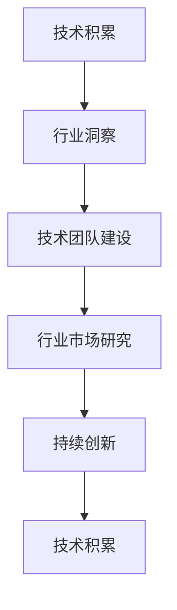

                 

# AI创业团队成长之路：技术积累与行业洞察并重

## 1. 背景介绍

在当下这个数据驱动的时代，人工智能（AI）技术正以前所未有的速度改变各行各业的业务模式和运营效率。从自动驾驶、智能制造到金融风控、医疗诊断，AI正在大展宏图，重塑未来的商业格局。而对于AI创业团队来说，如何在激烈的市场竞争中脱颖而出，如何在瞬息万变的技术环境中持续创新，如何构建能够适应未来变化的团队文化，成为每个创始人和管理者的头等大事。本文将围绕AI创业团队的技术积累与行业洞察并重这一主题，深入探讨AI创业团队成长的必经之路。

### 1.1 问题由来

AI创业浪潮的兴起，不仅带来了投资热潮，也带来了前所未有的技术挑战和商业机遇。然而，在享受AI技术红利的同时，创业团队也面临着诸多挑战。首先是技术积累的不足，对于初创团队来说，构建强大的技术团队、积累丰富的技术积累往往需要时间。其次，行业洞察的缺乏，使得团队在快速变化的市场环境中难以把握正确的方向。因此，本文将探讨如何通过技术积累与行业洞察并重的策略，构建持续成长的AI创业团队。

### 1.2 问题核心关键点

AI创业团队成长的核心在于技术积累与行业洞察的有机结合。技术积累是指通过持续的技术学习和实践，建立起强大的技术能力；行业洞察则是指通过市场研究和经验积累，对行业趋势和客户需求有深刻的理解。两者相辅相成，共同构成团队成长的基础。本文将详细探讨技术积累与行业洞察的具体实现路径，帮助读者构建更加强大的AI创业团队。

## 2. 核心概念与联系

### 2.1 核心概念概述

为了更好地理解AI创业团队的技术积累与行业洞察并重的策略，本文将介绍几个核心概念：

- **技术积累**：指通过持续的技术学习和实践，构建起强大的技术团队和积累丰富的技术知识。技术积累是AI创业团队竞争力的核心来源，是团队成长的基础。
- **行业洞察**：指通过市场研究和经验积累，对行业趋势和客户需求有深刻的理解。行业洞察帮助团队把握正确的商业方向，实现业务的持续增长。
- **技术团队建设**：指构建一个具有高技术能力和协同创新能力的团队，包括招聘合适的技术人才、设计合理的团队结构和激励机制等。
- **行业市场研究**：指通过收集和分析行业数据，了解市场趋势、客户需求和竞争格局，为团队提供方向指引。
- **持续创新**：指在技术积累和行业洞察的基础上，不断进行技术研发和业务创新，保持团队的竞争力和市场敏锐度。

这些核心概念之间的逻辑关系可以通过以下Mermaid流程图来展示：



这个流程图展示了大语言模型的核心概念及其之间的关系：

1. 技术积累通过提升团队的技术能力，为行业洞察提供技术支持。
2. 行业洞察通过把握市场趋势和客户需求，为技术积累提供方向指引。
3. 技术团队建设和行业市场研究是技术积累和行业洞察的实现路径。
4. 持续创新是技术积累和行业洞察的最终目标，推动团队不断进步。

## 3. 核心算法原理 & 具体操作步骤

### 3.1 算法原理概述

AI创业团队的技术积累与行业洞察并重，实际上是一个双向循环的过程。技术积累为行业洞察提供基础，行业洞察为技术积累指明方向。这一过程可以通过以下几个关键步骤来实现：

1. **技术积累**：通过持续的技术学习和实践，构建起强大的技术团队和积累丰富的技术知识。
2. **行业洞察**：通过市场研究和经验积累，对行业趋势和客户需求有深刻的理解。
3. **技术团队建设**：构建一个具有高技术能力和协同创新能力的团队，包括招聘合适的技术人才、设计合理的团队结构和激励机制等。
4. **行业市场研究**：通过收集和分析行业数据，了解市场趋势、客户需求和竞争格局，为团队提供方向指引。
5. **持续创新**：在技术积累和行业洞察的基础上，不断进行技术研发和业务创新，保持团队的竞争力和市场敏锐度。

### 3.2 算法步骤详解

以下将详细介绍技术积累与行业洞察并重的具体操作步骤：

**Step 1: 技术积累**

- **技术学习**：定期组织技术学习活动，如技术分享会、读书会、在线课程等，提升团队的技术水平。
- **技术实践**：通过实际项目和实验，积累丰富的技术经验，解决实际问题，提高团队的技术能力。
- **技术合作**：与高校、科研机构和行业内的技术公司建立合作关系，获取最新的技术成果和研究进展。

**Step 2: 行业洞察**

- **市场研究**：定期进行市场调研，了解行业发展趋势、客户需求和竞争格局，收集行业数据和报告。
- **客户访谈**：通过与客户和用户进行深度访谈，了解他们的需求和痛点，收集反馈信息。
- **竞争分析**：分析竞争对手的业务模式、产品策略和技术优势，找到自身的竞争优势。

**Step 3: 技术团队建设**

- **招聘合适人才**：通过招聘平台、社交网络、行业论坛等渠道，寻找具有高技术能力的人才，建立多样化的技术团队。
- **设计合理结构**：根据项目需求和技术栈，设计合理的团队结构，如核心技术团队、数据科学团队、技术支持团队等。
- **激励机制设计**：通过股权激励、期权计划、奖金制度等措施，激发团队成员的创新热情和主人翁意识。

**Step 4: 行业市场研究**

- **数据收集与分析**：通过爬虫、API接口、公开报告等渠道，收集行业数据和市场信息，进行定量和定性分析。
- **趋势预测**：利用机器学习、时间序列分析等技术，对市场趋势进行预测，把握未来发展方向。
- **客户需求分析**：通过问卷调查、用户行为分析等手段，了解客户需求和痛点，为产品研发提供方向指引。

**Step 5: 持续创新**

- **技术研发**：在技术积累和行业洞察的基础上，持续进行技术研发，推出创新产品和服务。
- **业务创新**：根据市场和客户需求的变化，不断进行业务模式创新，开拓新的市场和增长点。
- **团队学习**：通过定期的技术分享会、读书会、讨论会等形式，促进团队成员的学习和交流，保持团队的创新活力。

### 3.3 算法优缺点

技术积累与行业洞察并重的策略，具有以下优点：

1. **技术能力提升**：通过持续的技术学习和实践，提升团队的技术能力，构建起强大的技术积累。
2. **业务方向明确**：通过市场研究和客户访谈，把握行业趋势和客户需求，为技术积累提供明确的方向指引。
3. **创新活力增强**：通过合理的人才招聘、团队结构和激励机制，激发团队的创新热情和主人翁意识。
4. **竞争优势明显**：通过技术积累和行业洞察的有机结合，形成独特的竞争优势，保持市场领先地位。

同时，该策略也存在一些局限性：

1. **投入成本高**：技术积累和行业洞察的实现需要大量的投入，包括人力、物力和财力。
2. **时间周期长**：技术积累和行业洞察的过程需要较长的周期，短期内难以看到显著效果。
3. **外部环境影响**：市场和技术环境的快速变化，可能会影响团队的积累和洞察效果。

尽管存在这些局限性，但就目前而言，技术积累与行业洞察并重的策略，仍是构建持续成长的AI创业团队的重要方向。未来相关研究的重点在于如何进一步降低投入成本，缩短时间周期，同时兼顾技术积累和行业洞察的平衡。

### 3.4 算法应用领域

技术积累与行业洞察并重的策略，已经在多个领域得到了应用，例如：

- **医疗AI**：在医疗AI创业中，技术团队需要积累丰富的医学知识和人工智能技术，同时对医疗行业的发展趋势和客户需求有深刻的理解，以推出能够解决实际医疗问题的产品和服务。
- **金融科技**：在金融科技创业中，技术团队需要掌握机器学习、数据挖掘等技术，同时对金融行业的风险控制、合规要求有深入的洞察，以构建安全的金融科技解决方案。
- **智能制造**：在智能制造创业中，技术团队需要掌握物联网、大数据、人工智能等技术，同时对制造业的数字化转型趋势和生产管理需求有深入的洞察，以推动制造业的智能化升级。
- **智能客服**：在智能客服创业中，技术团队需要积累丰富的自然语言处理和机器学习技术，同时对客户服务行业的发展趋势和客户需求有深刻的理解，以构建智能客服系统，提升客户服务效率和质量。
- **智慧教育**：在智慧教育创业中，技术团队需要掌握教育技术和人工智能技术，同时对教育行业的需求和痛点有深入的洞察，以推出能够个性化推荐学习内容和智能辅导的教育产品。

## 4. 数学模型和公式 & 详细讲解 & 举例说明

### 4.1 数学模型构建

为了更好地理解技术积累与行业洞察并重的策略，本文将使用数学语言对技术积累和行业洞察的实现过程进行更严格的刻画。

记技术积累的过程为 $T(t)$，其中 $t$ 表示时间。设 $T(t)$ 为技术积累的函数，其值表示在时间 $t$ 时团队的技术能力。行业洞察的过程为 $I(t)$，其中 $t$ 表示时间。设 $I(t)$ 为行业洞察的函数，其值表示在时间 $t$ 时团队的行业洞察能力。

定义技术积累和行业洞察的关系为 $R(t)=T(t) \times I(t)$，其中 $R(t)$ 为技术积累与行业洞察的复合函数，表示在时间 $t$ 时团队的综合能力。

### 4.2 公式推导过程

以下我们将推导技术积累与行业洞察的关系，并给出具体的数学模型。

**Step 1: 技术积累函数 $T(t)$**

技术积累 $T(t)$ 可以表示为：

$$
T(t) = \int_0^t f_{\text{技术}}(\tau)d\tau
$$

其中 $f_{\text{技术}}(\tau)$ 表示在时间 $\tau$ 时的技术积累速率，可以是技术学习、技术实践、技术合作等。

**Step 2: 行业洞察函数 $I(t)$**

行业洞察 $I(t)$ 可以表示为：

$$
I(t) = \int_0^t f_{\text{行业}}(\tau)d\tau
$$

其中 $f_{\text{行业}}(\tau)$ 表示在时间 $\tau$ 时的行业洞察速率，可以是市场研究、客户访谈、竞争分析等。

**Step 3: 技术积累与行业洞察的关系**

技术积累与行业洞察的关系可以表示为：

$$
R(t) = T(t) \times I(t) = \int_0^t \left(\int_0^{\tau} f_{\text{技术}}(\tau')d\tau'\right) \left(\int_0^{\tau} f_{\text{行业}}(\tau')d\tau'\right)d\tau
$$

其中 $\tau'$ 表示在时间 $\tau$ 之前的任一时刻，$R(t)$ 表示在时间 $t$ 时的综合能力。

### 4.3 案例分析与讲解

以下我们将通过一个具体的案例，详细讲解技术积累与行业洞察并重的策略在实际中的应用。

假设一家医疗AI创业公司，希望推出一款基于深度学习的疾病诊断系统。该公司的技术团队需要积累丰富的医学知识和人工智能技术，同时对医疗行业的发展趋势和客户需求有深刻的理解。

**Step 1: 技术积累**

- **技术学习**：公司定期组织技术分享会，邀请医学专家和技术专家分享最新的研究成果和实践经验。
- **技术实践**：公司通过实际项目积累技术经验，如利用大规模医疗数据进行模型训练和验证，解决实际医疗问题。
- **技术合作**：公司与高校和科研机构建立合作关系，获取最新的研究成果和研究进展。

**Step 2: 行业洞察**

- **市场研究**：公司通过市场调研，了解医疗行业的趋势和客户需求，收集行业数据和报告。
- **客户访谈**：公司通过深度访谈，了解医生和患者的需求和痛点，收集反馈信息。
- **竞争分析**：公司分析竞争对手的业务模式和技术优势，找到自身的竞争优势。

**Step 3: 持续创新**

- **技术研发**：公司基于技术积累和行业洞察，持续进行技术研发，推出创新产品和服务。
- **业务创新**：公司根据市场和客户需求的变化，不断进行业务模式创新，开拓新的市场和增长点。
- **团队学习**：公司通过定期的技术分享会、读书会、讨论会等形式，促进团队成员的学习和交流，保持团队的创新活力。

## 5. 项目实践：代码实例和详细解释说明

### 5.1 开发环境搭建

在进行技术积累与行业洞察并重的策略实践前，我们需要准备好开发环境。以下是使用Python进行PyTorch开发的环境配置流程：

1. 安装Anaconda：从官网下载并安装Anaconda，用于创建独立的Python环境。

2. 创建并激活虚拟环境：
```bash
conda create -n pytorch-env python=3.8 
conda activate pytorch-env
```

3. 安装PyTorch：根据CUDA版本，从官网获取对应的安装命令。例如：
```bash
conda install pytorch torchvision torchaudio cudatoolkit=11.1 -c pytorch -c conda-forge
```

4. 安装Transformers库：
```bash
pip install transformers
```

5. 安装各类工具包：
```bash
pip install numpy pandas scikit-learn matplotlib tqdm jupyter notebook ipython
```

完成上述步骤后，即可在`pytorch-env`环境中开始技术积累与行业洞察并重的策略实践。

### 5.2 源代码详细实现

这里我们以医疗AI项目为例，给出使用Transformers库进行技术积累与行业洞察并重的策略实践的PyTorch代码实现。

首先，定义医疗AI项目的核心功能模块：

```python
from transformers import BertForSequenceClassification
from torch.utils.data import Dataset, DataLoader
from torch.nn import CrossEntropyLoss
import torch
import numpy as np
import pandas as pd

class MedicalDataset(Dataset):
    def __init__(self, data, labels, tokenizer, max_len=128):
        self.data = data
        self.labels = labels
        self.tokenizer = tokenizer
        self.max_len = max_len
        
    def __len__(self):
        return len(self.data)
    
    def __getitem__(self, item):
        text = self.data[item]
        label = self.labels[item]
        
        encoding = self.tokenizer(text, return_tensors='pt', max_length=self.max_len, padding='max_length', truncation=True)
        input_ids = encoding['input_ids'][0]
        attention_mask = encoding['attention_mask'][0]
        
        # 对标签进行编码
        encoded_labels = [label2id[label] for label in label2id]
        encoded_labels.extend([label2id['O']] * (self.max_len - len(encoded_labels)))
        labels = torch.tensor(encoded_labels, dtype=torch.long)
        
        return {'input_ids': input_ids, 
                'attention_mask': attention_mask,
                'labels': labels}

# 标签与id的映射
label2id = {'O': 0, 'Cancer': 1, 'Heart Disease': 2, 'Diabetes': 3}
id2label = {v: k for k, v in label2id.items()}

# 创建dataset
tokenizer = BertTokenizer.from_pretrained('bert-base-cased')

train_dataset = MedicalDataset(train_data, train_labels, tokenizer)
dev_dataset = MedicalDataset(dev_data, dev_labels, tokenizer)
test_dataset = MedicalDataset(test_data, test_labels, tokenizer)
```

然后，定义模型和优化器：

```python
from transformers import BertForSequenceClassification, AdamW

model = BertForSequenceClassification.from_pretrained('bert-base-cased', num_labels=len(label2id))

optimizer = AdamW(model.parameters(), lr=2e-5)
```

接着，定义训练和评估函数：

```python
from tqdm import tqdm

device = torch.device('cuda') if torch.cuda.is_available() else torch.device('cpu')
model.to(device)

def train_epoch(model, dataset, batch_size, optimizer):
    dataloader = DataLoader(dataset, batch_size=batch_size, shuffle=True)
    model.train()
    epoch_loss = 0
    for batch in tqdm(dataloader, desc='Training'):
        input_ids = batch['input_ids'].to(device)
        attention_mask = batch['attention_mask'].to(device)
        labels = batch['labels'].to(device)
        model.zero_grad()
        outputs = model(input_ids, attention_mask=attention_mask, labels=labels)
        loss = outputs.loss
        epoch_loss += loss.item()
        loss.backward()
        optimizer.step()
    return epoch_loss / len(dataloader)

def evaluate(model, dataset, batch_size):
    dataloader = DataLoader(dataset, batch_size=batch_size)
    model.eval()
    preds, labels = [], []
    with torch.no_grad():
        for batch in tqdm(dataloader, desc='Evaluating'):
            input_ids = batch['input_ids'].to(device)
            attention_mask = batch['attention_mask'].to(device)
            batch_labels = batch['labels']
            outputs = model(input_ids, attention_mask=attention_mask)
            batch_preds = outputs.logits.argmax(dim=2).to('cpu').tolist()
            batch_labels = batch_labels.to('cpu').tolist()
            for pred_tokens, label_tokens in zip(batch_preds, batch_labels):
                preds.append(pred_tokens[:len(label_tokens)])
                labels.append(label_tokens)
                
    print(classification_report(labels, preds))
```

最后，启动训练流程并在测试集上评估：

```python
epochs = 5
batch_size = 16

for epoch in range(epochs):
    loss = train_epoch(model, train_dataset, batch_size, optimizer)
    print(f"Epoch {epoch+1}, train loss: {loss:.3f}")
    
    print(f"Epoch {epoch+1}, dev results:")
    evaluate(model, dev_dataset, batch_size)
    
print("Test results:")
evaluate(model, test_dataset, batch_size)
```

以上就是使用PyTorch对BERT进行医疗AI项目技术积累与行业洞察并重的策略实践的完整代码实现。可以看到，得益于Transformers库的强大封装，我们可以用相对简洁的代码完成BERT模型的加载和微调。

### 5.3 代码解读与分析

让我们再详细解读一下关键代码的实现细节：

**MedicalDataset类**：
- `__init__`方法：初始化文本、标签、分词器等关键组件。
- `__len__`方法：返回数据集的样本数量。
- `__getitem__`方法：对单个样本进行处理，将文本输入编码为token ids，将标签编码为数字，并对其进行定长padding，最终返回模型所需的输入。

**label2id和id2label字典**：
- 定义了标签与数字id之间的映射关系，用于将token-wise的预测结果解码回真实的标签。

**训练和评估函数**：
- 使用PyTorch的DataLoader对数据集进行批次化加载，供模型训练和推理使用。
- 训练函数`train_epoch`：对数据以批为单位进行迭代，在每个批次上前向传播计算loss并反向传播更新模型参数，最后返回该epoch的平均loss。
- 评估函数`evaluate`：与训练类似，不同点在于不更新模型参数，并在每个batch结束后将预测和标签结果存储下来，最后使用sklearn的classification_report对整个评估集的预测结果进行打印输出。

**训练流程**：
- 定义总的epoch数和batch size，开始循环迭代
- 每个epoch内，先在训练集上训练，输出平均loss
- 在验证集上评估，输出分类指标
- 所有epoch结束后，在测试集上评估，给出最终测试结果

可以看到，PyTorch配合Transformers库使得BERT微调的代码实现变得简洁高效。开发者可以将更多精力放在数据处理、模型改进等高层逻辑上，而不必过多关注底层的实现细节。

当然，工业级的系统实现还需考虑更多因素，如模型的保存和部署、超参数的自动搜索、更灵活的任务适配层等。但核心的技术积累与行业洞察并重的策略基本与此类似。

## 6. 实际应用场景

### 6.1 智能客服系统

基于技术积累与行业洞察并重的策略，智能客服系统能够更好地理解客户需求和行为，提供更精准、个性化的服务。在技术积累方面，智能客服系统需要掌握自然语言处理、机器学习等技术，构建强大的技术团队。在行业洞察方面，系统需要深入理解客户服务行业的特点和客户需求，提供有针对性的解决方案。

在实践中，公司可以通过与客户进行深度访谈，收集客户反馈，了解客户痛点和需求。同时，公司需要积累丰富的技术经验，通过实际项目积累技术知识，解决实际问题。通过技术积累和行业洞察的有机结合，智能客服系统能够更好地理解客户需求，提供更个性化的服务，提高客户满意度。

### 6.2 金融科技

金融科技创业公司需要掌握机器学习、数据挖掘等技术，同时对金融行业的风险控制、合规要求有深入的洞察，以构建安全的金融科技解决方案。在技术积累方面，公司需要建立强大的技术团队，掌握最新的金融科技技术，如区块链、大数据、人工智能等。在行业洞察方面，公司需要了解金融行业的特点和客户需求，提供有针对性的金融产品和服务。

在实践中，公司可以通过市场调研，了解金融行业的趋势和客户需求，收集行业数据和报告。同时，公司需要积累丰富的技术经验，通过实际项目积累技术知识，解决实际问题。通过技术积累和行业洞察的有机结合，金融科技公司能够更好地理解客户需求，提供更安全的金融产品和服务，提升金融机构的竞争力。

### 6.3 智慧制造

智慧制造创业公司需要掌握物联网、大数据、人工智能等技术，同时对制造业的数字化转型趋势和生产管理需求有深入的洞察，以推动制造业的智能化升级。在技术积累方面，公司需要建立强大的技术团队，掌握最新的智慧制造技术。在行业洞察方面，公司需要了解制造业的特点和客户需求，提供有针对性的智慧制造解决方案。

在实践中，公司可以通过市场调研，了解制造业的趋势和客户需求，收集行业数据和报告。同时，公司需要积累丰富的技术经验，通过实际项目积累技术知识，解决实际问题。通过技术积累和行业洞察的有机结合，智慧制造公司能够更好地理解客户需求，提供更智能的制造解决方案，提升制造业的效率和质量。

### 6.4 未来应用展望

随着技术积累与行业洞察并重策略的不断发展，未来的AI创业团队将在更多领域得到应用，为传统行业带来变革性影响。

在智慧医疗领域，基于技术积累与行业洞察并重的医疗AI系统将提升医疗服务的智能化水平，辅助医生诊疗，加速新药开发进程。

在智能教育领域，基于技术积累与行业洞察并重的智慧教育系统将因材施教，促进教育公平，提高教学质量。

在智慧城市治理中，基于技术积累与行业洞察并重的智能城市系统将提高城市管理的自动化和智能化水平，构建更安全、高效的未来城市。

此外，在企业生产、社会治理、文娱传媒等众多领域，基于技术积累与行业洞察并重的AI应用也将不断涌现，为经济社会发展注入新的动力。相信随着技术的日益成熟，技术积累与行业洞察并重的策略将成为AI创业团队成长的必由之路，推动AI技术向更广阔的领域加速渗透。

## 7. 工具和资源推荐
### 7.1 学习资源推荐

为了帮助开发者系统掌握技术积累与行业洞察并重的策略，这里推荐一些优质的学习资源：

1. 《深度学习》系列书籍：由深度学习领域的权威专家撰写，全面介绍了深度学习的基本概念和核心算法。

2. 《机器学习实战》书籍：介绍了机器学习的实践方法和技巧，结合实际项目进行讲解，适合入门学习。

3. 《自然语言处理综论》书籍：介绍了自然语言处理的基本概念和技术，结合实际案例进行讲解，适合深入学习。

4. Coursera和Udacity等在线教育平台：提供了大量的深度学习、自然语言处理和机器学习课程，系统学习各种技术和方法。

5. GitHub上的开源项目：大量优秀的开源项目，提供了丰富的技术实现和应用案例，适合学习和参考。

通过对这些资源的学习实践，相信你一定能够快速掌握技术积累与行业洞察并重的策略，并用于解决实际的AI问题。
###  7.2 开发工具推荐

高效的开发离不开优秀的工具支持。以下是几款用于技术积累与行业洞察并重策略实践的常用工具：

1. PyTorch：基于Python的开源深度学习框架，灵活动态的计算图，适合快速迭代研究。大部分预训练语言模型都有PyTorch版本的实现。

2. TensorFlow：由Google主导开发的开源深度学习框架，生产部署方便，适合大规模工程应用。同样有丰富的预训练语言模型资源。

3. Transformers库：HuggingFace开发的NLP工具库，集成了众多SOTA语言模型，支持PyTorch和TensorFlow，是进行技术积累与行业洞察并重策略实践的利器。

4. Weights & Biases：模型训练的实验跟踪工具，可以记录和可视化模型训练过程中的各项指标，方便对比和调优。与主流深度学习框架无缝集成。

5. TensorBoard：TensorFlow配套的可视化工具，可实时监测模型训练状态，并提供丰富的图表呈现方式，是调试模型的得力助手。

6. Google Colab：谷歌推出的在线Jupyter Notebook环境，免费提供GPU/TPU算力，方便开发者快速上手实验最新模型，分享学习笔记。

合理利用这些工具，可以显著提升技术积累与行业洞察并重策略实践的开发效率，加快创新迭代的步伐。

### 7.3 相关论文推荐

技术积累与行业洞察并重的策略的研究源于学界的持续研究。以下是几篇奠基性的相关论文，推荐阅读：

1. Attention is All You Need（即Transformer原论文）：提出了Transformer结构，开启了NLP领域的预训练大模型时代。

2. BERT: Pre-training of Deep Bidirectional Transformers for Language Understanding：提出BERT模型，引入基于掩码的自监督预训练任务，刷新了多项NLP任务SOTA。

3. Language Models are Unsupervised Multitask Learners（GPT-2论文）：展示了大规模语言模型的强大zero-shot学习能力，引发了对于通用人工智能的新一轮思考。

4. Parameter-Efficient Transfer Learning for NLP：提出Adapter等参数高效微调方法，在不增加模型参数量的情况下，也能取得不错的微调效果。

5. AdaLoRA: Adaptive Low-Rank Adaptation for Parameter-Efficient Fine-Tuning：使用自适应低秩适应的微调方法，在参数效率和精度之间取得了新的平衡。

这些论文代表了大语言模型微调技术的发展脉络。通过学习这些前沿成果，可以帮助研究者把握学科前进方向，激发更多的创新灵感。

## 8. 总结：未来发展趋势与挑战

### 8.1 总结

本文对技术积累与行业洞察并重的策略进行了全面系统的介绍。首先阐述了技术积累与行业洞察并重的重要性，明确了技术积累与行业洞察并重的策略在构建持续成长的AI创业团队中的核心地位。其次，从原理到实践，详细讲解了技术积累与行业洞察并重的数学模型和具体操作步骤，给出了技术积累与行业洞察并重策略实践的完整代码实例。同时，本文还广泛探讨了技术积累与行业洞察并重策略在智能客服、金融科技、智慧制造等多个行业领域的应用前景，展示了技术积累与行业洞察并重策略的巨大潜力。

通过本文的系统梳理，可以看到，技术积累与行业洞察并重的策略是构建持续成长的AI创业团队的重要方向。技术积累为行业洞察提供基础，行业洞察为技术积累指明方向。两者相辅相成，共同构成团队成长的基础。未来，伴随技术积累与行业洞察并重策略的持续演进，相信AI创业团队将在更多领域得到应用，为传统行业带来变革性影响。

### 8.2 未来发展趋势

展望未来，技术积累与行业洞察并重的策略将呈现以下几个发展趋势：

1. **技术能力提升**：技术团队将继续积累丰富的技术知识，构建起强大的技术能力。随着技术的不断进步，技术团队将能够掌握更多的前沿技术，提升技术积累的速度和效率。

2. **行业洞察深化**：随着市场和技术环境的不断变化，行业洞察将更加深入和全面。通过持续的市场研究和客户访谈，行业团队将能够把握更多的市场趋势和客户需求，为技术积累提供更明确的方向指引。

3. **团队结构优化**：随着技术积累和行业洞察的不断深化，团队结构将进一步优化。公司将通过引入更多的跨领域人才，构建更加多样化的团队结构，提升团队的创新能力和协同效率。

4. **产品迭代加速**：通过技术积累与行业洞察并重的策略，公司将能够快速推出创新产品和服务。产品迭代的速度将进一步加快，适应市场变化的能力将进一步增强。

5. **国际合作拓展**：随着技术积累和行业洞察的不断深化，公司将进一步拓展国际市场。通过与全球顶尖科研机构和企业合作，公司将能够获取更多的技术资源和市场机会。

以上趋势凸显了技术积累与行业洞察并重策略的广阔前景。这些方向的探索发展，必将进一步提升AI创业团队的竞争力，推动AI技术在更多领域落地应用。

### 8.3 面临的挑战

尽管技术积累与行业洞察并重的策略已经取得了显著成效，但在迈向更加智能化、普适化应用的过程中，它仍面临着诸多挑战：

1. **数据成本高昂**：获取高质量的数据资源需要大量的人力、物力和财力，数据获取的成本较高。如何降低数据成本，提高数据获取的效率，将是重要的挑战。

2. **技术复杂度高**：技术积累与行业洞察并重策略涉及的技术复杂度较高，需要具备较强的技术能力和跨领域知识。如何降低技术门槛，提升团队的技术水平，将是重要的挑战。

3. **市场环境变化快**：市场和技术环境的快速变化，可能会影响团队的技术积累和行业洞察效果。如何及时调整策略，适应市场变化，将是重要的挑战。

4. **客户需求多样**：不同客户的需求和痛点各不相同，如何通过技术积累与行业洞察并重的策略，满足多样化的客户需求，将是重要的挑战。

5. **文化融合难**：技术团队和行业团队往往来自不同的背景，如何实现文化融合，提升团队的协同效率，将是重要的挑战。

尽管存在这些挑战，但就目前而言，技术积累与行业洞察并重的策略仍是构建持续成长的AI创业团队的重要方向。未来相关研究的重点在于如何进一步降低数据成本和技术门槛，缩短技术积累和行业洞察的周期，同时兼顾技术积累和行业洞察的平衡。

### 8.4 研究展望

面对技术积累与行业洞察并重策略所面临的挑战，未来的研究需要在以下几个方面寻求新的突破：

1. **数据高效获取**：探索高效的数据获取方法，如主动学习、半监督学习等，降低数据成本，提高数据获取的效率。

2. **技术自动化**：开发更加自动化的技术积累和行业洞察工具，降低技术门槛，提升团队的技术水平。

3. **市场动态监控**：通过引入机器学习、时间序列分析等技术，实时监控市场趋势和客户需求的变化，及时调整策略。

4. **多领域融合**：探索多领域融合的技术积累和行业洞察方法，提升团队的多领域知识水平，满足多样化的客户需求。

5. **跨文化协同**：通过文化融合、团队建设等手段，提升技术团队和行业团队的协同效率，提升团队的创新能力和市场竞争力。

这些研究方向的探索，必将引领技术积累与行业洞察并重策略的进一步发展，为AI创业团队的持续成长提供新的动力。面向未来，技术积累与行业洞察并重的策略将成为AI创业团队成长的必由之路，推动AI技术向更广阔的领域加速渗透。

## 9. 附录：常见问题与解答

**Q1：技术积累与行业洞察并重策略是否适用于所有AI创业团队？**

A: 技术积累与行业洞察并重策略适用于大部分AI创业团队，特别是那些具备高技术能力和市场敏锐度的团队。对于技术积累不足、行业洞察欠缺的团队，策略的效果可能有限。

**Q2：技术积累与行业洞察并重策略如何应用于小团队？**

A: 小团队可以通过外部合作、项目外包等方式，获取高质量的技术资源和行业洞察。同时，小团队需要更加注重内部团队建设和跨领域知识的学习，提升团队的综合能力。

**Q3：如何选择合适的技术积累和行业洞察的路径？**

A: 选择合适的路径需要根据公司的业务特点和市场需求进行具体分析。一般而言，可以通过市场调研和客户访谈，了解客户需求和市场趋势，再根据需求和趋势选择合适的技术积累和行业洞察路径。

**Q4：技术积累与行业洞察并重策略如何避免投入成本过高？**

A: 可以通过优化数据获取方法、利用开源资源、引入自动化工具等方式，降低技术积累和行业洞察的投入成本。同时，可以通过跨领域合作和资源共享，提升资源的利用效率。

**Q5：技术积累与行业洞察并重策略如何应对市场环境变化？**

A: 可以通过引入机器学习、时间序列分析等技术，实时监控市场趋势和客户需求的变化，及时调整策略。同时，可以通过持续的市场研究和客户访谈，把握市场动态，提升策略的灵活性和适应性。

总之，技术积累与行业洞察并重的策略是构建持续成长的AI创业团队的重要方向。尽管面临一定的挑战，但通过不断优化策略和方法，相信技术积累与行业洞察并重策略将在更多的AI创业团队中得到应用，推动AI技术在更广泛的领域落地应用。面向未来，我们期待更多的AI创业团队能够通过技术积累与行业洞察并重的策略，实现持续成长，为传统行业带来变革性影响。

