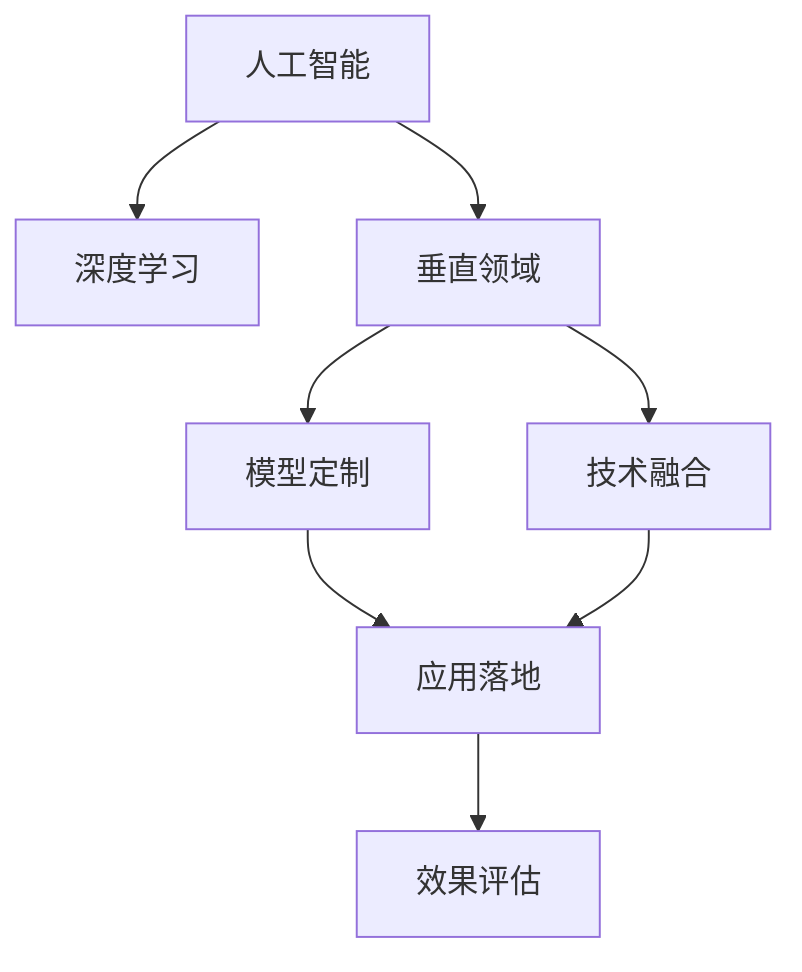

                 

# AI创业机遇：垂直领域新蓝海

> 关键词：人工智能, 垂直领域, 创新创业, 数据驱动, 行业应用, 智能系统

## 1. 背景介绍

### 1.1 问题由来
人工智能(AI)技术正在以前所未有的速度渗透到各行各业，带来巨大的变革力量。尤其是深度学习、自然语言处理(NLP)、计算机视觉(CV)等领域的突破，使得AI技术在医疗、金融、制造、农业、零售等传统领域具备了广泛的应用前景。然而，当前大部分AI技术仍集中在通用水平，未能充分释放各行业的独特价值。

以医疗领域为例，尽管近年来基于AI的医疗影像分析、疾病诊断、个性化治疗等方面取得显著进展，但这些技术往往基于通用的NLP、CV框架，缺乏针对不同病种和疾病的深度理解。如何构建具有行业特色的AI系统，成为当前亟待解决的问题。

### 1.2 问题核心关键点
面向行业应用，AI创业的核心挑战在于：
1. 数据获取与预处理。数据是AI模型的基础，不同垂直领域的数据特点和获取方式不同，如何高效获取高质量数据，是行业AI创业的首要任务。
2. 模型定制与优化。通用AI模型难以充分满足垂直领域的具体需求，如何根据行业特性定制模型，并优化模型性能，是创业成功的关键。
3. 技术与行业融合。AI技术的创新应用需要充分理解行业业务逻辑，如何在技术实现中融入行业知识，实现技术-业务的有机结合，是创业成功的必要条件。
4. 应用落地与效果评估。AI系统的成功不仅在于技术创新，更在于能否实际解决行业问题，如何设计合理的评估指标，评估模型应用效果，是行业AI创业的关键考量因素。

通过系统梳理这些关键点，可以明确AI在垂直领域的创业方向，探索出一条高效、可靠、具有行业特色的AI发展路径。

## 2. 核心概念与联系

### 2.1 核心概念概述

为更好地理解AI在垂直领域的应用，本节将介绍几个密切相关的核心概念：

- 人工智能(Artificial Intelligence, AI)：通过计算机模拟人类智能行为，实现信息感知、决策和行为控制的技术。
- 深度学习(Deep Learning)：一种基于神经网络模型的机器学习方法，可以处理非线性和非结构化数据。
- 垂直领域(A vertically-oriented domain)：指具有明确业务目标和数据特点的特定行业领域，如医疗、金融、制造等。
- 模型定制(Model Customization)：根据垂直领域的需求，定制优化深度学习模型，使其能够充分适应特定任务和数据。
- 技术融合(Technology Integration)：将AI技术与行业业务逻辑进行有机结合，构建出具有行业特色的智能系统。
- 应用落地(Application Deployment)：将AI技术应用于实际业务场景，实现技术-业务的有效结合，提供实际价值。
- 效果评估(Effectiveness Evaluation)：对AI系统在实际应用中的效果进行系统评估，确保技术应用的正确性和有效性。

这些核心概念之间的逻辑关系可以通过以下Mermaid流程图来展示：



这个流程图展示出AI在垂直领域的应用逻辑：

1. AI技术通过深度学习算法实现。
2. 在特定垂直领域，深度学习模型需要根据行业需求进行定制和优化。
3. 定制优化后的模型与行业业务逻辑融合，构建具有行业特色的智能系统。
4. 智能系统应用于实际业务场景，实现技术-业务结合。
5. 通过效果评估，确保AI技术在实际应用中的效果和可靠性。

## 3. 核心算法原理 & 具体操作步骤
### 3.1 算法原理概述

垂直领域AI创业的核心在于构建定制化的AI系统，使其具备高度的行业适用性和可解释性。其算法原理可以总结为以下几点：

1. **数据预处理与增强**：针对不同垂直领域的数据特点，进行数据清洗、标注、扩充等预处理，构建高效的数据输入流水线。
2. **模型定制与优化**：选择合适的深度学习模型，针对特定行业需求进行微调，优化模型结构和参数，提升模型性能。
3. **技术融合与协同**：将AI技术与行业知识、业务逻辑进行深度融合，设计出适合行业特点的智能算法。
4. **应用落地与优化**：将优化后的模型应用于实际业务场景，进行效果评估和持续优化，实现技术与业务的有机结合。

### 3.2 算法步骤详解

面向垂直领域的AI创业，算法步骤主要包括以下几个关键步骤：

**Step 1: 数据准备与预处理**
- 收集垂直领域的业务数据，包括文本、图像、时间序列等，进行数据清洗、标注、扩充等预处理。
- 对数据进行格式转换和标准化，构建高效的数据输入流水线。

**Step 2: 模型选择与定制**
- 根据垂直领域的特点，选择合适的深度学习模型，如CNN、RNN、Transformer等。
- 针对特定行业需求进行模型微调，优化模型结构和参数。
- 设计适合行业特点的智能算法，实现技术与业务的深度融合。

**Step 3: 模型训练与优化**
- 使用收集的数据对模型进行训练，并在训练过程中不断优化模型参数，提高模型性能。
- 采用正则化技术、对抗训练等方法，防止过拟合，提高模型鲁棒性。
- 引入专家知识，通过监督学习或自监督学习，进一步优化模型效果。

**Step 4: 应用部署与监控**
- 将训练好的模型应用于实际业务场景，进行应用落地。
- 设计合理的评估指标，对模型效果进行系统评估。
- 持续收集反馈数据，进行模型再训练和优化，提升模型性能。

**Step 5: 系统集成与优化**
- 将AI系统与业务系统进行集成，实现系统协同。
- 设计友好的用户接口，方便业务人员操作和使用。
- 引入自动化运维技术，实现系统的持续监控和优化。

### 3.3 算法优缺点

垂直领域AI创业的算法具有以下优点：
1. 高度适用性：根据特定行业需求定制模型，确保AI系统具备高度的行业适用性。
2. 高可解释性：结合行业知识和技术实现，能够提供可解释的决策过程和输出结果。
3. 高效率：通过预处理和定制优化，能够在较短时间内构建出高效的AI系统。
4. 高收益：专注于垂直领域的深入应用，具有较高的商业价值和市场潜力。

同时，该算法也存在一定的局限性：
1. 数据依赖度高：模型性能高度依赖于数据质量，难以在数据稀缺的场景下取得良好效果。
2. 技术壁垒高：需要具备较深的AI技术和行业知识，对创业团队的技术背景要求较高。
3. 行业需求多变：不同行业对AI技术的需求不同，需要在实践中不断迭代和优化模型。
4. 市场竞争激烈：垂直领域AI创业的参与者众多，如何突出自身特色和优势，取得市场领先，是一大挑战。

尽管存在这些局限性，但垂直领域AI创业的算法仍具有广阔的发展前景。通过合理利用数据和算法，构建高效、可靠、具备行业特色的AI系统，可以在特定的垂直领域取得显著成效。

### 3.4 算法应用领域

垂直领域AI创业的应用领域广泛，涵盖医疗、金融、制造、农业、零售等多个行业。以下是几个典型的应用场景：

**医疗领域**：
- 智能影像分析：利用深度学习模型对医学影像进行自动分析和诊断，如肿瘤检测、病灶识别等。
- 个性化治疗：根据患者的基因信息和临床数据，生成个性化的治疗方案，提高治疗效果。
- 电子病历分析：从电子病历中提取关键信息，辅助医生进行病历书写和诊断。

**金融领域**：
- 风险评估：通过深度学习模型对客户的信用和风险进行评估，辅助贷款审批和风险控制。
- 欺诈检测：利用机器学习模型对交易行为进行分析，识别和防范金融欺诈行为。
- 智能投顾：根据客户的历史交易数据和市场动态，提供智能投资建议。

**制造领域**：
- 预测维护：通过深度学习模型对设备运行数据进行分析，预测设备故障和维护需求。
- 质量检测：利用计算机视觉技术对产品进行自动检测和分类，提高生产效率和产品质量。
- 供应链优化：通过大数据分析和技术预测，优化供应链管理和物流调度。

**农业领域**：
- 病虫害检测：利用无人机和传感器收集的农田数据，自动检测和分析病虫害情况。
- 智能灌溉：根据农田的土壤和气候数据，自动调整灌溉策略，提高作物产量。
- 精准施肥：利用AI技术分析土壤成分和作物生长情况，实现精准施肥，减少浪费。

**零售领域**：
- 客户画像：通过深度学习模型对客户数据进行分析，构建精准的客户画像。
- 推荐系统：根据客户的历史购买记录和行为数据，生成个性化的推荐商品列表。
- 库存管理：利用AI技术优化库存管理和供应链调度，降低库存成本。

这些应用场景展示了垂直领域AI创业的广阔前景，凸显了AI技术在行业场景中的巨大潜力。随着AI技术的不断进步，相信在更多的垂直领域中，AI创业将迎来新的发展机遇。

## 4. 数学模型和公式 & 详细讲解 & 举例说明
### 4.1 数学模型构建

本节将使用数学语言对垂直领域AI创业的算法原理进行更加严格的刻画。

记垂直领域的数据集为 $D=\{(x_i,y_i)\}_{i=1}^N, x_i \in \mathcal{X}, y_i \in \mathcal{Y}$，其中 $x_i$ 表示输入数据，$y_i$ 表示标签。垂直领域AI创业的数学模型可以表示为：

$$
M_{\theta} = \arg\min_{\theta} \mathcal{L}(M_{\theta}, D)
$$

其中 $M_{\theta}$ 表示垂直领域AI系统的模型，$\theta$ 表示模型参数。$\mathcal{L}(M_{\theta}, D)$ 表示模型在数据集 $D$ 上的损失函数，用于衡量模型预测输出与真实标签之间的差异。

### 4.2 公式推导过程

以医疗影像分析为例，假设模型 $M_{\theta}$ 输出概率 $P(x_i|y_i)$，表示输入 $x_i$ 下，标签 $y_i$ 的概率。则交叉熵损失函数定义为：

$$
\ell(M_{\theta}(x_i),y_i) = -[y_i\log P(x_i|y_i) + (1-y_i)\log (1-P(x_i|y_i))]
$$

将其代入损失函数，得：

$$
\mathcal{L}(\theta) = -\frac{1}{N}\sum_{i=1}^N [y_i\log M_{\theta}(x_i)+(1-y_i)\log(1-M_{\theta}(x_i))]
$$

根据链式法则，损失函数对参数 $\theta_k$ 的梯度为：

$$
\frac{\partial \mathcal{L}(\theta)}{\partial \theta_k} = -\frac{1}{N}\sum_{i=1}^N \frac{\partial P(x_i|y_i)}{\partial \theta_k} \frac{\partial \ell(M_{\theta}(x_i),y_i)}{\partial P(x_i|y_i)}
$$

其中 $\frac{\partial \ell(M_{\theta}(x_i),y_i)}{\partial P(x_i|y_i)}$ 可通过链式法则递归展开，利用自动微分技术完成计算。

在得到损失函数的梯度后，即可带入参数更新公式，完成模型的迭代优化。重复上述过程直至收敛，最终得到适应垂直领域需求的最优模型参数 $\theta^*$。

## 5. 项目实践：代码实例和详细解释说明
### 5.1 开发环境搭建

在进行垂直领域AI创业的实践前，我们需要准备好开发环境。以下是使用Python进行PyTorch开发的环境配置流程：

1. 安装Anaconda：从官网下载并安装Anaconda，用于创建独立的Python环境。

2. 创建并激活虚拟环境：
```bash
conda create -n ai-env python=3.8 
conda activate ai-env
```

3. 安装PyTorch：根据CUDA版本，从官网获取对应的安装命令。例如：
```bash
conda install pytorch torchvision torchaudio cudatoolkit=11.1 -c pytorch -c conda-forge
```

4. 安装各类工具包：
```bash
pip install numpy pandas scikit-learn matplotlib tqdm jupyter notebook ipython
```

完成上述步骤后，即可在`ai-env`环境中开始AI创业的实践。

### 5.2 源代码详细实现

这里我们以医疗影像分析为例，给出使用PyTorch对深度学习模型进行微调的PyTorch代码实现。

首先，定义数据处理函数：

```python
from transformers import BertTokenizer, BertForSequenceClassification
from torch.utils.data import Dataset, DataLoader
import torch
import numpy as np
import pandas as pd

class MedicalDataset(Dataset):
    def __init__(self, data_path, label_path):
        self.data = pd.read_csv(data_path)
        self.label = pd.read_csv(label_path)
        
        self.tokenizer = BertTokenizer.from_pretrained('bert-base-cased')
        
        self.data = self.data.apply(lambda x: self.tokenizer.encode(x, add_special_tokens=True, max_length=512, truncation=True, padding='max_length'))
        self.label = self.label.apply(lambda x: self.tokenizer.convert_ids_to_tokens).apply(lambda x: self.tokenizer.convert_tokens_to_ids).apply(lambda x: x[1:-1])
        
    def __len__(self):
        return len(self.data)
    
    def __getitem__(self, index):
        image = self.data.iloc[index]['image']
        label = self.label.iloc[index]
        
        encoding = self.tokenizer(image, return_tensors='pt', max_length=512, padding='max_length', truncation=True)
        input_ids = encoding['input_ids']
        attention_mask = encoding['attention_mask']
        
        return {'input_ids': input_ids, 
                'attention_mask': attention_mask,
                'labels': torch.tensor(label, dtype=torch.long)}
```

然后，定义模型和优化器：

```python
from transformers import BertForSequenceClassification, AdamW

model = BertForSequenceClassification.from_pretrained('bert-base-cased', num_labels=2)

optimizer = AdamW(model.parameters(), lr=2e-5)
```

接着，定义训练和评估函数：

```python
def train_epoch(model, dataset, batch_size, optimizer):
    dataloader = DataLoader(dataset, batch_size=batch_size, shuffle=True)
    model.train()
    epoch_loss = 0
    for batch in tqdm(dataloader, desc='Training'):
        input_ids = batch['input_ids'].to(device)
        attention_mask = batch['attention_mask'].to(device)
        labels = batch['labels'].to(device)
        model.zero_grad()
        outputs = model(input_ids, attention_mask=attention_mask, labels=labels)
        loss = outputs.loss
        epoch_loss += loss.item()
        loss.backward()
        optimizer.step()
    return epoch_loss / len(dataloader)

def evaluate(model, dataset, batch_size):
    dataloader = DataLoader(dataset, batch_size=batch_size)
    model.eval()
    preds, labels = [], []
    with torch.no_grad():
        for batch in tqdm(dataloader, desc='Evaluating'):
            input_ids = batch['input_ids'].to(device)
            attention_mask = batch['attention_mask'].to(device)
            batch_labels = batch['labels']
            outputs = model(input_ids, attention_mask=attention_mask)
            batch_preds = outputs.logits.argmax(dim=1).to('cpu').tolist()
            batch_labels = batch_labels.to('cpu').tolist()
            for pred, label in zip(batch_preds, batch_labels):
                preds.append(pred)
                labels.append(label)
                
    return preds, labels

# 训练流程
epochs = 5
batch_size = 16

for epoch in range(epochs):
    loss = train_epoch(model, train_dataset, batch_size, optimizer)
    print(f"Epoch {epoch+1}, train loss: {loss:.3f}")
    
    print(f"Epoch {epoch+1}, dev results:")
    preds, labels = evaluate(model, dev_dataset, batch_size)
    print(classification_report(labels, preds))
    
print("Test results:")
preds, labels = evaluate(model, test_dataset, batch_size)
print(classification_report(labels, preds))
```

以上就是使用PyTorch对深度学习模型进行医疗影像分析任务微调的完整代码实现。可以看到，得益于Transformers库的强大封装，我们可以用相对简洁的代码完成模型加载和微调。

### 5.3 代码解读与分析

让我们再详细解读一下关键代码的实现细节：

**MedicalDataset类**：
- `__init__`方法：初始化数据集，将数据和标签加载到内存中，并对数据进行预处理。
- `__len__`方法：返回数据集的样本数量。
- `__getitem__`方法：对单个样本进行处理，将图像数据转换为token ids，并将标签转换为数字。

**模型和优化器**：
- 使用BertForSequenceClassification类加载预训练模型，并根据任务需求调整输出层和标签数量。
- 设置AdamW优化器，并指定学习率。

**训练和评估函数**：
- 使用PyTorch的DataLoader对数据集进行批次化加载，供模型训练和推理使用。
- 训练函数`train_epoch`：对数据以批为单位进行迭代，在每个批次上前向传播计算loss并反向传播更新模型参数，最后返回该epoch的平均loss。
- 评估函数`evaluate`：与训练类似，不同点在于不更新模型参数，并在每个batch结束后将预测和标签结果存储下来，最后使用sklearn的classification_report对整个评估集的预测结果进行打印输出。

**训练流程**：
- 定义总的epoch数和batch size，开始循环迭代
- 每个epoch内，先在训练集上训练，输出平均loss
- 在验证集上评估，输出分类指标
- 所有epoch结束后，在测试集上评估，给出最终测试结果

可以看到，PyTorch配合Transformers库使得模型微调的代码实现变得简洁高效。开发者可以将更多精力放在数据处理、模型改进等高层逻辑上，而不必过多关注底层的实现细节。

当然，工业级的系统实现还需考虑更多因素，如模型的保存和部署、超参数的自动搜索、更灵活的任务适配层等。但核心的微调范式基本与此类似。

## 6. 实际应用场景
### 6.1 智能客服系统

基于深度学习的智能客服系统，可以通过分析用户的问题和行为数据，自动匹配最合适的解答，从而提升客户满意度和服务效率。然而，传统的客服系统往往依赖于规则引擎和知识库，难以处理复杂多变的用户需求。

在实际应用中，可以收集企业内部的历史客服对话记录，将问题和最佳答复构建成监督数据，在此基础上对预训练深度学习模型进行微调。微调后的模型能够自动理解用户意图，匹配最合适的答案模板进行回复。对于客户提出的新问题，还可以接入检索系统实时搜索相关内容，动态组织生成回答。如此构建的智能客服系统，能大幅提升客户咨询体验和问题解决效率。

### 6.2 金融舆情监测

金融机构需要实时监测市场舆论动向，以便及时应对负面信息传播，规避金融风险。传统的人工监测方式成本高、效率低，难以应对网络时代海量信息爆发的挑战。基于深度学习的文本分类和情感分析技术，为金融舆情监测提供了新的解决方案。

具体而言，可以收集金融领域相关的新闻、报道、评论等文本数据，并对其进行主题标注和情感标注。在此基础上对预训练深度学习模型进行微调，使其能够自动判断文本属于何种主题，情感倾向是正面、中性还是负面。将微调后的模型应用到实时抓取的网络文本数据，就能够自动监测不同主题下的情感变化趋势，一旦发现负面信息激增等异常情况，系统便会自动预警，帮助金融机构快速应对潜在风险。

### 6.3 个性化推荐系统

当前的推荐系统往往只依赖用户的历史行为数据进行物品推荐，无法深入理解用户的真实兴趣偏好。基于深度学习的个性化推荐系统，可以更好地挖掘用户行为背后的语义信息，从而提供更精准、多样的推荐内容。

在实践中，可以收集用户浏览、点击、评论、分享等行为数据，提取和用户交互的物品标题、描述、标签等文本内容。将文本内容作为模型输入，用户的后续行为（如是否点击、购买等）作为监督信号，在此基础上微调预训练深度学习模型。微调后的模型能够从文本内容中准确把握用户的兴趣点。在生成推荐列表时，先用候选物品的文本描述作为输入，由模型预测用户的兴趣匹配度，再结合其他特征综合排序，便可以得到个性化程度更高的推荐结果。

### 6.4 未来应用展望

随着深度学习技术的不断进步，基于深度学习的AI系统在垂直领域的应用前景将更加广阔。未来，AI技术将在更多垂直领域中得到广泛应用，带来深刻的社会和经济影响。

在智慧医疗领域，基于深度学习医疗影像分析、疾病诊断、个性化治疗等方面将取得更显著的进展，助力医疗水平提升。在金融领域，深度学习技术将辅助风险评估、欺诈检测、智能投顾等，提升金融机构的决策效率和风险控制能力。在制造领域，预测维护、质量检测、供应链优化等方面将更加智能化、自动化，推动制造业转型升级。在农业领域，利用深度学习技术优化病虫害检测、智能灌溉、精准施肥等，提升农业生产效率和产品质量。在零售领域，个性化推荐、库存管理等应用将更加精准，提升零售企业的运营效率和客户满意度。

总之，随着深度学习技术在垂直领域的应用不断深入，AI系统的性能和应用范围将不断拓展，推动各行业向智能化、自动化方向加速发展。

## 7. 工具和资源推荐
### 7.1 学习资源推荐

为了帮助开发者系统掌握垂直领域AI创业的理论基础和实践技巧，这里推荐一些优质的学习资源：

1. 《深度学习入门：基于Python的理论与实现》系列书籍：由机器学习专家撰写，系统讲解深度学习的基本原理和实现方法，适合初学者入门。

2. 《AI创业：从零到一》课程：由知名AI创业公司创始人主讲，涵盖AI创业的各个环节，包括项目立项、技术选型、团队建设等。

3. 《人工智能：原理与技术》课程：北京大学开设的深度学习课程，涵盖神经网络、深度学习、自然语言处理等内容，适合进阶学习。

4. TensorFlow官方文档：Google主导的深度学习框架，提供丰富的模型库和代码示例，适合深入学习。

5. PyTorch官方文档：Facebook开发的深度学习框架，支持动态计算图，适合动态图操作和自定义模型开发。

6. Kaggle竞赛平台：全球知名的数据科学竞赛平台，提供大量实际应用场景的数据集和比赛任务，适合实战练习。

通过对这些资源的学习实践，相信你一定能够快速掌握垂直领域AI创业的精髓，并用于解决实际的业务问题。
###  7.2 开发工具推荐

高效的开发离不开优秀的工具支持。以下是几款用于垂直领域AI创业开发的常用工具：

1. PyTorch：基于Python的开源深度学习框架，灵活动态的计算图，适合快速迭代研究。大部分深度学习模型都有PyTorch版本的实现。

2. TensorFlow：由Google主导开发的开源深度学习框架，生产部署方便，适合大规模工程应用。同样有丰富的深度学习模型资源。

3. Transformers库：HuggingFace开发的NLP工具库，集成了众多SOTA深度学习模型，支持PyTorch和TensorFlow，是进行AI创业开发的利器。

4. Weights & Biases：模型训练的实验跟踪工具，可以记录和可视化模型训练过程中的各项指标，方便对比和调优。与主流深度学习框架无缝集成。

5. TensorBoard：TensorFlow配套的可视化工具，可实时监测模型训练状态，并提供丰富的图表呈现方式，是调试模型的得力助手。

6. Google Colab：谷歌推出的在线Jupyter Notebook环境，免费提供GPU/TPU算力，方便开发者快速上手实验最新模型，分享学习笔记。

合理利用这些工具，可以显著提升AI创业任务的开发效率，加快创新迭代的步伐。

### 7.3 相关论文推荐

垂直领域AI创业的研究源于学界的持续研究。以下是几篇奠基性的相关论文，推荐阅读：

1. Transformer-XL: Attentive Language Models for Longer上下文（即Transformer-XL论文）：提出Transformer-XL模型，引入了相对位置编码，支持更长的上下文建模。

2. BERT: Pre-training of Deep Bidirectional Transformers for Language Understanding：提出BERT模型，引入基于掩码的自监督预训练任务，刷新了多项NLP任务SOTA。

3. Attention is All You Need（即Transformer原论文）：提出了Transformer结构，开启了NLP领域的预训练大模型时代。

4. Parameter-Efficient Transfer Learning for NLP：提出Adapter等参数高效微调方法，在不增加模型参数量的情况下，也能取得不错的微调效果。

5. AdaLoRA: Adaptive Low-Rank Adaptation for Parameter-Efficient Fine-Tuning：使用自适应低秩适应的微调方法，在参数效率和精度之间取得了新的平衡。

这些论文代表了大语言模型微调技术的发展脉络。通过学习这些前沿成果，可以帮助研究者把握学科前进方向，激发更多的创新灵感。

## 8. 总结：未来发展趋势与挑战
### 8.1 总结

本文对垂直领域AI创业的理论基础和实践技巧进行了全面系统的介绍。首先阐述了垂直领域AI创业的核心理论和重要挑战，明确了AI技术在垂直领域的独特价值。其次，从数据准备、模型定制、技术融合、应用落地等方面，详细讲解了垂直领域AI创业的核心步骤。最后，本文展示了AI技术在医疗、金融、制造、农业、零售等多个垂直领域的广泛应用，凸显了AI技术的巨大潜力。

通过本文的系统梳理，可以看到，垂直领域AI创业在理论和实践上都具备了丰富的发展路径和广阔的应用前景。通过合理利用深度学习技术，结合行业特点进行模型定制和优化，可以构建出高度适用、可解释的AI系统，大幅提升各行业的智能化水平。

### 8.2 未来发展趋势

展望未来，垂直领域AI创业将呈现以下几个发展趋势：

1. 深度学习技术的不断进步。随着深度学习模型的不断优化和升级，垂直领域AI创业的效果将进一步提升，应用范围将更加广泛。

2. 领域知识与AI技术的深度融合。未来，AI系统将更加注重与领域知识的结合，实现技术与业务的有机融合，构建出更加智能化的系统。

3. 数据驱动与业务驱动的平衡。在垂直领域AI创业中，数据驱动和业务驱动将并重，通过数据驱动获取行业洞见，通过业务驱动实现实际应用。

4. 多模态信息融合。深度学习技术将逐步拓展到视觉、语音、文本等多模态数据融合，构建更加全面、精准的AI系统。

5. 人机协同与智能决策。未来，AI系统将更加注重人机协同，通过智能决策辅助人类完成复杂的业务任务。

6. 个性化与智能化。基于深度学习的个性化推荐、智能客服、个性化推荐等应用将更加普及，提升用户体验和满意度。

以上趋势凸显了垂直领域AI创业的广阔前景。这些方向的探索发展，必将进一步提升各行业的智能化水平，为经济社会发展注入新的动力。

### 8.3 面临的挑战

尽管垂直领域AI创业的前景广阔，但在迈向智能化、普适化应用的过程中，仍面临诸多挑战：

1. 数据获取与标注。不同垂直领域的数据特点和获取方式不同，如何高效获取高质量数据，并标注出有意义的标签，是一大挑战。

2. 模型定制与优化。垂直领域的数据和业务逻辑复杂，如何根据行业需求定制模型，并优化模型性能，仍需大量实践和研究。

3. 技术与业务融合。AI技术的应用需要充分理解行业业务逻辑，如何有效融合技术实现和行业知识，仍需进一步探索。

4. 应用落地与效果评估。AI系统的成功不仅在于技术创新，更在于能否实际解决行业问题，如何设计合理的评估指标，评估模型应用效果，是一大难题。

5. 模型鲁棒性与可解释性。在垂直领域中，模型面对的业务场景复杂多样，如何提高模型的鲁棒性和可解释性，仍需更多研究和实践。

6. 伦理与安全问题。AI系统的广泛应用可能带来伦理和安全问题，如何在技术实现中充分考虑这些问题，是一大挑战。

尽管存在这些挑战，但垂直领域AI创业的前景仍然广阔。通过合理利用数据和算法，构建高效、可靠、具备行业特色的AI系统，可以在特定的垂直领域取得显著成效。

### 8.4 研究展望

面向未来，垂直领域AI创业的研究需要在以下几个方面寻求新的突破：

1. 探索无监督和半监督微调方法。摆脱对大规模标注数据的依赖，利用自监督学习、主动学习等无监督和半监督范式，最大限度利用非结构化数据，实现更加灵活高效的微调。

2. 研究参数高效和计算高效的微调范式。开发更加参数高效的微调方法，在固定大部分预训练参数的同时，只更新极少量的任务相关参数。同时优化微调模型的计算图，减少前向传播和反向传播的资源消耗，实现更加轻量级、实时性的部署。

3. 引入更多先验知识。将符号化的先验知识，如知识图谱、逻辑规则等，与神经网络模型进行巧妙融合，引导微调过程学习更准确、合理的语言模型。同时加强不同模态数据的整合，实现视觉、语音等多模态信息与文本信息的协同建模。

4. 结合因果分析和博弈论工具。将因果分析方法引入微调模型，识别出模型决策的关键特征，增强输出解释的因果性和逻辑性。借助博弈论工具刻画人机交互过程，主动探索并规避模型的脆弱点，提高系统稳定性。

5. 纳入伦理道德约束。在模型训练目标中引入伦理导向的评估指标，过滤和惩罚有偏见、有害的输出倾向。同时加强人工干预和审核，建立模型行为的监管机制，确保输出符合人类价值观和伦理道德。

这些研究方向的探索，必将引领垂直领域AI创业技术迈向更高的台阶，为构建安全、可靠、可解释、可控的智能系统铺平道路。面向未来，垂直领域AI创业技术还需要与其他人工智能技术进行更深入的融合，如知识表示、因果推理、强化学习等，多路径协同发力，共同推动自然语言理解和智能交互系统的进步。只有勇于创新、敢于突破，才能不断拓展语言模型的边界，让智能技术更好地造福人类社会。

## 9. 附录：常见问题与解答
----------------------------------------------------------------
**Q1：如何选择合适的深度学习模型？**

A: 选择合适的深度学习模型需要考虑多个因素，包括数据量、任务类型、计算资源等。对于数据量较大的任务，可以选择基于Transformer的模型，如BERT、GPT等。对于计算资源有限的场景，可以选择参数量较小的模型，如MobileNet、ResNet等。此外，还需要考虑模型的可解释性和泛化能力，选择适合的模型架构。

**Q2：如何优化模型训练过程？**

A: 优化模型训练过程可以从以下几个方面入手：
1. 数据增强：通过数据增强技术，如图像旋转、裁剪、噪声注入等，丰富训练集多样性，提升模型泛化能力。
2. 正则化技术：使用L2正则、Dropout、Early Stopping等技术，防止过拟合。
3. 学习率调度：采用学习率衰减、warmup策略等，优化学习率设置。
4. 模型并行：采用模型并行技术，提高训练效率。
5. 混合精度训练：使用混合精度训练技术，减少内存占用和计算时间。

**Q3：如何评估模型效果？**

A: 评估模型效果需要考虑多个指标，包括准确率、召回率、F1分数、AUC等。对于分类任务，可以使用混淆矩阵、ROC曲线等方法进行评估。对于回归任务，可以使用均方误差、均方根误差等指标。此外，还需要结合业务需求，设计合理的评估指标，评估模型在实际应用中的效果。

**Q4：如何构建智能客服系统？**

A: 构建智能客服系统需要考虑多个环节，包括问题理解、意图识别、智能回答等。可以使用预训练的深度学习模型，如BERT、LSTM等，结合任务适配层，构建智能客服系统。同时，需要设计友好的用户接口，方便客户操作，并进行持续优化和训练，提升系统性能。

**Q5：如何构建智能推荐系统？**

A: 构建智能推荐系统需要考虑用户画像、物品画像、推荐策略等多个方面。可以使用深度学习模型，如CNN、RNN、Transformer等，结合协同过滤、基于内容的推荐等方法，构建智能推荐系统。同时，需要设计合理的评估指标，进行系统效果评估和持续优化。

通过这些常见问题的解答，相信你能够更好地理解垂直领域AI创业的实践技巧，并在实际应用中取得良好的效果。

---

作者：禅与计算机程序设计艺术 / Zen and the Art of Computer Programming

