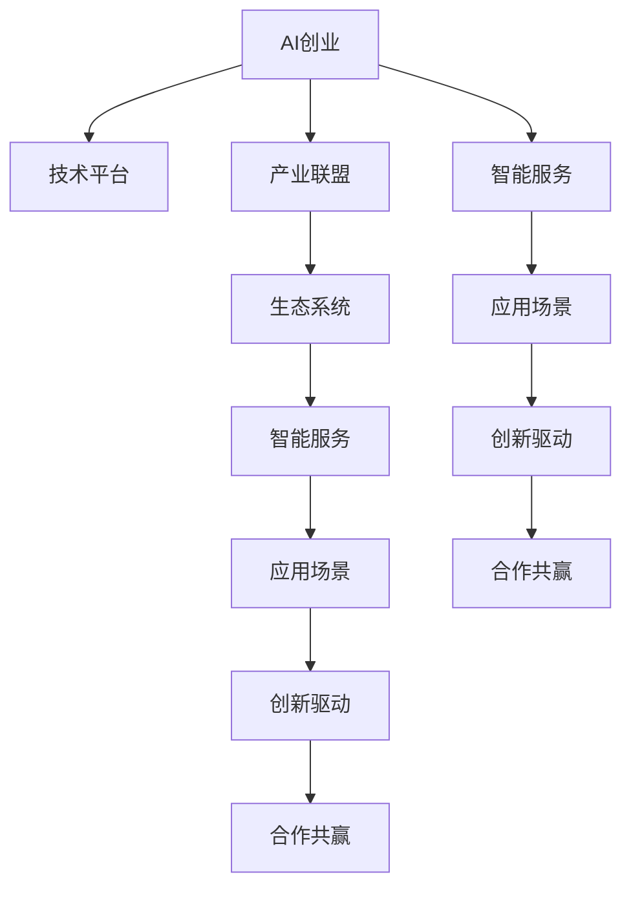

                 

# AI创业生态系统的构建：从技术平台到产业联盟

> 关键词：AI创业, 技术平台, 产业联盟, 生态系统, 智能服务, 应用场景, 创新驱动, 合作共赢

## 1. 背景介绍

### 1.1 问题由来

随着人工智能(AI)技术的迅猛发展，AI创业企业如雨后春笋般涌现。然而，AI技术的高度专业性和复杂性使得其在实际应用场景中面临着诸多挑战。一方面，缺乏高效可靠的技术平台和工具；另一方面，未能形成跨行业、跨领域的合作机制，难以实现资源的有效整合和共享。这不仅限制了AI技术的落地应用，也阻碍了AI产业的快速成长。

### 1.2 问题核心关键点

为了解决上述问题，构建一个高效、开放、协作的AI创业生态系统，需要从技术平台和产业联盟两个方面进行系统性的设计和构建。技术平台作为基础设施，提供工具和平台支持，而产业联盟作为纽带，实现资源共享和合作共赢。

构建AI创业生态系统涉及多个关键点：
1. **技术平台**：包括AI模型库、数据集、计算框架等基础设施，提供高效的技术支撑。
2. **产业联盟**：通过构建联盟组织，实现技术、数据、人才、资金等资源的共享与合作，推动AI技术在实际应用中的落地。
3. **应用场景**：将AI技术广泛应用于各个行业，实现技术与应用的双向驱动。
4. **创新驱动**：通过持续的技术研发和产业合作，保持技术创新和市场竞争力的提升。
5. **合作共赢**：鼓励企业间、跨领域间的合作，实现资源互补，共同提升AI产业的整体实力。

### 1.3 问题研究意义

构建高效的AI创业生态系统，具有以下重要意义：
1. **提升AI技术应用效率**：通过技术平台和产业联盟的构建，提升AI技术的开发和部署效率，加速其在实际场景中的应用。
2. **推动AI产业成长**：通过资源共享和合作共赢，促进AI创业企业的发展，推动AI产业的快速成长。
3. **促进AI与行业融合**：将AI技术应用于各个行业，实现AI技术在实际场景中的落地，提升产业的智能化水平。
4. **推动创新驱动**：通过技术研发和产业合作，保持AI技术的持续创新，提升企业的竞争力。
5. **实现合作共赢**：鼓励企业间的合作，实现资源互补，共同提升AI产业的整体实力。

## 2. 核心概念与联系

### 2.1 核心概念概述

为更好地理解AI创业生态系统的构建，本节将介绍几个密切相关的核心概念：

- **AI创业**：指利用AI技术解决实际问题，创新商业模式，创造商业价值的过程。
- **技术平台**：指为AI创业者提供技术支持和工具的基础设施，如AI模型库、计算框架等。
- **产业联盟**：指通过构建联盟组织，实现技术、数据、人才、资金等资源的共享与合作。
- **生态系统**：指由技术平台、产业联盟、应用场景、创新驱动、合作共赢等多个要素组成的协同发展环境。
- **智能服务**：指利用AI技术提供的专业化服务，如自动驾驶、智能客服、推荐系统等。
- **应用场景**：指AI技术在实际应用中的具体场景，如医疗、金融、制造等。
- **创新驱动**：指通过持续的技术研发和产业合作，保持技术创新和市场竞争力的提升。
- **合作共赢**：指鼓励企业间、跨领域间的合作，实现资源互补，共同提升AI产业的整体实力。

这些核心概念之间的逻辑关系可以通过以下Mermaid流程图来展示：



这个流程图展示了这个生态系统的核心概念及其之间的关系：

1. AI创业是整个生态系统的起点，驱动技术平台和产业联盟的构建。
2. 技术平台提供基础的技术支持和工具，支撑AI创业的实现。
3. 产业联盟通过资源共享和合作，推动AI技术的落地应用。
4. 生态系统是由技术平台、产业联盟、应用场景等组成的协同发展环境。
5. 智能服务是AI技术在实际应用中的具体体现，支撑生态系统的运行。
6. 应用场景是AI技术在各行业的具体应用，推动技术平台的完善和产业联盟的发展。
7. 创新驱动和合作共赢是生态系统发展的核心动力，推动AI技术的发展和应用。

## 3. 核心算法原理 & 具体操作步骤

### 3.1 算法原理概述

构建AI创业生态系统涉及多个关键技术，包括AI模型训练、数据管理、平台设计、产业合作等。本节将重点介绍AI模型训练和数据管理的核心算法原理及具体操作步骤。

### 3.2 算法步骤详解

#### 3.2.1 技术平台构建

技术平台的构建包括以下几个关键步骤：

1. **选择合适的AI技术栈**：根据应用场景选择合适的AI技术栈，如深度学习、强化学习、自然语言处理等。
2. **设计数据管理系统**：建立数据采集、存储、清洗、标注等模块，确保数据的质量和可用性。
3. **开发AI模型库**：构建AI模型库，包括预训练模型、微调模型、自定义模型等，提供高效的模型开发和部署支持。
4. **设计计算框架**：选择高效的计算框架，如TensorFlow、PyTorch等，提供高效的计算和模型训练支持。
5. **提供API接口**：设计API接口，实现模型服务化，方便外部调用。

#### 3.2.2 数据管理与标注

数据管理与标注是构建技术平台的重要环节，包括以下几个关键步骤：

1. **数据收集**：从不同渠道收集数据，如公开数据集、自有数据、用户数据等。
2. **数据清洗**：对数据进行清洗，去除噪声和异常值，确保数据质量。
3. **数据标注**：对数据进行标注，确保数据标注的准确性和一致性。
4. **数据存储**：建立数据存储系统，确保数据的存储和管理。
5. **数据共享**：通过联盟组织，实现数据的共享和协作，提升数据利用效率。

#### 3.2.3 AI模型训练与部署

AI模型训练与部署包括以下几个关键步骤：

1. **模型选择**：根据应用场景选择合适的模型，如分类模型、回归模型、生成模型等。
2. **数据准备**：准备训练数据和验证数据，确保数据的质量和多样性。
3. **模型训练**：使用训练数据对模型进行训练，优化模型的参数。
4. **模型评估**：使用验证数据对模型进行评估，确保模型的性能。
5. **模型部署**：将模型部署到计算框架中，提供高效的模型服务。

### 3.3 算法优缺点

构建AI创业生态系统的技术平台和产业联盟，具有以下优点：
1. **高效技术支撑**：提供高效的技术支持和工具，提升AI创业的效率。
2. **资源共享与合作**：实现技术、数据、人才、资金等资源的共享与合作，提升AI技术的落地能力。
3. **技术创新与应用**：推动AI技术的持续创新和应用，提升AI产业的整体实力。

同时，也存在以下缺点：
1. **成本较高**：构建技术平台和产业联盟需要较大的投入，包括人力、物力、财力等。
2. **技术复杂性**：构建技术平台和产业联盟涉及多个关键技术，技术复杂性较高。
3. **资源整合难度大**：实现跨领域、跨行业的资源整合和共享，难度较大。

### 3.4 算法应用领域

技术平台和产业联盟构建完成后，可以应用于多个领域，如智能制造、智慧医疗、智能交通、智能客服等。具体应用如下：

1. **智能制造**：通过AI模型训练和数据管理，实现智能生产、智能质检、智能运维等功能。
2. **智慧医疗**：通过AI模型训练和数据管理，实现智能诊断、智能推荐、智能监控等功能。
3. **智能交通**：通过AI模型训练和数据管理，实现智能调度、智能监控、智能驾驶等功能。
4. **智能客服**：通过AI模型训练和数据管理，实现智能对话、智能推荐、智能分析等功能。

## 4. 数学模型和公式 & 详细讲解 & 举例说明

### 4.1 数学模型构建

构建AI创业生态系统的技术平台和产业联盟，涉及多个数学模型和公式。本节将重点介绍AI模型训练和数据管理的数学模型及公式。

#### 4.1.1 AI模型训练

AI模型训练的数学模型包括损失函数、优化器、梯度下降等。

**损失函数**：常用的损失函数包括交叉熵损失、均方误差损失等。
$$
\mathcal{L}(\theta) = \frac{1}{N}\sum_{i=1}^N \ell(M_{\theta}(x_i),y_i)
$$

**优化器**：常用的优化器包括SGD、Adam等。
$$
\theta \leftarrow \theta - \eta \nabla_{\theta}\mathcal{L}(\theta)
$$

**梯度下降**：梯度下降的公式为：
$$
\theta \leftarrow \theta - \eta \nabla_{\theta}\mathcal{L}(\theta)
$$

#### 4.1.2 数据管理

数据管理涉及数据收集、清洗、标注等多个环节，使用数学模型进行量化分析，确保数据的质量和可用性。

**数据收集**：使用随机抽样方法，从不同渠道收集数据。
$$
\mathcal{D} \sim \mathcal{D}_{total}
$$

**数据清洗**：对数据进行噪声处理，去除异常值。
$$
\tilde{D} = \{(x_i,y_i)\}_{i=1}^N
$$

**数据标注**：对数据进行标注，确保标注的准确性和一致性。
$$
\mathcal{T} = \{(t_i)\}_{i=1}^N
$$

#### 4.1.3 案例分析

以智能客服系统为例，分析数据管理与标注的应用。

**数据收集**：从客户咨询记录中收集文本数据，建立文本语料库。
$$
\mathcal{D} = \{(x_i)\}_{i=1}^N
$$

**数据清洗**：对文本数据进行清洗，去除噪声和异常值。
$$
\tilde{D} = \{(\tilde{x}_i)\}_{i=1}^N
$$

**数据标注**：对清洗后的文本数据进行标注，标注客户的意图和情感。
$$
\mathcal{T} = \{(t_i)\}_{i=1}^N
$$

### 4.2 公式推导过程

以下我们以智能客服系统为例，推导数据管理的数学模型和公式。

**数据收集**：从客户咨询记录中收集文本数据，建立文本语料库。
$$
\mathcal{D} = \{(x_i)\}_{i=1}^N
$$

**数据清洗**：对文本数据进行清洗，去除噪声和异常值。
$$
\tilde{D} = \{(\tilde{x}_i)\}_{i=1}^N
$$

**数据标注**：对清洗后的文本数据进行标注，标注客户的意图和情感。
$$
\mathcal{T} = \{(t_i)\}_{i=1}^N
$$

通过数据清洗和标注，提升数据的质量和可用性，为AI模型训练提供可靠的基础。

## 5. 项目实践：代码实例和详细解释说明

### 5.1 开发环境搭建

在进行AI创业生态系统的构建前，我们需要准备好开发环境。以下是使用Python进行PyTorch开发的环境配置流程：

1. 安装Anaconda：从官网下载并安装Anaconda，用于创建独立的Python环境。

2. 创建并激活虚拟环境：
```bash
conda create -n pytorch-env python=3.8 
conda activate pytorch-env
```

3. 安装PyTorch：根据CUDA版本，从官网获取对应的安装命令。例如：
```bash
conda install pytorch torchvision torchaudio cudatoolkit=11.1 -c pytorch -c conda-forge
```

4. 安装Transformers库：
```bash
pip install transformers
```

5. 安装各类工具包：
```bash
pip install numpy pandas scikit-learn matplotlib tqdm jupyter notebook ipython
```

完成上述步骤后，即可在`pytorch-env`环境中开始AI创业生态系统的构建实践。

### 5.2 源代码详细实现

这里我们以智能客服系统为例，给出使用Transformers库对BERT模型进行微调的PyTorch代码实现。

首先，定义智能客服系统中的数据处理函数：

```python
from transformers import BertTokenizer
from torch.utils.data import Dataset
import torch

class ChatDataset(Dataset):
    def __init__(self, texts, tags, tokenizer, max_len=128):
        self.texts = texts
        self.tags = tags
        self.tokenizer = tokenizer
        self.max_len = max_len
        
    def __len__(self):
        return len(self.texts)
    
    def __getitem__(self, item):
        text = self.texts[item]
        tags = self.tags[item]
        
        encoding = self.tokenizer(text, return_tensors='pt', max_length=self.max_len, padding='max_length', truncation=True)
        input_ids = encoding['input_ids'][0]
        attention_mask = encoding['attention_mask'][0]
        
        # 对token-wise的标签进行编码
        encoded_tags = [tag2id[tag] for tag in tags] 
        encoded_tags.extend([tag2id['O']] * (self.max_len - len(encoded_tags)))
        labels = torch.tensor(encoded_tags, dtype=torch.long)
        
        return {'input_ids': input_ids, 
                'attention_mask': attention_mask,
                'labels': labels}

# 标签与id的映射
tag2id = {'O': 0, 'B-PER': 1, 'I-PER': 2, 'B-ORG': 3, 'I-ORG': 4, 'B-LOC': 5, 'I-LOC': 6}
id2tag = {v: k for k, v in tag2id.items()}

# 创建dataset
tokenizer = BertTokenizer.from_pretrained('bert-base-cased')

train_dataset = ChatDataset(train_texts, train_tags, tokenizer)
dev_dataset = ChatDataset(dev_texts, dev_tags, tokenizer)
test_dataset = ChatDataset(test_texts, test_tags, tokenizer)
```

然后，定义模型和优化器：

```python
from transformers import BertForTokenClassification, AdamW

model = BertForTokenClassification.from_pretrained('bert-base-cased', num_labels=len(tag2id))

optimizer = AdamW(model.parameters(), lr=2e-5)
```

接着，定义训练和评估函数：

```python
from torch.utils.data import DataLoader
from tqdm import tqdm
from sklearn.metrics import classification_report

device = torch.device('cuda') if torch.cuda.is_available() else torch.device('cpu')
model.to(device)

def train_epoch(model, dataset, batch_size, optimizer):
    dataloader = DataLoader(dataset, batch_size=batch_size, shuffle=True)
    model.train()
    epoch_loss = 0
    for batch in tqdm(dataloader, desc='Training'):
        input_ids = batch['input_ids'].to(device)
        attention_mask = batch['attention_mask'].to(device)
        labels = batch['labels'].to(device)
        model.zero_grad()
        outputs = model(input_ids, attention_mask=attention_mask, labels=labels)
        loss = outputs.loss
        epoch_loss += loss.item()
        loss.backward()
        optimizer.step()
    return epoch_loss / len(dataloader)

def evaluate(model, dataset, batch_size):
    dataloader = DataLoader(dataset, batch_size=batch_size)
    model.eval()
    preds, labels = [], []
    with torch.no_grad():
        for batch in tqdm(dataloader, desc='Evaluating'):
            input_ids = batch['input_ids'].to(device)
            attention_mask = batch['attention_mask'].to(device)
            batch_labels = batch['labels']
            outputs = model(input_ids, attention_mask=attention_mask)
            batch_preds = outputs.logits.argmax(dim=2).to('cpu').tolist()
            batch_labels = batch_labels.to('cpu').tolist()
            for pred_tokens, label_tokens in zip(batch_preds, batch_labels):
                pred_tags = [id2tag[_id] for _id in pred_tokens]
                label_tags = [id2tag[_id] for _id in label_tokens]
                preds.append(pred_tags[:len(label_tags)])
                labels.append(label_tags)
                
    print(classification_report(labels, preds))
```

最后，启动训练流程并在测试集上评估：

```python
epochs = 5
batch_size = 16

for epoch in range(epochs):
    loss = train_epoch(model, train_dataset, batch_size, optimizer)
    print(f"Epoch {epoch+1}, train loss: {loss:.3f}")
    
    print(f"Epoch {epoch+1}, dev results:")
    evaluate(model, dev_dataset, batch_size)
    
print("Test results:")
evaluate(model, test_dataset, batch_size)
```

以上就是使用PyTorch对BERT进行智能客服系统中的命名实体识别任务微调的完整代码实现。可以看到，得益于Transformers库的强大封装，我们可以用相对简洁的代码完成BERT模型的加载和微调。

### 5.3 代码解读与分析

让我们再详细解读一下关键代码的实现细节：

**ChatDataset类**：
- `__init__`方法：初始化文本、标签、分词器等关键组件。
- `__len__`方法：返回数据集的样本数量。
- `__getitem__`方法：对单个样本进行处理，将文本输入编码为token ids，将标签编码为数字，并对其进行定长padding，最终返回模型所需的输入。

**tag2id和id2tag字典**：
- 定义了标签与数字id之间的映射关系，用于将token-wise的预测结果解码回真实的标签。

**训练和评估函数**：
- 使用PyTorch的DataLoader对数据集进行批次化加载，供模型训练和推理使用。
- 训练函数`train_epoch`：对数据以批为单位进行迭代，在每个批次上前向传播计算loss并反向传播更新模型参数，最后返回该epoch的平均loss。
- 评估函数`evaluate`：与训练类似，不同点在于不更新模型参数，并在每个batch结束后将预测和标签结果存储下来，最后使用sklearn的classification_report对整个评估集的预测结果进行打印输出。

**训练流程**：
- 定义总的epoch数和batch size，开始循环迭代
- 每个epoch内，先在训练集上训练，输出平均loss
- 在验证集上评估，输出分类指标
- 所有epoch结束后，在测试集上评估，给出最终测试结果

可以看到，PyTorch配合Transformers库使得BERT微调的代码实现变得简洁高效。开发者可以将更多精力放在数据处理、模型改进等高层逻辑上，而不必过多关注底层的实现细节。

当然，工业级的系统实现还需考虑更多因素，如模型的保存和部署、超参数的自动搜索、更灵活的任务适配层等。但核心的微调范式基本与此类似。

## 6. 实际应用场景

### 6.1 智能客服系统

基于大语言模型微调的对话技术，可以广泛应用于智能客服系统的构建。传统客服往往需要配备大量人力，高峰期响应缓慢，且一致性和专业性难以保证。而使用微调后的对话模型，可以7x24小时不间断服务，快速响应客户咨询，用自然流畅的语言解答各类常见问题。

在技术实现上，可以收集企业内部的历史客服对话记录，将问题和最佳答复构建成监督数据，在此基础上对预训练对话模型进行微调。微调后的对话模型能够自动理解用户意图，匹配最合适的答案模板进行回复。对于客户提出的新问题，还可以接入检索系统实时搜索相关内容，动态组织生成回答。如此构建的智能客服系统，能大幅提升客户咨询体验和问题解决效率。

### 6.2 金融舆情监测

金融机构需要实时监测市场舆论动向，以便及时应对负面信息传播，规避金融风险。传统的人工监测方式成本高、效率低，难以应对网络时代海量信息爆发的挑战。基于大语言模型微调的文本分类和情感分析技术，为金融舆情监测提供了新的解决方案。

具体而言，可以收集金融领域相关的新闻、报道、评论等文本数据，并对其进行主题标注和情感标注。在此基础上对预训练语言模型进行微调，使其能够自动判断文本属于何种主题，情感倾向是正面、中性还是负面。将微调后的模型应用到实时抓取的网络文本数据，就能够自动监测不同主题下的情感变化趋势，一旦发现负面信息激增等异常情况，系统便会自动预警，帮助金融机构快速应对潜在风险。

### 6.3 个性化推荐系统

当前的推荐系统往往只依赖用户的历史行为数据进行物品推荐，无法深入理解用户的真实兴趣偏好。基于大语言模型微调技术，个性化推荐系统可以更好地挖掘用户行为背后的语义信息，从而提供更精准、多样的推荐内容。

在实践中，可以收集用户浏览、点击、评论、分享等行为数据，提取和用户交互的物品标题、描述、标签等文本内容。将文本内容作为模型输入，用户的后续行为（如是否点击、购买等）作为监督信号，在此基础上微调预训练语言模型。微调后的模型能够从文本内容中准确把握用户的兴趣点。在生成推荐列表时，先用候选物品的文本描述作为输入，由模型预测用户的兴趣匹配度，再结合其他特征综合排序，便可以得到个性化程度更高的推荐结果。

### 6.4 未来应用展望

随着大语言模型微调技术的发展，其应用场景将更加广泛。未来，基于AI创业生态系统的构建，AI技术将深入到各行各业，推动数字化转型，提升智能化水平。

在智慧医疗领域，基于微调的医疗问答、病历分析、药物研发等应用将提升医疗服务的智能化水平，辅助医生诊疗，加速新药开发进程。

在智能教育领域，微调技术可应用于作业批改、学情分析、知识推荐等方面，因材施教，促进教育公平，提高教学质量。

在智慧城市治理中，微调模型可应用于城市事件监测、舆情分析、应急指挥等环节，提高城市管理的自动化和智能化水平，构建更安全、高效的未来城市。

此外，在企业生产、社会治理、文娱传媒等众多领域，基于大模型微调的人工智能应用也将不断涌现，为经济社会发展注入新的动力。相信随着技术的日益成熟，微调方法将成为AI落地应用的重要范式，推动AI技术向更广阔的领域加速渗透。

## 7. 工具和资源推荐

### 7.1 学习资源推荐

为了帮助开发者系统掌握AI创业生态系统的构建的理论基础和实践技巧，这里推荐一些优质的学习资源：

1. 《Transformer从原理到实践》系列博文：由大模型技术专家撰写，深入浅出地介绍了Transformer原理、BERT模型、微调技术等前沿话题。

2. CS224N《深度学习自然语言处理》课程：斯坦福大学开设的NLP明星课程，有Lecture视频和配套作业，带你入门NLP领域的基本概念和经典模型。

3. 《Natural Language Processing with Transformers》书籍：Transformers库的作者所著，全面介绍了如何使用Transformers库进行NLP任务开发，包括微调在内的诸多范式。

4. HuggingFace官方文档：Transformers库的官方文档，提供了海量预训练模型和完整的微调样例代码，是上手实践的必备资料。

5. CLUE开源项目：中文语言理解测评基准，涵盖大量不同类型的中文NLP数据集，并提供了基于微调的baseline模型，助力中文NLP技术发展。

通过对这些资源的学习实践，相信你一定能够快速掌握AI创业生态系统的构建精髓，并用于解决实际的NLP问题。
###  7.2 开发工具推荐

高效的开发离不开优秀的工具支持。以下是几款用于AI创业生态系统构建开发的常用工具：

1. PyTorch：基于Python的开源深度学习框架，灵活动态的计算图，适合快速迭代研究。大部分预训练语言模型都有PyTorch版本的实现。

2. TensorFlow：由Google主导开发的开源深度学习框架，生产部署方便，适合大规模工程应用。同样有丰富的预训练语言模型资源。

3. Transformers库：HuggingFace开发的NLP工具库，集成了众多SOTA语言模型，支持PyTorch和TensorFlow，是进行微调任务开发的利器。

4. Weights & Biases：模型训练的实验跟踪工具，可以记录和可视化模型训练过程中的各项指标，方便对比和调优。与主流深度学习框架无缝集成。

5. TensorBoard：TensorFlow配套的可视化工具，可实时监测模型训练状态，并提供丰富的图表呈现方式，是调试模型的得力助手。

6. Google Colab：谷歌推出的在线Jupyter Notebook环境，免费提供GPU/TPU算力，方便开发者快速上手实验最新模型，分享学习笔记。

合理利用这些工具，可以显著提升AI创业生态系统构建的开发效率，加快创新迭代的步伐。

### 7.3 相关论文推荐

AI创业生态系统的构建涉及多个领域的前沿研究，以下是几篇奠基性的相关论文，推荐阅读：

1. Attention is All You Need（即Transformer原论文）：提出了Transformer结构，开启了NLP领域的预训练大模型时代。

2. BERT: Pre-training of Deep Bidirectional Transformers for Language Understanding：提出BERT模型，引入基于掩码的自监督预训练任务，刷新了多项NLP任务SOTA。

3. Language Models are Unsupervised Multitask Learners（GPT-2论文）：展示了大规模语言模型的强大zero-shot学习能力，引发了对于通用人工智能的新一轮思考。

4. Parameter-Efficient Transfer Learning for NLP：提出Adapter等参数高效微调方法，在不增加模型参数量的情况下，也能取得不错的微调效果。

5. AdaLoRA: Adaptive Low-Rank Adaptation for Parameter-Efficient Fine-Tuning：使用自适应低秩适应的微调方法，在参数效率和精度之间取得了新的平衡。

这些论文代表了大语言模型微调技术的发展脉络。通过学习这些前沿成果，可以帮助研究者把握学科前进方向，激发更多的创新灵感。

## 8. 总结：未来发展趋势与挑战

### 8.1 总结

本文对AI创业生态系统的构建进行了全面系统的介绍。首先阐述了AI创业生态系统的研究背景和意义，明确了构建AI创业生态系统的技术平台和产业联盟的关键要素。其次，从原理到实践，详细讲解了技术平台和产业联盟的构建方法，并给出了智能客服系统的代码实例。同时，本文还探讨了AI创业生态系统在多个行业领域的应用前景，展示了其在推动AI技术落地应用中的巨大潜力。

通过本文的系统梳理，可以看到，AI创业生态系统的构建涉及技术平台和产业联盟的协同发展，是实现AI技术在实际应用中的落地关键。得益于技术平台的高效支撑和产业联盟的资源共享，AI技术能够更好地服务于各行各业，提升智能化水平。未来，伴随AI技术的持续创新和产业联盟的深入发展，AI创业生态系统必将在更多领域得到应用，推动AI技术的广泛落地。

### 8.2 未来发展趋势

展望未来，AI创业生态系统的构建将呈现以下几个发展趋势：

1. **技术平台多样化**：随着AI技术的不断发展，技术平台将越来越多样化，涵盖深度学习、强化学习、自然语言处理等多个方向。

2. **产业联盟开放化**：产业联盟将进一步开放，实现更多企业、机构、研究机构的深度合作，提升资源共享的效率和广度。

3. **应用场景多元化**：AI技术将广泛应用于更多领域，如智能制造、智慧医疗、智能交通等，推动各行各业的数字化转型。

4. **数据管理智能化**：通过智能化数据管理技术，提升数据收集、清洗、标注的效率和质量，为AI模型训练提供可靠的数据支撑。

5. **模型训练自动化**：通过自动化模型训练工具，提升模型训练的效率和效果，降低技术门槛，促进AI技术的普及和应用。

6. **合作共赢机制化**：建立更加完善的合作共赢机制，实现企业间的深度合作，共享资源，共创价值。

以上趋势凸显了AI创业生态系统的广阔前景。这些方向的探索发展，必将进一步提升AI技术的应用效率和落地能力，为各行业带来深刻的变革。

### 8.3 面临的挑战

尽管AI创业生态系统的构建取得了显著成果，但在迈向更加智能化、普适化应用的过程中，仍面临诸多挑战：

1. **技术复杂性**：构建AI创业生态系统涉及多个领域的前沿技术，技术复杂性较高，需要多方协作。

2. **资源整合难度大**：实现跨领域、跨行业的资源整合和共享，难度较大，需要多方协调。

3. **数据隐私保护**：在数据共享过程中，如何保护用户隐私和数据安全，需要解决数据隐私保护问题。

4. **技术标准化**：如何制定技术标准和规范，确保不同平台和系统间的互操作性，是重要的挑战。

5. **市场竞争激烈**：AI创业生态系统涉及众多企业，市场竞争激烈，如何保持竞争力和创新能力，需要持续投入。

6. **应用场景多样性**：不同行业的应用场景差异较大，如何适应多样性的应用场景，需要灵活的技术支持。

7. **法规和伦理**：AI技术的应用涉及诸多法规和伦理问题，如何在应用中保持合规性和伦理性，需要多方协作。

这些挑战需要在技术、市场、法律等多方面进行深入研究和解决。唯有共同努力，才能推动AI创业生态系统的健康发展。

### 8.4 研究展望

面对AI创业生态系统构建所面临的挑战，未来的研究需要在以下几个方面寻求新的突破：

1. **技术平台创新**：开发更高效、更灵活的技术平台，提升AI技术的开发和部署效率。

2. **产业联盟机制优化**：建立更加完善的产业联盟机制，实现企业间的深度合作，共享资源，共创价值。

3. **数据隐私保护**：研发更加智能的数据隐私保护技术，确保数据共享过程中的隐私保护。

4. **技术标准化**：制定AI技术标准和规范，确保不同平台和系统间的互操作性。

5. **市场竞争策略**：制定合理的市场竞争策略，保持企业的竞争力和创新能力。

6. **应用场景适配**：开发适应多样性应用场景的技术，提升AI技术的应用效率。

7. **法规和伦理**：在应用过程中保持合规性和伦理性，确保AI技术的应用安全。

这些研究方向将引领AI创业生态系统的健康发展，推动AI技术的广泛落地和应用，为各行业带来深刻的变革。

## 9. 附录：常见问题与解答

**Q1：构建AI创业生态系统的技术平台需要哪些关键技术？**

A: 构建AI创业生态系统的技术平台涉及多个关键技术，包括深度学习、自然语言处理、计算框架等。具体来说，需要以下关键技术：
1. 深度学习：提供高效的模型训练和推理支持。
2. 自然语言处理：提供高效的文本处理和分析支持。
3. 计算框架：提供高效的计算和模型训练支持。
4. API接口设计：提供模型服务化支持，方便外部调用。

**Q2：产业联盟如何实现资源共享与合作？**

A: 产业联盟通过建立联盟组织，实现技术、数据、人才、资金等资源的共享与合作。具体来说，可以采取以下措施：
1. 建立联盟组织：成立行业协会或联盟组织，促进企业间的合作。
2. 共享资源：实现数据、模型、技术等资源的共享，提升资源利用效率。
3. 合作项目：通过合作项目，实现技术、数据的深度整合。
4. 联合研究：开展联合研究，提升技术创新能力。
5. 技术支持：提供技术支持和培训，提升企业技术能力。

**Q3：AI创业生态系统对技术平台有哪些要求？**

A: AI创业生态系统对技术平台有以下要求：
1. 高效性：提供高效的技术支持和工具，提升AI创业的效率。
2. 易用性：提供易用的API接口和工具，降低技术门槛。
3. 灵活性：支持多样化的应用场景和技术需求。
4. 可扩展性：支持大规模数据和模型训练，具备良好的可扩展性。
5. 安全性：确保数据和模型的安全，防止泄露和攻击。

**Q4：AI创业生态系统的构建过程中需要注意哪些问题？**

A: AI创业生态系统的构建过程中需要注意以下几个问题：
1. 技术平台的设计：选择合适的技术栈，设计高效的数据管理系统和API接口。
2. 数据管理和标注：确保数据的质量和可用性，实现高效的数据管理和标注。
3. 模型训练和部署：选择合适的模型，实现高效的模型训练和部署。
4. 产业联盟的构建：建立联盟组织，实现资源的共享与合作。
5. 应用场景的适配：开发适应多样化应用场景的技术，提升AI技术的落地能力。
6. 法规和伦理：在应用过程中保持合规性和伦理性，确保AI技术的应用安全。

这些问题的处理需要多方协作，共同推动AI创业生态系统的健康发展。

**Q5：AI创业生态系统的未来发展趋势是什么？**

A: AI创业生态系统的未来发展趋势包括以下几个方面：
1. 技术平台多样化：随着AI技术的不断发展，技术平台将越来越多样化，涵盖深度学习、强化学习、自然语言处理等多个方向。
2. 产业联盟开放化：产业联盟将进一步开放，实现更多企业、机构、研究机构的深度合作，提升资源共享的效率和广度。
3. 应用场景多元化：AI技术将广泛应用于更多领域，如智能制造、智慧医疗、智能交通等，推动各行各业的数字化转型。
4. 数据管理智能化：通过智能化数据管理技术，提升数据收集、清洗、标注的效率和质量，为AI模型训练提供可靠的数据支撑。
5. 模型训练自动化：通过自动化模型训练工具，提升模型训练的效率和效果，降低技术门槛，促进AI技术的普及和应用。
6. 合作共赢机制化：建立更加完善的合作共赢机制，实现企业间的深度合作，共享资源，共创价值。

这些趋势凸显了AI创业生态系统的广阔前景，推动AI技术的广泛落地和应用，为各行业带来深刻的变革。

---

作者：禅与计算机程序设计艺术 / Zen and the Art of Computer Programming

