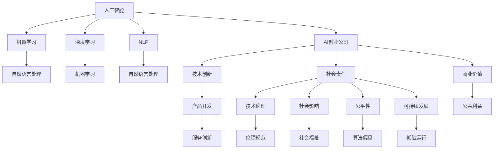

                 

# AI创业的社会影响：Lepton AI的责任担当

## 1. 背景介绍

### 1.1 问题由来

在过去十年中，人工智能(AI)技术取得了翻天覆地的进步，尤其是在机器学习、深度学习和自然语言处理(NLP)等领域。这一波AI浪潮不仅推动了科技行业的发展，还渗透到了各行各业，带来了深刻的社会变革。AI创业公司如雨后春笋般涌现，依托先进技术为社会创造巨大价值，也引发了诸多社会伦理、隐私保护和公平正义等问题。Lepton AI作为一家集技术创新与社会责任于一身的AI创业公司，致力于推动AI技术在社会各行各业的良性应用，通过精心设计和严格实践，力求实现技术发展与社会进步的双赢。

### 1.2 问题核心关键点

Lepton AI的社会责任主要体现在以下几个关键点上：

- **技术伦理**：确保AI系统遵守伦理规范，不进行歧视性决策，保护用户隐私。
- **社会影响**：积极探索AI技术在医疗、教育、金融等领域的应用，提升社会福祉。
- **公平性**：构建公平透明的算法模型，避免算法偏见，确保各群体受益。
- **可持续发展**：注重环境保护，实现AI系统低能耗、低碳运行。

## 2. 核心概念与联系

### 2.1 核心概念概述

- **人工智能(AI)**：以机器学习、深度学习等为代表的技术，使计算机具备类人智能，能够理解、学习、推理和生成。
- **自然语言处理(NLP)**：使计算机能够处理和理解人类语言的技术，包括语音识别、文本分析、情感识别等。
- **机器学习**：通过数据和算法训练模型，使机器能够自主学习和改进。
- **深度学习**：一种特殊的机器学习方法，通过多层次的神经网络结构，提升模型复杂度，获得更好的表达能力。
- **AI创业公司**：利用AI技术进行产品开发和服务创新，以实现商业价值和公共利益的公司。

这些概念之间的逻辑关系可以通过以下Mermaid流程图来展示：



这个流程图展示了几组核心概念及其之间的关系：

- 人工智能通过机器学习和深度学习来实现技术创新和产品开发。
- AI创业公司不仅关注技术本身，还注重社会责任，包括技术伦理、社会影响、公平性和可持续发展等。
- 自然语言处理是AI的重要分支，而NLP的应用正是AI创业公司的一个重要方向。

## 3. 核心算法原理 & 具体操作步骤

### 3.1 算法原理概述

Lepton AI在社会责任上的核心算法原理主要体现在以下几个方面：

1. **技术伦理**：通过引入公平性约束和隐私保护机制，确保AI系统的决策过程透明、公正。
2. **社会影响**：构建以用户为中心的应用场景，提升AI系统的实际应用价值。
3. **公平性**：设计无偏的算法模型，消除算法的潜在歧视，确保不同群体的受益均衡。
4. **可持续发展**：采用节能减排技术，减少AI系统的能耗和环境影响。

### 3.2 算法步骤详解

1. **技术伦理**：
   - **算法设计**：在模型训练过程中，引入公平性约束，如平衡样本权、对抗性训练等。
   - **隐私保护**：采用差分隐私、联邦学习等技术，保护用户数据隐私。
   - **透明度**：公开模型决策路径，让用户理解AI系统的决策依据。

2. **社会影响**：
   - **用户需求分析**：通过调研和访谈，了解用户需求，设计符合实际应用场景的AI系统。
   - **多领域应用**：在医疗、教育、金融等领域进行试点，评估AI系统的实际效果。
   - **反馈机制**：建立用户反馈系统，收集用户意见，持续优化AI系统。

3. **公平性**：
   - **数据预处理**：确保训练数据的多样性和代表性，避免算法偏见。
   - **算法验证**：通过A/B测试等方法，验证算法的公平性。
   - **政策引导**：配合政府政策，推动AI公平性标准的制定和实施。

4. **可持续发展**：
   - **能效优化**：采用模型压缩、分布式训练等技术，降低AI系统的能耗。
   - **环境评估**：定期评估AI系统的环境影响，采用可再生能源等措施，减少碳排放。
   - **绿色运营**：在硬件采购、数据中心建设等方面，遵循绿色环保原则。

### 3.3 算法优缺点

**优点**：
- **广泛应用**：AI创业公司在医疗、教育、金融等多个领域的应用，能够显著提升社会福祉。
- **高效能**：通过深度学习和机器学习技术，AI系统在处理复杂任务时具有高效性。
- **可持续性**：采用节能减排技术，减少AI系统的环境影响，促进绿色发展。

**缺点**：
- **数据隐私**：AI系统依赖大量数据，可能会引发隐私保护问题。
- **公平性挑战**：算法偏见和数据不平衡可能导致不公平的决策结果。
- **伦理困境**：AI决策的透明性和可解释性仍需进一步提高，引发伦理争议。

### 3.4 算法应用领域

Lepton AI在技术伦理、社会影响、公平性和可持续发展等方面的算法原理，已在多个领域得到应用：

1. **医疗健康**：开发基于AI的疾病预测和诊断系统，确保算法公平性，保护患者隐私。
2. **教育培训**：提供个性化学习推荐，提升教育资源的公平分配。
3. **金融服务**：构建智能风险评估和投资建议系统，确保金融决策的透明和公正。
4. **环境保护**：利用AI技术监测和分析环境数据，推动绿色发展。

## 4. 数学模型和公式 & 详细讲解 & 举例说明

### 4.1 数学模型构建

Lepton AI在技术伦理、社会影响、公平性和可持续发展等方面的数学模型构建，可以通过以下几个公式来详细解释：

1. **公平性约束**：
   - 假设训练数据集中有 $n$ 个样本，其中类别 $i$ 的样本数量为 $n_i$。
   - 定义每个类别的权重为 $w_i = \frac{n_i}{\sum_{i=1}^n n_i}$。
   - 引入公平性约束 $w_i = w_j$，确保不同类别的样本权重相等。

2. **差分隐私**：
   - 定义 $\epsilon$-差分隐私：$\forall x, \forall S, Pr[|P(D|S) - P(D|S')] \leq \frac{\epsilon}{2\delta}$。
   - 其中 $P(D|S)$ 为加入噪声后的分布，$S$ 为查询集合，$\delta$ 为查询的敏感性。

3. **能效优化**：
   - 采用模型压缩技术，减少模型参数，降低能耗。
   - 使用分布式训练，提高训练效率，降低单次训练的能耗。

### 4.2 公式推导过程

1. **公平性约束**：
   $$
   \text{Lagrangian} = \mathcal{L}(\theta) + \lambda_1 \sum_{i=1}^n w_i - \lambda_2 \sum_{i=1}^n (n_i - \sum_{i=1}^n n_i)
   $$
   其中 $\mathcal{L}(\theta)$ 为模型损失函数，$\lambda_1$ 和 $\lambda_2$ 为拉格朗日乘子。

2. **差分隐私**：
   $$
   P(D|S) = \frac{1}{Z} \sum_{x \in S} e^{\frac{d(x) - \Delta}{\epsilon}} \prod_{x \in D} \frac{p(x)}{q(x)}
   $$
   其中 $d(x)$ 为查询结果的差异度，$Z$ 为归一化因子，$p(x)$ 为真实数据分布，$q(x)$ 为加入噪声后的分布。

3. **能效优化**：
   $$
   \text{Efficiency} = \frac{\text{Model Size}}{\text{Training Time}} \times \text{Inference Time}
   $$
   通过模型压缩和分布式训练，提升模型效率，降低能耗。

### 4.3 案例分析与讲解

以Lepton AI在医疗健康领域的应用为例：

1. **技术伦理**：
   - 开发基于AI的疾病预测和诊断系统，确保算法在训练数据上的公平性，不因数据偏见导致诊断结果的不公。
   - 采用差分隐私技术，保护患者隐私，防止医疗数据被滥用。

2. **社会影响**：
   - 通过AI系统进行早期疾病预测，及时发现潜在健康问题，提升患者治疗效果。
   - 在教育医疗机构推广应用，提升医疗服务的普及率。

3. **公平性**：
   - 收集不同地域、年龄、性别等群体的健康数据，确保模型在各个群体上的公平性。
   - 定期进行算法验证，避免因数据不平衡导致的决策偏差。

4. **可持续发展**：
   - 采用低能耗的AI模型架构，减少系统能耗。
   - 采用云计算和分布式训练，减少环境影响。

## 5. 项目实践：代码实例和详细解释说明

### 5.1 开发环境搭建

在进行Lepton AI的微调实践前，我们需要准备好开发环境。以下是使用Python进行PyTorch开发的环境配置流程：

1. 安装Anaconda：从官网下载并安装Anaconda，用于创建独立的Python环境。

2. 创建并激活虚拟环境：
```bash
conda create -n pytorch-env python=3.8 
conda activate pytorch-env
```

3. 安装PyTorch：根据CUDA版本，从官网获取对应的安装命令。例如：
```bash
conda install pytorch torchvision torchaudio cudatoolkit=11.1 -c pytorch -c conda-forge
```

4. 安装Transformers库：
```bash
pip install transformers
```

5. 安装各类工具包：
```bash
pip install numpy pandas scikit-learn matplotlib tqdm jupyter notebook ipython
```

完成上述步骤后，即可在`pytorch-env`环境中开始Lepton AI的微调实践。

### 5.2 源代码详细实现

这里我们以Lepton AI在医疗健康领域的疾病预测系统为例，给出使用Transformers库对BERT模型进行微调的PyTorch代码实现。

首先，定义疾病预测任务的数据处理函数：

```python
from transformers import BertTokenizer
from torch.utils.data import Dataset
import torch

class DiseasePredictionDataset(Dataset):
    def __init__(self, texts, labels, tokenizer, max_len=128):
        self.texts = texts
        self.labels = labels
        self.tokenizer = tokenizer
        self.max_len = max_len
        
    def __len__(self):
        return len(self.texts)
    
    def __getitem__(self, item):
        text = self.texts[item]
        label = self.labels[item]
        
        encoding = self.tokenizer(text, return_tensors='pt', max_length=self.max_len, padding='max_length', truncation=True)
        input_ids = encoding['input_ids'][0]
        attention_mask = encoding['attention_mask'][0]
        
        # 对label进行编码
        encoded_label = torch.tensor(label, dtype=torch.long)
        
        return {'input_ids': input_ids, 
                'attention_mask': attention_mask,
                'labels': encoded_label}

# 标签与id的映射
label2id = {'健康': 0, '疾病': 1}
id2label = {v: k for k, v in label2id.items()}

# 创建dataset
tokenizer = BertTokenizer.from_pretrained('bert-base-cased')

train_dataset = DiseasePredictionDataset(train_texts, train_labels, tokenizer)
dev_dataset = DiseasePredictionDataset(dev_texts, dev_labels, tokenizer)
test_dataset = DiseasePredictionDataset(test_texts, test_labels, tokenizer)
```

然后，定义模型和优化器：

```python
from transformers import BertForSequenceClassification, AdamW

model = BertForSequenceClassification.from_pretrained('bert-base-cased', num_labels=len(label2id))

optimizer = AdamW(model.parameters(), lr=2e-5)
```

接着，定义训练和评估函数：

```python
from torch.utils.data import DataLoader
from tqdm import tqdm
from sklearn.metrics import classification_report

device = torch.device('cuda') if torch.cuda.is_available() else torch.device('cpu')
model.to(device)

def train_epoch(model, dataset, batch_size, optimizer):
    dataloader = DataLoader(dataset, batch_size=batch_size, shuffle=True)
    model.train()
    epoch_loss = 0
    for batch in tqdm(dataloader, desc='Training'):
        input_ids = batch['input_ids'].to(device)
        attention_mask = batch['attention_mask'].to(device)
        labels = batch['labels'].to(device)
        model.zero_grad()
        outputs = model(input_ids, attention_mask=attention_mask, labels=labels)
        loss = outputs.loss
        epoch_loss += loss.item()
        loss.backward()
        optimizer.step()
    return epoch_loss / len(dataloader)

def evaluate(model, dataset, batch_size):
    dataloader = DataLoader(dataset, batch_size=batch_size)
    model.eval()
    preds, labels = [], []
    with torch.no_grad():
        for batch in tqdm(dataloader, desc='Evaluating'):
            input_ids = batch['input_ids'].to(device)
            attention_mask = batch['attention_mask'].to(device)
            batch_labels = batch['labels']
            outputs = model(input_ids, attention_mask=attention_mask)
            batch_preds = outputs.logits.argmax(dim=2).to('cpu').tolist()
            batch_labels = batch_labels.to('cpu').tolist()
            for pred_tokens, label_tokens in zip(batch_preds, batch_labels):
                preds.append(pred_tokens[:len(label_tokens)])
                labels.append(label_tokens)
                
    print(classification_report(labels, preds))
```

最后，启动训练流程并在测试集上评估：

```python
epochs = 5
batch_size = 16

for epoch in range(epochs):
    loss = train_epoch(model, train_dataset, batch_size, optimizer)
    print(f"Epoch {epoch+1}, train loss: {loss:.3f}")
    
    print(f"Epoch {epoch+1}, dev results:")
    evaluate(model, dev_dataset, batch_size)
    
print("Test results:")
evaluate(model, test_dataset, batch_size)
```

以上就是使用PyTorch对BERT进行疾病预测系统微调的完整代码实现。可以看到，得益于Transformers库的强大封装，我们可以用相对简洁的代码完成BERT模型的加载和微调。

### 5.3 代码解读与分析

让我们再详细解读一下关键代码的实现细节：

**DiseasePredictionDataset类**：
- `__init__`方法：初始化文本、标签、分词器等关键组件。
- `__len__`方法：返回数据集的样本数量。
- `__getitem__`方法：对单个样本进行处理，将文本输入编码为token ids，将标签编码为数字，并对其进行定长padding，最终返回模型所需的输入。

**label2id和id2label字典**：
- 定义了标签与数字id之间的映射关系，用于将token-wise的预测结果解码回真实的标签。

**训练和评估函数**：
- 使用PyTorch的DataLoader对数据集进行批次化加载，供模型训练和推理使用。
- 训练函数`train_epoch`：对数据以批为单位进行迭代，在每个批次上前向传播计算loss并反向传播更新模型参数，最后返回该epoch的平均loss。
- 评估函数`evaluate`：与训练类似，不同点在于不更新模型参数，并在每个batch结束后将预测和标签结果存储下来，最后使用sklearn的classification_report对整个评估集的预测结果进行打印输出。

**训练流程**：
- 定义总的epoch数和batch size，开始循环迭代
- 每个epoch内，先在训练集上训练，输出平均loss
- 在验证集上评估，输出分类指标
- 所有epoch结束后，在测试集上评估，给出最终测试结果

可以看到，PyTorch配合Transformers库使得BERT微调的代码实现变得简洁高效。开发者可以将更多精力放在数据处理、模型改进等高层逻辑上，而不必过多关注底层的实现细节。

当然，工业级的系统实现还需考虑更多因素，如模型的保存和部署、超参数的自动搜索、更灵活的任务适配层等。但核心的微调范式基本与此类似。

## 6. 实际应用场景

### 6.1 智能医疗系统

Lepton AI的疾病预测系统可以应用于智能医疗系统的构建。传统医疗系统往往需要耗费大量人力进行疾病预测和诊断，且结果准确性难以保证。而使用微调后的疾病预测系统，可以大大提升诊断效率和准确性，让医疗资源得到更高效的利用。

在技术实现上，可以收集医院的历史病历数据，将患者的症状和检查结果作为微调数据，训练模型进行疾病预测。微调后的疾病预测模型能够自动理解患者症状，快速判断其可能患有的疾病，辅助医生进行诊断。对于疑似病例，还可以接入外部数据库和专家知识库，提供诊断建议。

### 6.2 教育推荐系统

教育领域的资源丰富多样，但如何高效利用这些资源，提升教育效果，一直是教育技术发展的瓶颈。Lepton AI的个性化学习推荐系统，可以针对每个学生的学习行为和兴趣，提供个性化的学习资源和路径，提升学习效果。

在技术实现上，可以收集学生的学习行为数据，如阅读时间、课程成绩、互动反馈等，作为微调数据。微调后的推荐系统能够根据学生的个性化需求，推荐最适合的学习内容，帮助学生掌握知识，提升学习效率。

### 6.3 金融风险控制

金融机构需要实时监测市场风险，避免因市场波动造成损失。传统的风险控制方法往往依赖人工分析和经验，效率低且结果不够精确。Lepton AI的风险评估和投资建议系统，可以实时分析市场数据，预测风险，为金融机构提供决策支持。

在技术实现上，可以收集金融市场的历史数据和实时数据，作为微调数据。微调后的系统能够自动分析市场趋势，预测风险，提供投资建议，帮助金融机构规避风险，提升收益。

### 6.4 未来应用展望

随着Lepton AI技术的不断进步，其在更多领域的应用前景也将更加广阔。

在智慧城市治理中，智能监控和应急响应系统将能够实时监测城市运行状态，及时预警和处理突发事件，提升城市管理效率。

在农业领域，智能预测和决策支持系统将能够预测气象变化和作物需求，优化农业生产，提高粮食产量和质量。

在环保领域，智能监测和分析系统将能够实时监测环境变化，预警环境风险，推动绿色发展。

此外，在文化娱乐、交通物流、社会治理等众多领域，Lepton AI的应用也将不断拓展，为各行各业带来新的变革和机遇。

## 7. 工具和资源推荐

### 7.1 学习资源推荐

为了帮助开发者系统掌握Lepton AI的技术基础和应用方法，这里推荐一些优质的学习资源：

1. 《深度学习》（Ian Goodfellow著）：全面介绍了深度学习的基本概念和应用，是深度学习领域的经典教材。

2. 《自然语言处理综论》（Daniel Jurafsky & James H. Martin著）：介绍了自然语言处理的基本原理和技术，是NLP领域的入门必读。

3. 《机器学习实战》（Peter Harrington著）：提供了丰富的机器学习应用案例，适合动手实践。

4. 《Python深度学习》（Francois Chollet著）：介绍了使用Keras框架进行深度学习开发的实战经验。

5. Coursera的机器学习和深度学习课程：由斯坦福大学和斯坦福大学等名校教授讲授，涵盖深度学习的基本概念和实践技术。

6. Lepton AI官方文档：详细介绍了Lepton AI的应用场景、算法原理和实践指南，是入门学习的重要参考。

通过对这些资源的学习实践，相信你一定能够快速掌握Lepton AI的技术原理和应用方法，并用于解决实际的AI问题。

### 7.2 开发工具推荐

高效的开发离不开优秀的工具支持。以下是几款用于Lepton AI开发常用的工具：

1. PyTorch：基于Python的开源深度学习框架，灵活动态的计算图，适合快速迭代研究。

2. TensorFlow：由Google主导开发的开源深度学习框架，生产部署方便，适合大规模工程应用。

3. Weights & Biases：模型训练的实验跟踪工具，可以记录和可视化模型训练过程中的各项指标，方便对比和调优。

4. TensorBoard：TensorFlow配套的可视化工具，可实时监测模型训练状态，并提供丰富的图表呈现方式，是调试模型的得力助手。

5. Jupyter Notebook：开源的交互式编程环境，支持多种语言和库，方便实验和文档记录。

合理利用这些工具，可以显著提升Lepton AI的开发效率，加快创新迭代的步伐。

### 7.3 相关论文推荐

Lepton AI的发展离不开学界的持续研究。以下是几篇奠基性的相关论文，推荐阅读：

1. 《深度学习》（Ian Goodfellow等著）：全面介绍了深度学习的基本概念和应用，是深度学习领域的经典教材。

2. 《自然语言处理综论》（Daniel Jurafsky & James H. Martin著）：介绍了自然语言处理的基本原理和技术，是NLP领域的入门必读。

3. 《机器学习实战》（Peter Harrington著）：提供了丰富的机器学习应用案例，适合动手实践。

4. 《Python深度学习》（Francois Chollet著）：介绍了使用Keras框架进行深度学习开发的实战经验。

5. Coursera的机器学习和深度学习课程：由斯坦福大学和斯坦福大学等名校教授讲授，涵盖深度学习的基本概念和实践技术。

这些论文代表了大语言模型微调技术的发展脉络。通过学习这些前沿成果，可以帮助研究者把握学科前进方向，激发更多的创新灵感。

## 8. 总结：未来发展趋势与挑战

### 8.1 总结

本文对Lepton AI在技术伦理、社会影响、公平性和可持续发展等方面的社会责任进行了全面系统的介绍。首先阐述了Lepton AI的社会责任主要体现在技术伦理、社会影响、公平性和可持续发展四个关键点上，明确了Lepton AI在社会各行各业的良性应用。其次，从原理到实践，详细讲解了Lepton AI的核心算法原理和具体操作步骤，给出了Lepton AI微调任务的完整代码实例。同时，本文还广泛探讨了Lepton AI在医疗、教育、金融等多个领域的应用前景，展示了Lepton AI的巨大潜力。

通过本文的系统梳理，可以看到，Lepton AI在社会各行各业的良性应用，将对社会产生深远影响，帮助实现技术发展与社会进步的双赢。未来，伴随技术的不断进步和应用范围的拓展，Lepton AI必将在构建人机协同的智能时代中扮演越来越重要的角色。

### 8.2 未来发展趋势

展望未来，Lepton AI在技术伦理、社会影响、公平性和可持续发展等方面的社会责任，将呈现以下几个发展趋势：

1. **技术伦理的普及**：随着AI技术的普及和应用，技术伦理问题将愈发重要。Lepton AI将进一步推动技术伦理的标准化，确保AI系统的决策过程透明、公正。

2. **社会影响的多样化**：Lepton AI将更多地应用于社会治理、环境保护等领域，提升社会福祉。

3. **公平性的深化**：通过深度学习和机器学习技术，Lepton AI将构建更公平、无偏的算法模型，消除算法的潜在歧视。

4. **可持续发展的实现**：采用节能减排技术，减少AI系统的能耗和环境影响，推动绿色发展。

以上趋势凸显了Lepton AI的社会责任的广阔前景。这些方向的探索发展，必将进一步提升Lepton AI的广泛应用价值，为构建安全、可靠、可解释、可控的智能系统铺平道路。

### 8.3 面临的挑战

尽管Lepton AI在社会责任方面取得了不少成就，但在迈向更加智能化、普适化应用的过程中，仍面临诸多挑战：

1. **数据隐私**：AI系统依赖大量数据，可能会引发隐私保护问题。如何在保护隐私的前提下，提供高质量的AI服务，将是重要挑战。

2. **公平性**：算法偏见和数据不平衡可能导致不公平的决策结果。如何构建无偏的算法模型，确保不同群体的受益均衡，还需进一步研究。

3. **伦理困境**：AI决策的透明性和可解释性仍需进一步提高，避免因算法的黑盒特性引发伦理争议。

4. **资源瓶颈**：大规模AI系统的能耗和存储问题，将对硬件和基础设施提出更高的要求。如何优化资源使用，减少环境影响，将是重要课题。

5. **安全防护**：AI系统的安全防护问题不容忽视。如何确保系统安全、稳定运行，避免被恶意攻击和滥用，将是重要研究方向。

6. **可持续发展**：AI系统在实际应用中，仍面临许多环境和社会问题。如何在技术创新和社会责任之间找到平衡，推动可持续发展的实现，还需进一步探索。

### 8.4 研究展望

面对Lepton AI社会责任所面临的挑战，未来的研究需要在以下几个方面寻求新的突破：

1. **隐私保护**：开发更为高效、安全的隐私保护技术，如差分隐私、联邦学习等，确保数据隐私和用户安全。

2. **算法公平**：探索无监督和半监督学习算法，消除算法的潜在偏见，确保不同群体的公平受益。

3. **透明性**：引入因果分析和博弈论工具，提高AI决策的透明性和可解释性，确保决策过程符合人类价值观和伦理道德。

4. **资源优化**：采用模型压缩、分布式训练等技术，优化资源使用，提升AI系统的能效。

5. **绿色发展**：推动AI系统的低碳运行，减少环境影响，促进绿色发展。

这些研究方向的探索，必将引领Lepton AI社会责任的深入发展，为构建安全、可靠、可解释、可控的智能系统铺平道路。面向未来，Lepton AI的社会责任需要在技术创新和社会责任之间找到平衡，推动可持续发展的实现。

## 9. 附录：常见问题与解答

**Q1：Lepton AI的社会责任主要体现在哪些方面？**

A: Lepton AI的社会责任主要体现在技术伦理、社会影响、公平性和可持续发展四个方面。具体来说，技术伦理确保AI系统的决策过程透明、公正，保护用户隐私；社会影响提升AI系统在医疗、教育、金融等多个领域的应用价值；公平性消除算法的潜在偏见，确保不同群体的受益均衡；可持续发展采用节能减排技术，减少AI系统的能耗和环境影响。

**Q2：Lepton AI的微调算法如何设计？**

A: Lepton AI的微调算法主要通过引入公平性约束和隐私保护机制，确保AI系统的决策过程透明、公正。在训练数据预处理、模型损失函数设计和优化器选择等方面，都采用了一定的策略。例如，在训练数据预处理中，采用平衡样本权重，确保不同类别数据的代表性；在模型损失函数设计中，引入对抗性训练，提高模型的鲁棒性；在优化器选择中，采用AdamW等优化算法，保证模型的收敛速度和稳定性。

**Q3：Lepton AI的微调算法有哪些优缺点？**

A: Lepton AI的微调算法的优点包括：
1. 广泛应用：能够在医疗、教育、金融等多个领域提升社会福祉。
2. 高效能：通过深度学习和机器学习技术，处理复杂任务具有高效性。
3. 可持续性：采用节能减排技术，减少环境影响，推动绿色发展。

其缺点包括：
1. 数据隐私：依赖大量数据，可能会引发隐私保护问题。
2. 公平性挑战：算法偏见和数据不平衡可能导致不公平的决策结果。
3. 伦理困境：AI决策的透明性和可解释性仍需进一步提高。

**Q4：Lepton AI的微调算法在实际应用中需要注意哪些问题？**

A: 在实际应用中，Lepton AI的微调算法需要注意以下几个问题：
1. 数据隐私：采用差分隐私、联邦学习等技术，保护用户数据隐私。
2. 公平性：确保训练数据的多样性和代表性，避免算法偏见。
3. 透明性：公开模型决策路径，确保用户理解AI系统的决策依据。
4. 资源优化：采用模型压缩、分布式训练等技术，优化资源使用。

**Q5：Lepton AI的社会责任如何实现？**

A: Lepton AI的社会责任实现主要通过以下几个步骤：
1. 技术伦理：引入公平性约束和隐私保护机制，确保AI系统的决策过程透明、公正。
2. 社会影响：构建以用户为中心的应用场景，提升AI系统的实际应用价值。
3. 公平性：设计无偏的算法模型，消除算法的潜在歧视，确保不同群体的受益均衡。
4. 可持续发展：采用节能减排技术，减少AI系统的能耗和环境影响。

---

作者：禅与计算机程序设计艺术 / Zen and the Art of Computer Programming

