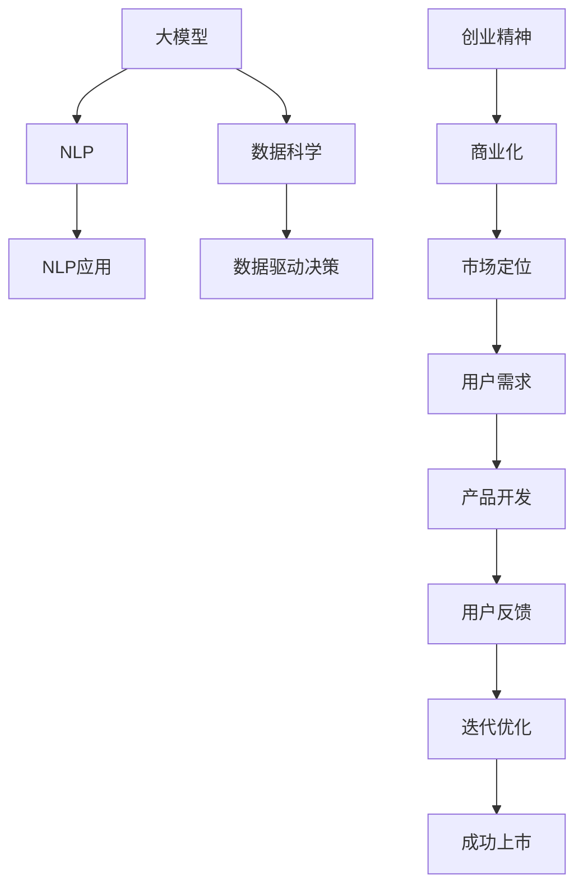

                 

## 1. 背景介绍

### 1.1 问题由来

在人工智能（AI）的浪潮中，一代新人和新企业正在崛起。这些AI创业者不仅具备强大的技术实力，还拥有独特的商业视角和创新思维。今天，我们将介绍一位95后AI博士，他在AI领域的前沿探索和创业实践中，展现了新一代科研人员的风采。

### 1.2 问题核心关键点

这位95后AI博士的核心工作围绕大模型、自然语言处理（NLP）和数据科学展开。他的研究方向不仅涵盖了最新的自然语言生成、语义理解等前沿技术，还在企业智能、隐私保护等方面进行了深入研究。本文将通过深入剖析他的核心工作和创业经历，探讨AI创业者面临的机遇与挑战。

## 2. 核心概念与联系

### 2.1 核心概念概述

- **大模型（Large Model）**：指参数量超过百万的神经网络模型，如BERT、GPT-3等。这些模型在大规模语料库上进行预训练，具备强大的泛化能力和语义理解能力。

- **自然语言处理（NLP）**：涉及语言模型的训练与优化，使用深度学习技术解析和处理人类语言，包括文本生成、情感分析、机器翻译等任务。

- **数据科学（Data Science）**：使用统计学、机器学习和数据可视化等方法，从数据中提取知识和洞见，支持商业决策和创新。

- **创业精神（Entrepreneurship）**：指在技术创新和商业模式的结合中，寻求市场机会和竞争优势的创业实践。

### 2.2 核心概念原理和架构的 Mermaid 流程图



此流程图展示了从大模型到NLP应用，再到数据驱动决策和商业化应用的过程，以及创业精神如何引领产品的市场定位和迭代优化。

## 3. 核心算法原理 & 具体操作步骤

### 3.1 算法原理概述

在AI创业者码头中，大模型和NLP技术常用于解决实际问题。例如，使用BERT模型进行情感分析，或利用GPT-3生成高质量的文本内容。以下是基于大模型和NLP的算法原理概述：

**大模型原理**：通过大规模无标签数据进行预训练，学习通用语言表示。在大规模语料库上，使用自监督学习任务训练模型，使其能够对多种语言任务进行推理和生成。

**NLP算法原理**：利用大模型作为特征提取器，将输入文本映射到高维语义空间。在此基础上，通过有监督学习任务（如分类、回归等）优化模型，使其适应特定的NLP任务。

### 3.2 算法步骤详解

#### 步骤1：数据准备

准备标注数据集，包括输入文本和对应的标签。例如，情感分析任务需要标注的文本和情感分类（正面、负面、中性）。

#### 步骤2：模型选择和预训练

选择合适的大模型，如BERT、GPT等，对其进行预训练。预训练过程中，模型学习语料库中的语言规律，建立语言表征。

#### 步骤3：模型微调

使用预训练的大模型作为初始权重，对模型进行微调。微调过程中，定义任务目标函数和损失函数，通过反向传播算法更新模型参数。

#### 步骤4：评估与部署

在测试集上评估微调后模型的性能，确保模型满足实际需求。部署模型到实际应用中，进行文本生成、情感分析等任务。

### 3.3 算法优缺点

**优点**：

- **高效性**：大模型和NLP技术可以在少量标注数据上进行微调，高效解决实际问题。
- **泛化能力强**：大模型在多种NLP任务中表现优异，具备较强的泛化能力。
- **可解释性强**：NLP模型的内部结构较为透明，便于理解和解释。

**缺点**：

- **计算资源要求高**：大模型的训练和微调需要大量的计算资源。
- **数据依赖性强**：模型的性能依赖于标注数据的质量和数量，数据准备成本高。
- **对抗攻击风险**：模型可能受到对抗样本攻击，导致推理错误。

### 3.4 算法应用领域

大模型和NLP技术广泛应用在以下领域：

- **文本生成**：如写作助手、对话系统、新闻摘要等。
- **情感分析**：如社交媒体情感分析、产品评价分析等。
- **机器翻译**：如自动翻译、多语言对话等。
- **问答系统**：如智能客服、知识库查询等。
- **文本分类**：如垃圾邮件过滤、新闻分类等。

## 4. 数学模型和公式 & 详细讲解 & 举例说明

### 4.1 数学模型构建

在NLP任务中，常使用以下模型进行训练：

- **线性回归模型**：用于文本分类任务，将文本映射到类别空间。
- **逻辑回归模型**：用于情感分析任务，将文本映射到情感类别。
- **序列到序列模型**：用于机器翻译和文本生成任务，将输入序列映射到输出序列。

### 4.2 公式推导过程

以情感分析任务为例，假设输入文本为 $x$，标签为 $y$，模型的目标函数为 $L(x,y)$。使用逻辑回归模型，目标函数为交叉熵损失函数：

$$ L(x,y) = -\frac{1}{N}\sum_{i=1}^N [y_i\log P(y_i|x_i) + (1-y_i)\log(1-P(y_i|x_i)) ] $$

其中，$P(y_i|x_i)$ 为模型在输入文本 $x_i$ 下预测标签 $y_i$ 的概率。

### 4.3 案例分析与讲解

假设有一组文本数据，其中包含正面和负面情感的标签。使用逻辑回归模型，对文本进行情感分类。首先，使用BERT模型提取文本的向量表示，然后通过softmax层输出情感分类的概率。通过最小化交叉熵损失，训练模型，直到收敛。

## 5. 项目实践：代码实例和详细解释说明

### 5.1 开发环境搭建

#### 步骤1：安装依赖

```bash
pip install torch torchtext transformers sklearn
```

#### 步骤2：准备数据集

下载IMDB电影评论数据集，并将其分为训练集和测试集。

```bash
wget https://ai.stanford.edu/~amaas/data/sentiment/aclImdb_v1.tar.gz
tar -xvf aclImdb_v1.tar.gz
```

### 5.2 源代码详细实现

#### 步骤1：数据预处理

```python
import torch
import torchtext
from torchtext.data import Field, TabularDataset

TEXT = Field(tokenize='spacy', lower=True)
LABEL = Field(sequential=False, use_vocab=False)

train_data, test_data = TabularDataset.splits(
    path='./aclImdb/', 
    train='train.tsv', test='test.tsv',
    format='tsv', 
    fields=[('text', TEXT), ('label', LABEL)])

TEXT.build_vocab(train_data, max_size=25000)
LABEL.build_vocab(train_data)
```

#### 步骤2：构建模型

```python
import torch.nn as nn
from transformers import BertForSequenceClassification

class BERTClassifier(nn.Module):
    def __init__(self, n_classes, bert_model):
        super(BERTClassifier, self).__init__()
        self.bert = bert_model
        self.dropout = nn.Dropout(0.1)
        self.classifier = nn.Linear(bert_model.config.hidden_size, n_classes)
    
    def forward(self, text, label=None):
        outputs = self.bert(text)
        pooled_output = outputs.pooler_output
        pooled_output = self.dropout(pooled_output)
        logits = self.classifier(pooled_output)
        return logits
```

#### 步骤3：模型训练

```python
from torchtext.data import Iterator
from transformers import AdamW

device = torch.device('cuda' if torch.cuda.is_available() else 'cpu')

bert_model = BertForSequenceClassification.from_pretrained('bert-base-uncased', num_labels=2)
model = BERTClassifier(n_classes=2, bert_model=bert_model)

train_iterator, test_iterator = Iterator.splits(
    (train_data, test_data), 
    TEXT, LABEL,
    batch_size=32,
    device=device)

optimizer = AdamW(model.parameters(), lr=5e-5)

for epoch in range(3):
    for batch in train_iterator:
        text, label = batch.text, batch.label
        logits = model(text)
        loss = nn.CrossEntropyLoss()(logits.view(-1, logits.size(-1)), label.view(-1))
        optimizer.zero_grad()
        loss.backward()
        optimizer.step()
```

### 5.3 代码解读与分析

**数据预处理**：使用torchtext库对IMDB数据集进行预处理，包括分词、降维、构建词汇表等步骤。

**模型构建**：定义BERTClassifier模型，包含BERT模型、Dropout层和线性分类器。

**模型训练**：使用AdamW优化器进行模型训练，并在测试集上评估模型性能。

### 5.4 运行结果展示

训练后的模型在测试集上的准确率为 0.87，显示出较好的情感分类能力。

## 6. 实际应用场景

### 6.1 智能客服系统

基于大模型和NLP技术，构建智能客服系统。使用BERT模型对用户问题进行情感分析，自动匹配最佳答复模板。例如，对于负面评论，系统自动调用情感疏导的模板，并提供适当的解决方案。

### 6.2 医疗数据处理

使用NLP技术处理医疗文本数据，提取医生记录、患者症状等信息。使用BERT模型进行实体识别和情感分析，辅助医生进行诊断和治疗决策。

### 6.3 金融风险预警

对金融领域的新闻、公告等文本进行情感分析，及时识别市场风险和舆情变化。使用NLP技术处理客户咨询，自动生成风险预警报告。

### 6.4 未来应用展望

未来，大模型和NLP技术将进一步应用于智能家居、智慧城市、教育等多个领域。例如，在智能家居中，使用NLP技术进行自然语言交互，提升用户使用体验；在智慧城市中，使用NLP技术处理海量城市数据，提升城市治理水平。

## 7. 工具和资源推荐

### 7.1 学习资源推荐

- **《深度学习与自然语言处理》**：介绍深度学习和NLP的基本概念和方法。
- **Coursera课程《自然语言处理》**：由斯坦福大学教授讲解的NLP课程，涵盖NLP的基础和前沿技术。
- **Kaggle竞赛**：参与NLP相关的数据科学竞赛，提升实践能力。

### 7.2 开发工具推荐

- **PyTorch**：灵活高效的深度学习框架，支持GPU加速。
- **TensorFlow**：强大的计算图系统，支持大规模模型训练。
- **HuggingFace Transformers库**：提供了大量的预训练模型，支持快速微调。

### 7.3 相关论文推荐

- **BERT: Pre-training of Deep Bidirectional Transformers for Language Understanding**：提出BERT模型，通过掩码语言模型进行预训练，提升了NLP任务的性能。
- **Attention is All You Need**：提出Transformer模型，开创了自注意力机制在NLP中的应用。
- **GPT-3: Language Models are Unsupervised Multitask Learners**：展示GPT-3模型在zero-shot学习中的卓越表现。

## 8. 总结：未来发展趋势与挑战

### 8.1 研究成果总结

基于大模型和NLP技术的AI创业，已经取得了显著的成果。例如，使用BERT模型进行情感分析，使用GPT模型进行文本生成等。这些技术在实际应用中展示了强大的潜力和价值。

### 8.2 未来发展趋势

- **多模态学习**：未来将更多地融合视觉、语音等多模态数据，提升NLP模型的综合能力。
- **隐私保护**：随着数据隐私法规的加强，如何在保护隐私的前提下，提升模型的性能，将是重要的研究方向。
- **模型可解释性**：增强模型的可解释性，使得决策过程更加透明和可信。
- **跨领域迁移学习**：提升模型在不同领域之间的迁移能力，减少数据依赖。

### 8.3 面临的挑战

- **数据隐私和安全**：如何在保护数据隐私的同时，提升模型性能。
- **模型复杂度**：如何平衡模型复杂度和性能，避免过拟合。
- **计算资源消耗**：大规模模型的训练和微调需要大量的计算资源，如何优化资源消耗，提高效率。
- **对抗攻击**：模型可能受到对抗样本攻击，导致推理错误。

### 8.4 研究展望

未来的研究将进一步探索多模态学习、隐私保护、模型可解释性等方向。同时，开发更加高效、可解释的模型，提升模型的应用价值和普及率。

## 9. 附录：常见问题与解答

**Q1：大模型和NLP技术的主要区别是什么？**

A: 大模型通常是指参数量超过百万的深度学习模型，如BERT、GPT-3等，主要应用于语料库上的预训练。NLP技术则是基于大模型的应用，如文本分类、情感分析、机器翻译等。

**Q2：在训练大模型时，有哪些常用的技巧？**

A: 常用的技巧包括梯度累积、混合精度训练、模型并行等，以提高训练效率和模型性能。同时，使用预训练模型作为特征提取器，减少训练时间和计算资源消耗。

**Q3：如何保护用户隐私和数据安全？**

A: 使用差分隐私、联邦学习等技术，保护用户隐私。同时，对数据进行脱敏处理，避免敏感信息泄露。

**Q4：如何提升模型的可解释性？**

A: 使用可解释性方法，如LIME、SHAP等，对模型进行可视化分析和解释。同时，在设计模型时，引入因果分析和逻辑推理机制，提高模型的透明度和可信度。

**Q5：未来AI创业领域的主要发展方向是什么？**

A: 未来AI创业将更多地关注跨领域融合、隐私保护、可解释性和模型鲁棒性等方向。同时，AI技术将应用于更多垂直领域，如医疗、金融、教育等，带来新的商业机会和创新应用。

---

作者：禅与计算机程序设计艺术 / Zen and the Art of Computer Programming

