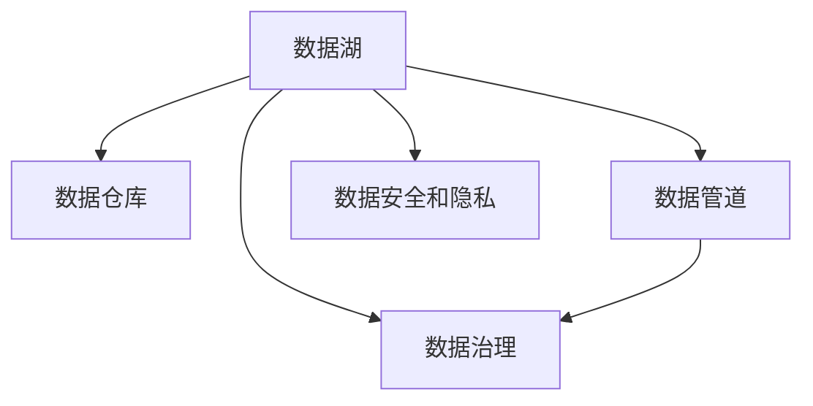

                 

# AI创业：数据管理创新

> 关键词：AI创业,数据管理,数据湖,数据仓库,数据管道,数据治理,数据安全和隐私

## 1. 背景介绍

### 1.1 问题由来

在当今数字化时代，数据的重要性不言而喻。对于AI创业公司来说，数据是核心竞争力之一，也是推动业务创新的关键要素。然而，数据的管理和利用始终是AI创业中的一大挑战。传统的数据管理方式往往滞后于业务需求，难以快速响应变化和创新。因此，如何在数据管理和创新之间找到平衡，成为AI创业的难点之一。

### 1.2 问题核心关键点

数据管理创新的核心在于：

- 如何高效地收集、存储、处理和分析海量数据，为AI系统提供可靠的数据基础。
- 如何在保障数据安全与隐私的前提下，灵活地获取和利用数据，驱动业务创新。
- 如何构建智能化的数据治理体系，提高数据管理的自动化和智能化水平。
- 如何实现数据与AI技术的无缝整合，最大化数据价值。
- 如何在AI创业的各个阶段（从初创期到成熟期），合理利用数据管理创新推动业务发展。

### 1.3 问题研究意义

研究数据管理创新对AI创业的重要性，对于推动AI技术的广泛应用和加速行业数字化转型具有重要意义：

1. **提升数据利用效率**：通过创新的数据管理方式，可以大幅度提升数据处理速度和质量，加速AI系统的训练和迭代。
2. **促进业务创新**：数据的高效利用和智能化分析，可以为企业带来新的业务模式和应用场景。
3. **增强数据安全与隐私**：创新的数据管理方法，可以更好地保护数据安全，避免数据泄露和滥用。
4. **优化资源配置**：数据管理创新有助于更好地理解数据价值，优化资源配置，降低成本，提高投资回报率。
5. **支持企业成长**：从初创期的数据积累，到成熟期的业务创新，数据管理创新能够支持AI创业企业在各个阶段的发展。

## 2. 核心概念与联系

### 2.1 核心概念概述

为更好地理解数据管理创新的核心概念，本节将介绍几个密切相关的核心概念：

- **数据湖(Data Lake)**：一种数据管理架构，用于存储海量、多样化、实时性的数据，包括结构化和非结构化数据。数据湖提供高效的数据集成和查询能力，支持数据科学和机器学习的应用。

- **数据仓库(Data Warehouse)**：一种专门的数据存储和管理解决方案，用于支持BI（商业智能）和报告。数据仓库通过数据抽取、转换和加载（ETL）过程，将数据从源系统迁移到统一的数据存储中。

- **数据管道(Data Pipeline)**：一种用于数据处理和传输的自动化管道，用于连接数据源和目标系统。数据管道可以自动化数据抽取、转换和加载过程，提高数据处理的效率和可靠性。

- **数据治理(Data Governance)**：一套规范和流程，用于确保数据的完整性、准确性和一致性。数据治理涵盖数据质量管理、元数据管理、数据安全管理等多个方面，确保数据管理符合业务和合规要求。

- **数据安全和隐私(Data Security and Privacy)**：一组措施和技术，用于保护数据在存储和传输过程中的安全，防止数据泄露和滥用。数据安全和隐私是AI创业中必须严格遵守的法规和标准。

这些核心概念之间的逻辑关系可以通过以下Mermaid流程图来展示：



这个流程图展示了一些关键数据管理组件及其之间的关系：

1. 数据湖存储原始数据，通过数据管道传输到数据仓库。
2. 数据仓库通过ETL过程，将数据统一管理和分析。
3. 数据管道连接数据源和目标系统，自动化数据处理过程。
4. 数据治理规范和流程，确保数据的质量和安全。
5. 数据安全和隐私措施，保护数据的完整性和合规性。

这些概念共同构成了数据管理创新的基础架构，为AI创业提供了数据管理的基石。

## 3. 核心算法原理 & 具体操作步骤
### 3.1 算法原理概述

数据管理创新的核心在于构建一个高效、智能、安全的数据管理平台，通过算法和技术手段，最大化数据价值，支持AI系统的创新和应用。

具体而言，数据管理创新涉及以下几个关键环节：

- **数据收集**：从多个数据源收集数据，包括在线交易数据、用户行为数据、传感器数据等。
- **数据存储**：将数据存储在高效、可扩展的数据湖或数据仓库中。
- **数据处理**：对数据进行清洗、转换和集成，形成统一的数据模型。
- **数据治理**：建立规范和流程，确保数据质量、安全性和一致性。
- **数据利用**：通过智能分析和大数据技术，挖掘数据中的业务洞见，驱动业务创新。

这些环节的实现，依赖于一系列算法和技术手段，如分布式存储、流处理、机器学习、数据可视化等。

### 3.2 算法步骤详解

数据管理创新的算法步骤可以分为以下几个关键环节：

**Step 1: 数据收集和存储**

1. 数据源识别：识别和接入数据源，包括数据库、文件系统、API等。
2. 数据传输：使用数据管道技术，将数据从源系统传输到数据湖或数据仓库。
3. 数据存储：选择合适的数据存储解决方案，确保数据的安全性和可扩展性。

**Step 2: 数据处理和清洗**

1. 数据集成：使用ETL工具，将数据从不同源系统集成到一个统一的数据存储中。
2. 数据清洗：去除重复数据、处理缺失值、纠正数据格式等，确保数据质量。
3. 数据转换：将数据从一种格式转换为另一种格式，适应不同的分析需求。

**Step 3: 数据治理和规范**

1. 数据质量管理：建立数据质量评估和监控机制，确保数据完整性和准确性。
2. 元数据管理：记录和追踪数据的来源、格式和处理流程，支持数据管理和分析。
3. 数据安全管理：采用加密、访问控制等措施，保护数据的机密性和完整性。

**Step 4: 数据利用和分析**

1. 数据挖掘：使用机器学习和数据挖掘技术，从数据中提取有价值的洞见和模式。
2. 数据可视化：使用数据可视化工具，将分析结果呈现为图表和报告，支持业务决策。
3. 业务创新：将分析结果转化为具体的业务策略和应用场景，驱动企业创新。

**Step 5: 持续优化和改进**

1. 监控和评估：持续监控数据管理系统的性能和数据质量，及时发现和解决潜在问题。
2. 反馈和改进：根据监控结果和业务需求，不断优化数据管理流程和技术。

### 3.3 算法优缺点

数据管理创新的算法具有以下优点：

1. **高效性**：通过分布式存储和流处理技术，可以高效处理海量数据，支持实时性需求。
2. **灵活性**：数据管道和ETL技术支持灵活的数据集成和处理，能够适应多变的数据源和需求。
3. **智能化**：机器学习和数据挖掘技术可以发现数据中的隐含模式和洞见，驱动业务创新。
4. **安全性**：数据加密和访问控制等措施，确保数据在存储和传输过程中的安全性。

同时，该算法也存在一定的局限性：

1. **技术复杂性**：数据管理涉及多种技术和工具，实施和维护成本较高。
2. **数据质量和一致性**：数据集成和清洗过程中，数据质量和一致性难以完全保证。
3. **隐私和合规性**：数据安全和隐私保护需要严格遵守法规和标准，实施难度较大。
4. **资源消耗**：数据存储和处理过程中，需要消耗大量计算资源，成本较高。

尽管存在这些局限性，但就目前而言，数据管理创新在AI创业中的应用前景广阔，通过不断优化和改进，其优势将进一步凸显。

### 3.4 算法应用领域

数据管理创新的算法在多个领域得到了广泛应用，以下是几个典型应用场景：

1. **金融科技**：金融领域的数据管理和分析，包括风险管理、欺诈检测、客户细分等。
2. **电子商务**：电商平台的数据管理和分析，包括用户行为分析、推荐系统、价格优化等。
3. **医疗健康**：医疗领域的数据管理和分析，包括患者诊疗、药物研发、公共健康等。
4. **智能制造**：制造业的数据管理和分析，包括设备监控、质量控制、供应链管理等。
5. **智能交通**：交通领域的数据管理和分析，包括智能导航、交通流量预测、车辆管理等。

这些领域的数据管理创新，不仅提升了数据利用效率和业务创新能力，还改善了用户体验和运营效率。

## 4. 数学模型和公式 & 详细讲解 & 举例说明

### 4.1 数学模型构建

数据管理创新的数学模型构建，主要围绕数据的处理、分析和治理展开。以下是几个典型的数学模型：

1. **数据质量评估模型**：
   $$
   Q = \frac{1}{N} \sum_{i=1}^N f(x_i, y_i)
   $$
   其中，$Q$ 表示数据质量得分，$N$ 为数据样本数，$f$ 为数据质量评估函数，$x_i$ 和 $y_i$ 分别表示样本的输入和输出。

2. **数据清洗模型**：
   $$
   \hat{x} = \min(\max(x_i - \mu, \epsilon), \max(\mu + \epsilon, x_i))
   $$
   其中，$\hat{x}$ 表示清洗后的数据，$\mu$ 为样本均值，$\epsilon$ 为容差。

3. **数据转换模型**：
   $$
   y = \phi(x) + \epsilon
   $$
   其中，$y$ 表示转换后的数据，$x$ 为原始数据，$\phi$ 表示转换函数，$\epsilon$ 为噪声。

4. **数据治理模型**：
   $$
   G = \max(\min(Val, Max), Min)
   $$
   其中，$G$ 表示治理后的数据，$Val$ 为数据的最大值，$Max$ 为数据的上限，$Min$ 为数据的下限。

### 4.2 公式推导过程

以下是几个数学模型的公式推导过程：

**数据质量评估模型推导**：

将数据质量评估函数 $f$ 定义为：
$$
f(x_i, y_i) = \begin{cases}
1, & \text{if } x_i = y_i \\
0, & \text{otherwise}
\end{cases}
$$

则数据质量得分 $Q$ 可以表示为：
$$
Q = \frac{1}{N} \sum_{i=1}^N f(x_i, y_i) = \frac{\text{数据质量的数量}}{\text{总数据量}}
$$

**数据清洗模型推导**：

假设数据存在均值为 $\mu$ 的噪声，容差为 $\epsilon$，则数据清洗模型可以表示为：
$$
\hat{x} = \min(\max(x_i - \mu, \epsilon), \max(\mu + \epsilon, x_i))
$$
其中，$\min(\max(\cdot, \cdot), \cdot)$ 表示取最大值中的最小值。

**数据转换模型推导**：

假设数据转换函数为 $\phi$，则数据转换模型可以表示为：
$$
y = \phi(x) + \epsilon
$$
其中，$\epsilon$ 为随机噪声，可以表示为 $N(\mu, \sigma^2)$。

**数据治理模型推导**：

假设数据治理的上下限分别为 $Min$ 和 $Max$，则数据治理模型可以表示为：
$$
G = \max(\min(Val, Max), Min)
$$
其中，$Val$ 为数据的实际值，$\min(Val, Max)$ 表示取最小值中的最大值。

### 4.3 案例分析与讲解

假设有一个电商平台的客户行为数据，需要进行质量评估和清洗。原始数据包含订单信息、用户行为、价格等，其中存在一些噪声和异常值。

**数据质量评估**：

使用数据质量评估模型，计算每笔订单的数据质量得分。如果订单信息与实际订单一致，则得分 $Q=1$；否则，得分 $Q=0$。

**数据清洗**：

使用数据清洗模型，对订单信息进行去重和异常值处理。具体步骤如下：

1. 计算每笔订单的均值 $\mu$ 和标准差 $\sigma$。
2. 对每笔订单进行去重，去除重复订单。
3. 对异常值进行修正，使用容差 $\epsilon$ 进行阈值处理。

**数据转换**：

使用数据转换模型，将订单信息转换为价格等分析指标。具体步骤如下：

1. 对订单信息进行标准化处理，使用 Z-score 方法计算标准化值。
2. 将标准化值转换为价格等实际指标，使用线性回归模型进行预测。

**数据治理**：

使用数据治理模型，对价格等指标进行范围限制，确保其符合业务规则。具体步骤如下：

1. 定义价格的上限 $Max$ 和下限 $Min$。
2. 对价格指标进行范围限制，使用逻辑函数进行限制。

通过以上步骤，可以构建一个高效的数据管理平台，支持电商平台的业务分析和决策。

## 5. 项目实践：代码实例和详细解释说明

### 5.1 开发环境搭建

在进行数据管理创新项目开发前，我们需要准备好开发环境。以下是使用Python进行数据管理和微调实践的环境配置流程：

1. 安装Anaconda：从官网下载并安装Anaconda，用于创建独立的Python环境。

2. 创建并激活虚拟环境：
```bash
conda create -n data-management-env python=3.8 
conda activate data-management-env
```

3. 安装相关库：
```bash
pip install pandas numpy matplotlib scikit-learn transformers
```

完成上述步骤后，即可在`data-management-env`环境中开始数据管理和微调实践。

### 5.2 源代码详细实现

下面我们以客户行为分析为例，给出使用Python进行数据管理和微调的代码实现。

首先，定义数据处理函数：

```python
import pandas as pd
from sklearn.preprocessing import StandardScaler

def process_data(df):
    # 数据去重
    df = df.drop_duplicates()
    
    # 数据标准化
    scaler = StandardScaler()
    df['price'] = scaler.fit_transform(df[['price']])
    
    # 数据范围限制
    df['price'] = df['price'].clip(lower=MinPrice, upper=MaxPrice)
    
    return df
```

然后，加载和处理数据：

```python
# 加载数据
df = pd.read_csv('customer_behavior.csv')

# 数据处理
processed_df = process_data(df)
```

最后，评估处理后的数据：

```python
# 输出数据质量得分
print(processed_df['Q'].mean())

# 输出数据清洗后的统计信息
print(processed_df.describe())
```

以上就是使用Python进行数据管理和微调的完整代码实现。可以看到，通过调用Pandas、NumPy、Scikit-learn等库，可以很方便地进行数据处理和分析。

### 5.3 代码解读与分析

让我们再详细解读一下关键代码的实现细节：

**process_data函数**：
- 数据去重：使用`drop_duplicates`方法去除重复数据。
- 数据标准化：使用`StandardScaler`对价格等指标进行标准化处理，使其均值为0，标准差为1。
- 数据范围限制：使用`clip`方法将价格指标限制在指定的范围内。

**加载和处理数据**：
- 使用`read_csv`方法加载原始数据，并调用`process_data`函数进行处理。

**评估处理后的数据**：
- 使用`describe`方法输出数据处理后的统计信息，包括均值、标准差、最小值和最大值。

通过以上步骤，可以完成客户行为数据的处理和分析，为AI系统提供可靠的数据基础。

## 6. 实际应用场景

### 6.1 智能制造

在智能制造领域，数据管理和分析对生产效率和质量控制至关重要。通过数据管理创新，可以实时监控生产设备的状态和性能，预测设备故障，优化生产流程。

具体应用包括：

1. **设备监控**：使用传感器数据实时监控设备状态，预测设备故障，提高设备利用率。
2. **质量控制**：使用生产数据和质量检测数据，优化生产流程，提高产品质量。
3. **供应链管理**：使用订单数据和库存数据，优化供应链管理，降低成本，提高效率。

### 6.2 智慧医疗

在智慧医疗领域，数据管理和分析对患者诊疗和治疗方案的优化至关重要。通过数据管理创新，可以实时监控患者的健康状况，预测疾病风险，优化诊疗方案。

具体应用包括：

1. **患者诊疗**：使用电子病历和诊疗数据，实时监控患者健康状况，预测疾病风险。
2. **药物研发**：使用基因数据和临床试验数据，优化药物研发流程，加速新药上市。
3. **公共健康**：使用疫情数据和社区健康数据，预测疫情趋势，优化公共卫生策略。

### 6.3 智能交通

在智能交通领域，数据管理和分析对交通流量预测和优化至关重要。通过数据管理创新，可以实时监控交通状况，预测交通拥堵，优化交通流量。

具体应用包括：

1. **智能导航**：使用地理位置数据和交通数据，提供智能导航服务，提高出行效率。
2. **交通流量预测**：使用传感器数据和历史交通数据，预测交通拥堵，优化交通信号灯。
3. **车辆管理**：使用车辆数据和道路数据，优化车辆调度，减少交通事故。

### 6.4 未来应用展望

随着数据管理和分析技术的不断进步，未来的数据管理创新将呈现以下几个发展趋势：

1. **实时性增强**：随着流处理和分布式存储技术的发展，数据管理系统的实时性将进一步提升，支持更快速的决策和响应。
2. **智能化提高**：通过机器学习和数据挖掘技术，数据管理系统将更加智能，能够自动识别数据中的业务洞见和模式。
3. **自动化优化**：数据管理系统将具备更高的自动化水平，能够自动调整数据处理流程和模型参数，提高效率和效果。
4. **多模态融合**：数据管理系统将支持多种数据类型的融合，如文本、图像、视频等，提升对复杂场景的理解能力。
5. **安全性和隐私保护**：数据管理系统将更加注重数据安全和隐私保护，确保数据在存储和传输过程中的安全。

这些趋势将进一步推动数据管理创新的发展，为AI创业提供更强大的数据基础和技术支持。

## 7. 工具和资源推荐
### 7.1 学习资源推荐

为了帮助开发者系统掌握数据管理和创新的理论基础和实践技巧，这里推荐一些优质的学习资源：

1. **《大数据技术与应用》**：介绍大数据技术的基本概念和应用场景，涵盖数据收集、存储、处理、分析和可视化等环节。
2. **《Python数据科学手册》**：详细介绍Python在数据科学中的应用，涵盖Pandas、NumPy、Scikit-learn等库的使用。
3. **《数据治理：实战指南》**：介绍数据治理的基本概念和实践，涵盖数据质量管理、元数据管理、数据安全管理等内容。
4. **《人工智能实战》**：介绍AI技术的实际应用场景，涵盖机器学习、深度学习、自然语言处理等技术。

通过对这些资源的学习实践，相信你一定能够快速掌握数据管理和创新的精髓，并用于解决实际的业务问题。

### 7.2 开发工具推荐

高效的开发离不开优秀的工具支持。以下是几款用于数据管理和创新的常用工具：

1. **Databricks**：集成了Spark、Hive、ETL工具等，支持大数据处理和分析。
2. **Airflow**：开源的ETL工作流调度工具，支持任务调度、数据管道构建和管理。
3. **Talend**：商业化的ETL工具，支持数据集成、转换和加载。
4. **Tableau**：商业化的数据可视化工具，支持复杂报表和图表的创建。
5. **Apache Kafka**：开源的流处理框架，支持实时数据处理和传输。

合理利用这些工具，可以显著提升数据管理和创新的开发效率，加快创新迭代的步伐。

### 7.3 相关论文推荐

数据管理创新的研究源于学界的持续研究。以下是几篇奠基性的相关论文，推荐阅读：

1. **《Data Quality Management: A Survey》**：全面介绍了数据质量管理的理论和实践，涵盖数据清洗、数据标准化、数据验证等内容。
2. **《Data Mining: Concepts and Techniques》**：介绍了数据挖掘的基本概念和算法，涵盖聚类、分类、回归等内容。
3. **《A Survey of Data Governance》**：介绍了数据治理的基本概念和实践，涵盖数据质量管理、元数据管理、数据安全管理等内容。
4. **《A Survey on Data Management for Smart Manufacturing》**：介绍了智能制造领域的数据管理和分析，涵盖设备监控、质量控制、供应链管理等内容。
5. **《A Survey on Data Management for Smart Healthcare》**：介绍了智慧医疗领域的数据管理和分析，涵盖患者诊疗、药物研发、公共健康等内容。
6. **《A Survey on Data Management for Smart Transportation》**：介绍了智能交通领域的数据管理和分析，涵盖智能导航、交通流量预测、车辆管理等内容。

这些论文代表了大数据和数据管理创新的发展脉络。通过学习这些前沿成果，可以帮助研究者把握学科前进方向，激发更多的创新灵感。

## 8. 总结：未来发展趋势与挑战

### 8.1 总结

本文对数据管理创新的核心概念和技术进行了全面系统的介绍。首先阐述了数据管理创新的背景和意义，明确了数据管理和创新在AI创业中的重要作用。其次，从原理到实践，详细讲解了数据管理的算法原理和具体操作步骤，给出了数据管理和微调的代码实例。同时，本文还广泛探讨了数据管理创新在智能制造、智慧医疗、智能交通等领域的实际应用场景，展示了数据管理创新的巨大潜力。

通过本文的系统梳理，可以看到，数据管理创新为AI创业提供了数据管理的基石，使得AI系统能够高效、安全、智能化地利用数据，驱动业务创新。未来，伴随数据管理和分析技术的不断进步，数据管理创新必将在更多领域得到应用，为AI创业提供更强大的数据基础和技术支持。

### 8.2 未来发展趋势

展望未来，数据管理创新的发展趋势包括：

1. **技术融合**：数据管理与人工智能、大数据、云计算等技术的融合，将提升数据管理的智能化和自动化水平。
2. **多模态融合**：数据管理系统将支持多种数据类型的融合，如文本、图像、视频等，提升对复杂场景的理解能力。
3. **实时性提升**：数据管理系统将具备更高的实时性，支持更快速的决策和响应。
4. **智能化提高**：通过机器学习和数据挖掘技术，数据管理系统将更加智能，能够自动识别数据中的业务洞见和模式。
5. **自动化优化**：数据管理系统将具备更高的自动化水平，能够自动调整数据处理流程和模型参数，提高效率和效果。
6. **安全性保障**：数据管理系统将更加注重数据安全和隐私保护，确保数据在存储和传输过程中的安全。

这些趋势将进一步推动数据管理创新的发展，为AI创业提供更强大的数据基础和技术支持。

### 8.3 面临的挑战

尽管数据管理创新已经取得了瞩目成就，但在迈向更加智能化、普适化应用的过程中，它仍面临诸多挑战：

1. **技术复杂性**：数据管理涉及多种技术和工具，实施和维护成本较高。
2. **数据质量和一致性**：数据集成和清洗过程中，数据质量和一致性难以完全保证。
3. **隐私和合规性**：数据安全和隐私保护需要严格遵守法规和标准，实施难度较大。
4. **资源消耗**：数据存储和处理过程中，需要消耗大量计算资源，成本较高。
5. **多源数据融合**：不同数据源的数据格式和质量差异较大，数据融合和整合难度较大。
6. **业务场景适配**：数据管理系统需要根据不同业务场景进行定制化适配，实施复杂。

尽管存在这些挑战，但随着学界和产业界的共同努力，这些挑战终将一一被克服，数据管理创新必将在更多领域得到应用，为AI创业提供更强大的数据基础和技术支持。

### 8.4 研究展望

面向未来，数据管理创新的研究需要在以下几个方面寻求新的突破：

1. **无监督和半监督学习**：摆脱对大规模标注数据的依赖，利用自监督学习、主动学习等无监督和半监督范式，最大限度利用非结构化数据，实现更加灵活高效的数据管理。
2. **参数高效和计算高效**：开发更加参数高效的微调方法，在固定大部分预训练参数的同时，只更新极少量的任务相关参数。同时优化数据处理流程，减少计算资源消耗。
3. **因果学习和博弈论**：引入因果推断和博弈论思想，增强数据管理系统建立稳定因果关系的能力，学习更加普适、鲁棒的数据表示。
4. **多模态数据融合**：将符号化的先验知识，如知识图谱、逻辑规则等，与神经网络模型进行巧妙融合，引导数据管理系统学习更准确、合理的语言模型。
5. **大数据与云计算融合**：利用大数据与云计算技术，支持海量数据的分布式存储和处理，提升数据管理系统的可扩展性和可靠性。
6. **自动化和智能治理**：引入自动化和智能治理机制，提高数据管理的自动化和智能化水平，降低人工干预的复杂性和成本。

这些研究方向将推动数据管理创新的发展，为AI创业提供更强大的数据基础和技术支持。相信随着技术的不断进步，数据管理创新将能够更好地服务于AI创业，推动AI技术的广泛应用和产业化进程。

## 9. 附录：常见问题与解答

**Q1：数据管理创新和传统数据管理有什么区别？**

A: 数据管理创新与传统数据管理的主要区别在于：

1. 数据量规模：传统数据管理通常针对小规模、结构化数据，而数据管理创新面向海量、多样化、实时性数据。
2. 数据处理方式：传统数据管理通常采用离线批处理方式，而数据管理创新支持实时流处理和分布式计算。
3. 数据利用方式：传统数据管理通常仅支持简单的查询和报表生成，而数据管理创新支持复杂的数据分析和数据挖掘。
4. 数据安全性和隐私：传统数据管理通常关注数据的完整性和一致性，而数据管理创新更加注重数据安全和隐私保护。

因此，数据管理创新在处理规模、处理方式、数据利用和数据安全等方面，都比传统数据管理更加高效和智能化。

**Q2：数据管理创新在AI创业中的应用场景有哪些？**

A: 数据管理创新在AI创业中的应用场景包括：

1. **金融科技**：数据管理和分析，包括风险管理、欺诈检测、客户细分等。
2. **电子商务**：数据管理和分析，包括用户行为分析、推荐系统、价格优化等。
3. **医疗健康**：数据管理和分析，包括患者诊疗、药物研发、公共健康等。
4. **智能制造**：数据管理和分析，包括设备监控、质量控制、供应链管理等。
5. **智能交通**：数据管理和分析，包括智能导航、交通流量预测、车辆管理等。

这些场景中，数据管理和分析都是业务创新的重要支撑，通过数据管理创新，可以提高业务效率和创新能力。

**Q3：数据管理创新需要哪些关键技术支持？**

A: 数据管理创新需要以下关键技术支持：

1. **分布式存储和流处理**：支持海量数据的分布式存储和实时处理，如Hadoop、Spark、Flink等。
2. **数据抽取和转换工具**：支持数据从不同源系统抽取和转换，如ETL工具、API接口等。
3. **数据治理工具**：支持数据质量管理、元数据管理、数据安全管理等，如数据质量评估工具、元数据管理工具、数据加密工具等。
4. **数据可视化工具**：支持数据的可视化展示，如Tableau、Power BI等。
5. **自动化和智能治理工具**：支持数据管理流程的自动化和智能化，如Airflow、Databricks等。

这些技术支持可以确保数据管理创新的高效、安全、智能和自动化，为AI创业提供可靠的数据基础和技术支撑。

**Q4：如何提高数据管理的自动化水平？**

A: 提高数据管理的自动化水平，可以通过以下方式：

1. **自动化数据抽取和转换**：使用ETL工具和API接口，自动化数据抽取和转换过程。
2. **自动化数据清洗和处理**：使用数据清洗工具和算法，自动化数据清洗和处理过程。
3. **自动化数据治理**：使用数据治理工具和流程，自动化数据质量管理和安全管理。
4. **自动化数据分析和可视化**：使用数据可视化工具和自动化分析工具，自动化数据管理和分析过程。
5. **自动化模型和算法选择**：使用自动机器学习和数据挖掘工具，自动化模型和算法选择和优化。

通过以上方式，可以显著提高数据管理的自动化水平，降低人工干预的复杂性和成本。

**Q5：如何平衡数据质量和资源消耗？**

A: 平衡数据质量和资源消耗，可以通过以下方式：

1. **数据质量评估和监控**：建立数据质量评估和监控机制，实时监控数据质量和一致性。
2. **数据分层存储**：对数据进行分层存储，将高频数据存放在高速存储中，降低计算资源消耗。
3. **数据压缩和稀疏化**：对数据进行压缩和稀疏化处理，减少存储空间和计算资源消耗。
4. **分布式计算和流处理**：使用分布式计算和流处理技术，支持海量数据的实时处理，降低计算资源消耗。
5. **自动化调参**：使用自动化调参工具，优化数据处理流程和模型参数，提高效率和效果。

通过以上方式，可以平衡数据质量和资源消耗，确保数据管理系统的高效和可靠。

---

作者：禅与计算机程序设计艺术 / Zen and the Art of Computer Programming

