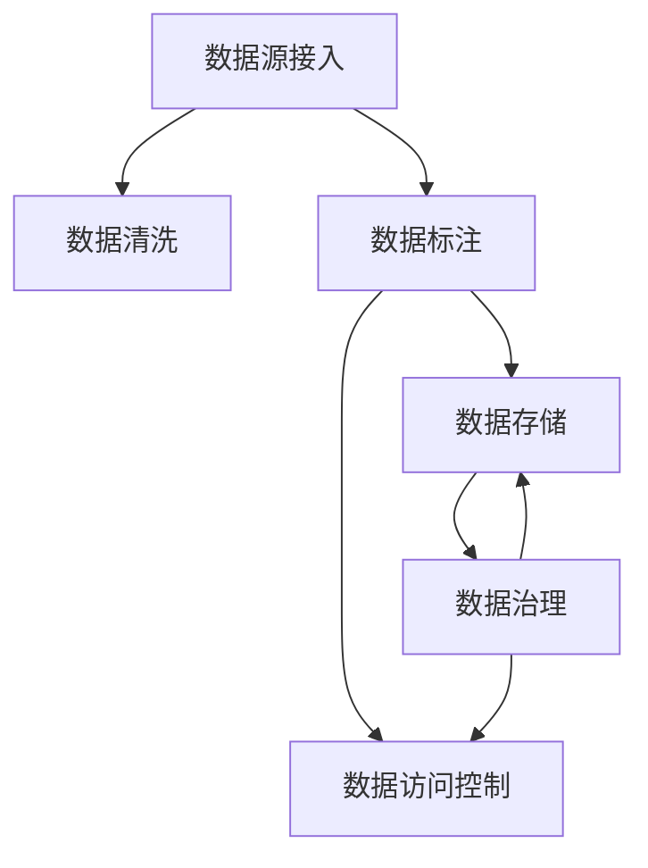

                 

# AI创业：数据管理团队建设

## 1. 背景介绍

### 1.1 问题由来
在AI创业的浪潮中，数据管理成为了技术创新和业务发展的核心驱动力。优质的数据不仅能够提升AI模型的精度，还能带来新的业务洞见和用户价值。然而，数据管理并非易事。数据收集、存储、清洗、标注、调用等环节，均涉及复杂的技术挑战和业务协同。如何在AI创业初期，迅速构建起高效、可靠的数据管理体系，成为了创业者面临的重大问题。

### 1.2 问题核心关键点
数据管理涉及数据链的各个环节，包括数据源接入、数据清洗、数据标注、数据存储、数据访问、数据治理等。这些环节的协同工作，需要强大的技术支持和完善的团队组织。

1. **数据源接入**：如何高效接入各种数据源，构建稳定可靠的数据输入管道。
2. **数据清洗**：如何自动清洗不完整、噪声、重复的数据，保证数据质量。
3. **数据标注**：如何构建高效的标注团队，快速生成高质量标注数据。
4. **数据存储**：如何选择合适的存储方案，构建高效的数据检索与查询体系。
5. **数据访问**：如何设计高性能的数据访问接口，保障数据安全与合规性。
6. **数据治理**：如何建立完善的数据治理机制，确保数据质量、隐私和安全。

### 1.3 问题研究意义
在AI创业初期，高效的数据管理是提升模型性能、降低开发成本、加速产品迭代的关键。良好的数据管理体系，不仅能提升模型的精度，还能为业务提供有力的数据支持，推动产品创新和市场拓展。因此，数据管理团队建设对AI创业的成败至关重要。

## 2. 核心概念与联系

### 2.1 核心概念概述

为了更好地理解数据管理在AI创业中的应用，本节将介绍几个关键概念：

- **数据管理**：涉及数据的全生命周期管理，包括数据收集、存储、清洗、标注、访问、治理等多个环节。
- **数据治理**：通过建立数据标准、数据质量控制、数据权限管理等机制，确保数据的准确性、完整性、一致性。
- **数据标注**：对原始数据进行人工或自动标记，生成可用于模型训练的标注数据。
- **数据清洗**：对原始数据进行去重、降噪、补全等处理，确保数据的质量和一致性。
- **数据访问控制**：根据不同的访问权限，限制对数据的访问和使用，保障数据安全。
- **数据存储**：选择合适的存储方案，如云存储、分布式存储等，确保数据的可扩展性和高效检索。

这些核心概念之间的逻辑关系可以通过以下Mermaid流程图来展示：



这个流程图展示了数据管理的核心环节及其相互关系：

1. 数据源接入作为数据管理的起点，将数据从各个渠道引入系统。
2. 数据清洗对原始数据进行处理，提升数据质量。
3. 数据标注为模型训练生成标签，提供监督信号。
4. 数据存储保存处理后的数据，支持高效查询和检索。
5. 数据访问控制限制数据访问权限，保障数据安全。
6. 数据治理建立标准和机制，确保数据质量。

这些概念共同构成了数据管理的技术框架，为AI创业提供了坚实的基础。

## 3. 核心算法原理 & 具体操作步骤
### 3.1 算法原理概述

数据管理的核心在于构建高效的数据流和数据治理体系。通过选择合适的技术和工具，构建数据处理和治理的自动化流程，提升数据管理的效率和质量。

### 3.2 算法步骤详解

数据管理的技术实现一般包括以下几个关键步骤：

**Step 1: 数据源接入**
- 收集各种数据源，如API接口、数据库、文件、爬虫抓取的数据等。
- 设计并搭建数据接入管道，如ETL（Extract, Transform, Load）流程。
- 使用技术框架如Apache Nifi、AWS Glue等，实现自动化的数据流配置。

**Step 2: 数据清洗**
- 设计数据清洗规则，包括去重、降噪、异常值处理、格式转换等。
- 选择清洗工具，如Apache Airflow、Pandas等，进行批量或实时数据清洗。
- 实施数据质量检测，确保清洗后的数据满足预设标准。

**Step 3: 数据标注**
- 选择标注工具，如Labelbox、Amazon Mechanical Turk等，生成标注数据。
- 设计标注规范，确保标注数据的一致性和准确性。
- 引入自动化标注技术，如深度学习模型，提高标注效率。

**Step 4: 数据存储**
- 选择合适的存储方案，如云存储（AWS S3、Google Cloud Storage）、分布式存储（Hadoop、Spark）等。
- 设计数据存储架构，包括数据分区、备份策略、灾难恢复等。
- 使用数据库技术（如SQL、NoSQL）实现高效的数据检索和查询。

**Step 5: 数据访问控制**
- 设计数据访问权限，设定不同角色和权限。
- 使用技术工具（如AWS IAM、Kubernetes RBAC）实现细粒度的访问控制。
- 实施数据加密和安全传输，确保数据隐私和安全。

**Step 6: 数据治理**
- 建立数据标准和规范，确保数据质量。
- 实施数据质量监控和评估，定期检测数据质量。
- 使用技术工具（如Alation、Informatica）实现数据治理的自动化。

### 3.3 算法优缺点

数据管理的技术方法具有以下优点：
1. 提升数据质量：通过清洗、标注等环节，保证数据的准确性和一致性。
2. 自动化流程：使用ETL工具和自动化技术，提升数据管理的效率和一致性。
3. 灵活接入：支持多种数据源接入方式，灵活构建数据流。
4. 数据安全：通过访问控制和加密技术，保障数据隐私和安全。

同时，数据管理方法也存在一些局限：
1. 依赖高质量数据源：数据源的质量直接影响到数据管理的成果。
2. 技术复杂性：数据清洗、标注等环节涉及复杂的技术实现。
3. 成本投入：数据治理和自动化流程的建设需要一定的技术和人力成本。
4. 数据隐私：数据安全和隐私保护需严格管控，防止数据泄露。

尽管存在这些局限，但数据管理在AI创业中发挥着至关重要的作用，是构建高效AI应用的基础。

### 3.4 算法应用领域

数据管理技术在AI创业中的应用广泛，主要包括以下几个领域：

1. **智能推荐系统**：通过数据清洗和标注，为推荐模型提供高质量的用户行为数据。
2. **金融风控**：通过数据存储和治理，构建高效的数据访问和查询体系，支持风险评估和决策。
3. **自然语言处理**：通过数据标注和清洗，生成高精度的语料库，支持NLP模型的训练和优化。
4. **智慧医疗**：通过数据接入和治理，保障医疗数据的安全和合规，支持医疗研究和临床决策。
5. **智能客服**：通过数据存储和访问控制，构建高效的数据管理系统，提升客户服务体验。
6. **智能制造**：通过数据接入和清洗，提供高质量的生产数据，支持智能制造和工业物联网。

这些领域的数据管理技术，为AI创业提供了丰富的应用场景，推动了人工智能技术在各个行业中的应用。

## 4. 数学模型和公式 & 详细讲解 & 举例说明

### 4.1 数学模型构建

为了更好地理解数据管理的核心算法，本节将通过数学语言对数据管理的核心步骤进行严格刻画。

假设数据管理涉及 $n$ 个数据源，每个数据源包含 $m$ 个字段，数据管理的目标是构建一个高效的数据流，确保数据的质量和一致性。

设 $D$ 为数据源，$E$ 为数据清洗规则，$A$ 为数据标注工具，$S$ 为数据存储方案，$P$ 为数据访问控制策略，$G$ 为数据治理机制。

数据管理的数学模型可以表示为：

$$
\begin{align*}
D &= \{S_1, S_2, ..., S_n\} \\
E &= \{E_1, E_2, ..., E_m\} \\
A &= \{A_1, A_2, ..., A_m\} \\
S &= \{S_1, S_2, ..., S_m\} \\
P &= \{P_1, P_2, ..., P_m\} \\
G &= \{G_1, G_2, ..., G_m\}
\end{align*}
$$

数据管理的流程可以分为数据接入、清洗、标注、存储、访问、治理等环节。每个环节的输入和输出可以表示为：

$$
\begin{align*}
D_{in} &= \{S_1, S_2, ..., S_n\} \\
E_{out} &= \{E_1, E_2, ..., E_m\} \\
A_{out} &= \{A_1, A_2, ..., A_m\} \\
S_{in} &= \{A_{out}\} \\
P_{in} &= \{S_{in}\} \\
G_{in} &= \{P_{in}\}
\end{align*}
$$

其中，$D_{in}$ 为数据源的输入，$E_{out}$ 为数据清洗的输出，$A_{out}$ 为数据标注的输出，$S_{in}$ 为存储的数据，$P_{in}$ 为访问的数据，$G_{in}$ 为治理的数据。

### 4.2 公式推导过程

以下我们以数据标注为例，推导数据标注的数学公式。

假设标注数据集为 $D=\{(x_i,y_i)\}_{i=1}^N$，其中 $x_i$ 为原始数据，$y_i$ 为标注结果。标注模型的训练目标是最小化标注误差，即：

$$
\mathcal{L}(A,D) = \frac{1}{N} \sum_{i=1}^N \ell(A(x_i),y_i)
$$

其中 $\ell$ 为标注损失函数，通常使用交叉熵损失。标注模型的预测结果为 $A(x_i) = [p_{i,1}, p_{i,2}, ..., p_{i,C}]$，其中 $C$ 为分类数。

标注模型的训练过程为：

$$
\theta = \mathop{\arg\min}_{\theta} \mathcal{L}(A_\theta,D)
$$

其中 $A_\theta$ 为标注模型的参数。训练完成后，模型输出结果 $A(x_i)$ 即可作为标注数据。

### 4.3 案例分析与讲解

假设某电商平台的智能推荐系统需要大量的用户行为数据进行训练。平台的数据管理团队通过以下步骤实现了高效的数据标注和清洗：

1. **数据源接入**：通过API接口接入电商平台的用户行为数据。
2. **数据清洗**：使用Pandas库进行数据清洗，去除重复和噪声数据。
3. **数据标注**：使用Amazon Mechanical Turk平台进行标注，标注人员根据平台提供的标注说明，生成用户行为标签。
4. **数据存储**：使用AWS S3存储清洗和标注后的数据。
5. **数据访问控制**：使用AWS IAM实现细粒度的数据访问控制，保障数据安全。
6. **数据治理**：使用Alation工具进行数据治理，确保数据标准和质量。

通过上述步骤，数据管理团队高效地实现了用户行为数据的收集、清洗、标注和存储，为智能推荐模型提供了高质量的数据支持。

## 5. 项目实践：代码实例和详细解释说明
### 5.1 开发环境搭建

在进行数据管理项目实践前，我们需要准备好开发环境。以下是使用Python进行数据管理开发的常见环境配置流程：

1. 安装Anaconda：从官网下载并安装Anaconda，用于创建独立的Python环境。

2. 创建并激活虚拟环境：
```bash
conda create -n data-management python=3.8 
conda activate data-management
```

3. 安装相关Python包：
```bash
pip install pandas numpy matplotlib airflow labelbox
```

4. 安装相关工具包：
```bash
pip install apache-nifi spark-aws boto3 psycopg2
```

5. 安装AWS CLI：
```bash
pip install awscli
```

完成上述步骤后，即可在`data-management`环境中开始数据管理实践。

### 5.2 源代码详细实现

这里我们以数据标注为例，给出使用Labelbox进行数据标注的Python代码实现。

首先，定义数据标注函数：

```python
from labelbox import Labelbox
from labelbox import session
import pandas as pd

# 创建Labelbox会话
session.init(project_id='your_project_id', api_key='your_api_key')

# 定义标注函数
def annotate_data(data_path, output_path):
    # 加载数据
    df = pd.read_csv(data_path)

    # 进行标注
    for index, row in df.iterrows():
        label = session.annotation.create(
            classification=row['classification'],
            tags=row['tags'],
            labels=[row['label']],
            metadata={'meta': row['metadata']},
            x=row['x'],
            y=row['y'],
            confidence=row['confidence']
        )

    # 保存标注结果
    df['label'] = [label.id for label in session.annotations.list()]
    df.to_csv(output_path, index=False)
```

然后，启动数据标注流程：

```python
annotate_data('input_data.csv', 'output_data.csv')
```

以上代码实现了使用Labelbox平台进行数据标注的功能。Labelbox提供了丰富的标注工具和用户界面，能够方便地进行数据标注，支持批量标注和实时标注。

### 5.3 代码解读与分析

让我们再详细解读一下关键代码的实现细节：

**Labelbox使用**：
- 首先，创建Labelbox会话，通过`session.init()`方法登录Labelbox平台，并指定项目ID和API密钥。
- 然后，定义`annotate_data()`函数，用于加载数据并进行标注。函数中通过`session.annotation.create()`方法创建标注，将数据信息与标注结果关联。
- 最后，将标注结果保存到输出文件中，便于后续的数据处理和模型训练。

**数据加载和标注**：
- 使用Pandas库加载输入数据，并进行迭代处理。
- 在每个数据样本上，调用`session.annotation.create()`方法进行标注。标注结果包括分类、标签、元数据等，通过`classification`、`labels`、`metadata`等参数指定。
- 对于标注结果，通过`session.annotations.list()`方法获取所有标注的ID，并保存到数据帧中。

**数据输出**：
- 将标注结果保存为CSV文件，包含数据样本和对应的标注ID。

通过上述代码实现，数据管理团队能够高效地使用Labelbox平台进行数据标注，提升标注质量和效率。

## 6. 实际应用场景
### 6.1 智能推荐系统

在智能推荐系统中，数据管理技术是基础。推荐模型的训练和优化需要高质量的用户行为数据。数据管理团队通过数据源接入、清洗、标注等环节，为推荐模型提供丰富而优质的数据支持。

具体而言，数据管理团队可以：
1. 通过API接口或爬虫技术，接入电商平台的用户行为数据。
2. 使用Pandas、Airflow等工具，进行数据的清洗和预处理，去除重复和噪声数据。
3. 利用Labelbox、Amazon Mechanical Turk等平台，进行用户行为数据的标注。
4. 将清洗和标注后的数据存储在AWS S3等云存储中，支持高效的查询和访问。
5. 使用AWS IAM等工具，进行细粒度的数据访问控制，保障数据安全和隐私。
6. 通过Alation等工具，进行数据治理和质量监控，确保数据的一致性和完整性。

通过这些环节，数据管理团队能够高效地支持推荐模型的训练和优化，提升模型的精度和效果。

### 6.2 金融风控

金融风控系统需要大量的用户数据和交易数据，进行风险评估和决策。数据管理技术能够帮助金融风控系统构建高效的数据管理系统，提升数据质量和安全性。

具体而言，数据管理团队可以：
1. 通过API接口或ETL工具，接入金融机构的各类数据。
2. 使用Pandas、Airflow等工具，进行数据的清洗和预处理，去除异常值和噪声数据。
3. 利用Labelbox、Amazon Mechanical Turk等平台，进行金融数据的标注。
4. 将清洗和标注后的数据存储在云存储中，支持高效的查询和访问。
5. 使用AWS IAM等工具，进行细粒度的数据访问控制，保障数据安全和隐私。
6. 通过Alation等工具，进行数据治理和质量监控，确保数据的一致性和完整性。

通过这些环节，数据管理团队能够高效地支持金融风控系统的构建和优化，提升风险评估的准确性和决策的可靠性。

### 6.3 自然语言处理

自然语言处理(NLP)领域，数据管理技术同样重要。NLP模型的训练和优化需要大量的语料库和标注数据。数据管理团队通过数据源接入、清洗、标注等环节，为NLP模型提供高质量的语料库和标注数据。

具体而言，数据管理团队可以：
1. 通过爬虫或API接口，接入互联网上的语料库数据。
2. 使用Pandas、Airflow等工具，进行数据的清洗和预处理，去除重复和噪声数据。
3. 利用Labelbox、Amazon Mechanical Turk等平台，进行语料库数据的标注。
4. 将清洗和标注后的数据存储在云存储中，支持高效的查询和访问。
5. 使用AWS IAM等工具，进行细粒度的数据访问控制，保障数据安全和隐私。
6. 通过Alation等工具，进行数据治理和质量监控，确保数据的一致性和完整性。

通过这些环节，数据管理团队能够高效地支持NLP模型的训练和优化，提升模型的精度和效果。

## 7. 工具和资源推荐
### 7.1 学习资源推荐

为了帮助开发者系统掌握数据管理的技术基础和实践技巧，这里推荐一些优质的学习资源：

1. **《数据管理：从入门到精通》书籍**：系统介绍数据管理的各个环节和关键技术，适合初学者和进阶者阅读。
2. **《数据治理：原理、实践与案例》课程**：由数据管理领域的专家主讲，深入讲解数据治理的原理和实践方法。
3. **Apache Airflow官方文档**：详细介绍Apache Airflow的使用方法，支持数据流的自动化构建和管理。
4. **AWS数据湖平台官方文档**：详细介绍AWS数据湖平台的各项功能，支持大规模数据管理和分析。
5. **Labelbox官方文档**：详细介绍Labelbox平台的使用方法，支持高效的数据标注和团队协作。

通过对这些资源的学习实践，相信你一定能够快速掌握数据管理的精髓，并用于解决实际的数据管理问题。

### 7.2 开发工具推荐

高效的开发离不开优秀的工具支持。以下是几款用于数据管理开发的常用工具：

1. **Apache Airflow**：开源的工作流编排工具，支持ETL流程的自动化构建和管理。
2. **AWS Glue**：AWS的ETL服务，支持大规模数据流的自动化处理和集成。
3. **Apache Nifi**：开源的数据流处理工具，支持多种数据源和数据流管理。
4. **Labelbox**：高效的数据标注平台，支持多种标注工具和用户界面。
5. **AWS IAM**：AWS的访问管理服务，支持细粒度的数据访问控制。
6. **Alation**：数据治理平台，支持数据标准、数据质量监控和自动化治理。

合理利用这些工具，可以显著提升数据管理的开发效率，加快创新迭代的步伐。

### 7.3 相关论文推荐

数据管理技术的发展源于学界的持续研究。以下是几篇奠基性的相关论文，推荐阅读：

1. **《数据管理：概念与技术》**：由数据管理领域的专家撰写，详细介绍数据管理的概念和技术。
2. **《大规模数据管理系统》**：详细介绍大规模数据管理的体系和实现方法。
3. **《数据标注：原理与实践》**：详细介绍数据标注的原理和实践方法，支持高效的数据标注和团队协作。
4. **《数据治理：理论与实践》**：详细介绍数据治理的理论和实践方法，支持数据质量的监控和治理。

这些论文代表了大数据管理领域的发展脉络。通过学习这些前沿成果，可以帮助研究者把握学科前进方向，激发更多的创新灵感。

## 8. 总结：未来发展趋势与挑战
### 8.1 总结

本文对数据管理在AI创业中的应用进行了全面系统的介绍。首先阐述了数据管理在AI创业中的重要性，明确了数据管理在提升模型性能、降低开发成本、加速产品迭代方面的独特价值。其次，从原理到实践，详细讲解了数据管理的数学原理和关键步骤，给出了数据管理任务开发的完整代码实例。同时，本文还广泛探讨了数据管理技术在智能推荐、金融风控、自然语言处理等多个行业领域的应用前景，展示了数据管理技术的广泛应用潜力。此外，本文精选了数据管理技术的各类学习资源，力求为读者提供全方位的技术指引。

通过本文的系统梳理，可以看到，数据管理技术在AI创业中发挥着至关重要的作用，是构建高效AI应用的基础。未来，数据管理技术还将进一步发展，为AI创业提供更强大的数据支持，推动AI技术的创新和应用。

### 8.2 未来发展趋势

展望未来，数据管理技术将呈现以下几个发展趋势：

1. **自动化和智能化**：随着AI技术的不断进步，数据管理将越来越多地引入自动化和智能化技术，提升数据处理的效率和质量。
2. **大数据和云存储**：大规模数据和云存储技术的发展，将为数据管理提供更强大的数据存储和处理能力。
3. **数据可视化**：数据管理系统的可视化功能将越来越丰富，支持数据流、数据质量、数据治理等方面的可视化展示，提升数据管理的界面友好性。
4. **数据安全与隐私**：数据安全与隐私保护将成为数据管理的重要课题，数据管理技术将更加注重数据安全和隐私保护。
5. **跨领域数据整合**：数据管理将支持跨领域数据整合和融合，提升数据的多样性和丰富性。

以上趋势凸显了数据管理技术的广阔前景。这些方向的探索发展，必将进一步提升数据管理的效率和质量，为AI创业提供更强大的数据支持。

### 8.3 面临的挑战

尽管数据管理技术在AI创业中发挥着重要作用，但在迈向更加智能化、普适化应用的过程中，它仍面临诸多挑战：

1. **数据质量**：数据源的质量直接影响到数据管理的成果，高质量数据源的获取需要大量人力和物力投入。
2. **技术复杂性**：数据清洗、标注等环节涉及复杂的技术实现，需要高水平的技术团队。
3. **成本投入**：数据治理和自动化流程的建设需要一定的技术和人力成本，对中小企业存在一定的门槛。
4. **数据隐私**：数据安全和隐私保护需严格管控，防止数据泄露和滥用。
5. **数据标准化**：不同来源和格式的数据需要标准化，才能有效整合和利用。

这些挑战需要通过技术进步和实践优化，不断克服和改进，才能推动数据管理技术的持续发展。

### 8.4 未来突破

面对数据管理所面临的挑战，未来的研究需要在以下几个方面寻求新的突破：

1. **数据自动化获取**：探索高效的数据自动化获取技术，如自动化数据标注、自动化数据清洗等，降低数据管理的成本和时间。
2. **数据治理自动化**：开发数据治理的自动化工具，支持数据标准化的自动化管理和监控。
3. **数据隐私保护**：引入数据隐私保护技术，如数据匿名化、差分隐私等，提升数据隐私保护水平。
4. **跨领域数据整合**：开发跨领域数据整合技术，支持不同类型数据的有效融合和利用。
5. **数据安全与合规**：建立数据安全和合规机制，保障数据的安全性和合法性。

这些研究方向的研究突破，将进一步提升数据管理的效率和质量，推动数据管理技术的成熟和应用。

## 9. 附录：常见问题与解答

**Q1：如何高效接入各种数据源？**

A: 高效接入数据源的关键在于选择合适的ETL工具和技术框架。可以使用Apache Nifi、AWS Glue等工具，支持多种数据源的自动化接入和管理。同时，需要设计合理的数据接入管道，避免数据丢失和重复。

**Q2：数据清洗和标注的工作流程是怎样的？**

A: 数据清洗和标注的工作流程包括数据收集、数据清洗、数据标注、数据存储等环节。可以使用Pandas、Airflow等工具，进行数据的清洗和标注。同时，需要设计合适的标注规范，确保标注数据的一致性和准确性。

**Q3：如何提升数据治理的效率？**

A: 提升数据治理的效率可以通过引入自动化工具和机制来实现。可以使用Alation等数据治理平台，支持数据标准的自动化管理和监控。同时，需要建立完善的数据治理机制，定期检测数据质量，确保数据的一致性和完整性。

**Q4：数据管理和AI模型之间的协同工作是怎样的？**

A: 数据管理和AI模型之间的协同工作可以通过数据源接入、数据清洗、数据标注、数据存储等环节实现。数据管理团队需要根据AI模型的需求，进行数据流的自动化构建和管理，为AI模型提供高质量的数据支持。

**Q5：数据管理技术在未来会有哪些新的发展趋势？**

A: 数据管理技术未来的发展趋势包括自动化和智能化、大数据和云存储、数据可视化、数据安全和隐私、跨领域数据整合等。这些趋势将推动数据管理技术向更高层次演进，提升数据管理的效率和质量。

通过本文的系统梳理，可以看到，数据管理技术在AI创业中发挥着至关重要的作用，是构建高效AI应用的基础。未来，数据管理技术还将进一步发展，为AI创业提供更强大的数据支持，推动AI技术的创新和应用。

---

作者：禅与计算机程序设计艺术 / Zen and the Art of Computer Programming

