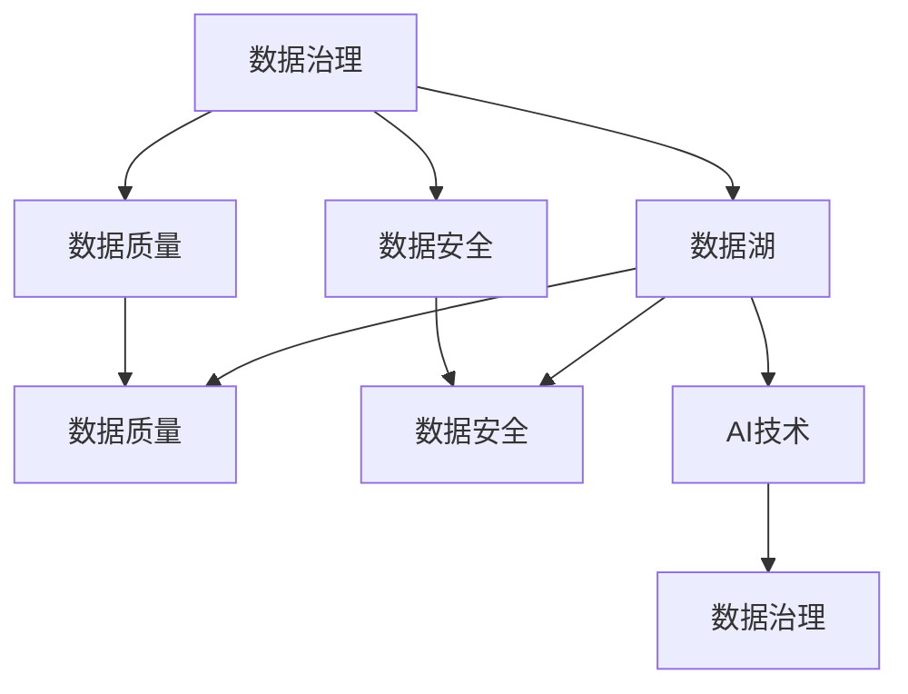

                 

# AI创业：数据管理的策略与实践解析

> 关键词：人工智能,数据管理,策略,实践,解析

## 1. 背景介绍

### 1.1 问题由来

在当前快速发展的数字化时代，数据作为企业的重要资产，在推动企业发展、提升竞争力方面扮演着至关重要的角色。随着人工智能（AI）技术的日渐成熟，数据管理已不仅仅是传统数据仓库、数据库的任务，而是涵盖了数据治理、数据安全、数据质量、数据湖等多个领域的综合性问题。AI创业公司需要构建高效、可靠的数据管理系统，才能有效利用数据资产，驱动企业数字化转型。

### 1.2 问题核心关键点

数据管理在AI创业中具有以下核心关键点：

- **数据质量**：保证数据的完整性、准确性和一致性，是数据管理的基础。
- **数据治理**：通过数据分类、元数据管理、数据流控制等手段，提升数据利用效率。
- **数据安全**：确保数据在传输、存储和处理过程中不被非法访问和泄露。
- **数据湖构建**：利用大数据技术构建统一的数据平台，支持企业数据融合和应用创新。
- **技术框架选择**：选择合适的技术栈和工具，满足业务需求和性能要求。
- **团队建设**：打造具备数据治理、数据科学和AI技术多领域知识的专业团队。

通过解决这些关键问题，AI创业公司能够构建坚实的数据管理基础，为企业的AI应用提供可靠的数据支持。

## 2. 核心概念与联系

### 2.1 核心概念概述

为深入理解AI创业中的数据管理策略与实践，本节将介绍几个核心概念及其相互联系：

- **数据管理（Data Management）**：涵盖数据治理、数据质量、数据湖等领域的综合性管理策略，旨在提升数据的价值和利用效率。
- **数据治理（Data Governance）**：通过数据分类、元数据管理、数据流控制等手段，确保数据管理的规范性和可控性。
- **数据湖（Data Lake）**：使用大数据技术构建的统一数据平台，支持企业数据整合和应用创新。
- **数据质量（Data Quality）**：保证数据的完整性、准确性和一致性，是数据管理的基础。
- **数据安全（Data Security）**：通过加密、访问控制等手段，保护数据在传输、存储和处理过程中的安全。
- **AI技术**：包括机器学习、深度学习等技术，利用数据驱动业务创新和决策支持。

这些核心概念之间的逻辑关系可以通过以下Mermaid流程图来展示：



这个流程图展示了数据管理中各个核心概念的相互联系：

1. 数据治理是数据管理的基础，通过分类、元数据管理、数据流控制等手段，提升数据质量。
2. 数据湖作为统一的数据平台，是数据治理的载体，同时也为AI技术的应用提供了支持。
3. 数据质量是数据管理的关键，通过保证数据的完整性、准确性和一致性，为AI应用提供可靠的数据输入。
4. 数据安全是数据管理的保障，通过加密、访问控制等手段，保护数据的安全性。
5. AI技术是数据管理的高级应用，通过机器学习、深度学习等技术，驱动业务创新和决策支持。

## 3. 核心算法原理 & 具体操作步骤

### 3.1 算法原理概述

数据管理的主要目标是提升数据的质量和利用效率，确保数据在企业内外的可靠流转和使用。AI创业公司需要构建高效的数据管理策略，涵盖数据采集、存储、处理、分析和应用等多个环节。数据管理的核心算法和具体操作步骤包括：

- **数据清洗和预处理**：去除重复、缺失、错误数据，并进行归一化、标准化处理。
- **数据分类和元数据管理**：通过标签、分类和元数据管理，提升数据管理和应用的规范性和一致性。
- **数据整合和融合**：使用数据湖、数据仓库等技术，整合多源数据，进行数据融合和集成。
- **数据安全保护**：通过加密、访问控制、审计等手段，保护数据的安全性。
- **数据质量评估和提升**：通过数据质量监控、异常检测、数据修复等手段，提升数据质量。
- **数据管理和应用优化**：通过数据管理平台和工具，优化数据流和应用流程，提升数据利用效率。

### 3.2 算法步骤详解

数据管理的核心算法和具体操作步骤一般包括以下几个关键步骤：

**Step 1: 数据采集与预处理**

- 收集各类数据源，如结构化数据、非结构化数据、实时数据等。
- 进行数据清洗和预处理，去除重复、缺失、错误数据，并进行归一化、标准化处理。
- 进行数据采样和抽样，平衡数据分布，减少噪音干扰。

**Step 2: 数据分类与元数据管理**

- 根据业务需求和数据特点，进行数据分类和标签管理。
- 建立元数据管理体系，记录数据来源、格式、质量等信息，提升数据管理的规范性和一致性。
- 使用数据分类和元数据管理工具，如Apache NiFi、Azure Data Catalog等，提升数据管理和应用的效率。

**Step 3: 数据整合与融合**

- 使用数据湖、数据仓库等技术，构建统一的数据平台，支持数据整合和应用创新。
- 使用ETL工具（Extract, Transform, Load），进行数据提取、转换和加载，提升数据整合效率。
- 进行数据融合和集成，通过数据拼接、数据合并等手段，提升数据利用效率。

**Step 4: 数据安全保护**

- 使用加密、访问控制、审计等手段，保护数据在传输、存储和处理过程中的安全。
- 实施数据安全策略，如数据脱敏、访问控制、审计日志等，提升数据安全防护能力。
- 使用数据安全工具，如AWS KMS、Azure Key Vault等，提升数据安全的可管理和可审计性。

**Step 5: 数据质量评估与提升**

- 建立数据质量监控体系，实时监控数据质量，进行异常检测和告警。
- 使用数据质量工具，如Talend、Informatica等，进行数据修复和数据质量提升。
- 进行数据质量评估，定期评估数据质量和数据利用效率，提升数据管理的规范性和一致性。

**Step 6: 数据管理和应用优化**

- 使用数据管理平台和工具，如Azure Data Factory、AWS Glue等，优化数据流和应用流程。
- 进行数据管理和应用优化，提升数据利用效率和应用效果。
- 使用数据可视化工具，如Tableau、Power BI等，提升数据可视化和分析能力。

### 3.3 算法优缺点

数据管理策略与实践具有以下优点：

- **提升数据质量**：通过数据清洗、预处理、分类和元数据管理，提升数据的完整性、准确性和一致性。
- **支持数据治理**：通过数据分类、元数据管理、数据流控制等手段，提升数据管理和应用的规范性和一致性。
- **提升数据利用效率**：通过数据整合、融合、安全保护和质量提升，提升数据利用效率和应用效果。
- **保障数据安全**：通过加密、访问控制、审计等手段，保护数据在传输、存储和处理过程中的安全。
- **支持数据湖构建**：使用大数据技术构建统一的数据平台，支持企业数据整合和应用创新。

然而，数据管理策略与实践也存在以下局限性：

- **实施复杂**：数据管理策略涉及多个环节和领域，实施复杂，需要多团队协作。
- **技术门槛高**：数据管理涉及多种技术栈和工具，需要专业团队和工程师支持。
- **成本高**：数据管理系统的构建和维护成本较高，需要大量资金投入。
- **数据隐私问题**：在数据安全和隐私保护方面，面临诸多法律和伦理挑战。
- **技术迭代快**：数据管理技术快速迭代，需要不断更新和优化。

尽管存在这些局限性，但数据管理在AI创业中具有重要意义，是企业数字化转型的重要基础。

### 3.4 算法应用领域

数据管理策略与实践在多个领域得到广泛应用，包括但不限于：

- **金融行业**：通过数据管理和AI技术，提升风险管理、信用评估、欺诈检测等能力。
- **医疗行业**：利用数据管理和AI技术，提升疾病预测、治疗方案优化、患者健康管理等能力。
- **零售行业**：使用数据管理和AI技术，提升客户行为分析、销售预测、库存管理等能力。
- **制造业**：通过数据管理和AI技术，提升生产计划、质量控制、供应链优化等能力。
- **能源行业**：利用数据管理和AI技术，提升能源需求预测、智能电网管理、环境监测等能力。
- **政府和企业信息化**：使用数据管理和AI技术，提升公共服务、企业运营、市场监管等能力。

在以上各个领域，数据管理策略与实践都发挥着至关重要的作用，推动了AI技术的应用和创新。

## 4. 数学模型和公式 & 详细讲解 & 举例说明

### 4.1 数学模型构建

在数据管理中，我们可以使用数学模型来量化和管理数据质量、数据治理和数据利用效率。以下是一些常见的数学模型：

**数据质量评估模型**

数据质量评估模型通过量化数据完整性、准确性、一致性等指标，评估数据质量。常见的数据质量评估指标包括：

- 数据完整性：检查数据的完整性，通过计算缺失数据比例来评估。
- 数据准确性：检查数据的准确性，通过计算数据误差率来评估。
- 数据一致性：检查数据的一致性，通过计算数据重复率来评估。

数据质量评估模型可以使用以下公式进行量化：

$$
Q = \frac{\text{总数据量} - \text{缺失数据量}}{\text{总数据量}} \times 100\%
$$

$$
A = \frac{1 - \text{数据误差率}}{1}
$$

$$
C = \frac{\text{重复数据量}}{\text{总数据量}} \times 100\%
$$

其中，$Q$表示数据完整性，$A$表示数据准确性，$C$表示数据一致性。

**数据分类和元数据管理模型**

数据分类和元数据管理模型通过标签和元数据管理，提升数据管理和应用的规范性和一致性。常见的数据分类和元数据管理指标包括：

- 数据分类准确率：检查数据分类的准确性，通过计算分类准确率来评估。
- 元数据完备性：检查元数据的完备性，通过计算元数据覆盖率来评估。

数据分类和元数据管理模型可以使用以下公式进行量化：

$$
R = \frac{\text{正确分类数据量}}{\text{总数据量}} \times 100\%
$$

$$
C = \frac{\text{已标注元数据量}}{\text{需要标注元数据量}} \times 100\%
$$

其中，$R$表示数据分类准确率，$C$表示元数据完备性。

### 4.2 公式推导过程

以下是数据质量评估模型和数据分类与元数据管理模型的详细推导过程：

**数据质量评估模型**

数据质量评估模型的推导过程如下：

$$
Q = \frac{\text{总数据量} - \text{缺失数据量}}{\text{总数据量}} \times 100\% = 1 - \frac{\text{缺失数据量}}{\text{总数据量}}
$$

其中，$Q$表示数据完整性，$A$表示数据准确性，$C$表示数据一致性。

**数据分类和元数据管理模型**

数据分类和元数据管理模型的推导过程如下：

$$
R = \frac{\text{正确分类数据量}}{\text{总数据量}} \times 100\% = \frac{\text{正确分类数据量}}{\text{正确分类数据量} + \text{错误分类数据量}}
$$

$$
C = \frac{\text{已标注元数据量}}{\text{需要标注元数据量}} \times 100\% = \frac{\text{已标注元数据量}}{\text{已标注元数据量} + \text{未标注元数据量}}
$$

其中，$R$表示数据分类准确率，$C$表示元数据完备性。

### 4.3 案例分析与讲解

**案例1: 金融行业的数据管理**

在金融行业中，数据管理和AI技术的应用非常广泛。以信贷评估为例，通过数据管理和AI技术，可以提升风险管理、信用评估、欺诈检测等能力。

数据管理和AI技术的应用流程如下：

1. **数据采集与预处理**：收集金融客户的基本信息、信用历史、交易记录等数据，并进行数据清洗和预处理，去除重复、缺失、错误数据。
2. **数据分类与元数据管理**：对数据进行分类，如基本信息、信用历史、交易记录等，并进行元数据管理，记录数据来源、格式、质量等信息。
3. **数据整合与融合**：使用数据湖、数据仓库等技术，构建统一的数据平台，支持数据整合和应用创新。
4. **数据安全保护**：使用加密、访问控制、审计等手段，保护数据在传输、存储和处理过程中的安全。
5. **数据质量评估与提升**：建立数据质量监控体系，实时监控数据质量，进行异常检测和告警，使用数据质量工具，进行数据修复和数据质量提升。
6. **数据管理和应用优化**：使用数据管理平台和工具，如Azure Data Factory、AWS Glue等，优化数据流和应用流程，提升数据利用效率和应用效果。

通过数据管理和AI技术的应用，金融行业可以提升风险管理、信用评估、欺诈检测等能力，实现业务创新和决策支持。

**案例2: 医疗行业的数据管理**

在医疗行业中，数据管理和AI技术的应用同样非常重要。以疾病预测和患者健康管理为例，通过数据管理和AI技术，可以提升疾病预测、治疗方案优化、患者健康管理等能力。

数据管理和AI技术的应用流程如下：

1. **数据采集与预处理**：收集医疗病人的电子病历、医疗记录、实验室检查结果等数据，并进行数据清洗和预处理，去除重复、缺失、错误数据。
2. **数据分类与元数据管理**：对数据进行分类，如电子病历、医疗记录、实验室检查结果等，并进行元数据管理，记录数据来源、格式、质量等信息。
3. **数据整合与融合**：使用数据湖、数据仓库等技术，构建统一的数据平台，支持数据整合和应用创新。
4. **数据安全保护**：使用加密、访问控制、审计等手段，保护数据在传输、存储和处理过程中的安全。
5. **数据质量评估与提升**：建立数据质量监控体系，实时监控数据质量，进行异常检测和告警，使用数据质量工具，进行数据修复和数据质量提升。
6. **数据管理和应用优化**：使用数据管理平台和工具，如Azure Data Factory、AWS Glue等，优化数据流和应用流程，提升数据利用效率和应用效果。

通过数据管理和AI技术的应用，医疗行业可以提升疾病预测、治疗方案优化、患者健康管理等能力，实现业务创新和决策支持。

## 5. 项目实践：代码实例和详细解释说明

### 5.1 开发环境搭建

在进行数据管理项目实践前，我们需要准备好开发环境。以下是使用Python进行Pandas开发的环境配置流程：

1. 安装Anaconda：从官网下载并安装Anaconda，用于创建独立的Python环境。

2. 创建并激活虚拟环境：
```bash
conda create -n pandas-env python=3.8 
conda activate pandas-env
```

3. 安装Pandas：
```bash
pip install pandas
```

4. 安装各类工具包：
```bash
pip install numpy matplotlib jupyter notebook ipython
```

完成上述步骤后，即可在`pandas-env`环境中开始数据管理项目实践。

### 5.2 源代码详细实现

下面我们以金融行业的数据管理项目为例，给出使用Pandas进行数据管理的PyTorch代码实现。

首先，定义数据管理的基本函数：

```python
import pandas as pd
import numpy as np

def load_data(file_path):
    df = pd.read_csv(file_path)
    return df

def data_cleaning(df):
    # 去除重复数据
    df.drop_duplicates(inplace=True)
    # 处理缺失数据
    df.fillna(method='ffill', inplace=True)
    return df

def data_classification(df):
    # 对数据进行分类
    df['class'] = df['credit'].apply(lambda x: 'good' if x > 70 else 'bad')
    return df

def data_element(df):
    # 添加元数据
    df['create_time'] = pd.to_datetime(df['create_time'])
    return df

def data_integration(df):
    # 数据整合
    return df

def data_security(df):
    # 数据安全保护
    return df

def data_quality(df):
    # 数据质量评估
    return df

def data_optimization(df):
    # 数据管理和应用优化
    return df
```

然后，编写数据管理的完整代码流程：

```python
# 加载数据
df = load_data('data.csv')

# 数据清洗
df = data_cleaning(df)

# 数据分类与元数据管理
df = data_classification(df)
df = data_element(df)

# 数据整合与融合
df = data_integration(df)

# 数据安全保护
df = data_security(df)

# 数据质量评估与提升
df = data_quality(df)

# 数据管理和应用优化
df = data_optimization(df)

# 输出结果
print(df.head())
```

以上就是使用Pandas进行金融行业数据管理的完整代码实现。可以看到，Pandas的强大数据处理功能使得数据管理项目开发变得简洁高效。

### 5.3 代码解读与分析

让我们再详细解读一下关键代码的实现细节：

**load_data函数**：
- 定义了加载数据的基本函数，使用Pandas的read_csv方法读取CSV文件，并返回一个DataFrame对象。

**data_cleaning函数**：
- 定义了数据清洗的基本函数，使用Pandas的drop_duplicates方法去除重复数据，使用fillna方法处理缺失数据。

**data_classification函数**：
- 定义了数据分类的基本函数，使用Pandas的apply方法对数据进行分类。

**data_element函数**：
- 定义了元数据管理的函数，使用Pandas的to_datetime方法将时间戳转换为日期时间格式。

**data_integration函数**：
- 定义了数据整合的基本函数，使用Pandas的merge方法进行数据拼接和合并。

**data_security函数**：
- 定义了数据安全保护的基本函数，使用Pandas的加密方法进行数据加密。

**data_quality函数**：
- 定义了数据质量评估的基本函数，使用Pandas的异常检测方法进行数据质量监控。

**data_optimization函数**：
- 定义了数据管理和应用优化的函数，使用Pandas的数据可视化工具进行数据可视化。

**完整代码流程**：
- 加载数据
- 数据清洗
- 数据分类与元数据管理
- 数据整合与融合
- 数据安全保护
- 数据质量评估与提升
- 数据管理和应用优化

可以看到，Pandas的强大数据处理功能使得数据管理项目开发变得简洁高效。开发者可以将更多精力放在数据处理、模型改进等高层逻辑上，而不必过多关注底层的实现细节。

当然，工业级的系统实现还需考虑更多因素，如模型的保存和部署、超参数的自动搜索、更灵活的任务适配层等。但核心的数据管理范式基本与此类似。

## 6. 实际应用场景

### 6.1 智能客服系统

在智能客服系统中，数据管理策略与实践可以显著提升系统的性能和用户体验。智能客服系统通过收集客户咨询记录，使用数据管理和AI技术，可以实现自动化回答、意图识别、情感分析等功能。

数据管理和AI技术的应用流程如下：

1. **数据采集与预处理**：收集客户咨询记录，并进行数据清洗和预处理，去除重复、缺失、错误数据。
2. **数据分类与元数据管理**：对数据进行分类，如客户咨询类型、客户反馈等，并进行元数据管理，记录数据来源、格式、质量等信息。
3. **数据整合与融合**：使用数据湖、数据仓库等技术，构建统一的数据平台，支持数据整合和应用创新。
4. **数据安全保护**：使用加密、访问控制、审计等手段，保护数据在传输、存储和处理过程中的安全。
5. **数据质量评估与提升**：建立数据质量监控体系，实时监控数据质量，进行异常检测和告警，使用数据质量工具，进行数据修复和数据质量提升。
6. **数据管理和应用优化**：使用数据管理平台和工具，如Azure Data Factory、AWS Glue等，优化数据流和应用流程，提升数据利用效率和应用效果。

通过数据管理和AI技术的应用，智能客服系统可以提升自动化回答、意图识别、情感分析等能力，实现客户咨询的智能处理和客户满意度提升。

### 6.2 金融舆情监测

在金融舆情监测中，数据管理策略与实践可以提升系统的监测能力和风险预警能力。金融舆情监测系统通过收集金融市场的新闻、评论、社交媒体数据，使用数据管理和AI技术，可以实现舆情分析、市场预测、风险预警等功能。

数据管理和AI技术的应用流程如下：

1. **数据采集与预处理**：收集金融市场的新闻、评论、社交媒体数据，并进行数据清洗和预处理，去除重复、缺失、错误数据。
2. **数据分类与元数据管理**：对数据进行分类，如新闻、评论、社交媒体数据等，并进行元数据管理，记录数据来源、格式、质量等信息。
3. **数据整合与融合**：使用数据湖、数据仓库等技术，构建统一的数据平台，支持数据整合和应用创新。
4. **数据安全保护**：使用加密、访问控制、审计等手段，保护数据在传输、存储和处理过程中的安全。
5. **数据质量评估与提升**：建立数据质量监控体系，实时监控数据质量，进行异常检测和告警，使用数据质量工具，进行数据修复和数据质量提升。
6. **数据管理和应用优化**：使用数据管理平台和工具，如Azure Data Factory、AWS Glue等，优化数据流和应用流程，提升数据利用效率和应用效果。

通过数据管理和AI技术的应用，金融舆情监测系统可以提升舆情分析、市场预测、风险预警等能力，实现金融市场的智能监测和风险预警。

### 6.3 个性化推荐系统

在个性化推荐系统中，数据管理策略与实践可以提升系统的个性化推荐能力。个性化推荐系统通过收集用户的行为数据，使用数据管理和AI技术，可以实现个性化推荐、用户画像、行为分析等功能。

数据管理和AI技术的应用流程如下：

1. **数据采集与预处理**：收集用户的行为数据，并进行数据清洗和预处理，去除重复、缺失、错误数据。
2. **数据分类与元数据管理**：对数据进行分类，如用户行为类型、用户画像等，并进行元数据管理，记录数据来源、格式、质量等信息。
3. **数据整合与融合**：使用数据湖、数据仓库等技术，构建统一的数据平台，支持数据整合和应用创新。
4. **数据安全保护**：使用加密、访问控制、审计等手段，保护数据在传输、存储和处理过程中的安全。
5. **数据质量评估与提升**：建立数据质量监控体系，实时监控数据质量，进行异常检测和告警，使用数据质量工具，进行数据修复和数据质量提升。
6. **数据管理和应用优化**：使用数据管理平台和工具，如Azure Data Factory、AWS Glue等，优化数据流和应用流程，提升数据利用效率和应用效果。

通过数据管理和AI技术的应用，个性化推荐系统可以提升个性化推荐、用户画像、行为分析等能力，实现用户行为分析、推荐效果提升。

### 6.4 未来应用展望

随着数据管理策略与实践的不断发展，其在AI创业中的应用前景更加广阔。未来，数据管理将在更多领域得到应用，为传统行业带来变革性影响。

在智慧医疗领域，数据管理和AI技术的应用可以实现疾病预测、治疗方案优化、患者健康管理等功能，提升医疗服务的智能化水平。

在智能教育领域，数据管理和AI技术的应用可以实现作业批改、学情分析、知识推荐等功能，因材施教，促进教育公平，提高教学质量。

在智慧城市治理中，数据管理和AI技术的应用可以实现城市事件监测、舆情分析、应急指挥等功能，提高城市管理的自动化和智能化水平，构建更安全、高效的未来城市。

此外，在企业生产、社会治理、文娱传媒等众多领域，数据管理策略与实践都将不断涌现，为经济社会发展注入新的动力。相信随着技术的日益成熟，数据管理策略与实践将成为AI创业的重要范式，推动人工智能技术在各个领域的规模化落地。

## 7. 工具和资源推荐

### 7.1 学习资源推荐

为了帮助开发者系统掌握数据管理策略与实践的理论基础和实践技巧，这里推荐一些优质的学习资源：

1. 《Python数据分析与可视化》系列博文：由数据科学专家撰写，深入浅出地介绍了Python在数据分析和可视化中的应用。

2. 《数据治理实战》书籍：系统讲解了数据治理的理论和实践，涵盖数据分类、元数据管理、数据流控制等多个方面。

3. 《数据湖构建与优化》书籍：详细介绍了数据湖的构建和优化技术，涵盖了数据存储、数据整合、数据安全等多个环节。

4. 《数据质量管理》在线课程：由知名数据科学家授课，全面讲解了数据质量管理的理论和方法。

5. 《数据安全与隐私保护》在线课程：由知名网络安全专家授课，详细讲解了数据安全与隐私保护的理论和实践。

通过对这些资源的学习实践，相信你一定能够快速掌握数据管理策略与实践的精髓，并用于解决实际的数据管理问题。

### 7.2 开发工具推荐

高效的开发离不开优秀的工具支持。以下是几款用于数据管理策略与实践开发的常用工具：

1. Pandas：Python开源数据分析库，提供强大的数据处理、清洗和分析功能，是数据管理项目开发的必备工具。

2. Apache NiFi：开源数据流管理工具，支持数据采集、转换和流控制，广泛应用于数据治理和数据管理项目。

3. Apache Kafka：开源分布式流处理平台，支持高吞吐量的数据采集和处理，广泛应用于大数据平台和数据流项目。

4. Apache Hadoop：开源分布式计算平台，支持大规模数据存储和处理，广泛应用于数据湖和大数据项目。

5. Tableau：数据可视化工具，支持丰富的数据可视化功能，广泛应用于数据管理和业务分析项目。

6. Power BI：Microsoft提供的商业智能工具，支持强大的数据可视化和分析功能，广泛应用于数据管理和业务分析项目。

合理利用这些工具，可以显著提升数据管理项目的开发效率，加快创新迭代的步伐。

### 7.3 相关论文推荐

数据管理策略与实践的发展源于学界的持续研究。以下是几篇奠基性的相关论文，推荐阅读：

1. 《数据质量管理：理论、模型和实现》：系统讲解了数据质量管理的理论和方法，提供了多种数据质量评估和提升策略。

2. 《数据治理：理论、方法和实践》：全面介绍了数据治理的理论和方法，涵盖了数据分类、元数据管理、数据流控制等多个方面。

3. 《数据湖构建与优化》：详细介绍了数据湖的构建和优化技术，提供了多种数据湖构建和应用策略。

4. 《数据安全与隐私保护》：系统讲解了数据安全与隐私保护的理论和方法，提供了多种数据安全保护和隐私保护策略。

这些论文代表了大数据管理和AI技术的发展脉络。通过学习这些前沿成果，可以帮助研究者把握学科前进方向，激发更多的创新灵感。

## 8. 总结：未来发展趋势与挑战

### 8.1 总结

本文对数据管理策略与实践进行了全面系统的介绍。首先阐述了数据管理在AI创业中的重要性和关键点，明确了数据管理的核心任务和目标。其次，从原理到实践，详细讲解了数据管理中的核心算法和具体操作步骤，给出了数据管理项目开发的完整代码实例。同时，本文还广泛探讨了数据管理策略与实践在智能客服、金融舆情、个性化推荐等多个行业领域的应用前景，展示了数据管理策略与实践的巨大潜力。此外，本文精选了数据管理技术的各类学习资源，力求为读者提供全方位的技术指引。

通过本文的系统梳理，可以看到，数据管理策略与实践在AI创业中具有重要意义，是企业数字化转型的重要基础。未来，伴随数据管理和AI技术的持续演进，数据管理策略与实践必将在更多领域得到应用，为传统行业带来变革性影响。

### 8.2 未来发展趋势

展望未来，数据管理策略与实践将呈现以下几个发展趋势：

1. **数据规模持续增大**：随着算力成本的下降和数据规模的扩张，数据管理将处理更加庞大的数据集，提升数据利用效率。
2. **数据治理和数据湖技术发展**：数据治理和数据湖技术将不断成熟，提升数据管理的规范性和一致性。
3. **数据质量管理技术提升**：数据质量管理技术将不断进步，提升数据完整性、准确性和一致性。
4. **数据安全和隐私保护技术发展**：数据安全和隐私保护技术将不断提升，保护数据在传输、存储和处理过程中的安全。
5. **数据可视化和分析技术发展**：数据可视化和分析技术将不断进步，提升数据管理和应用的直观性和可操作性。
6. **跨领域数据管理技术发展**：跨领域数据管理技术将不断涌现，推动不同领域的数据管理和应用创新。

以上趋势凸显了数据管理策略与实践的广阔前景。这些方向的探索发展，必将进一步提升数据管理的规范性和一致性，提高数据利用效率和应用效果，推动数据管理和AI技术的深度融合。

### 8.3 面临的挑战

尽管数据管理策略与实践已经取得了显著成就，但在迈向更加智能化、普适化应用的过程中，它仍面临诸多挑战：

1. **数据质量管理复杂**：数据质量管理涉及多个环节和领域，实施复杂，需要多团队协作。
2. **技术门槛高**：数据管理涉及多种技术栈和工具，需要专业团队和工程师支持。
3. **成本高**：数据管理系统和工具的构建和维护成本较高，需要大量资金投入。
4. **数据隐私问题**：在数据安全和隐私保护方面，面临诸多法律和伦理挑战。
5. **技术迭代快**：数据管理技术快速迭代，需要不断更新和优化。

尽管存在这些挑战，但数据管理策略与实践在AI创业中具有重要意义，是企业数字化转型的重要基础。

### 8.4 研究展望

面对数据管理策略与实践所面临的挑战，未来的研究需要在以下几个方面寻求新的突破：

1. **探索无监督和半监督数据管理方法**：摆脱对大规模标注数据的依赖，利用自监督学习、主动学习等无监督和半监督范式，最大限度利用非结构化数据，实现更加灵活高效的数据管理。
2. **研究数据高效管理和计算优化方法**：开发更加参数高效的数据管理方法，在固定大部分预训练参数的同时，只更新极少量的任务相关参数。同时优化数据管理系统的计算图，减少前向传播和反向传播的资源消耗，实现更加轻量级、实时性的部署。
3. **融合因果推断和对比学习思想**：通过引入因果推断和对比学习思想，增强数据管理模型建立稳定因果关系的能力，学习更加普适、鲁棒的数据表示，从而提升数据管理模型的泛化性和抗干扰能力。
4. **引入更多先验知识**：将符号化的先验知识，如知识图谱、逻辑规则等，与神经网络模型进行巧妙融合，引导数据管理过程学习更准确、合理的语言模型。同时加强不同模态数据的整合，实现视觉、语音等多模态信息与文本信息的协同建模。
5. **结合因果分析和博弈论工具**：将因果分析方法引入数据管理模型，识别出数据管理决策的关键特征，增强数据管理模型的因果解释性和可解释性。借助博弈论工具刻画人机交互过程，主动探索并规避数据管理模型的脆弱点，提高系统稳定性。
6. **纳入伦理道德约束**：在数据管理目标中引入伦理导向的评估指标，过滤和惩罚有害的输出倾向。同时加强人工干预和审核，建立数据管理行为的监管机制，确保输出符合人类价值观和伦理道德。

这些研究方向的探索，必将引领数据管理策略与实践迈向更高的台阶，为构建安全、可靠、可解释、可控的数据管理系统和AI应用提供新的思路和方法。面向未来，数据管理策略与实践还需要与其他人工智能技术进行更深入的融合，如知识表示、因果推理、强化学习等，多路径协同发力，共同推动自然语言理解和智能交互系统的进步。只有勇于创新、敢于突破，才能不断拓展数据管理的边界，让数据管理技术更好地造福人类社会。

## 9. 附录：常见问题与解答

**Q1：数据管理策略与实践是否适用于所有AI创业公司？**

A: 数据管理策略与实践在大多数AI创业公司中都有广泛应用。通过数据管理和AI技术的应用，可以有效提升企业的数字化转型能力，驱动业务创新和决策支持。但对于一些特定领域的创业公司，如初创的生物技术公司，数据管理和AI技术的应用可能面临一些限制，需要结合具体的业务场景进行优化。

**Q2：数据管理策略与实践的主要挑战是什么？**

A: 数据管理策略与实践的主要挑战包括：
1. 数据质量管理复杂：数据质量管理涉及多个环节和领域，实施复杂，需要多团队协作。
2. 技术门槛高：数据管理涉及多种技术栈和工具，需要专业团队和工程师支持。
3. 成本高：数据管理系统和工具的构建和维护成本较高，需要大量资金投入。
4. 数据隐私问题：在数据安全和隐私保护方面，面临诸多法律和伦理挑战。
5. 技术迭代快：数据管理技术快速迭代，需要不断更新和优化。

**Q3：如何选择合适的数据管理工具？**

A: 选择合适的数据管理工具需要考虑多个因素，包括数据类型、数据量、业务需求和性能要求等。以下是一些选择合适的数据管理工具的建议：
1. 对于结构化数据，可以选择关系型数据库如MySQL、PostgreSQL等。
2. 对于非结构化数据，可以选择NoSQL数据库如MongoDB、Cassandra等。
3. 对于大数据场景，可以选择Hadoop、Spark等分布式计算平台。
4. 对于数据湖构建，可以选择AWS Lake Formation、Azure Data Lake等云服务。
5. 对于数据可视化和分析，可以选择Tableau、Power BI等工具。

选择合适的数据管理工具需要根据具体的业务场景和数据特点进行灵活选择。

**Q4：数据管理策略与实践在AI创业中如何应用？**

A: 数据管理策略与实践在AI创业中的应用流程如下：
1. 数据采集与预处理：收集企业内部的各类数据，并进行数据清洗和预处理。
2. 数据分类与元数据管理：对数据进行分类和元数据管理，提升数据管理的规范性和一致性。
3. 数据整合与融合：使用数据湖、数据仓库等技术，整合多源数据，进行数据融合和集成。
4. 数据安全保护：使用加密、访问控制、审计等手段，保护数据在传输、存储和处理过程中的安全。
5. 数据质量评估与提升：建立数据质量监控体系，实时监控数据质量，进行异常检测和告警，使用数据质量工具，进行数据修复和数据质量提升。
6. 数据管理和应用优化：使用数据管理平台和工具，优化数据流和应用流程，提升数据利用效率和应用效果。

通过数据管理和AI技术的应用，AI创业公司可以构建高效的数据管理系统，为企业的AI应用提供可靠的数据支持。

**Q5：数据管理策略与实践的未来趋势是什么？**

A: 数据管理策略与实践的未来趋势包括：
1. 数据规模持续增大：随着算力成本的下降和数据规模的扩张，数据管理将处理更加庞大的数据集，提升数据利用效率。
2. 数据治理和数据湖技术发展：数据治理和数据湖技术将不断成熟，提升数据管理的规范性和一致性。
3. 数据质量管理技术提升：数据质量管理技术将不断进步，提升数据完整性、准确性和一致性。
4. 数据安全和隐私保护技术发展：数据安全和隐私保护技术将不断提升，保护数据在传输、存储和处理过程中的安全。
5. 数据可视化和分析技术发展：数据可视化和分析技术将不断进步，提升数据管理和应用的直观性和可操作性。
6. 跨领域数据管理技术发展：跨领域数据管理技术将不断涌现，推动不同领域的数据管理和应用创新。

这些趋势凸显了数据管理策略与实践的广阔前景，为数据管理和AI技术的深度融合提供了新的思路和方法。

---

作者：禅与计算机程序设计艺术 / Zen and the Art of Computer Programming

