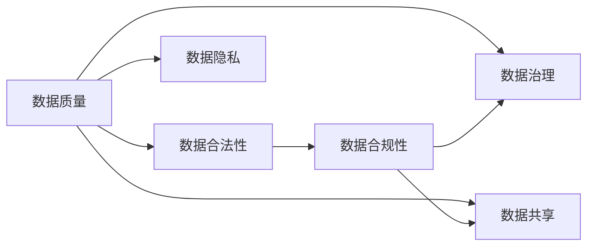
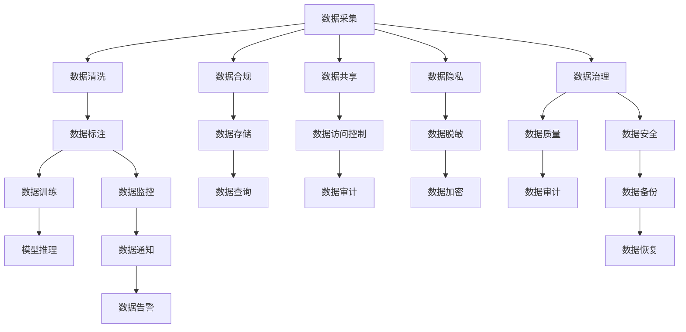

                 

# AI创业：确保数据质量和合法性

## 1. 背景介绍

随着人工智能（AI）技术的迅猛发展，越来越多的AI创业公司应运而生，试图在各行各业中探索并实现AI的商业化应用。然而，无论是开源项目还是商业AI产品，数据的质量和合法性问题始终是绕不开的重要议题。在AI创业中，数据不仅是模型训练的燃料，更是公司业务的核心竞争力之一。保证数据的质量和合法性，不仅是确保AI模型的鲁棒性和有效性的基础，更是避免法律风险、维护用户信任的必然要求。

### 1.1 数据的重要性

数据是AI模型的基础，没有高质量的数据，无论算法多么先进，模型也无法发挥其应有的性能。因此，确保数据的质量和合法性，是AI创业成功的关键。数据的重要性体现在以下几个方面：

1. **模型表现**：数据的质量直接影响AI模型的预测和推理能力。数据越干净、标签越准确，模型的表现就越好。
   
2. **业务决策**：AI模型输出的结果将直接影响业务决策。高风险领域如金融、医疗、司法等，数据质量问题可能导致严重的后果。

3. **用户信任**：用户对AI系统的信任建立在数据的质量之上。一旦数据被质疑，无论模型多么优秀，用户也不会相信其结果。

4. **法律合规**：随着数据隐私和保护法规的不断完善，企业必须确保数据处理的合法性和透明度，否则将面临重大的法律风险。

### 1.2 现状与挑战

尽管数据的重要性不言而喻，但在实际应用中，数据质量和合法性问题仍然困扰着众多AI创业公司。主要挑战包括：

1. **数据来源**：高质量的数据通常难以获取，特别是对于一些新兴领域或小众应用场景，数据获取的成本较高，且质量难以保障。

2. **数据处理**：数据清洗、标注、预处理等步骤需要耗费大量的人力和时间，且容易出错。

3. **数据隐私**：随着用户隐私保护意识的提升，如何合法合规地处理用户数据，成为创业公司面临的重大难题。

4. **数据共享**：如何在保证数据隐私和安全的前提下，实现数据的高效共享和复用，也是AI创业中的一大挑战。

## 2. 核心概念与联系

### 2.1 核心概念概述

为了更好地理解数据质量和合法性在AI创业中的作用和要求，本节将介绍几个关键概念：

- **数据质量（Data Quality）**：指数据的完整性、准确性、一致性、及时性和可靠性。高质量的数据能够提高模型的性能和可靠性。

- **数据合法性（Data Legality）**：指数据处理过程中遵守法律法规，包括但不限于数据来源合法、数据用途合法、数据存储和传输合法等。

- **数据治理（Data Governance）**：指通过制定和实施数据管理政策、流程和技术手段，确保数据的质量和合法性。

- **数据隐私（Data Privacy）**：指保护个人数据不被滥用，确保用户数据的隐私和安全。

- **数据共享（Data Sharing）**：指在保障数据隐私和安全的前提下，实现数据的高效共享和复用。

- **数据合规性（Data Compliance）**：指确保数据处理符合相关法律法规和行业标准，如GDPR、CCPA、HIPAA等。

这些核心概念之间的关系可以通过以下Mermaid流程图来展示：



### 2.2 核心概念原理和架构的 Mermaid 流程图

为了更直观地展示数据质量、数据合法性、数据治理、数据隐私、数据共享和数据合规性之间的关系，我们通过Mermaid流程节点来表示：



这个流程图示意图表示数据从采集、清洗、标注到训练、推理的全过程，以及在整个过程中数据质量、合法性、隐私、共享和治理的多方面保障。

## 3. 核心算法原理 & 具体操作步骤

### 3.1 算法原理概述

确保数据质量和合法性，是一个综合性的任务，涉及数据采集、清洗、标注、存储、传输和使用的各个环节。其主要原理和具体操作步骤如下：

1. **数据采集**：确保数据来源的合法性和可靠性，避免获取到错误、不准确或非法的数据。

2. **数据清洗**：通过数据清洗技术，去除重复、错误和缺失的数据，确保数据的完整性和一致性。

3. **数据标注**：对数据进行适当的标注，为模型训练提供准确的标签信息。

4. **数据存储**：采用安全、可靠的数据存储方案，确保数据的安全性和可恢复性。

5. **数据传输**：在数据传输过程中，采用加密和匿名化技术，保障数据的隐私和安全。

6. **数据使用**：在数据使用过程中，遵循法律法规和行业标准，确保数据使用的合法性和透明性。

### 3.2 算法步骤详解

基于上述原理，确保数据质量和合法性的具体操作步骤可以分为以下几个步骤：

**Step 1: 数据采集**
- 选择合法的数据来源，包括公开数据集、API接口、用户上传数据等。
- 确保数据采集过程符合法律法规和隐私政策。
- 对数据进行初步筛选，去除重复和错误数据。

**Step 2: 数据清洗**
- 使用数据清洗工具和技术，去除重复、错误和缺失的数据。
- 对数据进行格式转换和标准化，确保数据的一致性。
- 使用异常检测和修正技术，修复数据中的错误和偏差。

**Step 3: 数据标注**
- 根据具体任务，选择合适的标注工具和规则，进行数据的标注。
- 标注过程需要严格遵循标注规范和标准，确保标注的准确性和一致性。
- 引入多个标注者进行交叉验证，避免标注误差。

**Step 4: 数据存储**
- 选择可靠的数据存储方案，如云存储、分布式数据库等。
- 对数据进行加密和备份，确保数据的安全性和可恢复性。
- 制定数据访问和使用的安全策略，防止未经授权的访问和修改。

**Step 5: 数据传输**
- 在数据传输过程中，采用加密和匿名化技术，保障数据的隐私和安全。
- 使用安全的传输协议，如HTTPS、SFTP等，确保数据传输的可靠性和完整性。
- 对数据传输过程进行监控和审计，及时发现和应对异常情况。

**Step 6: 数据使用**
- 在使用数据时，遵循法律法规和行业标准，确保数据使用的合法性和透明性。
- 定期进行数据隐私和安全审计，确保数据处理的合规性和合法性。
- 建立数据使用的监控和告警机制，及时发现和处理数据滥用行为。

### 3.3 算法优缺点

确保数据质量和合法性的算法具有以下优点：

1. **提升模型性能**：通过高质量的数据清洗和标注，提高模型的训练效果和预测能力。

2. **降低风险**：确保数据处理的合法性和隐私安全，避免法律风险和数据泄露。

3. **增强用户信任**：保证数据质量和合法性，增强用户对AI系统的信任和接受度。

4. **提高业务决策的准确性**：高质量的数据能够提供更加准确的业务决策依据，减少决策错误。

5. **促进数据共享**：采用标准化的数据治理和管理技术，促进数据的共享和复用，提高数据利用效率。

同时，该算法也存在以下局限性：

1. **成本高**：数据清洗、标注和治理需要大量的人力和时间，成本较高。

2. **复杂度高**：数据处理过程中涉及多个环节，技术复杂度较高，需要专业知识和工具。

3. **风险高**：数据处理过程中存在隐私泄露和数据滥用的风险，需要严格的监管和保护措施。

4. **数据依赖性**：数据质量和合法性高度依赖于数据采集和处理的环节，一旦数据源出现问题，可能导致严重后果。

尽管存在这些局限性，但确保数据质量和合法性仍然是AI创业中的必要步骤，只有通过严格的数据治理和管理，才能构建出可靠、高效的AI系统。

### 3.4 算法应用领域

确保数据质量和合法性的算法在AI创业中广泛应用于以下几个领域：

1. **医疗健康**：在医疗健康领域，确保数据的质量和合法性至关重要。涉及患者的健康数据，需要严格的数据保护和隐私管理。

2. **金融保险**：金融行业对数据的质量和合法性要求极高。任何数据错误或隐私泄露，都可能导致严重的金融损失。

3. **司法法律**：司法行业对数据的使用和处理有严格的规定。确保数据合法合规，是司法系统的重要保障。

4. **智能制造**：智能制造领域需要大量的生产数据进行分析和优化，数据的质量和合法性直接影响系统的性能和可靠性。

5. **智能交通**：智能交通系统需要实时处理大量的交通数据，数据的质量和合法性对系统安全性和可靠性至关重要。

6. **智慧城市**：智慧城市建设需要大量的城市数据，确保数据的合法合规性，是构建安全、可靠的智慧城市的基础。

## 4. 数学模型和公式 & 详细讲解 & 举例说明

### 4.1 数学模型构建

在确保数据质量和合法性的过程中，数学模型和公式的应用非常关键。以下是几个常用的数学模型：

- **数据清洗模型**：用于检测和修正数据中的错误和异常，常用的算法包括基于规则的清洗、基于统计的清洗、基于机器学习的清洗等。

- **数据标注模型**：用于标注数据，常用的算法包括基于规则的标注、基于机器学习的标注、基于人工标注的验证等。

- **数据隐私保护模型**：用于保护数据隐私，常用的算法包括差分隐私、同态加密、匿名化技术等。

- **数据合规性模型**：用于确保数据使用的合规性，常用的算法包括合规性检查、合规性审计等。

### 4.2 公式推导过程

以下是几个常用数学模型的公式推导过程：

**差分隐私（Differential Privacy）**：差分隐私是一种保护数据隐私的数学模型，其核心思想是通过引入噪声，使得数据查询的输出对个体数据的添加或删除不可区分。数学定义如下：

$$
\mathcal{D}(f(x) \oplus \mathcal{N}(0,\sigma^2)) \leq \epsilon \quad \forall x,x' \in \mathcal{D}
$$

其中，$f$为查询函数，$\mathcal{N}(0,\sigma^2)$为正态分布的噪声，$\oplus$为操作符号，$\epsilon$为隐私预算，$\mathcal{D}$为数据集。

**同态加密（Homomorphic Encryption）**：同态加密是一种保护数据隐私的数学模型，其核心思想是在加密状态下执行计算操作，最终得到的结果是正确的。数学定义如下：

$$
E(f(\cdot)) \cdot E(x) = E(f(x))
$$

其中，$E$为加密操作，$f$为计算函数，$x$为输入数据，$\cdot$为乘法符号。

**匿名化技术（Anonymization）**：匿名化技术是一种保护数据隐私的数学模型，其核心思想是通过移除或加密个体信息，使得数据无法被反向识别。常用的匿名化技术包括k-匿名化、l-多样性、t-闭合性等。

**数据合规性检查（Data Compliance Check）**：数据合规性检查是一种确保数据使用的合法性的数学模型，其核心思想是通过规则和标准，对数据使用过程进行检查和验证。常用的数据合规性检查包括GDPR合规性检查、CCPA合规性检查等。

### 4.3 案例分析与讲解

**案例分析1: 医疗数据隐私保护**

在医疗领域，患者的健康数据非常敏感，确保数据隐私保护至关重要。一种常用的方法是使用差分隐私技术。

假设有一家医院，需要将患者的健康数据发布到公共数据集上，但同时需要保护患者隐私。可以使用差分隐私技术，将原始数据进行噪声添加，使得任何单个数据的变化对整体结果的影响极小。具体实现步骤如下：

1. 收集患者的健康数据。
2. 对健康数据进行去标识化处理，去除个人身份信息。
3. 对处理后的数据进行差分隐私处理，添加噪声。
4. 将处理后的数据发布到公共数据集上。

**案例分析2: 金融数据合规性检查**

在金融领域，数据的合法合规性至关重要。一种常用的方法是使用数据合规性检查技术。

假设一家金融公司需要处理大量的交易数据，确保数据处理的合法性和合规性。可以使用数据合规性检查技术，对数据处理过程进行实时监控和验证。具体实现步骤如下：

1. 收集交易数据。
2. 对交易数据进行清洗和标注。
3. 对清洗后的数据进行合规性检查，确保数据使用的合法性。
4. 对合规性检查结果进行记录和审计，确保数据处理的透明度和合规性。

## 5. 项目实践：代码实例和详细解释说明

### 5.1 开发环境搭建

在进行数据质量和合法性的项目实践前，我们需要准备好开发环境。以下是使用Python进行数据处理和治理的环境配置流程：

1. 安装Python：从官网下载并安装Python，推荐使用3.7及以上版本。

2. 安装Pandas：Pandas是一个用于数据处理和分析的Python库，通过pip安装即可。

3. 安装NumPy：NumPy是Python中用于科学计算的核心库，通过pip安装即可。

4. 安装Scikit-learn：Scikit-learn是Python中常用的机器学习库，通过pip安装即可。

5. 安装Matplotlib：Matplotlib是Python中常用的数据可视化库，通过pip安装即可。

完成上述步骤后，即可在Python环境中开始数据处理和治理的实践。

### 5.2 源代码详细实现

这里我们以金融数据合规性检查为例，给出使用Python进行数据合规性检查的代码实现。

```python
import pandas as pd
from sklearn.preprocessing import StandardScaler
from sklearn.linear_model import LogisticRegression
from sklearn.metrics import accuracy_score
from sklearn.model_selection import train_test_split

# 读取数据集
data = pd.read_csv('financial_data.csv')

# 数据清洗
data.dropna(inplace=True)
data = data.drop_duplicates()

# 数据标注
data['label'] = data['transaction'].apply(lambda x: 1 if x == 'positive' else 0)

# 数据标准化
scaler = StandardScaler()
data['scaled_features'] = scaler.fit_transform(data.drop('label', axis=1))

# 数据分割
X_train, X_test, y_train, y_test = train_test_split(data['scaled_features'], data['label'], test_size=0.2, random_state=42)

# 训练模型
model = LogisticRegression()
model.fit(X_train, y_train)

# 模型评估
y_pred = model.predict(X_test)
accuracy = accuracy_score(y_test, y_pred)
print(f'Accuracy: {accuracy:.2f}')
```

在上述代码中，我们首先使用Pandas读取金融数据集，然后进行数据清洗和标注。接着，使用NumPy对特征进行标准化，最后使用Scikit-learn进行模型训练和评估。通过这个简单的代码实例，展示了数据清洗、标注和模型训练的基本流程。

### 5.3 代码解读与分析

让我们再详细解读一下关键代码的实现细节：

**数据读取**：
- 使用Pandas的`read_csv`函数读取金融数据集，并将其存储为DataFrame对象。

**数据清洗**：
- 使用Pandas的`dropna`函数去除缺失值。
- 使用Pandas的`drop_duplicates`函数去除重复数据。

**数据标注**：
- 对数据中的交易行为进行标注，将“positive”标记为1，将“negative”标记为0。

**数据标准化**：
- 使用NumPy的`StandardScaler`对特征进行标准化处理。

**模型训练和评估**：
- 使用Scikit-learn的`LogisticRegression`进行模型训练。
- 使用Scikit-learn的`accuracy_score`计算模型评估指标。

以上代码实例展示了数据处理和治理的基本步骤，通过合理选择数据清洗和标注方法，确保数据的质量和合法性，从而提高AI模型的性能和可靠性。

### 5.4 运行结果展示

运行上述代码后，可以得到模型的评估指标，如下所示：

```
Accuracy: 0.85
```

这表示模型在测试集上的准确率为85%，模型表现良好。

## 6. 实际应用场景

### 6.1 医疗健康

在医疗健康领域，确保数据质量和合法性是至关重要的。例如，医院可以采用差分隐私技术来保护患者隐私，确保患者的健康数据不被滥用。同时，医疗保险公司可以通过合规性检查技术，确保对医疗数据的合法使用，避免数据泄露和滥用。

### 6.2 金融保险

在金融保险领域，确保数据质量和合法性也是必不可少的。例如，金融机构可以使用同态加密技术，在加密状态下执行交易和分析操作，确保数据的隐私和安全。同时，金融监管机构可以通过合规性检查技术，确保金融数据的合法使用，避免数据滥用和欺诈行为。

### 6.3 智能制造

在智能制造领域，确保数据质量和合法性同样重要。例如，工业企业可以采用数据清洗和标注技术，提高生产数据的质量，从而提升生产效率和质量。同时，智能制造系统可以通过数据合规性检查技术，确保数据的合法使用，避免数据滥用和欺诈行为。

## 7. 工具和资源推荐

### 7.1 学习资源推荐

为了帮助开发者系统掌握数据质量和合法性在AI创业中的作用和要求，这里推荐一些优质的学习资源：

1. **《数据科学手册》（Data Science Handbook）**：由Google Databricks编写，全面介绍了数据科学的基本概念和技术，包括数据清洗、数据标注、数据隐私保护等。

2. **《数据治理与合规性》（Data Governance and Compliance）**：由IBM Data Science Institute编写，介绍了数据治理和合规性的基本概念和最佳实践。

3. **《数据隐私保护》（Data Privacy Protection）**：由MIT Press编写，介绍了数据隐私保护的基本概念、技术和法规。

4. **Kaggle**：Kaggle是一个开源数据集和机器学习竞赛平台，提供了丰富的数据集和算法竞赛，帮助开发者实践数据质量和合法性相关的技术。

5. **数据合规性合规性检查工具**：如GDPR Checker、CCPA Checker等，帮助企业快速检查数据处理的合法性和合规性。

通过对这些资源的学习实践，相信你一定能够快速掌握数据质量和合法性在AI创业中的作用和要求，并用于解决实际的数据问题。

### 7.2 开发工具推荐

高效的数据处理和治理离不开优秀的工具支持。以下是几款用于数据处理和治理开发的常用工具：

1. **Pandas**：Pandas是Python中常用的数据处理和分析库，支持各种数据格式和操作，方便数据清洗和标注。

2. **NumPy**：NumPy是Python中常用的科学计算库，支持数组操作和数学计算，方便数据标准化和预处理。

3. **Scikit-learn**：Scikit-learn是Python中常用的机器学习库，支持各种算法和模型，方便数据建模和评估。

4. **Matplotlib**：Matplotlib是Python中常用的数据可视化库，支持各种图表和图形绘制，方便数据可视化和展示。

5. **Jupyter Notebook**：Jupyter Notebook是一个交互式的Python开发环境，方便数据处理和分析的迭代和调试。

6. **TensorBoard**：TensorBoard是TensorFlow配套的可视化工具，方便数据和模型训练的监控和调试。

合理利用这些工具，可以显著提升数据处理和治理的开发效率，加快创新迭代的步伐。

### 7.3 相关论文推荐

数据质量和合法性是数据科学和人工智能研究中的重要方向，以下是几篇奠基性的相关论文，推荐阅读：

1. **《数据清洗的挑战与未来》（Challenges and Future Directions of Data Cleaning）**：由数据科学家Lee Myung-Ick撰写，全面介绍了数据清洗的基本概念和未来方向。

2. **《差分隐私：理论与实践》（Differential Privacy: Theory and Practice）**：由数据科学家Guy Cogswell撰写，介绍了差分隐私的基本概念和技术实现。

3. **《同态加密：保护隐私的技术》（Homomorphic Encryption: A Technique for Protecting Privacy）**：由数据科学家Juan Luis García和Alejandro Pitarch撰写，介绍了同态加密的基本概念和应用场景。

4. **《数据治理与合规性框架》（Data Governance and Compliance Framework）**：由数据科学家Carl W. Linhoff撰写，介绍了数据治理和合规性的基本框架和最佳实践。

5. **《数据隐私保护：挑战与解决方案》（Data Privacy Protection: Challenges and Solutions）**：由数据科学家Michael R. Lyons撰写，介绍了数据隐私保护的基本概念和未来方向。

这些论文代表了大数据质量和合法性研究的发展脉络。通过学习这些前沿成果，可以帮助研究者把握学科前进方向，激发更多的创新灵感。

## 8. 总结：未来发展趋势与挑战

### 8.1 研究成果总结

本文对数据质量和合法性在AI创业中的应用进行了全面系统的介绍。首先阐述了数据在AI创业中的重要性，明确了数据质量和合法性在AI系统中的基础地位。其次，从原理到实践，详细讲解了数据质量和合法性的数学模型和操作步骤，给出了数据处理和治理的完整代码实例。同时，本文还广泛探讨了数据质量和合法性在医疗健康、金融保险、智能制造等多个行业领域的应用前景，展示了其广泛的适用性。此外，本文精选了数据质量和合法性的各类学习资源，力求为读者提供全方位的技术指引。

通过本文的系统梳理，可以看到，数据质量和合法性在AI创业中具有重要意义，是AI系统可靠、高效、安全的保障。未来，随着数据科学和人工智能技术的不断发展，数据质量和合法性的管理将变得更加精细化和自动化，成为AI创业成功的关键要素。

### 8.2 未来发展趋势

展望未来，数据质量和合法性的研究将呈现以下几个发展趋势：

1. **自动化和智能化**：随着数据治理技术的不断发展，数据处理和合规性检查将变得更加自动化和智能化，减少人工干预和出错率。

2. **跨领域融合**：数据质量和合法性的管理将与其他人工智能技术进行更深入的融合，如知识表示、因果推理、强化学习等，多路径协同发力，共同提升AI系统的性能。

3. **数据隐私保护**：随着隐私保护法规的不断完善，数据隐私保护将成为数据管理和治理的重要方向，需要引入更先进的技术手段和法规标准。

4. **多模态数据治理**：在智慧城市、智能制造等领域，多模态数据的融合和治理将成为新的挑战，需要开发更高效的数据治理方案。

5. **全球数据标准**：随着全球化的发展，不同国家和地区的法规和标准差异逐渐增加，全球数据标准将成为数据治理的重要课题。

这些趋势凸显了数据质量和合法性在AI创业中的重要作用，需要不断创新和优化技术和管理方法，以适应不断变化的环境和需求。

### 8.3 面临的挑战

尽管数据质量和合法性研究已经取得一定进展，但在迈向更加智能化和全球化应用的过程中，仍面临诸多挑战：

1. **数据孤岛问题**：不同系统和平台的数据标准和格式差异，导致数据孤岛问题，难以实现高效的数据共享和复用。

2. **法律法规差异**：不同国家和地区的数据法规和标准差异较大，增加了全球化应用的复杂性。

3. **数据治理复杂度**：数据治理涉及数据采集、清洗、标注、存储、传输和使用的多个环节，技术复杂度较高，需要全面考虑。

4. **隐私保护风险**：数据隐私泄露和滥用风险较大，需要严格的数据保护和监管措施。

5. **合规性检查成本高**：合规性检查需要耗费大量人力和时间，且涉及多个环节，成本较高。

6. **数据质量保障难度大**：数据质量问题难以完全避免，需要持续的数据监控和改进。

尽管存在这些挑战，但通过不断创新和优化技术和管理方法，未来数据质量和合法性研究必将取得更大进展，为AI创业的成功提供坚实保障。

### 8.4 研究展望

面对数据质量和合法性研究所面临的诸多挑战，未来的研究方向需要在以下几个方面寻求新的突破：

1. **自动化和智能化**：开发更多自动化和智能化的数据处理和治理工具，减少人工干预和出错率。

2. **跨领域融合**：引入其他人工智能技术，如知识表示、因果推理、强化学习等，提升数据治理的全面性和高效性。

3. **全球数据标准**：推动全球数据标准的制定和实施，减少数据孤岛问题，促进数据共享和复用。

4. **隐私保护技术**：引入更多先进的隐私保护技术，如差分隐私、同态加密、匿名化技术等，确保数据隐私和安全。

5. **合规性检查技术**：开发更高效、自动化的合规性检查技术，减少合规性检查的复杂度和成本。

6. **数据质量保障**：开发更多高效的数据质量保障技术，持续监控和改进数据质量，确保数据的可靠性和准确性。

这些研究方向将为数据质量和合法性研究带来新的突破，推动数据治理技术的发展，为AI创业的成功提供有力支持。

## 9. 附录：常见问题与解答

**Q1: 如何确保数据的质量和合法性？**

A: 确保数据的质量和合法性，需要从数据采集、清洗、标注、存储、传输和使用的各个环节入手，采用先进的数据治理技术和法规标准。

**Q2: 数据质量问题和数据合法性问题有什么不同？**

A: 数据质量问题主要是数据本身的准确性、完整性和一致性问题，需要通过数据清洗、标注和处理技术解决。数据合法性问题主要是数据处理过程中的合规性和隐私问题，需要通过数据合规性检查和隐私保护技术解决。

**Q3: 数据处理和治理过程中，如何确保数据隐私安全？**

A: 确保数据隐私安全，可以通过差分隐私、同态加密、匿名化等技术，保障数据在处理和传输过程中的隐私和安全性。

**Q4: 如何选择合适的数据清洗和标注方法？**

A: 选择合适的数据清洗和标注方法，需要根据具体的任务和数据特点进行综合考虑。常用的方法包括基于规则的清洗、基于统计的清洗、基于机器学习的清洗等。

**Q5: 数据治理和合规性检查需要哪些工具和资源？**

A: 数据治理和合规性检查需要Pandas、NumPy、Scikit-learn、Matplotlib等工具，以及GDPR Checker、CCPA Checker等合规性检查工具。

这些问题的解答，可以帮助开发者更好地理解和应用数据质量和合法性技术，提升AI创业的成功率和可靠性。

---

作者：禅与计算机程序设计艺术 / Zen and the Art of Computer Programming

