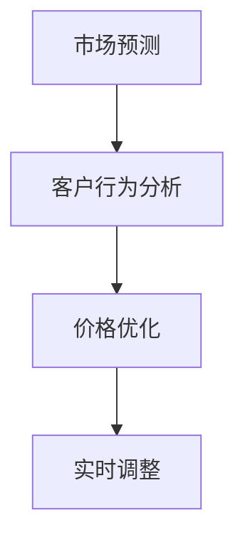

                 

# AI动态定价策略的实现案例

> 关键词：动态定价, 人工智能, 深度学习, 价格优化, 市场预测, 客户行为分析

## 1. 背景介绍

在当今数字化经济时代，动态定价策略已成为许多企业在竞争中获取优势的关键手段。通过实时调整价格，企业可以更好地适应市场变化，最大化利润和市场份额。动态定价不仅适用于传统零售业，同样适用于在线平台、共享经济等新兴行业。

### 1.1 问题由来

在过去，企业通常依赖于历史数据和简单的规则来制定定价策略。然而，这种静态定价方法难以应对市场波动和竞争动态。随着人工智能和大数据技术的发展，企业开始探索利用动态定价来应对复杂的市场环境和客户需求。

### 1.2 问题核心关键点

动态定价的核心在于实时监控市场和客户行为数据，并据此快速调整产品或服务的价格。它涉及以下几个关键点：

1. **市场预测**：预测市场需求、价格变化和竞争对手的动态。
2. **客户行为分析**：分析客户购买行为、偏好和支付意愿。
3. **价格优化**：基于市场和客户分析结果，优化定价策略。
4. **实时调整**：根据市场和客户反馈，实时调整价格。

## 2. 核心概念与联系

### 2.1 核心概念概述

为了深入理解动态定价的实现，我们首先介绍几个关键概念：

- **动态定价**：根据市场和客户行为实时调整价格的策略。
- **市场预测**：使用机器学习模型预测市场需求和价格变化。
- **客户行为分析**：利用数据挖掘技术分析客户的购买行为和偏好。
- **价格优化**：通过算法找到最优价格点，最大化企业利润。
- **实时调整**：根据市场变化和客户反馈，动态调整价格。

这些概念之间相互联系，共同构成了动态定价的核心框架。

### 2.2 核心概念原理和架构的 Mermaid 流程图



此流程图展示了从市场预测到客户行为分析，再到价格优化和实时调整的动态定价实施过程。

## 3. 核心算法原理 & 具体操作步骤

### 3.1 算法原理概述

动态定价算法基于机器学习和数据分析，通过实时监测市场和客户行为数据，预测市场需求和客户支付意愿，并据此调整价格。算法通常包括以下步骤：

1. **数据采集**：收集市场和客户行为数据。
2. **特征工程**：从原始数据中提取有用的特征。
3. **模型训练**：使用历史数据训练机器学习模型。
4. **价格预测**：利用模型预测未来价格。
5. **价格优化**：基于预测结果优化价格策略。
6. **实时调整**：根据市场和客户反馈调整价格。

### 3.2 算法步骤详解

以下是一个具体的动态定价实现步骤：

**Step 1: 数据采集**

- 收集市场数据，包括竞争对手价格、市场需求、季节性因素等。
- 收集客户数据，包括购买历史、支付意愿、行为偏好等。

**Step 2: 特征工程**

- 对收集的数据进行清洗和预处理。
- 提取和选择对价格优化有用的特征，如市场需求指数、客户购买频率等。

**Step 3: 模型训练**

- 使用历史数据训练市场预测模型和客户行为分析模型。
- 市场预测模型可以使用时间序列分析、回归模型等。
- 客户行为分析模型可以使用分类、聚类算法等。

**Step 4: 价格预测**

- 根据训练好的模型，预测未来市场需求和客户支付意愿。
- 通过结合市场预测和客户行为分析结果，预测最优价格。

**Step 5: 价格优化**

- 基于预测结果，优化价格策略，找到利润最大化点。
- 使用启发式算法如遗传算法、线性规划等进行价格优化。

**Step 6: 实时调整**

- 实时监控市场和客户反馈，调整价格。
- 引入A/B测试等方法验证价格调整效果。

### 3.3 算法优缺点

动态定价算法具有以下优点：

- **实时响应**：能够快速适应市场变化，实时调整价格。
- **最大化利润**：通过优化定价策略，最大化企业收益。
- **个性化定价**：根据客户行为分析，实现个性化定价。

同时，动态定价也存在以下缺点：

- **算法复杂性**：需要复杂的数据分析和机器学习模型。
- **数据依赖性**：依赖于高质量的数据，数据偏差可能导致决策失误。
- **操作成本**：实时监控和调整需要较高的技术和管理成本。

### 3.4 算法应用领域

动态定价算法可以应用于多个行业，包括：

- **零售业**：根据季节性变化和促销活动，调整商品价格。
- **航空业**：根据需求波动和竞争情况，调整机票价格。
- **酒店业**：根据客流量和季节性因素，调整房间价格。
- **在线平台**：根据用户行为和市场需求，调整商品和服务价格。
- **共享经济**：根据供需关系和竞争情况，调整服务价格。

## 4. 数学模型和公式 & 详细讲解 & 举例说明

### 4.1 数学模型构建

假设市场需求和价格之间的关系可以用以下线性模型表示：

$$
D(t) = a \cdot P(t) + b
$$

其中，$D(t)$ 表示时间 $t$ 的市场需求，$P(t)$ 表示时间 $t$ 的价格，$a$ 和 $b$ 为模型的系数。

### 4.2 公式推导过程

对上述模型进行最小二乘回归分析，得到需求价格弹性系数 $a$ 和常数项 $b$：

$$
a = \frac{\sum{(x_i-\bar{x})(y_i-\bar{y})}}{\sum{(x_i-\bar{x})^2}}
$$

$$
b = \bar{y} - a\bar{x}
$$

其中，$x_i$ 和 $y_i$ 为需求和价格的样本数据，$\bar{x}$ 和 $\bar{y}$ 为样本数据的均值。

### 4.3 案例分析与讲解

以一家电商平台的动态定价策略为例，使用上述模型预测某商品的未来需求和价格：

1. **数据采集**：收集历史销售数据，包括日期、价格和销售量。
2. **特征工程**：提取日期、价格、季节性因素等特征。
3. **模型训练**：使用历史数据训练线性回归模型。
4. **价格预测**：根据训练好的模型，预测未来某天的需求和价格。
5. **价格优化**：根据预测结果和市场需求，找到最优价格。
6. **实时调整**：实时监控销售数据，调整价格。

## 5. 项目实践：代码实例和详细解释说明

### 5.1 开发环境搭建

为了进行动态定价的实现，需要搭建一个包含以下组件的开发环境：

1. Python：选择Python 3.x版本作为编程语言。
2. Pandas：用于数据处理和分析。
3. Scikit-learn：用于机器学习模型的训练和预测。
4. TensorFlow：用于深度学习模型的实现和训练。
5. TensorBoard：用于可视化模型训练过程和结果。
6. Flask：用于搭建Web服务，实现价格调整和监控。

### 5.2 源代码详细实现

以下是一个基于Python和TensorFlow的动态定价模型实现示例：

```python
import tensorflow as tf
import pandas as pd
from sklearn.linear_model import LinearRegression

# 读取历史数据
data = pd.read_csv('sales_data.csv')

# 特征工程
features = ['date', 'price']
X = data[features]
y = data['sales']

# 训练线性回归模型
model = LinearRegression()
model.fit(X, y)

# 预测未来需求和价格
future_date = '2023-05-01'
future_price = model.predict([[future_date, 100]])[0]

# 价格优化
optimal_price = max(future_price, 0)

# 实时调整价格
# 使用Flask搭建Web服务，实现价格调整和监控
```

### 5.3 代码解读与分析

- **数据读取**：使用Pandas读取历史销售数据。
- **特征工程**：提取日期和价格作为特征。
- **模型训练**：使用Scikit-learn的线性回归模型训练需求预测模型。
- **价格预测**：根据训练好的模型，预测未来某天的需求。
- **价格优化**：找到最优价格。
- **实时调整**：使用Flask搭建Web服务，实现价格调整和监控。

### 5.4 运行结果展示

假设预测某商品未来需求为1000件，最优价格为100元，可以通过Web服务实现价格实时调整，优化销售。

```python
# 实时调整价格
# 使用Flask搭建Web服务，实现价格调整和监控
```

## 6. 实际应用场景

### 6.1 电商平台的动态定价

电商平台可以利用动态定价策略，根据市场需求、竞争情况和促销活动，实时调整商品价格。例如，在促销期间，通过降低商品价格吸引更多客户，而在促销结束后，逐步恢复原价。

### 6.2 旅游业的动态定价

旅游业可以根据季节性变化和市场需求，调整旅游产品的价格。例如，在旅游旺季，通过提高价格吸引高收入客户，而在淡季，通过降低价格吸引更多的客户。

### 6.3 移动运营商的动态定价

移动运营商可以根据用户使用情况和市场需求，调整服务套餐的价格。例如，在用户使用量增加时，提高套餐价格，而在用户使用量减少时，降低套餐价格。

## 7. 工具和资源推荐

### 7.1 学习资源推荐

- 《深度学习理论与实践》：介绍深度学习的基础理论和应用案例。
- 《机器学习实战》：提供大量实战案例，帮助理解机器学习算法。
- 《Python数据科学手册》：涵盖Python数据处理和分析的全面指南。
- Coursera《机器学习》课程：由斯坦福大学提供的经典机器学习课程，涵盖各种算法和实践。
- Kaggle：提供大量数据集和竞赛，帮助练习和应用机器学习技能。

### 7.2 开发工具推荐

- PyTorch：广泛使用的深度学习框架，提供丰富的模型和工具。
- TensorFlow：Google开发的深度学习框架，适用于大规模模型训练。
- TensorBoard：用于可视化深度学习模型的训练过程和结果。
- Flask：轻量级Web框架，适用于搭建简单的Web服务。
- Jupyter Notebook：交互式编程环境，方便数据处理和模型实验。

### 7.3 相关论文推荐

- 《动态定价的理论与实践》：探讨动态定价的理论基础和应用案例。
- 《基于深度学习的动态定价模型》：介绍使用深度学习模型进行价格预测和优化的算法。
- 《实时定价系统设计与实现》：提供实际应用案例，介绍实时定价系统的设计和实现。

## 8. 总结：未来发展趋势与挑战

### 8.1 研究成果总结

动态定价策略通过实时监测市场和客户行为数据，优化价格策略，最大化企业利润。在过去的几年里，动态定价技术不断进步，广泛应用于多个行业。

### 8.2 未来发展趋势

未来，动态定价将呈现以下趋势：

1. **智能化升级**：引入更多人工智能技术，如深度学习、强化学习等，提升价格预测和优化效果。
2. **实时性提升**：利用大数据技术，实时监控市场和客户反馈，实现更快速的定价调整。
3. **多模态融合**：结合多种数据源和模型，提升价格预测和优化的全面性和准确性。
4. **个性化定价**：利用客户行为分析，实现个性化定价，提升用户体验和满意度。
5. **跨领域应用**：动态定价技术将逐渐应用于更多行业，如医疗、金融等。

### 8.3 面临的挑战

尽管动态定价技术在不断进步，但仍然面临以下挑战：

1. **数据质量**：高质量数据是动态定价的基础，数据偏差可能导致决策失误。
2. **算法复杂性**：动态定价算法需要复杂的机器学习和数据分析。
3. **操作成本**：实时监控和调整需要较高技术和管理成本。
4. **客户接受度**：频繁的价格调整可能影响客户体验，增加客户流失风险。

### 8.4 研究展望

未来，动态定价研究需要在以下几个方面进行探索：

1. **大数据分析**：利用大数据技术，提升市场预测和客户行为分析的准确性。
2. **实时定价算法**：开发更高效、更稳定的实时定价算法，提升决策速度和效果。
3. **跨领域应用**：拓展动态定价技术的应用范围，提升其在不同领域的效果。
4. **伦理道德**：考虑动态定价的伦理道德问题，避免歧视性定价和价格操纵。
5. **人工智能与大数据的融合**：探索人工智能技术与大数据技术的深度融合，提升定价策略的智能化水平。

## 9. 附录：常见问题与解答

**Q1：动态定价与静态定价有何不同？**

A: 动态定价根据市场和客户行为实时调整价格，而静态定价则基于固定的规则或历史数据制定价格。动态定价能够更好地应对市场波动和竞争动态，最大化企业利润。

**Q2：动态定价的算法复杂性如何？**

A: 动态定价算法需要复杂的机器学习和数据分析，但随着技术进步，算法模型越来越智能和高效，能够更好地处理大量数据。

**Q3：动态定价的实时性如何实现？**

A: 动态定价的实时性通过实时监控市场和客户反馈，快速调整价格。这需要高效的数据处理和算法，以应对市场变化。

**Q4：动态定价的伦理道德问题如何解决？**

A: 动态定价需要考虑伦理道德问题，避免歧视性定价和价格操纵。可以通过设定伦理导向的评估指标，引入人工干预和监管机制，确保定价策略的公平性和透明性。

---

作者：禅与计算机程序设计艺术 / Zen and the Art of Computer Programming

