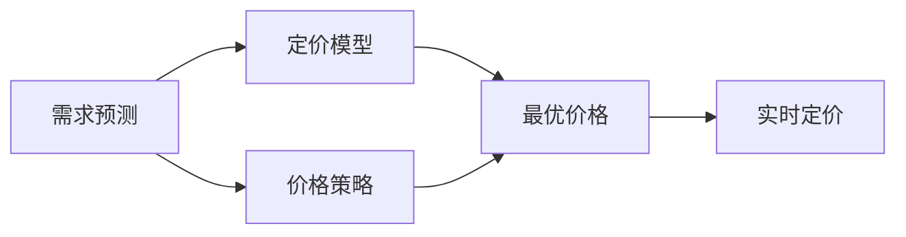

                 

## 1. 背景介绍

在电子商务和金融科技的浪潮中，动态定价策略已成为提升竞争力和盈利能力的关键手段。通过实时、动态地调整商品或服务的价格，商家能够更好地匹配市场需求，优化资源分配，提升客户满意度，并实现最大化收益。近年来，人工智能技术在动态定价中的应用越来越广泛，尤其是利用机器学习算法和深度学习模型进行动态定价，使定价过程更加精准、高效、智能。本文将深入探讨动态定价的原理、应用以及面临的挑战，并结合具体的案例分析，展现AI在动态定价中的潜力和实践。

## 2. 核心概念与联系

### 2.1 核心概念概述

动态定价(Dynamic Pricing)，指的是在产品或服务的生命周期内，根据市场需求和供应变化，实时调整价格以最大化收益的策略。动态定价包括需求预测、定价模型、价格策略等多个环节，涉及经济学、管理学、计算机科学等多个学科。

1. **需求预测**：预测市场对产品或服务的需求变化，如季节性变化、节假日影响、竞争对手行为等。
2. **定价模型**：基于市场需求和成本，计算最优价格。常见的定价模型包括盈亏平衡定价、边际分析定价、折扣定价等。
3. **价格策略**：根据市场反馈和策略目标，动态调整价格。如时间定价、数量定价、分层次定价等。

### 2.2 核心概念原理和架构的 Mermaid 流程图



## 3. 核心算法原理 & 具体操作步骤

### 3.1 算法原理概述

动态定价的核心在于利用人工智能技术对市场需求和成本进行实时分析，并动态调整价格以优化收益。常用的AI技术包括机器学习、深度学习、强化学习等。

**机器学习**：通过历史数据训练模型，预测未来的需求和市场趋势。
**深度学习**：利用神经网络对复杂数据进行处理，提高定价模型的准确性和鲁棒性。
**强化学习**：通过奖励机制训练模型，在实时环境中不断优化价格策略。

### 3.2 算法步骤详解

动态定价的AI应用主要包括以下步骤：

1. **数据收集与预处理**：收集历史销售数据、市场价格、竞争对手行为等数据，进行清洗、归一化等预处理。
2. **需求预测**：使用机器学习模型（如ARIMA、LSTM等）预测未来的需求量。
3. **定价模型训练**：利用历史数据训练定价模型，计算最优价格。
4. **价格策略调整**：根据实时市场需求和竞争环境，动态调整价格策略。
5. **实时定价与反馈**：在实际销售过程中，实时监控价格效果，并根据反馈调整策略。

### 3.3 算法优缺点

**优点**：
- 精准预测：AI模型能够准确捕捉市场需求的变化，预测未来的价格趋势。
- 实时调整：AI系统能够实时监控市场反馈，动态调整价格策略。
- 自动化管理：AI定价系统能够自动化管理，减少人工干预。

**缺点**：
- 模型复杂：AI模型需要大量的历史数据和复杂的训练过程。
- 数据质量要求高：模型的预测结果高度依赖于数据质量，数据缺失或不准确会影响效果。
- 模型过拟合风险：复杂模型容易过拟合历史数据，导致预测结果偏差。

### 3.4 算法应用领域

动态定价的AI应用涵盖多个领域，包括但不限于：

- **电子商务**：如京东、淘宝、亚马逊等电商平台通过AI进行商品定价和促销活动。
- **航空交通**：如携程、去哪儿等旅游平台利用AI进行机票、酒店定价。
- **金融服务**：如支付宝、微信等支付平台进行信用卡、贷款等产品定价。
- **能源与公共服务**：如电力公司、水务公司利用AI进行水电气定价。
- **医疗服务**：如私立医院、在线问诊平台利用AI进行挂号、手术定价。

## 4. 数学模型和公式 & 详细讲解 & 举例说明

### 4.1 数学模型构建

动态定价的数学模型主要基于需求预测和定价模型两个方面。

**需求预测模型**：
$$ P(t+1) = \alpha P(t) + \beta D(t) + \gamma \varepsilon(t) $$
其中 $P(t)$ 为第 $t$ 天的价格，$D(t)$ 为第 $t$ 天的需求量，$\alpha$、$\beta$、$\gamma$ 为模型参数，$\varepsilon(t)$ 为随机误差项。

**定价模型**：
$$ C(t) = \text{Cost}(t) + \text{Difference}(t, P(t)) \times \text{Revenue}(t) $$
其中 $C(t)$ 为第 $t$ 天的成本，$\text{Difference}(t, P(t))$ 为价格变动对收入的影响，$\text{Revenue}(t)$ 为第 $t$ 天的收入。

### 4.2 公式推导过程

以航空行业的动态定价为例，假设市场需求 $D(t)$ 可分解为历史数据、节假日、竞争对手行为等，有：
$$ D(t) = D_{\text{historic}}(t) + D_{\text{holiday}}(t) + D_{\text{competitor}}(t) $$
其中 $D_{\text{historic}}(t)$ 为历史数据预测，$D_{\text{holiday}}(t)$ 为节假日影响，$D_{\text{competitor}}(t)$ 为竞争对手行为影响。

需求预测模型可以使用ARIMA（自回归移动平均模型）进行建模：
$$ P(t+1) = \alpha P(t) + \beta \Delta D(t) + \gamma \varepsilon(t) $$
其中 $\Delta D(t)$ 为需求量的差分，$\alpha$、$\beta$、$\gamma$ 为模型参数。

定价模型可以使用边际分析定价方法，计算价格对收入的影响：
$$ \text{Revenue}(t) = P(t) \times D(t) $$
$$ \text{Cost}(t) = \text{Fixed Cost} + \text{Variable Cost} \times D(t) $$
$$ \text{Difference}(t, P(t)) = P(t) - P_{\text{base}} $$
其中 $P_{\text{base}}$ 为基准价格，$\text{Fixed Cost}$ 为固定成本，$\text{Variable Cost}$ 为变动成本。

### 4.3 案例分析与讲解

某航空公司希望通过AI模型优化机票价格。收集历史航班数据，包括客流量、舱位、竞争对手定价等。使用LSTM模型进行需求预测，训练定价模型进行最优价格计算。模型在实时环境中根据市场需求和竞争对手价格动态调整票价，实现了票价自动优化，提高了收益。

## 5. 项目实践：代码实例和详细解释说明

### 5.1 开发环境搭建

安装Python 3.8以上版本，以及TensorFlow、Keras等深度学习框架。

### 5.2 源代码详细实现

```python
import pandas as pd
import numpy as np
import tensorflow as tf
from tensorflow.keras.models import Sequential
from tensorflow.keras.layers import LSTM, Dense

# 数据处理
train_data = pd.read_csv('train_data.csv')
X_train = train_data[['demand', 'price', 'holiday', 'competitor']]
y_train = train_data['demand']

# 数据归一化
from sklearn.preprocessing import MinMaxScaler
scaler = MinMaxScaler(feature_range=(0, 1))
X_train_scaled = scaler.fit_transform(X_train)

# 构建LSTM模型
model = Sequential()
model.add(LSTM(64, input_shape=(X_train_scaled.shape[1], 4), return_sequences=True))
model.add(LSTM(64, return_sequences=True))
model.add(LSTM(64))
model.add(Dense(1))

# 模型训练
model.compile(optimizer='adam', loss='mse')
model.fit(X_train_scaled, y_train, epochs=50, batch_size=32)

# 实时定价预测
def predict_price(data):
    data_scaled = scaler.transform(data)
    prediction = model.predict(data_scaled)
    return prediction

# 应用案例
data = np.array([[1.0, 500.0, 0.0, 1.0]])  # 实际测试数据
predicted_price = predict_price(data)
print(predicted_price)
```

### 5.3 代码解读与分析

在上述代码中，首先使用Pandas加载训练数据，并进行数据归一化处理。然后构建LSTM模型，并使用Adam优化器进行训练。在训练完成后，定义了一个实时定价预测函数`predict_price`，接受测试数据并返回预测价格。最后使用案例数据进行了预测，并输出了预测结果。

## 6. 实际应用场景

### 6.1 电子商务

电子商务平台通过AI动态定价，根据用户的购买历史、浏览行为、评价反馈等数据，动态调整商品价格。例如，淘宝根据用户点击率、收藏数、购买意愿等数据，实时调整商品价格，提升销售额和用户满意度。

### 6.2 航空交通

航空公司利用AI进行机票定价和促销策略优化。例如，携程根据历史预订数据、天气预报、竞争对手定价等，实时调整机票价格，吸引更多客户，提高收益。

### 6.3 金融服务

金融机构利用AI进行信用卡、贷款等产品的定价和风险控制。例如，支付宝根据用户的消费记录、信用评分、还款能力等数据，动态调整贷款利率和额度，提升贷款产品的吸引力和安全性。

## 7. 工具和资源推荐

### 7.1 学习资源推荐

1. **《机器学习实战》**：适合初学者了解机器学习基础和应用。
2. **《深度学习》**：深度学习领域的经典教材，详细介绍了深度学习算法和应用。
3. **《强化学习》**：介绍强化学习的基本概念和算法，适用于深入学习。

### 7.2 开发工具推荐

1. **TensorFlow**：TensorFlow是Google开发的深度学习框架，提供了丰富的API和工具支持。
2. **Keras**：Keras是TensorFlow的高层API，提供了简单易用的接口，适合快速原型开发。
3. **PyTorch**：PyTorch是Facebook开发的深度学习框架，提供了动态计算图和自动微分功能。

### 7.3 相关论文推荐

1. **《Deep Reinforcement Learning for Dynamic Pricing》**：探讨了强化学习在动态定价中的应用。
2. **《A Comprehensive Survey on Dynamic Pricing with Data Mining and Statistical Learning》**：综述了动态定价中机器学习的研究进展和应用。

## 8. 总结：未来发展趋势与挑战

### 8.1 研究成果总结

AI动态定价技术已经取得了显著进展，广泛应用于电子商务、航空交通、金融服务等多个领域。通过实时需求预测和定价优化，显著提高了收益和客户满意度。然而，该技术仍面临数据质量、模型复杂性、实时计算等问题，需要在实践中不断优化和改进。

### 8.2 未来发展趋势

未来AI动态定价技术将呈现以下发展趋势：

1. **模型融合**：将深度学习、强化学习、规则引擎等多种技术进行融合，提高定价策略的全面性和适应性。
2. **跨模态数据融合**：结合用户行为数据、社交网络数据、传感器数据等多种信息源，进行多模态融合，提升定价精度。
3. **实时计算优化**：通过分布式计算、模型压缩、高效算法等技术，优化实时定价的计算效率，支持大规模部署。
4. **自适应策略调整**：通过自动调整定价策略，应对市场变化和不确定性，提升决策的灵活性和智能化。
5. **隐私保护**：在数据收集和使用过程中，加强隐私保护和数据安全，保障用户隐私和数据安全。

### 8.3 面临的挑战

动态定价的AI应用面临以下挑战：

1. **数据质量**：高质量的数据是AI定价的基础，数据缺失、噪声等会影响模型效果。
2. **模型复杂度**：复杂的模型容易过拟合，需要平衡模型复杂度和泛化能力。
3. **实时计算**：实时定价需要快速计算和响应，对计算资源和算法效率有较高要求。
4. **用户接受度**：AI定价可能会引起用户对价格变动的不满，需要通过透明的定价策略和合理的解释机制，提升用户接受度。
5. **法律合规**：动态定价需要符合相关法律法规，避免价格歧视和不公平竞争。

### 8.4 研究展望

未来动态定价的研究方向包括：

1. **多目标优化**：综合考虑收益、客户满意度、市场竞争等因素，进行多目标优化。
2. **自适应定价机制**：根据市场变化和用户反馈，动态调整定价策略，实现自适应定价。
3. **实时动态定价**：结合大数据、云计算、物联网等技术，实现实时动态定价。
4. **公平性研究**：研究动态定价的公平性和透明度，保障用户的利益和市场的健康发展。
5. **技术创新**：推动技术创新，如神经网络、强化学习、自然语言处理等，提升定价系统的智能化水平。

## 9. 附录：常见问题与解答

### Q1: AI动态定价是否适用于所有产品和服务？

A: AI动态定价主要适用于需求波动较大、价格弹性较高、数据收集较易的产品和服务。对于价格刚性较强、需求稳定、数据收集困难的产品和服务，AI定价的效果可能有限。

### Q2: AI动态定价是否会导致价格歧视？

A: 如果AI定价系统能够根据用户的真实需求和行为进行精准定价，而非简单地根据用户特征进行歧视性定价，则不会导致价格歧视。但需要注意，在数据收集和使用过程中，应遵守法律法规，避免数据滥用和隐私侵害。

### Q3: 如何平衡AI定价系统的灵活性和稳定性？

A: 通过多模型融合、自适应策略调整、实时监控和反馈等技术，平衡AI定价系统的灵活性和稳定性。例如，结合多个预测模型进行融合，并根据市场反馈调整策略，实现灵活性和稳定性的双重优化。

### Q4: 如何保障AI定价系统的公平性和透明性？

A: 在AI定价系统中，应引入公平性指标和透明度机制，如价格变化原因解释、用户反馈机制等，保障定价的公平性和透明性。同时，应定期审查和优化系统，避免算法偏见和歧视。

---

作者：禅与计算机程序设计艺术 / Zen and the Art of Computer Programming

