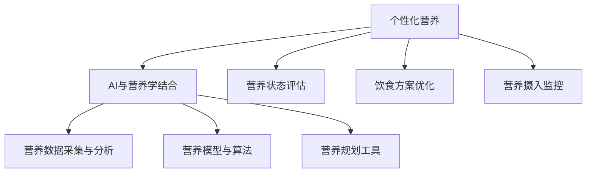

                 

# AI在个性化营养中的应用：定制饮食计划

## 1. 背景介绍

### 1.1 问题由来
个性化营养规划一直是营养学和健康管理的重要研究方向。传统的个性化营养计划主要依赖人工经验，无法全面、精准地满足个体的营养需求。而随着人工智能和大数据分析技术的发展，越来越多的数据被收集并用于分析，使得个性化的营养计划成为可能。

### 1.2 问题核心关键点
个性化营养计划的核心关键点在于：
- 收集并分析个体的饮食、运动、健康数据，评估其营养状态。
- 结合营养学知识，构建个性化饮食方案。
- 实时监控个体营养摄入，调整饮食计划。
- 确保个体营养摄入的科学性和可持续性。

## 2. 核心概念与联系

### 2.1 核心概念概述

为更好地理解AI在个性化营养中的应用，本节将介绍几个密切相关的核心概念：

- 个性化营养：基于个体健康状态和生理特征，量身定制的营养计划，旨在满足个体生理和心理健康的需求。
- AI与营养学结合：将人工智能和大数据分析技术应用于营养学，实现个性化营养规划、饮食评估和优化。
- 营养数据采集与分析：通过智能穿戴设备、健康管理系统等，采集个体的饮食、运动、健康等数据，并进行分析评估。
- 营养模型与算法：构建营养模型，采用机器学习、深度学习等算法进行饮食方案的优化和评估。
- 营养规划工具：基于模型算法的个性化营养规划软件、APP等，为用户提供实时的营养指导和建议。

这些核心概念之间的逻辑关系可以通过以下Mermaid流程图来展示：



这个流程图展示了个性化营养的几个关键组成环节，包括AI与营养学的结合、数据采集与分析、模型与算法构建，以及最终的营养规划工具应用。通过理解这些核心概念，我们可以更好地把握个性化营养的原理和应用方向。

## 3. 核心算法原理 & 具体操作步骤
### 3.1 算法原理概述

AI在个性化营养中的应用，主要通过以下步骤实现：

1. **数据收集与预处理**：采集个体的饮食、运动、健康数据，并进行清洗和预处理。
2. **营养状态评估**：使用机器学习算法评估个体的营养状态，包括但不限于营养不足、营养过剩、营养失衡等。
3. **饮食方案设计**：根据评估结果，结合营养学知识，设计个性化饮食方案。
4. **饮食方案优化**：使用深度学习算法对饮食方案进行优化，确保方案的科学性和可行性。
5. **营养摄入监控**：实时监控个体的营养摄入，根据实际情况调整饮食方案。

### 3.2 算法步骤详解

以下是基于上述原理，详细的算法步骤：

**Step 1: 数据收集与预处理**

- **数据采集**：通过智能穿戴设备、健康管理系统、膳食日志等途径，采集个体的饮食、运动、健康数据。数据类型包括但不限于：
  - 饮食数据：食品种类、摄入量、营养成分等。
  - 运动数据：运动种类、强度、持续时间等。
  - 健康数据：身高、体重、年龄、性别、代谢率等。
- **数据清洗**：对采集的数据进行清洗，去除异常值、缺失值等。
- **特征提取**：将原始数据转换为可用于模型训练的特征向量。例如，将食物种类转换为营养成分向量，将运动强度转换为卡路里消耗等。

**Step 2: 营养状态评估**

- **特征工程**：根据已有的营养学知识，设计特征工程流程，提取对营养状态有显著影响的特征。例如，根据食物营养成分计算总热量、蛋白质、脂肪、碳水化合物等。
- **模型选择与训练**：选择合适的机器学习模型，如回归模型、分类模型、聚类模型等，对个体的营养状态进行评估。例如，使用随机森林、支持向量机等算法，评估个体的营养状况，输出营养不足、营养过剩、营养失衡等标签。

**Step 3: 饮食方案设计**

- **营养模型构建**：根据营养学知识，构建营养模型，用于设计个性化的饮食方案。例如，基于食物营养成分，设计包含碳水化合物、蛋白质、脂肪、维生素等的饮食比例。
- **方案设计算法**：使用算法设计饮食方案，确保方案满足个体的营养需求。例如，使用遗传算法、粒子群优化算法等，优化饮食方案，使其在满足营养需求的同时，尽可能符合个体的口味偏好和饮食限制。

**Step 4: 饮食方案优化**

- **数据集准备**：准备训练集、验证集、测试集，用于模型的训练和评估。
- **模型选择与训练**：选择深度学习模型，如卷积神经网络、循环神经网络等，对饮食方案进行优化。例如，使用LSTM模型，根据个体的历史饮食数据，预测未来的饮食效果，进行方案优化。
- **模型评估与调优**：使用验证集评估模型性能，根据评估结果，调整模型参数，提高模型准确性和泛化能力。

**Step 5: 营养摄入监控**

- **实时监控系统**：搭建实时监控系统，监控个体的营养摄入情况，采集实时饮食、运动数据。
- **反馈与调整**：根据实时监控数据，调整饮食方案，确保个体营养摄入的科学性和可持续性。

### 3.3 算法优缺点

基于AI的个性化营养计划有以下优点：
- 精度高：通过数据分析和模型优化，提供更加科学和个性化的营养建议。
- 自动化程度高：从数据采集到方案优化，无需人工干预，提高效率。
- 可扩展性强：适用于不同年龄、性别、身体状况的个体。
- 动态调整：实时监控营养摄入，动态调整方案，满足个体变化的需求。

但同时，该方法也存在一些局限性：
- 数据隐私问题：采集和分析个人健康数据，涉及隐私保护问题。
- 模型依赖性：模型的效果依赖于数据质量和算法选择，需要持续优化。
- 个体差异：不同个体的营养需求差异较大，模型难以全面覆盖。
- 技术门槛：需要具备一定的数据处理和机器学习知识，技术门槛较高。

尽管存在这些局限性，但基于AI的个性化营养计划仍是大数据和人工智能在健康管理领域的重要应用之一。未来相关研究的重点在于如何进一步提升数据隐私保护，优化模型算法，缩小个体差异，降低技术门槛。

### 3.4 算法应用领域

基于AI的个性化营养计划在多个领域得到了广泛应用，例如：

- 医院营养科：通过AI技术，为病患设计个性化的饮食方案，辅助医生进行营养管理。
- 健康管理APP：为普通用户提供个性化的饮食建议，结合运动计划，实现健康管理。
- 运动健身中心：通过分析运动数据和饮食数据，为会员提供个性化的营养指导和运动计划。
- 餐饮行业：根据顾客的饮食偏好和健康数据，提供个性化的菜单和营养信息。
- 教育机构：通过AI技术，为学生设计个性化的饮食方案，促进其健康成长。

## 4. 数学模型和公式 & 详细讲解 & 举例说明

### 4.1 数学模型构建

以蛋白质摄入为例，构建基于AI的个性化营养模型。

设个体的基础代谢率（BMR）为 $BMR$，每日总能量消耗（TEE）为 $TEE$，蛋白质摄入需求为 $P_{\text{req}}$，实际蛋白质摄入量为 $P_{\text{actual}}$。则模型可表示为：

$$
P_{\text{req}} = k_1 \cdot BMR + k_2 \cdot TEE
$$

其中，$k_1$ 和 $k_2$ 为系数，需要通过实验数据或营养学知识确定。

### 4.2 公式推导过程

为了更好地理解上述模型，我们通过几个例子进行推导：

**例子1: 基础代谢率计算**

假设某人的BMR为1800卡路里，系数 $k_1 = 0.2$，每日总能量消耗为2500卡路里，系数 $k_2 = 0.3$，则蛋白质需求量为：

$$
P_{\text{req}} = 0.2 \cdot 1800 + 0.3 \cdot 2500 = 780 + 750 = 1530 \text{卡路里}
$$

**例子2: 蛋白质摄入量调整**

假设某人每日蛋白质摄入量为1500卡路里，通过模型计算，其蛋白质需求量为1530卡路里，则需要增加30卡路里的蛋白质摄入，以满足身体需求。

### 4.3 案例分析与讲解

**案例1: 医院营养科应用**

某患者因疾病需控制蛋白质摄入，医生为其采集每日饮食和运动数据。基于上述模型，医生可计算其每日蛋白质需求量，结合饮食记录，调整蛋白质摄入量，确保其健康恢复。

**案例2: 健康管理APP应用**

某用户关注健康管理，通过APP输入其基本信息和饮食记录，APP基于模型计算其蛋白质需求量，并推荐符合其需求的蛋白质摄入来源，如肉类、豆类等，指导其健康饮食。

## 5. 项目实践：代码实例和详细解释说明
### 5.1 开发环境搭建

在进行项目实践前，我们需要准备好开发环境。以下是使用Python进行项目开发的环境配置流程：

1. 安装Anaconda：从官网下载并安装Anaconda，用于创建独立的Python环境。

2. 创建并激活虚拟环境：
```bash
conda create -n nutrifit python=3.8 
conda activate nutrifit
```

3. 安装所需库：
```bash
conda install pandas numpy matplotlib sklearn
```

完成上述步骤后，即可在`nutrifit`环境中开始项目开发。

### 5.2 源代码详细实现

以下是一个简单的Python代码示例，用于计算蛋白质的需求量和摄入量：

```python
import numpy as np
from sklearn.linear_model import LinearRegression

# 基础代谢率和每日总能量消耗
BMR = 1800
TEE = 2500

# 蛋白质需求量计算系数
k1 = 0.2
k2 = 0.3

# 计算蛋白质需求量
P_req = k1 * BMR + k2 * TEE

# 实际蛋白质摄入量
P_actual = 1500

# 计算蛋白质摄入差
P_diff = P_req - P_actual

# 输出蛋白质摄入差
print(f"蛋白质摄入差为 {P_diff} 卡路里")
```

### 5.3 代码解读与分析

让我们再详细解读一下关键代码的实现细节：

- **基础代谢率和每日总能量消耗**：变量`BMR`和`TEE`分别代表个体的基础代谢率和每日总能量消耗。这些数据可以通过智能穿戴设备或问卷调查等方式获取。
- **蛋白质需求量计算系数**：变量`k1`和`k2`代表计算蛋白质需求量的系数。这些系数需要根据营养学知识进行设定。
- **蛋白质需求量计算**：通过公式计算个体的蛋白质需求量。
- **实际蛋白质摄入量**：变量`P_actual`代表个体的实际蛋白质摄入量。
- **蛋白质摄入差**：计算蛋白质摄入差，即实际摄入量与需求量之差。
- **输出蛋白质摄入差**：将蛋白质摄入差输出，供用户参考。

以上代码实现了一个简单的蛋白质摄入量计算功能，用于帮助用户了解其蛋白质摄入情况。在实际应用中，为了更好地满足个性化需求，我们需要对代码进行扩展和优化，如引入营养学知识、考虑个体差异、实现动态调整等。

## 6. 实际应用场景
### 6.1 医院营养科

医院营养科是AI在个性化营养应用的重要场景之一。通过AI技术，医生可以快速计算病患的蛋白质需求量，结合饮食记录，调整蛋白质摄入量，提高治疗效果。例如，某患者因疾病需控制蛋白质摄入，医生为其采集每日饮食和运动数据。基于上述模型，医生可计算其每日蛋白质需求量，结合饮食记录，调整蛋白质摄入量，确保其健康恢复。

### 6.2 健康管理APP

健康管理APP是另一个广泛应用AI技术场景。用户可以通过APP输入基本信息和饮食记录，APP基于模型计算其蛋白质需求量，并推荐符合其需求的蛋白质摄入来源，指导其健康饮食。例如，某用户关注健康管理，通过APP输入其基本信息和饮食记录，APP基于模型计算其蛋白质需求量，并推荐符合其需求的蛋白质摄入来源，如肉类、豆类等，指导其健康饮食。

### 6.3 运动健身中心

运动健身中心可以通过AI技术，分析会员的运动数据和饮食数据，为会员提供个性化的营养指导和运动计划。例如，某健身中心会员关注蛋白质摄入，通过APP输入其运动和饮食数据，APP基于模型计算其蛋白质需求量，并推荐符合其需求的蛋白质摄入来源，如肉类、豆类等，指导其健康饮食。

### 6.4 未来应用展望

随着AI技术的发展，个性化营养的应用前景将更加广阔。未来，基于AI的个性化营养计划将变得更加智能化、自动化、个性化，具体展望如下：

1. **数据整合与融合**：将更多数据源整合到营养模型中，如基因数据、环境数据、社交数据等，提供更加全面的营养建议。
2. **多模态数据应用**：结合视觉、音频、传感器等数据，提升营养评估的准确性和全面性。
3. **个性化推荐系统**：基于用户的饮食偏好和历史数据，推荐个性化的饮食方案和营养产品。
4. **动态调整与优化**：实时监控营养摄入，根据个体需求和环境变化，动态调整饮食方案，提高用户满意度。
5. **伦理与隐私保护**：引入伦理和隐私保护机制，确保数据安全和用户隐私。
6. **国际化和本地化**：结合不同国家和地区的营养学知识，提供符合当地标准的个性化营养建议。

这些未来应用将使AI在个性化营养中的应用更加广泛和深入，为人类健康管理提供更科学、更智能的解决方案。

## 7. 工具和资源推荐
### 7.1 学习资源推荐

为了帮助开发者系统掌握AI在个性化营养中的应用，这里推荐一些优质的学习资源：

1. **《营养学与人工智能》系列书籍**：详细介绍营养学知识与AI技术的结合，包括营养数据采集、模型构建、方案设计等。

2. **Coursera《人工智能与健康管理》课程**：由知名专家讲授，涵盖AI在健康管理中的应用，包括个性化营养规划、饮食评估、健康监测等。

3. **arXiv预印本平台**：查找和阅读最新的AI在个性化营养领域的研究论文，跟踪最新研究进展。

4. **Hugging Face官方文档**：提供丰富的深度学习框架和预训练模型，适用于AI在个性化营养中的应用。

5. **Kaggle竞赛平台**：参加与个性化营养相关的数据科学竞赛，提升实践能力，积累实际经验。

通过对这些资源的学习实践，相信你一定能够快速掌握AI在个性化营养中的应用，并用于解决实际的NLP问题。

### 7.2 开发工具推荐

高效的开发离不开优秀的工具支持。以下是几款用于AI在个性化营养项目开发的常用工具：

1. **PyTorch**：基于Python的开源深度学习框架，灵活动态的计算图，适合快速迭代研究。

2. **TensorFlow**：由Google主导开发的开源深度学习框架，生产部署方便，适合大规模工程应用。

3. **Keras**：高层次的深度学习API，提供简单易用的接口，适合快速原型设计和实验。

4. **Jupyter Notebook**：交互式的代码编辑器，支持代码、数学公式、图像等多种格式的混合编辑，方便开发和分享。

5. **AWS SageMaker**：提供云端深度学习框架和工具，支持大规模分布式训练和部署，方便高效开发。

合理利用这些工具，可以显著提升AI在个性化营养项目开发的效率，加快创新迭代的步伐。

### 7.3 相关论文推荐

AI在个性化营养领域的研究涉及多个学科，以下是几篇奠基性的相关论文，推荐阅读：

1. **《个性化营养计划的设计与实现》**：介绍了基于AI的个性化营养计划的设计和实现方法，包括数据采集、模型构建、方案设计等。

2. **《AI在健康管理中的应用》**：综述了AI在个性化营养、饮食评估、健康监测等领域的应用，展示了其潜力和前景。

3. **《基于深度学习的个性化营养规划》**：通过深度学习模型，优化个性化营养规划，提高了模型的准确性和泛化能力。

4. **《多模态数据在营养评估中的应用》**：研究了多模态数据在个性化营养评估中的应用，提升了营养评估的全面性和准确性。

5. **《隐私保护与伦理在个性化营养中的考虑》**：探讨了数据隐私保护和伦理在个性化营养中的应用，提供了相应的解决方案。

这些论文代表了大语言模型微调技术的发展脉络。通过学习这些前沿成果，可以帮助研究者把握学科前进方向，激发更多的创新灵感。

## 8. 总结：未来发展趋势与挑战
### 8.1 研究成果总结

本文对基于AI的个性化营养计划进行了全面系统的介绍。首先阐述了AI在个性化营养中的应用背景和意义，明确了营养状态评估、饮食方案设计、方案优化和营养摄入监控等关键环节。其次，通过数学模型和具体案例，展示了AI在个性化营养计划中的应用流程和算法细节。同时，本文还探讨了AI在个性化营养中的应用场景和未来展望，展示了其广泛的应用前景。

### 8.2 未来发展趋势

展望未来，AI在个性化营养的应用将呈现以下几个发展趋势：

1. **数据整合与融合**：将更多数据源整合到营养模型中，提供更加全面的营养建议。
2. **多模态数据应用**：结合视觉、音频、传感器等数据，提升营养评估的准确性和全面性。
3. **个性化推荐系统**：基于用户的饮食偏好和历史数据，推荐个性化的饮食方案和营养产品。
4. **动态调整与优化**：实时监控营养摄入，根据个体需求和环境变化，动态调整饮食方案，提高用户满意度。
5. **伦理与隐私保护**：引入伦理和隐私保护机制，确保数据安全和用户隐私。
6. **国际化和本地化**：结合不同国家和地区的营养学知识，提供符合当地标准的个性化营养建议。

这些趋势凸显了AI在个性化营养中的应用潜力，将使营养规划更加智能化、个性化和全面化。

### 8.3 面临的挑战

尽管AI在个性化营养的应用前景广阔，但在迈向更加智能化、普适化应用的过程中，它仍面临诸多挑战：

1. **数据隐私问题**：采集和分析个人健康数据，涉及隐私保护问题。
2. **模型依赖性**：模型的效果依赖于数据质量和算法选择，需要持续优化。
3. **个体差异**：不同个体的营养需求差异较大，模型难以全面覆盖。
4. **技术门槛**：需要具备一定的数据处理和机器学习知识，技术门槛较高。
5. **伦理与合规**：如何确保模型的公平性、透明性和可解释性，防止算法偏见。
6. **资源消耗**：大模型的训练和推理需要大量计算资源，如何优化模型结构和算法，提高效率。

这些挑战需要通过技术进步和政策支持，逐步解决，以确保AI在个性化营养中的应用更加可靠和可持续。

### 8.4 研究展望

为了应对未来挑战，未来的研究需要在以下几个方面寻求新的突破：

1. **数据隐私保护**：开发更加高效的数据隐私保护技术，确保数据安全和用户隐私。
2. **模型优化与公平性**：探索更加高效、公平的模型构建和优化方法，提升模型泛化性和鲁棒性。
3. **个体差异分析**：研究不同个体的营养需求差异，构建更加个性化的营养模型。
4. **多模态数据融合**：研究多模态数据的融合与协同建模方法，提升营养评估的全面性和准确性。
5. **动态调整与优化**：研究动态调整与优化方法，提高营养方案的实时性和科学性。
6. **伦理与合规研究**：研究AI在个性化营养中的应用伦理和合规问题，确保模型的公平性和透明性。

这些研究方向将推动AI在个性化营养领域的进一步发展，为人类健康管理提供更科学、更智能的解决方案。

## 9. 附录：常见问题与解答

**Q1：AI在个性化营养中的应用是否适用于所有人群？**

A: AI在个性化营养中的应用主要基于数据和算法，理论上适用于不同年龄、性别、身体状况的个体。但不同人群的营养需求差异较大，模型需要根据实际情况进行调整和优化。

**Q2：AI在个性化营养中的应用是否能够完全替代人工营养师？**

A: AI在个性化营养中的应用能够提供科学、客观的饮食建议，但无法完全替代人工营养师的专业判断和个性化服务。营养师结合AI的计算结果，综合考虑个体差异和环境因素，提供更加全面和个性化的营养方案。

**Q3：AI在个性化营养中的应用是否需要大量的数据支持？**

A: AI在个性化营养中的应用需要大量的数据支持，包括个体的饮食、运动、健康等数据。数据的质量和多样性直接影响模型的效果，需要持续收集和更新数据。

**Q4：AI在个性化营养中的应用是否存在隐私和安全问题？**

A: AI在个性化营养中的应用涉及大量个人健康数据，存在隐私和安全问题。需要采取数据加密、匿名化、访问控制等措施，确保数据安全和用户隐私。

**Q5：AI在个性化营养中的应用是否能够满足不同国家和地区的营养标准？**

A: AI在个性化营养中的应用需要结合不同国家和地区的营养标准，提供符合当地标准的个性化营养建议。需要开发适用于不同地区的营养模型和算法，确保模型的科学性和合法性。

---

作者：禅与计算机程序设计艺术 / Zen and the Art of Computer Programming

