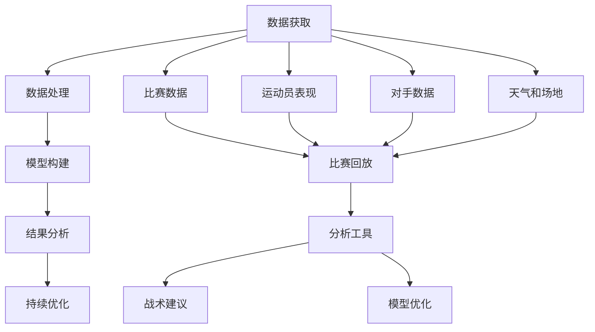

                 

# AI在体育赛事分析中的应用:深化战术理解

在体育赛事中，无论是教练、运动员还是球迷，都对比赛战术有着深刻的理解。随着人工智能（AI）技术的不断进步，AI开始深入到体育赛事分析中，助力战术理解的深化。本文将从背景介绍、核心概念与联系、核心算法原理及操作步骤、数学模型和公式详细讲解、项目实践、实际应用场景、工具和资源推荐、总结未来发展趋势与挑战以及附录等九个方面，全面探讨AI在体育赛事分析中的应用，以及如何通过深度学习和数据分析来深化战术理解。

## 1. 背景介绍

### 1.1 问题由来
现代体育赛事已经不再只是单纯的体力对抗，战术的运用成为决定胜负的关键。AI技术能够通过数据挖掘和分析，为教练和运动员提供战术上的洞察和支持。然而，尽管AI在体育赛事中的应用广泛，但关于AI在赛事分析中如何深化战术理解的研究仍相对较少。

### 1.2 问题核心关键点
AI在体育赛事分析中的核心关键点包括：

- **数据获取**：收集比赛数据、运动员表现数据、对手数据、天气和场地条件等。
- **数据处理**：数据清洗、特征提取、数据可视化等。
- **模型构建**：选择合适的模型进行训练和预测。
- **结果分析**：分析模型的输出结果，提供战术上的建议和改进。
- **持续优化**：根据比赛结果和分析结果，不断优化模型和数据处理流程。

## 2. 核心概念与联系

### 2.1 核心概念概述

为更好地理解AI在体育赛事分析中的应用，我们首先介绍几个核心概念：

- **人工智能（AI）**：一种通过计算机系统模拟人类智能过程的技术，能够处理和分析复杂的数据，从而提供决策支持。
- **机器学习（ML）**：一种AI的分支，通过算法和统计模型，使计算机系统能够从数据中学习，并做出预测或决策。
- **深度学习（DL）**：一种特殊的机器学习方法，通过多层神经网络，能够从大规模数据中提取高级特征，用于图像、语音、文本等多种任务的分析。
- **体育赛事**：包括各种体育项目，如足球、篮球、网球等，涉及复杂的战术和策略。
- **战术理解**：对比赛中的战略、策略和行为进行分析和理解，以指导比赛。

这些概念之间存在紧密的联系，AI通过机器学习和深度学习技术，从大量数据中学习，构建模型，从而深化对体育赛事战术的理解。

### 2.2 核心概念原理和架构的 Mermaid 流程图



这个流程图展示了AI在体育赛事分析中的应用流程。从数据获取开始，通过数据处理、模型构建和结果分析，最终反馈到战术建议和模型优化中，形成闭环。

## 3. 核心算法原理 & 具体操作步骤

### 3.1 算法原理概述

AI在体育赛事分析中的核心算法原理主要基于深度学习和数据分析技术，通过以下步骤实现战术理解的深化：

1. **数据预处理**：收集比赛数据、运动员表现数据、对手数据、天气和场地条件等，并进行清洗和特征提取。
2. **模型构建**：选择适合的深度学习模型，如卷积神经网络（CNN）、循环神经网络（RNN）、长短时记忆网络（LSTM）、注意力机制等。
3. **训练与预测**：使用历史数据对模型进行训练，并通过新数据进行预测，以评估模型的效果。
4. **结果分析**：分析模型的输出结果，提供战术上的建议和改进。
5. **持续优化**：根据比赛结果和分析结果，不断优化模型和数据处理流程。

### 3.2 算法步骤详解

#### 3.2.1 数据获取

数据获取是AI在体育赛事分析中的第一步，包括以下几种数据来源：

- **比赛数据**：通过比赛录像、现场统计数据等方式获取。
- **运动员表现数据**：包括位置、速度、传球次数、射门次数等。
- **对手数据**：包括对手的战术特点、历史表现等。
- **天气和场地条件**：如温度、湿度、场地类型等。

#### 3.2.2 数据处理

数据处理的主要目的是清洗和提取有用的特征。具体步骤包括：

- **数据清洗**：去除无效数据、异常值和噪声，保证数据的准确性。
- **特征提取**：选择和提取有用的特征，如球员的位置、速度、距离、传球成功率等。
- **数据可视化**：使用图表和图形，直观展示数据，帮助理解数据分布和趋势。

#### 3.2.3 模型构建

选择合适的模型是AI分析的核心。在体育赛事中，常用的深度学习模型包括：

- **卷积神经网络（CNN）**：用于图像识别和分析，如通过球员动作的图像分析其状态和表现。
- **循环神经网络（RNN）**：用于处理序列数据，如通过比赛过程的时间序列分析战术变化。
- **长短时记忆网络（LSTM）**：用于处理长期依赖关系的数据，如通过历史比赛数据预测未来的战术选择。
- **注意力机制**：用于关注和提取关键信息，如通过对手的战术特点和表现，调整自己的战术策略。

#### 3.2.4 训练与预测

使用历史数据对模型进行训练，并通过新数据进行预测。训练过程包括以下几个步骤：

- **数据划分**：将数据分为训练集、验证集和测试集。
- **模型训练**：使用训练集对模型进行训练，调整模型参数，使其适应数据。
- **模型评估**：使用验证集评估模型的效果，选择最优模型。
- **预测**：使用测试集对模型进行预测，评估其准确性和鲁棒性。

#### 3.2.5 结果分析

结果分析的目的是从模型输出中提取战术建议和改进措施。具体步骤包括：

- **输出结果解读**：解读模型输出，理解其代表的战术特点和策略。
- **战术建议**：根据输出结果，提供针对性的战术建议，如球员位置、传球策略、防守方式等。
- **改进措施**：根据分析结果，提出改进措施，如调整训练方案、优化战术组合等。

#### 3.2.6 持续优化

持续优化是确保AI分析效果的重要步骤。具体步骤包括：

- **反馈机制**：收集比赛结果和战术反馈，反馈到模型训练和数据处理中。
- **模型更新**：根据反馈，不断更新模型和数据处理流程，提高分析效果。
- **算法优化**：选择和尝试不同的算法和模型，寻找最优解决方案。

### 3.3 算法优缺点

#### 3.3.1 优点

1. **数据驱动**：基于大量数据，AI能够提供更加客观和准确的战术建议。
2. **自动化**：AI可以自动进行数据处理和模型训练，提高效率。
3. **全面分析**：AI能够处理和分析复杂数据，涵盖多个维度和层面。
4. **持续优化**：AI能够根据反馈不断优化，保持分析效果的提升。

#### 3.3.2 缺点

1. **数据依赖**：AI的效果高度依赖数据质量，数据不完整或不准确会影响分析结果。
2. **模型复杂**：深度学习模型的训练复杂度高，需要大量计算资源。
3. **结果可解释性**：AI模型的输出结果难以解释，难以理解其决策过程。
4. **对抗性**：AI模型容易受到对抗样本的干扰，影响分析结果的可靠性。

### 3.4 算法应用领域

AI在体育赛事分析中的应用领域广泛，包括：

- **比赛战术分析**：分析比赛中战术的运用和效果，提供战术改进建议。
- **运动员表现评估**：通过深度学习模型评估运动员的表现，提供训练和比赛建议。
- **对手分析**：分析对手的战术特点和表现，提供针对性的战术策略。
- **训练方案优化**：根据AI分析结果，优化训练方案，提高运动员的竞技水平。
- **伤病预测**：通过AI分析，预测运动员的伤病风险，提供预防措施。

## 4. 数学模型和公式 & 详细讲解 & 举例说明

### 4.1 数学模型构建

在体育赛事分析中，常用的数学模型包括：

- **线性回归模型**：用于预测比赛结果和运动员表现。
- **决策树模型**：用于分类和决策，如判断是否采取某种战术。
- **支持向量机（SVM）**：用于分类和回归分析，如分析球员的表现和战术效果。
- **随机森林（RF）**：用于处理和分析复杂数据，如对手的表现和战术变化。

### 4.2 公式推导过程

以线性回归模型为例，推导其公式。假设输入为 $X$，输出为 $Y$，模型为 $Y=f(X;\theta)$，其中 $\theta$ 为模型参数。

根据线性回归模型，我们有：

$$
Y = \theta_0 + \theta_1X_1 + \theta_2X_2 + \ldots + \theta_nX_n
$$

其中 $\theta_0, \theta_1, \theta_2, \ldots, \theta_n$ 为模型参数，$X_1, X_2, \ldots, X_n$ 为输入特征。

最小二乘法用于求解线性回归模型的参数 $\theta$：

$$
\theta = (X^TX)^{-1}X^TY
$$

具体步骤如下：

1. **数据准备**：将数据分为训练集和测试集。
2. **模型训练**：使用训练集，通过最小二乘法求解模型参数 $\theta$。
3. **模型评估**：使用测试集评估模型效果，计算均方误差（MSE）等指标。
4. **预测**：使用模型对新数据进行预测，评估其准确性。

### 4.3 案例分析与讲解

以足球比赛为例，使用线性回归模型预测比赛结果。假设输入为：

- **球员表现**：传球次数、射门次数、进球数等。
- **战术变化**：控球率、传球成功率等。

输出为比赛结果，即获胜概率。模型如下：

$$
P(\text{胜}) = \theta_0 + \theta_1\text{传球次数} + \theta_2\text{射门次数} + \theta_3\text{进球数} + \theta_4\text{控球率} + \theta_5\text{传球成功率}
$$

使用训练集训练模型，求解参数 $\theta$。假设得到 $\theta = [\theta_0, \theta_1, \theta_2, \theta_3, \theta_4, \theta_5]$，则可以使用该模型对新比赛进行预测。

## 5. 项目实践：代码实例和详细解释说明

### 5.1 开发环境搭建

在进行AI在体育赛事分析中的应用时，需要搭建开发环境。以下是Python环境的搭建步骤：

1. 安装Anaconda：从官网下载并安装Anaconda，用于创建独立的Python环境。

2. 创建并激活虚拟环境：
```bash
conda create -n myenv python=3.8
conda activate myenv
```

3. 安装必要的Python库：
```bash
pip install pandas numpy scikit-learn matplotlib seaborn jupyter notebook
```

4. 安装深度学习框架：
```bash
pip install tensorflow keras pytorch
```

5. 安装数据分析库：
```bash
pip install scikit-learn pandas matplotlib seaborn
```

完成上述步骤后，即可在虚拟环境中进行AI项目的开发和测试。

### 5.2 源代码详细实现

下面以线性回归模型为例，展示如何使用Python进行数据处理和模型训练。

```python
import pandas as pd
import numpy as np
from sklearn.linear_model import LinearRegression
from sklearn.model_selection import train_test_split
from sklearn.metrics import mean_squared_error

# 读取数据
data = pd.read_csv('match_data.csv')

# 数据预处理
X = data[['传球次数', '射门次数', '进球数', '控球率', '传球成功率']]
Y = data['获胜概率']

# 数据划分
X_train, X_test, Y_train, Y_test = train_test_split(X, Y, test_size=0.2, random_state=42)

# 模型训练
model = LinearRegression()
model.fit(X_train, Y_train)

# 模型评估
Y_pred = model.predict(X_test)
mse = mean_squared_error(Y_test, Y_pred)
print('均方误差:', mse)

# 模型预测
new_data = pd.DataFrame({
    '传球次数': [100, 90, 80],
    '射门次数': [10, 8, 5],
    '进球数': [2, 1, 0],
    '控球率': [60, 70, 65],
    '传球成功率': [85, 90, 95]
})
print('比赛结果预测:', model.predict(new_data))
```

### 5.3 代码解读与分析

以上代码展示了从数据读取、预处理、模型训练、评估和预测的全过程。

- **数据读取**：使用pandas库读取CSV格式的数据文件。
- **数据预处理**：选择和提取有用的特征，并将其转换为NumPy数组。
- **模型训练**：使用scikit-learn库的LinearRegression模型对数据进行训练，并计算损失函数。
- **模型评估**：使用均方误差（MSE）评估模型效果，MSE越小表示模型越准确。
- **模型预测**：使用训练好的模型对新数据进行预测，并输出预测结果。

## 6. 实际应用场景

### 6.1 比赛战术分析

通过AI对比赛数据进行分析，可以深入了解战术的运用和效果。具体应用场景包括：

- **战术组合分析**：分析不同战术组合的效果，选择最优的战术组合。
- **球员表现评估**：评估球员在比赛中的表现，提供针对性的训练建议。
- **对手分析**：分析对手的战术特点和表现，提供针对性的应对策略。

### 6.2 运动员表现评估

AI可以用于运动员表现评估，帮助教练和团队更好地了解运动员的状态和能力。具体应用场景包括：

- **技能分析**：分析球员的技能和表现，提供训练建议。
- **伤病预测**：预测球员的伤病风险，提供预防措施。
- **表现跟踪**：跟踪球员的表现，评估其进步和改进。

### 6.3 战术改进

AI可以提供战术改进的建议，帮助教练和团队优化战术策略。具体应用场景包括：

- **战术优化**：分析战术的效果，提出改进建议。
- **比赛调整**：根据对手的表现和比赛情况，调整战术策略。
- **训练方案优化**：根据AI分析结果，优化训练方案，提高运动员的竞技水平。

### 6.4 未来应用展望

未来，AI在体育赛事分析中的应用将更加广泛和深入。以下是一些未来的发展趋势：

- **数据自动化采集**：通过物联网和传感器技术，自动采集比赛和训练数据，减少人工成本。
- **多模态数据融合**：将图像、视频、语音等多模态数据与文本数据进行融合，提升分析效果。
- **实时分析**：使用流式数据处理技术，实现实时分析和决策支持。
- **深度学习模型优化**：引入更多先进的深度学习模型和算法，提升分析效果。

## 7. 工具和资源推荐

### 7.1 学习资源推荐

为了帮助开发者系统掌握AI在体育赛事分析中的应用，推荐以下学习资源：

1. **《深度学习基础》**：讲解深度学习基础，包括神经网络、反向传播、优化器等。
2. **《机器学习实战》**：通过实际项目，讲解机器学习模型的构建和应用。
3. **Kaggle**：提供大量数据集和竞赛，实践AI在体育赛事分析中的应用。
4. **Coursera**：提供机器学习、深度学习等课程，深入学习AI技术。
5. **Scikit-learn官方文档**：提供详细的API和示例，帮助理解机器学习模型的实现。

### 7.2 开发工具推荐

以下是几款用于AI在体育赛事分析应用的常用工具：

1. **Jupyter Notebook**：用于编写和运行Python代码，支持数据可视化。
2. **TensorFlow**：深度学习框架，支持多种深度学习模型的构建和训练。
3. **Keras**：高级深度学习框架，简单易用，适合快速原型开发。
4. **Pandas**：数据处理库，支持数据的清洗、处理和分析。
5. **Matplotlib**：数据可视化库，支持绘制图表和图形。

### 7.3 相关论文推荐

以下是几篇关于AI在体育赛事分析中的研究论文，推荐阅读：

1. **《基于深度学习的体育赛事分析》**：介绍深度学习在体育赛事分析中的应用。
2. **《足球比赛战术分析的机器学习模型》**：分析机器学习模型在足球比赛战术分析中的应用。
3. **《AI在体育赛事中的数据驱动分析》**：探讨AI在体育赛事中的数据驱动分析方法。
4. **《基于大数据的体育赛事预测》**：研究大数据在体育赛事预测中的应用。

## 8. 总结：未来发展趋势与挑战

### 8.1 研究成果总结

AI在体育赛事分析中的应用取得了显著成果，包括：

1. **数据驱动的战术分析**：通过大量数据训练深度学习模型，提供战术分析和改进建议。
2. **运动员表现评估**：使用AI模型评估运动员的表现，提供训练和比赛建议。
3. **对手分析**：分析对手的战术特点和表现，提供针对性的应对策略。

### 8.2 未来发展趋势

未来，AI在体育赛事分析中的发展趋势包括：

1. **数据自动化采集**：通过物联网和传感器技术，自动采集比赛和训练数据。
2. **多模态数据融合**：将图像、视频、语音等多模态数据与文本数据进行融合，提升分析效果。
3. **实时分析**：使用流式数据处理技术，实现实时分析和决策支持。
4. **深度学习模型优化**：引入更多先进的深度学习模型和算法，提升分析效果。

### 8.3 面临的挑战

尽管AI在体育赛事分析中的应用取得了显著进展，但仍面临以下挑战：

1. **数据质量问题**：数据不完整或不准确会影响分析结果，需要进一步提升数据采集和处理能力。
2. **模型复杂度**：深度学习模型训练复杂度高，需要大量计算资源，如何优化模型和提高效率是关键问题。
3. **结果可解释性**：AI模型的输出结果难以解释，难以理解其决策过程，需要进一步提升模型的可解释性。
4. **对抗样本问题**：AI模型容易受到对抗样本的干扰，影响分析结果的可靠性，需要进一步提升模型的鲁棒性。

### 8.4 研究展望

未来，AI在体育赛事分析中的应用需要从以下几个方面进行研究：

1. **数据自动化采集**：通过物联网和传感器技术，自动采集比赛和训练数据。
2. **多模态数据融合**：将图像、视频、语音等多模态数据与文本数据进行融合，提升分析效果。
3. **实时分析**：使用流式数据处理技术，实现实时分析和决策支持。
4. **深度学习模型优化**：引入更多先进的深度学习模型和算法，提升分析效果。

## 9. 附录：常见问题与解答

**Q1: AI在体育赛事分析中的数据来源有哪些？**

A: AI在体育赛事分析中的数据来源包括比赛数据、运动员表现数据、对手数据、天气和场地条件等。

**Q2: AI在体育赛事分析中如何构建模型？**

A: AI在体育赛事分析中通常使用深度学习模型，如卷积神经网络（CNN）、循环神经网络（RNN）、长短时记忆网络（LSTM）等。

**Q3: AI在体育赛事分析中的优势和劣势是什么？**

A: AI在体育赛事分析中的优势包括数据驱动、自动化、全面分析和持续优化。劣势包括数据依赖、模型复杂、结果可解释性和对抗性问题。

**Q4: AI在体育赛事分析中如何处理数据？**

A: AI在体育赛事分析中通常进行数据清洗、特征提取和数据可视化等处理。

**Q5: AI在体育赛事分析中的未来发展方向是什么？**

A: AI在体育赛事分析中的未来发展方向包括数据自动化采集、多模态数据融合、实时分析和深度学习模型优化。

---

作者：禅与计算机程序设计艺术 / Zen and the Art of Computer Programming

