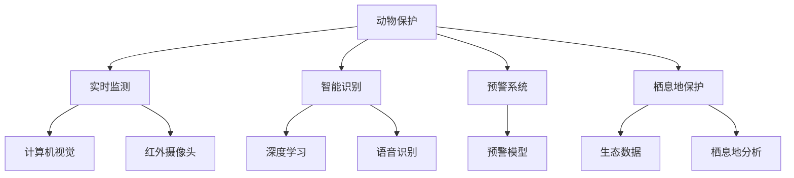

                 

# AI在动物保护中的应用：监测与反偷猎

> 关键词：AI, 动物保护, 反偷猎, 监测, 机器学习

## 1. 背景介绍

### 1.1 问题由来

全球生物多样性面临严峻威胁，偷猎、非法贸易、栖息地破坏等活动对许多濒危物种构成巨大挑战。特别是非法野生动物贸易，不仅威胁到物种的存续，也严重破坏了生态平衡。据估计，每年超过1000种物种因非法贸易而灭绝或面临绝境。在这样的背景下，利用先进技术手段，特别是人工智能(AI)，开展动物保护工作显得尤为重要。

AI技术，尤其是计算机视觉、自然语言处理、深度学习等，在动物保护中的应用越来越广泛，涵盖了动物监测、反偷猎、栖息地保护等多个方面。其中，AI在监测与反偷猎方面的应用最为突出。通过实时监测和智能识别，AI不仅可以提高动物保护工作的效率，还能显著降低人力成本，甚至在一些难以到达的地区实现无人工干预的自动保护。

### 1.2 问题核心关键点

AI在动物保护中的应用主要体现在以下几个方面：

1. **实时监测**：利用AI进行视频监控、红外摄像头捕捉、无人机巡查等，实时获取野生动物的动态信息。
2. **智能识别**：通过图像识别和语音识别技术，自动识别并标记偷猎者和非法行为，为打击偷猎提供数据支持。
3. **预警机制**：基于实时监测和智能识别数据，建立预警系统，提前防范偷猎活动。
4. **栖息地保护**：利用AI分析生态数据，预测栖息地变化，制定保护措施，保障生物多样性。

AI技术的应用，不仅能够有效提高动物保护的效率和精准度，还能减少人为干预，保护野生动物免受干扰。

## 2. 核心概念与联系

### 2.1 核心概念概述

为了更好地理解AI在动物保护中的应用，我们需要介绍几个核心概念：

- **动物保护**：旨在维护生物多样性，防止物种灭绝，保护自然环境，以及提高人类对自然和野生动物的保护意识。
- **实时监测**：通过AI技术，如计算机视觉、红外摄像头等，实时捕捉和分析野生动物的行为和环境变化。
- **智能识别**：利用深度学习等AI技术，自动识别和标记偷猎者、非法捕猎活动等，辅助执法机构打击偷猎行为。
- **预警系统**：基于实时监测和智能识别数据，建立预警系统，提前防范偷猎活动，保障野生动物安全。
- **栖息地保护**：利用AI分析生态数据，预测栖息地变化，制定保护措施，保障生物多样性。

这些概念之间的逻辑关系可以通过以下Mermaid流程图来展示：



这个流程图展示了AI在动物保护中的主要应用环节：

1. 实时监测主要依赖计算机视觉和红外摄像头。
2. 智能识别通过深度学习和语音识别技术实现。
3. 预警系统基于实时监测和智能识别数据建立。
4. 栖息地保护基于生态数据分析和栖息地分析。

这些概念共同构成了AI在动物保护中的应用框架，使我们能够更全面地理解和应用AI技术。

## 3. 核心算法原理 & 具体操作步骤
### 3.1 算法原理概述

AI在动物保护中的应用，主要基于机器学习(ML)和深度学习(DL)技术。其核心思想是通过大量的数据训练模型，使模型能够自动学习和识别野生动物行为和环境变化，从而实现实时监测、智能识别和预警等功能的自动化。

在实时监测中，通过摄像头等设备获取野生动物图像或视频，利用计算机视觉技术对图像进行处理和分析，识别动物的位置、数量、行为等信息。在智能识别中，通过深度学习模型对图像和语音数据进行特征提取和分类，自动识别偷猎者和非法行为。在预警系统中，通过对监测和识别数据的综合分析，预测偷猎活动的可能性和趋势，提前采取防范措施。在栖息地保护中，利用AI分析生态数据，预测栖息地变化，制定保护措施。

### 3.2 算法步骤详解

以下是AI在动物保护中具体应用的详细步骤：

**Step 1: 数据收集与预处理**

- 收集大量的野生动物视频、图像、声音等数据，涵盖不同环境和行为模式。
- 对数据进行清洗和标注，去除噪声和无关信息，标注出动物、偷猎者和非法行为等关键目标。

**Step 2: 模型训练与优化**

- 选择合适的深度学习框架和算法，如TensorFlow、PyTorch等。
- 设计合适的模型结构，如卷积神经网络(CNN)、循环神经网络(RNN)、Transformer等，用于实时监测、智能识别和栖息地保护。
- 使用标注好的数据集对模型进行训练，优化模型参数，提高模型准确率和泛化能力。
- 应用正则化技术，如Dropout、L2正则等，防止过拟合。

**Step 3: 实时监测与智能识别**

- 在监测区域部署摄像头、无人机等设备，获取实时视频和图像数据。
- 通过预训练的深度学习模型对图像进行特征提取和分类，实现实时监测和智能识别。
- 使用识别结果，标记偷猎者和非法行为，为执法机构提供数据支持。

**Step 4: 预警系统建立**

- 基于实时监测和智能识别数据，建立预警模型，预测偷猎活动的可能性。
- 设置预警阈值，当预测结果超过阈值时，自动触发预警机制。
- 通过短信、邮件等方式通知相关人员，采取防范措施。

**Step 5: 栖息地保护**

- 收集和分析生态数据，如气候变化、植被覆盖等，预测栖息地变化。
- 基于预测结果，制定和调整保护措施，如植树造林、禁猎区划定等。
- 监测保护措施的实施效果，评估生态系统的恢复情况。

**Step 6: 模型评估与迭代**

- 定期评估模型的性能，如准确率、召回率、F1值等。
- 根据评估结果，调整模型参数和训练数据，进一步优化模型性能。
- 持续收集新数据，更新模型，适应环境变化。

### 3.3 算法优缺点

AI在动物保护中的应用，具有以下优点：

1. **高效性**：自动化处理大量数据，提高工作效率。
2. **精准性**：利用深度学习等技术，提高识别和监测的准确率。
3. **全天候**：实现全天候监测，不受人工因素影响。
4. **低成本**：减少人工干预，降低人力成本。
5. **数据驱动**：基于大量数据训练模型，提升预测和决策的科学性。

同时，也存在一些缺点：

1. **数据依赖**：依赖标注数据进行模型训练，数据收集和标注成本较高。
2. **模型复杂性**：深度学习模型结构复杂，需要大量计算资源。
3. **实时性要求高**：实时监测和预警需要快速响应，对系统硬件要求较高。
4. **隐私和伦理问题**：涉及大量野生动物数据，需要考虑隐私保护和伦理问题。
5. **环境适应性**：模型在不同环境中的表现可能会有差异，需要适应性调整。

## 4. 数学模型和公式 & 详细讲解 & 举例说明
### 4.1 数学模型构建

在AI动物保护的应用中，主要涉及图像处理、特征提取、分类识别等任务。以下是这些任务常用的数学模型和公式：

- **图像处理**：利用卷积神经网络(CNN)对图像进行特征提取和分类。CNN中的卷积层和池化层可以有效地捕捉图像的局部特征，而全连接层则用于分类。

- **特征提取**：利用深度学习模型中的卷积层和池化层，对输入的图像数据进行特征提取。特征提取公式为：
$$
\mathbf{X} = \mathbf{W}^T\mathbf{F}(\mathbf{I})
$$
其中 $\mathbf{X}$ 为提取的特征向量，$\mathbf{W}$ 为权重矩阵，$\mathbf{F}(\mathbf{I})$ 为卷积层输出。

- **分类识别**：利用softmax函数对提取的特征向量进行分类，公式为：
$$
\mathbf{P}(y_i) = \frac{e^{\mathbf{W}^T\mathbf{X}}}{\sum_j e^{\mathbf{W}^T\mathbf{X}_j}}
$$
其中 $\mathbf{P}(y_i)$ 为预测结果，$y_i$ 为类别标签。

### 4.2 公式推导过程

以下是深度学习模型在动物保护中的应用中常用的公式推导过程：

**卷积层公式推导**：
假设输入图像大小为 $m \times n$，卷积核大小为 $k \times k$，卷积步长为 $s$，则卷积层的输出大小为：
$$
\text{output size} = \frac{m-s+1}{s} \times \frac{n-s+1}{s}
$$
其中 $s$ 为卷积步长。

**池化层公式推导**：
假设输入图像大小为 $m \times n$，池化核大小为 $k \times k$，池化步长为 $s$，则池化层的输出大小为：
$$
\text{output size} = \frac{m-s+1}{s} \times \frac{n-s+1}{s}
$$
其中 $s$ 为池化步长。

**softmax函数推导**：
softmax函数将模型输出转化为概率分布，公式为：
$$
\mathbf{P}(y_i) = \frac{e^{\mathbf{W}^T\mathbf{X}}}{\sum_j e^{\mathbf{W}^T\mathbf{X}_j}}
$$
其中 $\mathbf{P}(y_i)$ 为预测结果，$y_i$ 为类别标签。

### 4.3 案例分析与讲解

以反偷猎为例，假设某地区存在偷猎活动，利用AI系统进行实时监测和智能识别：

1. **数据收集与预处理**：
   - 收集大量的偷猎视频数据，对视频进行标注，标记偷猎者和非法行为。
   - 使用数据增强技术，如旋转、缩放、翻转等，扩充训练集。

2. **模型训练与优化**：
   - 设计卷积神经网络模型，使用标注数据进行训练。
   - 应用正则化技术，防止过拟合。
   - 使用交叉验证评估模型性能，选择最优模型。

3. **实时监测与智能识别**：
   - 部署摄像头和无人机，获取实时视频数据。
   - 输入视频数据到训练好的卷积神经网络模型中，提取特征向量。
   - 使用softmax函数对特征向量进行分类，识别偷猎者和非法行为。

4. **预警系统建立**：
   - 根据实时监测和智能识别结果，建立预警模型。
   - 设置预警阈值，当识别出偷猎行为时，自动触发预警。
   - 通知执法机构，采取防范措施。

5. **栖息地保护**：
   - 收集生态数据，分析栖息地变化。
   - 预测栖息地变化趋势，制定和调整保护措施。
   - 监测保护措施的实施效果，评估生态系统的恢复情况。

## 5. 项目实践：代码实例和详细解释说明
### 5.1 开发环境搭建

在进行AI动物保护项目的开发前，需要准备好开发环境。以下是使用Python进行TensorFlow开发的环境配置流程：

1. 安装Anaconda：从官网下载并安装Anaconda，用于创建独立的Python环境。

2. 创建并激活虚拟环境：
```bash
conda create -n ai-env python=3.8 
conda activate ai-env
```

3. 安装TensorFlow：根据CUDA版本，从官网获取对应的安装命令。例如：
```bash
conda install tensorflow -c tensorflow -c conda-forge
```

4. 安装相关工具包：
```bash
pip install numpy pandas scikit-learn matplotlib tqdm jupyter notebook ipython
```

完成上述步骤后，即可在`ai-env`环境中开始开发实践。

### 5.2 源代码详细实现

下面我们以反偷猎为例，给出使用TensorFlow进行AI动物保护任务开发的PyTorch代码实现。

首先，定义数据处理函数：

```python
import tensorflow as tf
from tensorflow.keras.preprocessing.image import ImageDataGenerator
from tensorflow.keras.models import Sequential
from tensorflow.keras.layers import Conv2D, MaxPooling2D, Flatten, Dense

class StealthDetectionModel(tf.keras.Model):
    def __init__(self):
        super(StealthDetectionModel, self).__init__()
        self.conv1 = Conv2D(32, (3, 3), activation='relu', padding='same')
        self.pool1 = MaxPooling2D((2, 2))
        self.conv2 = Conv2D(64, (3, 3), activation='relu', padding='same')
        self.pool2 = MaxPooling2D((2, 2))
        self.conv3 = Conv2D(128, (3, 3), activation='relu', padding='same')
        self.pool3 = MaxPooling2D((2, 2))
        self.flatten = Flatten()
        self.dense1 = Dense(128, activation='relu')
        self.dense2 = Dense(2, activation='softmax')

    def call(self, inputs):
        x = self.conv1(inputs)
        x = self.pool1(x)
        x = self.conv2(x)
        x = self.pool2(x)
        x = self.conv3(x)
        x = self.pool3(x)
        x = self.flatten(x)
        x = self.dense1(x)
        x = self.dense2(x)
        return x
```

然后，定义模型和训练参数：

```python
train_data = tf.data.Dataset.from_tensor_slices((train_images, train_labels))
train_data = train_data.batch(32)

validation_data = tf.data.Dataset.from_tensor_slices((validation_images, validation_labels))
validation_data = validation_data.batch(32)

test_data = tf.data.Dataset.from_tensor_slices((test_images, test_labels))
test_data = test_data.batch(32)

model = StealthDetectionModel()

model.compile(optimizer='adam', loss='categorical_crossentropy', metrics=['accuracy'])

epochs = 10
```

接着，定义训练和评估函数：

```python
def train_model(model, train_data, validation_data, epochs):
    model.fit(train_data, validation_data=validation_data, epochs=epochs)

def evaluate_model(model, test_data):
    test_loss, test_acc = model.evaluate(test_data)
    print('Test accuracy:', test_acc)
```

最后，启动训练流程并在测试集上评估：

```python
train_model(model, train_data, validation_data, epochs)
evaluate_model(model, test_data)
```

以上就是使用TensorFlow进行反偷猎AI模型训练的完整代码实现。可以看到，TensorFlow提供了丰富的深度学习模型和工具库，使得模型训练和评估变得简洁高效。

### 5.3 代码解读与分析

让我们再详细解读一下关键代码的实现细节：

**StealthDetectionModel类**：
- `__init__`方法：初始化模型结构，包括卷积层、池化层、全连接层等。
- `call`方法：定义模型前向传播的过程。

**数据集定义**：
- 使用`tf.data.Dataset`定义数据集，包括训练集、验证集和测试集。
- 使用`batch`方法将数据集分为小批量进行训练。

**模型训练与评估**：
- 使用`compile`方法定义模型编译参数，包括优化器、损失函数和评估指标。
- 使用`fit`方法进行模型训练，并使用`evaluate`方法评估模型性能。

通过TensorFlow的框架，我们可以快速实现一个简单的反偷猎AI模型，并进行训练和评估。当然，实际应用中还需要考虑更多因素，如模型调参、超参数优化、数据增强等。

## 6. 实际应用场景
### 6.1 智能监测系统

智能监测系统是AI在动物保护中应用的重要环节。通过部署摄像头、无人机等设备，实时获取野生动物图像和视频数据，利用深度学习模型进行实时监测和智能识别，可以大大提高动物保护的效率和精准度。

例如，在反偷猎应用中，智能监测系统可以通过识别偷猎者的行为和装备，自动报警并通知执法机构，提高打击偷猎的效率。同时，系统还可以分析监控数据，识别出偷猎热点和规律，辅助执法机构制定更有针对性的打击策略。

### 6.2 数据增强与模型优化

数据增强技术在AI动物保护中的应用，可以极大地提升模型的泛化能力和鲁棒性。通过对训练数据进行旋转、缩放、翻转等操作，生成更多的多样性数据，从而提高模型的泛化能力。

此外，通过模型微调，进一步优化模型的性能，如调整学习率、使用正则化技术等，可以提升模型的识别准确率和鲁棒性。微调模型时，可以使用一小部分标注数据，显著提高模型的性能，同时避免对大量标注数据的依赖。

### 6.3 预警系统

预警系统是AI在动物保护中的重要组成部分。通过实时监测和智能识别数据，建立预警模型，可以提前防范偷猎活动，降低偷猎事件的发生率。

例如，在反偷猎应用中，预警系统可以通过识别偷猎者和非法行为，自动触发报警机制，通知执法机构和相关人员，及时采取防范措施。预警系统还可以分析偷猎热点和时间规律，预测偷猎活动的高发期，提前部署执法力量，提高打击偷猎的效率。

## 7. 工具和资源推荐
### 7.1 学习资源推荐

为了帮助开发者系统掌握AI在动物保护中的应用，这里推荐一些优质的学习资源：

1. **《深度学习》课程**：由斯坦福大学开设的深度学习课程，涵盖了深度学习的基础理论和实践技巧，适合初学者和进阶开发者。
2. **《计算机视觉：算法与应用》**：详细讲解计算机视觉技术和算法，适合对计算机视觉感兴趣的开发者。
3. **《机器学习实战》**：实践性的机器学习书籍，通过大量实例讲解机器学习模型和算法。
4. **《Python深度学习》**：介绍深度学习在Python中的应用，适合使用Python进行深度学习的开发者。
5. **Kaggle竞赛**：参加Kaggle的动物保护相关竞赛，可以锻炼数据处理和模型训练的能力，同时获取最新的数据和算法进展。

通过对这些资源的学习实践，相信你一定能够快速掌握AI在动物保护中的应用方法，并用于解决实际的动物保护问题。

### 7.2 开发工具推荐

高效的开发离不开优秀的工具支持。以下是几款用于AI动物保护开发的常用工具：

1. **TensorFlow**：谷歌开发的深度学习框架，支持分布式计算和GPU加速，适合大规模深度学习任务。
2. **PyTorch**：Facebook开发的深度学习框架，易于使用，支持动态图和GPU加速，适合研究和原型开发。
3. **OpenCV**：开源计算机视觉库，支持图像处理、特征提取等计算机视觉任务。
4. **Jupyter Notebook**：交互式开发环境，适合快速原型开发和实验验证。
5. **Colab**：谷歌提供的在线Jupyter Notebook环境，免费提供GPU/TPU算力，方便开发者快速上手实验最新模型，分享学习笔记。

合理利用这些工具，可以显著提升AI动物保护任务的开发效率，加快创新迭代的步伐。

### 7.3 相关论文推荐

AI在动物保护中的应用研究近年来取得了显著进展，以下是几篇奠基性的相关论文，推荐阅读：

1. **"Deep Learning for Wildlife Poaching Detection: A Survey"**：总结了AI在野生动物监测和反偷猎中的应用现状和未来趋势。
2. **"Stealth Detection Using Deep Learning: A Survey"**：综述了深度学习在隐匿目标检测中的应用，包括反偷猎等。
3. **"Real-Time Object Detection using Faster R-CNN"**：介绍Faster R-CNN算法，用于实时对象检测，适合反偷猎等实时监测任务。
4. **"Deep Learning for Habitat Preservation and Conservation"**：介绍深度学习在栖息地保护中的应用，包括栖息地分类和变化预测。
5. **"Machine Learning for Wildlife Conservation: A Review"**：综述了机器学习在野生动物保护中的应用，包括反偷猎、栖息地保护等。

这些论文代表了AI在动物保护领域的研究方向和最新进展，通过学习这些前沿成果，可以帮助研究者把握学科前进方向，激发更多的创新灵感。

## 8. 总结：未来发展趋势与挑战
### 8.1 研究成果总结

AI在动物保护中的应用，已经取得了显著的进展和突破，主要体现在以下几个方面：

1. **实时监测**：通过部署摄像头和无人机等设备，实时获取野生动物图像和视频数据，实现全天候监测。
2. **智能识别**：利用深度学习模型，自动识别偷猎者和非法行为，为打击偷猎提供数据支持。
3. **预警系统**：建立预警模型，提前防范偷猎活动，降低偷猎事件的发生率。
4. **栖息地保护**：利用AI分析生态数据，预测栖息地变化，制定和调整保护措施。

通过这些应用，AI已经在动物保护领域展现出强大的潜力，提升了保护工作的效率和精准度，降低了人力成本，保护了野生动物的生存环境。

### 8.2 未来发展趋势

展望未来，AI在动物保护中的应用将呈现以下几个发展趋势：

1. **多模态融合**：利用计算机视觉、红外摄像头、无人机等技术，实现多模态数据的融合，提升监测和识别的准确率。
2. **实时分析与决策**：通过实时数据分析，自动化制定保护措施，提高保护工作的效率和科学性。
3. **全球协作**：建立全球范围内的数据共享平台，实现跨区域、跨国家的合作保护。
4. **持续学习与适应**：利用持续学习技术，使模型能够不断适应新的环境变化和威胁，提高保护工作的灵活性。
5. **公众参与**：利用AI技术，通过手机应用等平台，引导公众参与保护工作，增强公众保护意识。

这些趋势将进一步推动AI在动物保护中的应用，提升保护工作的水平和效果。

### 8.3 面临的挑战

尽管AI在动物保护中的应用取得了显著进展，但仍面临诸多挑战：

1. **数据获取与标注**：获取高质量的训练数据和标注数据成本较高，数据标注工作量大。
2. **模型复杂度**：深度学习模型结构复杂，需要大量的计算资源。
3. **隐私与伦理**：涉及大量野生动物数据，需要考虑隐私保护和伦理问题。
4. **环境适应性**：模型在不同环境中的表现可能会有差异，需要适应性调整。
5. **技术普及**：AI技术在动物保护中的应用仍需推广和普及，提高公众对AI技术的接受度和应用能力。

应对这些挑战，需要学术界、产业界和政府的共同努力，推动AI技术在动物保护中的应用和普及。

### 8.4 研究展望

未来，AI在动物保护中的应用需要进一步探索和优化：

1. **数据获取与标注技术**：研究新的数据采集和标注方法，降低数据收集和标注成本，提高数据质量。
2. **模型优化与优化算法**：开发更高效的深度学习模型和优化算法，提高模型的准确率和效率。
3. **伦理与隐私保护**：研究AI技术在动物保护中的应用中的隐私保护和伦理问题，制定相关规范和标准。
4. **全球合作**：推动全球范围内的数据共享和协作保护，建立跨国界的数据平台和保护机制。
5. **公众参与**：利用AI技术，引导公众参与保护工作，提高公众保护意识和参与度。

这些研究方向将进一步推动AI在动物保护中的应用，实现更高效、更科学、更全面的保护工作。

## 9. 附录：常见问题与解答

**Q1: 为什么AI在动物保护中的应用具有重要意义？**

A: AI在动物保护中的应用具有重要意义，主要体现在以下几个方面：
1. **效率提升**：通过自动化处理大量数据，大大提高了保护工作的效率。
2. **精准识别**：利用深度学习等技术，提高了对偷猎者和非法行为的识别准确率。
3. **全天候监测**：实现全天候监测，不受人工因素影响。
4. **低成本**：减少人工干预，降低人力成本。
5. **数据驱动**：基于大量数据训练模型，提升预测和决策的科学性。

**Q2: 如何选择合适的深度学习模型进行动物保护应用？**

A: 选择合适的深度学习模型需要考虑以下几个因素：
1. **任务类型**：根据不同的任务类型（如实时监测、智能识别、预警系统等）选择合适的模型结构。
2. **数据特点**：根据数据的特点（如图像大小、类别数量等）选择合适的模型。
3. **计算资源**：考虑计算资源的限制，选择适合的模型和参数。
4. **性能要求**：根据性能要求（如实时性、准确率等）调整模型结构。

**Q3: 如何处理数据增强技术中的噪声和冗余？**

A: 数据增强技术中的噪声和冗余可以通过以下方法处理：
1. 去除噪声：在数据预处理阶段，使用滤波器、去噪算法等去除图像和视频中的噪声。
2. 减少冗余：通过数据筛选、去重等方法，去除数据集中的冗余数据，提高数据质量。
3. 数据增强策略：使用合适的数据增强策略，如旋转、缩放、翻转等，生成更多的多样性数据。
4. 增强模型鲁棒性：使用正则化技术、Dropout等方法，提高模型的鲁棒性，减少噪声和冗余对模型的影响。

**Q4: 如何平衡模型的准确率和实时性？**

A: 平衡模型的准确率和实时性，需要考虑以下几个因素：
1. 调整模型结构：通过调整模型结构，如减少卷积层和池化层，增加全连接层，可以在一定程度上提升实时性。
2. 优化算法：选择高效的优化算法，如AdamW、SGD等，可以在保证准确率的前提下提升训练速度。
3. 数据增强：通过数据增强技术，生成更多的多样性数据，提高模型的泛化能力，从而提升实时性。
4. 硬件优化：使用GPU、TPU等高性能设备，提升计算速度，优化实时性。

**Q5: 如何处理模型的过拟合问题？**

A: 处理模型的过拟合问题，可以采取以下方法：
1. 数据增强：通过数据增强技术，生成更多的多样性数据，提高模型的泛化能力。
2. 正则化技术：使用L2正则、Dropout等方法，防止模型过拟合。
3. 早停策略：设置早停阈值，当模型在验证集上表现不佳时，停止训练，避免过拟合。
4. 模型集成：通过模型集成技术，组合多个模型的预测结果，降低过拟合风险。

通过以上方法，可以有效地处理模型的过拟合问题，提升模型的泛化能力和鲁棒性。

