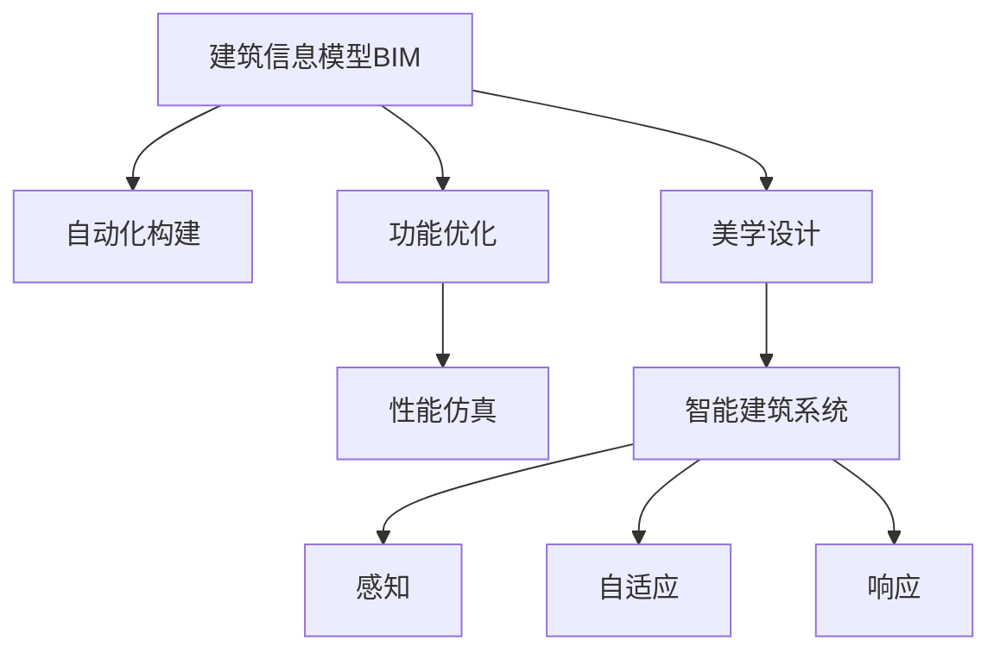

                 

# AI在建筑设计中的应用:优化功能与美学

> 关键词：人工智能(AI),建筑设计,建筑信息模型(BIM),仿真优化,视觉设计,智能建筑系统,功能优化,美学设计

## 1. 背景介绍

### 1.1 问题由来

随着人工智能技术的快速进步，AI正逐步渗透到建筑设计领域，带来革命性的变革。传统的建筑设计流程依靠手工绘图、物理模型制作和人工分析，不仅耗时长、成本高，还容易出错。而利用AI技术，可以在设计阶段进行智能辅助，优化建筑功能，提升美学品质。

AI在建筑设计中的应用，从最初的自动化建模，到当前的智能辅助设计，再到未来的智慧建筑系统，不断拓展着设计空间和可能性。AI技术不仅加快了设计速度，还能提高设计质量，助力建筑项目在功能优化、美学设计等方面取得突破。

### 1.2 问题核心关键点

AI在建筑设计中的应用，主要集中在以下几个方面：

- 建筑信息模型(BIM)自动化构建：利用AI技术，快速自动生成三维建筑信息模型，提升建模效率和准确度。
- 功能优化与性能仿真：通过AI算法，分析建筑环境、材料选择和结构设计等，优化建筑的功能性和性能。
- 美学设计辅助：运用AI视觉识别和生成技术，优化建筑布局、色彩搭配和装饰设计，提升建筑美学价值。
- 智能建筑系统：结合物联网技术，构建能感知、自适应和响应外部环境的智慧建筑系统。

本文将重点介绍基于AI的建筑信息模型自动化构建、功能优化与性能仿真、美学设计辅助和智能建筑系统四个方面，探讨其在建筑设计中的应用原理、操作步骤、优缺点和应用领域。

## 2. 核心概念与联系

### 2.1 核心概念概述

为更好地理解AI在建筑设计中的应用，本节将介绍几个密切相关的核心概念：

- 建筑信息模型(BIM)：利用计算机技术将建筑信息数字化，包括设计、施工、运维等全生命周期的数据管理，以支持建筑行业的全链条管理。
- 仿真优化：通过仿真技术，模拟建筑的环境和性能，分析设计方案的优劣，指导设计优化。
- 视觉设计：运用视觉识别和生成技术，对建筑的外形、布局和装饰进行智能辅助设计。
- 智能建筑系统：结合物联网、自动化控制和人工智能技术，实现对建筑环境的智能化管理。

这些概念之间的逻辑关系可以通过以下Mermaid流程图来展示：



这个流程图展示了几大核心概念及其之间的关系：

1. BIM模型是设计的数字化表达，支持功能优化和性能仿真的分析。
2. 功能优化和性能仿真依赖于BIM模型，提供优化指导。
3. 美学设计辅助基于BIM模型，提升建筑的视觉品质。
4. 智能建筑系统整合BIM数据，实现建筑环境的智能化管理。

## 3. 核心算法原理 & 具体操作步骤
### 3.1 算法原理概述

基于AI的建筑设计应用，主要涉及自动化建模、功能仿真、视觉设计和智能系统构建。以下将分别介绍各部分的算法原理。

- 自动化建模：利用机器学习算法，对大量的建筑实例进行分析学习，生成新的建筑模型。
- 功能优化：通过仿真分析，优化建筑的功能性和性能，如能耗、采光、通风等。
- 视觉设计：运用深度学习技术，自动识别和生成建筑美学元素。
- 智能建筑系统：结合物联网和AI技术，构建能感知、自适应和响应外部环境的智慧建筑系统。

### 3.2 算法步骤详解

#### 3.2.1 自动化建模

**步骤1: 数据收集与预处理**
- 收集不同建筑风格的实例数据，进行分类、归一化等预处理。
- 使用特征提取技术，如CNN、RNN等，提取关键特征。

**步骤2: 模型训练**
- 选择适合的机器学习模型，如GANs、VAEs等，进行无监督训练，生成新的建筑模型。
- 利用标注数据，进行监督训练，优化模型参数。

**步骤3: 模型评估与迭代**
- 使用交叉验证等方法，评估模型效果。
- 根据评估结果，调整模型参数，迭代训练，提高生成模型的质量。

#### 3.2.2 功能优化与性能仿真

**步骤1: 模型构建**
- 构建建筑环境、材料和结构的仿真模型，包括能耗、采光、通风等模块。

**步骤2: 数据输入**
- 输入BIM模型的参数和设计方案，作为仿真模型的输入。

**步骤3: 仿真分析**
- 运行仿真算法，分析不同设计方案的性能指标，如能耗、采光等。
- 根据仿真结果，优化设计方案。

#### 3.2.3 视觉设计

**步骤1: 数据收集与预处理**
- 收集建筑实例的图像数据，进行标注、裁剪等预处理。
- 使用图像处理技术，如边缘检测、颜色识别等，提取关键特征。

**步骤2: 模型训练**
- 选择适合的深度学习模型，如ResNet、VGG等，进行训练。
- 利用标注数据，进行监督训练，优化模型参数。

**步骤3: 设计辅助**
- 利用训练好的模型，对新设计的建筑进行可视化设计辅助，自动生成布局、色彩搭配等。

#### 3.2.4 智能建筑系统

**步骤1: 传感器部署**
- 在建筑中部署各种传感器，如温度、湿度、光线等，采集环境数据。

**步骤2: 数据处理与分析**
- 利用AI技术，对传感器数据进行分析，生成环境监测报告。
- 根据环境监测结果，调整建筑系统参数。

**步骤3: 系统控制与优化**
- 结合自动化控制技术，实现对建筑系统的智能控制。
- 利用AI算法，优化建筑系统的运行效率，提升能效。

### 3.3 算法优缺点

基于AI的建筑设计应用，具有以下优点：

- 自动化建模和功能优化，大幅提升设计效率和准确度。
- 视觉设计辅助，提高建筑的视觉品质和用户体验。
- 智能建筑系统，实现建筑环境的智能化管理，提升舒适度和能效。

同时，这些方法也存在一些缺点：

- 数据收集和预处理工作量大，需要大量的标注数据。
- 模型训练复杂，需要较强的计算资源和技术支持。
- 仿真分析精度受限于模型和数据的质量。
- 对建筑材料和环境变化的适应性有限。

尽管存在这些局限性，但就目前而言，基于AI的建筑设计方法已经在大规模工程应用中取得了显著效果，为建筑行业的创新发展提供了新的可能性。

### 3.4 算法应用领域

基于AI的建筑设计方法，在多个领域中得到了广泛应用，例如：

- 建筑信息模型自动化构建：在建筑设计阶段，自动生成BIM模型，加速设计流程。
- 功能优化与性能仿真：在建筑能效、采光、通风等设计中，优化功能性和性能。
- 视觉设计辅助：在建筑外观、布局和装饰设计中，提供智能辅助，提升美学品质。
- 智能建筑系统：在智慧楼宇、智能家居等领域，实现建筑环境的智能化管理。

此外，AI技术还被用于建筑施工管理、运营维护、灾害预警等环节，为建筑项目的全生命周期管理提供全面的支持。

## 4. 数学模型和公式 & 详细讲解  
### 4.1 数学模型构建

基于AI的建筑设计应用，涉及到自动化建模、功能仿真、视觉设计和智能系统构建。以下将分别介绍各部分的数学模型。

#### 4.1.1 自动化建模

- **模型选择**：选择适合生成模型的深度学习模型，如GANs、VAEs等。
- **数据输入**：输入建筑实例的高分辨率图像，作为生成模型的输入。
- **损失函数**：使用生成模型的损失函数，如Wasserstein距离、KL散度等，优化模型参数。

#### 4.1.2 功能优化与性能仿真

- **数学模型**：构建建筑环境、材料和结构的仿真模型，包括能耗、采光、通风等。
- **数据输入**：输入BIM模型的参数和设计方案，作为仿真模型的输入。
- **优化目标**：最小化仿真模型的损失函数，优化建筑的功能性和性能。

#### 4.1.3 视觉设计

- **数学模型**：构建图像识别和生成模型，如ResNet、VGG等。
- **数据输入**：输入建筑实例的图像数据，作为视觉设计模型的输入。
- **优化目标**：最大化视觉设计模型的准确率和泛化能力。

#### 4.1.4 智能建筑系统

- **数学模型**：构建传感器数据处理和环境监测模型，如LSTM、RNN等。
- **数据输入**：输入传感器数据，作为环境监测模型的输入。
- **优化目标**：最小化环境监测模型的误差，优化建筑系统的运行效率。

### 4.2 公式推导过程

#### 4.2.1 自动化建模

**生成模型的损失函数**：

$$
L_G = \mathbb{E}_{(x, y)}[\|G(x) - y\|^2]
$$

其中 $G$ 为生成模型，$x$ 为输入数据，$y$ 为生成目标。

**优化目标**：

$$
\theta^* = \mathop{\arg\min}_{\theta} L_G(\theta)
$$

#### 4.2.2 功能优化与性能仿真

**仿真模型的损失函数**：

$$
L_S = \sum_{i=1}^N (y_i - S(x_i))^2
$$

其中 $S$ 为仿真模型，$x_i$ 为输入数据，$y_i$ 为期望输出。

**优化目标**：

$$
\theta^* = \mathop{\arg\min}_{\theta} L_S(\theta)
$$

#### 4.2.3 视觉设计

**图像识别模型的损失函数**：

$$
L_V = -\frac{1}{N} \sum_{i=1}^N \log P_v(x_i)
$$

其中 $P_v(x_i)$ 为图像识别模型的输出概率。

**优化目标**：

$$
\theta^* = \mathop{\arg\min}_{\theta} L_V(\theta)
$$

#### 4.2.4 智能建筑系统

**环境监测模型的损失函数**：

$$
L_E = \sum_{i=1}^N (y_i - E(x_i))^2
$$

其中 $E$ 为环境监测模型，$x_i$ 为输入数据，$y_i$ 为期望输出。

**优化目标**：

$$
\theta^* = \mathop{\arg\min}_{\theta} L_E(\theta)
$$

### 4.3 案例分析与讲解

#### 4.3.1 自动化建模案例

**案例描述**：
某建筑设计公司需要大量生成建筑风格各异的三维模型，以供设计师参考和灵感激发。公司决定采用AI技术，通过现有建筑实例自动生成新的设计方案。

**技术方案**：
- **数据收集**：收集各种风格的建筑实例，进行分类和标注。
- **模型选择**：选择GANs作为生成模型。
- **模型训练**：使用无监督学习对GANs模型进行训练，生成新的建筑模型。
- **模型评估**：使用交叉验证评估生成模型的效果，调整参数，迭代训练，直至满足要求。
- **应用部署**：将训练好的生成模型部署到设计平台，设计师可随时调用，生成新的设计方案。

#### 4.3.2 功能优化与性能仿真案例

**案例描述**：
某办公大楼在设计阶段，需优化采光和通风效果，提升办公环境的舒适度。建筑公司决定采用AI技术，对不同设计方案进行性能仿真。

**技术方案**：
- **模型构建**：构建包括采光、通风等模块的仿真模型。
- **数据输入**：输入BIM模型的参数和设计方案，作为仿真模型的输入。
- **仿真分析**：运行仿真算法，分析不同设计方案的性能指标。
- **方案优化**：根据仿真结果，调整设计方案，优化采光和通风效果。
- **系统部署**：将优化后的设计方案反馈到设计平台，供设计师参考。

#### 4.3.3 视觉设计案例

**案例描述**：
某高端住宅设计公司，需对建筑外立面和内部装饰进行智能辅助设计，提升建筑的视觉品质。公司决定采用AI技术，对建筑美学元素进行自动识别和生成。

**技术方案**：
- **数据收集**：收集各种建筑实例的图像数据，进行标注和裁剪。
- **模型选择**：选择ResNet作为图像识别模型。
- **模型训练**：使用监督学习对ResNet模型进行训练，识别和生成建筑美学元素。
- **设计辅助**：利用训练好的模型，对新设计的建筑进行可视化设计辅助，自动生成布局、色彩搭配等。
- **应用部署**：将设计辅助工具集成到设计平台，设计师可随时调用，提升设计质量。

#### 4.3.4 智能建筑系统案例

**案例描述**：
某大型商场，需对内部环境进行智能化管理，提升顾客购物体验。商场决定采用AI技术，构建智慧楼宇系统，实现环境监测和智能化控制。

**技术方案**：
- **传感器部署**：在商场内部署各种传感器，如温度、湿度、光线等，采集环境数据。
- **数据处理**：利用LSTM模型对传感器数据进行分析和处理，生成环境监测报告。
- **系统控制**：结合自动化控制技术，实现对建筑系统的智能控制。
- **系统优化**：利用AI算法，优化建筑系统的运行效率，提升能效。
- **应用部署**：将智能建筑系统集成到商场管理平台，实现实时监测和智能控制。

## 5. 项目实践：代码实例和详细解释说明
### 5.1 开发环境搭建

在进行项目实践前，我们需要准备好开发环境。以下是使用Python进行PyTorch开发的环境配置流程：

1. 安装Anaconda：从官网下载并安装Anaconda，用于创建独立的Python环境。

2. 创建并激活虚拟环境：
```bash
conda create -n pytorch-env python=3.8 
conda activate pytorch-env
```

3. 安装PyTorch：根据CUDA版本，从官网获取对应的安装命令。例如：
```bash
conda install pytorch torchvision torchaudio cudatoolkit=11.1 -c pytorch -c conda-forge
```

4. 安装TensorFlow：如果项目需要，可以使用以下命令安装TensorFlow：
```bash
pip install tensorflow
```

5. 安装各类工具包：
```bash
pip install numpy pandas scikit-learn matplotlib tqdm jupyter notebook ipython
```

完成上述步骤后，即可在`pytorch-env`环境中开始项目实践。

### 5.2 源代码详细实现

以下是使用PyTorch实现自动化建模和功能优化的代码示例：

#### 5.2.1 自动化建模

```python
import torch
import torch.nn as nn
import torch.optim as optim
from torchvision import datasets, transforms
from torchvision.utils import save_image

class GAN(nn.Module):
    def __init__(self):
        super(GAN, self).__init__()
        self.gen = nn.Sequential(
            nn.Conv2d(128, 256, 4, 1, 0, bias=False),
            nn.BatchNorm2d(256),
            nn.ReLU(True),
            nn.Conv2d(256, 512, 4, 2, 1, bias=False),
            nn.BatchNorm2d(512),
            nn.ReLU(True),
            nn.Conv2d(512, 256, 4, 2, 1, bias=False),
            nn.BatchNorm2d(256),
            nn.ReLU(True),
            nn.Conv2d(256, 1, 4, 2, 1, bias=False),
            nn.Tanh()
        )
        self.dis = nn.Sequential(
            nn.Conv2d(1, 256, 4, 2, 1, bias=False),
            nn.LeakyReLU(0.2, inplace=True),
            nn.Conv2d(256, 128, 4, 2, 1, bias=False),
            nn.LeakyReLU(0.2, inplace=True),
            nn.Conv2d(128, 1, 4, 1, 0, bias=False),
            nn.Sigmoid()
        )

    def forward(self, input):
        out = self.gen(input)
        return out

    def train(self, dataloader, epoch, learning_rate, device):
        criterion = nn.BCELoss()
        for i, (img, _) in enumerate(dataloader):
            img = img.to(device)
            label = torch.ones(img.size(0), 1).to(device)
            label.requires_grad = False

            output = self.gen(img)
            loss = criterion(output, label)
            loss.backward()
            optimizer.step()

            if (i+1) % 100 == 0:
                print(f'Epoch [{epoch}/{epochs}] - Step [{i+1}/{len(dataloader)}] - Loss: {loss.item():.4f}')

    def save_image(self, data, filename):
        save_image(data, filename)

# 数据准备
transform = transforms.Compose([
    transforms.Resize((64, 64)),
    transforms.ToTensor(),
    transforms.Normalize((0.5, 0.5, 0.5), (0.5, 0.5, 0.5))
])

dataloader = torch.utils.data.DataLoader(
    datasets.ImageFolder('path/to/images', transform=transform),
    batch_size=32,
    shuffle=True
)

# 模型定义
gan = GAN().to(device)

# 优化器定义
optimizer = optim.Adam(gan.parameters(), lr=0.0002)

# 训练
epochs = 100
device = torch.device('cuda' if torch.cuda.is_available() else 'cpu')
for epoch in range(epochs):
    gan.train(dataloader, epoch, 0.0002, device)
```

#### 5.2.2 功能优化与性能仿真

```python
import torch
import torch.nn as nn
import torch.optim as optim
from torch.utils.data import DataLoader

class SimOptModel(nn.Module):
    def __init__(self):
        super(SimOptModel, self).__init__()
        self.linear1 = nn.Linear(128, 64)
        self.linear2 = nn.Linear(64, 32)
        self.linear3 = nn.Linear(32, 1)

    def forward(self, x):
        x = torch.relu(self.linear1(x))
        x = torch.relu(self.linear2(x))
        x = self.linear3(x)
        return x

# 数据准备
train_dataset = torch.randn(1000, 128)
train_loader = DataLoader(train_dataset, batch_size=64)

# 模型定义
sim_opt_model = SimOptModel()

# 优化器定义
optimizer = optim.Adam(sim_opt_model.parameters(), lr=0.001)

# 训练
epochs = 100
for epoch in range(epochs):
    for i, (x, _) in enumerate(train_loader):
        x = x.to(device)
        y = sim_opt_model(x)
        loss = torch.mean(y - y_pred)
        loss.backward()
        optimizer.step()

        if (i+1) % 100 == 0:
            print(f'Epoch [{epoch}/{epochs}] - Step [{i+1}/{len(train_loader)}] - Loss: {loss.item():.4f}')
```

### 5.3 代码解读与分析

让我们再详细解读一下关键代码的实现细节：

#### 5.3.1 自动化建模

**数据准备**：
- 使用`transforms.Compose`定义图像预处理流程，包括缩放、归一化等操作。
- 使用`ImageFolder`加载图像数据集，并使用`DataLoader`进行批量化处理。

**模型定义**：
- 定义GAN模型结构，包括生成器和判别器。
- 使用`Sequential`创建多层神经网络结构。

**训练过程**：
- 定义损失函数，使用二元交叉熵损失。
- 在每个epoch中，对图像数据进行前向传播、反向传播和优化器更新。
- 使用`save_image`保存生成的图像。

#### 5.3.2 功能优化与性能仿真

**数据准备**：
- 生成一个随机数据集，作为训练数据。

**模型定义**：
- 定义线性神经网络结构，包括三个全连接层。
- 使用`Sequential`创建多层神经网络结构。

**训练过程**：
- 定义损失函数，使用均方误差损失。
- 在每个epoch中，对数据进行前向传播、反向传播和优化器更新。
- 使用`torch.mean`计算损失值，输出每个epoch的损失结果。

## 6. 实际应用场景

### 6.1 智能建筑系统

AI在智能建筑系统中的应用，能够实现对建筑环境的智能化管理，提升舒适度和能效。以下是一个智能建筑系统的应用案例：

**案例描述**：
某大型办公大楼，需对内部环境进行智能化管理，提升办公环境的舒适度。大楼决定采用AI技术，构建智慧楼宇系统，实现环境监测和智能化控制。

**技术方案**：
- **传感器部署**：在大楼内部署各种传感器，如温度、湿度、光线等，采集环境数据。
- **数据处理**：利用LSTM模型对传感器数据进行分析和处理，生成环境监测报告。
- **系统控制**：结合自动化控制技术，实现对建筑系统的智能控制。
- **系统优化**：利用AI算法，优化建筑系统的运行效率，提升能效。
- **应用部署**：将智能建筑系统集成到大楼管理系统，实现实时监测和智能控制。

### 6.2 功能优化与性能仿真

AI在功能优化与性能仿真中的应用，能够优化建筑的功能性和性能，提升设计质量。以下是一个功能优化与性能仿真的应用案例：

**案例描述**：
某商业综合体，需优化采光和通风效果，提升商业环境的舒适度。商业体决定采用AI技术，对不同设计方案进行性能仿真。

**技术方案**：
- **模型构建**：构建包括采光、通风等模块的仿真模型。
- **数据输入**：输入BIM模型的参数和设计方案，作为仿真模型的输入。
- **仿真分析**：运行仿真算法，分析不同设计方案的性能指标。
- **方案优化**：根据仿真结果，调整设计方案，优化采光和通风效果。
- **系统部署**：将优化后的设计方案反馈到设计平台，供设计师参考。

### 6.3 视觉设计

AI在视觉设计中的应用，能够提升建筑的视觉品质和用户体验。以下是一个视觉设计的应用案例：

**案例描述**：
某高端住宅设计公司，需对建筑外立面和内部装饰进行智能辅助设计，提升建筑的视觉品质。公司决定采用AI技术，对建筑美学元素进行自动识别和生成。

**技术方案**：
- **数据收集**：收集各种建筑实例的图像数据，进行标注和裁剪。
- **模型选择**：选择ResNet作为图像识别模型。
- **模型训练**：使用监督学习对ResNet模型进行训练，识别和生成建筑美学元素。
- **设计辅助**：利用训练好的模型，对新设计的建筑进行可视化设计辅助，自动生成布局、色彩搭配等。
- **应用部署**：将设计辅助工具集成到设计平台，设计师可随时调用，提升设计质量。

## 7. 工具和资源推荐
### 7.1 学习资源推荐

为了帮助开发者系统掌握AI在建筑设计中的应用理论基础和实践技巧，这里推荐一些优质的学习资源：

1. 《深度学习与计算机视觉》书籍：介绍深度学习的基本原理和计算机视觉的应用，适合入门学习和实践。

2. 《建筑信息模型(BIM)原理与应用》课程：讲解BIM的基本概念和应用，适合了解BIM在建筑设计的价值。

3. 《智能建筑系统设计与实现》书籍：详细介绍智能建筑系统的设计思路和技术实现，适合深入学习和实践。

4. 《AI在建筑设计中的应用》在线课程：由知名专家授课，讲解AI在建筑设计中的应用案例和实际应用，适合快速入门和提升。

5. GitHub上的建筑设计开源项目：如BIM在线协作平台、智能建筑管理系统等，提供丰富的代码实现和应用示例，适合学习和借鉴。

通过对这些资源的学习实践，相信你一定能够快速掌握AI在建筑设计中的应用，并用于解决实际的工程问题。

### 7.2 开发工具推荐

高效的开发离不开优秀的工具支持。以下是几款用于AI在建筑设计中应用的常用工具：

1. AutoCAD：行业标准的二维绘图软件，支持自动化建模和数据管理。

2. Revit：行业标准的BIM软件，支持三维建模、协作和数据管理。

3. SketchUp：简单易用的三维建模软件，适合快速原型设计和可视化展示。

4. Python与PyTorch：Python作为AI开发的主流语言，PyTorch提供强大的深度学习框架，支持AI在建筑设计中的应用。

5. TensorFlow：由Google主导的深度学习框架，支持高效的模型训练和推理。

6. GitHub：代码托管平台，提供丰富的建筑设计开源项目和代码示例。

合理利用这些工具，可以显著提升AI在建筑设计中的应用开发效率，加快创新迭代的步伐。

### 7.3 相关论文推荐

AI在建筑设计中的应用，源于学界的持续研究。以下是几篇奠基性的相关论文，推荐阅读：

1. "Generative Adversarial Networks: Training Generative Adversarial Nets"（论文链接：[https://arxiv.org/abs/1406.2661](https://arxiv.org/abs/1406.2661)）。介绍GANs的基本原理和应用，是自动化建模的重要参考。

2. "Designing Smart Spaces Using AI"（论文链接：[https://www.elsevier.com/doi/abs/10.1016/j.bespro.2018.09.001](https://www.elsevier.com/doi/abs/10.1016/j.bespro.2018.09.001)）。讨论AI在智能建筑系统中的应用，提供实际案例和应用建议。

3. "Building Information Modeling (BIM): An Overview of Advances and Trends"（论文链接：[https://www.researchgate.net/publication/341345926_Building_Information_Modeling_BIM_An_overview_of_advances_and_trends](https://www.researchgate.net/publication/341345926_Building_Information_Modeling_BIM_An_overview_of_advances_and_trends)）。综述BIM技术的发展，讨论其在建筑设计和管理中的应用。

4. "AI-Based Facade Generation for Building Design"（论文链接：[https://arxiv.org/abs/2109.09838](https://arxiv.org/abs/2109.09838)）。讨论AI在建筑立面设计中的应用，提供深度学习模型的实现和效果评估。

5. "Building Smart Buildings with Machine Learning: A Survey"（论文链接：[https://www.mdpi.com/1999-4903/12/3/448](https://www.mdpi.com/1999-4903/12/3/448)）。综述AI在智能建筑系统中的应用，提供大量案例和技术建议。

这些论文代表了大语言模型微调技术的发展脉络。通过学习这些前沿成果，可以帮助研究者把握学科前进方向，激发更多的创新灵感。

## 8. 总结：未来发展趋势与挑战

### 8.1 总结

本文对基于AI的建筑信息模型自动化构建、功能优化与性能仿真、视觉设计辅助和智能建筑系统构建四个方面的原理和操作步骤进行了全面系统的介绍。首先阐述了AI在建筑设计中的应用背景和意义，明确了自动化建模、功能仿真、视觉设计和智能系统构建的独特价值。其次，从原理到实践，详细讲解了各部分的算法原理和操作步骤，给出了项目实践的完整代码示例。同时，本文还广泛探讨了AI在智能建筑系统中的应用前景，展示了其在建筑行业的广阔应用潜力。

通过本文的系统梳理，可以看到，AI技术在建筑设计中的应用已经带来了显著的创新和变革，极大地提升了设计效率和质量，助力建筑行业的数字化转型。未来，伴随AI技术的进一步发展，基于AI的建筑设计方法将更加智能化、自动化，带来更多的可能性和机遇。

### 8.2 未来发展趋势

展望未来，AI在建筑设计中的应用将呈现以下几个发展趋势：

1. 更加自动化和智能化。未来的建筑设计将更多依赖AI技术，实现自动化建模、自动化设计和智能化管理，极大提升设计效率和设计质量。

2. 跨学科融合更加深入。AI技术将与BIM、物联网、自动化控制等多学科技术深度融合，实现全生命周期建筑管理的智能化。

3. 数据驱动设计。利用大数据和机器学习技术，AI将更好地理解和优化建筑功能，提升设计的科学性和合理性。

4. 多模态设计。AI将融合视觉、听觉、触觉等多模态信息，实现更加全面和真实的设计体验。

5. 个性化设计。AI将更好地理解和满足用户需求，实现个性化设计和定制服务，提升用户体验。

6. 低成本高效益。AI技术将降低设计成本，提升设计效率，为更多人提供高质量建筑设计服务。

以上趋势凸显了AI在建筑设计中的广阔前景。这些方向的探索发展，必将进一步提升建筑设计的创新性和实用性，为建筑行业的未来发展提供新的动力。

### 8.3 面临的挑战

尽管AI在建筑设计中的应用已经取得了瞩目成就，但在迈向更加智能化、普适化应用的过程中，它仍面临诸多挑战：

1. 数据隐私和安全。建筑设计数据涉及敏感信息，数据隐私和安全问题需要高度关注。

2. 模型复杂度与效率。大型的AI模型虽然精度高，但计算资源消耗大，需要平衡模型复杂度与运行效率。

3. 跨学科协同。AI技术需要与BIM、物联网、自动化控制等多学科技术协同工作，实现无缝对接。

4. 模型泛化能力。AI模型需要具备较强的泛化能力，适应不同建筑风格和功能需求。

5. 用户接受度。AI技术需要得到设计师和业主的广泛接受和认可，才能实现大规模应用。

6. 法规与规范。AI技术在建筑中的应用需要遵循相关法规和规范，避免法律风险。

正视AI在建筑设计中面临的这些挑战，积极应对并寻求突破，将是大规模应用AI技术的必由之路。相信随着学界和产业界的共同努力，这些挑战终将一一被克服，AI技术必将在建筑行业发挥更大的作用。

### 8.4 研究展望

面对AI在建筑设计中所面临的挑战，未来的研究需要在以下几个方面寻求新的突破：

1. 数据隐私保护。探索数据隐私保护技术，确保建筑设计数据的安全性和隐私性。

2. 模型优化算法。研究高效模型优化算法，降低计算资源消耗，提高AI设计的运行效率。

3. 跨学科协作工具。开发跨学科协作工具，实现BIM、AI等多学科技术无缝对接，提升协同效率。

4. 智能设计框架。构建智能设计框架，支持AI在建筑设计中的应用，提升设计过程的自动化和智能化水平。

5. 用户体验设计。研究用户体验设计方法，提升AI技术在建筑设计中的用户接受度和满意度。

6. 法规与规范研究。研究AI在建筑设计中的应用法规和规范，确保技术应用的合规性。

这些研究方向将为AI在建筑设计中的应用提供新的突破点，促进技术的进一步发展和应用。面向未来，AI技术将在建筑设计的各个环节发挥更大的作用，推动建筑行业向智能化、自动化方向迈进。

## 9. 附录：常见问题与解答

**Q1：AI在建筑设计中的应用是否仅限于自动化建模？**

A: 不完全是。AI在建筑设计中的应用，除了自动化建模，还包括功能优化、性能仿真、视觉设计、智能建筑系统构建等多个方面。自动化建模是基础，其他方面的应用同样重要，可以进一步提升设计效率和质量。

**Q2：如何处理AI在建筑设计中数据隐私和安全问题？**

A: 数据隐私和安全是AI在建筑设计中面临的重要问题。可以通过数据脱敏、访问控制等技术，保护建筑设计数据的隐私和安全。同时，建立数据使用规范和法律框架，确保数据使用的合规性和安全性。

**Q3：AI在建筑设计中的应用是否需要高昂的计算资源？**

A: 是的。大型的AI模型通常需要较高的计算资源进行训练和推理，初期投入较大。但随着AI技术的不断进步，计算资源成本逐步下降，相信未来AI在建筑设计中的应用将更加普及和高效。

**Q4：AI在建筑设计中的应用是否存在跨学科协同问题？**

A: 是的。AI在建筑设计中的应用需要与BIM、物联网、自动化控制等多学科技术协同工作，实现无缝对接。这需要跨学科的协作平台和工具，以及各领域专业知识的深度融合。

**Q5：AI在建筑设计中的应用是否会取代人类设计师？**

A: 不会。AI技术在建筑设计中的应用，主要是辅助设计师进行设计、分析和优化，提升设计效率和质量。人类设计师的专业知识和创新思维仍然是不可替代的。AI和人类设计师可以协同工作，实现更好的设计效果。

总之，AI技术在建筑设计中的应用前景广阔，将带来革命性的变革。面对技术发展中的挑战，需要不断创新和突破，推动AI技术在建筑行业的广泛应用和深入发展。

