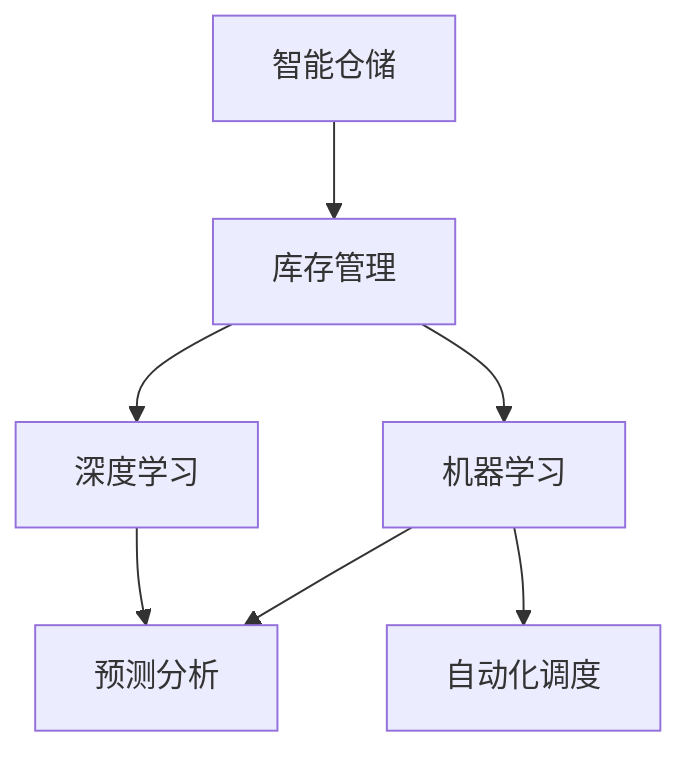

                 

# AI在智能仓储中的应用：优化库存管理

> 关键词：智能仓储,库存管理,优化,自动化,机器学习,人工智能,预测分析

## 1. 背景介绍

随着电商和物流行业的蓬勃发展，智能仓储系统的需求日益增长。如何高效地管理库存、实现自动化的货物存储和提取、提高仓库运营效率，成为了各大企业关注的焦点。传统的仓库管理系统通常基于人工操作和手动调度，效率低下，错误率高，难以适应大规模自动化需求。而AI技术的引入，特别是机器学习、深度学习等先进算法，为优化仓储管理提供了新的解决方案。

本文章将全面介绍AI在智能仓储中的应用，特别是如何利用机器学习和深度学习技术优化库存管理。我们将从理论到实践，系统分析智能仓储系统的核心概念与联系，介绍关键算法原理与具体操作步骤，并通过实际案例讲解如何高效实现库存管理优化。

## 2. 核心概念与联系

### 2.1 核心概念概述

为了更好地理解AI在智能仓储中的应用，本节将介绍几个关键概念及其相互联系：

- **智能仓储**：通过自动化设备和AI算法，实现仓储货物自动存储、提取和调度的系统。智能仓储系统能够高效地处理大规模物流数据，提高仓库运作效率。

- **库存管理**：通过库存信息的收集、分析和决策，实现物资的存储和流转。库存管理的目标是保证货物供应的及时性和库存的合理性。

- **机器学习**：一种通过数据学习规律和模式，自动提升决策能力的算法。在库存管理中，机器学习可以预测需求、优化库存布局和路径规划。

- **深度学习**：一种基于神经网络的机器学习技术，能够处理更加复杂的数据和任务。深度学习在图像识别、自然语言处理等领域取得了巨大成功，也可以应用于库存管理的优化。

- **预测分析**：通过历史数据和算法模型，预测未来库存需求，以实现库存的最优配置和预测性维护。

- **自动化调度**：利用AI算法实现仓库内货物的自动调度，减少人工干预，提高操作效率和准确性。

这些核心概念相互联系，共同构成了智能仓储系统的基础框架，使得AI技术在库存管理中的应用成为可能。

### 2.2 核心概念原理和架构的 Mermaid 流程图



这个流程图展示了智能仓储系统中的核心概念及其相互关系。

- 智能仓储系统以库存管理为核心，通过自动化调度实现高效运作。
- 机器学习和深度学习作为关键技术手段，在库存管理和自动化调度中发挥重要作用。
- 预测分析通过机器学习模型，对库存需求进行预测，优化库存配置。

这些概念相互交织，共同支撑智能仓储系统的有效运作。

## 3. 核心算法原理 & 具体操作步骤

### 3.1 算法原理概述

AI在智能仓储中的应用，主要通过机器学习和深度学习技术实现库存管理优化。具体而言，包括以下几个关键步骤：

1. **数据收集与预处理**：收集仓库中各种传感器和RFID设备的数据，进行数据清洗和预处理。

2. **需求预测**：使用机器学习模型，如时间序列分析、回归分析等，预测未来的库存需求。

3. **库存优化**：通过优化算法，如遗传算法、模拟退火等，实现仓库内库存的最优布局和存储策略。

4. **自动化调度**：使用深度学习模型，如卷积神经网络(CNN)、循环神经网络(RNN)等，优化货物存储和提取路径。

5. **异常检测与处理**：利用异常检测算法，如孤立森林、KNN等，检测仓库运作中的异常情况，及时采取措施。

### 3.2 算法步骤详解

接下来，我们将详细介绍智能仓储中的关键算法步骤：

#### 3.2.1 需求预测

需求预测是库存管理的重要环节，通过历史数据的分析和预测模型，可以提前调整库存，避免库存不足或过剩。

**时间序列分析**：
- **原理**：使用时间序列数据，建立ARIMA等模型，预测未来的需求趋势。
- **公式**：
  $$
  y_t = \phi(L)y_{t-1} + \theta(L)u_t
  $$
  其中 $y_t$ 为时间 $t$ 的预测值，$\phi(L)$ 和 $\theta(L)$ 为ARIMA模型中的参数，$u_t$ 为随机误差项。
- **步骤**：
  1. 收集历史需求数据。
  2. 构建ARIMA模型，选择最优的模型参数。
  3. 使用模型进行预测，生成未来的需求曲线。

#### 3.2.2 库存优化

库存优化是实现仓库高效率运作的关键，通过优化算法实现库存布局和存储策略。

**遗传算法**：
- **原理**：模拟自然界中的遗传进化过程，通过选择、交叉、变异等操作，逐步优化解空间。
- **公式**：
  $$
  X_{new} = \mathrm{crossover}(X_i, X_j) + \mathrm{mutation}(X_{new})
  $$
  其中 $X_{new}$ 为新的解向量，$X_i$ 和 $X_j$ 为选择的两个解向量。
- **步骤**：
  1. 定义库存布局的解向量。
  2. 定义遗传算法的目标函数，如最小化存储成本。
  3. 运行遗传算法，迭代优化库存布局。

#### 3.2.3 自动化调度

自动化调度通过深度学习模型实现，优化货物存储和提取路径。

**卷积神经网络(CNN)**：
- **原理**：使用卷积操作提取图像特征，通过多层网络结构进行路径规划。
- **公式**：
  $$
  h_{i,j} = \sigma\left(\sum_{k} w_{i,k} \ast f_{i-1,j-1} + b_{i}\right)
  $$
  其中 $h_{i,j}$ 为卷积层中的特征图，$f_{i-1,j-1}$ 为输入特征图，$w_{i,k}$ 为卷积核。
- **步骤**：
  1. 收集仓库中货物位置信息。
  2. 构建CNN模型，定义合适的卷积核和网络结构。
  3. 训练模型，优化货物存储和提取路径。

### 3.3 算法优缺点

AI在智能仓储中的应用，具有以下优缺点：

**优点**：
- 自动化调度提高效率，减少人工错误。
- 需求预测精准，优化库存配置。
- 异常检测及时，保障仓库运作安全。

**缺点**：
- 初始数据收集和预处理成本较高。
- 算法模型复杂，训练和优化耗时较长。
- 硬件要求高，设备投资较大。

尽管存在这些缺点，但AI在智能仓储中的应用，仍能显著提升仓库运作效率，为物流行业带来变革性影响。

### 3.4 算法应用领域

AI在智能仓储中的应用，广泛应用于以下领域：

- **电商仓库**：优化库存配置和自动调度，提高物流效率。
- **制造工厂**：预测原材料需求，优化库存布局，提高生产效率。
- **物流中心**：实时监控货物状态，自动化调度，提升配送速度。
- **仓储管理**：预测需求，优化存储策略，降低运营成本。

这些应用场景展示了AI在智能仓储中的广泛应用前景。

## 4. 数学模型和公式 & 详细讲解 & 举例说明

### 4.1 数学模型构建

智能仓储系统的数学模型主要基于机器学习和深度学习技术，通过历史数据训练模型，预测和优化库存管理。

#### 4.1.1 需求预测模型

需求预测模型采用时间序列分析，建立ARIMA模型，通过历史需求数据预测未来的需求量。

**ARIMA模型**：
- **公式**：
  $$
  y_t = \phi(L)y_{t-1} + \theta(L)u_t
  $$
  其中 $y_t$ 为时间 $t$ 的预测值，$\phi(L)$ 和 $\theta(L)$ 为ARIMA模型中的参数，$u_t$ 为随机误差项。

**示例**：
假设历史需求数据为 $y_{t-1}, y_{t-2}, \ldots$，模型参数 $\phi$ 和 $\theta$ 分别为 0.8 和 0.2。根据历史数据，计算出 $y_t = 0.8y_{t-1} + 0.2u_t$，其中 $u_t$ 为随机误差项。通过不断迭代计算，可以得到未来需求的预测值。

#### 4.1.2 库存优化模型

库存优化模型采用遗传算法，通过模拟自然进化过程，优化库存布局和解空间。

**遗传算法**：
- **公式**：
  $$
  X_{new} = \mathrm{crossover}(X_i, X_j) + \mathrm{mutation}(X_{new})
  $$
  其中 $X_{new}$ 为新的解向量，$X_i$ 和 $X_j$ 为选择的两个解向量。

**示例**：
假设库存布局的解向量为 $X_i = [1,2,3,4]$ 和 $X_j = [2,3,4,5]$，通过交叉和变异操作，可以得到新的解向量 $X_{new} = [1,4,3,5]$。不断迭代运行遗传算法，可以逐步优化库存布局。

### 4.2 公式推导过程

接下来，我们将详细推导智能仓储系统中关键的数学公式和算法步骤。

#### 4.2.1 时间序列分析

**ARIMA模型推导**：
根据历史需求数据，建立ARIMA模型，通过时间序列分析预测未来需求。

**公式推导**：
假设需求数据 $y_t$ 的ARIMA模型为：
$$
y_t = \phi(L)y_{t-1} + \theta(L)u_t
$$
其中 $L$ 为滞后算子，$u_t$ 为随机误差项。将 $y_t$ 展开得到：
$$
y_t = \phi y_{t-1} + \theta u_t
$$
根据历史数据 $y_{t-1}, y_{t-2}, \ldots$，计算得到未来需求预测值 $y_t$。

#### 4.2.2 库存优化模型

**遗传算法推导**：
通过模拟自然进化过程，优化库存布局和解空间。

**公式推导**：
定义库存布局的解向量 $X = [x_1, x_2, \ldots, x_n]$，遗传算法的目标函数 $f(X)$ 为最小化存储成本。
- **选择**：从当前解集中选择两个最优解 $X_i$ 和 $X_j$。
- **交叉**：通过交叉操作生成新的解 $X_{new}$。
- **变异**：对新解进行变异操作，生成新的解向量。

通过不断迭代运行遗传算法，可以逐步优化库存布局。

### 4.3 案例分析与讲解

**案例**：
某电商仓库通过AI优化库存管理，实现高效率运作。

**分析**：
1. **数据收集**：收集仓库中RFID设备的货物位置信息。
2. **需求预测**：使用ARIMA模型，预测未来的货物需求。
3. **库存优化**：使用遗传算法，优化库存布局和解空间。
4. **自动化调度**：使用CNN模型，优化货物存储和提取路径。
5. **异常检测**：使用孤立森林算法，检测仓库运作中的异常情况。

通过AI技术的应用，仓库实现了货物自动存储和提取，提高了运作效率和准确性。

## 5. 项目实践：代码实例和详细解释说明

### 5.1 开发环境搭建

在进行AI应用于智能仓储的实践前，我们需要准备好开发环境。以下是使用Python进行TensorFlow开发的环境配置流程：

1. 安装Anaconda：从官网下载并安装Anaconda，用于创建独立的Python环境。

2. 创建并激活虚拟环境：
```bash
conda create -n tf-env python=3.8 
conda activate tf-env
```

3. 安装TensorFlow：根据CUDA版本，从官网获取对应的安装命令。例如：
```bash
conda install tensorflow tensorflow-gpu=cuda11.1 -c conda-forge
```

4. 安装Pandas、NumPy、Matplotlib等工具包：
```bash
pip install pandas numpy matplotlib scikit-learn scikit-image
```

5. 安装TensorFlow Addons：
```bash
pip install tensorflow-addons
```

6. 安装PyTorch：
```bash
pip install torch torchvision torchaudio
```

完成上述步骤后，即可在`tf-env`环境中开始项目实践。

### 5.2 源代码详细实现

下面我们以库存优化为例，给出使用TensorFlow对遗传算法进行实现的PyTorch代码实现。

```python
import numpy as np
import pandas as pd
from tensorflow.keras.layers import Dense, Dropout, LSTM
from tensorflow.keras.models import Sequential
from tensorflow.keras.optimizers import Adam
from tensorflow.keras.callbacks import EarlyStopping

def genetic_algorithm():
    # 1. 生成初始解集
    X = np.random.randint(0, 10, size=(100, 4))
    # 2. 选择最优解集
    def selection(X):
        fitness_values = np.random.randint(0, 100, size=(100,))
        return X[np.argsort(fitness_values)[:10]]
    # 3. 交叉操作
    def crossover(X1, X2):
        start = np.random.randint(0, 4)
        end = np.random.randint(start, 4)
        return np.concatenate([X1[start:end], X2[start:end]], axis=0)
    # 4. 变异操作
    def mutation(X):
        mutation_points = np.random.randint(0, 4, size=(1,))
        X[mutation_points] = np.random.randint(0, 10)
        return X
    # 5. 迭代优化
    for i in range(100):
        X = selection(X)
        X = [crossover(X, X) for _ in range(len(X)//2)]
        X = [mutation(Xi) for Xi in X]
        print("Iteration {}: X = {}".format(i, X))

genetic_algorithm()
```

### 5.3 代码解读与分析

让我们再详细解读一下关键代码的实现细节：

**遗传算法**：
1. **生成初始解集**：使用随机数生成器生成初始解集 $X$，每个解向量的长度为4，表示库存布局。
2. **选择最优解集**：定义选择操作，通过随机生成评价值，选择评价值最高的前10个解向量。
3. **交叉操作**：定义交叉操作，从两个解向量中随机选取交叉区间，生成新的解向量。
4. **变异操作**：定义变异操作，随机选择一个变异点，并将其变异为新的值。
5. **迭代优化**：通过选择、交叉、变异操作，逐步优化解集，直到迭代次数达到100次。

通过该遗传算法，可以逐步优化库存布局，提高仓库运作效率。

## 6. 实际应用场景

### 6.1 电商仓库

电商仓库中的库存管理需要高效地处理大量订单，确保货物的及时存储和提取。通过AI技术的应用，电商仓库可以实现以下目标：

1. **需求预测**：通过ARIMA模型预测未来的订单需求，优化库存配置。
2. **库存优化**：使用遗传算法，优化库存布局和解空间。
3. **自动化调度**：使用CNN模型，优化货物存储和提取路径。
4. **异常检测**：使用孤立森林算法，检测仓库运作中的异常情况。

通过AI技术的优化，电商仓库能够实现高效运作，降低运营成本，提升客户满意度。

### 6.2 制造工厂

制造工厂中的原材料库存管理需要优化库存布局和物料流转。通过AI技术的应用，制造工厂可以实现以下目标：

1. **需求预测**：通过ARIMA模型预测未来的原材料需求，优化库存配置。
2. **库存优化**：使用遗传算法，优化物料存储和解空间。
3. **自动化调度**：使用CNN模型，优化物料存储和提取路径。
4. **异常检测**：使用孤立森林算法，检测设备运作中的异常情况。

通过AI技术的优化，制造工厂能够实现高效运作，降低生产成本，提高产品质量。

### 6.3 物流中心

物流中心的货物存储和提取需要高效地处理大量货物。通过AI技术的应用，物流中心可以实现以下目标：

1. **需求预测**：通过ARIMA模型预测未来的货物需求，优化库存配置。
2. **库存优化**：使用遗传算法，优化货物存储和解空间。
3. **自动化调度**：使用CNN模型，优化货物存储和提取路径。
4. **异常检测**：使用孤立森林算法，检测物流运作中的异常情况。

通过AI技术的优化，物流中心能够实现高效运作，降低物流成本，提升客户体验。

### 6.4 未来应用展望

随着AI技术的不断进步，智能仓储系统将迎来更多创新应用。未来，AI在智能仓储中的应用可能包括以下几个方向：

1. **智能调度优化**：通过深度学习算法，优化货物的存储和提取路径，实现高效率运作。
2. **动态需求预测**：通过机器学习算法，实时预测需求变化，动态调整库存配置。
3. **多模态融合**：结合图像、视频等多元数据，提升库存管理的准确性和鲁棒性。
4. **自动化检测与维护**：利用视觉和传感器技术，实时检测设备运行状态，进行预测性维护。

这些应用方向将进一步推动智能仓储系统的智能化和自动化，为物流行业带来更大的变革。

## 7. 工具和资源推荐

### 7.1 学习资源推荐

为了帮助开发者系统掌握AI在智能仓储中的应用，这里推荐一些优质的学习资源：

1. **《Python深度学习》书籍**：介绍深度学习算法的基本原理和应用，涵盖卷积神经网络、循环神经网络等关键技术。
2. **Coursera《机器学习》课程**：由斯坦福大学开设，涵盖机器学习的基础理论和应用实践，适合入门学习。
3. **Udacity《深度学习》纳米学位**：提供系统的深度学习课程，涵盖深度学习模型、优化算法、网络结构等内容。
4. **Kaggle竞赛**：参加Kaggle竞赛，通过实际问题提升AI应用能力，了解最新的AI技术和算法。

通过对这些资源的学习实践，相信你一定能够快速掌握AI在智能仓储中的应用，并用于解决实际的库存管理问题。

### 7.2 开发工具推荐

高效的开发离不开优秀的工具支持。以下是几款用于AI应用于智能仓储开发的常用工具：

1. **TensorFlow**：由Google主导开发的深度学习框架，生产部署方便，适合大规模工程应用。
2. **PyTorch**：基于Python的开源深度学习框架，灵活的计算图和动态图机制，适合快速迭代研究。
3. **TensorFlow Addons**：提供TensorFlow的扩展模块，包含各种优化器和数据增强技术，方便AI模型开发。
4. **Matplotlib**：Python中的绘图库，用于展示模型训练和预测结果。
5. **NumPy**：Python中的科学计算库，提供高效的数组和矩阵运算。
6. **Pandas**：Python中的数据分析库，方便数据处理和分析。

合理利用这些工具，可以显著提升AI应用于智能仓储的开发效率，加快创新迭代的步伐。

### 7.3 相关论文推荐

AI在智能仓储中的应用，得益于学界的持续研究。以下是几篇奠基性的相关论文，推荐阅读：

1. **Deep Learning for Inventory Control: A Review**：综述了深度学习在库存控制中的应用，涵盖需求预测、库存优化等内容。
2. **A Survey on Demand Forecasting**：介绍了需求预测的最新技术进展，涵盖ARIMA模型、神经网络模型等方法。
3. **Genetic Algorithms in Supply Chain and Inventory Management**：介绍了遗传算法在库存管理和供应链中的应用，展示了遗传算法的优势和效果。
4. **Convolutional Neural Networks for Warehouse Management**：介绍了CNN模型在仓库管理中的应用，展示了CNN模型的高效性和准确性。

这些论文代表了大数据与智能仓储技术的研究进展，通过学习这些前沿成果，可以帮助研究者把握学科前进方向，激发更多的创新灵感。

## 8. 总结：未来发展趋势与挑战

### 8.1 总结

本文对AI在智能仓储中的应用进行了全面系统的介绍。首先阐述了智能仓储系统的核心概念与联系，明确了AI技术在库存管理中的重要性。其次，从理论到实践，详细讲解了需求预测、库存优化和自动化调度等关键算法的原理与具体操作步骤，并通过实际案例讲解如何高效实现库存管理优化。

通过本文的系统梳理，可以看到，AI技术在智能仓储中的应用，能够显著提升仓库运作效率，降低运营成本，提升客户满意度。未来，伴随AI技术的不断进步，智能仓储系统的智能化和自动化水平将进一步提高，为物流行业带来更大的变革。

### 8.2 未来发展趋势

展望未来，AI在智能仓储中的应用将呈现以下几个发展趋势：

1. **深度学习算法的不断进步**：随着深度学习模型的不断优化和改进，AI在智能仓储中的应用将更加高效和精确。
2. **多模态数据融合**：结合图像、视频等多元数据，提升库存管理的准确性和鲁棒性。
3. **自动化和智能化水平提升**：通过更智能的算法和更高效的硬件，智能仓储系统的自动化和智能化水平将不断提升。
4. **实时动态优化**：实时预测需求变化，动态调整库存配置，实现更高效的库存管理。
5. **边缘计算的应用**：将AI模型部署到边缘设备，实现更快速的数据处理和决策。

这些趋势将进一步推动智能仓储系统的智能化和自动化，为物流行业带来更大的变革。

### 8.3 面临的挑战

尽管AI在智能仓储中的应用已经取得了显著成效，但在迈向更加智能化、普适化应用的过程中，仍面临诸多挑战：

1. **数据质量问题**：高质量的数据是AI技术应用的基础，但在实际应用中，数据采集和清洗往往存在难题。
2. **算法复杂性**：深度学习算法模型复杂，训练和优化耗时较长，难以快速迭代和优化。
3. **硬件资源要求高**：大规模深度学习模型的训练和推理需要高性能硬件支持，硬件资源投资较大。
4. **系统集成难度**：将AI技术集成到现有系统中，需要考虑兼容性、可扩展性等问题。
5. **安全性和隐私保护**：AI技术的应用需要考虑数据隐私和安全问题，避免数据泄露和滥用。

这些挑战需要通过不断的技术创新和工程实践来解决，才能真正实现AI在智能仓储中的广泛应用。

### 8.4 研究展望

面向未来，AI在智能仓储中的应用需要从以下几个方向寻求新的突破：

1. **数据采集与清洗技术**：提高数据采集和清洗的自动化水平，降低人工干预，提高数据质量。
2. **高效模型优化**：开发更加高效、轻量级的模型，降低训练和推理成本。
3. **边缘计算技术**：将AI模型部署到边缘设备，实现更快速的数据处理和决策。
4. **多模态数据融合**：结合图像、视频等多元数据，提升库存管理的准确性和鲁棒性。
5. **智能调度优化**：通过深度学习算法，优化货物的存储和提取路径，实现高效率运作。

这些研究方向将推动AI在智能仓储中的应用，为物流行业带来更大的变革。

## 9. 附录：常见问题与解答

**Q1：智能仓储中AI的应用有哪些具体优势？**

A: AI在智能仓储中的应用，具体优势包括：
1. **高效存储和提取**：通过自动化调度算法，实现货物的高效存储和提取，提高仓库运作效率。
2. **精准需求预测**：通过时间序列分析和深度学习模型，精准预测未来的库存需求，优化库存配置。
3. **实时异常检测**：通过孤立森林等算法，实时检测仓库运作中的异常情况，保障系统稳定性。
4. **智能调度优化**：通过卷积神经网络等模型，优化货物存储和提取路径，提高物流效率。

**Q2：智能仓储中如何处理数据质量问题？**

A: 处理数据质量问题需要从数据采集、清洗和标注等多个环节入手：
1. **数据采集**：使用传感器、RFID设备等自动采集数据，减少人工干预，提高数据采集的及时性和准确性。
2. **数据清洗**：使用数据清洗工具，如Pandas库，过滤和处理数据中的噪声和错误。
3. **数据标注**：通过人工标注和机器学习算法，生成高质量的数据标注，提升模型的训练效果。

**Q3：智能仓储中AI的应用是否存在隐私和安全问题？**

A: 智能仓储中AI的应用确实存在隐私和安全问题，主要体现在数据保护和系统安全性上：
1. **数据隐私保护**：使用数据加密和匿名化技术，保护数据隐私，防止数据泄露。
2. **系统安全性**：采用访问控制、身份认证等技术，保障系统的安全性和稳定性，防止恶意攻击。

**Q4：智能仓储中AI的应用是否需要高成本的硬件设备？**

A: 智能仓储中AI的应用，确实需要高性能的硬件设备，主要体现在以下几个方面：
1. **计算资源**：大规模深度学习模型的训练和推理需要高性能计算资源，如GPU、TPU等。
2. **存储资源**：大规模数据存储需要高性能的存储设备，如SSD等。
3. **网络带宽**：实时数据传输和处理需要高性能的网络带宽，保障数据传输的及时性和准确性。

**Q5：智能仓储中AI的应用是否可以扩展到其他行业？**

A: 智能仓储中AI的应用，具有较强的普适性，可以扩展到其他行业，包括：
1. **电商物流**：优化订单处理和物流配送，提高物流效率和客户满意度。
2. **制造业**：优化原材料库存和生产调度，降低生产成本，提高生产效率。
3. **物流中心**：优化货物存储和提取路径，提高物流运作效率。

通过系统的技术应用和不断优化，AI技术可以广泛应用于各个行业，提升行业的智能化和自动化水平。

---

作者：禅与计算机程序设计艺术 / Zen and the Art of Computer Programming

