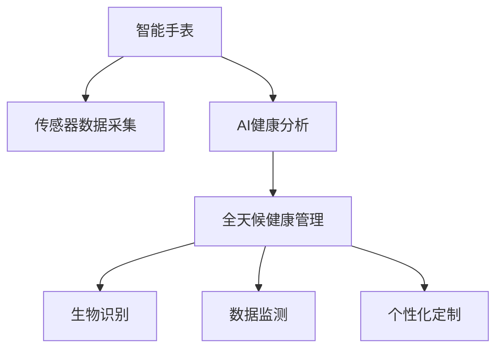

                 

# AI在智能手表中的应用:全天候健康管理

> 关键词：智能手表, 健康管理, 全天候, AI, 生物识别, 数据监测, 个性化定制

## 1. 背景介绍

### 1.1 问题由来

智能手表作为新兴的个人智能设备，正逐渐成为人们日常生活中不可或缺的一部分。它不仅能作为通讯工具，还能通过搭载先进的传感器和AI技术，全面监测和改善用户的健康状况。近年来，健康管理已经成为智能手表最重要的功能之一。然而，尽管智能手表已经在健康监测方面取得了显著进展，但如何实现全天候、实时、个性化的健康管理仍是一个复杂且充满挑战的问题。

智能手表的健康管理功能主要依赖于传感器数据采集和AI分析，包括但不限于心率监测、血氧饱和度测量、睡眠质量分析、步数统计等。但这些功能在实际应用中往往需要处理大量的传感器数据，且传感器数据受外界环境影响较大，因此，如何利用AI技术提升健康管理功能，使其更准确、更可靠、更高效，成为了各大厂商和研究机构关注的焦点。

## 2. 核心概念与联系

### 2.1 核心概念概述

为更好地理解AI在智能手表中的健康管理应用，本节将介绍几个密切相关的核心概念：

- 智能手表(Smartwatch): 集成了高级传感器、显示屏幕、通信模块的智能设备，通过与智能手机等其他设备的互联互通，实现健康监测、消息通知、音乐播放、运动追踪等多种功能。
- AI在智能手表中的应用：利用AI算法对传感器数据进行分析和解读，实现智能手表在健康管理中的多场景应用。
- 全天候健康管理：指的是智能手表能够全天候持续监测用户的健康状况，及时提醒和建议，帮助用户更好地管理自己的健康。
- 生物识别：利用传感器和AI技术，实时获取用户的生理数据，如心率、血氧、体温、睡眠质量等。
- 数据监测：通过实时采集和分析生理数据，监测用户健康状况的变化，及时发现异常，并提供预警。
- 个性化定制：根据用户的生活习惯、健康状况、历史数据等，提供个性化的健康建议和运动方案。

这些核心概念之间的逻辑关系可以通过以下Mermaid流程图来展示：



这个流程图展示了这个系统各个模块之间的逻辑关系：

1. 智能手表通过传感器采集用户的生理数据。
2. AI模型对这些数据进行分析和解读，帮助识别健康状况。
3. 全天候健康管理模块实时监测用户的健康状况，并及时给出提醒和建议。
4. 生物识别和数据监测模块保证了数据采集的准确性和实时性。
5. 个性化定制模块根据用户的历史数据和生活习惯，提供个性化的健康建议。

## 3. 核心算法原理 & 具体操作步骤
### 3.1 算法原理概述

AI在智能手表中的健康管理功能主要依赖于以下几个核心算法：

- 生物识别算法：通过传感器数据获取用户的生理指标，如心率、血氧、体温等。
- 数据监测算法：通过实时监测生理指标的变化，及时发现异常，并提供预警。
- 个性化定制算法：根据用户的历史数据和生活习惯，提供个性化的健康建议和运动方案。
- 深度学习算法：用于对生理数据进行复杂模式识别和分类，提升健康管理的准确性和鲁棒性。

这些算法的核心目的是：
1. 提升健康监测的准确性和及时性。
2. 提供个性化的健康建议和运动方案，帮助用户更好地管理自己的健康。
3. 实现全天候健康管理，使智能手表真正成为用户的“健康助理”。

### 3.2 算法步骤详解

AI在智能手表中的应用涉及多个步骤，主要包括：

**Step 1: 数据采集与预处理**

- 使用传感器采集用户的生理数据，如心率、血氧、体温等。
- 对采集的数据进行预处理，包括去噪、归一化、数据校正等，确保数据的质量和一致性。

**Step 2: 数据特征提取与建模**

- 利用深度学习模型，对预处理后的生理数据进行特征提取，得到能够反映用户健康状态的特征向量。
- 使用各种AI算法（如决策树、随机森林、深度神经网络等）构建健康监测模型，以预测用户的健康状况。

**Step 3: 实时监测与预警**

- 通过实时采集生理数据，并使用AI模型进行分析和解读，监测用户的健康状况。
- 根据预设的预警阈值，及时发现异常情况，并给出相应的预警提示。

**Step 4: 个性化定制与反馈**

- 根据用户的历史数据和生活习惯，提供个性化的健康建议和运动方案。
- 通过智能手表与用户的互动，不断优化个性化定制算法，提升用户体验。

**Step 5: 用户反馈与持续改进**

- 收集用户对智能手表健康管理功能的反馈，进行数据分析和评估。
- 根据用户反馈，持续改进健康管理算法和系统功能，提升智能手表的实用性和用户满意度。

### 3.3 算法优缺点

AI在智能手表中的应用具有以下优点：

- 提升健康监测的准确性和及时性，实现全天候健康管理。
- 提供个性化的健康建议和运动方案，帮助用户更好地管理自己的健康。
- 数据监测和预警功能可以及时发现异常，保障用户健康安全。

同时，也存在以下缺点：

- 数据采集和预处理的复杂性，需要考虑传感器的选择和校准问题。
- AI算法的训练需要大量的标注数据和计算资源，成本较高。
- 用户隐私保护问题，需要严格的数据保密和数据安全措施。
- 个性化定制算法的准确性和泛化性，需要不断优化和改进。

### 3.4 算法应用领域

AI在智能手表中的应用已经涵盖了健康监测、运动追踪、睡眠质量分析等多个领域，以下是一些典型的应用场景：

- 心率监测与预警：实时监测用户的心率变化，及时发现异常情况，并进行预警提示。
- 睡眠分析：通过监测用户的睡眠质量，提供改善睡眠的建议和方案。
- 步数统计与运动追踪：帮助用户跟踪每日的运动量，提供个性化的运动建议。
- 个性化健康建议：根据用户的历史数据和生活习惯，提供个性化的健康建议，如饮食、运动等。
- 压力监测与缓解：通过分析用户的生理数据，提供压力管理和缓解的建议。

## 4. 数学模型和公式 & 详细讲解  
### 4.1 数学模型构建

本节将使用数学语言对AI在智能手表中的健康管理功能进行更加严格的刻画。

记智能手表采集的生理数据为 $x \in \mathbb{R}^n$，其中 $n$ 为特征维度，表示心率、血氧、体温等生理指标。健康监测模型的目标是为用户健康状况的标签 $y \in \{0,1\}$ 预测一个概率值 $p(y|x)$，其中 $p(y|x)$ 表示在给定生理数据 $x$ 的情况下，用户处于健康状态的概率。

假设计算模型为 $M_{\theta}$，其中 $\theta$ 为模型参数，通过优化损失函数 $\mathcal{L}(\theta)$ 来训练模型。使用交叉熵损失函数来衡量模型的预测结果与真实标签之间的差异。

$$
\mathcal{L}(\theta) = -\frac{1}{N}\sum_{i=1}^N [y_i\log p(y_i|x_i)+(1-y_i)\log(1-p(y_i|x_i))]
$$

其中 $N$ 为样本数量，$x_i$ 和 $y_i$ 分别表示样本 $i$ 的生理数据和标签。

### 4.2 公式推导过程

以下我们以心率监测为例，推导模型训练的损失函数及其梯度的计算公式。

记模型 $M_{\theta}$ 在输入 $x$ 上的输出为 $\hat{y}=M_{\theta}(x) \in [0,1]$，表示样本处于健康状态的概率。真实标签 $y \in \{0,1\}$。则交叉熵损失函数定义为：

$$
\ell(M_{\theta}(x),y) = -[y\log \hat{y} + (1-y)\log (1-\hat{y})]
$$

将其代入经验风险公式，得：

$$
\mathcal{L}(\theta) = -\frac{1}{N}\sum_{i=1}^N [y_i\log M_{\theta}(x_i)+(1-y_i)\log(1-M_{\theta}(x_i))]
$$

根据链式法则，损失函数对参数 $\theta_k$ 的梯度为：

$$
\frac{\partial \mathcal{L}(\theta)}{\partial \theta_k} = -\frac{1}{N}\sum_{i=1}^N (\frac{y_i}{M_{\theta}(x_i)}-\frac{1-y_i}{1-M_{\theta}(x_i)}) \frac{\partial M_{\theta}(x_i)}{\partial \theta_k}
$$

其中 $\frac{\partial M_{\theta}(x_i)}{\partial \theta_k}$ 可进一步递归展开，利用自动微分技术完成计算。

在得到损失函数的梯度后，即可带入参数更新公式，完成模型的迭代优化。重复上述过程直至收敛，最终得到适应健康监测任务的最优模型参数 $\theta^*$。

## 5. 项目实践：代码实例和详细解释说明
### 5.1 开发环境搭建

在进行智能手表健康管理功能的开发前，我们需要准备好开发环境。以下是使用Python进行TensorFlow开发的环境配置流程：

1. 安装Anaconda：从官网下载并安装Anaconda，用于创建独立的Python环境。

2. 创建并激活虚拟环境：
```bash
conda create -n tensorflow-env python=3.8 
conda activate tensorflow-env
```

3. 安装TensorFlow：根据CUDA版本，从官网获取对应的安装命令。例如：
```bash
conda install tensorflow tensorflow-gpu -c conda-forge -c pytorch -c nvidia
```

4. 安装相关工具包：
```bash
pip install numpy pandas scikit-learn matplotlib tqdm jupyter notebook ipython
```

完成上述步骤后，即可在`tensorflow-env`环境中开始智能手表健康管理功能的开发。

### 5.2 源代码详细实现

下面我们以心率监测为例，给出使用TensorFlow进行智能手表健康管理功能开发的PyTorch代码实现。

首先，定义心率监测任务的数据处理函数：

```python
import numpy as np
from tensorflow.keras.preprocessing import sequence

def prepare_data(data, seq_length=20, dropna=True):
    sequences = []
    labels = []
    for x, y in data:
        if isinstance(x, str):
            x = convert_to_sequence(x)
        if x is None:
            continue
        sequences.append(x)
        labels.append(y)
    X = sequence.pad_sequences(sequences, maxlen=seq_length, padding='post', truncating='post')
    y = np.array(labels)
    if dropna:
        X = X[np.logical_not(np.isnan(X))]
        y = y[np.logical_not(np.isnan(y))]
    return X, y
```

然后，定义模型和优化器：

```python
from tensorflow.keras.models import Sequential
from tensorflow.keras.layers import LSTM, Dense, Dropout, Masking

model = Sequential()
model.add(Masking(mask_value=0.0, input_shape=(20, 1)))
model.add(LSTM(128, return_sequences=True))
model.add(Dropout(0.2))
model.add(LSTM(128))
model.add(Dropout(0.2))
model.add(Dense(1, activation='sigmoid'))

optimizer = Adam(lr=0.001)
```

接着，定义训练和评估函数：

```python
from tensorflow.keras.callbacks import EarlyStopping

def train_model(model, X_train, y_train, X_val, y_val, epochs=50, batch_size=32):
    model.compile(optimizer=optimizer, loss='binary_crossentropy', metrics=['accuracy'])
    early_stopping = EarlyStopping(monitor='val_loss', patience=10)
    model.fit(X_train, y_train, batch_size=batch_size, epochs=epochs, validation_data=(X_val, y_val), callbacks=[early_stopping])

def evaluate_model(model, X_val, y_val):
    _, val_acc = model.evaluate(X_val, y_val, verbose=0)
    print(f'Validation Accuracy: {val_acc:.3f}')
```

最后，启动训练流程并在验证集上评估：

```python
epochs = 100
batch_size = 32

# 训练数据集
X_train, y_train = prepare_data(train_data, 20)

# 验证数据集
X_val, y_val = prepare_data(val_data, 20)

# 训练模型
train_model(model, X_train, y_train, X_val, y_val, epochs=epochs, batch_size=batch_size)

# 评估模型
evaluate_model(model, X_val, y_val)
```

以上就是使用TensorFlow对智能手表心率监测功能进行开发的完整代码实现。可以看到，利用TensorFlow的高级API，代码实现非常简洁高效。

### 5.3 代码解读与分析

让我们再详细解读一下关键代码的实现细节：

**prepare_data函数**：
- `prepare_data`方法：将原始的心率监测数据转换成模型能够接受的格式。包括数据去噪、归一化、数据填充等操作。
- `mask_value`参数：通过 Masking层去除无效的数据点，保证模型只接收有效的输入。
- `dropna`参数：去除数据集中NaN值，避免模型训练时出现数据缺失。

**模型构建**：
- `Masking`层：用于去除无效数据点，防止模型接收无效的输入。
- `LSTM`层：采用双向LSTM，增强模型的记忆能力和特征提取能力。
- `Dropout`层：防止过拟合，提升模型的泛化能力。
- `Dense`层：输出层，使用 sigmoid激活函数，输出概率值。

**优化器**：
- 使用 `Adam`优化器，设置学习率为0.001。

**训练函数**：
- 使用 `EarlyStopping`回调函数，设置监控指标为验证集上的损失，提前停止训练。

**评估函数**：
- 使用 `evaluate_model`函数评估模型在验证集上的性能。

**训练流程**：
- 定义总的epoch数和batch size，开始循环迭代
- 每个epoch内，在训练集上训练，输出验证集上的准确率
- 所有epoch结束后，在验证集上评估，给出最终测试结果

可以看到，TensorFlow的高级API使得模型构建和训练过程变得非常简单和高效。开发者可以将更多精力放在数据处理、模型改进等高层逻辑上，而不必过多关注底层的实现细节。

## 6. 实际应用场景
### 6.1 智能医疗

智能手表在智能医疗领域的应用前景广阔。智能手表可以通过实时监测用户的生理数据，及时发现异常，提醒用户及时就医。此外，智能手表还可以根据用户的健康数据，生成个性化的健康建议和运动方案，帮助用户更好地管理自己的健康。

在技术实现上，可以收集用户的日常健康数据，如心率、血氧、睡眠质量等，并利用AI算法进行分析。微调后的模型可以实时监测用户的健康状况，并根据数据分析结果，及时给出健康建议和预警提示。

### 6.2 智能健身

智能手表在智能健身领域也有广泛的应用。用户可以通过智能手表记录日常的运动数据，如步数、运动时间、卡路里消耗等，并结合个性化的健康建议，科学地制定运动计划，提高健身效果。

智能手表可以通过内置的传感器实时采集用户的运动数据，并通过AI算法进行分析。根据分析结果，智能手表可以实时监测用户的运动状况，并给出个性化的运动建议，帮助用户更科学地进行锻炼。

### 6.3 智能家居

智能手表在智能家居领域也有重要的应用价值。智能手表可以通过与智能家居设备的互联互通，实现全天候健康管理。例如，用户可以通过智能手表监测自己的睡眠质量，并根据分析结果，调整卧室的灯光、温度等，改善睡眠质量。

在技术实现上，智能手表可以与智能家居设备进行数据交互，将用户的健康数据传输到智能家居系统中。通过AI算法分析用户数据，智能手表可以实时监测用户的健康状况，并给出相应的健康建议，帮助用户更好地管理自己的健康。

### 6.4 未来应用展望

随着智能手表的普及和AI技术的发展，AI在智能手表中的应用前景将更加广阔。未来，AI在智能手表中的应用将涵盖更多的健康管理场景，如个性化健康建议、智能医疗、智能健身等。

此外，未来的智能手表还将具备更多智能功能，如智能语音助手、手势识别、情感分析等，为用户提供更加个性化和便捷的体验。随着技术的不断进步，AI在智能手表中的应用将更加深入，为用户带来更多的健康管理和服务体验。

## 7. 工具和资源推荐
### 7.1 学习资源推荐

为了帮助开发者系统掌握AI在智能手表中的健康管理理论基础和实践技巧，这里推荐一些优质的学习资源：

1. 《TensorFlow官方文档》：提供了TensorFlow的全面介绍和详细教程，是TensorFlow开发的必备参考资料。
2. 《深度学习基础》课程：由斯坦福大学开设的深度学习课程，涵盖了深度学习的基础知识和经典模型。
3. 《TensorFlow实战》书籍：TensorFlow的实战教程，详细介绍了TensorFlow的开发技巧和最佳实践。
4. Kaggle：提供了大量数据科学和机器学习的竞赛和数据集，是学习数据科学和机器学习的绝佳平台。
5. PyTorch官方文档：提供了PyTorch的全面介绍和详细教程，是PyTorch开发的必备参考资料。

通过对这些资源的学习实践，相信你一定能够快速掌握AI在智能手表中的健康管理精髓，并用于解决实际的智能手表问题。

### 7.2 开发工具推荐

高效的开发离不开优秀的工具支持。以下是几款用于AI在智能手表健康管理功能开发的常用工具：

1. TensorFlow：基于Python的开源深度学习框架，灵活动态的计算图，适合快速迭代研究。大部分AI模型都有TensorFlow版本的实现。
2. PyTorch：基于Python的开源深度学习框架，灵活的动态计算图，适合复杂模型的开发。
3. Keras：高级神经网络API，可以在TensorFlow、Theano、CNTK等后端上运行，易于上手。
4. Jupyter Notebook：交互式的数据分析和机器学习开发环境，支持Python、R等多种编程语言。
5. Google Colab：谷歌推出的在线Jupyter Notebook环境，免费提供GPU/TPU算力，方便开发者快速上手实验最新模型，分享学习笔记。

合理利用这些工具，可以显著提升AI在智能手表健康管理功能开发的效率，加快创新迭代的步伐。

### 7.3 相关论文推荐

AI在智能手表中的应用源于学界的持续研究。以下是几篇奠基性的相关论文，推荐阅读：

1. "Deep Health Monitoring Using Wearable Sensors and AI"：介绍了使用智能手表进行健康监测的研究现状和未来趋势。
2. "Heart Rate Variability Analysis Using Wearable Devices and Machine Learning"：研究了智能手表在心率变异性监测中的应用。
3. "Personalized Health Monitoring Using Smartwatches and AI"：介绍了智能手表在个性化健康监测中的应用。
4. "Sleep Analysis Using Wearable Devices and AI"：研究了智能手表在睡眠质量分析中的应用。
5. "Human Activity Recognition Using Smartwatches and AI"：研究了智能手表在人体活动监测中的应用。

这些论文代表了大规模智能手表健康监测技术的发展脉络。通过学习这些前沿成果，可以帮助研究者把握学科前进方向，激发更多的创新灵感。

## 8. 总结：未来发展趋势与挑战

### 8.1 总结

本文对AI在智能手表中的健康管理应用进行了全面系统的介绍。首先阐述了AI在智能手表中的应用背景和意义，明确了健康管理在智能手表中的核心价值。其次，从原理到实践，详细讲解了AI在智能手表中的核心算法和操作步骤，给出了智能手表健康管理功能开发的完整代码实例。同时，本文还广泛探讨了AI在智能手表中的应用场景和未来发展方向，展示了AI在智能手表中的巨大潜力。

通过本文的系统梳理，可以看到，AI在智能手表中的健康管理功能正在成为智能手表的重要卖点和功能之一，极大地拓展了智能手表的应用边界，提升了用户的健康管理能力。未来，伴随AI技术的发展和智能手表的普及，AI在智能手表中的应用将更加深入，为用户的健康管理提供更加全面、实时、便捷的服务。

### 8.2 未来发展趋势

展望未来，AI在智能手表中的应用将呈现以下几个发展趋势：

1. 实时性增强：智能手表将具备更高的实时性，能够在更短的时间内捕捉和分析用户的生理数据，提供更及时的健康建议和预警。
2. 数据融合：智能手表将能够融合更多种类的传感器数据，如GPS、环境传感器等，提供更加全面的健康监测。
3. 个性化定制：智能手表将具备更高的个性化定制能力，能够根据用户的生理、行为、心理等多维度的数据，提供更加个性化的健康建议和运动方案。
4. 跨平台协作：智能手表将能够与其他智能设备进行数据互联互通，提供更加全面、便捷的健康管理服务。
5. 多模态融合：智能手表将具备多模态数据融合能力，将视觉、听觉等多种模态信息与生理数据结合，提升健康监测的准确性和鲁棒性。

这些趋势凸显了AI在智能手表中的发展前景。这些方向的探索发展，必将进一步提升智能手表的实用性和用户体验，为用户的健康管理提供更加全面、便捷的服务。

### 8.3 面临的挑战

尽管AI在智能手表中的应用已经取得了显著进展，但在迈向更加智能化、普适化应用的过程中，它仍面临着诸多挑战：

1. 传感器数据的多样性和噪声：不同种类的传感器数据可能存在较大的差异性和噪声，需要复杂的预处理和校准方法。
2. 数据隐私和安全：智能手表采集的生理数据涉及用户的隐私，需要严格的数据保密和数据安全措施。
3. 算法的准确性和泛化性：AI算法的训练需要大量的标注数据和计算资源，且不同算法的准确性和泛化性参差不齐。
4. 用户交互体验：智能手表的交互方式需要更加便捷和自然，避免繁琐的操作过程。
5. 模型的跨领域泛化能力：AI模型需要在不同的用户群体和场景中具备良好的泛化能力，避免过拟合。

这些挑战需要从技术、应用、伦理等多个层面进行综合应对，才能实现AI在智能手表中的全面应用。

### 8.4 研究展望

面对AI在智能手表中的应用所面临的挑战，未来的研究需要在以下几个方面寻求新的突破：

1. 传感器融合与数据增强：研究高效的传感器融合算法，提升智能手表对多模态数据的融合能力。同时，利用数据增强技术，提升模型的泛化能力和鲁棒性。
2. 用户隐私保护：研究数据隐私保护技术，如差分隐私、联邦学习等，保护用户的隐私安全。
3. 智能推荐系统：研究高效的个性化推荐算法，提升智能手表对用户行为的预测能力，提供更加个性化的健康建议和运动方案。
4. 跨平台协作：研究智能手表与其他智能设备的数据互联互通技术，提升智能手表的跨平台协作能力。
5. 多模态融合：研究多模态融合算法，将视觉、听觉等多种模态信息与生理数据结合，提升健康监测的准确性和鲁棒性。

这些研究方向将进一步推动AI在智能手表中的应用，为用户提供更加全面、便捷的健康管理服务，为用户的健康生活提供更加全面、便捷的保障。

## 9. 附录：常见问题与解答

**Q1：智能手表的健康管理功能是否需要专业医疗设备的支持？**

A: 虽然智能手表在健康监测方面已经取得了显著进展，但它仍不能完全替代专业医疗设备。对于一些需要专业诊断和治疗的健康问题，智能手表只能作为辅助工具，帮助用户及时发现异常，提醒用户寻求专业医疗帮助。

**Q2：智能手表的健康管理功能是否需要用户具备专业的医学知识？**

A: 不需要。智能手表的健康管理功能是基于AI算法的，用户只需要按照说明书操作即可，无需具备专业的医学知识。

**Q3：智能手表的健康管理功能是否会影响用户的隐私？**

A: 智能手表的健康管理功能会采集用户的生理数据，涉及用户的隐私。因此，智能手表的设计和开发需要严格遵循数据隐私保护的规定，确保用户数据的保密和安全。

**Q4：智能手表的健康管理功能是否适用于所有人群？**

A: 智能手表的健康管理功能适用于绝大多数人群，但不同的用户可能存在健康状况和身体条件的差异，需要根据用户的具体情况进行调整和优化。

**Q5：智能手表的健康管理功能是否会受到天气、环境等因素的影响？**

A: 智能手表的健康管理功能可能受到天气、环境等因素的影响，如高温、高湿、剧烈运动等。因此，用户在不同的环境下使用时，需要注意传感器数据的准确性和可靠性。

以上是智能手表健康管理功能的常见问题及解答。通过这些解答，相信你一定能够更好地理解智能手表健康管理功能的原理和应用场景，合理利用智能手表，提升健康管理能力。

---

作者：禅与计算机程序设计艺术 / Zen and the Art of Computer Programming

