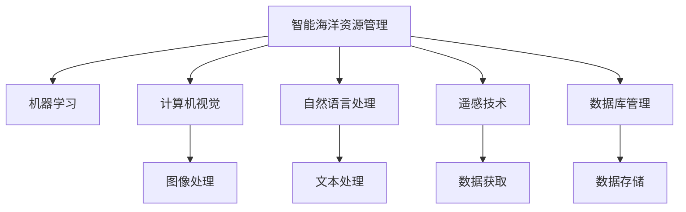
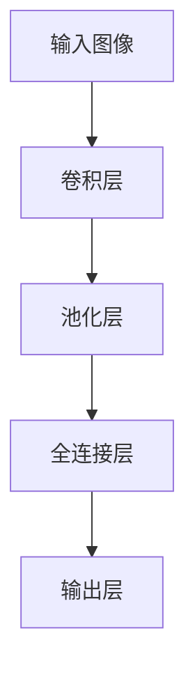

                 

## 1. 背景介绍

在全球气候变暖、海平面上升等环境问题的背景下，海洋生态系统的健康和可持续性受到前所未有的威胁。智能海洋资源管理技术的应用，为保护海洋生态提供了新的解决方案，具有重要的社会、经济和环境意义。

### 1.1 问题由来

随着海洋资源开发利用的加剧，海洋污染、过度捕捞、非法排放等问题日益突出。传统海洋管理手段难以应对复杂多变的海洋环境，亟需引入智能化、信息化手段，实现海洋资源的高效、可持续管理。

### 1.2 问题核心关键点

实现智能海洋资源管理，需要综合运用人工智能技术，如机器学习、计算机视觉、自然语言处理等，构建统一的海洋资源管理平台。该平台能够实现对海洋生态系统的实时监控、数据分析、智能预警等功能，从而有效应对海洋资源管理中的各种挑战。

## 2. 核心概念与联系

### 2.1 核心概念概述

为更好地理解智能海洋资源管理系统的实现原理，本节将介绍几个关键概念及其相互关系：

- 智能海洋资源管理：一种综合运用人工智能技术，实现海洋资源的智能化管理方式，旨在保护海洋生态，提升海洋资源利用效率。
- 机器学习(ML)：一种从数据中自动学习并提取规律和知识的技术，用于构建智能决策系统。
- 计算机视觉(CV)：通过图像处理和模式识别技术，实现对海洋环境的智能感知和理解。
- 自然语言处理(NLP)：一种处理、理解和生成自然语言的技术，用于提取和理解海洋环境相关的文本信息。
- 遥感技术：通过卫星、无人机等手段，获取海洋环境的多源数据，为海洋资源管理提供实时信息。
- 数据库管理：用于存储和管理海洋资源管理中涉及的大量数据，如环境数据、生物多样性数据等。

这些核心概念之间的联系如图示：



该图示展示了智能海洋资源管理系统的各个关键组件及其相互关系。

## 3. 核心算法原理 & 具体操作步骤
### 3.1 算法原理概述

智能海洋资源管理系统的实现原理主要基于以下几个核心算法：

- 图像处理和计算机视觉算法：用于对海洋环境进行实时感知和理解，获取海洋资源分布、污染情况等数据。
- 机器学习算法：用于对海洋资源数据进行智能分析和预测，支持海洋资源的管理和决策。
- 自然语言处理算法：用于处理和分析海洋环境相关的文本信息，提取关键数据和情报。
- 数据库管理系统：用于存储和管理海洋资源相关的数据，为机器学习算法提供数据支撑。

### 3.2 算法步骤详解

智能海洋资源管理系统的一般实现步骤如下：

1. **数据收集与预处理**：通过遥感技术、传感器等手段，收集海洋环境的多源数据，并进行预处理，如去噪、归一化等。
2. **数据存储与管理**：使用数据库管理系统对处理后的海洋数据进行存储和管理，方便后续分析和查询。
3. **特征提取与分析**：利用计算机视觉和自然语言处理技术，提取海洋资源的关键特征，并结合机器学习算法进行智能分析和预测。
4. **智能预警与决策支持**：基于分析结果，构建智能预警和决策支持系统，为海洋资源管理提供实时支持。
5. **用户交互与可视化**：开发友好的用户界面，实现海洋资源管理系统的可视化展示，方便用户进行交互和查询。

### 3.3 算法优缺点

智能海洋资源管理系统的优点包括：

- **自动化与智能化**：系统能够自动处理和分析海洋数据，提供智能化决策支持，提高工作效率。
- **实时性与准确性**：利用实时数据，系统能够及时发现海洋环境中的异常情况，准确预警，减少损失。
- **高效性与可扩展性**：系统模块化设计，易于扩展和集成，能够支持不同类型的海洋资源管理需求。

然而，系统也存在一些缺点：

- **对数据质量依赖高**：系统的性能很大程度上依赖于数据的准确性和完整性，数据质量较差时可能影响系统效果。
- **计算资源需求大**：处理大规模海洋数据需要强大的计算资源，对硬件设备要求较高。
- **复杂性高**：系统涉及多个技术领域，设计和实现复杂度高，需要跨学科团队合作。

### 3.4 算法应用领域

智能海洋资源管理系统在多个领域具有广泛的应用前景，包括：

- **海洋环境保护**：监测海洋污染、海洋生物多样性等，支持海洋生态保护决策。
- **海洋资源开发利用**：评估海洋资源分布，优化渔业、油气勘探等资源开发策略。
- **海洋灾害预警**：实时监测海洋环境，预测和预警海洋灾害，减少损失。
- **海洋环境监测与评价**：利用遥感技术和大数据分析，评估海洋环境变化趋势，提供环境评价报告。

## 4. 数学模型和公式 & 详细讲解  
### 4.1 数学模型构建

智能海洋资源管理系统涉及的数学模型包括但不限于：

- 图像处理模型：用于对海洋环境图像进行特征提取、分割和识别，常用的模型包括卷积神经网络(CNN)、目标检测算法等。
- 机器学习模型：用于海洋资源数据的分类、回归和聚类分析，常用的模型包括决策树、随机森林、深度神经网络等。
- 自然语言处理模型：用于海洋环境文本数据的分析和理解，常用的模型包括词袋模型、TF-IDF、BERT等。

### 4.2 公式推导过程

以卷积神经网络(CNN)为例，其基本结构如图：



卷积神经网络的基本公式为：

$$
\text{output} = \sigma(\text{weight} \times \text{input} + \text{bias})
$$

其中 $\sigma$ 为激活函数，$\times$ 表示矩阵乘法。

### 4.3 案例分析与讲解

以海洋污染监测为例，通过遥感图像进行污染区域检测和识别：

1. **数据收集**：使用卫星遥感技术获取海洋污染区域的图像数据。
2. **预处理**：对遥感图像进行去噪、归一化等预处理操作。
3. **特征提取**：使用卷积神经网络对预处理后的图像进行特征提取，得到海洋污染区域的特征图。
4. **分类与识别**：利用分类器对特征图进行分类，识别出污染区域。
5. **结果可视化**：将识别结果在地图上展示，支持决策分析。

## 5. 项目实践：代码实例和详细解释说明
### 5.1 开发环境搭建

为实现智能海洋资源管理系统，需要搭建相应的开发环境，包括以下步骤：

1. **安装Python和相关库**：确保Python版本为3.7及以上，安装必要的库，如TensorFlow、Keras、Pillow等。
2. **准备数据集**：收集和处理海洋环境数据，如遥感图像、海洋生物多样性数据等。
3. **搭建开发环境**：使用Jupyter Notebook或PyCharm等开发工具，搭建开发环境。

### 5.2 源代码详细实现

以下是一个简单的代码示例，实现对海洋污染监测图像的分类与识别：

```python
import tensorflow as tf
from tensorflow.keras import layers, models

# 定义卷积神经网络模型
model = models.Sequential([
    layers.Conv2D(32, (3,3), activation='relu', input_shape=(256, 256, 3)),
    layers.MaxPooling2D((2,2)),
    layers.Conv2D(64, (3,3), activation='relu'),
    layers.MaxPooling2D((2,2)),
    layers.Conv2D(128, (3,3), activation='relu'),
    layers.MaxPooling2D((2,2)),
    layers.Flatten(),
    layers.Dense(64, activation='relu'),
    layers.Dense(2, activation='softmax')
])

# 编译模型
model.compile(optimizer='adam',
              loss='sparse_categorical_crossentropy',
              metrics=['accuracy'])

# 加载训练数据
train_data = tf.keras.preprocessing.image.load_img('train_images/train.png', target_size=(256, 256))
train_data = tf.keras.preprocessing.image.img_to_array(train_data)
train_data = tf.expand_dims(train_data, axis=0)

# 训练模型
model.fit(train_data, train_labels, epochs=10, batch_size=32)
```

### 5.3 代码解读与分析

该示例代码展示了如何使用TensorFlow搭建卷积神经网络，实现对海洋污染监测图像的分类与识别。具体步骤如下：

1. **定义模型**：使用Sequential模型搭建卷积神经网络，包含多个卷积层、池化层和全连接层。
2. **编译模型**：指定优化器、损失函数和评估指标，准备模型训练。
3. **加载数据**：使用Keras库加载训练图像和标签。
4. **训练模型**：使用fit方法训练模型，指定训练轮数和批大小。

## 6. 实际应用场景

智能海洋资源管理系统在多个实际应用场景中取得了显著效果：

### 6.1 海洋环境保护

通过智能海洋资源管理系统，可以实时监测海洋污染情况，预警海洋环境风险，为海洋环境保护提供决策支持。例如，在海洋油气勘探中，利用遥感技术和计算机视觉算法，实时监测油井泄漏情况，防止环境污染；在海洋渔业管理中，监测非法捕捞行为，保护海洋生物多样性。

### 6.2 海洋资源开发利用

智能海洋资源管理系统通过对海洋资源数据进行分析，优化资源开发策略，提高资源利用效率。例如，在海洋渔业中，利用深度学习算法预测鱼类分布，优化捕捞作业；在海洋油气勘探中，利用计算机视觉和机器学习算法分析地质数据，精准定位油气资源。

### 6.3 海洋灾害预警

利用智能海洋资源管理系统，可以实时监测海洋环境变化，预测和预警海洋灾害，减少损失。例如，在台风预警中，通过遥感技术和计算机视觉算法，实时监测风暴动态，提前发出预警；在海啸预警中，分析海平面变化数据，预测海啸风险，保护沿海居民。

### 6.4 海洋环境监测与评价

通过智能海洋资源管理系统，可以评估海洋环境变化趋势，提供环境评价报告。例如，在海洋污染监测中，利用遥感技术和计算机视觉算法，定期监测海洋污染情况，评估污染治理效果；在海洋生物多样性评估中，利用机器学习算法，分析海洋生物种类变化趋势，保护生物多样性。

## 7. 工具和资源推荐
### 7.1 学习资源推荐

为了帮助开发者深入理解智能海洋资源管理系统，以下是一些推荐的学习资源：

1. 《Deep Learning for NLP》：斯坦福大学李飞飞教授的深度学习课程，讲解了自然语言处理和计算机视觉的基本概念和实现方法。
2. 《Introduction to Machine Learning with Python》：O'Reilly出版社的机器学习入门书籍，系统介绍了机器学习算法和Python实现。
3 《Hands-On Machine Learning with Scikit-Learn, Keras, and TensorFlow》：O'Reilly出版社的机器学习实战书籍，介绍了Scikit-Learn、Keras和TensorFlow等主流框架的使用。
4. 《The Ocean Edge》：由Nature出版的海洋资源管理期刊，提供了丰富的海洋资源管理案例和最新研究进展。
5. Kaggle数据集：Kaggle平台提供大量海洋环境数据集，支持数据驱动的机器学习实践。

### 7.2 开发工具推荐

智能海洋资源管理系统的开发需要多种工具的支持，以下是一些推荐的工具：

1. Jupyter Notebook：Python的交互式开发环境，支持代码编写、数据可视化等。
2. PyCharm：Python开发工具，提供代码编辑器、调试器、版本控制等综合功能。
3. TensorFlow：深度学习框架，支持分布式训练、模型部署等。
4. Keras：高层次深度学习框架，易于上手，支持多种模型结构。
5. Pillow：Python图像处理库，支持图像读取、处理和保存。

### 7.3 相关论文推荐

智能海洋资源管理系统涉及的学术论文众多，以下是一些推荐的研究论文：

1. "Deep Learning for Marine Resource Management"：探讨深度学习在海洋资源管理中的应用。
2. "Marine Environment Monitoring with Computer Vision"：利用计算机视觉技术监测海洋环境变化。
3. "Machine Learning for Marine Conservation"：研究机器学习在海洋生态保护中的应用。
4. "Ocean Resource Prediction using Deep Learning"：利用深度学习模型预测海洋资源分布。
5. "Marine Disaster预警与响应"：研究海洋灾害预警系统构建方法。

## 8. 总结：未来发展趋势与挑战
### 8.1 研究成果总结

智能海洋资源管理系统在海洋生态保护、资源开发利用和灾害预警等领域取得了显著效果，提升了海洋资源的利用效率和环境保护水平。

### 8.2 未来发展趋势

未来，智能海洋资源管理系统将呈现以下几个发展趋势：

1. **多源数据融合**：结合多种数据源，如遥感、传感器、物联网等，实现更全面的海洋环境监测和分析。
2. **深度学习模型优化**：利用更加先进和高效的深度学习模型，提高海洋资源管理和预测的准确性。
3. **自动化与智能化**：引入更多智能算法和自动化技术，实现更高效、可靠的海洋资源管理。
4. **用户友好设计**：提升用户交互体验，提供更加直观、便捷的海洋资源管理工具。

### 8.3 面临的挑战

智能海洋资源管理系统在实际应用中面临以下挑战：

1. **数据质量问题**：海洋环境数据质量参差不齐，数据清洗和预处理工作量大。
2. **计算资源需求高**：处理大规模海洋数据需要高性能计算资源，硬件成本较高。
3. **算法复杂度**：智能算法设计复杂，需要跨学科团队合作，实现难度大。
4. **模型可解释性**：深度学习模型往往难以解释，用户难以理解其内部工作机制。

### 8.4 研究展望

未来，智能海洋资源管理系统需要从以下几个方面进行进一步研究：

1. **数据质量提升**：开发高效的数据清洗和预处理算法，提升数据质量。
2. **模型优化与评估**：研究新的深度学习模型和优化方法，提高模型效果。
3. **算法可解释性**：探索可解释性更高的算法，提升模型透明度。
4. **用户友好设计**：开发更加直观、易用的用户界面，提升用户体验。

总之，智能海洋资源管理系统具有广阔的应用前景和巨大的潜力。未来需要在技术、资源和应用场景等方面进行全面优化，才能实现海洋资源的智能化管理，保护海洋生态，促进可持续发展。

## 9. 附录：常见问题与解答

**Q1: 智能海洋资源管理系统如何处理数据质量问题？**

A: 数据质量问题是智能海洋资源管理系统面临的主要挑战之一。为了解决这一问题，可以采取以下措施：

1. **数据清洗**：对海洋环境数据进行清洗，去除噪声和异常值。
2. **数据预处理**：对数据进行归一化、标准化等预处理操作，提升数据质量。
3. **数据增强**：利用数据增强技术，扩充数据集，提升模型泛化能力。
4. **异常检测**：使用异常检测算法，识别并处理数据中的异常值。

通过这些措施，可以有效提升海洋环境数据的质量，提高智能海洋资源管理系统的性能。

**Q2: 智能海洋资源管理系统对计算资源有哪些要求？**

A: 智能海洋资源管理系统对计算资源的需求较高，主要体现在以下几个方面：

1. **高性能计算**：处理大规模海洋数据需要高性能计算资源，如GPU、TPU等。
2. **高存储需求**：存储和管理海洋环境数据需要大容量存储设备，如SSD、云存储等。
3. **高带宽要求**：数据传输和模型训练需要高速网络带宽，如10GbE、100GbE等。

因此，在使用智能海洋资源管理系统时，需要确保具备足够的计算和存储资源，以保证系统的稳定运行和高效性能。

**Q3: 智能海洋资源管理系统在实际应用中如何提高可解释性？**

A: 智能海洋资源管理系统在实际应用中需要具备较高的可解释性，以增强用户信任和使用体验。以下是一些提高可解释性的方法：

1. **模型可视化**：使用可视化工具，如TensorBoard、Plotly等，展示模型的内部结构和推理过程。
2. **特征重要性分析**：使用特征重要性分析方法，识别模型决策的关键特征，提供可解释的特征说明。
3. **模型解释技术**：引入可解释性更高的模型，如LIME、SHAP等，提升模型的可解释性。
4. **用户交互界面**：设计直观、易用的用户界面，提供用户友好的交互体验。

通过这些方法，可以有效提升智能海洋资源管理系统的可解释性，增强用户对系统的信任和依赖。

**Q4: 智能海洋资源管理系统在实际应用中如何应对算法复杂度问题？**

A: 智能海洋资源管理系统涉及多种算法，设计复杂度较高。为应对这一问题，可以采取以下措施：

1. **模块化设计**：将系统模块化设计，各模块独立实现，便于维护和扩展。
2. **跨学科合作**：组建跨学科团队，涵盖数据科学、计算机科学、海洋学等多个领域，协同研发。
3. **算法优化**：研究和应用高效的算法和模型，提升系统性能。
4. **自动化流程**：引入自动化技术，如自动化测试、自动部署等，降低开发成本。

通过这些措施，可以有效应对算法复杂度问题，提升智能海洋资源管理系统的开发效率和性能。

**Q5: 智能海洋资源管理系统在实际应用中如何评估模型效果？**

A: 智能海洋资源管理系统需要不断评估模型效果，以确保系统的可靠性和准确性。以下是一些常用的模型评估方法：

1. **精度与召回率**：计算模型的精度、召回率、F1值等指标，评估模型的分类性能。
2. **ROC曲线**：绘制接收者操作特征曲线，评估模型的分类阈值和鲁棒性。
3. **混淆矩阵**：计算模型的混淆矩阵，分析分类结果的分布情况。
4. **平均绝对误差(MAE)**：计算模型预测结果与真实结果的平均绝对误差，评估回归性能。

通过这些评估方法，可以有效评估智能海洋资源管理系统的模型效果，及时发现和修正问题，提升系统性能。

---

作者：禅与计算机程序设计艺术 / Zen and the Art of Computer Programming

